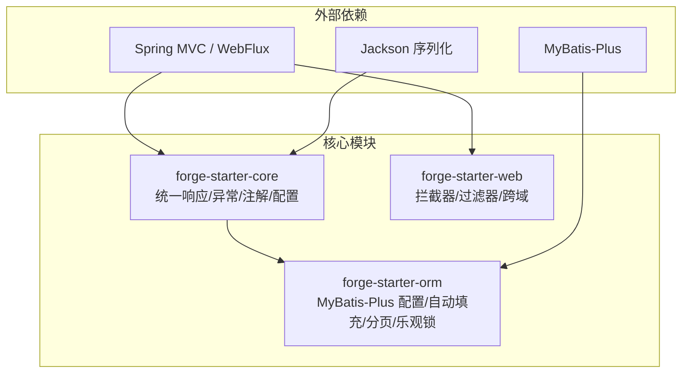
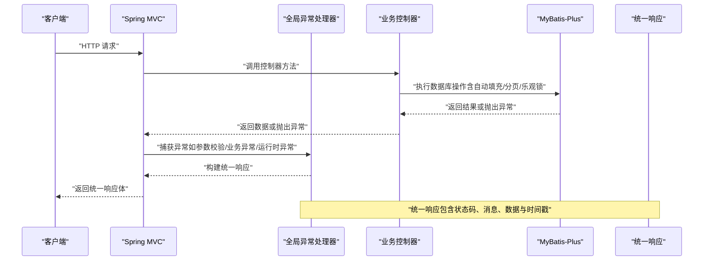
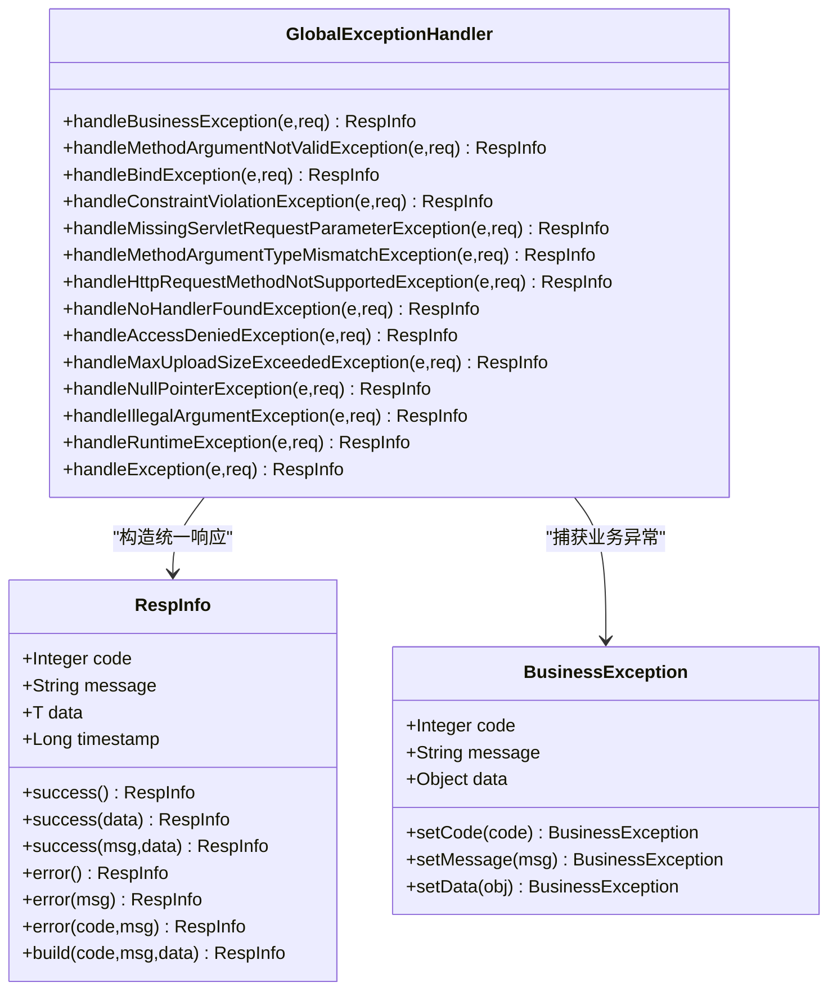
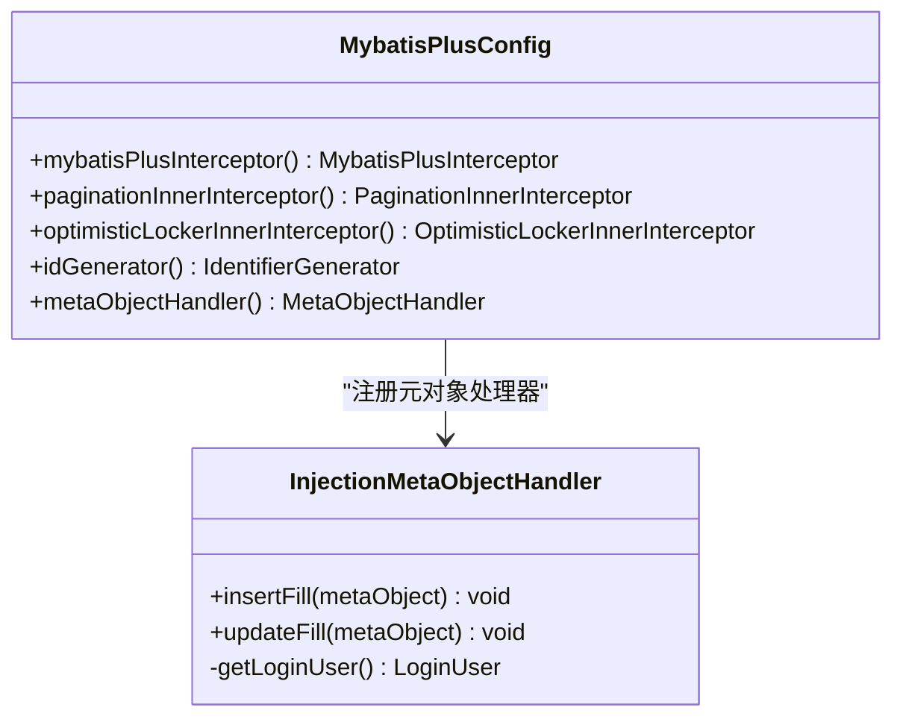
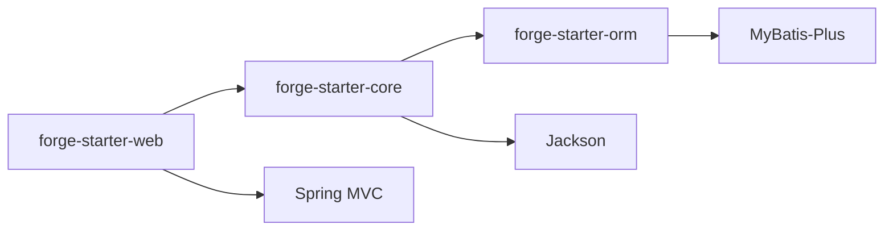

# 核心模块

<cite>
**本文引用的文件**
- [forge-starter-core 异常处理器](file://forge/forge-framework/forge-starter-parent/forge-starter-core/src/main/java/com/mdframe/forge/starter/core/exception/GlobalExceptionHandler.java)
- [forge-starter-core 统一响应封装](file://forge/forge-framework/forge-starter-parent/forge-starter-core/src/main/java/com/mdframe/forge/starter/core/domain/RespInfo.java)
- [forge-starter-core 业务异常类](file://forge/forge-framework/forge-starter-parent/forge-starter-core/src/main/java/com/mdframe/forge/starter/core/exception/BusinessException.java)
- [forge-starter-orm MyBatis-Plus 配置](file://forge/forge-framework/forge-starter-parent/forge-starter-orm/src/main/java/com/mdframe/forge/starter/orm/config/MybatisPlusConfig.java)
- [forge-starter-orm 注入式元对象处理器](file://forge/forge-framework/forge-starter-parent/forge-starter-orm/src/main/java/com/mdframe/forge/starter/orm/handler/InjectionMetaObjectHandler.java)
</cite>

## 目录
1. [简介](#简介)
2. [项目结构](#项目结构)
3. [核心组件](#核心组件)
4. [架构总览](#架构总览)
5. [详细组件分析](#详细组件分析)
6. [依赖关系分析](#依赖关系分析)
7. [性能考量](#性能考量)
8. [故障排查指南](#故障排查指南)
9. [结论](#结论)
10. [附录](#附录)

## 简介
本文件聚焦于 Forge 核心模块，系统性解析以下三个基础模块的设计与实现：
- forge-starter-core：统一异常处理、全局统一响应、注解体系与配置管理等
- forge-starter-web：Web 层拦截器、过滤器、跨域处理等能力的封装入口
- forge-starter-orm：MyBatis-Plus 集成、自动填充、分页查询、乐观锁等特性

文档以“从上到下”的方式逐步展开：先给出整体架构与模块职责，再深入到关键组件与流程图示，最后提供性能与排障建议，帮助开发者快速理解框架基础架构与扩展点。

## 项目结构
Forge 的核心模块位于 forge/forge-framework/forge-starter-parent 下，采用“按功能域划分”的多模块组织方式。其中：
- forge-starter-core 提供统一响应、异常处理、注解与配置等基础设施
- forge-starter-web 提供 Web 层扩展点（拦截器、过滤器、跨域等）
- forge-starter-orm 提供 ORM 能力（MyBatis-Plus 配置、自动填充、分页与乐观锁）

**图表来源**
- [forge-starter-core 异常处理器](file://forge/forge-framework/forge-starter-parent/forge-starter-core/src/main/java/com/mdframe/forge/starter/core/exception/GlobalExceptionHandler.java#L28-L175)
- [forge-starter-orm MyBatis-Plus 配置](file://forge/forge-framework/forge-starter-parent/forge-starter-orm/src/main/java/com/mdframe/forge/starter/orm/config/MybatisPlusConfig.java#L27-L97)

**章节来源**
- [forge-starter-core 异常处理器](file://forge/forge-framework/forge-starter-parent/forge-starter-core/src/main/java/com/mdframe/forge/starter/core/exception/GlobalExceptionHandler.java#L24-L175)
- [forge-starter-orm MyBatis-Plus 配置](file://forge/forge-framework/forge-starter-parent/forge-starter-orm/src/main/java/com/mdframe/forge/starter/orm/config/MybatisPlusConfig.java#L22-L97)

## 核心组件
本节概述三大模块的关键职责与交互关系：
- 统一响应与异常处理：通过统一响应封装与全局异常处理器，保证接口返回一致性与错误语义清晰
- 注解与配置：提供权限忽略、加解密、日志记录、租户隔离等注解，以及 Jackson、BigNumber 等序列化配置
- ORM 能力：基于 MyBatis-Plus 的自动填充、分页、乐观锁与 ID 生成策略

**章节来源**
- [forge-starter-core 统一响应封装](file://forge/forge-framework/forge-starter-parent/forge-starter-core/src/main/java/com/mdframe/forge/starter/core/domain/RespInfo.java#L9-L97)
- [forge-starter-core 业务异常类](file://forge/forge-framework/forge-starter-parent/forge-starter-core/src/main/java/com/mdframe/forge/starter/core/exception/BusinessException.java#L5-L86)
- [forge-starter-orm 注入式元对象处理器](file://forge/forge-framework/forge-starter-parent/forge-starter-orm/src/main/java/com/mdframe/forge/starter/orm/handler/InjectionMetaObjectHandler.java#L15-L101)

## 架构总览
下图展示了“请求进入 -> 控制器 -> 异常处理 -> ORM 操作 -> 统一响应”的端到端流程：

**图表来源**
- [forge-starter-core 异常处理器](file://forge/forge-framework/forge-starter-parent/forge-starter-core/src/main/java/com/mdframe/forge/starter/core/exception/GlobalExceptionHandler.java#L35-L173)
- [forge-starter-core 统一响应封装](file://forge/forge-framework/forge-starter-parent/forge-starter-core/src/main/java/com/mdframe/forge/starter/core/domain/RespInfo.java#L41-L95)
- [forge-starter-orm MyBatis-Plus 配置](file://forge/forge-framework/forge-starter-parent/forge-starter-orm/src/main/java/com/mdframe/forge/starter/orm/config/MybatisPlusConfig.java#L38-L76)

## 详细组件分析

### 统一响应与异常处理（forge-starter-core）
- 统一响应封装：提供成功/失败/自定义三类静态工厂方法，统一输出 code、message、data、timestamp 字段；通过 Jackson 配置避免空字段污染
- 全局异常处理：覆盖参数校验、绑定、缺失参数、类型不匹配、请求方法不支持、404、403、文件大小超限、空指针、非法参数、运行时异常与未知异常，确保所有异常被规范化输出
- 业务异常：提供带状态码、消息与附加数据的业务异常基类，便于业务层抛出可预期的错误

**图表来源**
- [forge-starter-core 统一响应封装](file://forge/forge-framework/forge-starter-parent/forge-starter-core/src/main/java/com/mdframe/forge/starter/core/domain/RespInfo.java#L14-L95)
- [forge-starter-core 业务异常类](file://forge/forge-framework/forge-starter-parent/forge-starter-core/src/main/java/com/mdframe/forge/starter/core/exception/BusinessException.java#L9-L84)
- [forge-starter-core 异常处理器](file://forge/forge-framework/forge-starter-parent/forge-starter-core/src/main/java/com/mdframe/forge/starter/core/exception/GlobalExceptionHandler.java#L35-L173)

**章节来源**
- [forge-starter-core 统一响应封装](file://forge/forge-framework/forge-starter-parent/forge-starter-core/src/main/java/com/mdframe/forge/starter/core/domain/RespInfo.java#L9-L97)
- [forge-starter-core 业务异常类](file://forge/forge-framework/forge-starter-parent/forge-starter-core/src/main/java/com/mdframe/forge/starter/core/exception/BusinessException.java#L5-L86)
- [forge-starter-core 异常处理器](file://forge/forge-framework/forge-starter-parent/forge-starter-core/src/main/java/com/mdframe/forge/starter/core/exception/GlobalExceptionHandler.java#L24-L175)

### ORM 模块（forge-starter-orm）
- MyBatis-Plus 配置：集中注册拦截器链（自定义 InnerInterceptor + 分页 + 乐观锁），扫描 Mapper 包，启用事务代理，使用网卡信息绑定雪花 ID 生成器，避免集群重复
- 注入式元对象处理器：在插入/更新时自动填充创建时间、更新时间、创建人、更新人、创建部门等字段；当用户未登录时安全降级，避免强制依赖会话

**图表来源**
- [forge-starter-orm MyBatis-Plus 配置](file://forge/forge-framework/forge-starter-parent/forge-starter-orm/src/main/java/com/mdframe/forge/starter/orm/config/MybatisPlusConfig.java#L27-L97)
- [forge-starter-orm 注入式元对象处理器](file://forge/forge-framework/forge-starter-parent/forge-starter-orm/src/main/java/com/mdframe/forge/starter/orm/handler/InjectionMetaObjectHandler.java#L18-L100)

**章节来源**
- [forge-starter-orm MyBatis-Plus 配置](file://forge/forge-framework/forge-starter-parent/forge-starter-orm/src/main/java/com/mdframe/forge/starter/orm/config/MybatisPlusConfig.java#L22-L97)
- [forge-starter-orm 注入式元对象处理器](file://forge/forge-framework/forge-starter-parent/forge-starter-orm/src/main/java/com/mdframe/forge/starter/orm/handler/InjectionMetaObjectHandler.java#L15-L101)

### Web 层封装（forge-starter-web）
- 拦截器与过滤器：提供全局拦截器与过滤器扩展点，统一处理跨域、鉴权、日志、性能统计等横切关注点
- 跨域处理：集中配置 CORS 规则，支持预检请求、允许来源、头与凭证等
- 与核心模块协作：Web 层负责请求接入与横切处理，核心模块负责统一响应与异常处理，ORM 模块负责数据持久化

（本节为概念性说明，不直接分析具体源码文件）

## 依赖关系分析
- forge-starter-core 依赖 Spring MVC 与 Jackson，提供统一响应与异常处理
- forge-starter-orm 依赖 MyBatis-Plus，提供分页、乐观锁与自动填充
- Web 层依赖 Spring MVC，负责拦截器、过滤器与跨域配置

**图表来源**
- [forge-starter-core 异常处理器](file://forge/forge-framework/forge-starter-parent/forge-starter-core/src/main/java/com/mdframe/forge/starter/core/exception/GlobalExceptionHandler.java#L28-L175)
- [forge-starter-orm MyBatis-Plus 配置](file://forge/forge-framework/forge-starter-parent/forge-starter-orm/src/main/java/com/mdframe/forge/starter/orm/config/MybatisPlusConfig.java#L27-L97)

**章节来源**
- [forge-starter-core 异常处理器](file://forge/forge-framework/forge-starter-parent/forge-starter-core/src/main/java/com/mdframe/forge/starter/core/exception/GlobalExceptionHandler.java#L24-L175)
- [forge-starter-orm MyBatis-Plus 配置](file://forge/forge-framework/forge-starter-parent/forge-starter-orm/src/main/java/com/mdframe/forge/starter/orm/config/MybatisPlusConfig.java#L22-L97)

## 性能考量
- 统一异常处理：减少分支判断与重复封装，降低控制器复杂度，提升可观测性
- ORM 自动填充：在插入/更新时批量填充公共字段，避免重复赋值，但需注意实体字段映射与空值判定
- MyBatis-Plus 分页：建议结合数据库方言与合理页大小，避免超大偏移导致慢查询
- 乐观锁：对高并发写场景有效，但需注意冲突重试与业务补偿
- ID 生成：基于网卡信息的雪花算法可避免集群重复，部署时需确保网络适配器稳定

（本节为通用指导，不直接分析具体源码文件）

## 故障排查指南
- 参数校验失败：检查请求体/路径/查询参数是否符合校验注解要求，查看统一响应中的错误消息
- 业务异常：捕获 BusinessException 并核对 code/message/data，定位业务规则触发点
- 运行时异常：查看全局异常处理器对未知异常的兜底响应，结合日志定位根因
- 文件上传超限：调整最大上传大小配置，确认前端上传体积是否超过后端限制
- 自动填充异常：检查实体是否继承基类、会话中是否存在登录用户、字段映射是否正确

**章节来源**
- [forge-starter-core 异常处理器](file://forge/forge-framework/forge-starter-parent/forge-starter-core/src/main/java/com/mdframe/forge/starter/core/exception/GlobalExceptionHandler.java#L47-L173)
- [forge-starter-core 业务异常类](file://forge/forge-framework/forge-starter-parent/forge-starter-core/src/main/java/com/mdframe/forge/starter/core/exception/BusinessException.java#L29-L84)
- [forge-starter-orm 注入式元对象处理器](file://forge/forge-framework/forge-starter-parent/forge-starter-orm/src/main/java/com/mdframe/forge/starter/orm/handler/InjectionMetaObjectHandler.java#L26-L81)

## 结论
Forge 核心模块通过统一响应与异常处理、ORM 自动填充与分页、以及 Web 层横切能力，构建了高内聚、低耦合且易于扩展的基础框架。开发者可在保持一致性的前提下，快速实现业务功能并按需扩展横切关注点。

## 附录
- 统一响应字段说明
  - code：业务状态码
  - message：提示信息
  - data：业务数据
  - timestamp：响应时间戳
- 异常处理覆盖范围
  - 参数校验、绑定、缺失参数、类型不匹配、请求方法不支持、404、403、文件大小超限、空指针、非法参数、运行时异常与未知异常
- ORM 默认能力
  - 分页插件、乐观锁插件、自动填充（创建/更新时间与用户信息）、雪花 ID 生成器

**章节来源**
- [forge-starter-core 统一响应封装](file://forge/forge-framework/forge-starter-parent/forge-starter-core/src/main/java/com/mdframe/forge/starter/core/domain/RespInfo.java#L21-L46)
- [forge-starter-core 异常处理器](file://forge/forge-framework/forge-starter-parent/forge-starter-core/src/main/java/com/mdframe/forge/starter/core/exception/GlobalExceptionHandler.java#L35-L173)
- [forge-starter-orm MyBatis-Plus 配置](file://forge/forge-framework/forge-starter-parent/forge-starter-orm/src/main/java/com/mdframe/forge/starter/orm/config/MybatisPlusConfig.java#L38-L76)