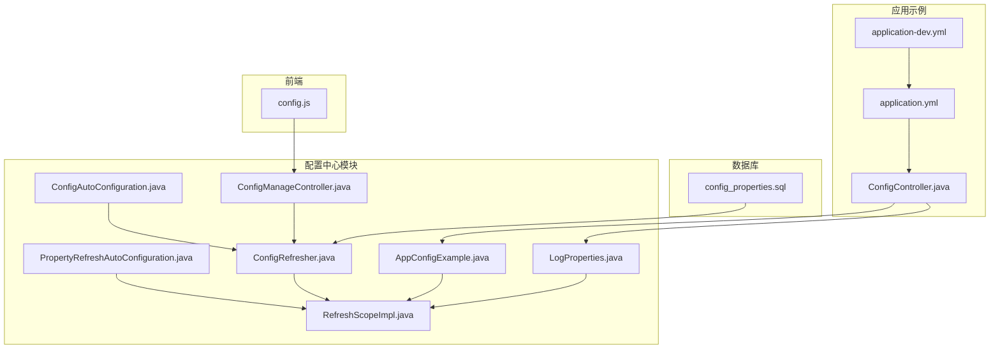
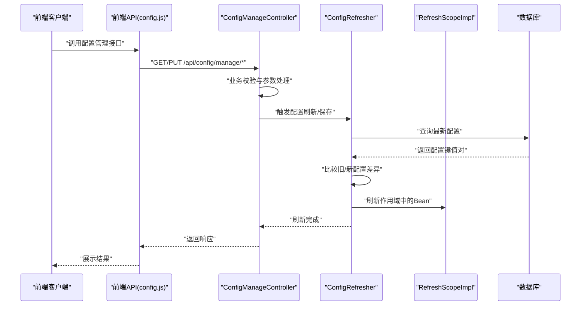
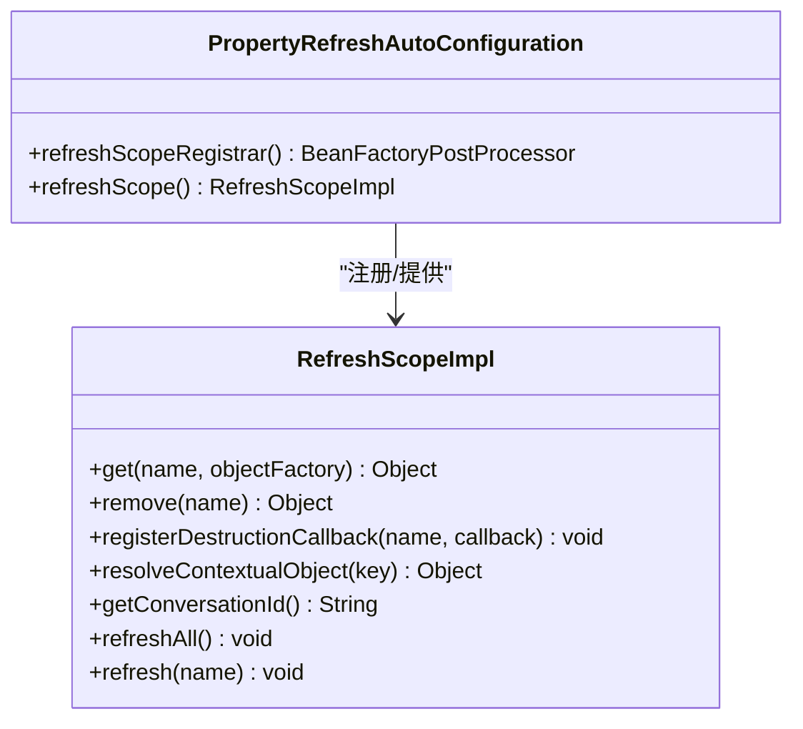
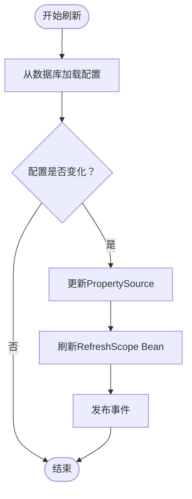
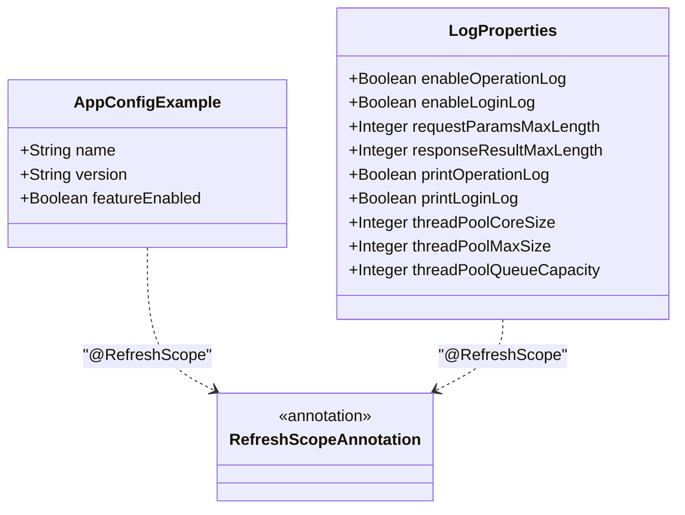
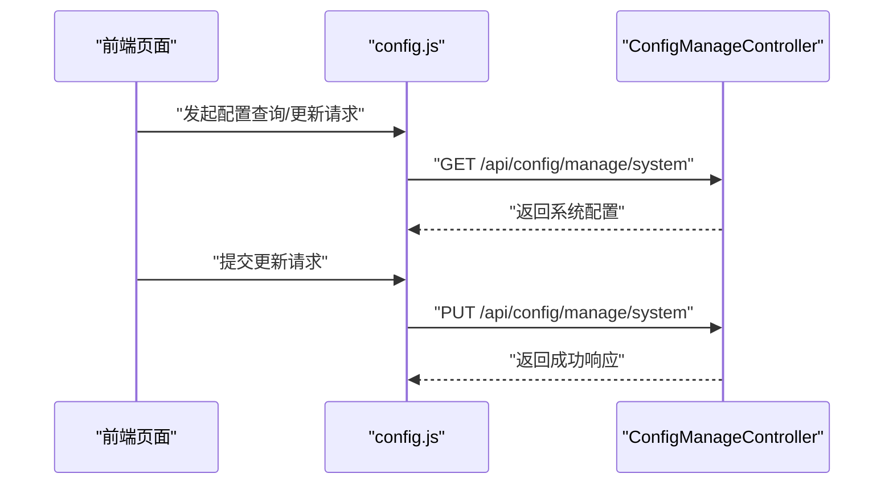
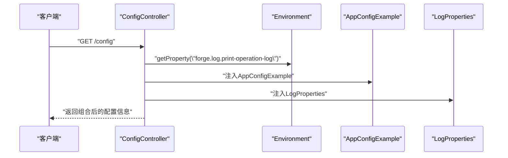
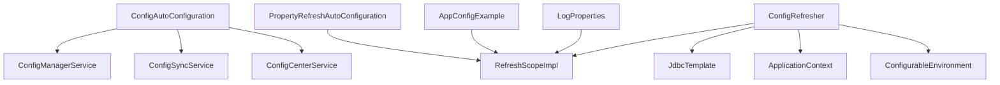

# 配置使用示例

<cite>
**本文引用的文件**
- [USAGE_EXAMPLE.md](file://forge/forge-framework/forge-starter-parent/forge-starter-config/USAGE_EXAMPLE.md)
- [ConfigAutoConfiguration.java](file://forge/forge-framework/forge-starter-parent/forge-starter-config/src/main/java/com/mdframe/forge/starter/config/config/ConfigAutoConfiguration.java)
- [PropertyRefreshAutoConfiguration.java](file://forge/forge-framework/forge-starter-parent/forge-starter-config/src/main/java/com/mdframe/forge/starter/property/config/PropertyRefreshAutoConfiguration.java)
- [RefreshScopeImpl.java](file://forge/forge-framework/forge-starter-parent/forge-starter-config/src/main/java/com/mdframe/forge/starter/property/scope/RefreshScopeImpl.java)
- [ConfigRefresher.java](file://forge/forge-framework/forge-starter-parent/forge-starter-config/src/main/java/com/mdframe/forge/starter/property/refresh/ConfigRefresher.java)
- [AppConfigExample.java](file://forge/forge-framework/forge-starter-parent/forge-starter-config/src/main/java/com/mdframe/forge/starter/property/example/AppConfigExample.java)
- [LogProperties.java](file://forge/forge-framework/forge-starter-parent/forge-starter-core/src/main/java/com/mdframe/forge/starter/core/context/LogProperties.java)
- [ConfigManageController.java](file://forge/forge-framework/forge-starter-parent/forge-starter-config/src/main/java/com/mdframe/forge/starter/config/controller/ConfigManageController.java)
- [ConfigController.java](file://forge/forge-admin/src/main/java/com/mdframe/forge/admin/ConfigController.java)
- [application.yml](file://forge/forge-admin/src/main/resources/application.yml)
- [application-dev.yml](file://forge/forge-admin/src/main/resources/application-dev.yml)
- [config.js](file://forge-admin-ui/src/api/config.js)
- [config_properties.sql](file://forge/forge-framework/forge-starter-parent/forge-starter-config/sql/config_properties.sql)
</cite>

## 目录
1. [简介](#简介)
2. [项目结构](#项目结构)
3. [核心组件](#核心组件)
4. [架构总览](#架构总览)
5. [详细组件分析](#详细组件分析)
6. [依赖关系分析](#依赖关系分析)
7. [性能考量](#性能考量)
8. [故障排查指南](#故障排查指南)
9. [结论](#结论)
10. [附录](#附录)

## 简介
本指南围绕Forge配置中心的使用示例，提供从基础配置读取、动态配置更新到配置监听的完整实践路径。重点解析AppConfigExample应用配置示例的实现方式与最佳实践，覆盖Spring Boot配置、自定义配置类与配置注入等场景，并给出常见问题的解决方案与调试技巧。

## 项目结构
Forge配置相关能力主要分布在以下模块与文件：
- 启动器与自动装配：配置自动装配、属性刷新自动装配
- 配置刷新与作用域：自定义Refresh作用域、配置刷新器
- 示例与控制器：AppConfigExample示例、配置管理控制器、应用配置控制器
- 配置样例与YAML：admin应用配置、开发环境配置
- 前端API：配置管理接口调用

图表来源
- [ConfigAutoConfiguration.java](file://forge/forge-framework/forge-starter-parent/forge-starter-config/src/main/java/com/mdframe/forge/starter/config/config/ConfigAutoConfiguration.java#L14-L47)
- [PropertyRefreshAutoConfiguration.java](file://forge/forge-framework/forge-starter-parent/forge-starter-config/src/main/java/com/mdframe/forge/starter/property/config/PropertyRefreshAutoConfiguration.java#L1-L34)
- [RefreshScopeImpl.java](file://forge/forge-framework/forge-starter-parent/forge-starter-config/src/main/java/com/mdframe/forge/starter/property/scope/RefreshScopeImpl.java#L1-L58)
- [ConfigRefresher.java](file://forge/forge-framework/forge-starter-parent/forge-starter-config/src/main/java/com/mdframe/forge/starter/property/refresh/ConfigRefresher.java#L15-L86)
- [AppConfigExample.java](file://forge/forge-framework/forge-starter-parent/forge-starter-config/src/main/java/com/mdframe/forge/starter/property/example/AppConfigExample.java#L1-L40)
- [LogProperties.java](file://forge/forge-framework/forge-starter-parent/forge-starter-core/src/main/java/com/mdframe/forge/starter/core/context/LogProperties.java#L1-L71)
- [ConfigManageController.java](file://forge/forge-framework/forge-starter-parent/forge-starter-config/src/main/java/com/mdframe/forge/starter/config/controller/ConfigManageController.java#L41-L162)
- [ConfigController.java](file://forge/forge-admin/src/main/java/com/mdframe/forge/admin/ConfigController.java#L1-L38)
- [application.yml](file://forge/forge-admin/src/main/resources/application.yml#L1-L100)
- [application-dev.yml](file://forge/forge-admin/src/main/resources/application-dev.yml#L1-L70)
- [config.js](file://forge-admin-ui/src/api/config.js#L73-L142)
- [config_properties.sql](file://forge/forge-framework/forge-starter-parent/forge-starter-config/sql/config_properties.sql)

章节来源
- [ConfigAutoConfiguration.java](file://forge/forge-framework/forge-starter-parent/forge-starter-config/src/main/java/com/mdframe/forge/starter/config/config/ConfigAutoConfiguration.java#L14-L47)
- [PropertyRefreshAutoConfiguration.java](file://forge/forge-framework/forge-starter-parent/forge-starter-config/src/main/java/com/mdframe/forge/starter/property/config/PropertyRefreshAutoConfiguration.java#L1-L34)
- [RefreshScopeImpl.java](file://forge/forge-framework/forge-starter-parent/forge-starter-config/src/main/java/com/mdframe/forge/starter/property/scope/RefreshScopeImpl.java#L1-L58)
- [ConfigRefresher.java](file://forge/forge-framework/forge-starter-parent/forge-starter-config/src/main/java/com/mdframe/forge/starter/property/refresh/ConfigRefresher.java#L15-L86)
- [AppConfigExample.java](file://forge/forge-framework/forge-starter-parent/forge-starter-config/src/main/java/com/mdframe/forge/starter/property/example/AppConfigExample.java#L1-L40)
- [LogProperties.java](file://forge/forge-framework/forge-starter-parent/forge-starter-core/src/main/java/com/mdframe/forge/starter/core/context/LogProperties.java#L1-L71)
- [ConfigManageController.java](file://forge/forge-framework/forge-starter-parent/forge-starter-config/src/main/java/com/mdframe/forge/starter/config/controller/ConfigManageController.java#L41-L162)
- [ConfigController.java](file://forge/forge-admin/src/main/java/com/mdframe/forge/admin/ConfigController.java#L1-L38)
- [application.yml](file://forge/forge-admin/src/main/resources/application.yml#L1-L100)
- [application-dev.yml](file://forge/forge-admin/src/main/resources/application-dev.yml#L1-L70)
- [config.js](file://forge-admin-ui/src/api/config.js#L73-L142)
- [config_properties.sql](file://forge/forge-framework/forge-starter-parent/forge-starter-config/sql/config_properties.sql)

## 核心组件
- 配置自动装配：负责注册配置管理、转换、同步与中心服务的Bean，确保配置中心可用。
- 属性刷新自动装配：注册自定义Refresh作用域，启用定时调度以支持配置动态刷新。
- 自定义Refresh作用域：提供按名称缓存与销毁回调，支持刷新指定或全部Bean。
- 配置刷新器：从数据库加载配置，比较差异，更新PropertySource并刷新RefreshScope Bean，同时发布事件。
- 示例配置类：AppConfigExample展示如何使用@RefreshScope与@ConfigurationProperties进行动态配置绑定。
- 日志配置属性：LogProperties展示如何通过@ConfigurationProperties绑定命名空间配置，并支持动态刷新。
- 配置管理控制器：提供系统、安全、加解密、认证、日志、水印等配置的查询与更新接口。
- 应用配置控制器：演示如何通过@Value、Environment与配置类读取数据库驱动配置。
- 前端API：封装配置管理REST接口，便于前端调用。

章节来源
- [ConfigAutoConfiguration.java](file://forge/forge-framework/forge-starter-parent/forge-starter-config/src/main/java/com/mdframe/forge/starter/config/config/ConfigAutoConfiguration.java#L14-L47)
- [PropertyRefreshAutoConfiguration.java](file://forge/forge-framework/forge-starter-parent/forge-starter-config/src/main/java/com/mdframe/forge/starter/property/config/PropertyRefreshAutoConfiguration.java#L1-L34)
- [RefreshScopeImpl.java](file://forge/forge-framework/forge-starter-parent/forge-starter-config/src/main/java/com/mdframe/forge/starter/property/scope/RefreshScopeImpl.java#L1-L58)
- [ConfigRefresher.java](file://forge/forge-framework/forge-starter-parent/forge-starter-config/src/main/java/com/mdframe/forge/starter/property/refresh/ConfigRefresher.java#L15-L86)
- [AppConfigExample.java](file://forge/forge-framework/forge-starter-parent/forge-starter-config/src/main/java/com/mdframe/forge/starter/property/example/AppConfigExample.java#L1-L40)
- [LogProperties.java](file://forge/forge-framework/forge-starter-parent/forge-starter-core/src/main/java/com/mdframe/forge/starter/core/context/LogProperties.java#L1-L71)
- [ConfigManageController.java](file://forge/forge-framework/forge-starter-parent/forge-starter-config/src/main/java/com/mdframe/forge/starter/config/controller/ConfigManageController.java#L41-L162)
- [ConfigController.java](file://forge/forge-admin/src/main/java/com/mdframe/forge/admin/ConfigController.java#L1-L38)

## 架构总览
下图展示了配置中心从数据库加载配置、比较差异、更新环境与刷新Bean的总体流程，以及与前端管理界面的交互。

图表来源
- [ConfigManageController.java](file://forge/forge-framework/forge-starter-parent/forge-starter-config/src/main/java/com/mdframe/forge/starter/config/controller/ConfigManageController.java#L41-L162)
- [ConfigRefresher.java](file://forge/forge-framework/forge-starter-parent/forge-starter-config/src/main/java/com/mdframe/forge/starter/property/refresh/ConfigRefresher.java#L15-L86)
- [RefreshScopeImpl.java](file://forge/forge-framework/forge-starter-parent/forge-starter-config/src/main/java/com/mdframe/forge/starter/property/scope/RefreshScopeImpl.java#L1-L58)
- [config.js](file://forge-admin-ui/src/api/config.js#L73-L142)

## 详细组件分析

### 配置刷新与作用域
- 自定义Refresh作用域通过ConcurrentHashMap缓存Bean实例，并在刷新时执行销毁回调，实现Bean的“惰性重建”。
- 属性刷新自动装配注册refresh作用域，使@RefreshScope注解生效；同时启用定时调度以便周期性检查配置变更。

图表来源
- [RefreshScopeImpl.java](file://forge/forge-framework/forge-starter-parent/forge-starter-config/src/main/java/com/mdframe/forge/starter/property/scope/RefreshScopeImpl.java#L1-L58)
- [PropertyRefreshAutoConfiguration.java](file://forge/forge-framework/forge-starter-parent/forge-starter-config/src/main/java/com/mdframe/forge/starter/property/config/PropertyRefreshAutoConfiguration.java#L1-L34)

章节来源
- [RefreshScopeImpl.java](file://forge/forge-framework/forge-starter-parent/forge-starter-config/src/main/java/com/mdframe/forge/starter/property/scope/RefreshScopeImpl.java#L1-L58)
- [PropertyRefreshAutoConfiguration.java](file://forge/forge-framework/forge-starter-parent/forge-starter-config/src/main/java/com/mdframe/forge/starter/property/config/PropertyRefreshAutoConfiguration.java#L1-L34)

### 配置刷新器与数据库交互
- 配置刷新器负责从数据库加载最新配置，与现有配置比较，若发生变化则更新PropertySource并刷新RefreshScope Bean，最后发布事件。
- 刷新流程包含：加载配置、比较差异、更新PropertySource、刷新Bean、发布事件。

图表来源
- [ConfigRefresher.java](file://forge/forge-framework/forge-starter-parent/forge-starter-config/src/main/java/com/mdframe/forge/starter/property/refresh/ConfigRefresher.java#L15-L86)

章节来源
- [ConfigRefresher.java](file://forge/forge-framework/forge-starter-parent/forge-starter-config/src/main/java/com/mdframe/forge/starter/property/refresh/ConfigRefresher.java#L15-L86)

### 示例配置类与动态刷新
- AppConfigExample通过@RefreshScope与@ConfigurationProperties绑定前缀，实现数据库配置的动态刷新。
- LogProperties同样采用@ConfigurationProperties与@RefreshScope，支持命名空间配置的动态更新。

图表来源
- [AppConfigExample.java](file://forge/forge-framework/forge-starter-parent/forge-starter-config/src/main/java/com/mdframe/forge/starter/property/example/AppConfigExample.java#L1-L40)
- [LogProperties.java](file://forge/forge-framework/forge-starter-parent/forge-starter-core/src/main/java/com/mdframe/forge/starter/core/context/LogProperties.java#L1-L71)

章节来源
- [AppConfigExample.java](file://forge/forge-framework/forge-starter-parent/forge-starter-config/src/main/java/com/mdframe/forge/starter/property/example/AppConfigExample.java#L1-L40)
- [LogProperties.java](file://forge/forge-framework/forge-starter-parent/forge-starter-core/src/main/java/com/mdframe/forge/starter/core/context/LogProperties.java#L1-L71)

### 配置管理控制器与前端交互
- ConfigManageController提供系统、安全、加解密、认证、日志、水印等配置的查询与更新接口。
- config.js封装了前端调用，对应上述REST接口，便于在管理界面中进行配置维护。

图表来源
- [ConfigManageController.java](file://forge/forge-framework/forge-starter-parent/forge-starter-config/src/main/java/com/mdframe/forge/starter/config/controller/ConfigManageController.java#L41-L162)
- [config.js](file://forge-admin-ui/src/api/config.js#L73-L142)

章节来源
- [ConfigManageController.java](file://forge/forge-framework/forge-starter-parent/forge-starter-config/src/main/java/com/mdframe/forge/starter/config/controller/ConfigManageController.java#L41-L162)
- [config.js](file://forge-admin-ui/src/api/config.js#L73-L142)

### 应用配置示例与注入
- ConfigController演示了多种配置读取方式：@Value从数据库配置读取、Environment读取、以及通过配置类LogProperties注入。
- application.yml与application-dev.yml展示了数据库连接、Redis、日志级别等配置，体现配置中心与Spring Boot配置的协同工作。

图表来源
- [ConfigController.java](file://forge/forge-admin/src/main/java/com/mdframe/forge/admin/ConfigController.java#L1-L38)
- [application.yml](file://forge/forge-admin/src/main/resources/application.yml#L1-L100)
- [application-dev.yml](file://forge/forge-admin/src/main/resources/application-dev.yml#L1-L70)

章节来源
- [ConfigController.java](file://forge/forge-admin/src/main/java/com/mdframe/forge/admin/ConfigController.java#L1-L38)
- [application.yml](file://forge/forge-admin/src/main/resources/application.yml#L1-L100)
- [application-dev.yml](file://forge/forge-admin/src/main/resources/application-dev.yml#L1-L70)

## 依赖关系分析
- ConfigAutoConfiguration依赖ISysConfigGroupService、JdbcTemplate、ConfigRefresher与ConfigConverter，构建ConfigManagerService、ConfigSyncService与ConfigCenterService。
- PropertyRefreshAutoConfiguration注册自定义Refresh作用域，为配置动态刷新提供运行时支撑。
- ConfigRefresher依赖ApplicationContext、ConfigurableEnvironment、RefreshScopeImpl与JdbcTemplate，完成配置加载、比较与刷新。
- AppConfigExample与LogProperties均依赖@RefreshScope与@ConfigurationProperties，实现动态配置绑定。

图表来源
- [ConfigAutoConfiguration.java](file://forge/forge-framework/forge-starter-parent/forge-starter-config/src/main/java/com/mdframe/forge/starter/config/config/ConfigAutoConfiguration.java#L14-L47)
- [PropertyRefreshAutoConfiguration.java](file://forge/forge-framework/forge-starter-parent/forge-starter-config/src/main/java/com/mdframe/forge/starter/property/config/PropertyRefreshAutoConfiguration.java#L1-L34)
- [ConfigRefresher.java](file://forge/forge-framework/forge-starter-parent/forge-starter-config/src/main/java/com/mdframe/forge/starter/property/refresh/ConfigRefresher.java#L15-L86)
- [AppConfigExample.java](file://forge/forge-framework/forge-starter-parent/forge-starter-config/src/main/java/com/mdframe/forge/starter/property/example/AppConfigExample.java#L1-L40)
- [LogProperties.java](file://forge/forge-framework/forge-starter-parent/forge-starter-core/src/main/java/com/mdframe/forge/starter/core/context/LogProperties.java#L1-L71)

章节来源
- [ConfigAutoConfiguration.java](file://forge/forge-framework/forge-starter-parent/forge-starter-config/src/main/java/com/mdframe/forge/starter/config/config/ConfigAutoConfiguration.java#L14-L47)
- [PropertyRefreshAutoConfiguration.java](file://forge/forge-framework/forge-starter-parent/forge-starter-config/src/main/java/com/mdframe/forge/starter/property/config/PropertyRefreshAutoConfiguration.java#L1-L34)
- [ConfigRefresher.java](file://forge/forge-framework/forge-starter-parent/forge-starter-config/src/main/java/com/mdframe/forge/starter/property/refresh/ConfigRefresher.java#L15-L86)
- [AppConfigExample.java](file://forge/forge-framework/forge-starter-parent/forge-starter-config/src/main/java/com/mdframe/forge/starter/property/example/AppConfigExample.java#L1-L40)
- [LogProperties.java](file://forge/forge-framework/forge-starter-parent/forge-starter-core/src/main/java/com/mdframe/forge/starter/core/context/LogProperties.java#L1-L71)

## 性能考量
- 刷新间隔建议不低于30秒，避免频繁查询数据库造成压力。
- 刷新过程为同步操作，在刷新期间可能出现短暂不一致，应结合业务特性评估影响。
- 使用线程池异步处理日志等高开销任务，降低对主业务的影响。

## 故障排查指南
- 未找到数据库配置源：检查数据库连接配置与表是否存在。
- 配置未生效：确认Bean是否标注@RefreshScope且使用@ConfigurationProperties绑定；普通单例Bean不会自动刷新。
- 刷新接口无效：确认是否启用刷新接口与正确的端点路径。
- 前端调用失败：核对config.js中的接口路径与后端控制器映射是否一致。

章节来源
- [USAGE_EXAMPLE.md](file://forge/forge-framework/forge-starter-parent/forge-starter-config/USAGE_EXAMPLE.md#L132-L167)
- [ConfigManageController.java](file://forge/forge-framework/forge-starter-parent/forge-starter-config/src/main/java/com/mdframe/forge/starter/config/controller/ConfigManageController.java#L152-L162)
- [config.js](file://forge-admin-ui/src/api/config.js#L73-L142)

## 结论
Forge配置中心提供了从数据库读取配置、动态刷新与事件发布的完整链路。通过@RefreshScope与@ConfigurationProperties，开发者可以轻松实现配置的热更新；配合ConfigManageController与前端API，能够快速搭建可视化的配置管理界面。遵循本文的最佳实践与故障排查建议，可在保证性能与稳定性的前提下高效使用配置中心。

## 附录
- 数据库配置表结构与示例数据参见：[config_properties.sql](file://forge/forge-framework/forge-starter-parent/forge-starter-config/sql/config_properties.sql)
- 使用示例与注意事项参见：[USAGE_EXAMPLE.md](file://forge/forge-framework/forge-starter-parent/forge-starter-config/USAGE_EXAMPLE.md#L1-L223)