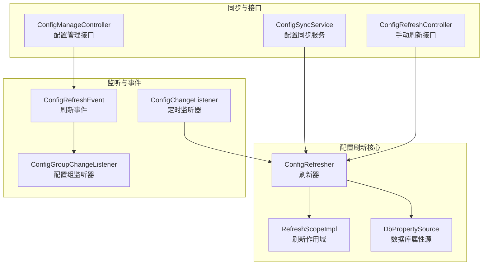
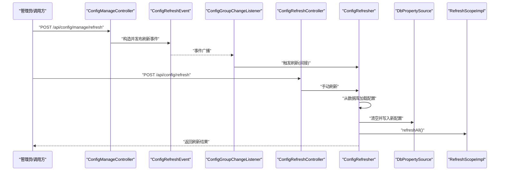
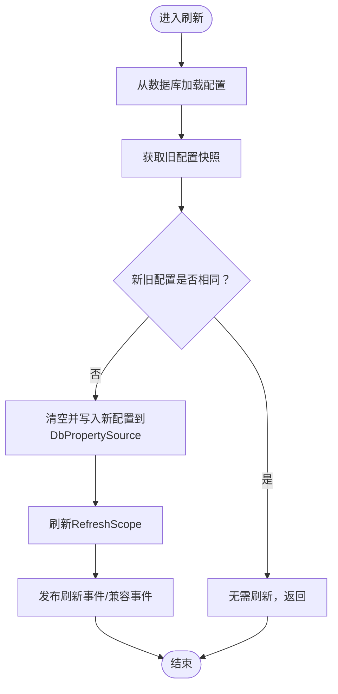
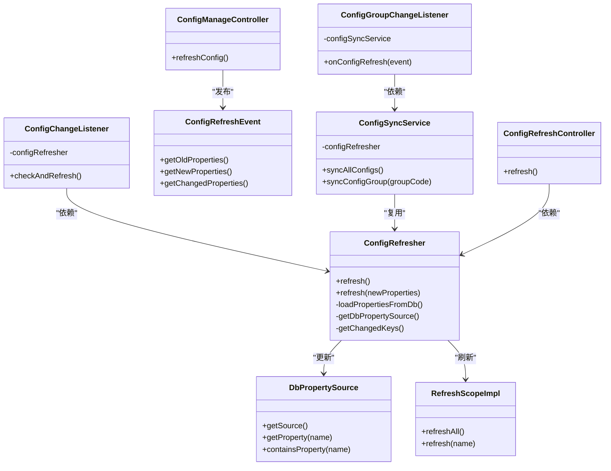

# 配置刷新机制

<cite>
**本文引用的文件**
- [ConfigRefresher.java](file://forge/forge-framework/forge-starter-parent/forge-starter-config/src/main/java/com/mdframe/forge/starter/property/refresh/ConfigRefresher.java)
- [ConfigChangeListener.java](file://forge/forge-framework/forge-starter-parent/forge-starter-config/src/main/java/com/mdframe/forge/starter/property/refresh/ConfigChangeListener.java)
- [ConfigGroupChangeListener.java](file://forge/forge-framework/forge-starter-parent/forge-starter-config/src/main/java/com/mdframe/forge/starter/config/listener/ConfigGroupChangeListener.java)
- [ConfigRefreshEvent.java](file://forge/forge-framework/forge-starter-parent/forge-starter-config/src/main/java/com/mdframe/forge/starter/property/event/ConfigRefreshEvent.java)
- [RefreshScopeImpl.java](file://forge/forge-framework/forge-starter-parent/forge-starter-config/src/main/java/com/mdframe/forge/starter/property/scope/RefreshScopeImpl.java)
- [DbPropertySource.java](file://forge/forge-framework/forge-starter-parent/forge-starter-config/src/main/java/com/mdframe/forge/starter/property/DbPropertySource.java)
- [ConfigSyncService.java](file://forge/forge-framework/forge-starter-parent/forge-starter-config/src/main/java/com/mdframe/forge/starter/config/service/ConfigSyncService.java)
- [ConfigRefreshController.java](file://forge/forge-framework/forge-starter-parent/forge-starter-config/src/main/java/com/mdframe/forge/starter/property/controller/ConfigRefreshController.java)
- [ConfigManageController.java](file://forge/forge-framework/forge-starter-parent/forge-starter-config/src/main/java/com/mdframe/forge/starter/config/controller/ConfigManageController.java)
</cite>

## 目录
1. [简介](#简介)
2. [项目结构](#项目结构)
3. [核心组件](#核心组件)
4. [架构总览](#架构总览)
5. [组件详解](#组件详解)
6. [依赖关系分析](#依赖关系分析)
7. [性能与并发](#性能与并发)
8. [故障排查指南](#故障排查指南)
9. [结论](#结论)

## 简介
本文件围绕Forge框架的配置刷新机制进行系统化技术文档编写，重点解析以下内容：
- ConfigRefresher配置刷新器的刷新策略与触发条件
- ConfigChangeListener配置变更监听器的定时检查与触发流程
- ConfigGroupChangeListener配置组变更监听器的事件监听与回调处理
- 配置刷新的生命周期、并发控制与一致性保障
- 最佳实践与常见问题排查

## 项目结构
本机制涉及的核心模块位于forge-starter-config中，主要文件分布如下：
- 刷新器与作用域：ConfigRefresher、RefreshScopeImpl、DbPropertySource
- 监听与事件：ConfigChangeListener、ConfigRefreshEvent、ConfigGroupChangeListener
- 同步与控制器：ConfigSyncService、ConfigRefreshController、ConfigManageController

图表来源
- [ConfigRefresher.java](file://forge/forge-framework/forge-starter-parent/forge-starter-config/src/main/java/com/mdframe/forge/starter/property/refresh/ConfigRefresher.java#L22-L93)
- [RefreshScopeImpl.java](file://forge/forge-framework/forge-starter-parent/forge-starter-config/src/main/java/com/mdframe/forge/starter/property/scope/RefreshScopeImpl.java#L14-L65)
- [DbPropertySource.java](file://forge/forge-framework/forge-starter-parent/forge-starter-config/src/main/java/com/mdframe/forge/starter/property/DbPropertySource.java#L10-L33)
- [ConfigChangeListener.java](file://forge/forge-framework/forge-starter-parent/forge-starter-config/src/main/java/com/mdframe/forge/starter/property/refresh/ConfigChangeListener.java#L17-L32)
- [ConfigRefreshEvent.java](file://forge/forge-framework/forge-starter-parent/forge-starter-config/src/main/java/com/mdframe/forge/starter/property/event/ConfigRefreshEvent.java#L10-L42)
- [ConfigGroupChangeListener.java](file://forge/forge-framework/forge-starter-parent/forge-starter-config/src/main/java/com/mdframe/forge/starter/config/listener/ConfigGroupChangeListener.java#L19-L33)
- [ConfigSyncService.java](file://forge/forge-framework/forge-starter-parent/forge-starter-config/src/main/java/com/mdframe/forge/starter/config/service/ConfigSyncService.java#L27-L57)
- [ConfigRefreshController.java](file://forge/forge-framework/forge-starter-parent/forge-starter-config/src/main/java/com/mdframe/forge/starter/property/controller/ConfigRefreshController.java#L21-L41)
- [ConfigManageController.java](file://forge/forge-framework/forge-starter-parent/forge-starter-config/src/main/java/com/mdframe/forge/starter/config/controller/ConfigManageController.java#L29-L161)

章节来源
- [ConfigRefresher.java](file://forge/forge-framework/forge-starter-parent/forge-starter-config/src/main/java/com/mdframe/forge/starter/property/refresh/ConfigRefresher.java#L22-L93)
- [ConfigChangeListener.java](file://forge/forge-framework/forge-starter-parent/forge-starter-config/src/main/java/com/mdframe/forge/starter/property/refresh/ConfigChangeListener.java#L17-L32)
- [ConfigGroupChangeListener.java](file://forge/forge-framework/forge-starter-parent/forge-starter-config/src/main/java/com/mdframe/forge/starter/config/listener/ConfigGroupChangeListener.java#L19-L33)
- [ConfigRefreshEvent.java](file://forge/forge-framework/forge-starter-parent/forge-starter-config/src/main/java/com/mdframe/forge/starter/property/event/ConfigRefreshEvent.java#L10-L42)
- [RefreshScopeImpl.java](file://forge/forge-framework/forge-starter-parent/forge-starter-config/src/main/java/com/mdframe/forge/starter/property/scope/RefreshScopeImpl.java#L14-L65)
- [DbPropertySource.java](file://forge/forge-framework/forge-starter-parent/forge-starter-config/src/main/java/com/mdframe/forge/starter/property/DbPropertySource.java#L10-L33)
- [ConfigSyncService.java](file://forge/forge-framework/forge-starter-parent/forge-starter-config/src/main/java/com/mdframe/forge/starter/config/service/ConfigSyncService.java#L27-L57)
- [ConfigRefreshController.java](file://forge/forge-framework/forge-starter-parent/forge-starter-config/src/main/java/com/mdframe/forge/starter/property/controller/ConfigRefreshController.java#L21-L41)
- [ConfigManageController.java](file://forge/forge-framework/forge-starter-parent/forge-starter-config/src/main/java/com/mdframe/forge/starter/config/controller/ConfigManageController.java#L29-L161)

## 核心组件
- ConfigRefresher：负责从数据库加载配置、更新环境中的DbPropertySource、刷新RefreshScope作用域内的Bean，并发布刷新事件或兼容性事件。
- ConfigChangeListener：基于定时任务周期性检查并触发配置刷新。
- ConfigRefreshEvent：应用事件，承载旧/新配置映射及变更计算能力。
- ConfigGroupChangeListener：监听配置刷新事件，触发配置分组同步至sys_config表。
- RefreshScopeImpl：自定义作用域实现，支持按名称或全部刷新Bean实例。
- DbPropertySource：可变的PropertySource，作为刷新目标。
- ConfigSyncService：将SysConfigGroup中的配置转换并同步到sys_config表，复用ConfigRefresher完成刷新。
- ConfigRefreshController：对外提供手动刷新接口。
- ConfigManageController：统一配置管理入口，包含触发刷新事件的接口。

章节来源
- [ConfigRefresher.java](file://forge/forge-framework/forge-starter-parent/forge-starter-config/src/main/java/com/mdframe/forge/starter/property/refresh/ConfigRefresher.java#L22-L93)
- [ConfigChangeListener.java](file://forge/forge-framework/forge-starter-parent/forge-starter-config/src/main/java/com/mdframe/forge/starter/property/refresh/ConfigChangeListener.java#L17-L32)
- [ConfigRefreshEvent.java](file://forge/forge-framework/forge-starter-parent/forge-starter-config/src/main/java/com/mdframe/forge/starter/property/event/ConfigRefreshEvent.java#L10-L42)
- [ConfigGroupChangeListener.java](file://forge/forge-framework/forge-starter-parent/forge-starter-config/src/main/java/com/mdframe/forge/starter/config/listener/ConfigGroupChangeListener.java#L19-L33)
- [RefreshScopeImpl.java](file://forge/forge-framework/forge-starter-parent/forge-starter-config/src/main/java/com/mdframe/forge/starter/property/scope/RefreshScopeImpl.java#L14-L65)
- [DbPropertySource.java](file://forge/forge-framework/forge-starter-parent/forge-starter-config/src/main/java/com/mdframe/forge/starter/property/DbPropertySource.java#L10-L33)
- [ConfigSyncService.java](file://forge/forge-framework/forge-starter-parent/forge-starter-config/src/main/java/com/mdframe/forge/starter/config/service/ConfigSyncService.java#L27-L57)
- [ConfigRefreshController.java](file://forge/forge-framework/forge-starter-parent/forge-starter-config/src/main/java/com/mdframe/forge/starter/property/controller/ConfigRefreshController.java#L21-L41)
- [ConfigManageController.java](file://forge/forge-framework/forge-starter-parent/forge-starter-config/src/main/java/com/mdframe/forge/starter/config/controller/ConfigManageController.java#L29-L161)

## 架构总览
下图展示配置刷新从“触发—>加载—>更新—>刷新—>通知”的完整链路：

图表来源
- [ConfigManageController.java](file://forge/forge-framework/forge-starter-parent/forge-starter-config/src/main/java/com/mdframe/forge/starter/config/controller/ConfigManageController.java#L155-L161)
- [ConfigRefreshEvent.java](file://forge/forge-framework/forge-starter-parent/forge-starter-config/src/main/java/com/mdframe/forge/starter/property/event/ConfigRefreshEvent.java#L10-L42)
- [ConfigGroupChangeListener.java](file://forge/forge-framework/forge-starter-parent/forge-starter-config/src/main/java/com/mdframe/forge/starter/config/listener/ConfigGroupChangeListener.java#L28-L33)
- [ConfigRefreshController.java](file://forge/forge-framework/forge-starter-parent/forge-starter-config/src/main/java/com/mdframe/forge/starter/property/controller/ConfigRefreshController.java#L28-L41)
- [ConfigRefresher.java](file://forge/forge-framework/forge-starter-parent/forge-starter-config/src/main/java/com/mdframe/forge/starter/property/refresh/ConfigRefresher.java#L54-L93)
- [DbPropertySource.java](file://forge/forge-framework/forge-starter-parent/forge-starter-config/src/main/java/com/mdframe/forge/starter/property/DbPropertySource.java#L10-L33)
- [RefreshScopeImpl.java](file://forge/forge-framework/forge-starter-parent/forge-starter-config/src/main/java/com/mdframe/forge/starter/property/scope/RefreshScopeImpl.java#L49-L64)

## 组件详解

### ConfigRefresher 刷新器
- 刷新策略
  - 从数据库加载配置，优先读取企业级配置表，同时生成驼峰键以兼容访问。
  - 对比旧/新配置，若无差异则跳过；若有差异则清空并重写DbPropertySource，随后刷新RefreshScope。
  - 可选择发布应用事件或兼容性事件（当前注释掉）。
- 触发条件
  - 手动接口触发：ConfigRefreshController。
  - 应用事件触发：ConfigManageController发布ConfigRefreshEvent，间接由监听器驱动刷新。
  - 定时监听触发：ConfigChangeListener周期性调用refresh()。
- 并发与一致性
  - 刷新过程在方法上加锁，避免并发刷新导致的状态不一致。
  - 刷新前复制旧配置，刷新后一次性替换，确保原子性。
- 关键路径
  - 从数据库加载：loadPropertiesFromDb()
  - 获取属性源：getDbPropertySource()
  - 计算变更键：getChangedKeys()
  - 发布事件：publishRefreshEvent()/publishEnvironmentChangeEvent()

图表来源
- [ConfigRefresher.java](file://forge/forge-framework/forge-starter-parent/forge-starter-config/src/main/java/com/mdframe/forge/starter/property/refresh/ConfigRefresher.java#L54-L93)
- [ConfigRefresher.java](file://forge/forge-framework/forge-starter-parent/forge-starter-config/src/main/java/com/mdframe/forge/starter/property/refresh/ConfigRefresher.java#L98-L123)
- [ConfigRefresher.java](file://forge/forge-framework/forge-starter-parent/forge-starter-config/src/main/java/com/mdframe/forge/starter/property/refresh/ConfigRefresher.java#L153-L159)
- [ConfigRefresher.java](file://forge/forge-framework/forge-starter-parent/forge-starter-config/src/main/java/com/mdframe/forge/starter/property/refresh/ConfigRefresher.java#L183-L202)

章节来源
- [ConfigRefresher.java](file://forge/forge-framework/forge-starter-parent/forge-starter-config/src/main/java/com/mdframe/forge/starter/property/refresh/ConfigRefresher.java#L22-L93)
- [ConfigRefresher.java](file://forge/forge-framework/forge-starter-parent/forge-starter-config/src/main/java/com/mdframe/forge/starter/property/refresh/ConfigRefresher.java#L98-L123)
- [ConfigRefresher.java](file://forge/forge-framework/forge-starter-parent/forge-starter-config/src/main/java/com/mdframe/forge/starter/property/refresh/ConfigRefresher.java#L153-L159)
- [ConfigRefresher.java](file://forge/forge-framework/forge-starter-parent/forge-starter-config/src/main/java/com/mdframe/forge/starter/property/refresh/ConfigRefresher.java#L183-L202)

### ConfigChangeListener 定时监听器
- 功能：基于条件装配，在开启自动刷新时，定期检查并触发ConfigRefresher.refresh()。
- 触发频率：默认固定延迟（当前示例注释掉，实际可从配置注入）。
- 条件开关：通过配置项控制是否启用。

章节来源
- [ConfigChangeListener.java](file://forge/forge-framework/forge-starter-parent/forge-starter-config/src/main/java/com/mdframe/forge/starter/property/refresh/ConfigChangeListener.java#L17-L32)

### ConfigRefreshEvent 应用事件
- 结构：携带旧/新配置映射，提供变更配置的便捷计算。
- 用途：作为跨组件通信载体，驱动ConfigGroupChangeListener执行同步。

章节来源
- [ConfigRefreshEvent.java](file://forge/forge-framework/forge-starter-parent/forge-starter-config/src/main/java/com/mdframe/forge/starter/property/event/ConfigRefreshEvent.java#L10-L42)

### ConfigGroupChangeListener 配置组监听器
- 功能：异步监听ConfigRefreshEvent，触发ConfigSyncService.syncAllConfigs()，将SysConfigGroup转换并同步到sys_config表，再复用ConfigRefresher完成刷新。
- 异步处理：避免阻塞主事件线程。

章节来源
- [ConfigGroupChangeListener.java](file://forge/forge-framework/forge-starter-parent/forge-starter-config/src/main/java/com/mdframe/forge/starter/config/listener/ConfigGroupChangeListener.java#L19-L33)
- [ConfigSyncService.java](file://forge/forge-framework/forge-starter-parent/forge-starter-config/src/main/java/com/mdframe/forge/starter/config/service/ConfigSyncService.java#L37-L57)

### RefreshScopeImpl 刷新作用域
- 功能：维护作用域内对象缓存与销毁回调，支持按名称或全部刷新。
- 刷新语义：清理缓存并在下次获取时重建Bean，实现“动态刷新”。

章节来源
- [RefreshScopeImpl.java](file://forge/forge-framework/forge-starter-parent/forge-starter-config/src/main/java/com/mdframe/forge/starter/property/scope/RefreshScopeImpl.java#L14-L65)

### DbPropertySource 数据库属性源
- 功能：可变的PropertySource，提供getProperty/containsProperty以及可变的source访问，便于刷新时直接覆盖。
- 识别：通过类型过滤在Environment中定位。

章节来源
- [DbPropertySource.java](file://forge/forge-framework/forge-starter-parent/forge-starter-config/src/main/java/com/mdframe/forge/starter/property/DbPropertySource.java#L10-L33)

### ConfigSyncService 配置同步服务
- 功能：将SysConfigGroup中的配置按分组类型解析为键值对，写入sys_config表风格，再调用ConfigRefresher完成刷新。
- 生命周期：实现ApplicationRunner，应用启动即同步。

章节来源
- [ConfigSyncService.java](file://forge/forge-framework/forge-starter-parent/forge-starter-config/src/main/java/com/mdframe/forge/starter/config/service/ConfigSyncService.java#L27-L57)
- [ConfigSyncService.java](file://forge/forge-framework/forge-starter-parent/forge-starter-config/src/main/java/com/mdframe/forge/starter/config/service/ConfigSyncService.java#L87-L114)

### ConfigRefreshController 手动刷新接口
- 功能：提供REST接口触发ConfigRefresher.refresh()，返回刷新状态与消息。

章节来源
- [ConfigRefreshController.java](file://forge/forge-framework/forge-starter-parent/forge-starter-config/src/main/java/com/mdframe/forge/starter/property/controller/ConfigRefreshController.java#L21-L41)

### ConfigManageController 配置管理与刷新触发
- 功能：统一配置管理接口，包含触发ConfigRefreshEvent的刷新动作，用于外部系统或管理端触发刷新。

章节来源
- [ConfigManageController.java](file://forge/forge-framework/forge-starter-parent/forge-starter-config/src/main/java/com/mdframe/forge/starter/config/controller/ConfigManageController.java#L155-L161)

## 依赖关系分析
- ConfigRefresher依赖ApplicationContext、ConfigurableEnvironment、RefreshScopeImpl、JdbcTemplate、DbPropertySource。
- ConfigChangeListener依赖ConfigRefresher，受配置开关控制。
- ConfigGroupChangeListener依赖ConfigSyncService，监听ConfigRefreshEvent。
- ConfigSyncService依赖ISysConfigGroupService、JdbcTemplate、ConfigRefresher、ConfigConverter。
- ConfigRefreshController与ConfigManageController均依赖ConfigRefresher并暴露HTTP接口。

图表来源
- [ConfigRefresher.java](file://forge/forge-framework/forge-starter-parent/forge-starter-config/src/main/java/com/mdframe/forge/starter/property/refresh/ConfigRefresher.java#L22-L93)
- [ConfigChangeListener.java](file://forge/forge-framework/forge-starter-parent/forge-starter-config/src/main/java/com/mdframe/forge/starter/property/refresh/ConfigChangeListener.java#L17-L32)
- [ConfigRefreshEvent.java](file://forge/forge-framework/forge-starter-parent/forge-starter-config/src/main/java/com/mdframe/forge/starter/property/event/ConfigRefreshEvent.java#L10-L42)
- [ConfigGroupChangeListener.java](file://forge/forge-framework/forge-starter-parent/forge-starter-config/src/main/java/com/mdframe/forge/starter/config/listener/ConfigGroupChangeListener.java#L19-L33)
- [ConfigSyncService.java](file://forge/forge-framework/forge-starter-parent/forge-starter-config/src/main/java/com/mdframe/forge/starter/config/service/ConfigSyncService.java#L27-L57)
- [RefreshScopeImpl.java](file://forge/forge-framework/forge-starter-parent/forge-starter-config/src/main/java/com/mdframe/forge/starter/property/scope/RefreshScopeImpl.java#L14-L65)
- [DbPropertySource.java](file://forge/forge-framework/forge-starter-parent/forge-starter-config/src/main/java/com/mdframe/forge/starter/property/DbPropertySource.java#L10-L33)
- [ConfigRefreshController.java](file://forge/forge-framework/forge-starter-parent/forge-starter-config/src/main/java/com/mdframe/forge/starter/property/controller/ConfigRefreshController.java#L21-L41)
- [ConfigManageController.java](file://forge/forge-framework/forge-starter-parent/forge-starter-config/src/main/java/com/mdframe/forge/starter/config/controller/ConfigManageController.java#L155-L161)

## 性能与并发
- 并发控制
  - ConfigRefresher.refresh()方法采用同步锁，避免多线程并发刷新造成数据竞争。
- 一致性保障
  - 刷新前复制旧配置，替换时一次性清空并写入，减少中间态可见性问题。
  - RefreshScopeImpl在刷新时先执行销毁回调，再清空缓存，确保Bean重建。
- 性能建议
  - 定时监听间隔应结合业务压力与配置变更频率调整，避免频繁全量刷新。
  - 若配置项较多，建议分批或按需刷新，降低数据库与内存压力。
  - 异步监听ConfigGroupChangeListener可避免阻塞事件线程。

章节来源
- [ConfigRefresher.java](file://forge/forge-framework/forge-starter-parent/forge-starter-config/src/main/java/com/mdframe/forge/starter/property/refresh/ConfigRefresher.java#L29-L49)
- [RefreshScopeImpl.java](file://forge/forge-framework/forge-starter-parent/forge-starter-config/src/main/java/com/mdframe/forge/starter/property/scope/RefreshScopeImpl.java#L49-L64)

## 故障排查指南
- 常见问题与定位
  - 未找到数据库配置源：检查DbPropertySource是否正确注册到Environment。
  - 刷新无变化：确认数据库配置是否确实变更，或检查驼峰键是否覆盖。
  - 刷新失败：查看日志错误堆栈，关注数据库查询、Map覆盖与Bean销毁阶段。
  - 定时刷新未生效：确认自动刷新开关与定时任务配置。
  - 配置组同步失败：检查SysConfigGroup是否存在、配置值是否为空、转换器是否支持该分组类型。
- 排查步骤
  - 通过手动刷新接口验证刷新链路。
  - 观察ConfigGroupChangeListener的日志，确认是否触发同步。
  - 检查ConfigRefresher的变更键统计输出，核对受影响配置项数量。
  - 在高并发场景下，确认刷新方法的同步锁是否导致阻塞。

章节来源
- [ConfigRefresher.java](file://forge/forge-framework/forge-starter-parent/forge-starter-config/src/main/java/com/mdframe/forge/starter/property/refresh/ConfigRefresher.java#L35-L48)
- [ConfigRefresher.java](file://forge/forge-framework/forge-starter-parent/forge-starter-config/src/main/java/com/mdframe/forge/starter/property/refresh/ConfigRefresher.java#L89-L92)
- [ConfigGroupChangeListener.java](file://forge/forge-framework/forge-starter-parent/forge-starter-config/src/main/java/com/mdframe/forge/starter/config/listener/ConfigGroupChangeListener.java#L30-L33)
- [ConfigSyncService.java](file://forge/forge-framework/forge-starter-parent/forge-starter-config/src/main/java/com/mdframe/forge/starter/config/service/ConfigSyncService.java#L53-L56)

## 结论
Forge配置刷新机制通过“事件+监听+定时+手动”多通道触发，结合可变属性源与自定义作用域，实现了数据库驱动的动态配置刷新。其设计在保证一致性与线程安全的同时，提供了良好的扩展性与可观测性。建议在生产环境中合理设置定时刷新间隔、启用异步监听，并通过手动接口与事件接口形成完善的运维手段。