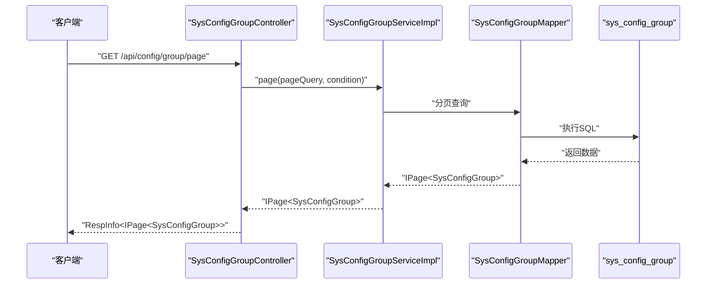
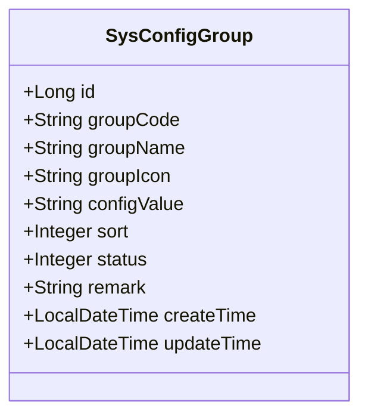
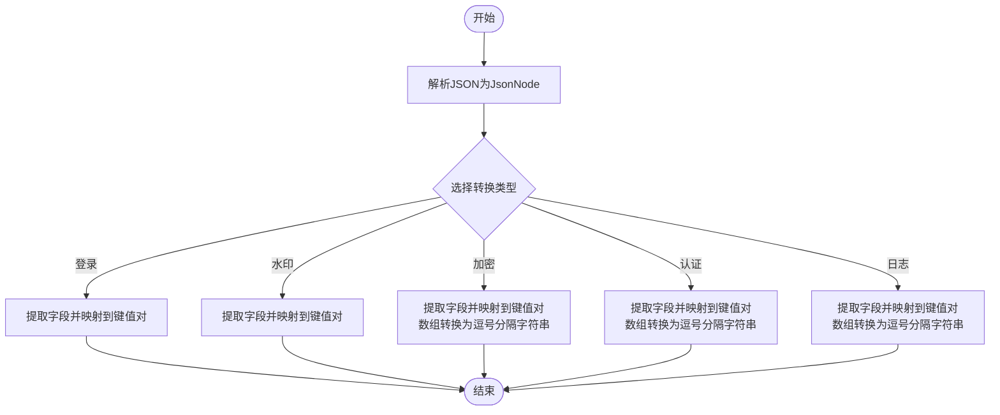
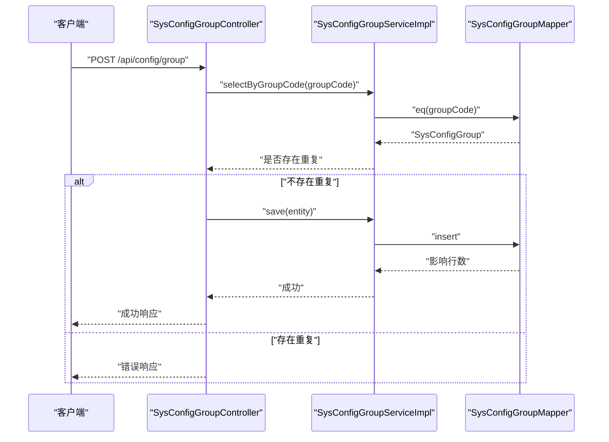
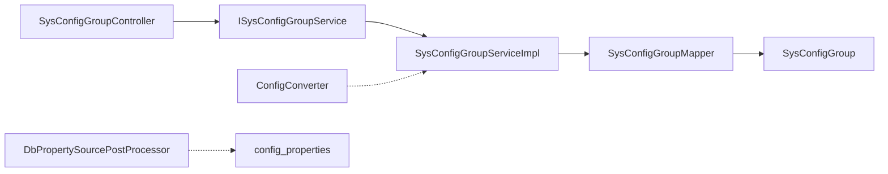

# 配置数据访问

<cite>
**本文引用的文件**
- [SysConfigGroupMapper.java](file://forge/forge-framework/forge-starter-parent/forge-starter-config/src/main/java/com/mdframe/forge/starter/config/mapper/SysConfigGroupMapper.java)
- [SysConfigGroup.java](file://forge/forge-framework/forge-starter-parent/forge-starter-config/src/main/java/com/mdframe/forge/starter/config/entity/SysConfigGroup.java)
- [ISysConfigGroupService.java](file://forge/forge-framework/forge-starter-parent/forge-starter-config/src/main/java/com/mdframe/forge/starter/config/service/ISysConfigGroupService.java)
- [SysConfigGroupServiceImpl.java](file://forge/forge-framework/forge-starter-parent/forge-starter-config/src/main/java/com/mdframe/forge/starter/config/service/impl/SysConfigGroupServiceImpl.java)
- [SysConfigGroupController.java](file://forge/forge-framework/forge-starter-parent/forge-starter-config/src/main/java/com/mdframe/forge/starter/config/controller/SysConfigGroupController.java)
- [ConfigConverter.java](file://forge/forge-framework/forge-starter-parent/forge-starter-config/src/main/java/com/mdframe/forge/starter/config/converter/ConfigConverter.java)
- [config_properties.sql](file://forge/forge-framework/forge-starter-parent/forge-starter-config/sql/config_properties.sql)
- [DbPropertySourcePostProcessor.java](file://forge/forge-framework/forge-starter-parent/forge-starter-config/src/main/java/com/mdframe/forge/starter/property/DbPropertySourcePostProcessor.java)
- [SysConfig.java](file://forge/forge-framework/forge-plugin-parent/forge-plugin-system/src/main/java/com/mdframe/forge/plugin/system/entity/SysConfig.java)
</cite>

## 目录
1. [简介](#简介)
2. [项目结构](#项目结构)
3. [核心组件](#核心组件)
4. [架构总览](#架构总览)
5. [详细组件分析](#详细组件分析)
6. [依赖关系分析](#依赖关系分析)
7. [性能考虑](#性能考虑)
8. [故障排查指南](#故障排查指南)
9. [结论](#结论)
10. [附录](#附录)

## 简介
本技术文档聚焦于Forge配置数据访问层，围绕以下目标展开：
- 深入解析SysConfigGroupMapper的数据访问接口与SQL映射机制
- 详解ConfigConverter配置转换器的实体转换逻辑与数据映射规则
- 阐述SysConfigGroup实体类的字段定义、业务规则与关系映射
- 提供数据访问的CRUD操作示例、查询优化技巧与事务管理策略

通过本文，读者可系统掌握配置数据访问层的设计思想、实现细节与最佳实践。

## 项目结构
配置数据访问层位于“forge-starter-config”模块中，采用典型的分层架构：
- 控制器层：SysConfigGroupController 提供REST接口
- 服务层：ISysConfigGroupService 与 SysConfigGroupServiceImpl 实现业务逻辑
- 数据访问层：SysConfigGroupMapper 继承MyBatis-Plus基础Mapper
- 实体层：SysConfigGroup 映射sys_config_group表
- 转换器：ConfigConverter 将JSON配置转换为键值对，用于写入sys_config表
- 配置源：DbPropertySourcePostProcessor 从数据库加载配置到Spring环境

```mermaid
graph TB
Controller["SysConfigGroupController<br/>REST接口"] --> Service["ISysConfigGroupService<br/>+ SysConfigGroupServiceImpl"]
Service --> Mapper["SysConfigGroupMapper<br/>BaseMapper<SysConfigGroup>"]
Mapper --> Entity["SysConfigGroup<br/>实体类"]
Converter["ConfigConverter<br/>JSON转键值对"] --> Service
DB1["sys_config_group<br/>分组表"] <- --> Mapper
DB2["sys_config<br/>配置表"] <- --> Service
DB3["config_properties<br/>配置属性表"] <- --> PostProcessor["DbPropertySourcePostProcessor"]
```

图表来源
- [SysConfigGroupController.java](file://forge/forge-framework/forge-starter-parent/forge-starter-config/src/main/java/com/mdframe/forge/starter/config/controller/SysConfigGroupController.java#L1-L131)
- [ISysConfigGroupService.java](file://forge/forge-framework/forge-starter-parent/forge-starter-config/src/main/java/com/mdframe/forge/starter/config/service/ISysConfigGroupService.java#L1-L45)
- [SysConfigGroupServiceImpl.java](file://forge/forge-framework/forge-starter-parent/forge-starter-config/src/main/java/com/mdframe/forge/starter/config/service/impl/SysConfigGroupServiceImpl.java#L1-L55)
- [SysConfigGroupMapper.java](file://forge/forge-framework/forge-starter-parent/forge-starter-config/src/main/java/com/mdframe/forge/starter/config/mapper/SysConfigGroupMapper.java#L1-L13)
- [SysConfigGroup.java](file://forge/forge-framework/forge-starter-parent/forge-starter-config/src/main/java/com/mdframe/forge/starter/config/entity/SysConfigGroup.java#L1-L73)
- [ConfigConverter.java](file://forge/forge-framework/forge-starter-parent/forge-starter-config/src/main/java/com/mdframe/forge/starter/config/converter/ConfigConverter.java#L1-L189)
- [DbPropertySourcePostProcessor.java](file://forge/forge-framework/forge-starter-parent/forge-starter-config/src/main/java/com/mdframe/forge/starter/property/DbPropertySourcePostProcessor.java#L64-L88)

章节来源
- [SysConfigGroupController.java](file://forge/forge-framework/forge-starter-parent/forge-starter-config/src/main/java/com/mdframe/forge/starter/config/controller/SysConfigGroupController.java#L1-L131)
- [SysConfigGroupMapper.java](file://forge/forge-framework/forge-starter-parent/forge-starter-config/src/main/java/com/mdframe/forge/starter/config/mapper/SysConfigGroupMapper.java#L1-L13)
- [SysConfigGroup.java](file://forge/forge-framework/forge-starter-parent/forge-starter-config/src/main/java/com/mdframe/forge/starter/config/entity/SysConfigGroup.java#L1-L73)
- [ISysConfigGroupService.java](file://forge/forge-framework/forge-starter-parent/forge-starter-config/src/main/java/com/mdframe/forge/starter/config/service/ISysConfigGroupService.java#L1-L45)
- [SysConfigGroupServiceImpl.java](file://forge/forge-framework/forge-starter-parent/forge-starter-config/src/main/java/com/mdframe/forge/starter/config/service/impl/SysConfigGroupServiceImpl.java#L1-L55)
- [ConfigConverter.java](file://forge/forge-framework/forge-starter-parent/forge-starter-config/src/main/java/com/mdframe/forge/starter/config/converter/ConfigConverter.java#L1-L189)
- [DbPropertySourcePostProcessor.java](file://forge/forge-framework/forge-starter-parent/forge-starter-config/src/main/java/com/mdframe/forge/starter/property/DbPropertySourcePostProcessor.java#L64-L88)

## 核心组件
- SysConfigGroupMapper：继承MyBatis-Plus的BaseMapper，自动获得通用CRUD能力；通过注解声明为Mapper接口
- SysConfigGroup：实体类映射sys_config_group表，包含主键、分组编码、名称、图标、JSON配置值、排序、状态、备注及时间戳等字段
- ISysConfigGroupService/SysConfigGroupServiceImpl：提供按分组编码查询、启用分组列表查询、按分组编码更新配置值与状态等业务方法
- SysConfigGroupController：提供分页查询、列表查询、详情查询、新增、修改、删除、启停、按编码查询、启用列表等接口
- ConfigConverter：将不同类型的JSON配置（登录、水印、加密、认证、日志）转换为键值对，便于写入sys_config表
- DbPropertySourcePostProcessor：从sys_config或config_properties表加载配置到Spring环境，支持降级加载

章节来源
- [SysConfigGroupMapper.java](file://forge/forge-framework/forge-starter-parent/forge-starter-config/src/main/java/com/mdframe/forge/starter/config/mapper/SysConfigGroupMapper.java#L1-L13)
- [SysConfigGroup.java](file://forge/forge-framework/forge-starter-parent/forge-starter-config/src/main/java/com/mdframe/forge/starter/config/entity/SysConfigGroup.java#L1-L73)
- [ISysConfigGroupService.java](file://forge/forge-framework/forge-starter-parent/forge-starter-config/src/main/java/com/mdframe/forge/starter/config/service/ISysConfigGroupService.java#L1-L45)
- [SysConfigGroupServiceImpl.java](file://forge/forge-framework/forge-starter-parent/forge-starter-config/src/main/java/com/mdframe/forge/starter/config/service/impl/SysConfigGroupServiceImpl.java#L1-L55)
- [SysConfigGroupController.java](file://forge/forge-framework/forge-starter-parent/forge-starter-config/src/main/java/com/mdframe/forge/starter/config/controller/SysConfigGroupController.java#L1-L131)
- [ConfigConverter.java](file://forge/forge-framework/forge-starter-parent/forge-starter-config/src/main/java/com/mdframe/forge/starter/config/converter/ConfigConverter.java#L1-L189)
- [DbPropertySourcePostProcessor.java](file://forge/forge-framework/forge-starter-parent/forge-starter-config/src/main/java/com/mdframe/forge/starter/property/DbPropertySourcePostProcessor.java#L64-L88)

## 架构总览
下图展示配置数据访问层的端到端流程：控制器接收请求，调用服务层，服务层通过Mapper执行数据库操作，并在需要时使用ConfigConverter进行JSON到键值对的转换。



图表来源
- [SysConfigGroupController.java](file://forge/forge-framework/forge-starter-parent/forge-starter-config/src/main/java/com/mdframe/forge/starter/config/controller/SysConfigGroupController.java#L38-L43)
- [SysConfigGroupServiceImpl.java](file://forge/forge-framework/forge-starter-parent/forge-starter-config/src/main/java/com/mdframe/forge/starter/config/service/impl/SysConfigGroupServiceImpl.java#L17-L32)
- [SysConfigGroupMapper.java](file://forge/forge-framework/forge-starter-parent/forge-starter-config/src/main/java/com/mdframe/forge/starter/config/mapper/SysConfigGroupMapper.java#L11-L13)

## 详细组件分析

### SysConfigGroupMapper 数据访问接口与SQL映射
- 接口职责：作为数据访问层入口，继承MyBatis-Plus的BaseMapper，天然具备通用CRUD能力
- SQL映射：通过注解与MyBatis-Plus自动映射，无需手写XML；实体类SysConfigGroup的@TableId/@TableName注解确保表与字段映射正确
- 使用建议：
  - 基础CRUD：直接复用BaseMapper提供的方法
  - 自定义查询：可在Mapper中新增方法并配合XML或LambdaQueryWrapper实现复杂条件查询

章节来源
- [SysConfigGroupMapper.java](file://forge/forge-framework/forge-starter-parent/forge-starter-config/src/main/java/com/mdframe/forge/starter/config/mapper/SysConfigGroupMapper.java#L1-L13)
- [SysConfigGroup.java](file://forge/forge-framework/forge-starter-parent/forge-starter-config/src/main/java/com/mdframe/forge/starter/config/entity/SysConfigGroup.java#L15-L17)

### SysConfigGroup 实体类字段定义、业务规则与关系映射
- 字段定义与含义：
  - id：主键自增
  - groupCode：分组编码，唯一性约束由上层逻辑保证
  - groupName：分组名称
  - groupIcon：分组图标
  - configValue：JSON格式的配置值
  - sort：排序字段
  - status：状态（0-禁用，1-启用）
  - remark：备注
  - createTime/updateTime：时间戳
- 业务规则：
  - 启用过滤：服务层提供仅查询启用分组的方法
  - 编码唯一：控制器在新增/修改时检查编码冲突
  - 排序与状态：支持按sort升序排列与状态启停
- 关系映射：
  - 与sys_config_group表一一对应
  - 与SysConfig（系统配置表）无直接实体关联，但通过JSON配置值间接产生数据交互



图表来源
- [SysConfigGroup.java](file://forge/forge-framework/forge-starter-parent/forge-starter-config/src/main/java/com/mdframe/forge/starter/config/entity/SysConfigGroup.java#L17-L73)

章节来源
- [SysConfigGroup.java](file://forge/forge-framework/forge-starter-parent/forge-starter-config/src/main/java/com/mdframe/forge/starter/config/entity/SysConfigGroup.java#L1-L73)
- [SysConfigGroupController.java](file://forge/forge-framework/forge-starter-parent/forge-starter-config/src/main/java/com/mdframe/forge/starter/config/controller/SysConfigGroupController.java#L66-L98)

### ConfigConverter 配置转换器的实体转换逻辑与数据映射规则
- 职责概述：将JSON格式的配置值转换为键值对，键名遵循约定前缀与点号分隔的命名规范，便于写入sys_config表
- 转换规则：
  - 登录配置：将JSON中的布尔/数值字段映射为字符串键值
  - 水印配置：将多字段映射为统一前缀的键集合
  - 加密配置：处理布尔/数值/数组字段，数组类型转换为逗号分隔字符串
  - 认证配置：处理布尔/数值/数组字段，数组类型转换为逗号分隔字符串
  - 日志配置：处理布尔/数值/数组字段，数组类型转换为逗号分隔字符串
- 辅助方法：putIfNotNull根据JSON节点类型自动转换为字符串



图表来源
- [ConfigConverter.java](file://forge/forge-framework/forge-starter-parent/forge-starter-config/src/main/java/com/mdframe/forge/starter/config/converter/ConfigConverter.java#L25-L187)

章节来源
- [ConfigConverter.java](file://forge/forge-framework/forge-starter-parent/forge-starter-config/src/main/java/com/mdframe/forge/starter/config/converter/ConfigConverter.java#L1-L189)

### SysConfigGroup 服务层与控制器的CRUD操作示例
- 分页查询：SysConfigGroupController/page → ISysConfigGroupService/selectPage
- 列表查询：SysConfigGroupController/list → ISysConfigGroupService/list
- 详情查询：SysConfigGroupController/getInfo → ISysConfigGroupService/getById
- 新增：SysConfigGroupController/add → 检查groupCode唯一性后保存
- 修改：SysConfigGroupController/edit → 检查groupCode唯一性后更新
- 删除：SysConfigGroupController/delete → 批量删除
- 启停：SysConfigGroupController/changeStatus → 更新状态
- 按编码查询：SysConfigGroupController/getByGroupCode → 通过服务层selectByGroupCode
- 启用列表：SysConfigGroupController/getEnabledGroups → 通过服务层selectEnabledGroups



图表来源
- [SysConfigGroupController.java](file://forge/forge-framework/forge-starter-parent/forge-starter-config/src/main/java/com/mdframe/forge/starter/config/controller/SysConfigGroupController.java#L66-L75)
- [SysConfigGroupServiceImpl.java](file://forge/forge-framework/forge-starter-parent/forge-starter-config/src/main/java/com/mdframe/forge/starter/config/service/impl/SysConfigGroupServiceImpl.java#L19-L24)
- [SysConfigGroupMapper.java](file://forge/forge-framework/forge-starter-parent/forge-starter-config/src/main/java/com/mdframe/forge/starter/config/mapper/SysConfigGroupMapper.java#L11-L13)

章节来源
- [SysConfigGroupController.java](file://forge/forge-framework/forge-starter-parent/forge-starter-config/src/main/java/com/mdframe/forge/starter/config/controller/SysConfigGroupController.java#L1-L131)
- [ISysConfigGroupService.java](file://forge/forge-framework/forge-starter-parent/forge-starter-config/src/main/java/com/mdframe/forge/starter/config/service/ISysConfigGroupService.java#L1-L45)
- [SysConfigGroupServiceImpl.java](file://forge/forge-framework/forge-starter-parent/forge-starter-config/src/main/java/com/mdframe/forge/starter/config/service/impl/SysConfigGroupServiceImpl.java#L1-L55)

### 查询优化技巧
- 索引设计：依据SysConfigGroup的常用查询条件（如groupCode、status、sort），建议在sys_config_group表建立相应索引
- 分页查询：优先使用Page对象，避免一次性加载全量数据
- 条件查询：使用LambdaQueryWrapper构建查询条件，减少SQL拼接风险
- 启用过滤：通过服务层selectEnabledGroups仅查询status=1的记录，降低无效数据传输

章节来源
- [SysConfigGroupServiceImpl.java](file://forge/forge-framework/forge-starter-parent/forge-starter-config/src/main/java/com/mdframe/forge/starter/config/service/impl/SysConfigGroupServiceImpl.java#L27-L31)

### 事务管理策略
- 默认行为：MyBatis-Plus的ServiceImpl在单表操作上默认使用Spring事务传播机制
- 建议策略：
  - 单表操作：无需额外声明事务注解
  - 跨表/跨模块：使用@Transactional标注服务方法，确保一致性
  - 幂等性：新增/修改时先校验groupCode唯一性，避免重复提交导致异常

章节来源
- [SysConfigGroupController.java](file://forge/forge-framework/forge-starter-parent/forge-starter-config/src/main/java/com/mdframe/forge/starter/config/controller/SysConfigGroupController.java#L66-L98)
- [SysConfigGroupServiceImpl.java](file://forge/forge-framework/forge-starter-parent/forge-starter-config/src/main/java/com/mdframe/forge/starter/config/service/impl/SysConfigGroupServiceImpl.java#L17-L55)

## 依赖关系分析
- 控制器依赖服务接口，服务实现依赖Mapper接口
- Mapper与实体类通过注解绑定，实现零XML配置
- ConfigConverter独立于持久层，负责JSON到键值对的转换
- DbPropertySourcePostProcessor从数据库加载配置，支持降级到config_properties表



图表来源
- [SysConfigGroupController.java](file://forge/forge-framework/forge-starter-parent/forge-starter-config/src/main/java/com/mdframe/forge/starter/config/controller/SysConfigGroupController.java#L33-L34)
- [SysConfigGroupServiceImpl.java](file://forge/forge-framework/forge-starter-parent/forge-starter-config/src/main/java/com/mdframe/forge/starter/config/service/impl/SysConfigGroupServiceImpl.java#L17-L17)
- [SysConfigGroupMapper.java](file://forge/forge-framework/forge-starter-parent/forge-starter-config/src/main/java/com/mdframe/forge/starter/config/mapper/SysConfigGroupMapper.java#L11-L13)
- [SysConfigGroup.java](file://forge/forge-framework/forge-starter-parent/forge-starter-config/src/main/java/com/mdframe/forge/starter/config/entity/SysConfigGroup.java#L15-L17)
- [ConfigConverter.java](file://forge/forge-framework/forge-starter-parent/forge-starter-config/src/main/java/com/mdframe/forge/starter/config/converter/ConfigConverter.java#L17-L17)
- [DbPropertySourcePostProcessor.java](file://forge/forge-framework/forge-starter-parent/forge-starter-config/src/main/java/com/mdframe/forge/starter/property/DbPropertySourcePostProcessor.java#L64-L88)

章节来源
- [SysConfigGroupController.java](file://forge/forge-framework/forge-starter-parent/forge-starter-config/src/main/java/com/mdframe/forge/starter/config/controller/SysConfigGroupController.java#L1-L131)
- [SysConfigGroupServiceImpl.java](file://forge/forge-framework/forge-starter-parent/forge-starter-config/src/main/java/com/mdframe/forge/starter/config/service/impl/SysConfigGroupServiceImpl.java#L1-L55)
- [SysConfigGroupMapper.java](file://forge/forge-framework/forge-starter-parent/forge-starter-config/src/main/java/com/mdframe/forge/starter/config/mapper/SysConfigGroupMapper.java#L1-L13)
- [SysConfigGroup.java](file://forge/forge-framework/forge-starter-parent/forge-starter-config/src/main/java/com/mdframe/forge/starter/config/entity/SysConfigGroup.java#L1-L73)
- [ConfigConverter.java](file://forge/forge-framework/forge-starter-parent/forge-starter-config/src/main/java/com/mdframe/forge/starter/config/converter/ConfigConverter.java#L1-L189)
- [DbPropertySourcePostProcessor.java](file://forge/forge-framework/forge-starter-parent/forge-starter-config/src/main/java/com/mdframe/forge/starter/property/DbPropertySourcePostProcessor.java#L64-L88)

## 性能考虑
- 索引优化：为groupCode建立唯一索引，为status与sort建立复合索引，提升查询与排序效率
- 分页参数：合理设置每页大小，避免超大页码与深度分页
- JSON解析：ConfigConverter使用Jackson解析JSON，建议在高并发场景下复用ObjectMapper实例（当前已通过成员变量复用）
- 降级加载：DbPropertySourcePostProcessor在sys_config不可用时降级到config_properties表，保障系统可用性

章节来源
- [config_properties.sql](file://forge/forge-framework/forge-starter-parent/forge-starter-config/sql/config_properties.sql#L1-L31)
- [DbPropertySourcePostProcessor.java](file://forge/forge-framework/forge-starter-parent/forge-starter-config/src/main/java/com/mdframe/forge/starter/property/DbPropertySourcePostProcessor.java#L64-L88)
- [ConfigConverter.java](file://forge/forge-framework/forge-starter-parent/forge-starter-config/src/main/java/com/mdframe/forge/starter/config/converter/ConfigConverter.java#L20-L20)

## 故障排查指南
- 分组编码冲突：新增/修改时若返回“分组编码已存在”，需检查groupCode是否重复
- 查询无结果：确认groupCode是否正确，或检查status是否为启用状态
- 配置加载失败：DbPropertySourcePostProcessor会在sys_config加载失败时尝试从config_properties表加载，关注日志输出定位问题
- JSON转换异常：ConfigConverter在解析JSON时抛出异常，需检查输入JSON格式与字段是否存在

章节来源
- [SysConfigGroupController.java](file://forge/forge-framework/forge-starter-parent/forge-starter-config/src/main/java/com/mdframe/forge/starter/config/controller/SysConfigGroupController.java#L66-L98)
- [DbPropertySourcePostProcessor.java](file://forge/forge-framework/forge-starter-parent/forge-starter-config/src/main/java/com/mdframe/forge/starter/property/DbPropertySourcePostProcessor.java#L76-L88)
- [ConfigConverter.java](file://forge/forge-framework/forge-starter-parent/forge-starter-config/src/main/java/com/mdframe/forge/starter/config/converter/ConfigConverter.java#L25-L37)

## 结论
本配置数据访问层通过清晰的分层设计与约定式命名，实现了对sys_config_group表的高效管理，并借助ConfigConverter将JSON配置标准化为键值对，为系统配置中心提供了稳定可靠的数据支撑。结合索引优化、分页策略与降级加载机制，整体具备良好的扩展性与可用性。

## 附录
- 数据库表结构参考：config_properties.sql
- 相关实体：SysConfig（系统配置表）

章节来源
- [config_properties.sql](file://forge/forge-framework/forge-starter-parent/forge-starter-config/sql/config_properties.sql#L1-L31)
- [SysConfig.java](file://forge/forge-framework/forge-plugin-parent/forge-plugin-system/src/main/java/com/mdframe/forge/plugin/system/entity/SysConfig.java#L1-L61)