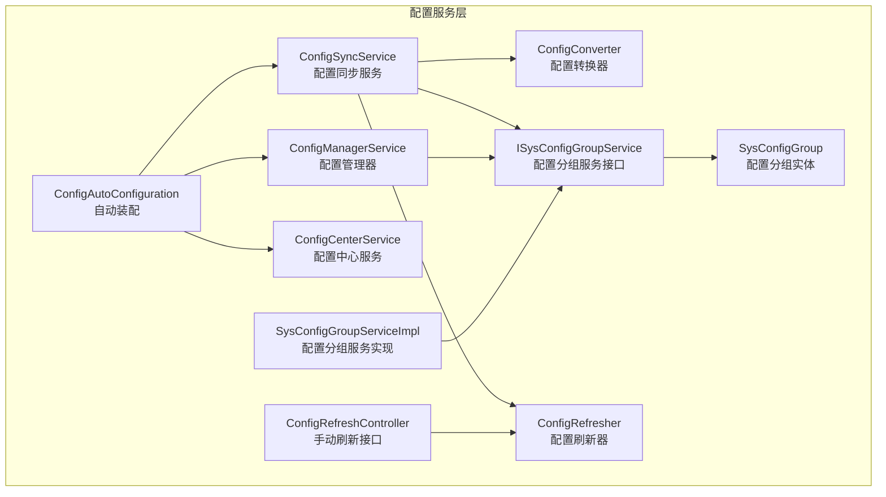
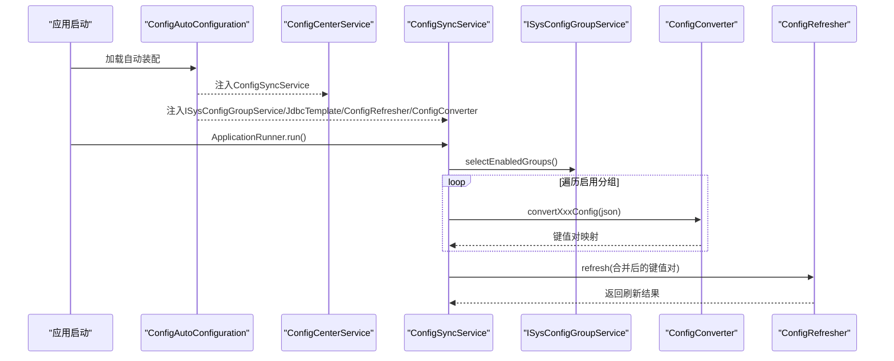
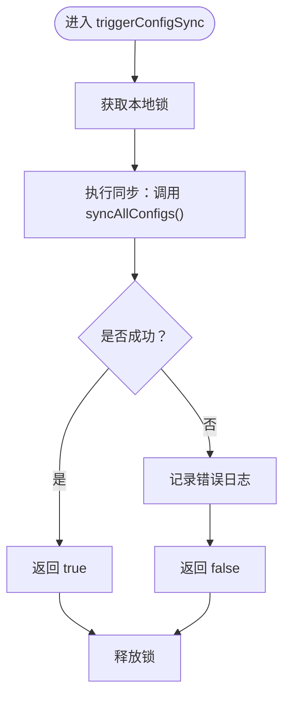
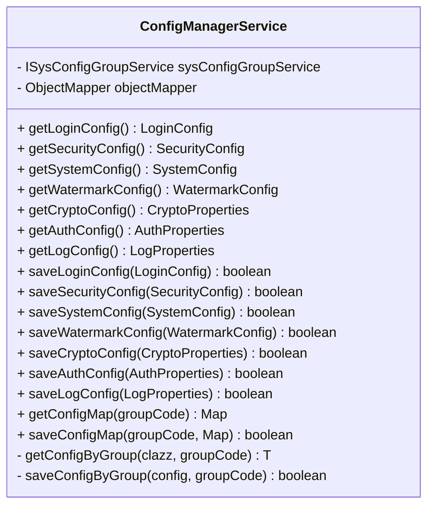
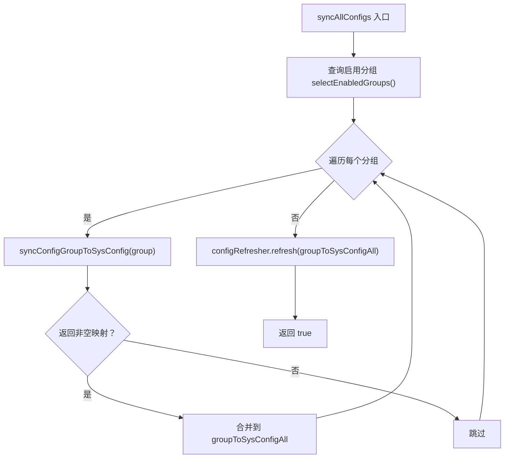
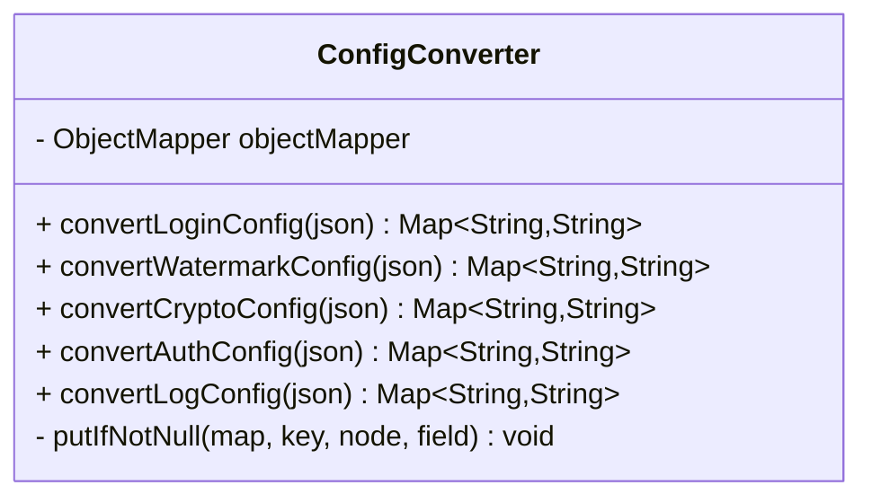
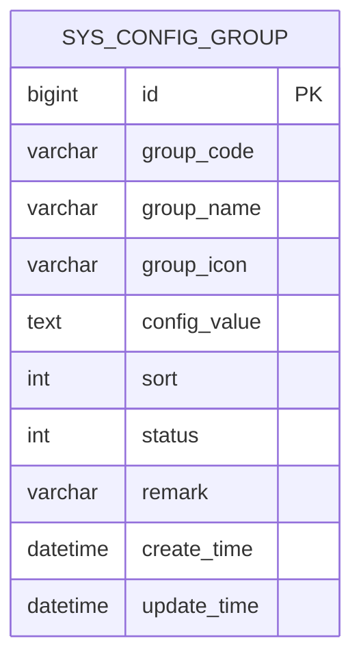
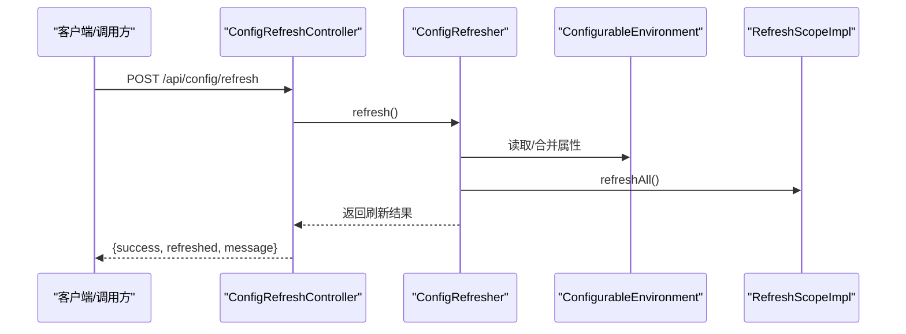
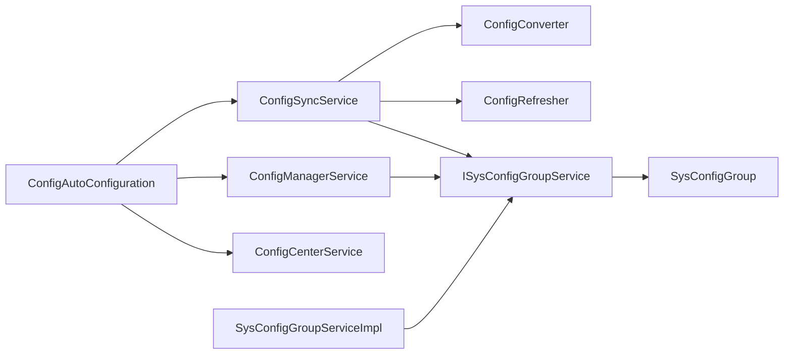

# 配置服务层

<cite>
**本文引用的文件**
- [ConfigAutoConfiguration.java](file://forge/forge-framework/forge-starter-parent/forge-starter-config/src/main/java/com/mdframe/forge/starter/config/config/ConfigAutoConfiguration.java)
- [ConfigCenterService.java](file://forge/forge-framework/forge-starter-parent/forge-starter-config/src/main/java/com/mdframe/forge/starter/config/service/ConfigCenterService.java)
- [ConfigManagerService.java](file://forge/forge-framework/forge-starter-parent/forge-starter-config/src/main/java/com/mdframe/forge/starter/config/service/ConfigManagerService.java)
- [ConfigSyncService.java](file://forge/forge-framework/forge-starter-parent/forge-starter-config/src/main/java/com/mdframe/forge/starter/config/service/ConfigSyncService.java)
- [ConfigConverter.java](file://forge/forge-framework/forge-starter-parent/forge-starter-config/src/main/java/com/mdframe/forge/starter/config/converter/ConfigConverter.java)
- [ISysConfigGroupService.java](file://forge/forge-framework/forge-starter-parent/forge-starter-config/src/main/java/com/mdframe/forge/starter/config/service/ISysConfigGroupService.java)
- [SysConfigGroupServiceImpl.java](file://forge/forge-framework/forge-starter-parent/forge-starter-config/src/main/java/com/mdframe/forge/starter/config/service/impl/SysConfigGroupServiceImpl.java)
- [SysConfigGroup.java](file://forge/forge-framework/forge-starter-parent/forge-starter-config/src/main/java/com/mdframe/forge/starter/config/entity/SysConfigGroup.java)
- [ConfigRefresher.java](file://forge/forge-framework/forge-starter-parent/forge-starter-config/src/main/java/com/mdframe/forge/starter/property/refresh/ConfigRefresher.java)
- [ConfigRefreshController.java](file://forge/forge-framework/forge-starter-parent/forge-starter-config/src/main/java/com/mdframe/forge/starter/property/controller/ConfigRefreshController.java)
</cite>

## 目录
1. [简介](#简介)
2. [项目结构](#项目结构)
3. [核心组件](#核心组件)
4. [架构总览](#架构总览)
5. [组件详解](#组件详解)
6. [依赖关系分析](#依赖关系分析)
7. [性能考量](#性能考量)
8. [故障排查指南](#故障排查指南)
9. [结论](#结论)

## 简介
本文件面向Forge配置服务层，系统性梳理并解释以下关键服务与机制：
- ConfigCenterService：配置中心服务，负责在分布式环境下触发与强制同步配置，保障一致性。
- ConfigManagerService：配置管理器，提供多种配置类型的读取与持久化能力，并支持通用Map读写。
- ConfigSyncService：配置同步服务，负责将SysConfigGroup中的配置转换并刷新到运行时属性体系。
- ConfigConverter：配置转换器，将JSON格式的配置值解析为sys_config表所需的键值对。
- ISysConfigGroupService与SysConfigGroupServiceImpl：配置分组的数据访问与业务服务层。
- ConfigRefresher与ConfigRefreshController：配置刷新器与手动刷新REST接口，用于动态生效配置。

## 项目结构
配置服务层位于“forge-starter-config”模块中，采用按职责分层组织：
- config包：自动装配与配置入口
- service包：服务层（ConfigCenterService、ConfigManagerService、ConfigSyncService）
- converter包：配置转换器（ConfigConverter）
- entity与mapper/service/impl：实体、数据访问与服务实现（SysConfigGroup相关）
- property.refresh与controller：配置刷新器与手动刷新接口

图表来源
- [ConfigAutoConfiguration.java](file://forge/forge-framework/forge-starter-parent/forge-starter-config/src/main/java/com/mdframe/forge/starter/config/config/ConfigAutoConfiguration.java#L18-L47)
- [ConfigCenterService.java](file://forge/forge-framework/forge-starter-parent/forge-starter-config/src/main/java/com/mdframe/forge/starter/config/service/ConfigCenterService.java#L13-L54)
- [ConfigManagerService.java](file://forge/forge-framework/forge-starter-parent/forge-starter-config/src/main/java/com/mdframe/forge/starter/config/service/ConfigManagerService.java#L22-L193)
- [ConfigSyncService.java](file://forge/forge-framework/forge-starter-parent/forge-starter-config/src/main/java/com/mdframe/forge/starter/config/service/ConfigSyncService.java#L24-L120)
- [ConfigConverter.java](file://forge/forge-framework/forge-starter-parent/forge-starter-config/src/main/java/com/mdframe/forge/starter/config/converter/ConfigConverter.java#L16-L188)
- [ISysConfigGroupService.java](file://forge/forge-framework/forge-starter-parent/forge-starter-config/src/main/java/com/mdframe/forge/starter/config/service/ISysConfigGroupService.java#L11-L44)
- [SysConfigGroupServiceImpl.java](file://forge/forge-framework/forge-starter-parent/forge-starter-config/src/main/java/com/mdframe/forge/starter/config/service/impl/SysConfigGroupServiceImpl.java#L16-L32)
- [SysConfigGroup.java](file://forge/forge-framework/forge-starter-parent/forge-starter-config/src/main/java/com/mdframe/forge/starter/config/entity/SysConfigGroup.java#L15-L73)
- [ConfigRefresher.java](file://forge/forge-framework/forge-starter-parent/forge-starter-config/src/main/java/com/mdframe/forge/starter/property/refresh/ConfigRefresher.java#L22-L56)
- [ConfigRefreshController.java](file://forge/forge-framework/forge-starter-parent/forge-starter-config/src/main/java/com/mdframe/forge/starter/property/controller/ConfigRefreshController.java#L17-L42)

章节来源
- [ConfigAutoConfiguration.java](file://forge/forge-framework/forge-starter-parent/forge-starter-config/src/main/java/com/mdframe/forge/starter/config/config/ConfigAutoConfiguration.java#L18-L47)

## 核心组件
- ConfigCenterService：对外暴露触发与强制同步接口，内部通过本地锁避免并发冲突，委托ConfigSyncService执行同步。
- ConfigManagerService：提供多类配置的读取与保存（如登录、水印、加解密、认证、日志等），并支持通用Map读写。
- ConfigSyncService：遍历启用的配置分组，调用ConfigConverter进行键值转换，再通过ConfigRefresher刷新运行时属性。
- ConfigConverter：针对不同分组（login、watermark、crypto、auth、log）将JSON配置映射为扁平键值对。
- ISysConfigGroupService/SysConfigGroupServiceImpl：封装配置分组的查询、启用状态变更与值更新。
- ConfigRefresher/ConfigRefreshController：负责将新配置注入PropertySource并刷新RefreshScope Bean，同时提供手动刷新REST端点。

章节来源
- [ConfigCenterService.java](file://forge/forge-framework/forge-starter-parent/forge-starter-config/src/main/java/com/mdframe/forge/starter/config/service/ConfigCenterService.java#L13-L54)
- [ConfigManagerService.java](file://forge/forge-framework/forge-starter-parent/forge-starter-config/src/main/java/com/mdframe/forge/starter/config/service/ConfigManagerService.java#L22-L193)
- [ConfigSyncService.java](file://forge/forge-framework/forge-starter-parent/forge-starter-config/src/main/java/com/mdframe/forge/starter/config/service/ConfigSyncService.java#L24-L120)
- [ConfigConverter.java](file://forge/forge-framework/forge-starter-parent/forge-starter-config/src/main/java/com/mdframe/forge/starter/config/converter/ConfigConverter.java#L16-L188)
- [ISysConfigGroupService.java](file://forge/forge-framework/forge-starter-parent/forge-starter-config/src/main/java/com/mdframe/forge/starter/config/service/ISysConfigGroupService.java#L11-L44)
- [SysConfigGroupServiceImpl.java](file://forge/forge-framework/forge-starter-parent/forge-starter-config/src/main/java/com/mdframe/forge/starter/config/service/impl/SysConfigGroupServiceImpl.java#L16-L32)
- [ConfigRefresher.java](file://forge/forge-framework/forge-starter-parent/forge-starter-config/src/main/java/com/mdframe/forge/starter/property/refresh/ConfigRefresher.java#L22-L56)
- [ConfigRefreshController.java](file://forge/forge-framework/forge-starter-parent/forge-starter-config/src/main/java/com/mdframe/forge/starter/property/controller/ConfigRefreshController.java#L17-L42)

## 架构总览
下图展示配置服务层在启动与运行期的关键交互路径：

图表来源
- [ConfigAutoConfiguration.java](file://forge/forge-framework/forge-starter-parent/forge-starter-config/src/main/java/com/mdframe/forge/starter/config/config/ConfigAutoConfiguration.java#L20-L46)
- [ConfigSyncService.java](file://forge/forge-framework/forge-starter-parent/forge-starter-config/src/main/java/com/mdframe/forge/starter/config/service/ConfigSyncService.java#L37-L57)
- [ConfigConverter.java](file://forge/forge-framework/forge-starter-parent/forge-starter-config/src/main/java/com/mdframe/forge/starter/config/converter/ConfigConverter.java#L25-L107)
- [ConfigRefresher.java](file://forge/forge-framework/forge-starter-parent/forge-starter-config/src/main/java/com/mdframe/forge/starter/property/refresh/ConfigRefresher.java#L29-L49)

## 组件详解

### ConfigCenterService：配置中心服务
- 职责
  - 在分布式场景下提供“触发同步”和“强制同步”能力，确保同一时刻仅有一个同步流程执行。
  - 通过本地锁保护，避免并发重复同步导致的资源竞争。
- 关键接口
  - triggerConfigSync(triggerNode)：记录触发节点并执行全量同步。
  - forceSyncConfig()：直接执行全量同步。
- 异常处理
  - 同步过程捕获异常并返回false，同时记录错误日志。

图表来源
- [ConfigCenterService.java](file://forge/forge-framework/forge-starter-parent/forge-starter-config/src/main/java/com/mdframe/forge/starter/config/service/ConfigCenterService.java#L27-L41)

章节来源
- [ConfigCenterService.java](file://forge/forge-framework/forge-starter-parent/forge-starter-config/src/main/java/com/mdframe/forge/starter/config/service/ConfigCenterService.java#L13-L54)

### ConfigManagerService：配置管理器
- 职责
  - 提供多类配置的读取与保存：登录、安全、系统、水印、加解密、认证、日志等。
  - 支持通用Map读取与保存，便于灵活扩展。
- 实现要点
  - 读取：根据groupCode查询SysConfigGroup，反序列化为对应配置对象；若无配置则构造默认实例。
  - 保存：将配置对象序列化为JSON后更新SysConfigGroup的configValue。
  - Map读写：直接将Map序列化/反序列化为JSON字符串。
- 异常处理
  - 读取失败时记录错误并返回默认实例；保存失败返回false。

图表来源
- [ConfigManagerService.java](file://forge/forge-framework/forge-starter-parent/forge-starter-config/src/main/java/com/mdframe/forge/starter/config/service/ConfigManagerService.java#L24-L193)

章节来源
- [ConfigManagerService.java](file://forge/forge-framework/forge-starter-parent/forge-starter-config/src/main/java/com/mdframe/forge/starter/config/service/ConfigManagerService.java#L22-L193)

### ConfigSyncService：配置同步服务
- 职责
  - 将SysConfigGroup中的启用分组逐个转换为sys_config表所需的键值对，并通过ConfigRefresher刷新运行时属性。
- 关键流程
  - syncAllConfigs：遍历启用分组，调用syncConfigGroupToSysConfig转换，最终统一刷新。
  - syncConfigGroup：按groupCode同步单一分组。
  - syncConfigGroupToSysConfig：根据groupCode选择对应转换器方法，生成键值对。
- 一致性与容错
  - 对空配置值进行跳过处理；未知分组记录警告；异常被捕获并返回false。

图表来源
- [ConfigSyncService.java](file://forge/forge-framework/forge-starter-parent/forge-starter-config/src/main/java/com/mdframe/forge/starter/config/service/ConfigSyncService.java#L37-L57)
- [ConfigSyncService.java](file://forge/forge-framework/forge-starter-parent/forge-starter-config/src/main/java/com/mdframe/forge/starter/config/service/ConfigSyncService.java#L87-L114)

章节来源
- [ConfigSyncService.java](file://forge/forge-framework/forge-starter-parent/forge-starter-config/src/main/java/com/mdframe/forge/starter/config/service/ConfigSyncService.java#L24-L120)

### ConfigConverter：配置转换器
- 职责
  - 将JSON格式的配置值解析为扁平键值对，键名遵循约定前缀，便于注入到运行时属性。
- 支持分组
  - login、watermark、crypto、auth、log五类配置分别映射到不同的键集合。
- 数组/列表处理
  - 对数组类型字段（如排除路径）拼接为逗号分隔字符串写入对应键。

图表来源
- [ConfigConverter.java](file://forge/forge-framework/forge-starter-parent/forge-starter-config/src/main/java/com/mdframe/forge/starter/config/converter/ConfigConverter.java#L16-L188)

章节来源
- [ConfigConverter.java](file://forge/forge-framework/forge-starter-parent/forge-starter-config/src/main/java/com/mdframe/forge/starter/config/converter/ConfigConverter.java#L16-L188)

### ISysConfigGroupService 与 SysConfigGroupServiceImpl
- 职责
  - ISysConfigGroupService：定义按分组编码查询、启用状态变更、值更新等操作。
  - SysConfigGroupServiceImpl：基于MyBatis-Plus实现查询启用分组、按编码查询与更新。
- 数据模型
  - SysConfigGroup：包含主键、分组编码、名称、图标、JSON配置值、排序、状态、备注及时间戳。

图表来源
- [SysConfigGroup.java](file://forge/forge-framework/forge-starter-parent/forge-starter-config/src/main/java/com/mdframe/forge/starter/config/entity/SysConfigGroup.java#L15-L73)

章节来源
- [ISysConfigGroupService.java](file://forge/forge-framework/forge-starter-parent/forge-starter-config/src/main/java/com/mdframe/forge/starter/config/service/ISysConfigGroupService.java#L11-L44)
- [SysConfigGroupServiceImpl.java](file://forge/forge-framework/forge-starter-parent/forge-starter-config/src/main/java/com/mdframe/forge/starter/config/service/impl/SysConfigGroupServiceImpl.java#L16-L32)
- [SysConfigGroup.java](file://forge/forge-framework/forge-starter-parent/forge-starter-config/src/main/java/com/mdframe/forge/starter/config/entity/SysConfigGroup.java#L15-L73)

### ConfigRefresher 与 ConfigRefreshController
- ConfigRefresher
  - 从数据库加载现有配置，合并新传入的键值对，更新DbPropertySource，最后刷新RefreshScope Bean。
  - 提供带参与无参refresh方法，均进行同步与异常捕获。
- ConfigRefreshController
  - 提供POST /api/config/refresh手动触发刷新，返回成功/失败与消息。

图表来源
- [ConfigRefreshController.java](file://forge/forge-framework/forge-starter-parent/forge-starter-config/src/main/java/com/mdframe/forge/starter/property/controller/ConfigRefreshController.java#L28-L41)
- [ConfigRefresher.java](file://forge/forge-framework/forge-starter-parent/forge-starter-config/src/main/java/com/mdframe/forge/starter/property/refresh/ConfigRefresher.java#L54-L56)

章节来源
- [ConfigRefresher.java](file://forge/forge-framework/forge-starter-parent/forge-starter-config/src/main/java/com/mdframe/forge/starter/property/refresh/ConfigRefresher.java#L22-L56)
- [ConfigRefreshController.java](file://forge/forge-framework/forge-starter-parent/forge-starter-config/src/main/java/com/mdframe/forge/starter/property/controller/ConfigRefreshController.java#L17-L42)

## 依赖关系分析
- 自动装配
  - ConfigAutoConfiguration在容器中注册ConfigManagerService、ConfigConverter、ConfigSyncService与ConfigCenterService。
- 运行期耦合
  - ConfigCenterService依赖ConfigSyncService；ConfigSyncService依赖ISysConfigGroupService、ConfigConverter与ConfigRefresher。
  - ConfigManagerService依赖ISysConfigGroupService与ObjectMapper。
  - ConfigConverter依赖ObjectMapper与Jackson树结构解析。
  - ConfigRefresher依赖ApplicationContext、ConfigurableEnvironment、RefreshScopeImpl与JdbcTemplate。

图表来源
- [ConfigAutoConfiguration.java](file://forge/forge-framework/forge-starter-parent/forge-starter-config/src/main/java/com/mdframe/forge/starter/config/config/ConfigAutoConfiguration.java#L20-L46)
- [ConfigSyncService.java](file://forge/forge-framework/forge-starter-parent/forge-starter-config/src/main/java/com/mdframe/forge/starter/config/service/ConfigSyncService.java#L29-L32)
- [ConfigCenterService.java](file://forge/forge-framework/forge-starter-parent/forge-starter-config/src/main/java/com/mdframe/forge/starter/config/service/ConfigCenterService.java#L18-L19)
- [SysConfigGroupServiceImpl.java](file://forge/forge-framework/forge-starter-parent/forge-starter-config/src/main/java/com/mdframe/forge/starter/config/service/impl/SysConfigGroupServiceImpl.java#L16-L32)

章节来源
- [ConfigAutoConfiguration.java](file://forge/forge-framework/forge-starter-parent/forge-starter-config/src/main/java/com/mdframe/forge/starter/config/config/ConfigAutoConfiguration.java#L18-L47)
- [ConfigSyncService.java](file://forge/forge-framework/forge-starter-parent/forge-starter-config/src/main/java/com/mdframe/forge/starter/config/service/ConfigSyncService.java#L24-L120)
- [ConfigCenterService.java](file://forge/forge-framework/forge-starter-parent/forge-starter-config/src/main/java/com/mdframe/forge/starter/config/service/ConfigCenterService.java#L13-L54)
- [SysConfigGroupServiceImpl.java](file://forge/forge-framework/forge-starter-parent/forge-starter-config/src/main/java/com/mdframe/forge/starter/config/service/impl/SysConfigGroupServiceImpl.java#L16-L32)

## 性能考量
- 并发控制
  - ConfigCenterService使用本地锁保护同步入口，避免多节点/多线程同时触发同步造成抖动。
- 批量合并
  - ConfigSyncService在同步时先聚合所有分组的键值对，再一次性调用ConfigRefresher刷新，减少多次刷新开销。
- 查询优化
  - SysConfigGroupServiceImpl按状态与排序查询启用分组，避免不必要的无效配置参与同步。
- 序列化成本
  - ConfigManagerService与ConfigSyncService均使用Jackson进行JSON序列化/反序列化，建议在高频场景下关注对象大小与复杂度。
- 刷新范围
  - ConfigRefresher刷新整个DbPropertySource并刷新RefreshScope Bean，建议在批量更新后统一触发，避免频繁小粒度刷新。

## 故障排查指南
- 同步失败
  - 现象：triggerConfigSync/forceSyncConfig返回false或日志报错。
  - 排查：检查ConfigSyncService的异常捕获分支；确认ISysConfigGroupService可正确查询启用分组；核对ConfigConverter转换逻辑与输入JSON格式。
- 未知分组
  - 现象：日志出现“未知的配置分组”警告。
  - 排查：确认SysConfigGroup的groupCode是否为受支持的枚举值（login/watermark/crypto/auth/log）。
- 刷新无效
  - 现象：修改配置后未生效。
  - 排查：确认ConfigRefresher已成功更新DbPropertySource并刷新RefreshScope；检查ConfigRefreshController端点是否被禁用；验证配置键名是否符合约定前缀。
- 手动刷新
  - 调用方式：POST /api/config/refresh。
  - 注意：当开启手动刷新端点时，需谨慎控制访问权限与频率，避免滥用。

章节来源
- [ConfigCenterService.java](file://forge/forge-framework/forge-starter-parent/forge-starter-config/src/main/java/com/mdframe/forge/starter/config/service/ConfigCenterService.java#L27-L41)
- [ConfigSyncService.java](file://forge/forge-framework/forge-starter-parent/forge-starter-config/src/main/java/com/mdframe/forge/starter/config/service/ConfigSyncService.java#L87-L114)
- [ConfigRefresher.java](file://forge/forge-framework/forge-starter-parent/forge-starter-config/src/main/java/com/mdframe/forge/starter/property/refresh/ConfigRefresher.java#L29-L49)
- [ConfigRefreshController.java](file://forge/forge-framework/forge-starter-parent/forge-starter-config/src/main/java/com/mdframe/forge/starter/property/controller/ConfigRefreshController.java#L28-L41)

## 结论
Forge配置服务层通过“配置管理器—配置同步—配置中心—配置刷新”的分层设计，实现了从配置读写、转换、同步到动态生效的完整闭环。其特性包括：
- 明确的职责分离与自动装配机制；
- 基于分组的可扩展转换器；
- 本地锁保护的同步入口；
- 与运行时属性体系的无缝集成与手动刷新能力。

在实际使用中，建议结合业务场景合理规划分组与键命名，严格控制刷新频率，并通过监控与日志及时发现异常。