# 配置管理模块

<cite>
**本文档引用的文件**
- [pom.xml](file://forge/forge-framework/forge-starter-parent/forge-starter-config/pom.xml)
- [USAGE_EXAMPLE.md](file://forge/forge-framework/forge-starter-parent/forge-starter-config/USAGE_EXAMPLE.md)
- [ConfigAutoConfiguration.java](file://forge/forge-framework/forge-starter-parent/forge-starter-config/src/main/java/com/mdframe/forge/starter/config/config/ConfigAutoConfiguration.java)
- [ConfigCenterService.java](file://forge/forge-framework/forge-starter-parent/forge-starter-config/src/main/java/com/mdframe/forge/starter/config/service/ConfigCenterService.java)
- [ConfigManagerService.java](file://forge/forge-framework/forge-starter-parent/forge-starter-config/src/main/java/com/mdframe/forge/starter/config/service/ConfigManagerService.java)
- [ConfigSyncService.java](file://forge/forge-framework/forge-starter-parent/forge-starter-config/src/main/java/com/mdframe/forge/starter/config/service/ConfigSyncService.java)
- [ConfigConverter.java](file://forge/forge-framework/forge-starter-parent/forge-starter-config/src/main/java/com/mdframe/forge/starter/config/converter/ConfigConverter.java)
- [ConfigGroupChangeListener.java](file://forge/forge-framework/forge-starter-parent/forge-starter-config/src/main/java/com/mdframe/forge/starter/config/listener/ConfigGroupChangeListener.java)
- [ConfigRefresher.java](file://forge/forge-framework/forge-starter-parent/forge-starter-config/src/main/java/com/mdframe/forge/starter/property/refresh/ConfigRefresher.java)
- [DbPropertySource.java](file://forge/forge-framework/forge-starter-parent/forge-starter-config/src/main/java/com/mdframe/forge/starter/property/DbPropertySource.java)
- [ConfigRefreshEvent.java](file://forge/forge-framework/forge-starter-parent/forge-starter-config/src/main/java/com/mdframe/forge/starter/property/event/ConfigRefreshEvent.java)
- [SysConfigGroup.java](file://forge/forge-framework/forge-starter-parent/forge-starter-config/src/main/java/com/mdframe/forge/starter/config/entity/SysConfigGroup.java)
- [config_group_table.sql](file://forge/forge-framework/forge-starter-parent/forge-starter-config/src/main/resources/sql/config_group_table.sql)
</cite>

## 目录
1. [简介](#简介)
2. [项目结构](#项目结构)
3. [核心组件](#核心组件)
4. [架构总览](#架构总览)
5. [详细组件分析](#详细组件分析)
6. [依赖关系分析](#依赖关系分析)
7. [性能考虑](#性能考虑)
8. [故障排除指南](#故障排除指南)
9. [结论](#结论)
10. [附录](#附录)

## 简介
本模块为Forge配置管理子系统，提供基于数据库的配置中心能力，支持配置组管理、数据库配置源注入、配置刷新与监听、配置转换与同步等功能。系统通过Spring Environment的PropertySource扩展，将数据库配置注入到运行时环境；通过RefreshScope实现Bean级别的动态刷新；通过事件机制实现配置变更通知与同步。

## 项目结构
该模块位于forge-starter-config，主要包含以下层次：
- 配置自动装配与入口：ConfigAutoConfiguration
- 配置管理服务：ConfigManagerService
- 配置中心服务：ConfigCenterService
- 配置同步服务：ConfigSyncService
- 配置转换器：ConfigConverter
- 配置监听器：ConfigGroupChangeListener
- 配置刷新器：ConfigRefresher
- 数据库属性源：DbPropertySource
- 配置刷新事件：ConfigRefreshEvent
- 实体与SQL：SysConfigGroup、config_group_table.sql

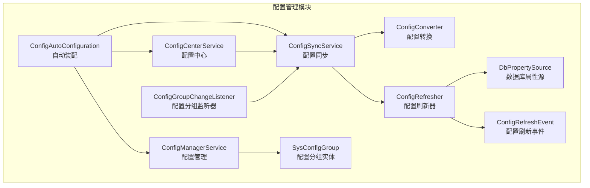

**图表来源**
- [ConfigAutoConfiguration.java](file://forge/forge-framework/forge-starter-parent/forge-starter-config/src/main/java/com/mdframe/forge/starter/config/config/ConfigAutoConfiguration.java#L14-L47)
- [ConfigManagerService.java](file://forge/forge-framework/forge-starter-parent/forge-starter-config/src/main/java/com/mdframe/forge/starter/config/service/ConfigManagerService.java#L1-L194)
- [ConfigSyncService.java](file://forge/forge-framework/forge-starter-parent/forge-starter-config/src/main/java/com/mdframe/forge/starter/config/service/ConfigSyncService.java#L1-L121)
- [ConfigCenterService.java](file://forge/forge-framework/forge-starter-parent/forge-starter-config/src/main/java/com/mdframe/forge/starter/config/service/ConfigCenterService.java#L1-L55)
- [ConfigConverter.java](file://forge/forge-framework/forge-starter-parent/forge-starter-config/src/main/java/com/mdframe/forge/starter/config/converter/ConfigConverter.java#L1-L189)
- [ConfigRefresher.java](file://forge/forge-framework/forge-starter-parent/forge-starter-config/src/main/java/com/mdframe/forge/starter/property/refresh/ConfigRefresher.java#L1-L204)
- [DbPropertySource.java](file://forge/forge-framework/forge-starter-parent/forge-starter-config/src/main/java/com/mdframe/forge/starter/property/DbPropertySource.java#L1-L34)
- [ConfigRefreshEvent.java](file://forge/forge-framework/forge-starter-parent/forge-starter-config/src/main/java/com/mdframe/forge/starter/property/event/ConfigRefreshEvent.java#L1-L43)
- [SysConfigGroup.java](file://forge/forge-framework/forge-starter-parent/forge-starter-config/src/main/java/com/mdframe/forge/starter/config/entity/SysConfigGroup.java#L1-L73)

**章节来源**
- [pom.xml](file://forge/forge-framework/forge-starter-parent/forge-starter-config/pom.xml#L1-L28)

## 核心组件
- 配置自动装配：负责装配ConfigManagerService、ConfigConverter、ConfigSyncService、ConfigCenterService等核心Bean。
- 配置管理器：提供按分组获取/保存配置的能力，支持多种预定义配置类型。
- 配置中心服务：在分布式场景下协调配置同步，提供触发与强制同步能力。
- 配置同步服务：将SysConfigGroup中的JSON配置转换为sys_config表所需的键值对，并触发刷新。
- 配置转换器：将不同类型的配置JSON转换为扁平化的键值对集合。
- 配置刷新器：负责从数据库加载最新配置，更新DbPropertySource并刷新RefreshScope。
- 数据库属性源：扩展Spring的PropertySource，作为数据库配置的容器。
- 配置刷新事件：封装配置变更信息，便于监听与处理。
- 配置监听器：监听配置刷新事件，触发配置分组同步。
- 实体与表：SysConfigGroup对应sys_config_group表，提供配置分组的持久化。

**章节来源**
- [ConfigAutoConfiguration.java](file://forge/forge-framework/forge-starter-parent/forge-starter-config/src/main/java/com/mdframe/forge/starter/config/config/ConfigAutoConfiguration.java#L14-L47)
- [ConfigManagerService.java](file://forge/forge-framework/forge-starter-parent/forge-starter-config/src/main/java/com/mdframe/forge/starter/config/service/ConfigManagerService.java#L1-L194)
- [ConfigCenterService.java](file://forge/forge-framework/forge-starter-parent/forge-starter-config/src/main/java/com/mdframe/forge/starter/config/service/ConfigCenterService.java#L1-L55)
- [ConfigSyncService.java](file://forge/forge-framework/forge-starter-parent/forge-starter-config/src/main/java/com/mdframe/forge/starter/config/service/ConfigSyncService.java#L1-L121)
- [ConfigConverter.java](file://forge/forge-framework/forge-starter-parent/forge-starter-config/src/main/java/com/mdframe/forge/starter/config/converter/ConfigConverter.java#L1-L189)
- [ConfigRefresher.java](file://forge/forge-framework/forge-starter-parent/forge-starter-config/src/main/java/com/mdframe/forge/starter/property/refresh/ConfigRefresher.java#L1-L204)
- [DbPropertySource.java](file://forge/forge-framework/forge-starter-parent/forge-starter-config/src/main/java/com/mdframe/forge/starter/property/DbPropertySource.java#L1-L34)
- [ConfigRefreshEvent.java](file://forge/forge-framework/forge-starter-parent/forge-starter-config/src/main/java/com/mdframe/forge/starter/property/event/ConfigRefreshEvent.java#L1-L43)
- [SysConfigGroup.java](file://forge/forge-framework/forge-starter-parent/forge-starter-config/src/main/java/com/mdframe/forge/starter/config/entity/SysConfigGroup.java#L1-L73)

## 架构总览
配置管理模块采用“配置分组存储 + 数据库属性源注入 + 动态刷新”的架构模式。核心流程如下：
- 应用启动时，ConfigSyncService将SysConfigGroup中的JSON配置转换为sys_config表的键值对，并通过ConfigRefresher刷新到DbPropertySource。
- 运行时，Spring Environment优先从DbPropertySource读取配置，@RefreshScope标注的Bean在配置刷新后自动重建。
- 配置变更通过ConfigGroupChangeListener监听并触发同步，确保多节点一致性。

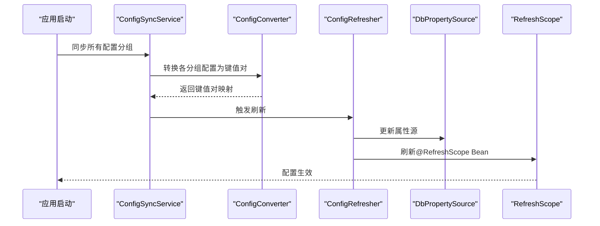

**图表来源**
- [ConfigSyncService.java](file://forge/forge-framework/forge-starter-parent/forge-starter-config/src/main/java/com/mdframe/forge/starter/config/service/ConfigSyncService.java#L37-L57)
- [ConfigConverter.java](file://forge/forge-framework/forge-starter-parent/forge-starter-config/src/main/java/com/mdframe/forge/starter/config/converter/ConfigConverter.java#L25-L37)
- [ConfigRefresher.java](file://forge/forge-framework/forge-starter-parent/forge-starter-config/src/main/java/com/mdframe/forge/starter/property/refresh/ConfigRefresher.java#L54-L93)
- [DbPropertySource.java](file://forge/forge-framework/forge-starter-parent/forge-starter-config/src/main/java/com/mdframe/forge/starter/property/DbPropertySource.java#L10-L34)

## 详细组件分析

### 配置管理器（ConfigManagerService）
职责：
- 提供按分组获取与保存配置的方法，覆盖登录、安全、系统、水印、加解密、认证、日志等配置类型。
- 使用Jackson将配置对象序列化/反序列化为JSON存储于SysConfigGroup.configValue。
- 提供Map形式的配置读写接口，便于灵活扩展。

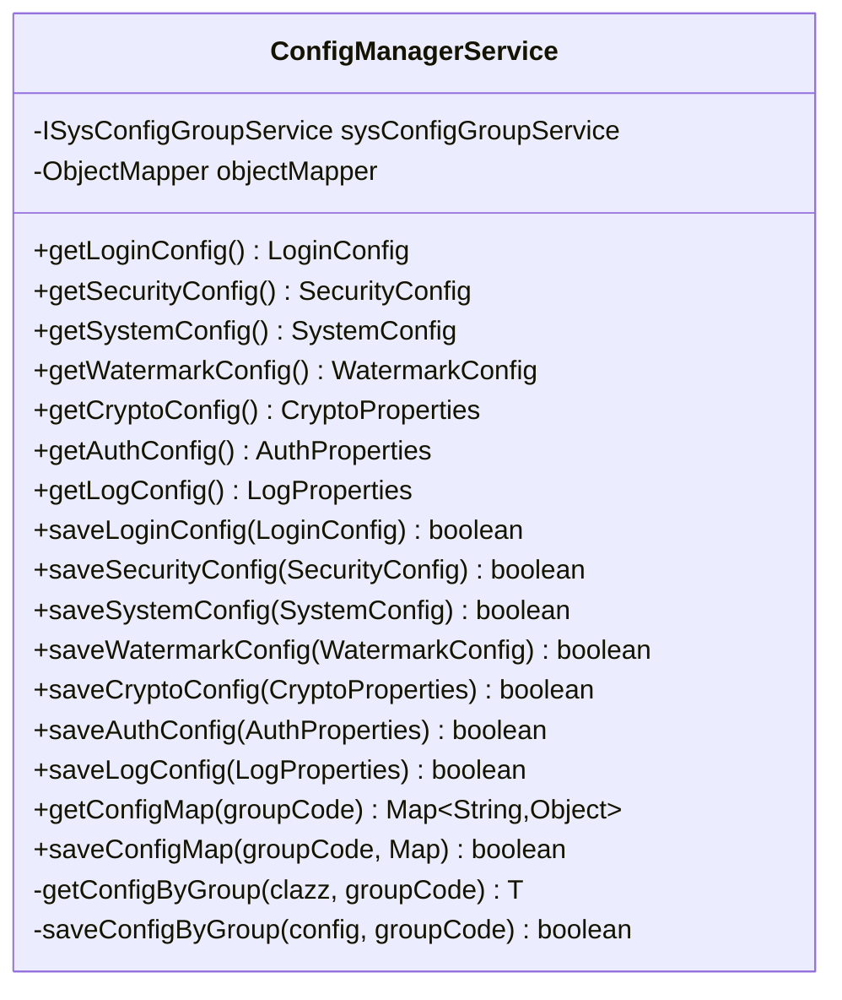

**图表来源**
- [ConfigManagerService.java](file://forge/forge-framework/forge-starter-parent/forge-starter-config/src/main/java/com/mdframe/forge/starter/config/service/ConfigManagerService.java#L1-L194)

**章节来源**
- [ConfigManagerService.java](file://forge/forge-framework/forge-starter-parent/forge-starter-config/src/main/java/com/mdframe/forge/starter/config/service/ConfigManagerService.java#L1-L194)

### 配置中心服务（ConfigCenterService）
职责：
- 在分布式环境下协调配置同步，提供triggerConfigSync与forceSyncConfig两种同步方式。
- 使用本地锁保证同一时刻仅有一个同步操作执行，避免并发冲突。

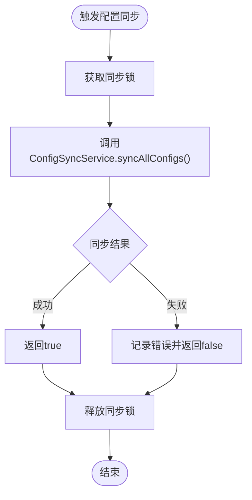

**图表来源**
- [ConfigCenterService.java](file://forge/forge-framework/forge-starter-parent/forge-starter-config/src/main/java/com/mdframe/forge/starter/config/service/ConfigCenterService.java#L27-L53)

**章节来源**
- [ConfigCenterService.java](file://forge/forge-framework/forge-starter-parent/forge-starter-config/src/main/java/com/mdframe/forge/starter/config/service/ConfigCenterService.java#L1-L55)

### 配置同步服务（ConfigSyncService）
职责：
- 将SysConfigGroup中的JSON配置转换为sys_config表所需的键值对，并调用ConfigRefresher刷新。
- 支持全量同步与单分组同步，内部使用ConfigConverter进行类型化转换。

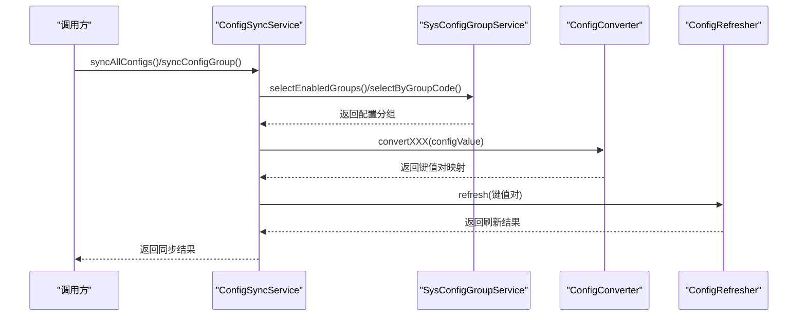

**图表来源**
- [ConfigSyncService.java](file://forge/forge-framework/forge-starter-parent/forge-starter-config/src/main/java/com/mdframe/forge/starter/config/service/ConfigSyncService.java#L37-L82)
- [ConfigConverter.java](file://forge/forge-framework/forge-starter-parent/forge-starter-config/src/main/java/com/mdframe/forge/starter/config/converter/ConfigConverter.java#L25-L171)
- [ConfigRefresher.java](file://forge/forge-framework/forge-starter-parent/forge-starter-config/src/main/java/com/mdframe/forge/starter/property/refresh/ConfigRefresher.java#L29-L49)

**章节来源**
- [ConfigSyncService.java](file://forge/forge-framework/forge-starter-parent/forge-starter-config/src/main/java/com/mdframe/forge/starter/config/service/ConfigSyncService.java#L1-L121)

### 配置转换器（ConfigConverter）
职责：
- 将不同类型的配置JSON转换为扁平化的键值对，键名遵循约定前缀，便于Spring环境读取。
- 支持布尔、数值、字符串以及数组类型的字段处理（如excludePaths系列）。

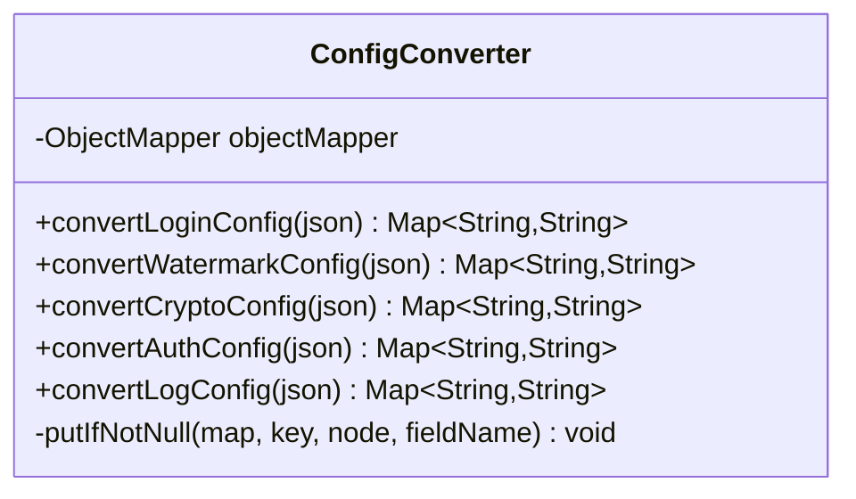

**图表来源**
- [ConfigConverter.java](file://forge/forge-framework/forge-starter-parent/forge-starter-config/src/main/java/com/mdframe/forge/starter/config/converter/ConfigConverter.java#L1-L189)

**章节来源**
- [ConfigConverter.java](file://forge/forge-framework/forge-starter-parent/forge-starter-config/src/main/java/com/mdframe/forge/starter/config/converter/ConfigConverter.java#L1-L189)

### 配置刷新器（ConfigRefresher）
职责：
- 从sys_config表加载配置，更新DbPropertySource，并刷新@RefreshScope Bean。
- 支持增量刷新与全量刷新，内置变更检测与事件发布（注释掉的兼容Spring Cloud事件）。

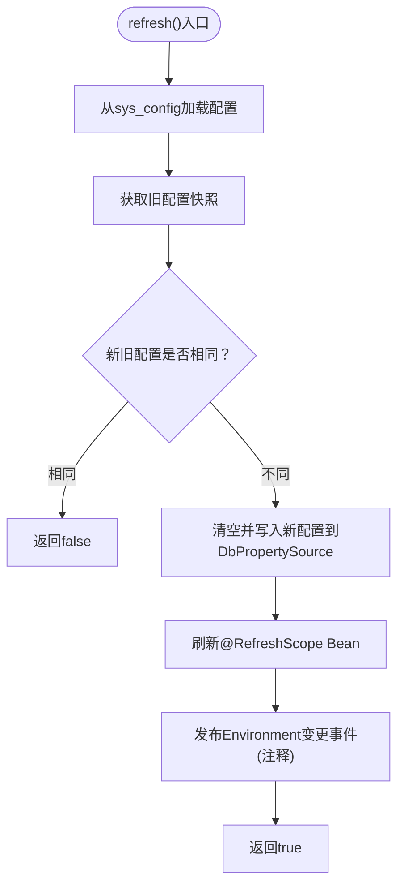

**图表来源**
- [ConfigRefresher.java](file://forge/forge-framework/forge-starter-parent/forge-starter-config/src/main/java/com/mdframe/forge/starter/property/refresh/ConfigRefresher.java#L54-L93)
- [DbPropertySource.java](file://forge/forge-framework/forge-starter-parent/forge-starter-config/src/main/java/com/mdframe/forge/starter/property/DbPropertySource.java#L10-L34)

**章节来源**
- [ConfigRefresher.java](file://forge/forge-framework/forge-starter-parent/forge-starter-config/src/main/java/com/mdframe/forge/starter/property/refresh/ConfigRefresher.java#L1-L204)

### 数据库属性源（DbPropertySource）
职责：
- 扩展Spring的PropertySource，作为数据库配置的容器，支持动态读取与更新。

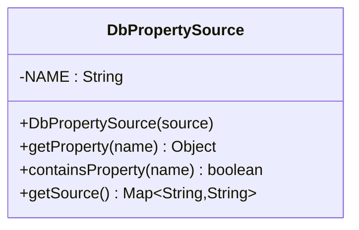

**图表来源**
- [DbPropertySource.java](file://forge/forge-framework/forge-starter-parent/forge-starter-config/src/main/java/com/mdframe/forge/starter/property/DbPropertySource.java#L10-L34)

**章节来源**
- [DbPropertySource.java](file://forge/forge-framework/forge-starter-parent/forge-starter-config/src/main/java/com/mdframe/forge/starter/property/DbPropertySource.java#L1-L34)

### 配置刷新事件（ConfigRefreshEvent）
职责：
- 封装配置变更信息，提供获取旧值、新值与变更项的方法，便于监听器处理。

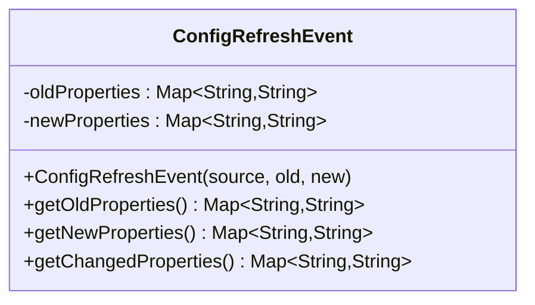

**图表来源**
- [ConfigRefreshEvent.java](file://forge/forge-framework/forge-starter-parent/forge-starter-config/src/main/java/com/mdframe/forge/starter/property/event/ConfigRefreshEvent.java#L10-L42)

**章节来源**
- [ConfigRefreshEvent.java](file://forge/forge-framework/forge-starter-parent/forge-starter-config/src/main/java/com/mdframe/forge/starter/property/event/ConfigRefreshEvent.java#L1-L43)

### 配置监听器（ConfigGroupChangeListener）
职责：
- 监听配置刷新事件，异步触发ConfigSyncService.syncAllConfigs()，确保配置分组与sys_config表保持一致。

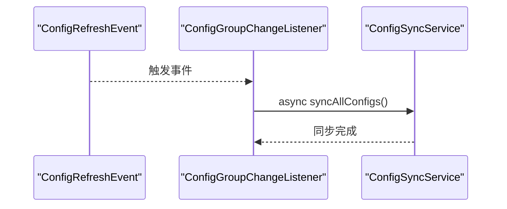

**图表来源**
- [ConfigGroupChangeListener.java](file://forge/forge-framework/forge-starter-parent/forge-starter-config/src/main/java/com/mdframe/forge/starter/config/listener/ConfigGroupChangeListener.java#L28-L33)

**章节来源**
- [ConfigGroupChangeListener.java](file://forge/forge-framework/forge-starter-parent/forge-starter-config/src/main/java/com/mdframe/forge/starter/config/listener/ConfigGroupChangeListener.java#L1-L35)

### 实体与表（SysConfigGroup）
职责：
- 持久化配置分组信息，包括分组编码、名称、图标、JSON配置值、状态与时间戳等字段。

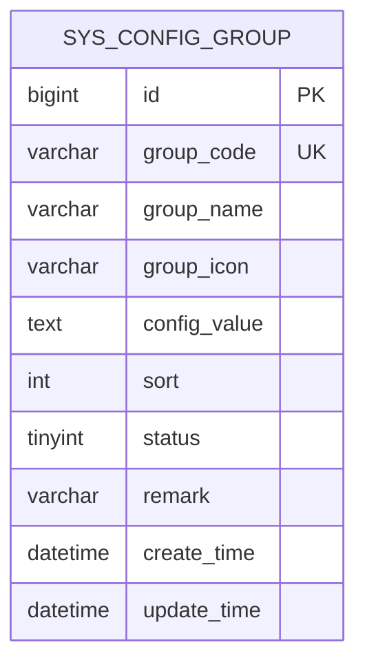

**图表来源**
- [SysConfigGroup.java](file://forge/forge-framework/forge-starter-parent/forge-starter-config/src/main/java/com/mdframe/forge/starter/config/entity/SysConfigGroup.java#L17-L73)
- [config_group_table.sql](file://forge/forge-framework/forge-starter-parent/forge-starter-config/src/main/resources/sql/config_group_table.sql#L1-L23)

**章节来源**
- [SysConfigGroup.java](file://forge/forge-framework/forge-starter-parent/forge-starter-config/src/main/java/com/mdframe/forge/starter/config/entity/SysConfigGroup.java#L1-L73)
- [config_group_table.sql](file://forge/forge-framework/forge-starter-parent/forge-starter-config/src/main/resources/sql/config_group_table.sql#L1-L23)

## 依赖关系分析
- 组件耦合：
  - ConfigAutoConfiguration集中装配核心Bean，降低外部依赖。
  - ConfigSyncService依赖JdbcTemplate与ConfigRefresher，耦合度适中。
  - ConfigManagerService依赖ISysConfigGroupService与ObjectMapper，职责清晰。
- 外部依赖：
  - Spring Boot Starter JDBC用于数据库访问。
  - Jackson用于JSON序列化/反序列化。
  - MyBatis-Plus注解用于实体映射。

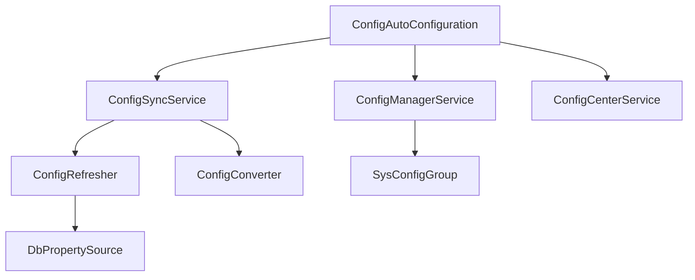

**图表来源**
- [ConfigAutoConfiguration.java](file://forge/forge-framework/forge-starter-parent/forge-starter-config/src/main/java/com/mdframe/forge/starter/config/config/ConfigAutoConfiguration.java#L20-L46)
- [pom.xml](file://forge/forge-framework/forge-starter-parent/forge-starter-config/pom.xml#L14-L24)

**章节来源**
- [pom.xml](file://forge/forge-framework/forge-starter-parent/forge-starter-config/pom.xml#L1-L28)

## 性能考虑
- 刷新频率：默认每30秒检查一次数据库配置变更，可通过配置调整刷新间隔。
- 缓存策略：建议在业务层引入两级缓存（本地+Redis），减少数据库压力与刷新频率。
- 并发控制：ConfigCenterService使用本地锁避免并发同步导致的数据不一致。
- 数据库查询：ConfigRefresher优先从sys_config表加载，建议为config_key建立索引以提升查询性能。

## 故障排除指南
- 未找到数据库配置源：检查DbPropertySource是否正确注册到Environment。
- 配置刷新无效：确认@RefreshScope注解是否正确标注，且Bean被Spring管理。
- 配置转换异常：检查SysConfigGroup.configValue的JSON格式是否符合预期。
- 同步失败：查看ConfigSyncService的日志输出，定位具体分组转换或刷新环节的问题。

**章节来源**
- [ConfigRefresher.java](file://forge/forge-framework/forge-starter-parent/forge-starter-config/src/main/java/com/mdframe/forge/starter/property/refresh/ConfigRefresher.java#L35-L48)
- [ConfigSyncService.java](file://forge/forge-framework/forge-starter-parent/forge-starter-config/src/main/java/com/mdframe/forge/starter/config/service/ConfigSyncService.java#L53-L56)

## 结论
Forge配置管理模块通过“配置分组 + 数据库属性源 + 动态刷新”的设计，实现了灵活、可扩展的配置中心能力。模块提供了完善的配置管理、同步与监听机制，能够满足多环境、多节点的配置需求。建议结合业务场景引入缓存与监控，进一步提升系统的稳定性与可观测性。

## 附录
- 使用示例与配置参考请参阅模块内的使用文档与SQL脚本。
- 建议在生产环境开启配置刷新接口与事件监听，以便快速响应配置变更。

**章节来源**
- [USAGE_EXAMPLE.md](file://forge/forge-framework/forge-starter-parent/forge-starter-config/USAGE_EXAMPLE.md#L1-L141)
- [config_group_table.sql](file://forge/forge-framework/forge-starter-parent/forge-starter-config/src/main/resources/sql/config_group_table.sql#L1-L23)