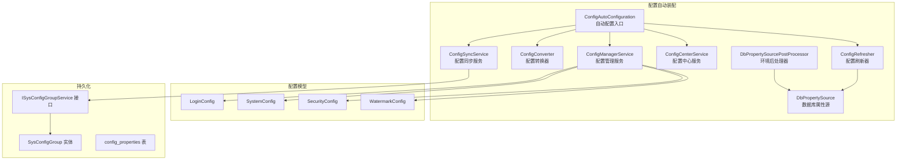
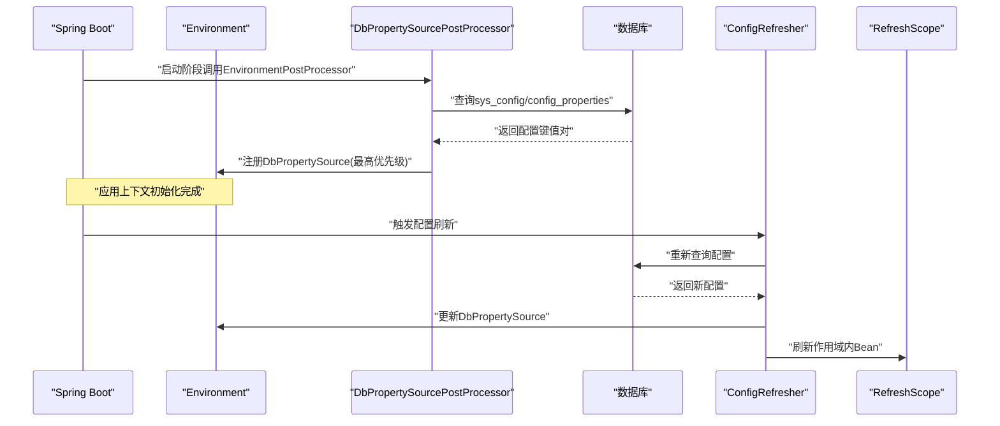
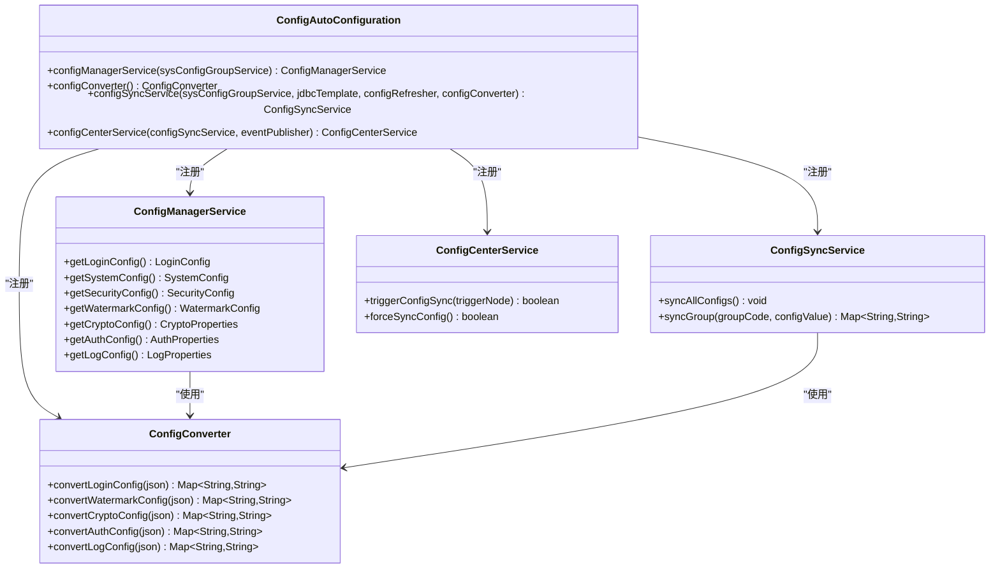
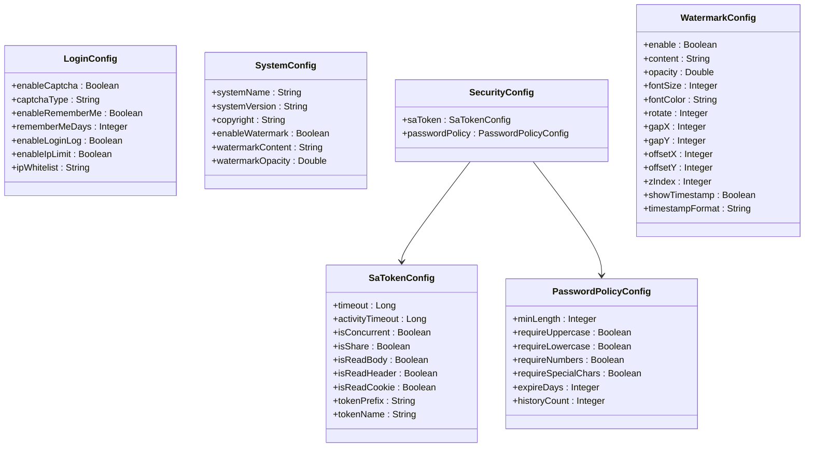
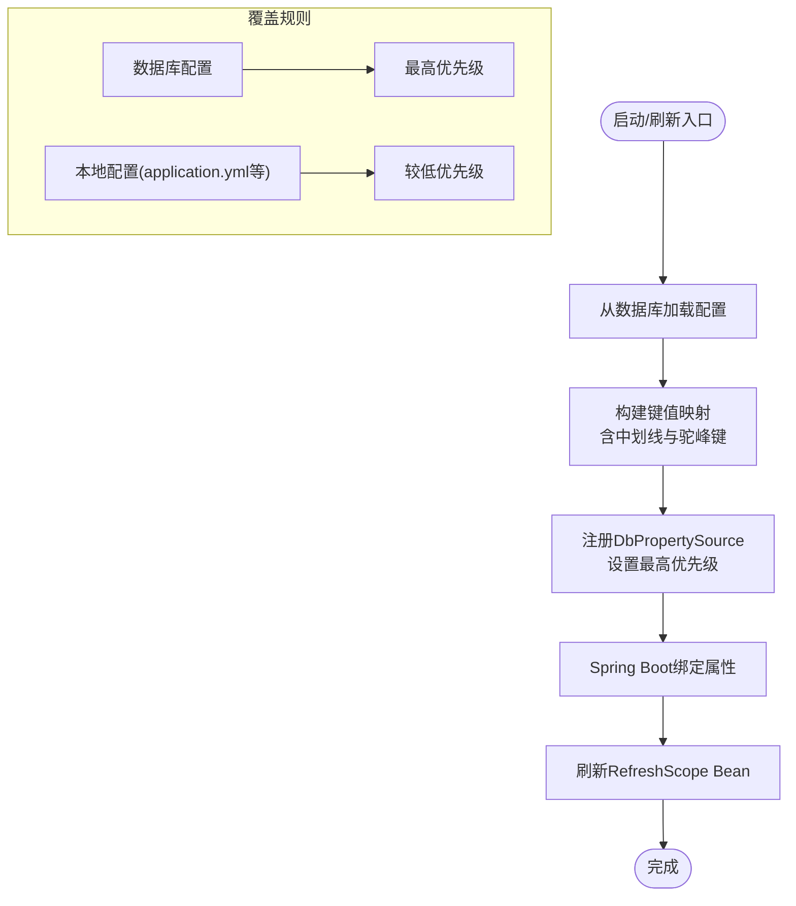
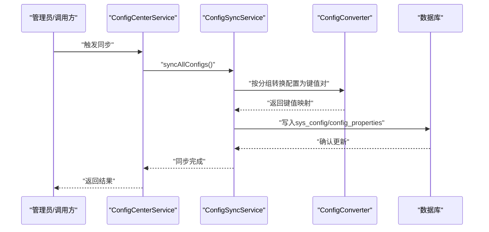
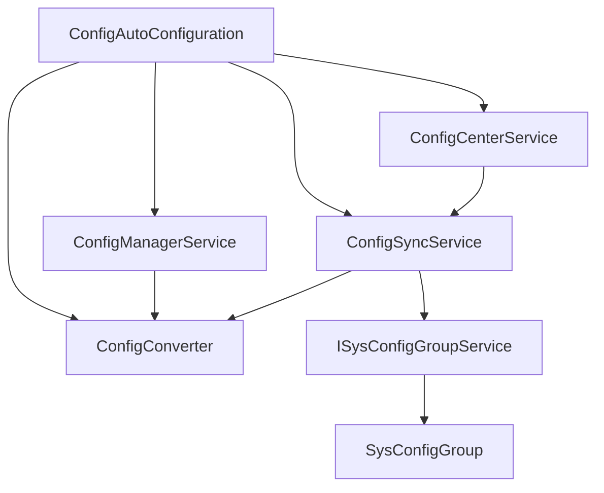

# 配置自动装配

<cite>
**本文档引用的文件**
- [ConfigAutoConfiguration.java](file://forge/forge-framework/forge-starter-parent/forge-starter-config/src/main/java/com/mdframe/forge/starter/config/config/ConfigAutoConfiguration.java)
- [ConfigManagerService.java](file://forge/forge-framework/forge-starter-parent/forge-starter-config/src/main/java/com/mdframe/forge/starter/config/service/ConfigManagerService.java)
- [ConfigConverter.java](file://forge/forge-framework/forge-starter-parent/forge-starter-config/src/main/java/com/mdframe/forge/starter/config/converter/ConfigConverter.java)
- [ConfigSyncService.java](file://forge/forge-framework/forge-starter-parent/forge-starter-config/src/main/java/com/mdframe/forge/starter/config/service/ConfigSyncService.java)
- [ConfigCenterService.java](file://forge/forge-framework/forge-starter-parent/forge-starter-config/src/main/java/com/mdframe/forge/starter/config/service/ConfigCenterService.java)
- [ConfigRefresher.java](file://forge/forge-framework/forge-starter-parent/forge-starter-config/src/main/java/com/mdframe/forge/starter/property/refresh/ConfigRefresher.java)
- [DbPropertySourcePostProcessor.java](file://forge/forge-framework/forge-starter-parent/forge-starter-config/src/main/java/com/mdframe/forge/starter/property/DbPropertySourcePostProcessor.java)
- [DbPropertySource.java](file://forge/forge-framework/forge-starter-parent/forge-starter-config/src/main/java/com/mdframe/forge/starter/property/DbPropertySource.java)
- [LoginConfig.java](file://forge/forge-framework/forge-starter-parent/forge-starter-config/src/main/java/com/mdframe/forge/starter/config/config/LoginConfig.java)
- [SystemConfig.java](file://forge/forge-framework/forge-starter-parent/forge-starter-config/src/main/java/com/mdframe/forge/starter/config/config/SystemConfig.java)
- [SecurityConfig.java](file://forge/forge-framework/forge-starter-parent/forge-starter-config/src/main/java/com/mdframe/forge/starter/config/config/SecurityConfig.java)
- [WatermarkConfig.java](file://forge/forge-framework/forge-starter-parent/forge-starter-config/src/main/java/com/mdframe/forge/starter/config/config/WatermarkConfig.java)
- [ISysConfigGroupService.java](file://forge/forge-framework/forge-starter-parent/forge-starter-config/src/main/java/com/mdframe/forge/starter/config/service/ISysConfigGroupService.java)
- [SysConfigGroup.java](file://forge/forge-framework/forge-starter-parent/forge-starter-config/src/main/java/com/mdframe/forge/starter/config/entity/SysConfigGroup.java)
- [config_properties.sql](file://forge/forge-framework/forge-starter-parent/forge-starter-config/sql/config_properties.sql)
- [ConfigManageController.java](file://forge/forge-admin/src/main/java/com/mdframe/forge/admin/ConfigController.java)
</cite>

## 目录
1. [简介](#简介)
2. [项目结构](#项目结构)
3. [核心组件](#核心组件)
4. [架构总览](#架构总览)
5. [详细组件分析](#详细组件分析)
6. [依赖关系分析](#依赖关系分析)
7. [性能考虑](#性能考虑)
8. [故障排除指南](#故障排除指南)
9. [结论](#结论)
10. [附录](#附录)

## 简介
本文件面向Forge配置自动装配功能，系统性解析ConfigAutoConfiguration的自动配置机制，涵盖配置类加载、Bean注册与条件装配；详解LoginConfig、SystemConfig等配置类的作用与配置项；解释配置属性的绑定过程、默认值设置与覆盖机制；并提供配置类的使用示例与最佳实践，包括如何扩展自定义配置类。

## 项目结构
Forge配置子系统位于forge-starter-config模块，围绕以下关键点组织：
- 自动配置入口：ConfigAutoConfiguration负责按需注册核心服务Bean
- 配置模型：LoginConfig、SystemConfig、SecurityConfig、WatermarkConfig等
- 属性绑定与刷新：DbPropertySourcePostProcessor在启动阶段注入数据库属性源；ConfigRefresher负责运行时刷新
- 配置同步与中心化：ConfigSyncService负责将分组配置同步至数据库；ConfigCenterService提供分布式同步能力
- 控制层：ConfigManageController提供REST接口用于获取与更新各类配置

图表来源
- [ConfigAutoConfiguration.java](file://forge/forge-framework/forge-starter-parent/forge-starter-config/src/main/java/com/mdframe/forge/starter/config/config/ConfigAutoConfiguration.java#L1-L47)
- [ConfigManagerService.java](file://forge/forge-framework/forge-starter-parent/forge-starter-config/src/main/java/com/mdframe/forge/starter/config/service/ConfigManagerService.java#L1-L114)
- [ConfigConverter.java](file://forge/forge-framework/forge-starter-parent/forge-starter-config/src/main/java/com/mdframe/forge/starter/config/converter/ConfigConverter.java#L1-L189)
- [ConfigSyncService.java](file://forge/forge-framework/forge-starter-parent/forge-starter-config/src/main/java/com/mdframe/forge/starter/config/service/ConfigSyncService.java#L1-L120)
- [ConfigCenterService.java](file://forge/forge-framework/forge-starter-parent/forge-starter-config/src/main/java/com/mdframe/forge/starter/config/service/ConfigCenterService.java#L1-L55)
- [ConfigRefresher.java](file://forge/forge-framework/forge-starter-parent/forge-starter-config/src/main/java/com/mdframe/forge/starter/property/refresh/ConfigRefresher.java#L1-L204)
- [DbPropertySourcePostProcessor.java](file://forge/forge-framework/forge-starter-parent/forge-starter-config/src/main/java/com/mdframe/forge/starter/property/DbPropertySourcePostProcessor.java#L1-L131)
- [DbPropertySource.java](file://forge/forge-framework/forge-starter-parent/forge-starter-config/src/main/java/com/mdframe/forge/starter/property/DbPropertySource.java#L1-L34)
- [SysConfigGroup.java](file://forge/forge-framework/forge-starter-parent/forge-starter-config/src/main/java/com/mdframe/forge/starter/config/entity/SysConfigGroup.java#L1-L73)
- [ISysConfigGroupService.java](file://forge/forge-framework/forge-starter-parent/forge-starter-config/src/main/java/com/mdframe/forge/starter/config/service/ISysConfigGroupService.java#L1-L45)
- [config_properties.sql](file://forge/forge-framework/forge-starter-parent/forge-starter-config/sql/config_properties.sql#L1-L31)

章节来源
- [ConfigAutoConfiguration.java](file://forge/forge-framework/forge-starter-parent/forge-starter-config/src/main/java/com/mdframe/forge/starter/config/config/ConfigAutoConfiguration.java#L1-L47)
- [DbPropertySourcePostProcessor.java](file://forge/forge-framework/forge-starter-parent/forge-starter-config/src/main/java/com/mdframe/forge/starter/property/DbPropertySourcePostProcessor.java#L1-L131)

## 核心组件
- 自动配置入口：ConfigAutoConfiguration通过条件注解按需注册ConfigManagerService、ConfigConverter、ConfigSyncService、ConfigCenterService等Bean，避免重复装配。
- 配置管理服务：ConfigManagerService提供按分组获取与保存配置的能力，内部委派给ISysConfigGroupService与ConfigConverter。
- 配置转换器：ConfigConverter将JSON配置转换为键值对，键名采用统一前缀规范，便于Spring Boot绑定。
- 配置同步服务：ConfigSyncService负责将内存中的配置转换并同步到sys_config或config_properties表，并触发刷新。
- 配置刷新器：ConfigRefresher在运行时从数据库重新加载配置，更新DbPropertySource并刷新RefreshScope Bean。
- 环境后处理器：DbPropertySourcePostProcessor在应用启动早期从数据库加载配置并注册为最高优先级的PropertySource。
- 数据模型：LoginConfig、SystemConfig、SecurityConfig、WatermarkConfig等作为配置载体，提供默认值与业务语义。

章节来源
- [ConfigAutoConfiguration.java](file://forge/forge-framework/forge-starter-parent/forge-starter-config/src/main/java/com/mdframe/forge/starter/config/config/ConfigAutoConfiguration.java#L1-L47)
- [ConfigManagerService.java](file://forge/forge-framework/forge-starter-parent/forge-starter-config/src/main/java/com/mdframe/forge/starter/config/service/ConfigManagerService.java#L1-L114)
- [ConfigConverter.java](file://forge/forge-framework/forge-starter-parent/forge-starter-config/src/main/java/com/mdframe/forge/starter/config/converter/ConfigConverter.java#L1-L189)
- [ConfigSyncService.java](file://forge/forge-framework/forge-starter-parent/forge-starter-config/src/main/java/com/mdframe/forge/starter/config/service/ConfigSyncService.java#L1-L120)
- [ConfigRefresher.java](file://forge/forge-framework/forge-starter-parent/forge-starter-config/src/main/java/com/mdframe/forge/starter/property/refresh/ConfigRefresher.java#L1-L204)
- [DbPropertySourcePostProcessor.java](file://forge/forge-framework/forge-starter-parent/forge-starter-config/src/main/java/com/mdframe/forge/starter/property/DbPropertySourcePostProcessor.java#L1-L131)

## 架构总览
下图展示配置自动装配的关键流程：启动阶段从数据库加载配置，运行时支持动态刷新与同步。

图表来源
- [DbPropertySourcePostProcessor.java](file://forge/forge-framework/forge-starter-parent/forge-starter-config/src/main/java/com/mdframe/forge/starter/property/DbPropertySourcePostProcessor.java#L23-L49)
- [ConfigRefresher.java](file://forge/forge-framework/forge-starter-parent/forge-starter-config/src/main/java/com/mdframe/forge/starter/property/refresh/ConfigRefresher.java#L54-L93)
- [DbPropertySource.java](file://forge/forge-framework/forge-starter-parent/forge-starter-config/src/main/java/com/mdframe/forge/starter/property/DbPropertySource.java#L10-L34)

## 详细组件分析

### 自动配置机制（ConfigAutoConfiguration）
- 条件装配：使用@ConditionalOnMissingBean确保当外部已提供对应Bean时不再重复注册，增强可扩展性。
- Bean职责：
  - ConfigManagerService：统一管理各类配置的获取与保存。
  - ConfigConverter：将配置对象序列化为键值对，键名遵循约定前缀。
  - ConfigSyncService：负责将分组配置同步到数据库，并触发刷新。
  - ConfigCenterService：提供分布式场景下的同步入口，内部使用本地锁保证并发安全。

图表来源
- [ConfigAutoConfiguration.java](file://forge/forge-framework/forge-starter-parent/forge-starter-config/src/main/java/com/mdframe/forge/starter/config/config/ConfigAutoConfiguration.java#L1-L47)
- [ConfigManagerService.java](file://forge/forge-framework/forge-starter-parent/forge-starter-config/src/main/java/com/mdframe/forge/starter/config/service/ConfigManagerService.java#L1-L114)
- [ConfigConverter.java](file://forge/forge-framework/forge-starter-parent/forge-starter-config/src/main/java/com/mdframe/forge/starter/config/converter/ConfigConverter.java#L1-L189)
- [ConfigSyncService.java](file://forge/forge-framework/forge-starter-parent/forge-starter-config/src/main/java/com/mdframe/forge/starter/config/service/ConfigSyncService.java#L1-L120)
- [ConfigCenterService.java](file://forge/forge-framework/forge-starter-parent/forge-starter-config/src/main/java/com/mdframe/forge/starter/config/service/ConfigCenterService.java#L1-L55)

章节来源
- [ConfigAutoConfiguration.java](file://forge/forge-framework/forge-starter-parent/forge-starter-config/src/main/java/com/mdframe/forge/starter/config/config/ConfigAutoConfiguration.java#L1-L47)

### 配置类与默认值
- LoginConfig：登录相关配置，包含验证码、记住我、登录日志、IP限制等，默认值在类中定义。
- SystemConfig：系统基础信息与水印开关，包含系统名称、版本、版权以及水印相关参数。
- SecurityConfig：安全策略配置，包含Sa-Token与密码策略的嵌套配置。
- WatermarkConfig：前端水印配置，包含开关、内容、透明度、字体、旋转角度、间距、偏移、层级、时间戳等。

图表来源
- [LoginConfig.java](file://forge/forge-framework/forge-starter-parent/forge-starter-config/src/main/java/com/mdframe/forge/starter/config/config/LoginConfig.java#L1-L46)
- [SystemConfig.java](file://forge/forge-framework/forge-starter-parent/forge-starter-config/src/main/java/com/mdframe/forge/starter/config/config/SystemConfig.java#L1-L39)
- [SecurityConfig.java](file://forge/forge-framework/forge-starter-parent/forge-starter-config/src/main/java/com/mdframe/forge/starter/config/config/SecurityConfig.java#L1-L113)
- [WatermarkConfig.java](file://forge/forge-framework/forge-starter-parent/forge-starter-config/src/main/java/com/mdframe/forge/starter/config/config/WatermarkConfig.java#L1-L75)

章节来源
- [LoginConfig.java](file://forge/forge-framework/forge-starter-parent/forge-starter-config/src/main/java/com/mdframe/forge/starter/config/config/LoginConfig.java#L1-L46)
- [SystemConfig.java](file://forge/forge-framework/forge-starter-parent/forge-starter-config/src/main/java/com/mdframe/forge/starter/config/config/SystemConfig.java#L1-L39)
- [SecurityConfig.java](file://forge/forge-framework/forge-starter-parent/forge-starter-config/src/main/java/com/mdframe/forge/starter/config/config/SecurityConfig.java#L1-L113)
- [WatermarkConfig.java](file://forge/forge-framework/forge-starter-parent/forge-starter-config/src/main/java/com/mdframe/forge/starter/config/config/WatermarkConfig.java#L1-L75)

### 属性绑定与覆盖机制
- 绑定流程：
  - 启动阶段：DbPropertySourcePostProcessor从数据库加载配置，注册DbPropertySource为最高优先级的PropertySource，确保其覆盖application.yml等默认配置。
  - 运行时：ConfigRefresher定期或手动从数据库重新加载配置，更新DbPropertySource并刷新RefreshScope内的Bean，实现热更新。
- 键名规范：ConfigConverter将配置对象字段映射为带前缀的键名（如forge.auth.*、forge.watermark.*），便于Spring Boot自动绑定。
- 双向兼容：DbPropertySourcePostProcessor与ConfigRefresher在加载时同时支持中划线与驼峰两种键格式，提升兼容性。
- 覆盖顺序：DbPropertySource优先级最高，其次是application.yml等常规配置源；若数据库与本地配置冲突，以数据库为准。

图表来源
- [DbPropertySourcePostProcessor.java](file://forge/forge-framework/forge-starter-parent/forge-starter-config/src/main/java/com/mdframe/forge/starter/property/DbPropertySourcePostProcessor.java#L52-L104)
- [ConfigRefresher.java](file://forge/forge-framework/forge-starter-parent/forge-starter-config/src/main/java/com/mdframe/forge/starter/property/refresh/ConfigRefresher.java#L98-L123)
- [DbPropertySource.java](file://forge/forge-framework/forge-starter-parent/forge-starter-config/src/main/java/com/mdframe/forge/starter/property/DbPropertySource.java#L10-L34)
- [ConfigConverter.java](file://forge/forge-framework/forge-starter-parent/forge-starter-config/src/main/java/com/mdframe/forge/starter/config/converter/ConfigConverter.java#L25-L107)

章节来源
- [DbPropertySourcePostProcessor.java](file://forge/forge-framework/forge-starter-parent/forge-starter-config/src/main/java/com/mdframe/forge/starter/property/DbPropertySourcePostProcessor.java#L1-L131)
- [ConfigRefresher.java](file://forge/forge-framework/forge-starter-parent/forge-starter-config/src/main/java/com/mdframe/forge/starter/property/refresh/ConfigRefresher.java#L1-L204)
- [DbPropertySource.java](file://forge/forge-framework/forge-starter-parent/forge-starter-config/src/main/java/com/mdframe/forge/starter/property/DbPropertySource.java#L1-L34)
- [ConfigConverter.java](file://forge/forge-framework/forge-starter-parent/forge-starter-config/src/main/java/com/mdframe/forge/starter/config/converter/ConfigConverter.java#L1-L189)

### 配置同步与中心化
- 同步流程：ConfigSyncService根据分组类型调用ConfigConverter生成键值对，写入数据库；ConfigCenterService提供触发与强制同步接口，内部使用同步锁避免并发冲突。
- 分组管理：ISysConfigGroupService与SysConfigGroup实体支撑分组的启用/禁用、状态切换与配置值更新。

图表来源
- [ConfigCenterService.java](file://forge/forge-framework/forge-starter-parent/forge-starter-config/src/main/java/com/mdframe/forge/starter/config/service/ConfigCenterService.java#L27-L53)
- [ConfigSyncService.java](file://forge/forge-framework/forge-starter-parent/forge-starter-config/src/main/java/com/mdframe/forge/starter/config/service/ConfigSyncService.java#L97-L120)
- [ConfigConverter.java](file://forge/forge-framework/forge-starter-parent/forge-starter-config/src/main/java/com/mdframe/forge/starter/config/converter/ConfigConverter.java#L25-L107)
- [ISysConfigGroupService.java](file://forge/forge-framework/forge-starter-parent/forge-starter-config/src/main/java/com/mdframe/forge/starter/config/service/ISysConfigGroupService.java#L1-L45)
- [SysConfigGroup.java](file://forge/forge-framework/forge-starter-parent/forge-starter-config/src/main/java/com/mdframe/forge/starter/config/entity/SysConfigGroup.java#L1-L73)

章节来源
- [ConfigCenterService.java](file://forge/forge-framework/forge-starter-parent/forge-starter-config/src/main/java/com/mdframe/forge/starter/config/service/ConfigCenterService.java#L1-L55)
- [ConfigSyncService.java](file://forge/forge-framework/forge-starter-parent/forge-starter-config/src/main/java/com/mdframe/forge/starter/config/service/ConfigSyncService.java#L1-L120)
- [ISysConfigGroupService.java](file://forge/forge-framework/forge-starter-parent/forge-starter-config/src/main/java/com/mdframe/forge/starter/config/service/ISysConfigGroupService.java#L1-L45)
- [SysConfigGroup.java](file://forge/forge-framework/forge-starter-parent/forge-starter-config/src/main/java/com/mdframe/forge/starter/config/entity/SysConfigGroup.java#L1-L73)

### 配置类使用示例与最佳实践
- 获取配置：通过ConfigManagerService按分组获取配置对象，例如获取系统配置或登录配置。
- 更新配置：通过ConfigManageController提供的REST接口更新配置，随后由ConfigSyncService同步到数据库并触发刷新。
- 扩展自定义配置类：
  - 新建配置类（如MyFeatureConfig），定义默认值与业务字段。
  - 在ConfigConverter中增加convertMyFeatureConfig方法，将配置类映射为键值对。
  - 在ConfigManagerService中新增getMyFeatureConfig/saveMyFeatureConfig方法。
  - 在SysConfigGroup中新增对应的分组编码与状态管理。
  - 通过ConfigCenterService触发同步，确保多节点一致。

章节来源
- [ConfigManagerService.java](file://forge/forge-framework/forge-starter-parent/forge-starter-config/src/main/java/com/mdframe/forge/starter/config/service/ConfigManagerService.java#L35-L114)
- [ConfigManageController.java](file://forge/forge-admin/src/main/java/com/mdframe/forge/admin/ConfigController.java#L92-L141)
- [ConfigConverter.java](file://forge/forge-framework/forge-starter-parent/forge-starter-config/src/main/java/com/mdframe/forge/starter/config/converter/ConfigConverter.java#L25-L107)
- [SysConfigGroup.java](file://forge/forge-framework/forge-starter-parent/forge-starter-config/src/main/java/com/mdframe/forge/starter/config/entity/SysConfigGroup.java#L1-L73)

## 依赖关系分析
- 组件耦合：
  - ConfigAutoConfiguration低耦合地装配各服务，通过接口与抽象类隔离具体实现。
  - ConfigManagerService依赖ISysConfigGroupService与ConfigConverter，职责清晰。
  - ConfigSyncService依赖JdbcTemplate与ConfigRefresher，承担同步与刷新职责。
- 外部依赖：
  - Spring Boot环境与RefreshScope用于运行时Bean刷新。
  - MyBatis-Plus用于SysConfigGroup实体的CRUD。
  - Jackson用于JSON序列化与反序列化。

图表来源
- [ConfigAutoConfiguration.java](file://forge/forge-framework/forge-starter-parent/forge-starter-config/src/main/java/com/mdframe/forge/starter/config/config/ConfigAutoConfiguration.java#L1-L47)
- [ConfigManagerService.java](file://forge/forge-framework/forge-starter-parent/forge-starter-config/src/main/java/com/mdframe/forge/starter/config/service/ConfigManagerService.java#L1-L114)
- [ConfigConverter.java](file://forge/forge-framework/forge-starter-parent/forge-starter-config/src/main/java/com/mdframe/forge/starter/config/converter/ConfigConverter.java#L1-L189)
- [ConfigSyncService.java](file://forge/forge-framework/forge-starter-parent/forge-starter-config/src/main/java/com/mdframe/forge/starter/config/service/ConfigSyncService.java#L1-L120)
- [ISysConfigGroupService.java](file://forge/forge-framework/forge-starter-parent/forge-starter-config/src/main/java/com/mdframe/forge/starter/config/service/ISysConfigGroupService.java#L1-L45)
- [SysConfigGroup.java](file://forge/forge-framework/forge-starter-parent/forge-starter-config/src/main/java/com/mdframe/forge/starter/config/entity/SysConfigGroup.java#L1-L73)

章节来源
- [ConfigAutoConfiguration.java](file://forge/forge-framework/forge-starter-parent/forge-starter-config/src/main/java/com/mdframe/forge/starter/config/config/ConfigAutoConfiguration.java#L1-L47)
- [ISysConfigGroupService.java](file://forge/forge-framework/forge-starter-parent/forge-starter-config/src/main/java/com/mdframe/forge/starter/config/service/ISysConfigGroupService.java#L1-L45)

## 性能考虑
- 数据库访问：DbPropertySourcePostProcessor与ConfigRefresher均涉及数据库查询，建议：
  - 在生产环境开启连接池与合理的超时设置。
  - 对频繁刷新的场景，采用增量比较与批量更新策略，减少不必要的刷新。
- Bean刷新：RefreshScope刷新可能带来瞬时开销，建议：
  - 将频繁变动的配置拆分为独立Bean，降低全局刷新影响面。
  - 对非关键路径的配置采用懒加载或延迟初始化。
- 键名转换：驼峰与中划线转换为O(n)处理，建议在启动阶段完成，运行时尽量避免重复转换。

## 故障排除指南
- 启动阶段无法加载数据库配置：
  - 检查config.datasource配置是否正确，确保URL、用户名、密码完整。
  - 查看DbPropertySourcePostProcessor的日志输出，确认是否回退到config_properties表。
- 运行时刷新失败：
  - 检查ConfigRefresher的错误日志，确认数据库连接与查询SQL是否正常。
  - 确认DbPropertySource是否存在且被正确更新。
- 配置未生效：
  - 确认键名是否符合ConfigConverter的映射规则（带前缀与驼峰/中划线兼容）。
  - 检查PropertySource优先级，确保数据库配置源优先于本地配置。
- 分布式同步不一致：
  - 使用ConfigCenterService的forceSyncConfig进行强制同步。
  - 检查同步锁是否被意外阻塞。

章节来源
- [DbPropertySourcePostProcessor.java](file://forge/forge-framework/forge-starter-parent/forge-starter-config/src/main/java/com/mdframe/forge/starter/property/DbPropertySourcePostProcessor.java#L23-L49)
- [ConfigRefresher.java](file://forge/forge-framework/forge-starter-parent/forge-starter-config/src/main/java/com/mdframe/forge/starter/property/refresh/ConfigRefresher.java#L54-L93)
- [ConfigCenterService.java](file://forge/forge-framework/forge-starter-parent/forge-starter-config/src/main/java/com/mdframe/forge/starter/config/service/ConfigCenterService.java#L46-L53)

## 结论
Forge配置自动装配通过自动配置入口、属性源注入、运行时刷新与分组同步，实现了从启动到运行的全链路配置管理。结合约定的键名规范与默认值设计，既保证了易用性，又提供了良好的扩展空间。推荐在生产环境中配合连接池、缓存与增量刷新策略，确保性能与稳定性。

## 附录
- 数据库表结构参考：
  - config_properties：通用配置属性表，支持STRING/NUMBER/BOOLEAN/JSON类型与分组。
- 常用配置键前缀示例：
  - forge.auth.*：登录与认证相关
  - forge.watermark.*：水印相关
  - forge.crypto.*：加解密相关
  - forge.log.*：日志相关

章节来源
- [config_properties.sql](file://forge/forge-framework/forge-starter-parent/forge-starter-config/sql/config_properties.sql#L1-L31)