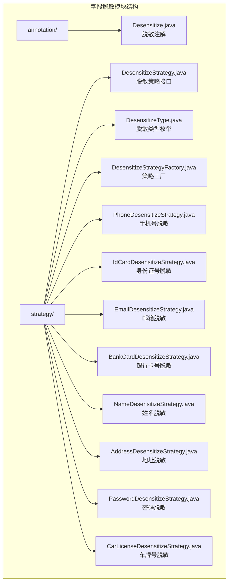
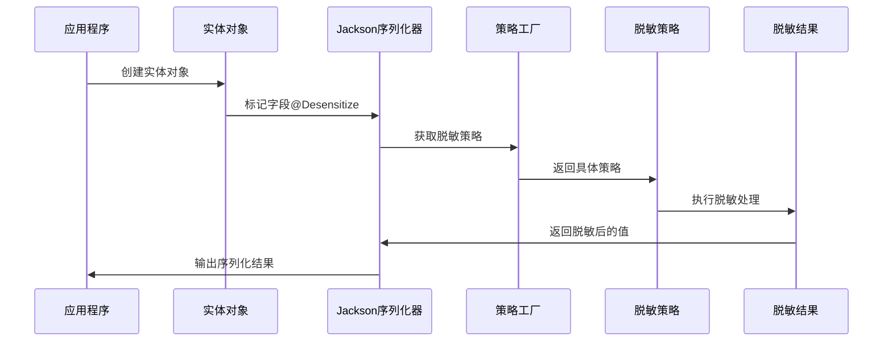
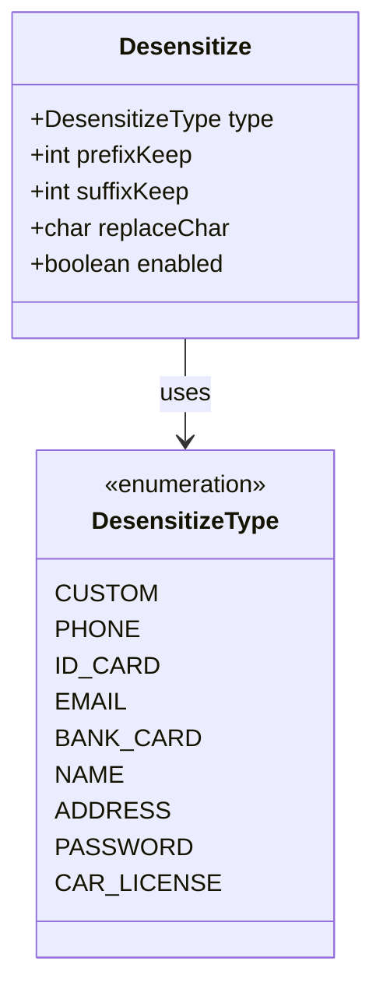
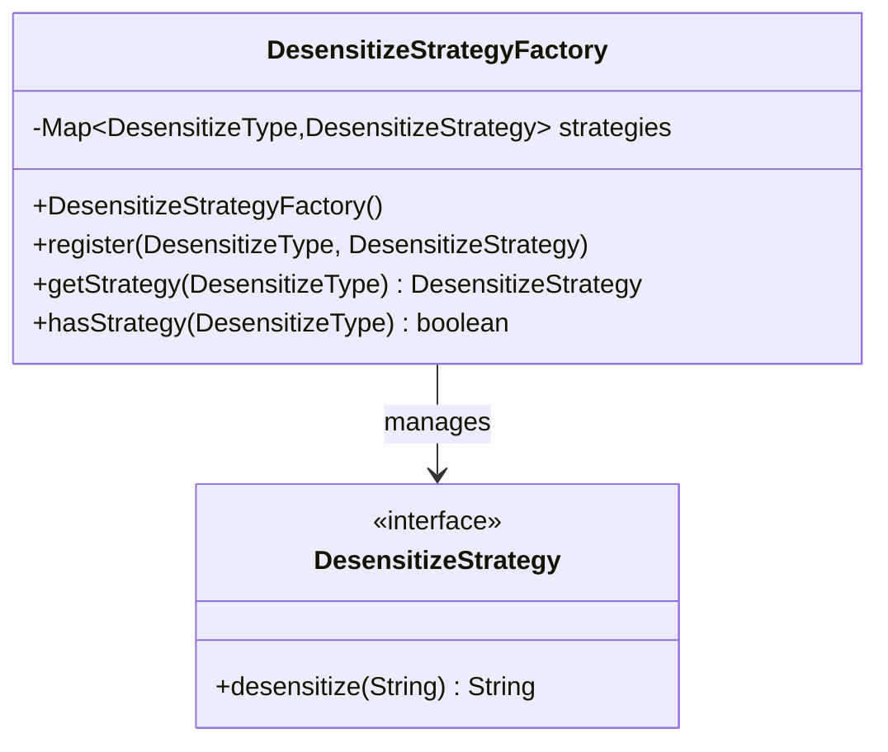
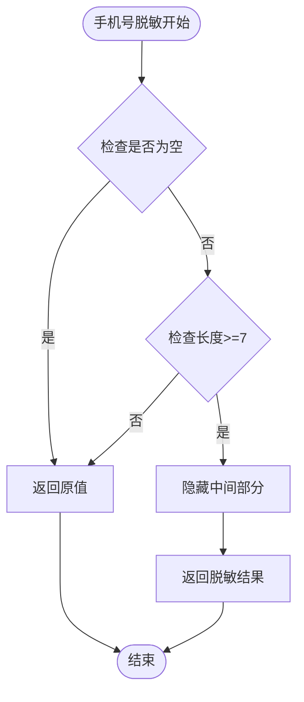
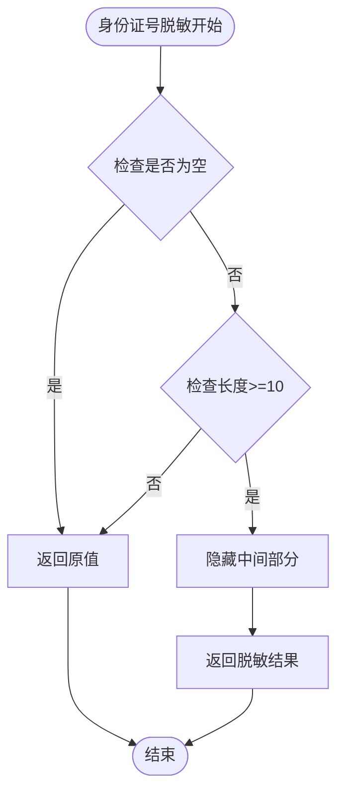
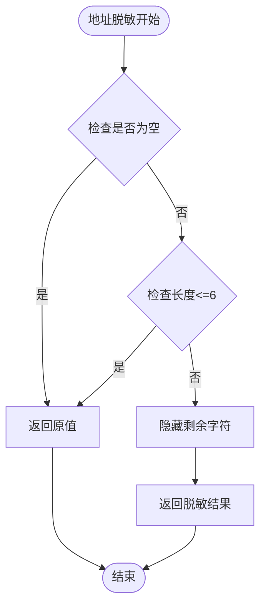
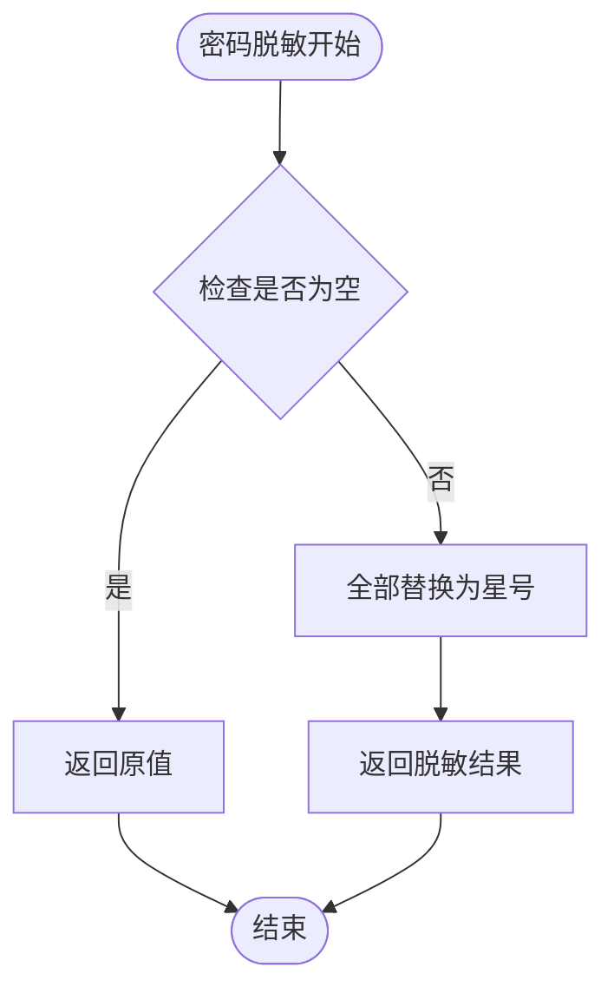
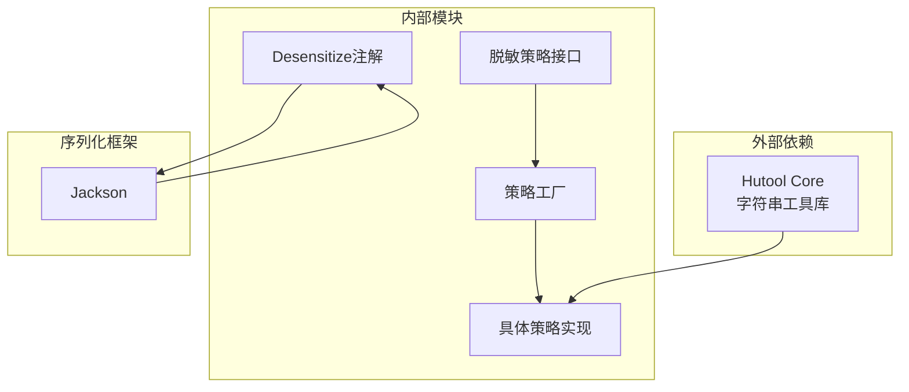

# 字段脱敏模块

<cite>
**本文档引用的文件**
- [Desensitize.java](file://forge/forge-framework/forge-starter-parent/forge-starter-crypto/src/main/java/com/mdframe/forge/starter/crypto/desensitize/annotation/Desensitize.java)
- [DesensitizeStrategy.java](file://forge/forge-framework/forge-starter-parent/forge-starter-crypto/src/main/java/com/mdframe/forge/starter/crypto/desensitize/strategy/DesensitizeStrategy.java)
- [DesensitizeType.java](file://forge/forge-framework/forge-starter-parent/forge-starter-crypto/src/main/java/com/mdframe/forge/starter/crypto/desensitize/strategy/DesensitizeType.java)
- [DesensitizeStrategyFactory.java](file://forge/forge-framework/forge-starter-parent/forge-starter-crypto/src/main/java/com/mdframe/forge/starter/crypto/desensitize/strategy/DesensitizeStrategyFactory.java)
- [PhoneDesensitizeStrategy.java](file://forge/forge-framework/forge-starter-parent/forge-starter-crypto/src/main/java/com/mdframe/forge/starter/crypto/desensitize/strategy/PhoneDesensitizeStrategy.java)
- [IdCardDesensitizeStrategy.java](file://forge/forge-framework/forge-starter-parent/forge-starter-crypto/src/main/java/com/mdframe/forge/starter/crypto/desensitize/strategy/IdCardDesensitizeStrategy.java)
- [EmailDesensitizeStrategy.java](file://forge/forge-framework/forge-starter-parent/forge-starter-crypto/src/main/java/com/mdframe/forge/starter/crypto/desensitize/strategy/EmailDesensitizeStrategy.java)
- [BankCardDesensitizeStrategy.java](file://forge/forge-framework/forge-starter-parent/forge-starter-crypto/src/main/java/com/mdframe/forge/starter/crypto/desensitize/strategy/BankCardDesensitizeStrategy.java)
- [NameDesensitizeStrategy.java](file://forge/forge-framework/forge-starter-parent/forge-starter-crypto/src/main/java/com/mdframe/forge/starter/crypto/desensitize/strategy/NameDesensitizeStrategy.java)
- [AddressDesensitizeStrategy.java](file://forge/forge-framework/forge-starter-parent/forge-starter-crypto/src/main/java/com/mdframe/forge/starter/crypto/desensitize/strategy/AddressDesensitizeStrategy.java)
- [PasswordDesensitizeStrategy.java](file://forge/forge-framework/forge-starter-parent/forge-starter-crypto/src/main/java/com/mdframe/forge/starter/crypto/desensitize/strategy/PasswordDesensitizeStrategy.java)
- [CarLicenseDesensitizeStrategy.java](file://forge/forge-framework/forge-starter-parent/forge-starter-crypto/src/main/java/com/mdframe/forge/starter/crypto/desensitize/strategy/CarLicenseDesensitizeStrategy.java)
- [ConfigController.java](file://forge/forge-admin/src/main/java/com/mdframe/forge/admin/ConfigController.java)
</cite>

## 目录
1. [项目概述](#项目概述)
2. [项目结构](#项目结构)
3. [核心组件](#核心组件)
4. [架构概览](#架构概览)
5. [详细组件分析](#详细组件分析)
6. [依赖关系分析](#依赖关系分析)
7. [性能考虑](#性能考虑)
8. [故障排除指南](#故障排除指南)
9. [结论](#结论)

## 项目概述

字段脱敏模块是Forge框架中的一个核心安全组件，专门用于对敏感数据进行脱敏处理。该模块提供了灵活的脱敏策略机制，支持多种常见的敏感数据类型，包括手机号、身份证号、邮箱、银行卡号、姓名、地址、密码和车牌号等。

该模块采用注解驱动的方式，在对象序列化过程中自动应用相应的脱敏策略，确保敏感信息在传输和展示过程中的安全性。

## 项目结构

字段脱敏模块位于Forge框架的加密启动器模块中，主要包含以下结构：



**图表来源**
- [Desensitize.java:1-48](file://forge/forge-framework/forge-starter-parent/forge-starter-crypto/src/main/java/com/mdframe/forge/starter/crypto/desensitize/annotation/Desensitize.java#L1-L48)
- [DesensitizeStrategy.java:1-17](file://forge/forge-framework/forge-starter-parent/forge-starter-crypto/src/main/java/com/mdframe/forge/starter/crypto/desensitize/strategy/DesensitizeStrategy.java#L1-L17)

**章节来源**
- [Desensitize.java:1-48](file://forge/forge-framework/forge-starter-parent/forge-starter-crypto/src/main/java/com/mdframe/forge/starter/crypto/desensitize/annotation/Desensitize.java#L1-L48)
- [DesensitizeStrategy.java:1-17](file://forge/forge-framework/forge-starter-parent/forge-starter-crypto/src/main/java/com/mdframe/forge/starter/crypto/desensitize/strategy/DesensitizeStrategy.java#L1-L17)

## 核心组件

### 脱敏注解系统

脱敏注解是整个模块的核心入口，通过`@Desensitize`注解标记需要脱敏的字段。

**关键特性：**
- 支持多种脱敏类型
- 自定义保留长度
- 可配置替换字符
- 启用/禁用控制

### 脱敏策略接口

所有脱敏策略都实现统一的`DesensitizeStrategy`接口，确保策略的一致性和可扩展性。

**接口方法：**
- `desensitize(String value)` - 执行脱敏处理

### 脱敏类型枚举

定义了标准的脱敏类型，包括：
- CUSTOM（自定义）
- PHONE（手机号）
- ID_CARD（身份证号）
- EMAIL（邮箱）
- BANK_CARD（银行卡号）
- NAME（姓名）
- ADDRESS（地址）
- PASSWORD（密码）
- CAR_LICENSE（车牌号）

### 策略工厂

`DesensitizeStrategyFactory`负责管理各种脱敏策略的注册和获取，提供线程安全的策略管理机制。

**工厂特性：**
- 策略注册管理
- 策略获取缓存
- 线程安全保证

**章节来源**
- [Desensitize.java:1-48](file://forge/forge-framework/forge-starter-parent/forge-starter-crypto/src/main/java/com/mdframe/forge/starter/crypto/desensitize/annotation/Desensitize.java#L1-L48)
- [DesensitizeStrategy.java:1-17](file://forge/forge-framework/forge-starter-parent/forge-starter-crypto/src/main/java/com/mdframe/forge/starter/crypto/desensitize/strategy/DesensitizeStrategy.java#L1-L17)
- [DesensitizeType.java:1-54](file://forge/forge-framework/forge-starter-parent/forge-starter-crypto/src/main/java/com/mdframe/forge/starter/crypto/desensitize/strategy/DesensitizeType.java#L1-L54)
- [DesensitizeStrategyFactory.java:1-47](file://forge/forge-framework/forge-starter-parent/forge-starter-crypto/src/main/java/com/mdframe/forge/starter/crypto/desensitize/strategy/DesensitizeStrategyFactory.java#L1-L47)

## 架构概览

字段脱敏模块采用分层架构设计，实现了清晰的关注点分离：

```mermaid
graph TB
subgraph "脱敏架构层次"
A[应用层<br/>业务实体] --> B[注解层<br/>@Desensitize]
B --> C[序列化层<br/>Jackson序列化]
C --> D[策略工厂<br/>DesensitizeStrategyFactory]
D --> E[策略实现<br/>具体脱敏算法]
subgraph "策略实现层"
F[PhoneDesensitizeStrategy<br/>手机号脱敏]
G[IdCardDesensitizeStrategy<br/>身份证号脱敏]
H[EmailDesensitizeStrategy<br/>邮箱脱敏]
I[BankCardDesensitizeStrategy<br/>银行卡号脱敏]
J[NameDesensitizeStrategy<br/>姓名脱敏]
K[AddressDesensitizeStrategy<br/>地址脱敏]
L[PasswordDesensitizeStrategy<br/>密码脱敏]
M[CarLicenseDesensitizeStrategy<br/>车牌号脱敏]
end
E --> F
E --> G
E --> H
E --> I
E --> J
E --> K
E --> L
E --> M
end
```

**图表来源**
- [DesensitizeStrategyFactory.java:1-47](file://forge/forge-framework/forge-starter-parent/forge-starter-crypto/src/main/java/com/mdframe/forge/starter/crypto/desensitize/strategy/DesensitizeStrategyFactory.java#L1-L47)
- [PhoneDesensitizeStrategy.java:1-24](file://forge/forge-framework/forge-starter-parent/forge-starter-crypto/src/main/java/com/mdframe/forge/starter/crypto/desensitize/strategy/PhoneDesensitizeStrategy.java#L1-L24)

### 数据流处理

脱敏处理遵循以下数据流：



**图表来源**
- [Desensitize.java:1-48](file://forge/forge-framework/forge-starter-parent/forge-starter-crypto/src/main/java/com/mdframe/forge/starter/crypto/desensitize/annotation/Desensitize.java#L1-L48)
- [DesensitizeStrategyFactory.java:1-47](file://forge/forge-framework/forge-starter-parent/forge-starter-crypto/src/main/java/com/mdframe/forge/starter/crypto/desensitize/strategy/DesensitizeStrategyFactory.java#L1-L47)

## 详细组件分析

### 注解处理器

`@Desensitize`注解提供了灵活的脱敏配置选项：



**图表来源**
- [Desensitize.java:1-48](file://forge/forge-framework/forge-starter-parent/forge-starter-crypto/src/main/java/com/mdframe/forge/starter/crypto/desensitize/annotation/Desensitize.java#L1-L48)
- [DesensitizeType.java:1-54](file://forge/forge-framework/forge-starter-parent/forge-starter-crypto/src/main/java/com/mdframe/forge/starter/crypto/desensitize/strategy/DesensitizeType.java#L1-L54)

### 策略工厂管理

策略工厂采用单例模式，确保全局唯一性和线程安全：



**图表来源**
- [DesensitizeStrategyFactory.java:1-47](file://forge/forge-framework/forge-starter-parent/forge-starter-crypto/src/main/java/com/mdframe/forge/starter/crypto/desensitize/strategy/DesensitizeStrategyFactory.java#L1-L47)

### 具体脱敏策略实现

#### 手机号脱敏策略

手机号脱敏保留前3位和后4位，中间部分用星号替换：



**图表来源**
- [PhoneDesensitizeStrategy.java:1-24](file://forge/forge-framework/forge-starter-parent/forge-starter-crypto/src/main/java/com/mdframe/forge/starter/crypto/desensitize/strategy/PhoneDesensitizeStrategy.java#L1-L24)

#### 身份证号脱敏策略

身份证号脱敏保留前6位和后4位：



**图表来源**
- [IdCardDesensitizeStrategy.java:1-24](file://forge/forge-framework/forge-starter-parent/forge-starter-crypto/src/main/java/com/mdframe/forge/starter/crypto/desensitize/strategy/IdCardDesensitizeStrategy.java#L1-L24)

#### 邮箱脱敏策略

邮箱脱敏只保留@符号前的第一个字符：

```mermaid
flowchart TD
Start([邮箱脱敏开始]) --> CheckBlank{检查是否为空}
CheckBlank --> |是| ReturnOriginal[返回原值]
CheckBlank --> |否| FindAt{查找@符号位置}
FindAt --> CheckAt{位置<=1}
CheckAt --> |是| ReturnOriginal
CheckAt --> |否| HideBeforeAt[隐藏@之前的字符]
HideBeforeAt --> KeepDomain[保留@及之后部分]
KeepDomain --> ReturnResult[返回脱敏结果]
ReturnOriginal --> End([结束])
ReturnResult --> End
```

**图表来源**
- [EmailDesensitizeStrategy.java:1-25](file://forge/forge-framework/forge-starter-parent/forge-starter-crypto/src/main/java/com/mdframe/forge/starter/crypto/desensitize/strategy/EmailDesensitizeStrategy.java#L1-L25)

#### 银行卡号脱敏策略

银行卡号脱敏保留前6位和后4位：


**图表来源**
- [BankCardDesensitizeStrategy.java:1-24](file://forge/forge-framework/forge-starter-parent/forge-starter-crypto/src/main/java/com/mdframe/forge/starter/crypto/desensitize/strategy/BankCardDesensitizeStrategy.java#L1-L24)

#### 姓名脱敏策略

姓名脱敏只保留第一个字符：


**图表来源**
- [NameDesensitizeStrategy.java:1-24](file://forge/forge-framework/forge-starter-parent/forge-starter-crypto/src/main/java/com/mdframe/forge/starter/crypto/desensitize/strategy/NameDesensitizeStrategy.java#L1-L24)

#### 地址脱敏策略

地址脱敏保留前6个字符：



**图表来源**
- [AddressDesensitizeStrategy.java:1-24](file://forge/forge-framework/forge-starter-parent/forge-starter-crypto/src/main/java/com/mdframe/forge/starter/crypto/desensitize/strategy/AddressDesensitizeStrategy.java#L1-L24)

#### 密码脱敏策略

密码脱敏将所有字符替换为星号：



**图表来源**
- [PasswordDesensitizeStrategy.java:1-21](file://forge/forge-framework/forge-starter-parent/forge-starter-crypto/src/main/java/com/mdframe/forge/starter/crypto/desensitize/strategy/PasswordDesensitizeStrategy.java#L1-L21)

#### 车牌号脱敏策略

车牌号脱敏保留前2位和后2位：


**图表来源**
- [CarLicenseDesensitizeStrategy.java:1-24](file://forge/forge-framework/forge-starter-parent/forge-starter-crypto/src/main/java/com/mdframe/forge/starter/crypto/desensitize/strategy/CarLicenseDesensitizeStrategy.java#L1-L24)

**章节来源**
- [PhoneDesensitizeStrategy.java:1-24](file://forge/forge-framework/forge-starter-parent/forge-starter-crypto/src/main/java/com/mdframe/forge/starter/crypto/desensitize/strategy/PhoneDesensitizeStrategy.java#L1-L24)
- [IdCardDesensitizeStrategy.java:1-24](file://forge/forge-framework/forge-starter-parent/forge-starter-crypto/src/main/java/com/mdframe/forge/starter/crypto/desensitize/strategy/IdCardDesensitizeStrategy.java#L1-L24)
- [EmailDesensitizeStrategy.java:1-25](file://forge/forge-framework/forge-starter-parent/forge-starter-crypto/src/main/java/com/mdframe/forge/starter/crypto/desensitize/strategy/EmailDesensitizeStrategy.java#L1-L25)
- [BankCardDesensitizeStrategy.java:1-24](file://forge/forge-framework/forge-starter-parent/forge-starter-crypto/src/main/java/com/mdframe/forge/starter/crypto/desensitize/strategy/BankCardDesensitizeStrategy.java#L1-L24)
- [NameDesensitizeStrategy.java:1-24](file://forge/forge-framework/forge-starter-parent/forge-starter-crypto/src/main/java/com/mdframe/forge/starter/crypto/desensitize/strategy/NameDesensitizeStrategy.java#L1-L24)
- [AddressDesensitizeStrategy.java:1-24](file://forge/forge-framework/forge-starter-parent/forge-starter-crypto/src/main/java/com/mdframe/forge/starter/crypto/desensitize/strategy/AddressDesensitizeStrategy.java#L1-L24)
- [PasswordDesensitizeStrategy.java:1-21](file://forge/forge-framework/forge-starter-parent/forge-starter-crypto/src/main/java/com/mdframe/forge/starter/crypto/desensitize/strategy/PasswordDesensitizeStrategy.java#L1-L21)
- [CarLicenseDesensitizeStrategy.java:1-24](file://forge/forge-framework/forge-starter-parent/forge-starter-crypto/src/main/java/com/mdframe/forge/starter/crypto/desensitize/strategy/CarLicenseDesensitizeStrategy.java#L1-L24)

## 依赖关系分析

字段脱敏模块的依赖关系相对简单，主要依赖于Hutool工具库的字符串处理功能：



**图表来源**
- [PhoneDesensitizeStrategy.java:1-24](file://forge/forge-framework/forge-starter-parent/forge-starter-crypto/src/main/java/com/mdframe/forge/starter/crypto/desensitize/strategy/PhoneDesensitizeStrategy.java#L1-L24)
- [Desensitize.java:1-48](file://forge/forge-framework/forge-starter-parent/forge-starter-crypto/src/main/java/com/mdframe/forge/starter/crypto/desensitize/annotation/Desensitize.java#L1-L48)

### 关键依赖特性

1. **Hutool集成**：所有策略都使用Hutool的`StrUtil.hide()`方法进行字符串脱敏处理
2. **Jackson集成**：通过`@JsonSerialize`注解与Jackson序列化框架无缝集成
3. **线程安全**：策略工厂使用`ConcurrentHashMap`确保并发安全
4. **可扩展性**：通过策略接口和工厂模式支持自定义脱敏策略

**章节来源**
- [DesensitizeStrategyFactory.java:1-47](file://forge/forge-framework/forge-starter-parent/forge-starter-crypto/src/main/java/com/mdframe/forge/starter/crypto/desensitize/strategy/DesensitizeStrategyFactory.java#L1-L47)

## 性能考虑

### 策略缓存机制

策略工厂使用`ConcurrentHashMap`存储已注册的策略，避免重复创建和查找开销：

- **内存效率**：策略实例按需创建，避免不必要的内存占用
- **并发性能**：使用线程安全的Map，支持高并发场景
- **初始化优化**：构造函数中一次性注册所有内置策略

### 字符串处理优化

所有脱敏策略都基于Hutool的高效字符串处理方法：

- **字符隐藏算法**：使用底层C实现的字符串截取和拼接
- **内存分配优化**：避免不必要的字符串对象创建
- **边界检查**：在脱敏前进行长度和空值检查，减少无效计算

### 序列化性能

脱敏处理发生在序列化阶段，具有以下性能特点：

- **按需执行**：只有被注解标记的字段才会执行脱敏
- **延迟计算**：脱敏逻辑在序列化时才触发
- **最小化开销**：脱敏算法复杂度为O(n)，其中n为字符串长度

## 故障排除指南

### 常见问题及解决方案

#### 脱敏结果不符合预期

**问题症状**：脱敏后的数据格式不正确或脱敏比例不对

**可能原因**：
1. 字段长度不足导致无法应用相应脱敏策略
2. 自定义保留长度配置不当
3. 输入数据格式不符合预期

**解决方法**：
```java
// 检查字段长度
if (value.length() < minLength) {
    return originalValue; // 返回原始值
}

// 调整保留长度配置
@Desensitize(
    type = DesensitizeType.CUSTOM,
    prefixKeep = 2,
    suffixKeep = 2
)
private String sensitiveField;
```

#### 脱敏策略未生效

**问题症状**：添加了`@Desensitize`注解但数据未被脱敏

**可能原因**：
1. 对象未通过Jackson序列化
2. 注解未正确配置
3. 字段类型不支持

**解决方法**：
```java
// 确保实体类正确配置
@JsonSerialize(using = DesensitizeSerializer.class)
public class User {
    @Desensitize(type = DesensitizeType.PHONE)
    private String phone;
}
```

#### 性能问题

**问题症状**：大量数据脱敏时出现性能瓶颈

**优化建议**：
1. 使用合适的脱敏策略类型
2. 避免对超长字符串进行复杂脱敏
3. 考虑批量处理优化

**章节来源**
- [DesensitizeStrategyFactory.java:1-47](file://forge/forge-framework/forge-starter-parent/forge-starter-crypto/src/main/java/com/mdframe/forge/starter/crypto/desensitize/strategy/DesensitizeStrategyFactory.java#L1-L47)

## 结论

字段脱敏模块为Forge框架提供了完整、灵活且高性能的敏感数据保护解决方案。通过注解驱动的设计和策略工厂模式，该模块实现了以下优势：

### 主要优势

1. **易用性**：通过简单的注解即可实现字段脱敏
2. **灵活性**：支持多种脱敏策略和自定义配置
3. **性能**：高效的字符串处理和策略缓存机制
4. **可扩展性**：清晰的接口设计支持自定义脱敏策略
5. **安全性**：内置多种常见敏感数据类型的脱敏算法

### 应用场景

- 用户隐私数据保护
- 敏感业务信息脱敏
- 数据导出和展示安全
- API响应数据安全

### 未来发展

随着业务需求的增长，该模块可以进一步扩展：
- 支持更多脱敏策略类型
- 提供更精细的脱敏配置选项
- 增强性能监控和优化
- 扩展到更多数据序列化框架

该模块为Forge框架的安全性奠定了坚实的基础，是构建企业级应用不可或缺的重要组件。