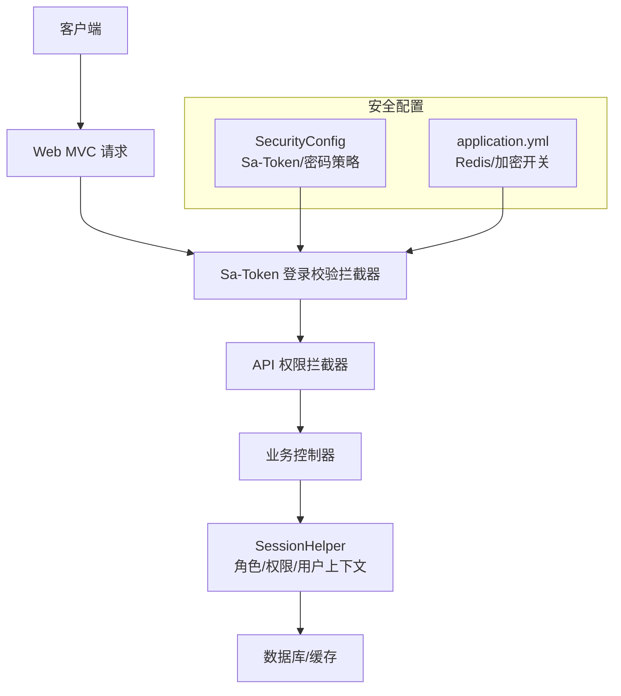
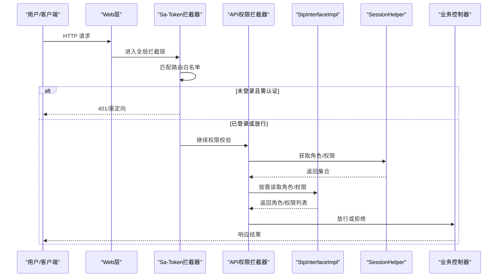
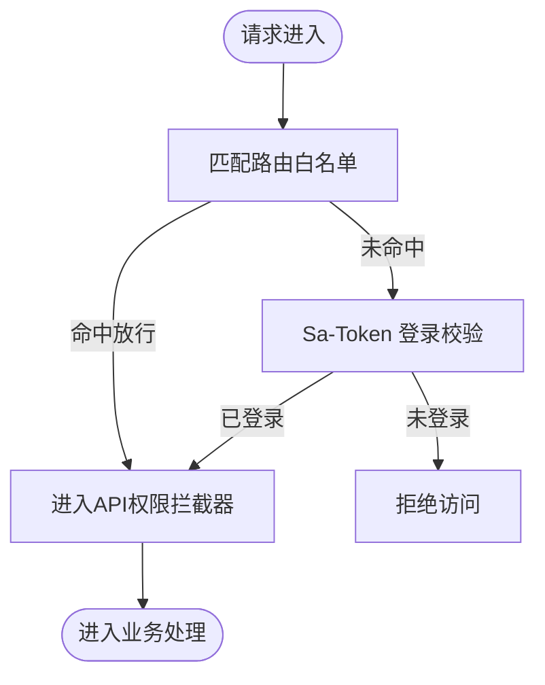
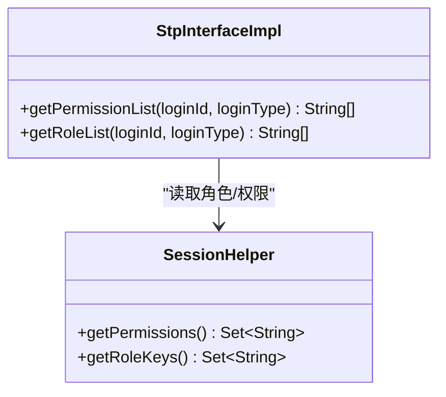
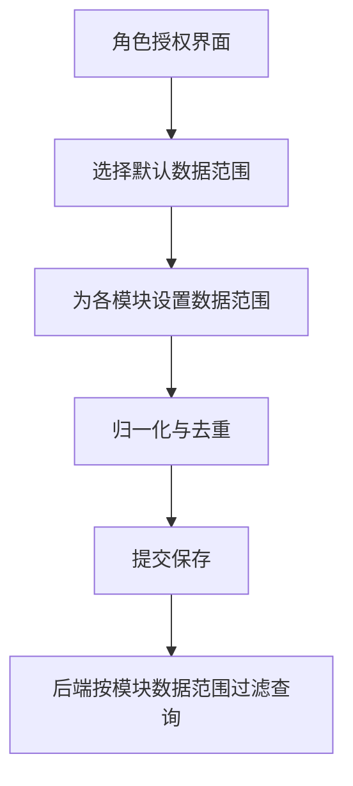
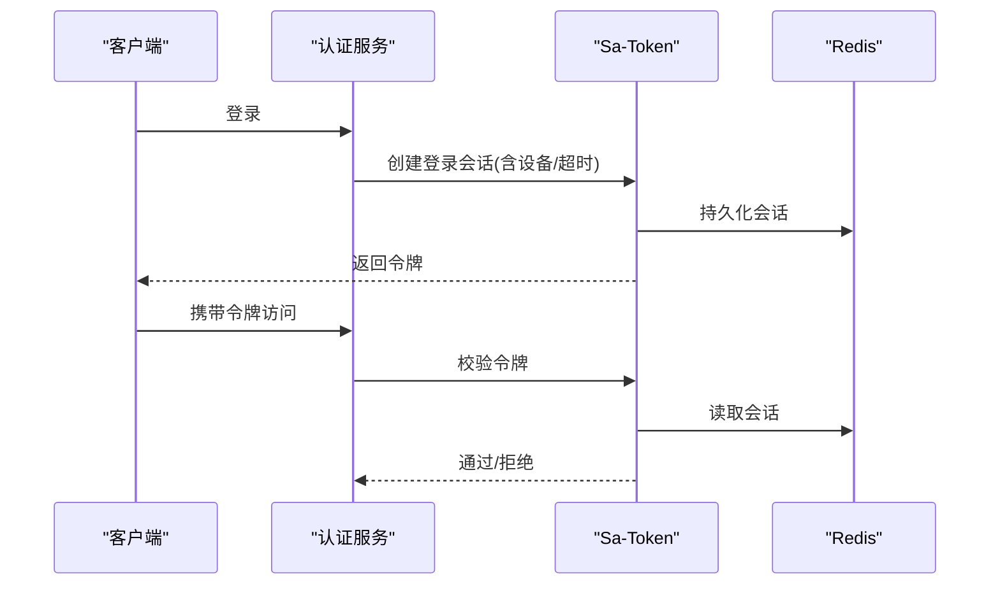
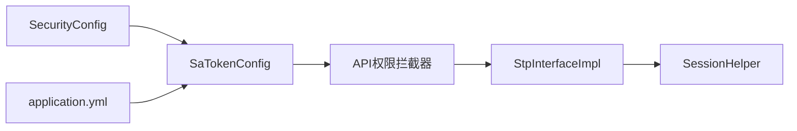

# 安全与认证

<cite>
**本文引用的文件**
- [SaTokenConfig.java](file://forge-server/forge-framework/forge-starter-parent/forge-starter-auth/src/main/java/com/mdframe/forge/starter/auth/config/SaTokenConfig.java)
- [StpInterfaceImpl.java](file://forge-server/forge-framework/forge-starter-parent/forge-starter-auth/src/main/java/com/mdframe/forge/starter/auth/config/StpInterfaceImpl.java)
- [SecurityConfig.java](file://forge-server/forge-framework/forge-starter-parent/forge-starter-config/src/main/java/com/mdframe/forge/starter/config/config/SecurityConfig.java)
- [application.yml](file://forge-server/forge-report-server/src/main/resources/application.yml)
- [KeyExchangeService.java](file://forge-server/forge-framework/forge-starter-parent/forge-starter-crypto/src/main/java/com/mdframe/forge/starter/crypto/keyexchange/KeyExchangeService.java)
- [RolePermissionModal.vue](file://forge-admin-ui/src/views/system/components/RolePermissionModal.vue)
- [application-permission-utils.js](file://forge-admin-ui/src/views/app-center/application-permission-utils.js)
- [access-control.js](file://forge-h5-ui/src/utils/access-control.js)
</cite>

## 目录
1. [简介](#简介)
2. [项目结构](#项目结构)
3. [核心组件](#核心组件)
4. [架构总览](#架构总览)
5. [详细组件分析](#详细组件分析)
6. [依赖关系分析](#依赖关系分析)
7. [性能与安全考量](#性能与安全考量)
8. [故障排查指南](#故障排查指南)
9. [结论](#结论)
10. [附录：配置清单与最佳实践](#附录：配置清单与最佳实践)

## 简介
本章节面向 Forge Admin 的安全与认证体系，围绕 Sa-Token 集成、RBAC 权限模型、数据权限控制、接口安全防护、JWT/会话管理、角色资源绑定、菜单权限控制、敏感数据加密、传输与存储安全以及审计日志等主题进行系统化说明。文档以代码级事实为依据，提供架构图、流程图与排错指引，帮助读者快速理解并落地安全策略。

## 项目结构
安全能力主要分布在以下模块：
- 认证与拦截：基于 Sa-Token 的登录校验与 API 权限拦截器注册
- 权限扩展：自定义 StpInterface 将 Session 中的角色与权限注入 Sa-Token
- 安全配置：集中化的安全配置（Sa-Token 参数、密码策略）
- 运行时配置：通过 application.yml 配置 Redis 会话存储与加密相关开关
- 前端权限：角色授权界面、数据范围设置、H5 访问控制工具

图表来源
- [SaTokenConfig.java:29-100](file://forge-server/forge-framework/forge-starter-parent/forge-starter-auth/src/main/java/com/mdframe/forge/starter/auth/config/SaTokenConfig.java#L29-L100)
- [SecurityConfig.java:24-70](file://forge-server/forge-framework/forge-starter-parent/forge-starter-config/src/main/java/com/mdframe/forge/starter/config/config/SecurityConfig.java#L24-L70)
- [application.yml:62-95](file://forge-server/forge-report-server/src/main/resources/application.yml#L62-L95)

章节来源
- [SaTokenConfig.java:29-100](file://forge-server/forge-framework/forge-starter-parent/forge-starter-auth/src/main/java/com/mdframe/forge/starter/auth/config/SaTokenConfig.java#L29-L100)
- [SecurityConfig.java:24-70](file://forge-server/forge-framework/forge-starter-parent/forge-starter-config/src/main/java/com/mdframe/forge/starter/config/config/SecurityConfig.java#L24-L70)
- [application.yml:62-95](file://forge-server/forge-report-server/src/main/resources/application.yml#L62-L95)

## 核心组件
- Sa-Token 登录校验与路由白名单：统一在拦截器中完成登录态检查，并对登录、注册、重置密码、SSO、密钥交换、OAuth、MCP、开放 API、静态资源与健康检查等路径放行。
- API 权限拦截器：在登录校验之后执行，按数据库资源表配置进行细粒度鉴权，支持可配置的排除路径集合。
- 权限扩展点：通过实现 StpInterface，从 Session 中读取当前用户的角色键与权限码集合，供 Sa-Token 注解或表达式使用。
- 安全配置中心：集中定义 Sa-Token 行为（超时、活动超时、并发登录、共享 token、读取位置、前缀与名称）与密码策略（复杂度、过期、历史）。
- 会话与加密：通过 application.yml 启用 Redis 作为 Sa-Token 会话存储；提供密钥交换服务用于会话级临时密钥管理。

章节来源
- [SaTokenConfig.java:29-100](file://forge-server/forge-framework/forge-starter-parent/forge-starter-auth/src/main/java/com/mdframe/forge/starter/auth/config/SaTokenConfig.java#L29-L100)
- [StpInterfaceImpl.java:17-33](file://forge-server/forge-framework/forge-starter-parent/forge-starter-auth/src/main/java/com/mdframe/forge/starter/auth/config/StpInterfaceImpl.java#L17-L33)
- [SecurityConfig.java:24-111](file://forge-server/forge-framework/forge-starter-parent/forge-starter-config/src/main/java/com/mdframe/forge/starter/config/config/SecurityConfig.java#L24-L111)
- [application.yml:62-95](file://forge-server/forge-report-server/src/main/resources/application.yml#L62-L95)
- [KeyExchangeService.java:47-63](file://forge-server/forge-framework/forge-starter-parent/forge-starter-crypto/src/main/java/com/mdframe/forge/starter/crypto/keyexchange/KeyExchangeService.java#L47-L63)

## 架构总览
下图展示了从请求进入、登录校验、权限判定到业务处理的完整链路，以及前后端在权限与数据范围上的协作。

图表来源
- [SaTokenConfig.java:29-100](file://forge-server/forge-framework/forge-starter-parent/forge-starter-auth/src/main/java/com/mdframe/forge/starter/auth/config/SaTokenConfig.java#L29-L100)
- [StpInterfaceImpl.java:17-33](file://forge-server/forge-framework/forge-starter-parent/forge-starter-auth/src/main/java/com/mdframe/forge/starter/auth/config/StpInterfaceImpl.java#L17-L33)

## 详细组件分析

### Sa-Token 集成与拦截器
- 登录校验拦截器：对所有路径执行 Sa-Token 登录检查，并通过路由白名单排除无需认证的接口（登录、注册、重置密码、SSO、密钥交换、OAuth、MCP、开放 API、静态资源、健康检查、WebSocket）。
- API 权限拦截器：在登录校验后执行，依据数据库资源表配置进行接口级权限判定，支持通过配置项动态排除路径。
- 优先级：登录校验优先于 API 权限校验，确保先验身份再判权限。

图表来源
- [SaTokenConfig.java:29-100](file://forge-server/forge-framework/forge-starter-parent/forge-starter-auth/src/main/java/com/mdframe/forge/starter/auth/config/SaTokenConfig.java#L29-L100)

章节来源
- [SaTokenConfig.java:29-100](file://forge-server/forge-framework/forge-starter-parent/forge-starter-auth/src/main/java/com/mdframe/forge/starter/auth/config/SaTokenConfig.java#L29-L100)

### RBAC 权限模型与扩展
- 角色与权限来源：通过实现 StpInterface，从 Session 中读取当前用户的角色键集合与权限码集合，暴露给 Sa-Token 框架进行注解或表达式校验。
- 设计要点：
  - 角色键（roleKey）与权限码（permission）由后端在登录后写入 Session，并在每次请求时刷新。
  - 前端根据角色/权限渲染菜单与按钮，形成“可见即可用”的一致性体验。

图表来源
- [StpInterfaceImpl.java:17-33](file://forge-server/forge-framework/forge-starter-parent/forge-starter-auth/src/main/java/com/mdframe/forge/starter/auth/config/StpInterfaceImpl.java#L17-L33)

章节来源
- [StpInterfaceImpl.java:17-33](file://forge-server/forge-framework/forge-starter-parent/forge-starter-auth/src/main/java/com/mdframe/forge/starter/auth/config/StpInterfaceImpl.java#L17-L33)

### 数据权限控制机制
- 默认数据范围与模块级覆盖：前端提供“角色综合授权”界面，支持为每个模块设置数据范围（如全部、本部门、本人等），并可继承默认范围。
- 数据结构归一化：对资源 ID、模块数据范围进行标准化与去重，便于前后端一致比较与提交。
- 模式匹配：H5 侧提供权限模式匹配工具，支持通配符匹配，用于前端按钮/页面级可见性控制。

图表来源
- [RolePermissionModal.vue:1-39](file://forge-admin-ui/src/views/system/components/RolePermissionModal.vue#L1-L39)
- [application-permission-utils.js:16-44](file://forge-admin-ui/src/views/app-center/application-permission-utils.js#L16-L44)
- [application-permission-utils.js:142-166](file://forge-admin-ui/src/views/app-center/application-permission-utils.js#L142-L166)
- [access-control.js:51-64](file://forge-h5-ui/src/utils/access-control.js#L51-L64)

章节来源
- [RolePermissionModal.vue:1-39](file://forge-admin-ui/src/views/system/components/RolePermissionModal.vue#L1-L39)
- [application-permission-utils.js:16-44](file://forge-admin-ui/src/views/app-center/application-permission-utils.js#L16-L44)
- [application-permission-utils.js:142-166](file://forge-admin-ui/src/views/app-center/application-permission-utils.js#L142-L166)
- [access-control.js:51-64](file://forge-h5-ui/src/utils/access-control.js#L51-L64)

### 接口安全防护策略
- 白名单机制：登录、注册、重置密码、SSO、密钥交换、OAuth、MCP、开放 API、静态资源、健康检查等路径明确放行。
- 分层校验：先登录校验，再 API 权限校验，避免未认证请求进入权限判断阶段。
- 可配置排除：通过配置项集中管理 API 权限校验的排除路径，便于不同环境差异化配置。

章节来源
- [SaTokenConfig.java:29-100](file://forge-server/forge-framework/forge-starter-parent/forge-starter-auth/src/main/java/com/mdframe/forge/starter/auth/config/SaTokenConfig.java#L29-L100)

### JWT 令牌管理与会话控制
- 令牌来源与存储：Sa-Token 负责令牌生命周期管理，结合 Redis 持久化会话，支持多端设备标识与并发登录策略。
- 会话读取位置：支持从请求体、Header、Cookie 读取令牌，可通过配置灵活调整。
- 会话清理：登出时清除会话密钥，防止会话劫持。

图表来源
- [application.yml:62-77](file://forge-server/forge-report-server/src/main/resources/application.yml#L62-L77)
- [SecurityConfig.java:24-70](file://forge-server/forge-framework/forge-starter-parent/forge-starter-config/src/main/java/com/mdframe/forge/starter/config/config/SecurityConfig.java#L24-L70)
- [KeyExchangeService.java:47-63](file://forge-server/forge-framework/forge-starter-parent/forge-starter-crypto/src/main/java/com/mdframe/forge/starter/crypto/keyexchange/KeyExchangeService.java#L47-L63)

章节来源
- [application.yml:62-77](file://forge-server/forge-report-server/src/main/resources/application.yml#L62-L77)
- [SecurityConfig.java:24-70](file://forge-server/forge-framework/forge-starter-parent/forge-starter-config/src/main/java/com/mdframe/forge/starter/config/config/SecurityConfig.java#L24-L70)
- [KeyExchangeService.java:47-63](file://forge-server/forge-framework/forge-starter-parent/forge-starter-crypto/src/main/java/com/mdframe/forge/starter/crypto/keyexchange/KeyExchangeService.java#L47-L63)

### 角色资源绑定与菜单权限控制
- 角色资源绑定：通过“角色综合授权”界面为角色分配资源 ID 集合，并设置模块级数据范围。
- 菜单权限控制：前端根据角色/权限渲染菜单与操作按钮，结合通配符匹配实现灵活的可见性控制。

章节来源
- [RolePermissionModal.vue:1-39](file://forge-admin-ui/src/views/system/components/RolePermissionModal.vue#L1-L39)
- [application-permission-utils.js:16-44](file://forge-admin-ui/src/views/app-center/application-permission-utils.js#L16-L44)
- [access-control.js:51-64](file://forge-h5-ui/src/utils/access-control.js#L51-L64)

### 敏感数据加密、传输安全与存储安全
- 传输安全：支持密钥交换流程，未登录时也可完成协商，保障后续通信安全。
- 存储安全：通过 application.yml 控制加密功能的启用、版本化写入、兼容旧密钥读取与活跃密钥切换。
- 会话密钥管理：提供会话级密钥的获取与清理能力，降低泄露风险。

章节来源
- [application.yml:84-95](file://forge-server/forge-report-server/src/main/resources/application.yml#L84-L95)
- [KeyExchangeService.java:47-63](file://forge-server/forge-framework/forge-starter-parent/forge-starter-crypto/src/main/java/com/mdframe/forge/starter/crypto/keyexchange/KeyExchangeService.java#L47-L63)

### 审计日志实现
- 说明：当前仓库未发现统一的审计日志实现代码片段。建议结合业务事件与拦截器输出关键操作日志（登录、登出、权限变更、数据范围修改等），并接入集中式日志系统以便追踪与告警。

[本节为通用建议，不直接分析具体文件]

## 依赖关系分析
- 认证与权限：Sa-Token 拦截器依赖配置类与 SessionHelper；权限扩展依赖 Session 中的角色/权限集合。
- 配置驱动：SecurityConfig 提供 Sa-Token 与密码策略的可配置项；application.yml 提供运行时开关（Redis、加密）。
- 前端权限：角色授权界面与工具函数共同维护资源与数据范围，保证前后端一致性。

图表来源
- [SecurityConfig.java:24-70](file://forge-server/forge-framework/forge-starter-parent/forge-starter-config/src/main/java/com/mdframe/forge/starter/config/config/SecurityConfig.java#L24-L70)
- [SaTokenConfig.java:29-100](file://forge-server/forge-framework/forge-starter-parent/forge-starter-auth/src/main/java/com/mdframe/forge/starter/auth/config/SaTokenConfig.java#L29-L100)
- [StpInterfaceImpl.java:17-33](file://forge-server/forge-framework/forge-starter-parent/forge-starter-auth/src/main/java/com/mdframe/forge/starter/auth/config/StpInterfaceImpl.java#L17-L33)

章节来源
- [SecurityConfig.java:24-70](file://forge-server/forge-framework/forge-starter-parent/forge-starter-config/src/main/java/com/mdframe/forge/starter/config/config/SecurityConfig.java#L24-L70)
- [SaTokenConfig.java:29-100](file://forge-server/forge-framework/forge-starter-parent/forge-starter-auth/src/main/java/com/mdframe/forge/starter/auth/config/SaTokenConfig.java#L29-L100)
- [StpInterfaceImpl.java:17-33](file://forge-server/forge-framework/forge-starter-parent/forge-starter-auth/src/main/java/com/mdframe/forge/starter/auth/config/StpInterfaceImpl.java#L17-L33)

## 性能与安全考量
- 会话存储：使用 Redis 存储 Sa-Token 会话，注意连接池、超时与分片策略，避免热点 key 与内存压力。
- 令牌读取：合理配置是否从 Body/Header/Cookie 读取令牌，兼顾安全性与兼容性。
- 并发登录：根据业务需求开启或限制同一账号并发登录，必要时配合踢出策略。
- 权限计算：尽量将角色/权限预加载至 Session，减少重复查询；对高频接口考虑本地缓存。
- 加密与密钥：启用版本化写入与兼容读取，平滑迁移密钥；定期轮换活跃密钥并保留历史密钥读取能力。

[本节为通用指导，不直接分析具体文件]

## 故障排查指南
- 无法访问受保护接口：
  - 检查是否命中白名单；确认登录状态与会话有效。
  - 查看 API 权限拦截器的排除路径配置是否正确。
- 权限不足：
  - 确认 Session 中角色/权限集合是否已正确加载。
  - 核对角色资源绑定与模块数据范围是否生效。
- 会话异常：
  - 检查 Redis 连接与配置；确认会话是否被清理。
  - 验证密钥交换流程是否正常，避免未登录协商失败。
- 前端菜单/按钮不可见：
  - 检查权限模式匹配逻辑与资源 ID 映射。
  - 确认角色授权界面提交的数据范围与后端一致。

章节来源
- [SaTokenConfig.java:29-100](file://forge-server/forge-framework/forge-starter-parent/forge-starter-auth/src/main/java/com/mdframe/forge/starter/auth/config/SaTokenConfig.java#L29-L100)
- [StpInterfaceImpl.java:17-33](file://forge-server/forge-framework/forge-starter-parent/forge-starter-auth/src/main/java/com/mdframe/forge/starter/auth/config/StpInterfaceImpl.java#L17-L33)
- [application.yml:62-95](file://forge-server/forge-report-server/src/main/resources/application.yml#L62-L95)
- [application-permission-utils.js:16-44](file://forge-admin-ui/src/views/app-center/application-permission-utils.js#L16-L44)
- [access-control.js:51-64](file://forge-h5-ui/src/utils/access-control.js#L51-L64)

## 结论
Forge Admin 的安全与认证体系以 Sa-Token 为核心，结合拦截器分层校验、Session 驱动的 RBAC 扩展、可配置的路径白名单与数据范围控制，形成了从登录、鉴权到数据访问的全链路防护。通过 Redis 会话存储与加密能力，进一步提升了传输与存储安全。前端通过角色授权界面与权限工具函数，实现了菜单与操作的精细化控制。建议在部署与运维中关注会话稳定性、密钥轮换与日志审计，持续完善安全治理。

[本节为总结，不直接分析具体文件]

## 附录：配置清单与最佳实践
- Sa-Token 配置要点
  - 令牌有效期与活动超时：根据业务场景设定，避免过长导致风险、过短影响体验。
  - 并发登录与共享 token：根据安全策略决定是否允许同一账号多端登录与共享。
  - 令牌读取位置：优先使用 Header，谨慎启用 Body/Cookie。
  - 令牌前缀与名称：保持与前端一致，避免解析错误。
- 密码策略
  - 最小长度、复杂度要求、过期天数与历史记录数量：平衡安全与用户体验。
- 会话存储
  - Redis 地址、端口、密码与超时：确保高可用与低延迟。
- 加密与密钥
  - 启用版本化写入与兼容读取：平滑迁移密钥。
  - 活跃密钥与历史密钥：定期轮换并保留读取能力。
- 白名单与排除路径
  - 明确列出无需认证与权限校验的路径，避免误放行。
- 审计与监控
  - 记录登录/登出、权限变更、数据范围修改等关键事件。
  - 接入集中式日志与告警，及时发现异常。

[本节为通用指导，不直接分析具体文件]