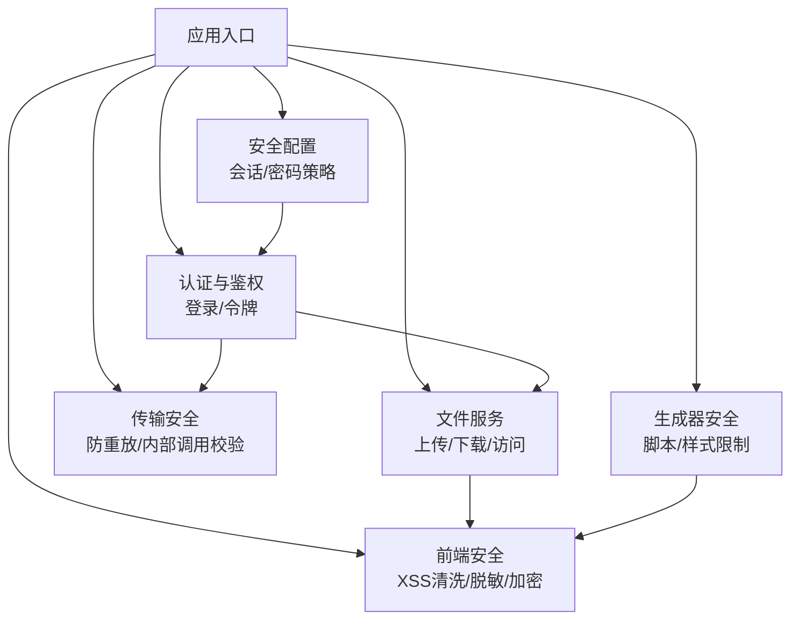
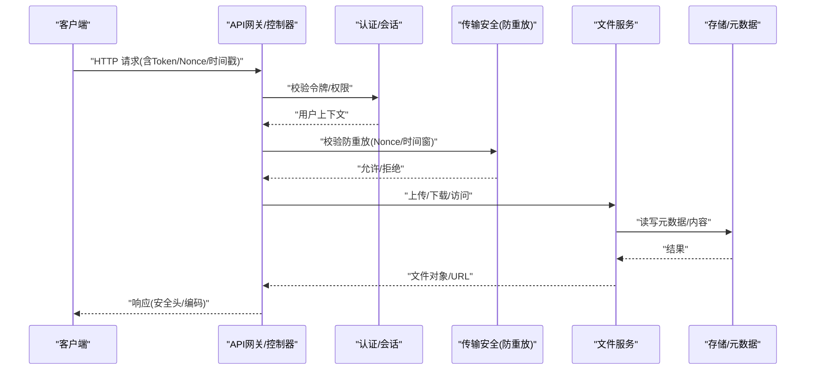
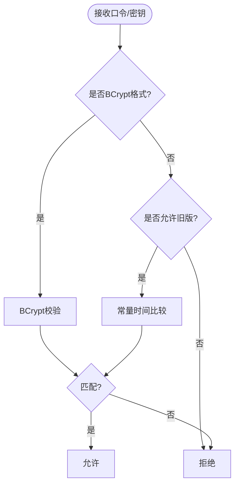
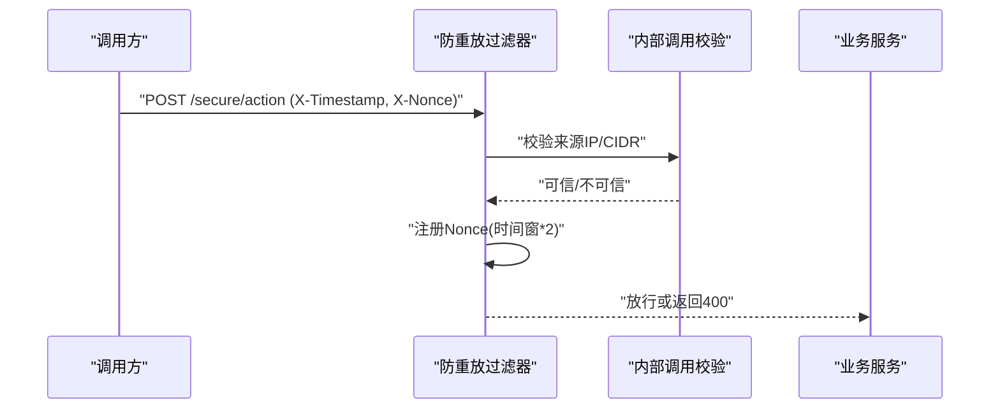
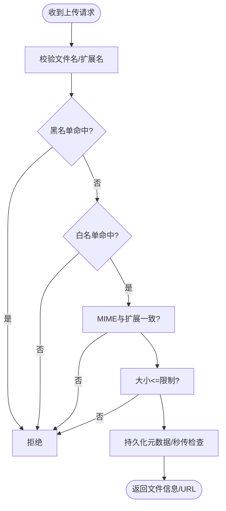
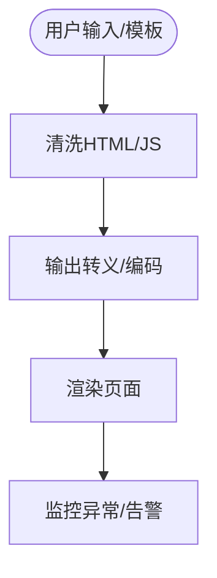
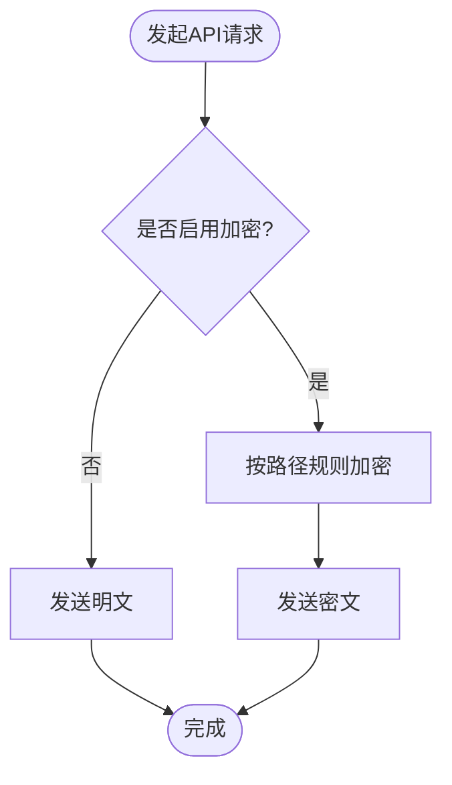
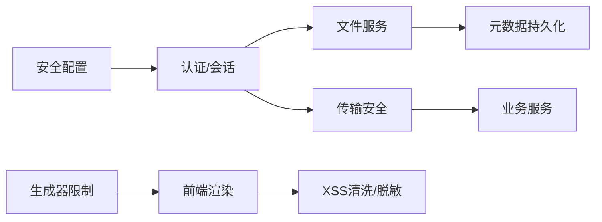

# 安全防护加固

<cite>
**本文引用的文件**
- [SecurityConfig.java](file://forge-server/forge-framework/forge-starter-parent/forge-starter-config/src/main/java/com/mdframe/forge/starter/config/config/SecurityConfig.java)
- [ClientSecretCodec.java](file://forge-server/forge-framework/forge-plugin-parent/forge-plugin-system/src/main/java/com/mdframe/forge/plugin/system/security/ClientSecretCodec.java)
- [FileManager.java](file://forge-server/forge-framework/forge-starter-parent/forge-starter-file/src/main/java/com/mdframe/forge/starter/file/core/FileManager.java)
- [LoginTenantAssetController.java](file://forge-server/forge-framework/forge-plugin-parent/forge-plugin-system/src/main/java/com/mdframe/forge/plugin/system/controller/LoginTenantAssetController.java)
- [ReplayAttackFilterTest.java](file://forge-server/forge-framework/forge-starter-parent/forge-starter-crypto/src/test/java/com/mdframe/forge/starter/crypto/filter/ReplayAttackFilterTest.java)
- [InternalCallRequestVerifierTest.java](file://forge-server/forge-framework/forge-starter-parent/forge-starter-crypto/src/test/java/com/mdframe/forge/starter/crypto/support/InternalCallRequestVerifierTest.java)
- [BusinessExtensionValidationService.java](file://forge-server/forge-framework/forge-plugin-parent/forge-plugin-generator/src/main/java/com/mdframe/forge/plugin/generator/service/businessapp/BusinessExtensionValidationService.java)
- [page-widget-schema.js](file://forge-admin-ui/src/components/lowcode-builder/shared/page-widget-schema.js)
- [sanitize-html.spec.js](file://forge-admin-ui/src/utils/__tests__/sanitize-html.spec.js)
- [crypto-config.ts](file://forge-report-ui/src/utils/api-crypto/crypto-config.ts)
- [security-sensitive-data-hardening.md](file://docs/blogs/security-sensitive-data-hardening.md)
</cite>

## 目录
1. [简介](#简介)
2. [项目结构](#项目结构)
3. [核心组件](#核心组件)
4. [架构总览](#架构总览)
5. [详细组件分析](#详细组件分析)
6. [依赖关系分析](#依赖关系分析)
7. [性能与安全权衡](#性能与安全权衡)
8. [故障排查指南](#故障排查指南)
9. [结论](#结论)
10. [附录：安全配置最佳实践与工具](#附录：安全配置最佳实践与工具)

## 简介
本文件面向Forge Admin的安全防护加固，聚焦敏感数据加密策略、传输层安全、存储层安全、输入输出校验与编码、文件上传安全检查、API请求签名与防重放、CORS与CSRF、点击劫持防护等主题。文档基于仓库中现有实现进行梳理，并提供可操作的加固建议与排错指引。

## 项目结构
本项目在多个模块中实现了安全能力：
- 认证与会话：通过安全配置集中管理令牌策略与密码策略。
- 密钥与口令：客户端密钥采用带前缀的BCrypt哈希存储，登录口令支持RSA前端加密与后端解密。
- 文件安全：统一文件管理器对扩展名、MIME类型、大小、白名单进行严格校验，并对高风险类型进行拦截。
- 传输安全：提供防重放过滤器与内部调用可信来源校验。
- 前端安全：提供XSS清理、敏感字段脱敏、API加解密开关与路径匹配。
- 生成器安全：对低代码生成的脚本/样式进行危险API与选择器限制，防止越权注入。

**章节来源**
- [SecurityConfig.java:1-113](file://forge-server/forge-framework/forge-starter-parent/forge-starter-config/src/main/java/com/mdframe/forge/starter/config/config/SecurityConfig.java#L1-L113)

## 核心组件
- 安全配置中心：集中定义Sa-Token行为（有效期、并发、读取位置、Token名称）与密码策略（复杂度、过期、历史）。
- 客户端密钥编解码：强制长度与字节上限，使用BCrypt存储并支持旧版兼容比对；常量时间比较避免时序攻击。
- 文件安全管理：黑名单+白名单+MIME校验+大小限制+秒传去重+私有可见范围控制。
- 传输安全：防重放过滤器基于nonce+时间戳，结合内部调用可信地址校验，拒绝伪造头与重复请求。
- 前端安全：XSS清洗、敏感键过滤、JSON安全解析、API加解密开关与路径匹配。
- 生成器安全：禁止危险API、危险CSS选择器与硬编码密钥字面量，限制作用域选择器。

**章节来源**
- [SecurityConfig.java:1-113](file://forge-server/forge-framework/forge-starter-parent/forge-starter-config/src/main/java/com/mdframe/forge/starter/config/config/SecurityConfig.java#L1-L113)
- [ClientSecretCodec.java:1-95](file://forge-server/forge-framework/forge-plugin-parent/forge-plugin-system/src/main/java/com/mdframe/forge/plugin/system/security/ClientSecretCodec.java#L1-L95)
- [FileManager.java:1-562](file://forge-server/forge-framework/forge-starter-parent/forge-starter-file/src/main/java/com/mdframe/forge/starter/file/core/FileManager.java#L1-L562)
- [ReplayAttackFilterTest.java:19-70](file://forge-server/forge-framework/forge-starter-parent/forge-starter-crypto/src/test/java/com/mdframe/forge/starter/crypto/filter/ReplayAttackFilterTest.java#L19-L70)
- [InternalCallRequestVerifierTest.java:1-35](file://forge-server/forge-framework/forge-starter-parent/forge-starter-crypto/src/test/java/com/mdframe/forge/starter/crypto/support/InternalCallRequestVerifierTest.java#L1-L35)
- [page-widget-schema.js:344-368](file://forge-admin-ui/src/components/lowcode-builder/shared/page-widget-schema.js#L344-L368)
- [sanitize-html.spec.js:1-23](file://forge-admin-ui/src/utils/__tests__/sanitize-html.spec.js#L1-L23)
- [crypto-config.ts:126-137](file://forge-report-ui/src/utils/api-crypto/crypto-config.ts#L126-L137)
- [BusinessExtensionValidationService.java:28-43](file://forge-server/forge-framework/forge-plugin-parent/forge-plugin-generator/src/main/java/com/mdframe/forge/plugin/generator/service/businessapp/BusinessExtensionValidationService.java#L28-L43)

## 架构总览
下图展示从请求进入、认证鉴权、到文件处理与传输安全的整体流程，以及前后端协同的安全点。

**图示来源**
- [ReplayAttackFilterTest.java:19-70](file://forge-server/forge-framework/forge-starter-parent/forge-starter-crypto/src/test/java/com/mdframe/forge/starter/crypto/filter/ReplayAttackFilterTest.java#L19-L70)
- [InternalCallRequestVerifierTest.java:1-35](file://forge-server/forge-framework/forge-starter-parent/forge-starter-crypto/src/test/java/com/mdframe/forge/starter/crypto/support/InternalCallRequestVerifierTest.java#L1-L35)
- [FileManager.java:107-233](file://forge-server/forge-framework/forge-starter-parent/forge-starter-file/src/main/java/com/mdframe/forge/starter/file/core/FileManager.java#L107-L233)

## 详细组件分析

### 敏感数据加密与口令策略
- 客户端密钥存储：以“{bcrypt}”前缀标识，使用BCrypt哈希存储，强度受成本因子约束；验证时区分新格式与旧明文兼容模式，并使用常量时间比较避免时序侧信道。
- 登录口令传输：前端可选择RSA公钥加密后提交，后端使用私钥解密；若解密失败则拒绝请求。
- 密码策略：最小长度、大小写/数字/特殊字符要求、过期天数、历史数量等均可配置。

**图示来源**
- [ClientSecretCodec.java:22-90](file://forge-server/forge-framework/forge-plugin-parent/forge-plugin-system/src/main/java/com/mdframe/forge/plugin/system/security/ClientSecretCodec.java#L22-L90)

**章节来源**
- [ClientSecretCodec.java:1-95](file://forge-server/forge-framework/forge-plugin-parent/forge-plugin-system/src/main/java/com/mdframe/forge/plugin/system/security/ClientSecretCodec.java#L1-L95)
- [SecurityConfig.java:72-113](file://forge-server/forge-framework/forge-starter-parent/forge-starter-config/src/main/java/com/mdframe/forge/starter/config/config/SecurityConfig.java#L72-L113)

### 传输层安全：防重放与内部调用校验
- 防重放：请求携带时间戳与随机数（Nonce），服务端在时间窗口内原子登记，重复Nonce直接拒绝。
- 内部调用可信来源：默认信任回环地址，支持配置可信CIDR；不信任伪造的转发头，仅依据真实连接地址判断。

**图示来源**
- [ReplayAttackFilterTest.java:19-70](file://forge-server/forge-framework/forge-starter-parent/forge-starter-crypto/src/test/java/com/mdframe/forge/starter/crypto/filter/ReplayAttackFilterTest.java#L19-L70)
- [InternalCallRequestVerifierTest.java:1-35](file://forge-server/forge-framework/forge-starter-parent/forge-starter-crypto/src/test/java/com/mdframe/forge/starter/crypto/support/InternalCallRequestVerifierTest.java#L1-L35)

**章节来源**
- [ReplayAttackFilterTest.java:19-70](file://forge-server/forge-framework/forge-starter-parent/forge-starter-crypto/src/test/java/com/mdframe/forge/starter/crypto/filter/ReplayAttackFilterTest.java#L19-L70)
- [InternalCallRequestVerifierTest.java:1-35](file://forge-server/forge-framework/forge-starter-parent/forge-starter-crypto/src/test/java/com/mdframe/forge/starter/crypto/support/InternalCallRequestVerifierTest.java#L1-L35)

### 存储层安全：文件上传与访问控制
- 上传校验：文件名非空、必须包含扩展名；黑名单拦截高风险扩展；白名单限制允许类型；MIME类型与扩展一致性校验；文件大小限制。
- 访问控制：下载与访问URL均基于元数据与存储策略；支持私有可见范围；SVG等高风险类型在资产接口中被显式拒绝。
- 元数据持久化：保存MD5、大小、类型、可见性等，支持秒传与下载次数统计。

**图示来源**
- [FileManager.java:464-559](file://forge-server/forge-framework/forge-starter-parent/forge-starter-file/src/main/java/com/mdframe/forge/starter/file/core/FileManager.java#L464-L559)
- [LoginTenantAssetController.java:150-195](file://forge-server/forge-framework/forge-plugin-parent/forge-plugin-system/src/main/java/com/mdframe/forge/plugin/system/controller/LoginTenantAssetController.java#L150-L195)

**章节来源**
- [FileManager.java:38-562](file://forge-server/forge-framework/forge-starter-parent/forge-starter-file/src/main/java/com/mdframe/forge/starter/file/core/FileManager.java#L38-L562)
- [LoginTenantAssetController.java:150-195](file://forge-server/forge-framework/forge-plugin-parent/forge-plugin-system/src/main/java/com/mdframe/forge/plugin/system/controller/LoginTenantAssetController.java#L150-L195)
- [security-sensitive-data-hardening.md:379-436](file://docs/blogs/security-sensitive-data-hardening.md#L379-L436)

### XSS防护与输出编码
- 前端XSS清洗：移除script标签、事件处理器、javascript协议等；提供HTML转义工具用于高亮显示场景。
- 敏感数据脱敏：离线草稿序列化时对敏感键进行跳过/忽略，防止泄露。
- 低代码生成器限制：禁止危险API调用、危险CSS选择器与硬编码密钥字面量，限制作用域选择器范围。

**图示来源**
- [page-widget-schema.js:344-368](file://forge-admin-ui/src/components/lowcode-builder/shared/page-widget-schema.js#L344-L368)
- [sanitize-html.spec.js:1-23](file://forge-admin-ui/src/utils/__tests__/sanitize-html.spec.js#L1-L23)
- [BusinessExtensionValidationService.java:28-43](file://forge-server/forge-framework/forge-plugin-parent/forge-plugin-generator/src/main/java/com/mdframe/forge/plugin/generator/service/businessapp/BusinessExtensionValidationService.java#L28-L43)

**章节来源**
- [page-widget-schema.js:344-368](file://forge-admin-ui/src/components/lowcode-builder/shared/page-widget-schema.js#L344-L368)
- [sanitize-html.spec.js:1-23](file://forge-admin-ui/src/utils/__tests__/sanitize-html.spec.js#L1-L23)
- [BusinessExtensionValidationService.java:28-43](file://forge-server/forge-framework/forge-plugin-parent/forge-plugin-generator/src/main/java/com/mdframe/forge/plugin/generator/service/businessapp/BusinessExtensionValidationService.java#L28-L43)

### API请求签名与加密
- 前端可选开启API加解密：根据全局配置与路径匹配决定是否对请求体/参数进行加密，支持包含/排除路径列表。
- 建议配合后端签名校验（如HMAC）与防重放机制，确保完整性与时效性。

**图示来源**
- [crypto-config.ts:126-137](file://forge-report-ui/src/utils/api-crypto/crypto-config.ts#L126-L137)

**章节来源**
- [crypto-config.ts:126-137](file://forge-report-ui/src/utils/api-crypto/crypto-config.ts#L126-L137)

### 输入验证框架与SQL注入防护
- 输入验证：表单与运行时输入遵循类型与长度约束，低代码生成器对字段类型与操作符进行规范化，降低注入风险。
- SQL注入防护：建议使用参数化查询与ORM映射，避免拼接SQL；对动态查询条件进行白名单校验与类型转换。

[本节为通用安全建议，未直接引用具体源码]

### 安全头配置、CORS策略、CSRF与点击劫持
- 安全头：建议在网关/反向代理设置Strict-Transport-Security、Content-Security-Policy、X-Frame-Options、X-Content-Type-Options等。
- CORS：仅允许受信域名与方法，最小化暴露面。
- CSRF：对于无状态API优先使用Token鉴权；如需Cookie会话，应启用SameSite与CSRF Token校验。
- 点击劫持：通过X-Frame-Options或CSP frame-ancestors限制嵌入。

[本节为通用安全建议，未直接引用具体源码]

## 依赖关系分析
- 安全配置被认证与会话模块消费，影响令牌生命周期与并发策略。
- 文件服务依赖存储配置提供者与元数据持久化，形成上传/下载/访问的统一入口。
- 传输安全过滤器与内部调用校验共同保障外部请求的合法性与时效性。
- 前端安全工具与生成器限制共同降低XSS与越权注入风险。

**图示来源**
- [SecurityConfig.java:1-113](file://forge-server/forge-framework/forge-starter-parent/forge-starter-config/src/main/java/com/mdframe/forge/starter/config/config/SecurityConfig.java#L1-L113)
- [FileManager.java:107-233](file://forge-server/forge-framework/forge-starter-parent/forge-starter-file/src/main/java/com/mdframe/forge/starter/file/core/FileManager.java#L107-L233)
- [ReplayAttackFilterTest.java:19-70](file://forge-server/forge-framework/forge-starter-parent/forge-starter-crypto/src/test/java/com/mdframe/forge/starter/crypto/filter/ReplayAttackFilterTest.java#L19-L70)
- [BusinessExtensionValidationService.java:28-43](file://forge-server/forge-framework/forge-plugin-parent/forge-plugin-generator/src/main/java/com/mdframe/forge/plugin/generator/service/businessapp/BusinessExtensionValidationService.java#L28-L43)

**章节来源**
- [SecurityConfig.java:1-113](file://forge-server/forge-framework/forge-starter-parent/forge-starter-config/src/main/java/com/mdframe/forge/starter/config/config/SecurityConfig.java#L1-L113)
- [FileManager.java:107-233](file://forge-server/forge-framework/forge-starter-parent/forge-starter-file/src/main/java/com/mdframe/forge/starter/file/core/FileManager.java#L107-L233)
- [ReplayAttackFilterTest.java:19-70](file://forge-server/forge-framework/forge-starter-parent/forge-starter-crypto/src/test/java/com/mdframe/forge/starter/crypto/filter/ReplayAttackFilterTest.java#L19-L70)
- [BusinessExtensionValidationService.java:28-43](file://forge-server/forge-framework/forge-plugin-parent/forge-plugin-generator/src/main/java/com/mdframe/forge/plugin/generator/service/businessapp/BusinessExtensionValidationService.java#L28-L43)

## 性能与安全权衡
- 防重放：时间窗口与缓存容量需平衡，过大易内存压力，过小影响可用性。
- 文件校验：MIME与扩展一致性校验增加CPU开销，但显著降低恶意上传风险。
- BCrypt成本因子：提高安全性会增加认证耗时，需根据硬件与QPS调优。
- 前端加密：按需开启，避免对高频接口造成额外加解密负担。

[本节为通用指导，未直接引用具体源码]

## 故障排查指南
- 登录口令解密失败：检查前端RSA公钥与后端私钥匹配，确认密文格式正确。
- 防重放拒绝：核对客户端时间戳与服务端时间同步，确认Nonce唯一且未过期。
- 文件上传被拒：检查扩展名是否在白名单、MIME是否与扩展一致、文件大小是否超限。
- 前端XSS问题：确认输出经过清洗与转义，避免直接插入HTML。

**章节来源**
- [ReplayAttackFilterTest.java:19-70](file://forge-server/forge-framework/forge-starter-parent/forge-starter-crypto/src/test/java/com/mdframe/forge/starter/crypto/filter/ReplayAttackFilterTest.java#L19-L70)
- [FileManager.java:464-559](file://forge-server/forge-framework/forge-starter-parent/forge-starter-file/src/main/java/com/mdframe/forge/starter/file/core/FileManager.java#L464-L559)
- [page-widget-schema.js:344-368](file://forge-admin-ui/src/components/lowcode-builder/shared/page-widget-schema.js#L344-L368)

## 结论
Forge Admin在敏感数据加密、传输安全、文件安全、前端XSS防护与生成器限制等方面具备较完善的基础能力。建议在生产环境进一步落地安全头、CORS、CSRF与点击劫持防护，并结合漏洞扫描与渗透测试持续验证。

[本节为总结，未直接引用具体源码]

## 附录：安全配置最佳实践与工具
- 安全配置最佳实践
  - 会话：合理设置令牌有效期与活动超时，限制并发登录与共享策略。
  - 密码：启用复杂度要求与过期策略，维护密码历史。
  - 文件：严格白名单与黑名单，强制MIME一致性，限制大小与私有可见范围。
  - 传输：启用防重放与内部调用可信来源校验，必要时启用HTTPS与证书校验。
  - 前端：开启API加解密（按需），统一XSS清洗与输出编码，脱敏敏感字段。
  - 生成器：禁用危险API与选择器，限制作用域，禁止硬编码密钥。
- 漏洞扫描与审计
  - 静态扫描：集成SAST工具扫描Java/JS代码中的不安全函数与正则。
  - 依赖扫描：定期更新第三方库，修复已知漏洞。
  - 动态扫描：对运行环境进行DAST扫描，覆盖认证、文件上传、API签名等关键路径。
  - 渗透测试：模拟常见攻击（XSS、SQLi、CSRF、重放、越权）验证防护有效性。
- 常见威胁防御方案
  - XSS：输入清洗、输出编码、CSP限制执行源。
  - SQL注入：参数化查询、ORM、白名单校验。
  - CSRF：SameSite Cookie、CSRF Token、同源策略。
  - 点击劫持：X-Frame-Options、CSP frame-ancestors。
  - 重放攻击：Nonce+时间戳、服务端去重、短时效签名。

[本节为通用指导，未直接引用具体源码]