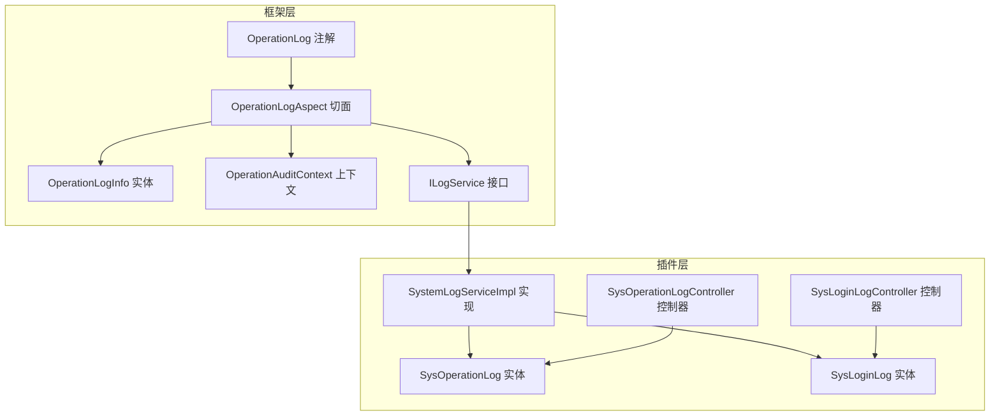
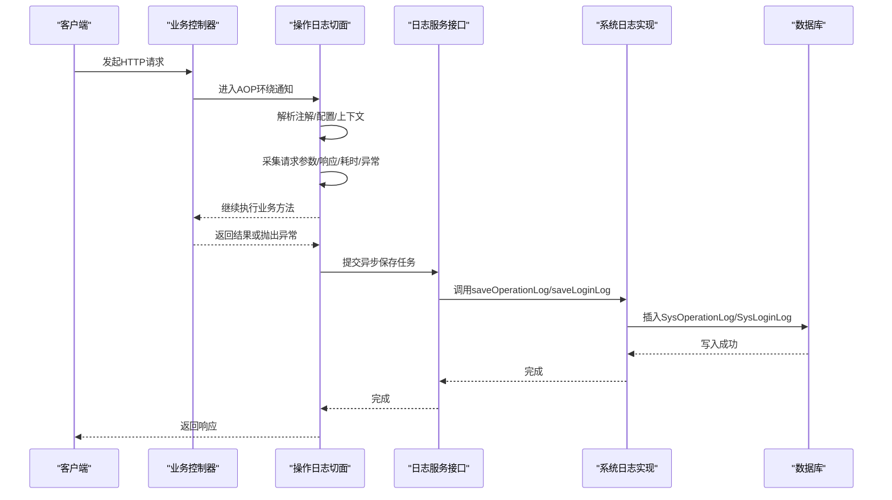
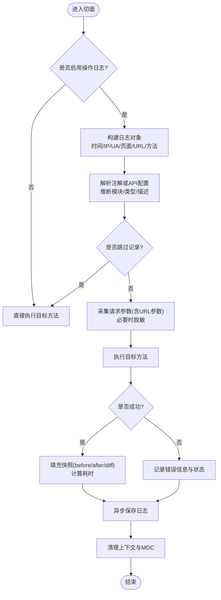
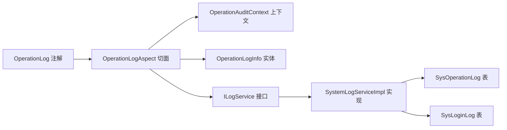

# 审计日志

<cite>
**本文引用的文件**
- [OperationLogAspect.java](file://forge-server/forge-framework/forge-starter-parent/forge-starter-log/src/main/java/com/mdframe/forge/starter/log/aspect/OperationLogAspect.java)
- [OperationLogInfo.java](file://forge-server/forge-framework/forge-starter-parent/forge-starter-log/src/main/java/com/mdframe/forge/starter/log/domain/OperationLogInfo.java)
- [OperationLog.java](file://forge-server/forge-framework/forge-starter-parent/forge-starter-core/src/main/java/com/mdframe/forge/starter/core/annotation/log/OperationLog.java)
- [ILogService.java](file://forge-server/forge-framework/forge-starter-parent/forge-starter-log/src/main/java/com/mdframe/forge/starter/log/service/ILogService.java)
- [SystemLogServiceImpl.java](file://forge-server/forge-framework/forge-plugin-parent/forge-plugin-system/src/main/java/com/mdframe/forge/plugin/system/service/impl/SystemLogServiceImpl.java)
- [SysOperationLogController.java](file://forge-server/forge-framework/forge-plugin-parent/forge-plugin-system/src/main/java/com/mdframe/forge/plugin/system/controller/SysOperationLogController.java)
- [SysLoginLogController.java](file://forge-server/forge-framework/forge-plugin-parent/forge-plugin-system/src/main/java/com/mdframe/forge/plugin/system/controller/SysLoginLogController.java)
- [SysOperationLog.java](file://forge-server/forge-framework/forge-plugin-parent/forge-plugin-system/src/main/java/com/mdframe/forge/plugin/system/entity/SysOperationLog.java)
- [SysLoginLog.java](file://forge-server/forge-framework/forge-plugin-parent/forge-plugin-system/src/main/java/com/mdframe/forge/plugin/system/entity/SysLoginLog.java)
- [SysOperationLogQuery.java](file://forge-server/forge-framework/forge-plugin-parent/forge-plugin-system/src/main/java/com/mdframe/forge/plugin/system/dto/SysOperationLogQuery.java)
- [OperationAuditContext.java](file://forge-server/forge-framework/forge-starter-parent/forge-starter-log/src/main/java/com/mdframe/forge/starter/log/context/OperationAuditContext.java)
</cite>

## 目录
1. [简介](#简介)
2. [项目结构](#项目结构)
3. [核心组件](#核心组件)
4. [架构总览](#架构总览)
5. [详细组件分析](#详细组件分析)
6. [依赖关系分析](#依赖关系分析)
7. [性能考虑](#性能考虑)
8. [故障排查指南](#故障排查指南)
9. [结论](#结论)
10. [附录](#附录)

## 简介
本文件面向 Forge Admin 的审计日志系统，系统性说明操作日志记录机制、日志收集策略与日志分析能力。重点覆盖：
- 用户行为追踪：通过注解切面统一采集请求上下文、参数、结果、耗时、异常等。
- API 调用审计：自动识别模块、类型、描述，支持忽略查询类接口以减少噪音。
- 系统事件记录：登录日志与操作日志双通道持久化。
- 日志格式规范、级别定义与存储方案。
- 敏感操作审计、批量操作记录与异常事件追踪。
- 日志查询接口与导出能力（基于系统模块提供的控制器与服务）。
- 性能优化建议：异步落库、长度截断、排除路径、只读方法跳过等。

## 项目结构
审计日志由“框架层”和“插件层”共同构成：
- 框架层提供通用能力：注解、AOP 切面、上下文、日志实体、日志服务接口。
- 插件层提供具体实现：将日志写入数据库，并提供查询与管理接口。

图表来源
- [OperationLog.java:1-42](file://forge-server/forge-framework/forge-starter-parent/forge-starter-core/src/main/java/com/mdframe/forge/starter/core/annotation/log/OperationLog.java#L1-L42)
- [OperationLogAspect.java:1-677](file://forge-server/forge-framework/forge-starter-parent/forge-starter-log/src/main/java/com/mdframe/forge/starter/log/aspect/OperationLogAspect.java#L1-L677)
- [OperationLogInfo.java:1-141](file://forge-server/forge-framework/forge-starter-parent/forge-starter-log/src/main/java/com/mdframe/forge/starter/log/domain/OperationLogInfo.java#L1-L141)
- [OperationAuditContext.java:1-48](file://forge-server/forge-framework/forge-starter-parent/forge-starter-log/src/main/java/com/mdframe/forge/starter/log/context/OperationAuditContext.java#L1-L48)
- [ILogService.java:1-26](file://forge-server/forge-framework/forge-starter-parent/forge-starter-log/src/main/java/com/mdframe/forge/starter/log/service/ILogService.java#L1-L26)
- [SystemLogServiceImpl.java:1-113](file://forge-server/forge-framework/forge-plugin-parent/forge-plugin-system/src/main/java/com/mdframe/forge/plugin/system/service/impl/SystemLogServiceImpl.java#L1-L113)
- [SysOperationLog.java:1-200](file://forge-server/forge-framework/forge-plugin-parent/forge-plugin-system/src/main/java/com/mdframe/forge/plugin/system/entity/SysOperationLog.java)
- [SysLoginLog.java:1-200](file://forge-server/forge-framework/forge-plugin-parent/forge-plugin-system/src/main/java/com/mdframe/forge/plugin/system/entity/SysLoginLog.java)
- [SysOperationLogController.java:1-200](file://forge-server/forge-framework/forge-plugin-parent/forge-plugin-system/src/main/java/com/mdframe/forge/plugin/system/controller/SysOperationLogController.java)
- [SysLoginLogController.java:1-200](file://forge-server/forge-framework/forge-plugin-parent/forge-plugin-system/src/main/java/com/mdframe/forge/plugin/system/controller/SysLoginLogController.java)

章节来源
- [OperationLogAspect.java:1-677](file://forge-server/forge-framework/forge-starter-parent/forge-starter-log/src/main/java/com/mdframe/forge/starter/log/aspect/OperationLogAspect.java#L1-L677)
- [SystemLogServiceImpl.java:1-113](file://forge-server/forge-framework/forge-plugin-parent/forge-plugin-system/src/main/java/com/mdframe/forge/plugin/system/service/impl/SystemLogServiceImpl.java#L1-L113)

## 核心组件
- 操作日志注解：用于声明模块、类型、描述以及是否保存请求/响应内容。
- 操作日志切面：拦截 Controller 方法，采集请求上下文、参数、结果、耗时、异常，并异步落库。
- 操作日志实体：承载一次操作的完整审计信息。
- 操作审计上下文：允许业务在请求内主动写入前后快照与差异数据。
- 日志服务接口：定义操作日志与登录日志的持久化契约。
- 系统日志实现：将框架日志实体映射到系统表并填充用户信息。
- 日志查询控制器：提供对操作日志与登录日志的查询与管理能力。

章节来源
- [OperationLog.java:1-42](file://forge-server/forge-framework/forge-starter-parent/forge-starter-core/src/main/java/com/mdframe/forge/starter/core/annotation/log/OperationLog.java#L1-L42)
- [OperationLogAspect.java:1-677](file://forge-server/forge-framework/forge-starter-parent/forge-starter-log/src/main/java/com/mdframe/forge/starter/log/aspect/OperationLogAspect.java#L1-L677)
- [OperationLogInfo.java:1-141](file://forge-server/forge-framework/forge-starter-parent/forge-starter-log/src/main/java/com/mdframe/forge/starter/log/domain/OperationLogInfo.java#L1-L141)
- [OperationAuditContext.java:1-48](file://forge-server/forge-framework/forge-starter-parent/forge-starter-log/src/main/java/com/mdframe/forge/starter/log/context/OperationAuditContext.java#L1-L48)
- [ILogService.java:1-26](file://forge-server/forge-framework/forge-starter-parent/forge-starter-log/src/main/java/com/mdframe/forge/starter/log/service/ILogService.java#L1-L26)
- [SystemLogServiceImpl.java:1-113](file://forge-server/forge-framework/forge-plugin-parent/forge-plugin-system/src/main/java/com/mdframe/forge/plugin/system/service/impl/SystemLogServiceImpl.java#L1-L113)
- [SysOperationLogController.java:1-200](file://forge-server/forge-framework/forge-plugin-parent/forge-plugin-system/src/main/java/com/mdframe/forge/plugin/system/controller/SysOperationLogController.java)
- [SysLoginLogController.java:1-200](file://forge-server/forge-framework/forge-plugin-parent/forge-plugin-system/src/main/java/com/mdframe/forge/plugin/system/controller/SysLoginLogController.java)

## 架构总览
审计日志采用“注解 + AOP + 异步落库”的解耦设计：
- 业务侧通过注解声明审计元数据；切面统一采集上下文与执行结果；最终通过服务接口异步持久化。
- 插件层负责将日志实体映射到数据库表，并提供查询管理接口。

图表来源
- [OperationLogAspect.java:89-242](file://forge-server/forge-framework/forge-starter-parent/forge-starter-log/src/main/java/com/mdframe/forge/starter/log/aspect/OperationLogAspect.java#L89-L242)
- [SystemLogServiceImpl.java:31-67](file://forge-server/forge-framework/forge-plugin-parent/forge-plugin-system/src/main/java/com/mdframe/forge/plugin/system/service/impl/SystemLogServiceImpl.java#L31-L67)

## 详细组件分析

### 操作日志切面（OperationLogAspect）
- 功能要点
  - 启用开关：通过配置项控制是否开启操作日志。
  - 排除路径：内置敏感路径与可配置排除规则，避免记录认证、OAuth 等敏感接口。
  - 元数据推断：未标注注解时，根据 API 配置或 URL 模式推断模块、类型、描述。
  - 参数采集：合并方法参数与 URL 参数；对带特定注解的请求体进行脱敏标记。
  - 快照增强：从操作审计上下文读取 before/after/diff 数据，并在变更操作中回退使用请求/响应。
  - 异步落库：通过线程池异步保存，避免阻塞主流程。
  - 追踪标识：生成 traceId 放入 MDC，便于链路追踪。
  - 打印日志：可选打印入参、出参、异常日志，便于调试。
- 关键逻辑
  - 跳过策略：查询类操作默认不记录；只读 HTTP 方法默认不记录。
  - 失败处理：捕获异常并记录错误信息与状态。
  - 清理：finally 中清理上下文与 MDC。

图表来源
- [OperationLogAspect.java:89-242](file://forge-server/forge-framework/forge-starter-parent/forge-starter-log/src/main/java/com/mdframe/forge/starter/log/aspect/OperationLogAspect.java#L89-L242)
- [OperationLogAspect.java:300-357](file://forge-server/forge-framework/forge-starter-parent/forge-starter-log/src/main/java/com/mdframe/forge/starter/log/aspect/OperationLogAspect.java#L300-L357)
- [OperationLogAspect.java:557-595](file://forge-server/forge-framework/forge-starter-parent/forge-starter-log/src/main/java/com/mdframe/forge/starter/log/aspect/OperationLogAspect.java#L557-L595)

章节来源
- [OperationLogAspect.java:1-677](file://forge-server/forge-framework/forge-starter-parent/forge-starter-log/src/main/java/com/mdframe/forge/starter/log/aspect/OperationLogAspect.java#L1-L677)

### 操作日志实体（OperationLogInfo）
- 字段涵盖：租户、用户、模块、类型、描述、页面、内容、请求方式/URL/参数、响应结果、前后数据、差异数据、错误信息、状态、IP、地点、UA、耗时、时间。
- 用途：作为切面与持久化之间的传输载体，保证审计信息的完整性与一致性。

章节来源
- [OperationLogInfo.java:1-141](file://forge-server/forge-framework/forge-starter-parent/forge-starter-log/src/main/java/com/mdframe/forge/starter/log/domain/OperationLogInfo.java#L1-L141)

### 操作审计上下文（OperationAuditContext）
- 作用：在一次请求内，业务代码可设置操作内容、前后快照与差异数据，切面在 finally 中读取并写入日志。
- 特性：ThreadLocal 隔离，自动清理，避免跨请求污染。

章节来源
- [OperationAuditContext.java:1-48](file://forge-server/forge-framework/forge-starter-parent/forge-starter-log/src/main/java/com/mdframe/forge/starter/log/context/OperationAuditContext.java#L1-L48)

### 日志服务接口与实现（ILogService / SystemLogServiceImpl）
- 接口：定义 saveOperationLog 与 saveLoginLog。
- 实现：将框架日志实体转换为系统实体，补充用户名、操作人姓名、租户信息后入库；异常被捕获并记录，确保不影响主流程。

章节来源
- [ILogService.java:1-26](file://forge-server/forge-framework/forge-starter-parent/forge-starter-log/src/main/java/com/mdframe/forge/starter/log/service/ILogService.java#L1-L26)
- [SystemLogServiceImpl.java:1-113](file://forge-server/forge-framework/forge-plugin-parent/forge-plugin-system/src/main/java/com/mdframe/forge/plugin/system/service/impl/SystemLogServiceImpl.java#L1-L113)

### 日志查询与管理（SysOperationLogController / SysLoginLogController）
- 职责：对外暴露操作日志与登录日志的查询与管理接口，供后台管理与审计分析使用。
- 典型能力：分页查询、条件筛选、详情查看、重试/解决（针对流程错误日志，见下方扩展）。

章节来源
- [SysOperationLogController.java:1-200](file://forge-server/forge-framework/forge-plugin-parent/forge-plugin-system/src/main/java/com/mdframe/forge/plugin/system/controller/SysOperationLogController.java)
- [SysLoginLogController.java:1-200](file://forge-server/forge-framework/forge-plugin-parent/forge-plugin-system/src/main/java/com/mdframe/forge/plugin/system/controller/SysLoginLogController.java)

### 注解与类型（OperationLog / OperationType）
- 注解属性：模块、类型、描述、是否保存请求/响应。
- 类型：包含 ADD/UPDATE/DELETE/QUERY/IMPORT/EXPORT/OTHER 等，用于分类与过滤。

章节来源
- [OperationLog.java:1-42](file://forge-server/forge-framework/forge-starter-parent/forge-starter-core/src/main/java/com/mdframe/forge/starter/core/annotation/log/OperationLog.java#L1-L42)

## 依赖关系分析
- 松耦合：切面仅依赖日志服务接口，具体持久化由插件实现注入。
- 可扩展：可通过实现 ILogService 替换存储后端（如消息队列、外部审计系统）。
- 低侵入：业务仅需添加注解即可接入审计，无需改动核心流程。

图表来源
- [OperationLog.java:1-42](file://forge-server/forge-framework/forge-starter-parent/forge-starter-core/src/main/java/com/mdframe/forge/starter/core/annotation/log/OperationLog.java#L1-L42)
- [OperationLogAspect.java:1-677](file://forge-server/forge-framework/forge-starter-parent/forge-starter-log/src/main/java/com/mdframe/forge/starter/log/aspect/OperationLogAspect.java#L1-L677)
- [OperationAuditContext.java:1-48](file://forge-server/forge-framework/forge-starter-parent/forge-starter-log/src/main/java/com/mdframe/forge/starter/log/context/OperationAuditContext.java#L1-L48)
- [OperationLogInfo.java:1-141](file://forge-server/forge-framework/forge-starter-parent/forge-starter-log/src/main/java/com/mdframe/forge/starter/log/domain/OperationLogInfo.java#L1-L141)
- [ILogService.java:1-26](file://forge-server/forge-framework/forge-starter-parent/forge-starter-log/src/main/java/com/mdframe/forge/starter/log/service/ILogService.java#L1-L26)
- [SystemLogServiceImpl.java:1-113](file://forge-server/forge-framework/forge-plugin-parent/forge-plugin-system/src/main/java/com/mdframe/forge/plugin/system/service/impl/SystemLogServiceImpl.java#L1-L113)

章节来源
- [OperationLogAspect.java:1-677](file://forge-server/forge-framework/forge-starter-parent/forge-starter-log/src/main/java/com/mdframe/forge/starter/log/aspect/OperationLogAspect.java#L1-L677)
- [SystemLogServiceImpl.java:1-113](file://forge-server/forge-framework/forge-plugin-parent/forge-plugin-system/src/main/java/com/mdframe/forge/plugin/system/service/impl/SystemLogServiceImpl.java#L1-L113)

## 性能考虑
- 异步落库：切面通过线程池异步保存日志，降低对主流程延迟的影响。
- 长度限制：对请求参数、响应结果、操作内容等进行截断，防止大对象导致存储与网络开销。
- 跳过策略：查询类操作与只读 HTTP 方法默认不记录，减少无效日志。
- 排除路径：内置敏感路径与可配置排除规则，避免记录认证、OAuth 等接口。
- 用户信息填充：仅在需要时查询用户信息，且异常被捕获，避免影响主流程。
- 建议
  - 合理设置日志保留策略与归档周期。
  - 在高并发场景下评估线程池大小与背压策略。
  - 对高频接口谨慎开启请求/响应体保存。
  - 结合索引优化查询性能（按时间、用户、模块、类型等维度）。

[本节为通用指导，不直接分析具体文件]

## 故障排查指南
- 日志未记录
  - 检查是否启用了操作日志配置。
  - 确认请求路径未被排除。
  - 确认方法是否命中切点（Controller/RestController）。
- 参数为空或脱敏
  - 检查是否使用了请求体注解，切面对此类参数会进行脱敏标记。
  - 检查是否开启了保存请求参数选项。
- 用户信息缺失
  - 检查会话或登录态获取是否成功。
  - 检查用户信息查询是否被租户上下文屏蔽（实现中已忽略租户查询）。
- 异步保存失败
  - 关注日志服务实现中的异常捕获与错误日志输出。
  - 检查数据库连接与权限。

章节来源
- [OperationLogAspect.java:89-242](file://forge-server/forge-framework/forge-starter-parent/forge-starter-log/src/main/java/com/mdframe/forge/starter/log/aspect/OperationLogAspect.java#L89-L242)
- [SystemLogServiceImpl.java:31-67](file://forge-server/forge-framework/forge-plugin-parent/forge-plugin-system/src/main/java/com/mdframe/forge/plugin/system/service/impl/SystemLogServiceImpl.java#L31-L67)

## 结论
Forge Admin 的审计日志系统以注解与 AOP 为核心，实现了低侵入、高扩展的操作审计能力。通过异步落库、长度截断、排除路径与只读方法跳过等机制，在保证审计完整性的同时兼顾了性能。插件层提供了统一的日志持久化与查询管理能力，便于后续扩展至更复杂的审计与分析场景。

[本节为总结性内容，不直接分析具体文件]

## 附录

### 日志格式规范与字段说明
- 基础字段：操作时间、操作 IP、用户代理、请求方式、请求 URL、请求参数、响应结果、错误信息、执行时长。
- 审计字段：操作模块、操作类型、操作描述、操作页面路径、操作页面标题、操作内容。
- 变更快照：操作前数据、操作后数据、操作数据差异（可由业务通过上下文注入）。
- 多租户字段：租户编号（在实现中按需填充）。

章节来源
- [OperationLogInfo.java:1-141](file://forge-server/forge-framework/forge-starter-parent/forge-starter-log/src/main/java/com/mdframe/forge/starter/log/domain/OperationLogInfo.java#L1-L141)
- [SystemLogServiceImpl.java:69-111](file://forge-server/forge-framework/forge-plugin-parent/forge-plugin-system/src/main/java/com/mdframe/forge/plugin/system/service/impl/SystemLogServiceImpl.java#L69-L111)

### 日志级别与开关
- 开关：通过配置项控制是否启用操作日志、是否打印操作日志。
- 级别：日志切面内部使用 info/error/debug 输出调试与异常信息；生产环境建议关闭详细打印以提升性能。

章节来源
- [OperationLogAspect.java:91-94](file://forge-server/forge-framework/forge-starter-parent/forge-starter-log/src/main/java/com/mdframe/forge/starter/log/aspect/OperationLogAspect.java#L91-L94)
- [OperationLogAspect.java:181-230](file://forge-server/forge-framework/forge-starter-parent/forge-starter-log/src/main/java/com/mdframe/forge/starter/log/aspect/OperationLogAspect.java#L181-L230)

### 存储方案与实体映射
- 操作日志：框架实体 OperationLogInfo -> 系统实体 SysOperationLog。
- 登录日志：框架实体 LoginLogInfo -> 系统实体 SysLoginLog。
- 实现层负责字段映射与用户信息填充。

章节来源
- [SystemLogServiceImpl.java:31-67](file://forge-server/forge-framework/forge-plugin-parent/forge-plugin-system/src/main/java/com/mdframe/forge/plugin/system/service/impl/SystemLogServiceImpl.java#L31-L67)
- [SysOperationLog.java:1-200](file://forge-server/forge-framework/forge-plugin-parent/forge-plugin-system/src/main/java/com/mdframe/forge/plugin/system/entity/SysOperationLog.java)
- [SysLoginLog.java:1-200](file://forge-server/forge-framework/forge-plugin-parent/forge-plugin-system/src/main/java/com/mdframe/forge/plugin/system/entity/SysLoginLog.java)

### 查询接口与导出能力
- 操作日志查询：通过 SysOperationLogController 提供查询与管理能力。
- 登录日志查询：通过 SysLoginLogController 提供查询与管理能力。
- 查询条件：支持按时间、用户、模块、类型等维度筛选（具体字段以系统实体为准）。
- 导出：通常由控制器或服务层提供导出接口（具体实现以插件层为准）。

章节来源
- [SysOperationLogController.java:1-200](file://forge-server/forge-framework/forge-plugin-parent/forge-plugin-system/src/main/java/com/mdframe/forge/plugin/system/controller/SysOperationLogController.java)
- [SysLoginLogController.java:1-200](file://forge-server/forge-framework/forge-plugin-parent/forge-plugin-system/src/main/java/com/mdframe/forge/plugin/system/controller/SysLoginLogController.java)
- [SysOperationLogQuery.java:1-200](file://forge-server/forge-framework/forge-plugin-parent/forge-plugin-system/src/main/java/com/mdframe/forge/plugin/system/dto/SysOperationLogQuery.java)

### 敏感操作审计与批量操作记录
- 敏感路径排除：认证、OAuth 相关路径默认不记录，避免泄露凭证。
- 批量操作：删除/导入/导出等操作属于变更类，会被记录；建议在注解中明确类型与描述，便于审计检索。
- 请求体脱敏：对带特定注解的请求体进行脱敏标记，避免敏感数据落入日志。

章节来源
- [OperationLogAspect.java:64-77](file://forge-server/forge-framework/forge-starter-parent/forge-starter-log/src/main/java/com/mdframe/forge/starter/log/aspect/OperationLogAspect.java#L64-L77)
- [OperationLogAspect.java:449-502](file://forge-server/forge-framework/forge-starter-parent/forge-starter-log/src/main/java/com/mdframe/forge/starter/log/aspect/OperationLogAspect.java#L449-L502)

### 异常事件追踪
- 异常捕获：切面捕获异常并记录错误信息与状态。
- 追踪标识：traceId 放入 MDC，便于关联日志与链路追踪。
- 建议：在业务中配合分布式追踪工具，提升问题定位效率。

章节来源
- [OperationLogAspect.java:215-239](file://forge-server/forge-framework/forge-starter-parent/forge-starter-log/src/main/java/com/mdframe/forge/starter/log/aspect/OperationLogAspect.java#L215-L239)
- [OperationLogAspect.java:149-152](file://forge-server/forge-framework/forge-starter-parent/forge-starter-log/src/main/java/com/mdframe/forge/starter/log/aspect/OperationLogAspect.java#L149-L152)