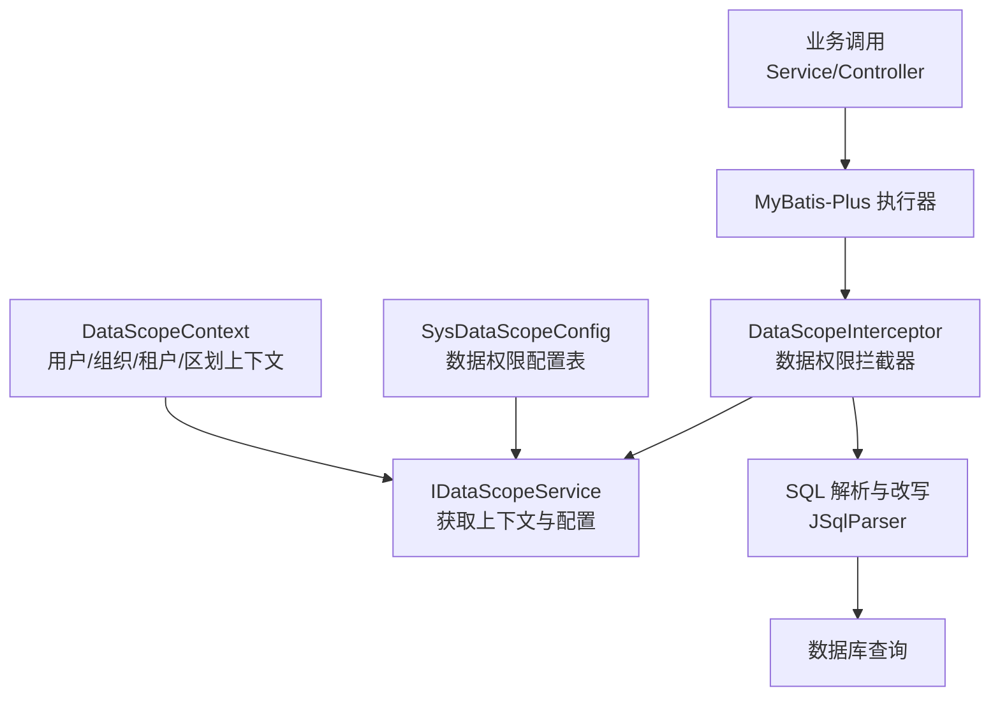
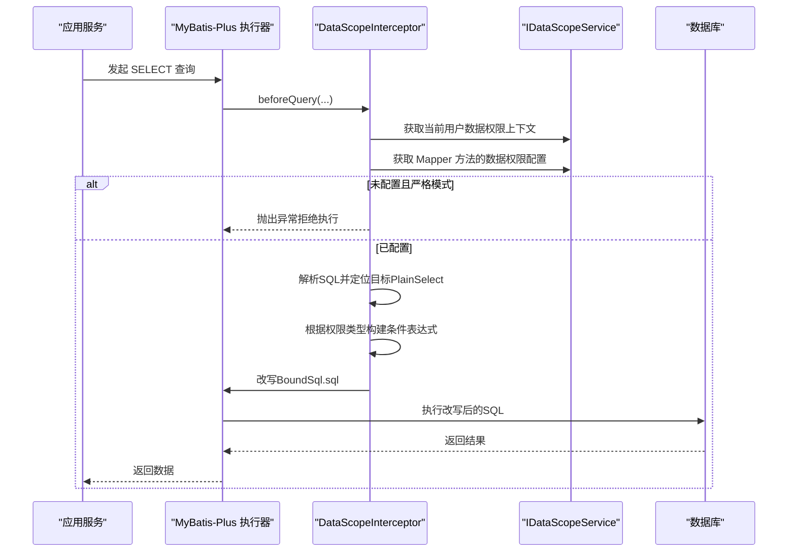
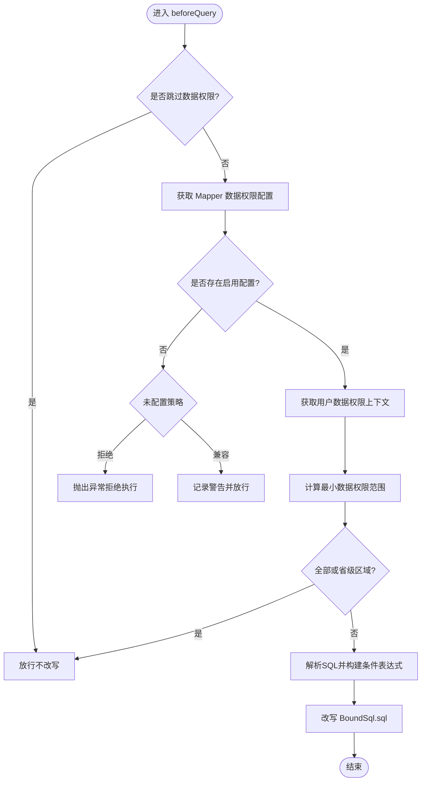
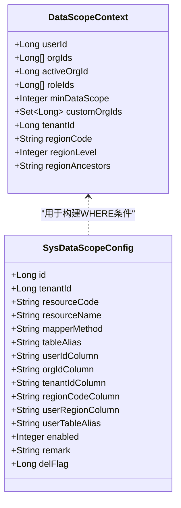
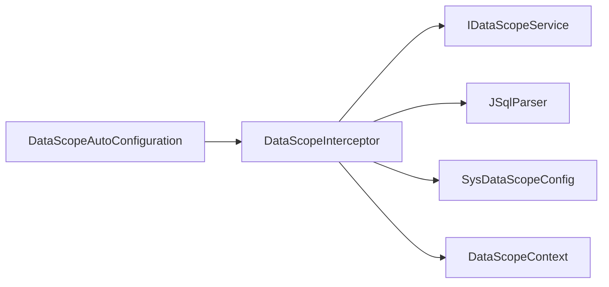

# 数据权限控制

<cite>
**本文引用的文件**
- [DataScopeAutoConfiguration.java](file://forge-server/forge-framework/forge-starter-parent/forge-starter-datascope/src/main/java/com/mdframe/forge/starter/datascope/config/DataScopeAutoConfiguration.java)
- [DataScopeInterceptor.java](file://forge-server/forge-framework/forge-starter-parent/forge-starter-datascope/src/main/java/com/mdframe/forge/starter/datascope/handler/DataScopeInterceptor.java)
- [DataScopeContext.java](file://forge-server/forge-framework/forge-starter-parent/forge-starter-datascope/src/main/java/com/mdframe/forge/starter/datascope/context/DataScopeContext.java)
- [SysDataScopeConfig.java](file://forge-server/forge-framework/forge-starter-parent/forge-starter-datascope/src/main/java/com/mdframe/forge/starter/datascope/entity/SysDataScopeConfig.java)
- [DataScopeType.java](file://forge-server/forge-framework/forge-starter-parent/forge-starter-datascope/src/main/java/com/mdframe/forge/starter/datascope/enums/DataScopeType.java)
- [IgnoreTenantAspect.java](file://forge-server/forge-framework/forge-starter-parent/forge-starter-tenant/src/main/java/com/mdframe/forge/starter/tenant/aspect/IgnoreTenantAspect.java)
- [IgnoreTenant.java](file://forge-server/forge-framework/forge-starter-parent/forge-starter-core/src/main/java/com/mdframe/forge/starter/core/annotation/tenant/IgnoreTenant.java)
- [DatasetResultMapper.java](file://forge-server/forge-framework/forge-plugin-parent/forge-plugin-data/src/main/java/com/mdframe/forge/plugin/data/support/DatasetResultMapper.java)
- [DataQueryExecutor.java](file://forge-server/forge-framework/forge-plugin-parent/forge-plugin-data/src/main/java/com/mdframe/forge/plugin/data/service/DataQueryExecutor.java)
</cite>

## 目录
1. [简介](#简介)
2. [项目结构](#项目结构)
3. [核心组件](#核心组件)
4. [架构总览](#架构总览)
5. [详细组件分析](#详细组件分析)
6. [依赖关系分析](#依赖关系分析)
7. [性能考虑](#性能考虑)
8. [故障排查指南](#故障排查指南)
9. [结论](#结论)
10. [附录](#附录)

## 简介
本文件系统化说明 Forge Admin 的数据权限控制系统，覆盖数据范围控制机制、租户隔离与多租户安全策略、基于角色/部门/自定义规则的数据权限、注解驱动配置、动态 SQL 生成原理、字段级敏感数据脱敏与导出权限控制。文档面向不同技术背景的读者，提供从概念到代码级的完整解读，并给出配置示例、复杂场景处理与性能优化建议。

## 项目结构
数据权限能力以“启动器”形式集成在 MyBatis-Plus 的拦截器链中，通过自动装配注册 DataScopeInterceptor；运行时根据当前用户上下文与 Mapper 方法的数据权限配置，动态改写 SQL，实现细粒度的数据范围控制。同时，系统提供忽略租户的切面与注解，用于跨租户或后台任务场景的安全执行。

图表来源
- [DataScopeAutoConfiguration.java:17-41](file://forge-server/forge-framework/forge-starter-parent/forge-starter-datascope/src/main/java/com/mdframe/forge/starter/datascope/config/DataScopeAutoConfiguration.java#L17-L41)
- [DataScopeInterceptor.java:69-155](file://forge-server/forge-framework/forge-starter-parent/forge-starter-datascope/src/main/java/com/mdframe/forge/starter/datascope/handler/DataScopeInterceptor.java#L69-L155)
- [SysDataScopeConfig.java:11-112](file://forge-server/forge-framework/forge-starter-parent/forge-starter-datascope/src/main/java/com/mdframe/forge/starter/datascope/entity/SysDataScopeConfig.java#L11-L112)
- [DataScopeContext.java:10-67](file://forge-server/forge-framework/forge-starter-parent/forge-starter-datascope/src/main/java/com/mdframe/forge/starter/datascope/context/DataScopeContext.java#L10-L67)

章节来源
- [DataScopeAutoConfiguration.java:17-41](file://forge-server/forge-framework/forge-starter-parent/forge-starter-datascope/src/main/java/com/mdframe/forge/starter/datascope/config/DataScopeAutoConfiguration.java#L17-L41)

## 核心组件
- 数据权限自动配置：注册 DataScopeInterceptor，设置最高优先级，等待 MybatisPlusConfig 统一注入拦截器链。
- 数据权限拦截器：在 beforeQuery 阶段解析 SQL、读取配置与上下文、构建条件表达式并改写 SQL。
- 数据权限上下文：封装 userId、orgIds、activeOrgId、roleIds、minDataScope、customOrgIds、tenantId、regionCode/Level/Ancestors。
- 数据权限配置实体：按 Mapper 方法维度配置资源编码、主表别名、用户/组织/租户/区划字段或复杂 SQL 模板。
- 数据权限类型枚举：全部、本人、本组织、本组织及子组织、自定义、租户全部、本行政区划。
- 忽略租户切面与注解：在特定方法或类上跳过租户隔离，适用于后台任务或平台级操作。

章节来源
- [DataScopeAutoConfiguration.java:17-41](file://forge-server/forge-framework/forge-starter-parent/forge-starter-datascope/src/main/java/com/mdframe/forge/starter/datascope/config/DataScopeAutoConfiguration.java#L17-L41)
- [DataScopeInterceptor.java:69-155](file://forge-server/forge-framework/forge-starter-parent/forge-starter-datascope/src/main/java/com/mdframe/forge/starter/datascope/handler/DataScopeInterceptor.java#L69-L155)
- [DataScopeContext.java:10-67](file://forge-server/forge-framework/forge-starter-parent/forge-starter-datascope/src/main/java/com/mdframe/forge/starter/datascope/context/DataScopeContext.java#L10-L67)
- [SysDataScopeConfig.java:11-112](file://forge-server/forge-framework/forge-starter-parent/forge-starter-datascope/src/main/java/com/mdframe/forge/starter/datascope/entity/SysDataScopeConfig.java#L11-L112)
- [DataScopeType.java:6-90](file://forge-server/forge-framework/forge-starter-parent/forge-starter-datascope/src/main/java/com/mdframe/forge/starter/datascope/enums/DataScopeType.java#L6-L90)
- [IgnoreTenantAspect.java:26-44](file://forge-server/forge-framework/forge-starter-parent/forge-starter-tenant/src/main/java/com/mdframe/forge/starter/tenant/aspect/IgnoreTenantAspect.java#L26-L44)
- [IgnoreTenant.java:5-18](file://forge-server/forge-framework/forge-starter-parent/forge-starter-core/src/main/java/com/mdframe/forge/starter/core/annotation/tenant/IgnoreTenant.java#L5-L18)

## 架构总览
数据权限在查询前进行拦截，依据“方法级配置 + 用户上下文”动态生成 WHERE 条件，支持简单字段匹配与复杂 SQL 模板（占位符替换）。对分页 count 查询会定位到内部 PlainSelect 追加条件，避免外层 COUNT 包裹导致条件失效。

图表来源
- [DataScopeInterceptor.java:69-155](file://forge-server/forge-framework/forge-starter-parent/forge-starter-datascope/src/main/java/com/mdframe/forge/starter/datascope/handler/DataScopeInterceptor.java#L69-L155)
- [DataScopeInterceptor.java:176-207](file://forge-server/forge-framework/forge-starter-parent/forge-starter-datascope/src/main/java/com/mdframe/forge/starter/datascope/handler/DataScopeInterceptor.java#L176-L207)
- [DataScopeInterceptor.java:215-227](file://forge-server/forge-framework/forge-starter-parent/forge-starter-datascope/src/main/java/com/mdframe/forge/starter/datascope/handler/DataScopeInterceptor.java#L215-L227)

## 详细组件分析

### 数据范围控制机制
- 拦截时机：beforeQuery，仅对 SELECT 生效，支持分页 count 的特殊处理。
- 策略开关：未配置 Mapper 的策略可配置为“拒绝”或“兼容放行”，失败时可选择 fail-closed 直接抛错。
- 权限范围判定：结合用户 minDataScope 与 customOrgIds 决定最终范围类型（含兼容历史字典值）。
- SQL 改写：使用 JSqlParser 解析并构造 Where 条件，支持 AND/OR、IN、等值、括号包裹等。

图表来源
- [DataScopeInterceptor.java:69-155](file://forge-server/forge-framework/forge-starter-parent/forge-starter-datascope/src/main/java/com/mdframe/forge/starter/datascope/handler/DataScopeInterceptor.java#L69-L155)
- [DataScopeInterceptor.java:176-207](file://forge-server/forge-framework/forge-starter-parent/forge-starter-datascope/src/main/java/com/mdframe/forge/starter/datascope/handler/DataScopeInterceptor.java#L176-L207)
- [DataScopeType.java:70-90](file://forge-server/forge-framework/forge-starter-parent/forge-starter-datascope/src/main/java/com/mdframe/forge/starter/datascope/enums/DataScopeType.java#L70-L90)

章节来源
- [DataScopeInterceptor.java:69-155](file://forge-server/forge-framework/forge-starter-parent/forge-starter-datascope/src/main/java/com/mdframe/forge/starter/datascope/handler/DataScopeInterceptor.java#L69-L155)
- [DataScopeType.java:6-90](file://forge-server/forge-framework/forge-starter-parent/forge-starter-datascope/src/main/java/com/mdframe/forge/starter/datascope/enums/DataScopeType.java#L6-L90)

### 租户隔离实现与多租户数据安全策略
- 租户上下文：DataScopeContext 包含 tenantId，配合 SysDataScopeConfig.tenantIdColumn 实现租户级过滤。
- 忽略租户：通过 @IgnoreTenant 与 IgnoreTenantAspect 在方法或类级别跳过租户隔离，适用于平台级任务或跨租户聚合。
- 安全兜底：当 TENANT_ALL 未配置租户字段时，强制无数据，防止越权。

图表来源
- [DataScopeContext.java:10-67](file://forge-server/forge-framework/forge-starter-parent/forge-starter-datascope/src/main/java/com/mdframe/forge/starter/datascope/context/DataScopeContext.java#L10-L67)
- [SysDataScopeConfig.java:11-112](file://forge-server/forge-framework/forge-starter-parent/forge-starter-datascope/src/main/java/com/mdframe/forge/starter/datascope/entity/SysDataScopeConfig.java#L11-L112)
- [IgnoreTenantAspect.java:26-44](file://forge-server/forge-framework/forge-starter-parent/forge-starter-tenant/src/main/java/com/mdframe/forge/starter/tenant/aspect/IgnoreTenantAspect.java#L26-L44)
- [IgnoreTenant.java:5-18](file://forge-server/forge-framework/forge-starter-parent/forge-starter-core/src/main/java/com/mdframe/forge/starter/core/annotation/tenant/IgnoreTenant.java#L5-L18)

章节来源
- [DataScopeContext.java:10-67](file://forge-server/forge-framework/forge-starter-parent/forge-starter-datascope/src/main/java/com/mdframe/forge/starter/datascope/context/DataScopeContext.java#L10-L67)
- [SysDataScopeConfig.java:11-112](file://forge-server/forge-framework/forge-starter-parent/forge-starter-datascope/src/main/java/com/mdframe/forge/starter/datascope/entity/SysDataScopeConfig.java#L11-L112)
- [IgnoreTenantAspect.java:26-44](file://forge-server/forge-framework/forge-starter-parent/forge-starter-tenant/src/main/java/com/mdframe/forge/starter/tenant/aspect/IgnoreTenantAspect.java#L26-L44)
- [IgnoreTenant.java:5-18](file://forge-server/forge-framework/forge-starter-parent/forge-starter-core/src/main/java/com/mdframe/forge/starter/core/annotation/tenant/IgnoreTenant.java#L5-L18)

### 基于角色的数据权限
- 最小权限范围：从用户角色集合中取 minDataScope，作为最终数据范围。
- 兼容历史字典：旧后端枚举与新字典映射，确保升级平滑。
- 自定义组织：当存在 customOrgIds 时，角色中的“个人”语义转换为“自定义组织”。

章节来源
- [DataScopeInterceptor.java:120-137](file://forge-server/forge-framework/forge-starter-parent/forge-starter-datascope/src/main/java/com/mdframe/forge/starter/datascope/handler/DataScopeInterceptor.java#L120-L137)
- [DataScopeType.java:70-90](file://forge-server/forge-framework/forge-starter-parent/forge-starter-datascope/src/main/java/com/mdframe/forge/starter/datascope/enums/DataScopeType.java#L70-L90)

### 基于部门的数据权限
- 本组织：将 orgIds 转为 IN 条件，若为空则强制无数据。
- 本组织及子组织：通过服务扩展获取下级组织集合，再转为 IN 条件。
- 自定义组织：当角色类型为 CUSTOM 且存在 customOrgIds 时使用。

章节来源
- [DataScopeInterceptor.java:245-268](file://forge-server/forge-framework/forge-starter-parent/forge-starter-datascope/src/main/java/com/mdframe/forge/starter/datascope/handler/DataScopeInterceptor.java#L245-L268)

### 自定义数据权限规则
- 复杂 SQL 模板：userIdColumn/orgIdColumn/tenantIdColumn/regionCodeColumn 支持以 <sql> 开头的模板，内置占位符 #{userId}、#{tenantId}、#{orgIds}、#{customOrgIds}、#{regionCode}、#{regionLevel}、#{regionAncestors}、#{regionCodes}。
- 占位符替换：在拦截器中完成字符串替换后，交由 JSqlParser 解析为表达式。
- 安全兜底：解析失败时降级为恒假条件，避免误放行。

章节来源
- [SysDataScopeConfig.java:47-94](file://forge-server/forge-framework/forge-starter-parent/forge-starter-datascope/src/main/java/com/mdframe/forge/starter/datascope/entity/SysDataScopeConfig.java#L47-L94)
- [DataScopeInterceptor.java:305-426](file://forge-server/forge-framework/forge-starter-parent/forge-starter-datascope/src/main/java/com/mdframe/forge/starter/datascope/handler/DataScopeInterceptor.java#L305-L426)

### 动态 SQL 生成与数据过滤器实现原理
- 解析目标 Select：针对分页 count 包装，递归定位内部 PlainSelect，确保条件追加到正确位置。
- 构建表达式：支持 equals、in、and/or、括号包裹、字符串与数值类型适配。
- 改写 BoundSql：通过反射修改 MPBoundSql.sql，使后续执行使用改写后的 SQL。

章节来源
- [DataScopeInterceptor.java:176-227](file://forge-server/forge-framework/forge-starter-parent/forge-starter-datascope/src/main/java/com/mdframe/forge/starter/datascope/handler/DataScopeInterceptor.java#L176-L227)
- [DataScopeInterceptor.java:428-588](file://forge-server/forge-framework/forge-starter-parent/forge-starter-datascope/src/main/java/com/mdframe/forge/starter/datascope/handler/DataScopeInterceptor.java#L428-L588)

### 字段级权限控制与敏感数据脱敏
- 数据集结果脱敏：在数据集查询结果映射阶段，按字段敏感级别与脱敏规则进行掩码处理。
- 通用脱敏：对 JSON、URL、纯文本中的敏感键值与手机号、身份证、银行卡等进行识别与掩码。
- 导出权限控制：建议在导出流程复用相同脱敏逻辑，并结合导出权限校验，避免敏感信息外泄。

章节来源
- [DatasetResultMapper.java:62-102](file://forge-server/forge-framework/forge-plugin-parent/forge-plugin-data/src/main/java/com/mdframe/forge/plugin/data/support/DatasetResultMapper.java#L62-L102)
- [DataQueryExecutor.java:348-364](file://forge-server/forge-framework/forge-plugin-parent/forge-plugin-data/src/main/java/com/mdframe/forge/plugin/data/service/DataQueryExecutor.java#L348-L364)

### 数据权限注解使用
- 忽略租户：@IgnoreTenant(value=true) 可用于方法或类，切面会在执行前移除租户隔离，适合后台任务或平台级操作。
- 注意事项：仅在明确需要跨租户访问时使用，避免滥用导致数据泄露。

章节来源
- [IgnoreTenant.java:5-18](file://forge-server/forge-framework/forge-starter-parent/forge-starter-core/src/main/java/com/mdframe/forge/starter/core/annotation/tenant/IgnoreTenant.java#L5-L18)
- [IgnoreTenantAspect.java:26-44](file://forge-server/forge-framework/forge-starter-parent/forge-starter-tenant/src/main/java/com/mdframe/forge/starter/tenant/aspect/IgnoreTenantAspect.java#L26-L44)

## 依赖关系分析
- 自动配置依赖：DataScopeAutoConfiguration 扫描 datascope 包并注册拦截器 Bean。
- 拦截器依赖：DataScopeInterceptor 依赖 IDataScopeService 获取上下文与配置，依赖 JSqlParser 解析 SQL。
- 配置实体依赖：SysDataScopeConfig 定义 Mapper 方法维度的数据权限规则。
- 上下文依赖：DataScopeContext 由上层认证/授权模块填充，供拦截器使用。

图表来源
- [DataScopeAutoConfiguration.java:17-41](file://forge-server/forge-framework/forge-starter-parent/forge-starter-datascope/src/main/java/com/mdframe/forge/starter/datascope/config/DataScopeAutoConfiguration.java#L17-L41)
- [DataScopeInterceptor.java:69-155](file://forge-server/forge-framework/forge-starter-parent/forge-starter-datascope/src/main/java/com/mdframe/forge/starter/datascope/handler/DataScopeInterceptor.java#L69-L155)
- [SysDataScopeConfig.java:11-112](file://forge-server/forge-framework/forge-starter-parent/forge-starter-datascope/src/main/java/com/mdframe/forge/starter/datascope/entity/SysDataScopeConfig.java#L11-L112)
- [DataScopeContext.java:10-67](file://forge-server/forge-framework/forge-starter-parent/forge-starter-datascope/src/main/java/com/mdframe/forge/starter/datascope/context/DataScopeContext.java#L10-L67)

章节来源
- [DataScopeAutoConfiguration.java:17-41](file://forge-server/forge-framework/forge-starter-parent/forge-starter-datascope/src/main/java/com/mdframe/forge/starter/datascope/config/DataScopeAutoConfiguration.java#L17-L41)
- [DataScopeInterceptor.java:69-155](file://forge-server/forge-framework/forge-starter-parent/forge-starter-datascope/src/main/java/com/mdframe/forge/starter/datascope/handler/DataScopeInterceptor.java#L69-L155)

## 性能考虑
- 优先跳过：全部数据权限或省级区域直接放行，减少 SQL 解析与改写开销。
- 缓存与索引：为常用过滤字段建立索引（如 org_id、tenant_id、area_code），提升 IN 与等值查询效率。
- 复杂模板：尽量使用简单字段模式；复杂 <sql> 模板需确保参数化与索引命中。
- 分页优化：确认 count 查询能复用原 SQL 的索引，避免全表扫描。
- 失败策略：生产环境建议开启 fail-closed，避免静默放行造成性能与安全双重风险。

[本节为通用指导，无需具体文件引用]

## 故障排查指南
- 未配置 Mapper：严格模式下抛出异常；兼容模式下记录警告并放行。检查 sys_data_scope_config 是否正确配置并启用。
- 上下文缺失：当已配置数据权限但未获取到用户信息时，记录错误并拒绝执行。检查认证与上下文注入链路。
- SQL 解析失败：自定义模板解析失败会降级为恒假条件。检查模板语法与占位符替换结果。
- 忽略租户：确认 @IgnoreTenant 的使用范围，避免误用导致跨租户数据泄露。

章节来源
- [DataScopeInterceptor.java:157-171](file://forge-server/forge-framework/forge-starter-parent/forge-starter-datascope/src/main/java/com/mdframe/forge/starter/datascope/handler/DataScopeInterceptor.java#L157-L171)
- [DataScopeInterceptor.java:106-118](file://forge-server/forge-framework/forge-starter-parent/forge-starter-datascope/src/main/java/com/mdframe/forge/starter/datascope/handler/DataScopeInterceptor.java#L106-L118)
- [DataScopeInterceptor.java:343-359](file://forge-server/forge-framework/forge-starter-parent/forge-starter-datascope/src/main/java/com/mdframe/forge/starter/datascope/handler/DataScopeInterceptor.java#L343-L359)

## 结论
Forge Admin 的数据权限控制以“配置驱动 + 动态 SQL 改写”为核心，结合角色、部门、自定义规则与行政区划等多维范围，实现了灵活且安全的多租户数据隔离。通过忽略租户注解与失败关闭策略，系统在易用性与安全性之间取得平衡。配合字段级脱敏与导出权限控制，可有效保护敏感数据。

[本节为总结性内容，无需具体文件引用]

## 附录

### 数据权限配置示例（路径参考）
- Mapper 方法维度配置：sys_data_scope_config 表中按 resourceCode/mapperMethod/tableAlias 定义过滤字段或复杂 SQL 模板。
- 忽略租户：在 Service/Task 方法或类上使用 @IgnoreTenant(value=true)。

章节来源
- [SysDataScopeConfig.java:11-112](file://forge-server/forge-framework/forge-starter-parent/forge-starter-datascope/src/main/java/com/mdframe/forge/starter/datascope/entity/SysDataScopeConfig.java#L11-L112)
- [IgnoreTenant.java:5-18](file://forge-server/forge-framework/forge-starter-parent/forge-starter-core/src/main/java/com/mdframe/forge/starter/core/annotation/tenant/IgnoreTenant.java#L5-L18)

### 复杂权限场景处理
- 多组织与子组织：ORG_AND_CHILD 通过服务扩展获取下级组织集合，生成 IN 条件。
- 行政区划权限：REGION 支持精确匹配与下级区划 IN，省级视为全部。
- 自定义模板：使用 <sql> 模板与占位符组合复杂条件，注意解析失败的安全降级。

章节来源
- [DataScopeInterceptor.java:253-280](file://forge-server/forge-framework/forge-starter-parent/forge-starter-datascope/src/main/java/com/mdframe/forge/starter/datascope/handler/DataScopeInterceptor.java#L253-L280)
- [DataScopeInterceptor.java:467-531](file://forge-server/forge-framework/forge-starter-parent/forge-starter-datascope/src/main/java/com/mdframe/forge/starter/datascope/handler/DataScopeInterceptor.java#L467-L531)

### 性能优化建议
- 索引设计：为 org_id、tenant_id、area_code 等高频过滤字段建立合适索引。
- 模板优化：避免在 <sql> 中使用低效函数或全表扫描条件。
- 失败策略：生产环境启用 fail-closed，避免静默放行带来的性能与安全隐患。

[本节为通用指导，无需具体文件引用]