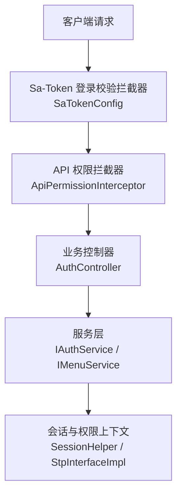
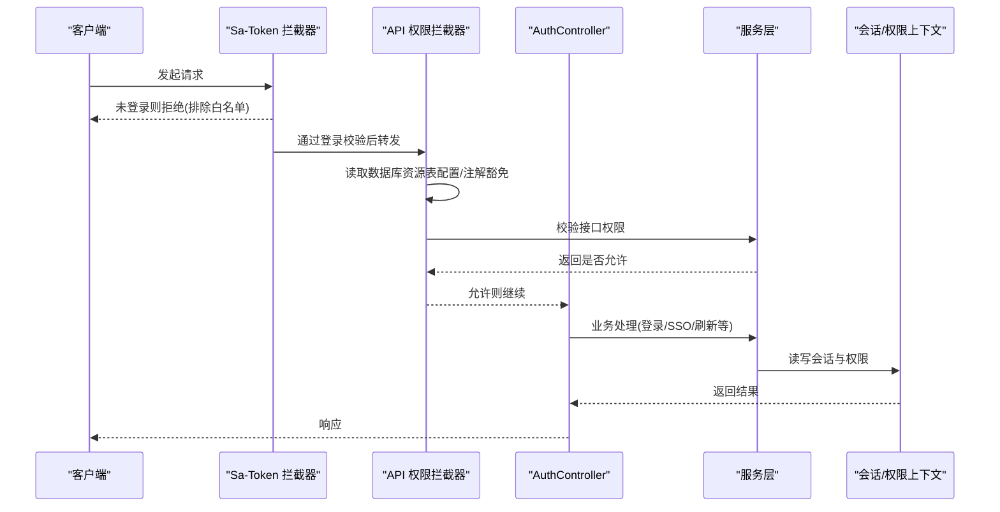
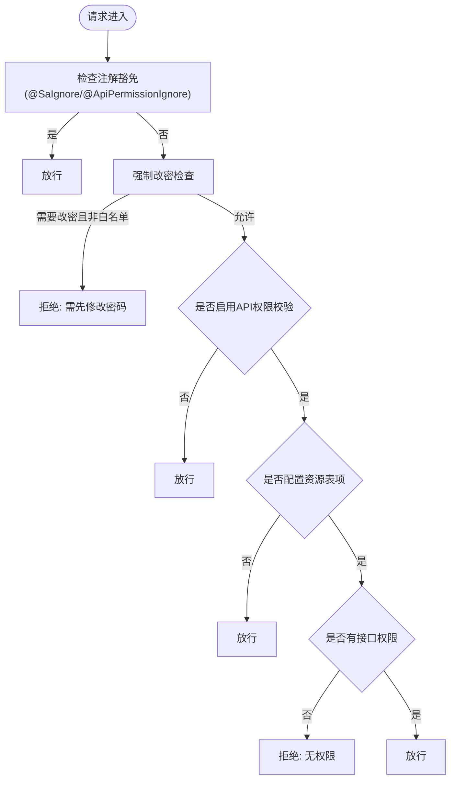
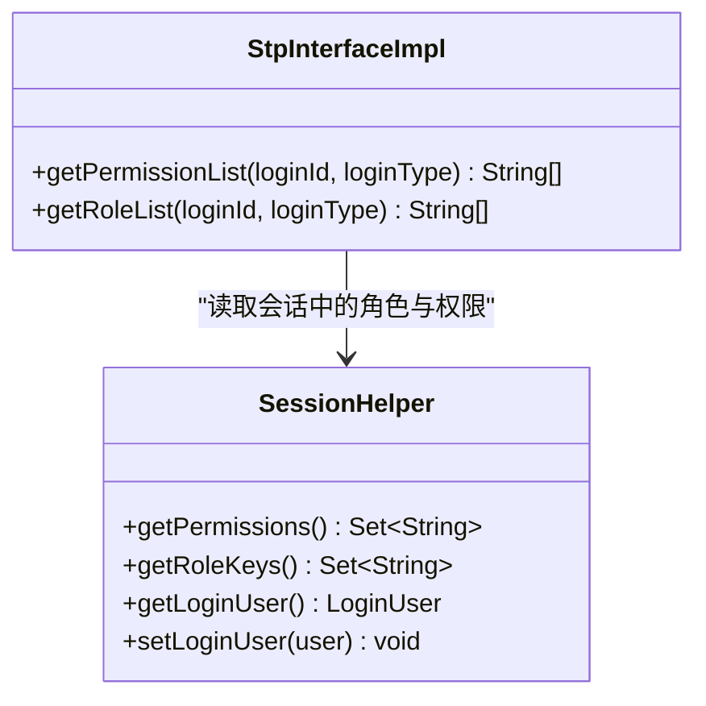
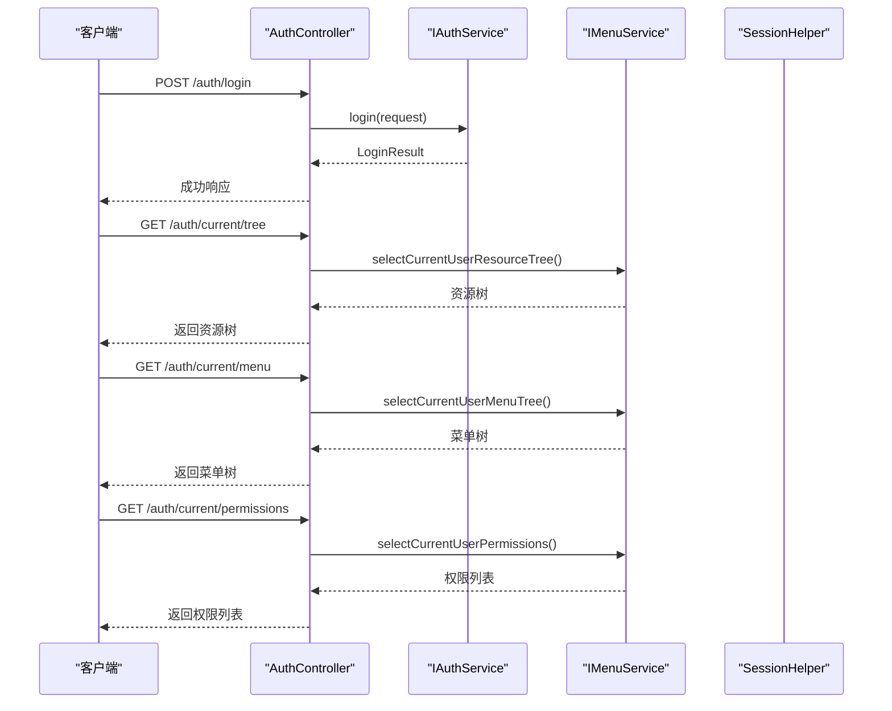
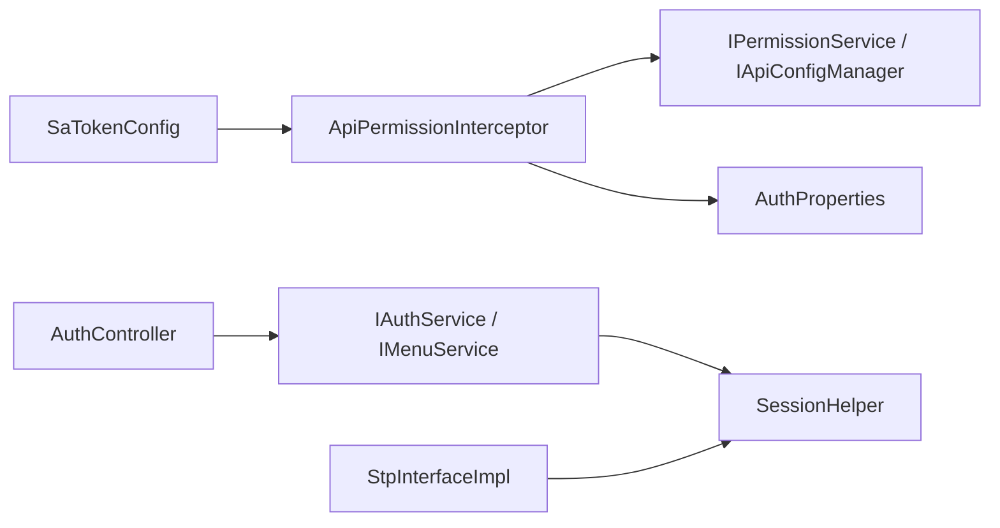

# 认证与授权

<cite>
**本文引用的文件**
- [SaTokenConfig.java](file://forge-server/forge-framework/forge-starter-parent/forge-starter-auth/src/main/java/com/mdframe/forge/starter/auth/config/SaTokenConfig.java)
- [StpInterfaceImpl.java](file://forge-server/forge-framework/forge-starter-parent/forge-starter-auth/src/main/java/com/mdframe/forge/starter/auth/config/StpInterfaceImpl.java)
- [AuthController.java](file://forge-server/forge-framework/forge-starter-parent/forge-starter-auth/src/main/java/com/mdframe/forge/starter/auth/controller/AuthController.java)
- [ApiPermissionInterceptor.java](file://forge-server/forge-framework/forge-starter-parent/forge-starter-auth/src/main/java/com/mdframe/forge/starter/auth/interceptor/ApiPermissionInterceptor.java)
</cite>

## 目录
1. [简介](#简介)
2. [项目结构](#项目结构)
3. [核心组件](#核心组件)
4. [架构总览](#架构总览)
5. [详细组件分析](#详细组件分析)
6. [依赖关系分析](#依赖关系分析)
7. [性能考虑](#性能考虑)
8. [故障排查指南](#故障排查指南)
9. [结论](#结论)
10. [附录](#附录)

## 简介
本章节面向 Forge Admin 的认证与授权体系，围绕 Sa-Token 集成、JWT 令牌管理、会话控制、用户身份验证流程以及 RBAC 权限模型进行系统化说明。文档重点覆盖：
- 登录认证流程、令牌刷新策略、多端登录支持与单点登录（SSO）票据交换
- 接口级权限控制、菜单权限过滤与按钮级权限控制
- 基于数据库资源表的权限配置与注解豁免机制
- 自定义认证扩展点、常见问题的定位与解决思路

## 项目结构
认证与授权能力集中在 forge-starter-auth 模块中，关键路径包括：
- 配置层：Sa-Token 拦截器注册、API 权限拦截器注册、会话与权限扩展
- 控制器层：统一登录入口、SSO 票据申请与交换、用户信息获取、密码重置、验证码等
- 拦截器层：接口权限校验、强制改密策略、匿名访问放行
- 权限扩展：将当前会话中的角色与权限注入到 Sa-Token 上下文

图表来源
- [SaTokenConfig.java:29-100](file://forge-server/forge-framework/forge-starter-parent/forge-starter-auth/src/main/java/com/mdframe/forge/starter/auth/config/SaTokenConfig.java#L29-L100)
- [ApiPermissionInterceptor.java:44-112](file://forge-server/forge-framework/forge-starter-parent/forge-starter-auth/src/main/java/com/mdframe/forge/starter/auth/interceptor/ApiPermissionInterceptor.java#L44-L112)
- [AuthController.java:40-222](file://forge-server/forge-framework/forge-starter-parent/forge-starter-auth/src/main/java/com/mdframe/forge/starter/auth/controller/AuthController.java#L40-L222)

章节来源
- [SaTokenConfig.java:29-100](file://forge-server/forge-framework/forge-starter-parent/forge-starter-auth/src/main/java/com/mdframe/forge/starter/auth/config/SaTokenConfig.java#L29-L100)
- [ApiPermissionInterceptor.java:44-112](file://forge-server/forge-framework/forge-starter-parent/forge-starter-auth/src/main/java/com/mdframe/forge/starter/auth/interceptor/ApiPermissionInterceptor.java#L44-L112)
- [AuthController.java:40-222](file://forge-server/forge-framework/forge-starter-parent/forge-starter-auth/src/main/java/com/mdframe/forge/starter/auth/controller/AuthController.java#L40-L222)

## 核心组件
- Sa-Token 配置与拦截器链
  - 登录校验拦截器：对全局路由执行登录态检查，并排除登录、登出、SSO、加密协商、健康检查、WebSocket 等路径
  - API 权限拦截器：在登录校验之后执行，依据数据库资源表配置进行接口级权限判定，支持通配符匹配与注解豁免
- 权限扩展点
  - 将当前会话中的角色键集合与权限码集合暴露给 Sa-Token，用于注解鉴权与表达式判断
- 认证控制器
  - 统一登录、SSO 票据申请与交换、用户信息加载、密码修改、验证码、租户选项、Token 刷新、资源树与权限列表查询

章节来源
- [SaTokenConfig.java:29-100](file://forge-server/forge-framework/forge-starter-parent/forge-starter-auth/src/main/java/com/mdframe/forge/starter/auth/config/SaTokenConfig.java#L29-L100)
- [StpInterfaceImpl.java:20-33](file://forge-server/forge-framework/forge-starter-parent/forge-starter-auth/src/main/java/com/mdframe/forge/starter/auth/config/StpInterfaceImpl.java#L20-L33)
- [AuthController.java:40-222](file://forge-server/forge-framework/forge-starter-parent/forge-starter-auth/src/main/java/com/mdframe/forge/starter/auth/controller/AuthController.java#L40-L222)
- [ApiPermissionInterceptor.java:44-112](file://forge-server/forge-framework/forge-starter-parent/forge-starter-auth/src/main/java/com/mdframe/forge/starter/auth/interceptor/ApiPermissionInterceptor.java#L44-L112)

## 架构总览
下图展示了从请求进入至权限校验的关键链路，以及各组件的职责边界。

图表来源
- [SaTokenConfig.java:29-100](file://forge-server/forge-framework/forge-starter-parent/forge-starter-auth/src/main/java/com/mdframe/forge/starter/auth/config/SaTokenConfig.java#L29-L100)
- [ApiPermissionInterceptor.java:44-112](file://forge-server/forge-framework/forge-starter-parent/forge-starter-auth/src/main/java/com/mdframe/forge/starter/auth/interceptor/ApiPermissionInterceptor.java#L44-L112)
- [AuthController.java:40-222](file://forge-server/forge-framework/forge-starter-parent/forge-starter-auth/src/main/java/com/mdframe/forge/starter/auth/controller/AuthController.java#L40-L222)

## 详细组件分析

### Sa-Token 集成与拦截器链
- 登录校验拦截器
  - 使用 SaRouter 对全量路由进行匹配，并通过 StpUtil.checkLogin() 完成登录态校验
  - 明确排除登录、登出、SSO、加密协商、健康检查、WebSocket、静态资源等路径，避免误拦截
- API 权限拦截器
  - 仅对 Controller 方法生效；优先检查 @SaIgnore 与 @ApiPermissionIgnore 注解豁免
  - 支持“强制改密”策略：当用户被标记为必须修改初始密码时，除指定白名单路径外一律拒绝
  - 若启用 API 权限校验，则根据数据库资源表配置判断是否需要鉴权；未配置资源的接口直接跳过权限校验
  - 最终调用权限服务进行接口级权限判定，失败抛出无权限异常

图表来源
- [ApiPermissionInterceptor.java:44-112](file://forge-server/forge-framework/forge-starter-parent/forge-starter-auth/src/main/java/com/mdframe/forge/starter/auth/interceptor/ApiPermissionInterceptor.java#L44-L112)
- [ApiPermissionInterceptor.java:115-139](file://forge-server/forge-framework/forge-starter-parent/forge-starter-auth/src/main/java/com/mdframe/forge/starter/auth/interceptor/ApiPermissionInterceptor.java#L115-L139)

章节来源
- [SaTokenConfig.java:29-100](file://forge-server/forge-framework/forge-starter-parent/forge-starter-auth/src/main/java/com/mdframe/forge/starter/auth/config/SaTokenConfig.java#L29-L100)
- [ApiPermissionInterceptor.java:44-139](file://forge-server/forge-framework/forge-starter-parent/forge-starter-auth/src/main/java/com/mdframe/forge/starter/auth/interceptor/ApiPermissionInterceptor.java#L44-L139)

### 权限扩展与会话上下文
- 通过实现 Sa-Token 的权限接口，将当前会话中的角色键集合与权限码集合暴露给框架，供注解鉴权与表达式判断使用
- 会话上下文由 SessionHelper 提供，登录成功后将用户信息与权限数据写入会话，后续请求可复用

图表来源
- [StpInterfaceImpl.java:20-33](file://forge-server/forge-framework/forge-starter-parent/forge-starter-auth/src/main/java/com/mdframe/forge/starter/auth/config/StpInterfaceImpl.java#L20-L33)

章节来源
- [StpInterfaceImpl.java:20-33](file://forge-server/forge-framework/forge-starter-parent/forge-starter-auth/src/main/java/com/mdframe/forge/starter/auth/config/StpInterfaceImpl.java#L20-L33)

### 认证控制器与登录流程
- 统一登录入口
  - 接收登录请求，交由服务层完成认证与登录态建立
- SSO 票据交换
  - 申请一次性票据与使用票据换发目标客户端 Token，支持跨系统单点登录场景
- 用户信息加载
  - 每次按当前已认证用户 ID 重建用户信息，保持最新状态
- 密码相关
  - 修改密码、发送重置密码验证码、重置密码
- 验证码
  - 获取验证码、滑块验证码、短信验证码
- 租户与配置
  - 获取登录配置、可选租户列表
- Token 刷新
  - 提供刷新接口以延长或轮换令牌有效期
- 资源与权限查询
  - 查询当前用户的资源树（含菜单与按钮）、菜单树（不含按钮）、权限标识列表

图表来源
- [AuthController.java:40-222](file://forge-server/forge-framework/forge-starter-parent/forge-starter-auth/src/main/java/com/mdframe/forge/starter/auth/controller/AuthController.java#L40-L222)

章节来源
- [AuthController.java:40-222](file://forge-server/forge-framework/forge-starter-parent/forge-starter-auth/src/main/java/com/mdframe/forge/starter/auth/controller/AuthController.java#L40-L222)

### RBAC 权限模型与接口级控制
- 模型要点
  - 角色与权限：通过会话上下文暴露角色键与权限码集合，供 Sa-Token 注解与表达式使用
  - 资源与接口：接口权限来源于数据库资源表配置，支持通配符匹配，未配置资源的接口默认跳过权限校验
  - 菜单与按钮：前端通过资源树接口获取菜单与按钮权限，用于动态渲染与按钮显隐控制
- 控制点
  - 接口级：ApiPermissionInterceptor 负责在请求到达控制器前进行权限判定
  - 页面级：前端根据资源树与权限列表控制菜单可见性与按钮操作权限
  - 注解级：结合 Sa-Token 注解与自定义权限扩展，实现细粒度方法级控制

章节来源
- [ApiPermissionInterceptor.java:44-112](file://forge-server/forge-framework/forge-starter-parent/forge-starter-auth/src/main/java/com/mdframe/forge/starter/auth/interceptor/ApiPermissionInterceptor.java#L44-L112)
- [AuthController.java:200-222](file://forge-server/forge-framework/forge-starter-parent/forge-starter-auth/src/main/java/com/mdframe/forge/starter/auth/controller/AuthController.java#L200-L222)
- [StpInterfaceImpl.java:20-33](file://forge-server/forge-framework/forge-starter-parent/forge-starter-auth/src/main/java/com/mdframe/forge/starter/auth/config/StpInterfaceImpl.java#L20-L33)

### 登录认证流程、令牌刷新与多端/SSO
- 登录认证
  - 统一入口接收认证参数，服务层完成用户校验与登录态建立
- 令牌刷新
  - 提供刷新接口，便于前端在令牌即将过期时主动续期
- 多端登录
  - 通过会话与权限上下文管理不同客户端的登录态，支持多端并发访问
- 单点登录（SSO）
  - 申请一次性票据与票据交换接口，支持跨系统安全地换发目标客户端 Token

章节来源
- [AuthController.java:40-68](file://forge-server/forge-framework/forge-starter-parent/forge-starter-auth/src/main/java/com/mdframe/forge/starter/auth/controller/AuthController.java#L40-L68)
- [AuthController.java:192-198](file://forge-server/forge-framework/forge-starter-parent/forge-starter-auth/src/main/java/com/mdframe/forge/starter/auth/controller/AuthController.java#L192-L198)

### 权限注解使用与接口级控制实践
- 注解豁免
  - 使用 @SaIgnore 或 @ApiPermissionIgnore 可让接口绕过权限校验，适用于公开接口或内部工具接口
- 强制改密
  - 当用户被要求修改初始密码时，除白名单路径外均会被拦截，确保安全性
- 接口权限配置
  - 在数据库资源表中配置接口与所需权限，未配置的接口默认不做强校验，便于渐进式接入

章节来源
- [ApiPermissionInterceptor.java:53-86](file://forge-server/forge-framework/forge-starter-parent/forge-starter-auth/src/main/java/com/mdframe/forge/starter/auth/interceptor/ApiPermissionInterceptor.java#L53-L86)
- [ApiPermissionInterceptor.java:115-139](file://forge-server/forge-framework/forge-starter-parent/forge-starter-auth/src/main/java/com/mdframe/forge/starter/auth/interceptor/ApiPermissionInterceptor.java#L115-L139)

### 菜单权限过滤与按钮级权限控制
- 菜单权限过滤
  - 通过菜单树接口返回当前用户可见的目录与菜单，前端据此构建导航
- 按钮级权限控制
  - 通过资源树接口返回包含按钮权限的结构，前端据此控制按钮显示与禁用
- 权限标识列表
  - 提供权限标识列表接口，便于前端进行细粒度的功能开关控制

章节来源
- [AuthController.java:200-222](file://forge-server/forge-framework/forge-starter-parent/forge-starter-auth/src/main/java/com/mdframe/forge/starter/auth/controller/AuthController.java#L200-L222)

## 依赖关系分析
- 组件耦合
  - SaTokenConfig 依赖 ApiPermissionInterceptor 与 AuthProperties，负责拦截器注册与路径排除
  - ApiPermissionInterceptor 依赖权限服务、API 配置管理器与 AuthProperties，负责接口级权限判定
  - AuthController 依赖服务层，负责认证、SSO、资源与权限查询
  - StpInterfaceImpl 依赖会话上下文，将角色与权限暴露给 Sa-Token
- 外部依赖
  - Sa-Token 框架：提供登录校验、注解鉴权与表达式引擎
  - 数据库资源表：存储接口与权限绑定关系，支撑动态权限控制

图表来源
- [SaTokenConfig.java:29-100](file://forge-server/forge-framework/forge-starter-parent/forge-starter-auth/src/main/java/com/mdframe/forge/starter/auth/config/SaTokenConfig.java#L29-L100)
- [ApiPermissionInterceptor.java:44-112](file://forge-server/forge-framework/forge-starter-parent/forge-starter-auth/src/main/java/com/mdframe/forge/starter/auth/interceptor/ApiPermissionInterceptor.java#L44-L112)
- [AuthController.java:40-222](file://forge-server/forge-framework/forge-starter-parent/forge-starter-auth/src/main/java/com/mdframe/forge/starter/auth/controller/AuthController.java#L40-L222)
- [StpInterfaceImpl.java:20-33](file://forge-server/forge-framework/forge-starter-parent/forge-starter-auth/src/main/java/com/mdframe/forge/starter/auth/config/StpInterfaceImpl.java#L20-L33)

章节来源
- [SaTokenConfig.java:29-100](file://forge-server/forge-framework/forge-starter-parent/forge-starter-auth/src/main/java/com/mdframe/forge/starter/auth/config/SaTokenConfig.java#L29-L100)
- [ApiPermissionInterceptor.java:44-112](file://forge-server/forge-framework/forge-starter-parent/forge-starter-auth/src/main/java/com/mdframe/forge/starter/auth/interceptor/ApiPermissionInterceptor.java#L44-L112)
- [AuthController.java:40-222](file://forge-server/forge-framework/forge-starter-parent/forge-starter-auth/src/main/java/com/mdframe/forge/starter/auth/controller/AuthController.java#L40-L222)
- [StpInterfaceImpl.java:20-33](file://forge-server/forge-framework/forge-starter-parent/forge-starter-auth/src/main/java/com/mdframe/forge/starter/auth/config/StpInterfaceImpl.java#L20-L33)

## 性能考虑
- 拦截器顺序与开销
  - 登录校验拦截器优先级高于 API 权限拦截器，减少无效权限校验
  - 未配置资源表的接口直接放行，降低数据库压力
- 会话与权限缓存
  - 通过会话上下文集中持有角色与权限，避免重复计算
- 资源树与权限列表
  - 建议在前端缓存资源树与权限列表，仅在必要时刷新

[本节为通用指导，无需特定文件引用]

## 故障排查指南
- 登录被拒绝
  - 检查请求路径是否在登录校验拦截器的白名单中
  - 确认客户端是否正确携带会话令牌
- 接口无权限
  - 确认数据库资源表是否已配置该接口与所需权限
  - 检查是否被注解豁免或启用了 API 权限校验
- 强制改密拦截
  - 确认当前请求是否为白名单路径（如用户信息、修改密码、登出、加密协商等）
- SSO 票据交换失败
  - 检查票据是否有效、是否已被使用或过期
- 资源树为空或权限缺失
  - 检查当前用户角色与权限是否正确加载到会话上下文

章节来源
- [ApiPermissionInterceptor.java:44-139](file://forge-server/forge-framework/forge-starter-parent/forge-starter-auth/src/main/java/com/mdframe/forge/starter/auth/interceptor/ApiPermissionInterceptor.java#L44-L139)
- [AuthController.java:40-222](file://forge-server/forge-framework/forge-starter-parent/forge-starter-auth/src/main/java/com/mdframe/forge/starter/auth/controller/AuthController.java#L40-L222)

## 结论
Forge Admin 的认证与授权体系以 Sa-Token 为核心，结合数据库驱动的接口权限配置与灵活的注解豁免机制，实现了从登录认证、令牌管理、多端与会话控制到 RBAC 权限模型的完整闭环。通过统一的认证控制器与清晰的拦截器链，既保证了安全性，又提供了良好的可扩展性与运维友好性。

[本节为总结性内容，无需特定文件引用]

## 附录
- 常用接口速查
  - 登录：POST /auth/login
  - 登出：POST /auth/logout
  - 刷新令牌：POST /auth/refreshToken
  - 用户信息：GET /auth/userInfo
  - 资源树：GET /auth/current/tree
  - 菜单树：GET /auth/current/menu
  - 权限列表：GET /auth/current/permissions
  - SSO 票据申请：POST /auth/sso/ticket
  - SSO 票据交换：POST /auth/sso/exchange
  - 验证码：GET /auth/captcha
  - 滑块验证码：GET /auth/captcha/slider
  - 短信验证码：POST /auth/captcha/sms
  - 登录配置：GET /auth/loginConfig
  - 可选租户：GET /auth/tenant/options

章节来源
- [AuthController.java:40-222](file://forge-server/forge-framework/forge-starter-parent/forge-starter-auth/src/main/java/com/mdframe/forge/starter/auth/controller/AuthController.java#L40-L222)