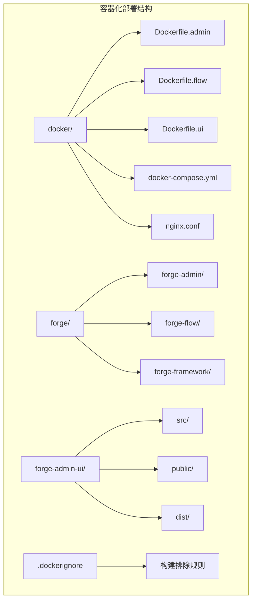
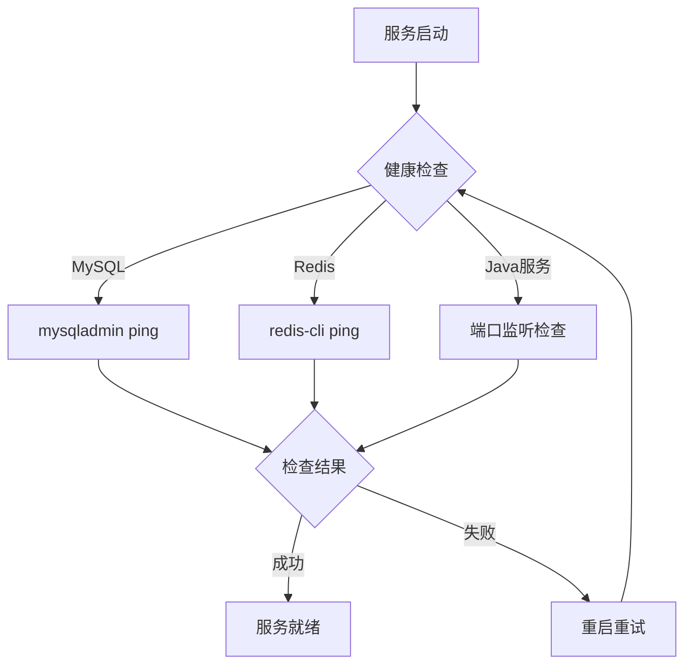
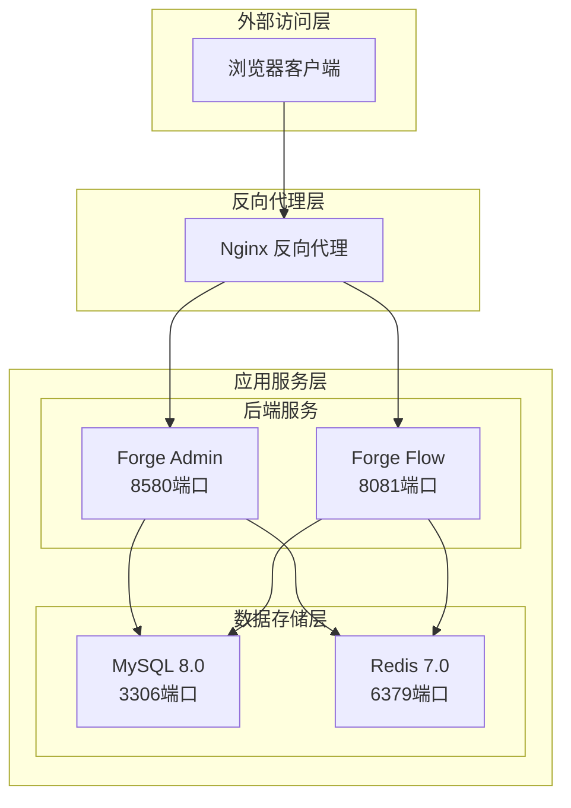
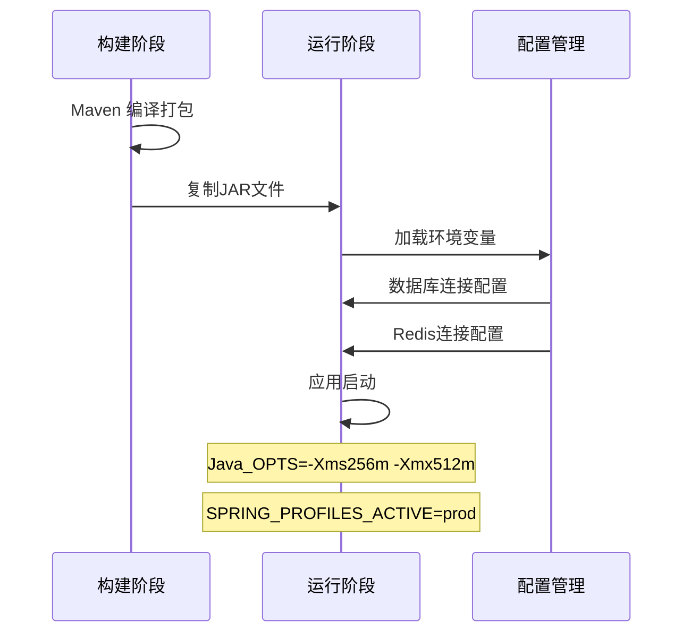
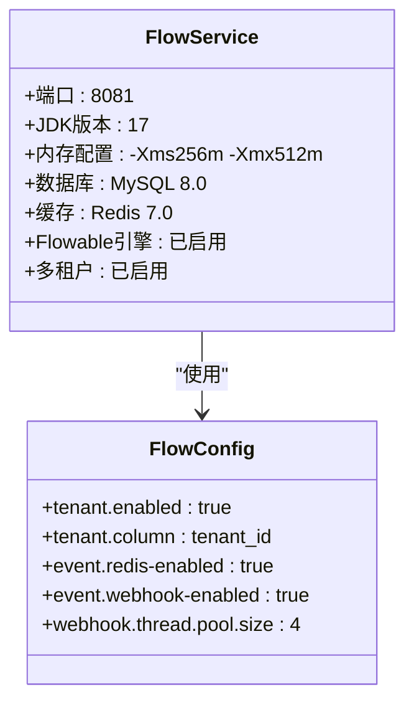
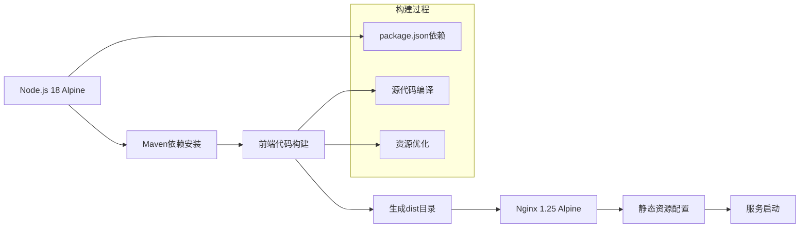
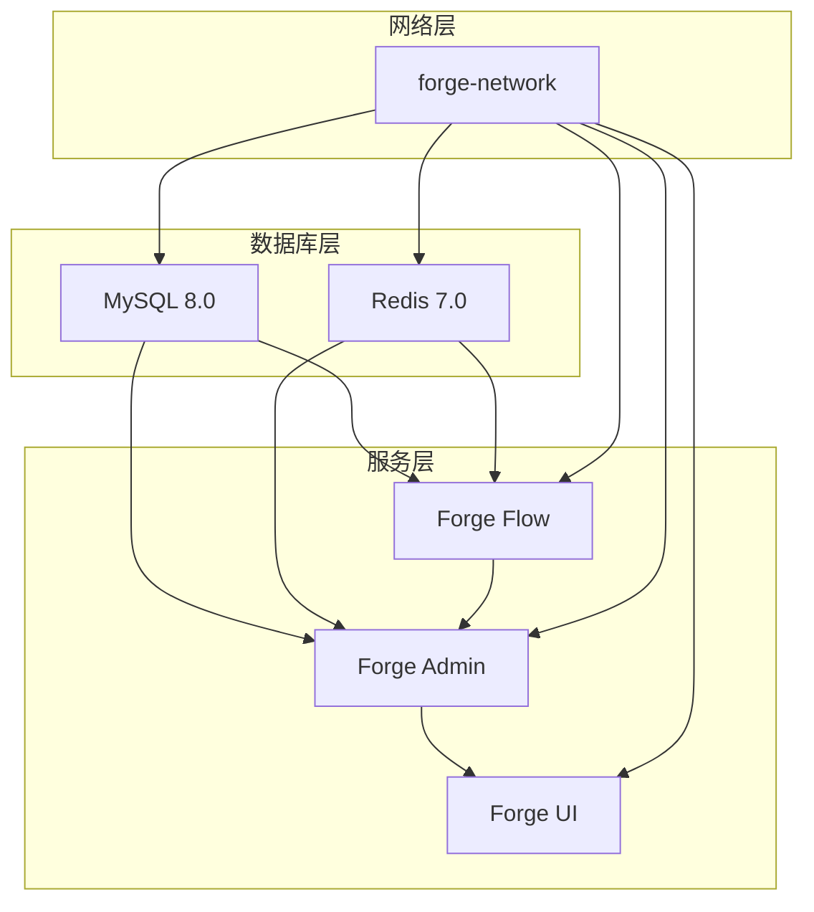
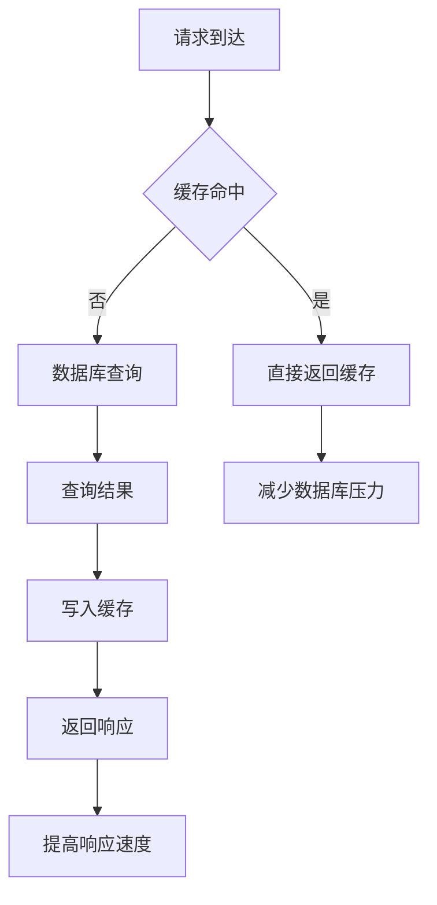

# 容器化部署

<cite>
**本文档引用的文件**
- [docker-compose.yml](file://docker/docker-compose.yml)
- [Dockerfile.admin](file://docker/Dockerfile.admin)
- [Dockerfile.flow](file://docker/Dockerfile.flow)
- [Dockerfile.ui](file://docker/Dockerfile.ui)
- [nginx.conf](file://docker/nginx.conf)
- [.dockerignore](file://.dockerignore)
- [application.yml](file://forge/forge-admin/src/main/resources/application.yml)
- [application.yml](file://forge/forge-flow/src/main/resources/application.yml)
- [application-dev.example.yml](file://forge/forge-admin/src/main/resources/application-dev.example.yml)
- [application-dev.example.yml](file://forge/forge-flow/src/main/resources/application-dev.example.yml)
- [package.json](file://forge-admin-ui/package.json)
- [NGINX_CONFIG.md](file://NGINX_CONFIG.md)
- [README.md](file://README.md)
</cite>

## 目录
1. [简介](#简介)
2. [项目结构](#项目结构)
3. [核心组件](#核心组件)
4. [架构概览](#架构概览)
5. [详细组件分析](#详细组件分析)
6. [依赖关系分析](#依赖关系分析)
7. [性能考虑](#性能考虑)
8. [故障排除指南](#故障排除指南)
9. [结论](#结论)

## 简介

Forge Admin 是一个基于 Vue3 + TypeScript 的企业级中后台管理框架，提供了完整的容器化部署解决方案。该系统采用微内核 + 插件化架构，核心功能通过插件形式存在，便于按需引入和扩展。

本容器化部署方案包含三个核心服务：
- **Forge Admin 后端服务**：Spring Boot 应用，提供主业务逻辑
- **Forge Flow 流程服务**：基于 Flowable 的工作流引擎服务
- **Forge Admin UI 前端服务**：Vue3 前端应用，通过 Nginx 提供静态资源

## 项目结构

项目采用多模块架构，容器化部署主要涉及以下关键目录：



**图表来源**
- [docker-compose.yml:1-154](file://docker/docker-compose.yml#L1-L154)
- [Dockerfile.admin:1-39](file://docker/Dockerfile.admin#L1-L39)
- [Dockerfile.flow:1-37](file://docker/Dockerfile.flow#L1-L37)
- [Dockerfile.ui:1-17](file://docker/Dockerfile.ui#L1-L17)

**章节来源**
- [README.md:136-172](file://README.md#L136-L172)
- [docker-compose.yml:11-154](file://docker/docker-compose.yml#L11-L154)

## 核心组件

### Docker Compose 编排配置

Docker Compose 提供了一键部署的完整编排配置，包含四个核心服务：

| 服务名称 | 端口映射 | 用途 | 依赖关系 |
|---------|----------|------|----------|
| mysql | 3306:3306 | 数据库服务 | - |
| redis | 6379:6379 | 缓存服务 | - |
| forge-flow | 8081:8081 | 流程引擎服务 | mysql, redis |
| forge-admin | 8580:8580 | 主应用服务 | mysql, redis, forge-flow |
| forge-ui | 80:80 | 前端代理服务 | forge-admin, forge-flow |

### 服务健康检查

每个服务都配置了相应的健康检查机制：



**图表来源**
- [docker-compose.yml:33-37](file://docker/docker-compose.yml#L33-L37)
- [docker-compose.yml:53-57](file://docker/docker-compose.yml#L53-L57)

**章节来源**
- [docker-compose.yml:15-154](file://docker/docker-compose.yml#L15-L154)

## 架构概览

系统采用微服务架构，通过 Docker 容器化部署，实现高可用性和可扩展性：



**图表来源**
- [docker-compose.yml:64-137](file://docker/docker-compose.yml#L64-L137)
- [nginx.conf:1-42](file://docker/nginx.conf#L1-L42)

## 详细组件分析

### 后端服务容器化

#### Forge Admin 服务容器化

后端服务采用多阶段构建策略，优化镜像体积和安全性：



**图表来源**
- [Dockerfile.admin:5-39](file://docker/Dockerfile.admin#L5-L39)
- [application.yml:1-102](file://forge/forge-admin/src/main/resources/application.yml#L1-L102)

#### Forge Flow 服务容器化

流程服务容器化配置与后端服务类似，但针对流程引擎进行了专门优化：



**图表来源**
- [Dockerfile.flow:5-37](file://docker/Dockerfile.flow#L5-L37)
- [application.yml:63-79](file://forge/forge-flow/src/main/resources/application.yml#L63-L79)

**章节来源**
- [Dockerfile.admin:1-39](file://docker/Dockerfile.admin#L1-L39)
- [Dockerfile.flow:1-37](file://docker/Dockerfile.flow#L1-L37)

### 前端服务容器化

前端服务采用 Nginx 作为静态资源服务器，提供高性能的静态文件服务：



**图表来源**
- [Dockerfile.ui:5-17](file://docker/Dockerfile.ui#L5-L17)
- [package.json:1-79](file://forge-admin-ui/package.json#L1-L79)

**章节来源**
- [Dockerfile.ui:1-17](file://docker/Dockerfile.ui#L1-L17)

### Nginx 反向代理配置

Nginx 作为统一入口，提供静态资源服务和 API 代理功能：

```mermaid
graph TB
subgraph "Nginx 配置"
A[监听80端口] --> B[静态资源处理]
A --> C[API代理配置]
B --> D[/forge/ 路径]
D --> E[前端静态文件]
C --> F[/forge-api/flow/ 路径]
F --> G[流程服务代理]
C --> H[/forge-api/ 路径]
H --> I[主服务代理]
G --> J[forge-flow:8081]
I --> K[forge-admin:8580]
end
```

**图表来源**
- [nginx.conf:1-42](file://docker/nginx.conf#L1-L42)

**章节来源**
- [nginx.conf:1-42](file://docker/nginx.conf#L1-L42)
- [NGINX_CONFIG.md:7-49](file://NGINX_CONFIG.md#L7-L49)

## 依赖关系分析

### 服务间依赖关系



**图表来源**
- [docker-compose.yml:15-154](file://docker/docker-compose.yml#L15-L154)

### 环境变量配置

系统通过环境变量实现配置管理，支持不同环境的灵活切换：

| 环境变量 | 默认值 | 用途 | 服务范围 |
|---------|--------|------|----------|
| MYSQL_HOST | mysql | MySQL主机 | 所有Java服务 |
| MYSQL_PORT | 3306 | MySQL端口 | 所有Java服务 |
| MYSQL_DB | forge_admin | 数据库名称 | 所有Java服务 |
| MYSQL_USER | root | 用户名 | 所有Java服务 |
| MYSQL_PASSWORD | forge123456 | 密码 | 所有Java服务 |
| REDIS_HOST | redis | Redis主机 | 所有Java服务 |
| REDIS_PORT | 6379 | Redis端口 | 所有Java服务 |
| REDIS_PASSWORD | forge123456 | Redis密码 | 所有Java服务 |
| JAVA_OPTS | -Xms256m -Xmx512m | JVM参数 | 所有Java服务 |
| SPRING_PROFILES_ACTIVE | prod/dev | Spring配置文件 | 所有Java服务 |

**章节来源**
- [Dockerfile.admin:14-38](file://docker/Dockerfile.admin#L14-L38)
- [Dockerfile.flow:14-36](file://docker/Dockerfile.flow#L14-L36)
- [docker-compose.yml:75-116](file://docker/docker-compose.yml#L75-L116)

## 性能考虑

### 内存配置优化

系统采用合理的内存配置，平衡性能和资源占用：

- **JVM堆内存**：最小256MB，最大512MB
- **数据库连接池**：最大20连接，最小10空闲
- **Redis连接池**：64连接池大小，10最小空闲
- **Nginx工作进程**：根据CPU核心数自动配置

### 缓存策略



### 并发处理能力

- **Nginx线程**：IO线程8个，工作线程256个
- **数据库连接**：HikariCP连接池，支持动态扩缩容
- **Redis连接**：Redisson客户端，支持集群模式

## 故障排除指南

### 常见启动问题

#### 1. 数据库连接失败

**症状**：服务启动时报数据库连接异常

**排查步骤**：
1. 检查MySQL容器状态：`docker ps | grep mysql`
2. 验证数据库端口：`telnet localhost 3306`
3. 检查数据库初始化脚本是否正确加载
4. 验证数据库凭据配置

**解决方案**：
- 确认MySQL密码配置正确
- 检查数据库初始化SQL文件路径
- 验证网络连通性

#### 2. Redis连接异常

**症状**：应用启动时报Redis连接失败

**排查步骤**：
1. 检查Redis容器健康状态
2. 验证Redis密码配置
3. 检查Redis端口映射

**解决方案**：
- 确认Redis requirepass配置
- 检查防火墙设置
- 验证Redis持久化配置

#### 3. 前端静态资源404

**症状**：访问前端页面显示404错误

**排查步骤**：
1. 检查Nginx配置文件
2. 验证静态资源目录映射
3. 检查前端构建产物

**解决方案**：
- 确认Nginx alias路径配置
- 验证dist目录构建完整性
- 检查try_files配置

### 性能监控

#### 1. 容器资源监控

```bash
# 查看容器资源使用情况
docker stats

# 查看容器日志
docker logs -f forge-admin

# 查看容器网络连接
docker network inspect forge-network
```

#### 2. 应用性能监控

**后端服务监控指标**：
- JVM内存使用率
- 数据库连接池状态
- Redis连接池状态
- 请求响应时间

**前端服务监控指标**：
- Nginx连接数
- 静态资源加载时间
- 浏览器缓存命中率

**章节来源**
- [docker-compose.yml:33-37](file://docker/docker-compose.yml#L33-L37)
- [docker-compose.yml:53-57](file://docker/docker-compose.yml#L53-L57)

## 结论

Forge Admin 的容器化部署方案提供了完整、可靠的微服务架构实现。通过 Docker Compose 的编排能力和多阶段构建策略，实现了：

### 主要优势

1. **简化部署**：一键启动所有服务，降低部署复杂度
2. **环境一致性**：容器化确保开发、测试、生产环境一致
3. **资源隔离**：服务间相互独立，避免资源冲突
4. **弹性扩展**：支持水平扩展和负载均衡
5. **配置管理**：通过环境变量实现灵活配置

### 最佳实践建议

1. **生产环境优化**
   - 调整JVM内存参数适应生产负载
   - 配置持久化存储卷
   - 设置合理的健康检查间隔
   - 配置SSL证书和HTTPS

2. **监控告警**
   - 部署Prometheus + Grafana监控
   - 配置日志聚合系统
   - 设置关键指标告警阈值
   - 建立故障自动恢复机制

3. **安全加固**
   - 使用只读文件系统
   - 配置网络安全策略
   - 定期更新基础镜像
   - 实施容器镜像安全扫描

该容器化部署方案为Forge Admin 提供了企业级的部署基础，可根据实际业务需求进行进一步定制和优化。