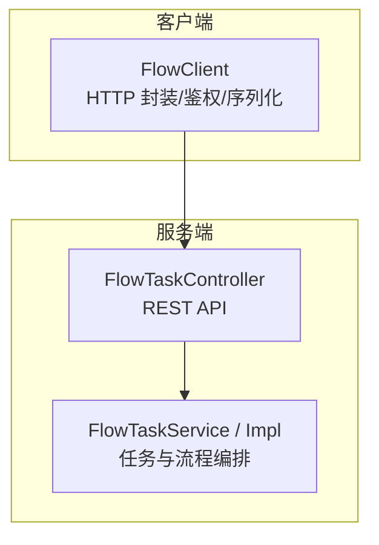
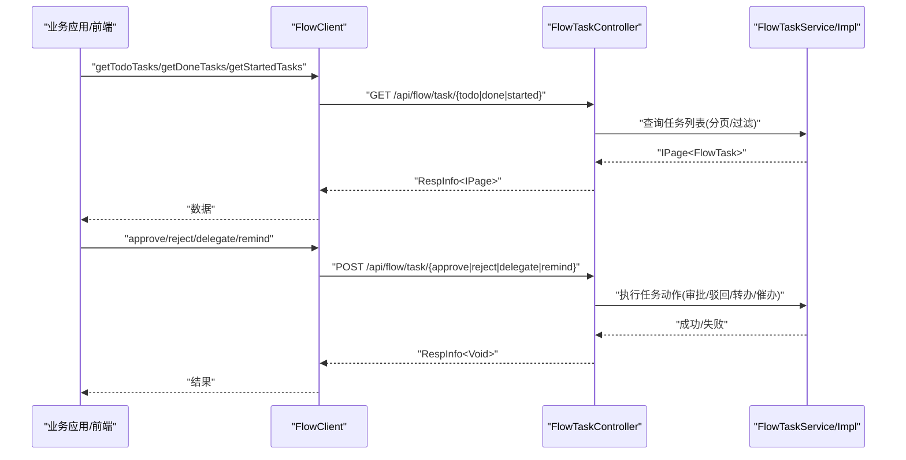
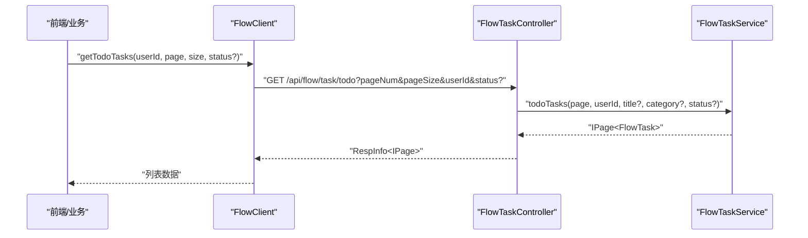
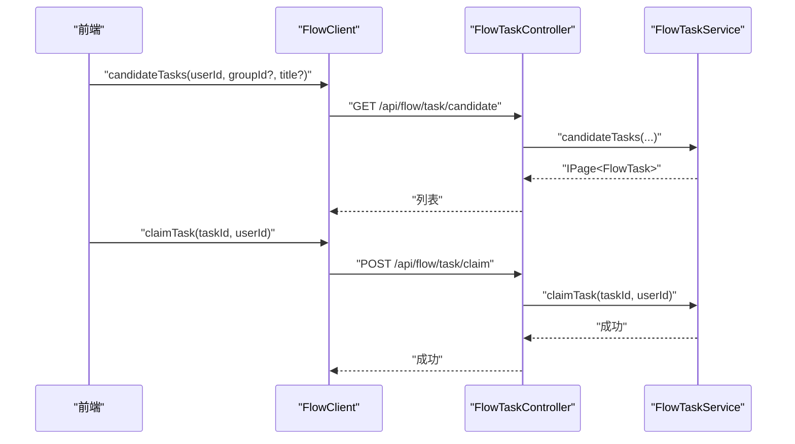
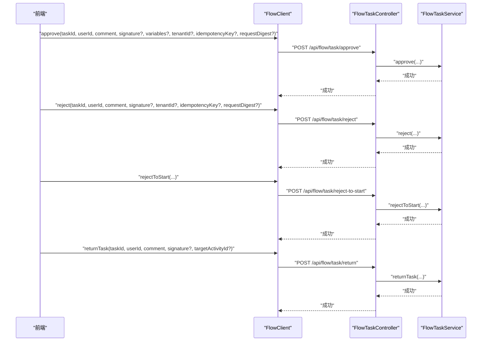
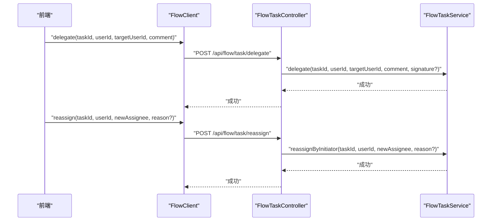
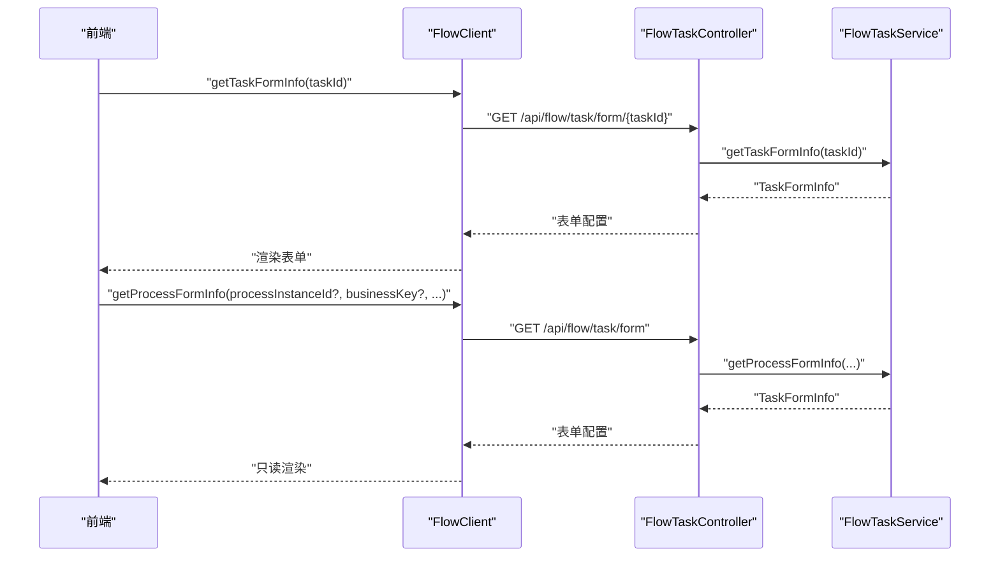
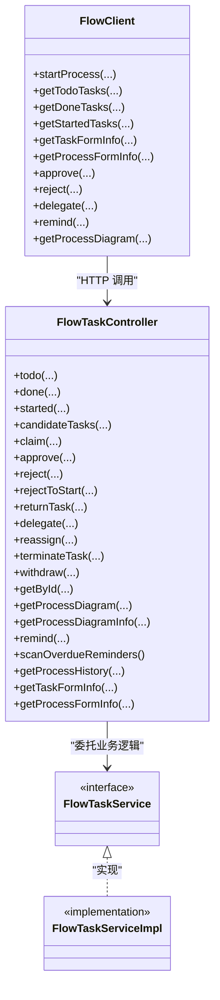

# 任务管理

<cite>
**本文引用的文件**
- [FlowClient.java](file://forge-server/forge-flow/forge-flow-client/src/main/java/com/mdframe/forge/flow/client/FlowClient.java)
- [FlowTaskController.java](file://forge-server/forge-flow/forge-flow-server/src/main/java/com/mdframe/forge/flow/controller/FlowTaskController.java)
- [FlowTaskService.java](file://forge-server/forge-framework/forge-plugin-parent/forge-plugin-flow/src/main/java/com/mdframe/forge/starter/flow/service/FlowTaskService.java)
- [FlowTaskServiceImpl.java](file://forge-server/forge-framework/forge-plugin-parent/forge-plugin-flow/src/main/java/com/mdframe/forge/starter/flow/service/impl/FlowTaskServiceImpl.java)
</cite>

## 目录
1. [简介](#简介)
2. [项目结构](#项目结构)
3. [核心组件](#核心组件)
4. [架构总览](#架构总览)
5. [详细组件分析](#详细组件分析)
6. [依赖关系分析](#依赖关系分析)
7. [性能考虑](#性能考虑)
8. [故障排查指南](#故障排查指南)
9. [结论](#结论)
10. [附录](#附录)

## 简介
本技术文档面向 Forge Admin 的任务管理系统，聚焦待办、已办与历史任务的查询与管理能力，深入说明任务分配策略、候选人组管理、任务委派与转交机制，并覆盖表单渲染、审批操作、驳回处理、加签（签名）与通知、批量操作及权限控制的实现要点。文档以代码为依据，提供端到端调用链路与关键流程的可视化图示，帮助开发者快速理解与扩展任务管理能力。

## 项目结构
任务管理由“客户端 SDK + 服务端控制器 + 服务层”三部分构成：
- 客户端 SDK：对外暴露统一方法，封装 HTTP 调用、鉴权头注入、序列化与异常包装。
- 服务端控制器：定义 REST API，负责参数校验、身份解析、租户隔离与业务编排。
- 服务层：承载任务查询、流转、表单信息组装、流程图生成、提醒与审计等核心逻辑。

图表来源
- [FlowClient.java:34-60](file://forge-server/forge-flow/forge-flow-client/src/main/java/com/mdframe/forge/flow/client/FlowClient.java#L34-L60)
- [FlowTaskController.java:35-44](file://forge-server/forge-flow/forge-flow-server/src/main/java/com/mdframe/forge/flow/controller/FlowTaskController.java#L35-L44)

章节来源
- [FlowClient.java:34-60](file://forge-server/forge-flow/forge-flow-client/src/main/java/com/mdframe/forge/flow/client/FlowClient.java#L34-L60)
- [FlowTaskController.java:35-44](file://forge-server/forge-flow/forge-flow-server/src/main/java/com/mdframe/forge/flow/controller/FlowTaskController.java#L35-L44)

## 核心组件
- FlowClient：统一的流程服务客户端，提供发起流程、任务查询、审批、驳回、退回、转办、催办、获取表单与流程图等方法；内置请求头构建、Token 动态注入、JSON 序列化与异常包装。
- FlowTaskController：任务相关 REST 接口，包括我的待办/已办/我发起的流程、候选任务、签收、审批通过/驳回/退回/改派/终结/撤回、流程图、表单信息与历史等。
- FlowTaskService/Impl：任务与服务编排的核心实现，承接控制器的动作，完成任务状态变更、变量更新、表单信息装配、流程图生成、逾期提醒扫描与审计记录等。

章节来源
- [FlowClient.java:73-461](file://forge-server/forge-flow/forge-flow-client/src/main/java/com/mdframe/forge/flow/client/FlowClient.java#L73-L461)
- [FlowTaskController.java:46-371](file://forge-server/forge-flow/forge-flow-server/src/main/java/com/mdframe/forge/flow/controller/FlowTaskController.java#L46-L371)
- [FlowTaskService.java](file://forge-server/forge-framework/forge-plugin-parent/forge-plugin-flow/src/main/java/com/mdframe/forge/starter/flow/service/FlowTaskService.java)
- [FlowTaskServiceImpl.java](file://forge-server/forge-framework/forge-plugin-parent/forge-plugin-flow/src/main/java/com/mdframe/forge/starter/flow/service/impl/FlowTaskServiceImpl.java)

## 架构总览
下图展示从前端或业务系统到任务服务的完整调用链路，涵盖鉴权、任务查询与审批执行的关键路径。

图表来源
- [FlowClient.java:221-439](file://forge-server/forge-flow/forge-flow-client/src/main/java/com/mdframe/forge/flow/client/FlowClient.java#L221-L439)
- [FlowTaskController.java:46-324](file://forge-server/forge-flow/forge-flow-server/src/main/java/com/mdframe/forge/flow/controller/FlowTaskController.java#L46-L324)

## 详细组件分析

### 任务查询（待办/已办/我发起的流程）
- 能力概述
  - 支持按用户、标题、分类、状态进行分页查询。
  - 支持“候选任务”查询，用于未签收的多人协作场景。
- 关键路径
  - 客户端：getTodoTasks/getDoneTasks/getStartedTasks/candidateTasks
  - 服务端：FlowTaskController 对应 GET 接口，内部委托 FlowTaskService 完成查询。
- 数据模型
  - 返回 IPage<FlowTask>，包含任务基本信息与上下文。
- 权限与租户
  - 使用 FlowSessionIdentity 解析可信用户 ID。
  - 控制器对写操作进行租户校验，读操作默认忽略租户限制（注解）。

图表来源
- [FlowClient.java:221-269](file://forge-server/forge-flow/forge-flow-client/src/main/java/com/mdframe/forge/flow/client/FlowClient.java#L221-L269)
- [FlowTaskController.java:46-111](file://forge-server/forge-flow/forge-flow-server/src/main/java/com/mdframe/forge/flow/controller/FlowTaskController.java#L46-L111)

章节来源
- [FlowClient.java:221-269](file://forge-server/forge-flow/forge-flow-client/src/main/java/com/mdframe/forge/flow/client/FlowClient.java#L221-L269)
- [FlowTaskController.java:46-111](file://forge-server/forge-flow/forge-flow-server/src/main/java/com/mdframe/forge/flow/controller/FlowTaskController.java#L46-L111)

### 任务签收与候选组管理
- 能力概述
  - 支持将“候选任务”签收为当前用户的专属任务，便于多人协作与责任明确。
  - 候选任务查询支持按用户与分组过滤。
- 关键路径
  - 客户端：claimTask
  - 服务端：FlowTaskController.claim -> FlowTaskService.claimTask
- 使用建议
  - 在多人协作节点前，先查询 candidate 列表，再选择签收。
  - 签收后可继续执行审批或转交。

图表来源
- [FlowClient.java:307-313](file://forge-server/forge-flow/forge-flow-client/src/main/java/com/mdframe/forge/flow/client/FlowClient.java#L307-L313)
- [FlowTaskController.java:97-121](file://forge-server/forge-flow/forge-flow-server/src/main/java/com/mdframe/forge/flow/controller/FlowTaskController.java#L97-L121)

章节来源
- [FlowClient.java:307-313](file://forge-server/forge-flow/forge-flow-client/src/main/java/com/mdframe/forge/flow/client/FlowClient.java#L307-L313)
- [FlowTaskController.java:97-121](file://forge-server/forge-flow/forge-flow-server/src/main/java/com/mdframe/forge/flow/controller/FlowTaskController.java#L97-L121)

### 审批通过、驳回与退回
- 能力概述
  - 审批通过：提交意见、可选签名、附加变量、幂等键与请求摘要。
  - 驳回：支持普通驳回与“驳回至发起人修改路径”。
  - 退回：可退回上一节点或指定目标活动节点。
- 关键路径
  - 客户端：approve/reject/rejectToStart/returnTask
  - 服务端：FlowTaskController.approve/reject/rejectToStart/returnTask -> FlowTaskService.*
- 安全与幂等
  - 支持 signature（加签）、idempotencyKey（幂等键）、requestDigest（请求摘要）增强安全性与防重放。
  - 租户校验：写操作强制校验会话租户与请求租户一致。

图表来源
- [FlowClient.java:315-409](file://forge-server/forge-flow/forge-flow-client/src/main/java/com/mdframe/forge/flow/client/FlowClient.java#L315-L409)
- [FlowTaskController.java:123-223](file://forge-server/forge-flow/forge-flow-server/src/main/java/com/mdframe/forge/flow/controller/FlowTaskController.java#L123-L223)

章节来源
- [FlowClient.java:315-409](file://forge-server/forge-flow/forge-flow-client/src/main/java/com/mdframe/forge/flow/client/FlowClient.java#L315-L409)
- [FlowTaskController.java:123-223](file://forge-server/forge-flow/forge-flow-server/src/main/java/com/mdframe/forge/flow/controller/FlowTaskController.java#L123-L223)

### 任务委派与转交
- 能力概述
  - 委派：将任务临时交由他人处理，保留原任务上下文。
  - 转交/改派：将任务直接转移给新处理人，适用于发起人或拥有人改派。
- 关键路径
  - 客户端：delegate
  - 服务端：FlowTaskController.delegate/reassign -> FlowTaskService.delegate/reassignByInitiator
- 使用建议
  - 委派适合临时代理；改派适合所有权转移。
  - 均支持签名与备注，便于审计。

图表来源
- [FlowClient.java:411-427](file://forge-server/forge-flow/forge-flow-client/src/main/java/com/mdframe/forge/flow/client/FlowClient.java#L411-L427)
- [FlowTaskController.java:190-241](file://forge-server/forge-flow/forge-flow-server/src/main/java/com/mdframe/forge/flow/controller/FlowTaskController.java#L190-L241)

章节来源
- [FlowClient.java:411-427](file://forge-server/forge-flow/forge-flow-client/src/main/java/com/mdframe/forge/flow/client/FlowClient.java#L411-L427)
- [FlowTaskController.java:190-241](file://forge-server/forge-flow/forge-flow-server/src/main/java/com/mdframe/forge/flow/controller/FlowTaskController.java#L190-L241)

### 任务表单渲染与只读查看
- 能力概述
  - 运行中任务：通过 taskId 获取 TaskFormInfo，包含 formKey/formUrl/字段权限等，用于渲染可编辑表单。
  - 只读场景：通过 processInstanceId/businessKey/processDefKey/taskId/taskDefKey 组合获取关联表单信息，适用于已办、抄送、历史查看。
- 关键路径
  - 客户端：getTaskFormInfo/getProcessFormInfo
  - 服务端：FlowTaskController.form/{taskId} 与 /form
- 使用建议
  - 仅读场景优先使用 getProcessFormInfo，避免强依赖运行态任务。
  - 根据返回的字段权限动态控制表单可见性与可编辑性。

图表来源
- [FlowClient.java:279-302](file://forge-server/forge-flow/forge-flow-client/src/main/java/com/mdframe/forge/flow/client/FlowClient.java#L279-L302)
- [FlowTaskController.java:346-371](file://forge-server/forge-flow/forge-flow-server/src/main/java/com/mdframe/forge/flow/controller/FlowTaskController.java#L346-L371)

章节来源
- [FlowClient.java:279-302](file://forge-server/forge-flow/forge-flow-client/src/main/java/com/mdframe/forge/flow/client/FlowClient.java#L279-L302)
- [FlowTaskController.java:346-371](file://forge-server/forge-flow/forge-flow-server/src/main/java/com/mdframe/forge/flow/controller/FlowTaskController.java#L346-L371)

### 流程图与审批历史
- 能力概述
  - 流程图：支持 PNG 图片流与结构化信息（含节点详情），便于高亮当前节点与交互展示。
  - 审批历史：按时间顺序返回发起、审批、驳回、转办等操作记录。
- 关键路径
  - 客户端：getProcessDiagram
  - 服务端：FlowTaskController.diagram/{processInstanceId}、diagram-info/{processInstanceId}、history/{processInstanceId}

章节来源
- [FlowClient.java:451-461](file://forge-server/forge-flow/forge-flow-client/src/main/java/com/mdframe/forge/flow/client/FlowClient.java#L451-L461)
- [FlowTaskController.java:282-344](file://forge-server/forge-flow/forge-flow-server/src/main/java/com/mdframe/forge/flow/controller/FlowTaskController.java#L282-L344)

### 任务通知与逾期提醒
- 能力概述
  - 催办：对指定任务触发提醒。
  - 逾期提醒：支持手动触发扫描，结合后台定时任务实现自动提醒。
- 关键路径
  - 客户端：remind
  - 服务端：FlowTaskController.remind、overdue-reminder/scan

章节来源
- [FlowClient.java:431-439](file://forge-server/forge-flow/forge-flow-client/src/main/java/com/mdframe/forge/flow/client/FlowClient.java#L431-L439)
- [FlowTaskController.java:317-333](file://forge-server/forge-flow/forge-flow-server/src/main/java/com/mdframe/forge/flow/controller/FlowTaskController.java#L317-L333)

### 批量操作与事务边界
- 能力概述
  - 当前任务 API 以单任务为单位设计，批量操作可在上层聚合多次调用。
  - 若需跨多个任务的原子性，应在业务侧组织事务或使用消息/补偿机制。
- 建议
  - 对高频批量操作，采用分批提交与重试策略，降低单次请求压力。
  - 利用幂等键与请求摘要防止重复提交。

章节来源
- [FlowTaskController.java:123-241](file://forge-server/forge-flow/forge-flow-server/src/main/java/com/mdframe/forge/flow/controller/FlowTaskController.java#L123-L241)

### 权限控制与安全
- 能力概述
  - 认证与授权：通过 FlowSessionIdentity 解析可信用户；部分接口标注权限忽略，由网关或前置鉴权保障。
  - 租户隔离：写操作强制校验会话租户与请求租户一致，防止越权。
  - 安全增强：支持 signature、idempotencyKey、requestDigest 提升抗重放与一致性。
- 建议
  - 所有写操作务必携带租户与幂等键。
  - 敏感操作启用签名校验，确保请求完整性。

章节来源
- [FlowTaskController.java:123-176](file://forge-server/forge-flow/forge-flow-server/src/main/java/com/mdframe/forge/flow/controller/FlowTaskController.java#L123-L176)

## 依赖关系分析

图表来源
- [FlowClient.java:73-461](file://forge-server/forge-flow/forge-flow-client/src/main/java/com/mdframe/forge/flow/client/FlowClient.java#L73-L461)
- [FlowTaskController.java:46-371](file://forge-server/forge-flow/forge-flow-server/src/main/java/com/mdframe/forge/flow/controller/FlowTaskController.java#L46-L371)
- [FlowTaskService.java](file://forge-server/forge-framework/forge-plugin-parent/forge-plugin-flow/src/main/java/com/mdframe/forge/starter/flow/service/FlowTaskService.java)
- [FlowTaskServiceImpl.java](file://forge-server/forge-framework/forge-plugin-parent/forge-plugin-flow/src/main/java/com/mdframe/forge/starter/flow/service/impl/FlowTaskServiceImpl.java)

章节来源
- [FlowClient.java:73-461](file://forge-server/forge-flow/forge-flow-client/src/main/java/com/mdframe/forge/flow/client/FlowClient.java#L73-L461)
- [FlowTaskController.java:46-371](file://forge-server/forge-flow/forge-flow-server/src/main/java/com/mdframe/forge/flow/controller/FlowTaskController.java#L46-L371)

## 性能考虑
- 分页与过滤：充分利用 pageNum/pageSize 与可选过滤条件，减少不必要的数据传输。
- 缓存与只读：对于频繁读取的表单配置与流程图，可在上层做短期缓存。
- 批量优化：将多次小请求合并为批次，或在服务端提供批量接口（如需）。
- 超时与重试：客户端应设置合理的超时与重试策略，避免雪崩。
- 异步化：对耗时操作（如流程图生成、提醒扫描）建议异步执行。

[本节为通用指导，不直接分析具体文件]

## 故障排查指南
- 空响应体错误
  - 现象：客户端抛出“调用流程服务返回空响应体”异常。
  - 排查：检查服务端日志、网络连通性与鉴权头是否正确传递。
- 租户不一致
  - 现象：写操作报租户不匹配。
  - 排查：确认会话租户与请求租户一致，必要时调整上游传参。
- 权限不足
  - 现象：接口被拒绝。
  - 排查：确认用户具备相应权限或接口是否允许匿名访问。
- 流程图缺失
  - 现象：流程图接口返回空。
  - 排查：确认流程实例是否存在且已部署模型。

章节来源
- [FlowClient.java:549-599](file://forge-server/forge-flow/forge-flow-client/src/main/java/com/mdframe/forge/flow/client/FlowClient.java#L549-L599)
- [FlowTaskController.java:167-176](file://forge-server/forge-flow/forge-flow-server/src/main/java/com/mdframe/forge/flow/controller/FlowTaskController.java#L167-L176)
- [FlowTaskController.java:282-315](file://forge-server/forge-flow/forge-flow-server/src/main/java/com/mdframe/forge/flow/controller/FlowTaskController.java#L282-L315)

## 结论
Forge Admin 任务管理系统通过清晰的客户端 SDK 与稳健的服务端控制器/服务层，提供了完整的任务查询、流转、表单渲染与可视化能力。借助候选人组、委派与转交机制，满足复杂协作场景；通过签名、幂等与租户校验，保障安全与一致性。建议在业务侧结合分页、缓存与异步化策略，进一步提升性能与用户体验。

[本节为总结性内容，不直接分析具体文件]

## 附录
- 常用接口速查
  - 任务查询：/api/flow/task/todo、/api/flow/task/done、/api/flow/task/started、/api/flow/task/candidate
  - 任务操作：/api/flow/task/claim、/api/flow/task/approve、/api/flow/task/reject、/api/flow/task/reject-to-start、/api/flow/task/return、/api/flow/task/delegate、/api/flow/task/reassign、/api/flow/task/terminate、/api/flow/task/withdraw、/api/flow/task/remind
  - 表单与视图：/api/flow/task/form/{taskId}、/api/flow/task/form、/api/flow/task/diagram/{processInstanceId}、/api/flow/task/diagram-info/{processInstanceId}、/api/flow/task/history/{processInstanceId}

[本节为参考信息，不直接分析具体文件]