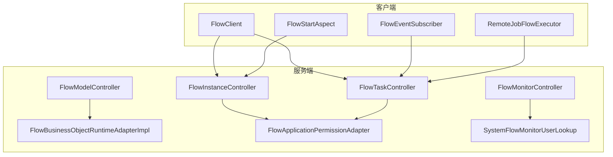
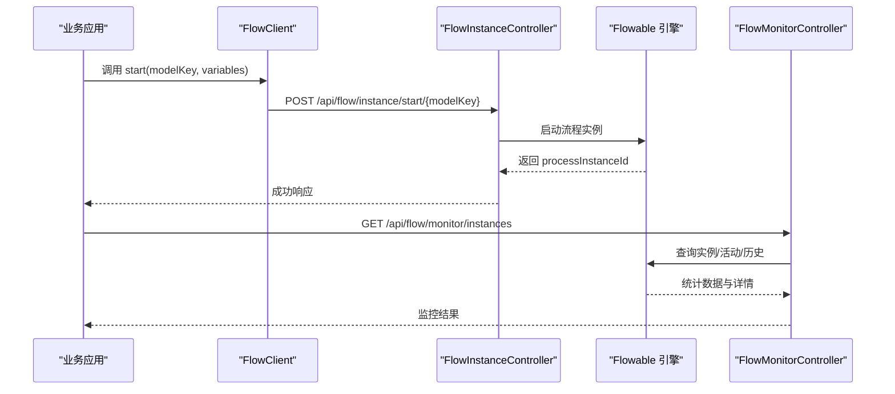
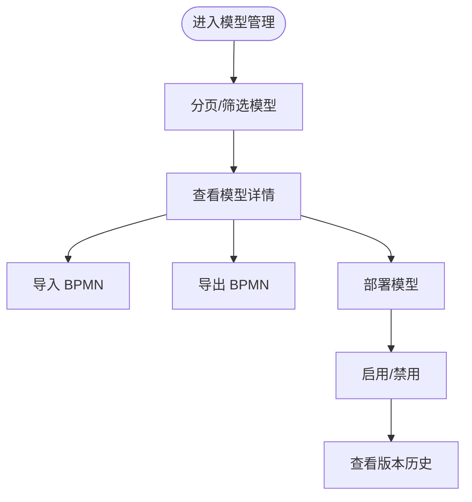
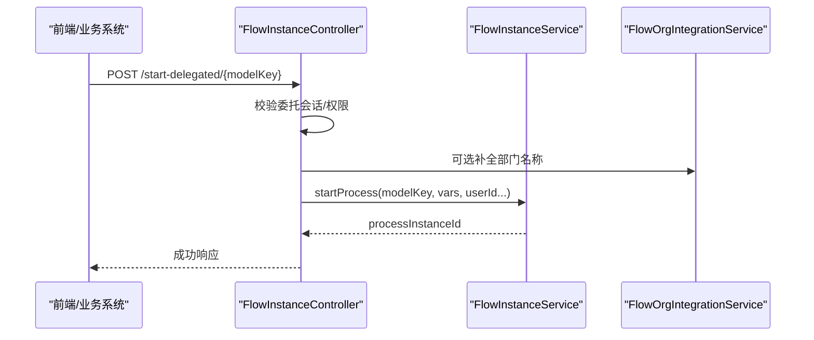
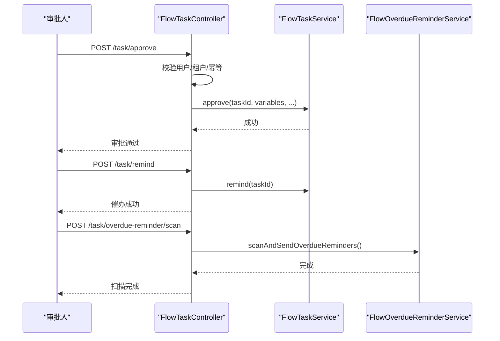
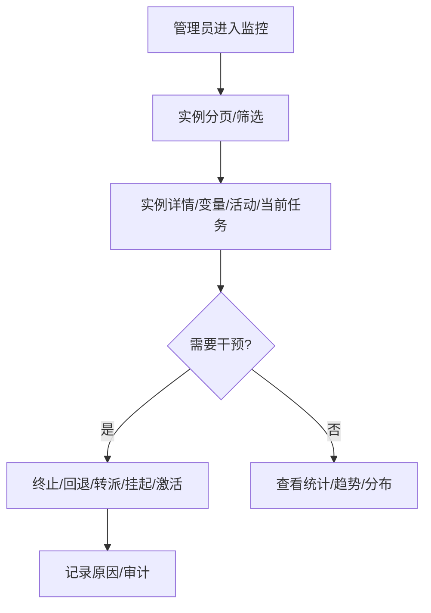
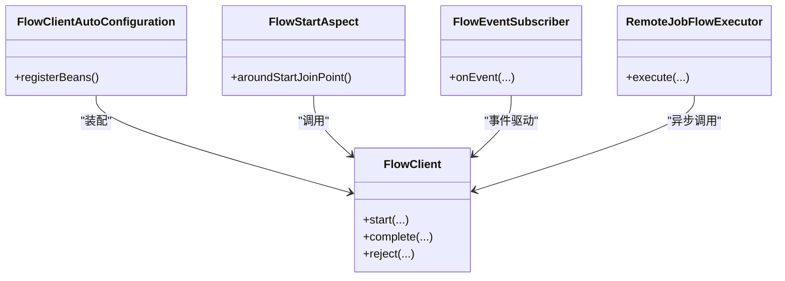
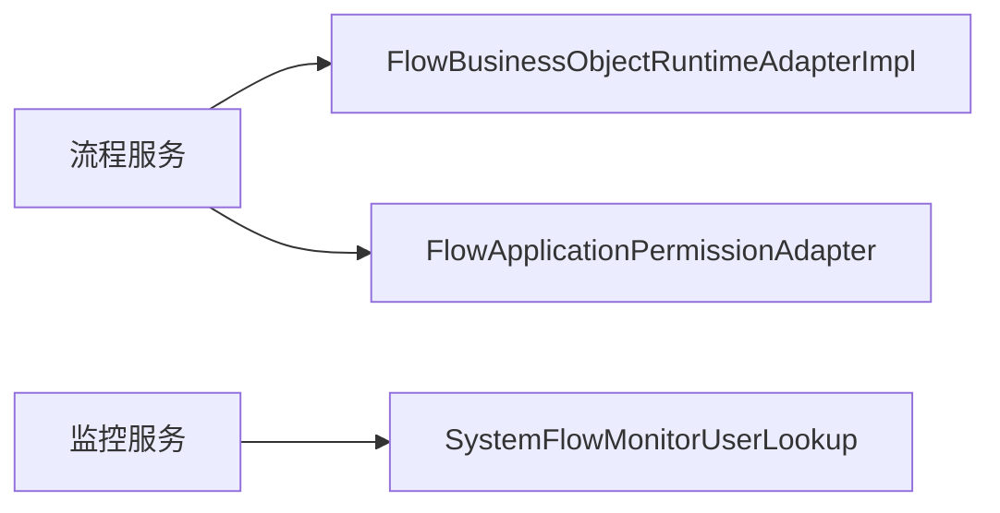
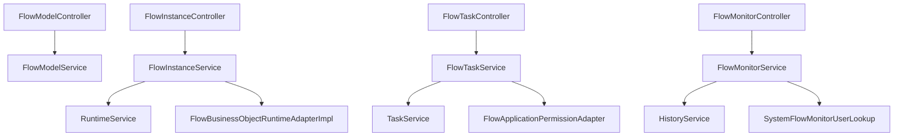

# 工作流引擎

<cite>
**本文引用的文件**
- [FlowInstanceController.java](file://forge-server/forge-flow/forge-flow-server/src/main/java/com/mdframe/forge/flow/controller/FlowInstanceController.java)
- [FlowTaskController.java](file://forge-server/forge-flow/forge-flow-server/src/main/java/com/mdframe/forge/flow/controller/FlowTaskController.java)
- [FlowModelController.java](file://forge-server/forge-flow/forge-flow-server/src/main/java/com/mdframe/forge/flow/controller/FlowModelController.java)
- [FlowMonitorController.java](file://forge-server/forge-flow/forge-flow-server/src/main/java/com/mdframe/forge/flow/controller/FlowMonitorController.java)
- [FlowClient.java](file://forge-server/forge-flow/forge-flow-client/src/main/java/com/mdframe/forge/flow/client/FlowClient.java)
- [FlowClientAutoConfiguration.java](file://forge-server/forge-flow/forge-flow-client/src/main/java/com/mdframe/forge/flow/client/FlowClientAutoConfiguration.java)
- [FlowStartAspect.java](file://forge-server/forge-flow/forge-flow-client/src/main/java/com/mdframe/forge/flow/client/helper/FlowStartAspect.java)
- [FlowEventSubscriber.java](file://forge-server/forge-flow/forge-flow-client/src/main/java/com/mdframe/forge/flow/client/helper/FlowEventSubscriber.java)
- [RemoteJobFlowExecutor.java](file://forge-server/forge-flow/forge-flow-client/src/main/java/com/mdframe/forge/flow/client/job/RemoteJobFlowExecutor.java)
- [FlowBusinessObjectRuntimeAdapterImpl.java](file://forge-server/forge-flow/forge-flow-server/src/main/java/com/mdframe/forge/flow/bridge/FlowBusinessObjectRuntimeAdapterImpl.java)
- [FlowApplicationPermissionAdapter.java](file://forge-server/forge-flow/forge-flow-server/src/main/java/com/mdframe/forge/flow/bridge/FlowApplicationPermissionAdapter.java)
- [SystemFlowMonitorUserLookup.java](file://forge-server/forge-flow/forge-flow-server/src/main/java/com/mdframe/forge/flow/bridge/SystemFlowMonitorUserLookup.java)
</cite>

## 目录
1. [简介](#简介)
2. [项目结构](#项目结构)
3. [核心组件](#核心组件)
4. [架构总览](#架构总览)
5. [详细组件分析](#详细组件分析)
6. [依赖关系分析](#依赖关系分析)
7. [性能考虑](#性能考虑)
8. [故障排查指南](#故障排查指南)
9. [结论](#结论)
10. [附录](#附录)

## 简介
本技术文档面向 Forge Admin 工作流引擎，围绕 Flowable 引擎集成、BPMN 流程设计器、审批任务管理与流程监控追踪四大能力展开。文档深入说明流程定义管理、任务分配策略、条件分支处理与事件监听机制；覆盖流程实例生命周期、历史数据查询与性能优化策略；并提供流程设计示例、API 接口清单与集成开发指南，帮助开发者快速上手并高效扩展。

## 项目结构
Forge 的工作流能力以“服务端 + 客户端”双模块组织：
- 服务端（forge-flow-server）：提供流程模型管理、实例启动/终止、任务操作、监控统计等 REST API，并桥接业务对象、权限、菜单与系统用户查找等能力。
- 客户端（forge-flow-client）：为业务应用提供轻量级 FlowClient 调用封装，支持注解式启动、事件订阅、远程作业执行等。

图表来源
- [FlowClient.java:1-200](file://forge-server/forge-flow/forge-flow-client/src/main/java/com/mdframe/forge/flow/client/FlowClient.java#L1-L200)
- [FlowStartAspect.java:1-200](file://forge-server/forge-flow/forge-flow-client/src/main/java/com/mdframe/forge/flow/client/helper/FlowStartAspect.java#L1-L200)
- [FlowEventSubscriber.java:1-200](file://forge-server/forge-flow/forge-flow-client/src/main/java/com/mdframe/forge/flow/client/helper/FlowEventSubscriber.java#L1-L200)
- [RemoteJobFlowExecutor.java:1-200](file://forge-server/forge-flow/forge-flow-client/src/main/java/com/mdframe/forge/flow/client/job/RemoteJobFlowExecutor.java#L1-L200)
- [FlowModelController.java:1-233](file://forge-server/forge-flow/forge-flow-server/src/main/java/com/mdframe/forge/flow/controller/FlowModelController.java#L1-L233)
- [FlowInstanceController.java:1-240](file://forge-server/forge-flow/forge-flow-server/src/main/java/com/mdframe/forge/flow/controller/FlowInstanceController.java#L1-L240)
- [FlowTaskController.java:1-373](file://forge-server/forge-flow/forge-flow-server/src/main/java/com/mdframe/forge/flow/controller/FlowTaskController.java#L1-L373)
- [FlowMonitorController.java:1-403](file://forge-server/forge-flow/forge-flow-server/src/main/java/com/mdframe/forge/flow/controller/FlowMonitorController.java#L1-L403)
- [FlowBusinessObjectRuntimeAdapterImpl.java:1-200](file://forge-server/forge-flow/forge-flow-server/src/main/java/com/mdframe/forge/flow/bridge/FlowBusinessObjectRuntimeAdapterImpl.java#L1-L200)
- [FlowApplicationPermissionAdapter.java:1-200](file://forge-server/forge-flow/forge-flow-server/src/main/java/com/mdframe/forge/flow/bridge/FlowApplicationPermissionAdapter.java#L1-L200)
- [SystemFlowMonitorUserLookup.java:1-200](file://forge-server/forge-flow/forge-flow-server/src/main/java/com/mdframe/forge/flow/bridge/SystemFlowMonitorUserLookup.java#L1-L200)

章节来源
- [FlowModelController.java:1-233](file://forge-server/forge-flow/forge-flow-server/src/main/java/com/mdframe/forge/flow/controller/FlowModelController.java#L1-L233)
- [FlowInstanceController.java:1-240](file://forge-server/forge-flow/forge-flow-server/src/main/java/com/mdframe/forge/flow/controller/FlowInstanceController.java#L1-L240)
- [FlowTaskController.java:1-373](file://forge-server/forge-flow/forge-flow-server/src/main/java/com/mdframe/forge/flow/controller/FlowTaskController.java#L1-L373)
- [FlowMonitorController.java:1-403](file://forge-server/forge-flow/forge-flow-server/src/main/java/com/mdframe/forge/flow/controller/FlowMonitorController.java#L1-L403)

## 核心组件
- 流程模型管理：提供模型的创建、导入/导出、版本管理、启用/禁用、部署等操作，支撑 BPMN 设计器与发布流程。
- 流程实例管理：统一入口发起流程、查询状态、更新变量、终止或删除实例，支持委托身份发起。
- 任务管理：待办/已办/候选任务列表，签收、审批通过/驳回、退回、转办、改派、撤回、终结、催办、流程图与表单信息获取。
- 监控与审计：管理员视角的实例分页、详情、变量、活动节点、当前任务、趋势与分布统计，以及挂起/激活/回退/转派/清理等运维能力。
- 客户端 SDK：FlowClient 及自动装配、AOP 启动增强、事件订阅、远程作业执行，简化业务系统集成。

章节来源
- [FlowModelController.java:1-233](file://forge-server/forge-flow/forge-flow-server/src/main/java/com/mdframe/forge/flow/controller/FlowModelController.java#L1-L233)
- [FlowInstanceController.java:1-240](file://forge-server/forge-flow/forge-flow-server/src/main/java/com/mdframe/forge/flow/controller/FlowInstanceController.java#L1-L240)
- [FlowTaskController.java:1-373](file://forge-server/forge-flow/forge-flow-server/src/main/java/com/mdframe/forge/flow/controller/FlowTaskController.java#L1-L373)
- [FlowMonitorController.java:1-403](file://forge-server/forge-flow/forge-flow-server/src/main/java/com/mdframe/forge/flow/controller/FlowMonitorController.java#L1-L403)
- [FlowClient.java:1-200](file://forge-server/forge-flow/forge-flow-client/src/main/java/com/mdframe/forge/flow/client/FlowClient.java#L1-L200)
- [FlowClientAutoConfiguration.java:1-200](file://forge-server/forge-flow/forge-flow-client/src/main/java/com/mdframe/forge/flow/client/FlowClientAutoConfiguration.java#L1-L200)
- [FlowStartAspect.java:1-200](file://forge-server/forge-flow/forge-flow-client/src/main/java/com/mdframe/forge/flow/client/helper/FlowStartAspect.java#L1-L200)
- [FlowEventSubscriber.java:1-200](file://forge-server/forge-flow/forge-flow-client/src/main/java/com/mdframe/forge/flow/client/helper/FlowEventSubscriber.java#L1-L200)
- [RemoteJobFlowExecutor.java:1-200](file://forge-server/forge-flow/forge-flow-client/src/main/java/com/mdframe/forge/flow/client/job/RemoteJobFlowExecutor.java#L1-L200)

## 架构总览
工作流引擎采用“控制器-服务-引擎/适配器”的分层架构：
- 控制器层：暴露 REST API，负责参数校验、安全控制、租户隔离与响应封装。
- 服务层：封装业务流程编排、权限校验、业务对象运行时适配、监控与历史查询。
- 引擎与适配器：基于 Flowable 的 RuntimeService、TaskService、HistoryService 进行流程运行与历史访问；通过桥接适配器对接业务对象、应用权限、菜单注册与系统用户查找。

图表来源
- [FlowInstanceController.java:44-145](file://forge-server/forge-flow/forge-flow-server/src/main/java/com/mdframe/forge/flow/controller/FlowInstanceController.java#L44-L145)
- [FlowMonitorController.java:57-92](file://forge-server/forge-flow/forge-flow-server/src/main/java/com/mdframe/forge/flow/controller/FlowMonitorController.java#L57-L92)
- [FlowClient.java:1-200](file://forge-server/forge-flow/forge-flow-client/src/main/java/com/mdframe/forge/flow/client/FlowClient.java#L1-L200)

## 详细组件分析

### 流程模型管理（FlowModelController）
- 功能要点
  - 分页查询、启用列表、状态统计、详情与 Key 查询。
  - 创建/更新/删除、导入/导出 BPMN XML、复制模型。
  - 部署、启用/禁用、挂起/激活模型，版本历史查看。
- 关键路径
  - 导入/导出：用于与设计器联动，实现可视化建模与版本化发布。
  - 启用/禁用：控制模型是否可被新实例使用。
  - 部署：将模型发布到 Flowable 引擎供运行期使用。

图表来源
- [FlowModelController.java:33-233](file://forge-server/forge-flow/forge-flow-server/src/main/java/com/mdframe/forge/flow/controller/FlowModelController.java#L33-L233)

章节来源
- [FlowModelController.java:1-233](file://forge-server/forge-flow/forge-flow-server/src/main/java/com/mdframe/forge/flow/controller/FlowModelController.java#L1-L233)

### 流程实例管理（FlowInstanceController）
- 功能要点
  - 发起流程：支持普通发起与委托身份发起（含高风险审批专用入口）。
  - 状态查询、变量读写、终止与删除。
  - 分页查询与按实例 ID 获取详情。
- 关键逻辑
  - 发起人、租户、组织信息从 Session 或可信委托中解析。
  - businessKey/title/businessType 缺失时自动生成或默认填充。
  - 通过 FlowInstanceService 完成实际启动。

图表来源
- [FlowInstanceController.java:54-145](file://forge-server/forge-flow/forge-flow-server/src/main/java/com/mdframe/forge/flow/controller/FlowInstanceController.java#L54-L145)

章节来源
- [FlowInstanceController.java:1-240](file://forge-server/forge-flow/forge-flow-server/src/main/java/com/mdframe/forge/flow/controller/FlowInstanceController.java#L1-L240)

### 任务管理（FlowTaskController）
- 功能要点
  - 我的待办/已办/我发起的、候选任务分页查询。
  - 签收、审批通过/驳回、退回、转办、改派、撤回、终结、催办。
  - 获取任务详情、流程图（PNG）、流程图信息（含节点）、任务表单信息与流程表单信息。
  - 逾期提醒扫描触发。
- 关键逻辑
  - 所有写操作均通过 FlowSessionIdentity 解析可信用户与租户。
  - 审批/驳回等动作支持幂等键与请求摘要，保障重复提交安全。
  - 流程图与表单信息便于前端渲染交互界面。

图表来源
- [FlowTaskController.java:116-176](file://forge-server/forge-flow/forge-flow-server/src/main/java/com/mdframe/forge/flow/controller/FlowTaskController.java#L116-L176)
- [FlowTaskController.java:318-333](file://forge-server/forge-flow/forge-flow-server/src/main/java/com/mdframe/forge/flow/controller/FlowTaskController.java#L318-L333)

章节来源
- [FlowTaskController.java:1-373](file://forge-server/forge-flow/forge-flow-server/src/main/java/com/mdframe/forge/flow/controller/FlowTaskController.java#L1-L373)

### 监控与审计（FlowMonitorController）
- 功能要点
  - 统计概览、实例分页、实例详情、任务趋势、流程分布。
  - 管理员终止、回退、转派、删除实例数据、批量清理。
  - 获取变量、活动节点、当前任务、挂起/激活。
- 关键逻辑
  - 变量读取优先从运行时获取，否则回退至历史变量聚合。
  - 活动节点仅返回用户任务节点，便于回退选择。
  - 所有管理操作需具备相应权限。

图表来源
- [FlowMonitorController.java:48-236](file://forge-server/forge-flow/forge-flow-server/src/main/java/com/mdframe/forge/flow/controller/FlowMonitorController.java#L48-L236)
- [FlowMonitorController.java:238-382](file://forge-server/forge-flow/forge-flow-server/src/main/java/com/mdframe/forge/flow/controller/FlowMonitorController.java#L238-L382)

章节来源
- [FlowMonitorController.java:1-403](file://forge-server/forge-flow/forge-flow-server/src/main/java/com/mdframe/forge/flow/controller/FlowMonitorController.java#L1-L403)

### 客户端集成（FlowClient 与辅助能力）
- FlowClient：对外暴露统一的流程调用能力，屏蔽底层 HTTP/认证细节。
- FlowClientAutoConfiguration：自动装配 FlowClient 相关 Bean。
- FlowStartAspect：基于注解的流程启动增强，简化业务代码中的启动调用。
- FlowEventSubscriber：事件订阅，便于在流程事件发生时执行业务回调。
- RemoteJobFlowExecutor：远程作业执行，支持异步/定时任务与工作流结合。

图表来源
- [FlowClient.java:1-200](file://forge-server/forge-flow/forge-flow-client/src/main/java/com/mdframe/forge/flow/client/FlowClient.java#L1-L200)
- [FlowClientAutoConfiguration.java:1-200](file://forge-server/forge-flow/forge-flow-client/src/main/java/com/mdframe/forge/flow/client/FlowClientAutoConfiguration.java#L1-L200)
- [FlowStartAspect.java:1-200](file://forge-server/forge-flow/forge-flow-client/src/main/java/com/mdframe/forge/flow/client/helper/FlowStartAspect.java#L1-L200)
- [FlowEventSubscriber.java:1-200](file://forge-server/forge-flow/forge-flow-client/src/main/java/com/mdframe/forge/flow/client/helper/FlowEventSubscriber.java#L1-L200)
- [RemoteJobFlowExecutor.java:1-200](file://forge-server/forge-flow/forge-flow-client/src/main/java/com/mdframe/forge/flow/client/job/RemoteJobFlowExecutor.java#L1-L200)

章节来源
- [FlowClient.java:1-200](file://forge-server/forge-flow/forge-flow-client/src/main/java/com/mdframe/forge/flow/client/FlowClient.java#L1-L200)
- [FlowClientAutoConfiguration.java:1-200](file://forge-server/forge-flow/forge-flow-client/src/main/java/com/mdframe/forge/flow/client/FlowClientAutoConfiguration.java#L1-L200)
- [FlowStartAspect.java:1-200](file://forge-server/forge-flow/forge-flow-client/src/main/java/com/mdframe/forge/flow/client/helper/FlowStartAspect.java#L1-L200)
- [FlowEventSubscriber.java:1-200](file://forge-server/forge-flow/forge-flow-client/src/main/java/com/mdframe/forge/flow/client/helper/FlowEventSubscriber.java#L1-L200)
- [RemoteJobFlowExecutor.java:1-200](file://forge-server/forge-flow/forge-flow-client/src/main/java/com/mdframe/forge/flow/client/job/RemoteJobFlowExecutor.java#L1-L200)

### 桥接与扩展点
- FlowBusinessObjectRuntimeAdapterImpl：业务对象运行时适配，使流程与低代码业务对象无缝协作。
- FlowApplicationPermissionAdapter：应用权限适配，确保流程操作受应用级权限控制。
- SystemFlowMonitorUserLookup：系统用户查找，为监控与管理操作提供用户上下文。

图表来源
- [FlowBusinessObjectRuntimeAdapterImpl.java:1-200](file://forge-server/forge-flow/forge-flow-server/src/main/java/com/mdframe/forge/flow/bridge/FlowBusinessObjectRuntimeAdapterImpl.java#L1-L200)
- [FlowApplicationPermissionAdapter.java:1-200](file://forge-server/forge-flow/forge-flow-server/src/main/java/com/mdframe/forge/flow/bridge/FlowApplicationPermissionAdapter.java#L1-L200)
- [SystemFlowMonitorUserLookup.java:1-200](file://forge-server/forge-flow/forge-flow-server/src/main/java/com/mdframe/forge/flow/bridge/SystemFlowMonitorUserLookup.java#L1-L200)

章节来源
- [FlowBusinessObjectRuntimeAdapterImpl.java:1-200](file://forge-server/forge-flow/forge-flow-server/src/main/java/com/mdframe/forge/flow/bridge/FlowBusinessObjectRuntimeAdapterImpl.java#L1-L200)
- [FlowApplicationPermissionAdapter.java:1-200](file://forge-server/forge-flow/forge-flow-server/src/main/java/com/mdframe/forge/flow/bridge/FlowApplicationPermissionAdapter.java#L1-L200)
- [SystemFlowMonitorUserLookup.java:1-200](file://forge-server/forge-flow/forge-flow-server/src/main/java/com/mdframe/forge/flow/bridge/SystemFlowMonitorUserLookup.java#L1-L200)

## 依赖关系分析
- 控制器与服务：各 Controller 依赖对应的 Service（如 FlowInstanceService、FlowTaskService、FlowMonitorService），并通过 Flowable 的 Runtime/Task/History 服务进行流程运行与历史查询。
- 客户端与服务端：FlowClient 通过 HTTP 调用服务端 API；AOP 与事件订阅进一步解耦业务与流程调用。
- 桥接适配器：在服务端内部作为扩展点，连接业务对象、权限与系统用户体系。

图表来源
- [FlowInstanceController.java:1-240](file://forge-server/forge-flow/forge-flow-server/src/main/java/com/mdframe/forge/flow/controller/FlowInstanceController.java#L1-L240)
- [FlowTaskController.java:1-373](file://forge-server/forge-flow/forge-flow-server/src/main/java/com/mdframe/forge/flow/controller/FlowTaskController.java#L1-L373)
- [FlowMonitorController.java:1-403](file://forge-server/forge-flow/forge-flow-server/src/main/java/com/mdframe/forge/flow/controller/FlowMonitorController.java#L1-L403)
- [FlowBusinessObjectRuntimeAdapterImpl.java:1-200](file://forge-server/forge-flow/forge-flow-server/src/main/java/com/mdframe/forge/flow/bridge/FlowBusinessObjectRuntimeAdapterImpl.java#L1-L200)
- [FlowApplicationPermissionAdapter.java:1-200](file://forge-server/forge-flow/forge-flow-server/src/main/java/com/mdframe/forge/flow/bridge/FlowApplicationPermissionAdapter.java#L1-L200)
- [SystemFlowMonitorUserLookup.java:1-200](file://forge-server/forge-flow/forge-flow-server/src/main/java/com/mdframe/forge/flow/bridge/SystemFlowMonitorUserLookup.java#L1-L200)

章节来源
- [FlowInstanceController.java:1-240](file://forge-server/forge-flow/forge-flow-server/src/main/java/com/mdframe/forge/flow/controller/FlowInstanceController.java#L1-L240)
- [FlowTaskController.java:1-373](file://forge-server/forge-flow/forge-flow-server/src/main/java/com/mdframe/forge/flow/controller/FlowTaskController.java#L1-L373)
- [FlowMonitorController.java:1-403](file://forge-server/forge-flow/forge-flow-server/src/main/java/com/mdframe/forge/flow/controller/FlowMonitorController.java#L1-L403)

## 性能考虑
- 分页与过滤：所有列表接口均支持分页与多条件过滤，减少数据传输与数据库压力。
- 只读场景优化：流程图信息接口支持按需包含图片，避免不必要的二进制传输。
- 历史与运行时分离：监控变量读取优先运行时，失败再查历史，降低不必要的全量历史扫描。
- 幂等与去重：任务操作支持幂等键与请求摘要，防止重复提交导致的状态抖动。
- 异步与批处理：逾期提醒扫描可手动触发，建议配合定时任务与批处理策略提升吞吐。
- 缓存与索引：建议在业务对象与流程关联字段上建立合适索引，减少跨表查询成本。

[本节为通用性能建议，不直接分析具体文件]

## 故障排查指南
- 委托发起失败：检查委托会话是否可信、用户/租户/组织信息是否完整。
- 任务操作失败：确认用户权限、租户一致性、任务是否存在且处于可操作状态。
- 流程图/表单为空：检查流程是否已部署、当前实例是否有效、是否包含必要元数据。
- 监控变量为空：区分运行中与已完成实例，必要时从历史变量聚合。
- 批量清理失败：确认确认文本与权限，避免误删。

章节来源
- [FlowInstanceController.java:54-145](file://forge-server/forge-flow/forge-flow-server/src/main/java/com/mdframe/forge/flow/controller/FlowInstanceController.java#L54-L145)
- [FlowTaskController.java:116-176](file://forge-server/forge-flow/forge-flow-server/src/main/java/com/mdframe/forge/flow/controller/FlowTaskController.java#L116-L176)
- [FlowMonitorController.java:238-382](file://forge-server/forge-flow/forge-flow-server/src/main/java/com/mdframe/forge/flow/controller/FlowMonitorController.java#L238-L382)

## 结论
Forge Admin 工作流引擎以清晰的控制器-服务-引擎分层，结合 Flowable 的强大能力，提供了完整的流程定义管理、任务审批与监控审计能力。通过客户端 SDK 与桥接适配器，实现了与业务系统的松耦合集成。建议在生产环境中结合分页、幂等、异步与索引优化，持续提升稳定性与性能。

[本节为总结性内容，不直接分析具体文件]

## 附录

### API 接口清单（节选）
- 流程实例
  - POST /api/flow/instance/start/{modelKey}
  - POST /api/flow/instance/start-delegated/{modelKey}
  - POST /api/flow/instance/start-delegated-approval/{modelKey}
  - GET /api/flow/instance/status/{businessKey}
  - POST /api/flow/instance/terminate/{businessKey}
  - DELETE /api/flow/instance/{businessKey}
  - GET /api/flow/instance/variables/{businessKey}
  - PUT /api/flow/instance/variables/{businessKey}
  - GET /api/flow/instance/page
  - GET /api/flow/instance/detail/{processInstanceId}
- 任务
  - GET /api/flow/task/todo
  - GET /api/flow/task/done
  - GET /api/flow/task/started
  - GET /api/flow/task/candidate
  - POST /api/flow/task/claim
  - POST /api/flow/task/approve
  - POST /api/flow/task/reject
  - POST /api/flow/task/reject-to-start
  - POST /api/flow/task/delegate
  - POST /api/flow/task/return
  - POST /api/flow/task/reassign
  - POST /api/flow/task/terminate
  - POST /api/flow/task/withdraw
  - GET /api/flow/task/{taskId}
  - GET /api/flow/task/diagram/{processInstanceId}
  - GET /api/flow/task/diagram-info/{processInstanceId}
  - POST /api/flow/task/remind
  - POST /api/flow/task/overdue-reminder/scan
  - GET /api/flow/task/history/{processInstanceId}
  - GET /api/flow/task/form/{taskId}
  - GET /api/flow/task/form
- 模型
  - GET /api/flow/model/page
  - GET /api/flow/model/enabled
  - GET /api/flow/model/statistics
  - GET /api/flow/model/{id}
  - GET /api/flow/model/key/{modelKey}
  - GET /api/flow/model/key/{modelKey}/start-config
  - POST /api/flow/model
  - PUT /api/flow/model
  - DELETE /api/flow/model/{id}
  - POST /api/flow/model/{id}/deploy
  - POST /api/flow/model/{id}/suspend
  - POST /api/flow/model/{id}/activate
  - POST /api/flow/model/{id}/disable
  - POST /api/flow/model/{id}/enable
  - GET /api/flow/model/{modelKey}/versions
  - POST /api/flow/model/import
  - GET /api/flow/model/{id}/export
  - POST /api/flow/model/{id}/copy
  - GET /api/flow/model/checkKey
  - GET /api/flow/model/list
- 监控
  - GET /api/flow/monitor/statistics
  - GET /api/flow/monitor/instances
  - GET /api/flow/monitor/instance/{processInstanceId}
  - GET /api/flow/monitor/taskTrend
  - GET /api/flow/monitor/processDistribution
  - POST /api/flow/monitor/terminate/{processInstanceId}
  - POST /api/flow/monitor/rollback/{processInstanceId}
  - POST /api/flow/monitor/reassign/{taskId}
  - POST /api/flow/monitor/instance/{processInstanceId}/delete
  - POST /api/flow/monitor/instances/cleanup
  - GET /api/flow/monitor/variables/{processInstanceId}
  - GET /api/flow/monitor/activities/{processInstanceId}
  - GET /api/flow/monitor/current-tasks/{processInstanceId}
  - POST /api/flow/monitor/suspend/{processInstanceId}
  - POST /api/flow/monitor/activate/{processInstanceId}

章节来源
- [FlowInstanceController.java:44-238](file://forge-server/forge-flow/forge-flow-server/src/main/java/com/mdframe/forge/flow/controller/FlowInstanceController.java#L44-L238)
- [FlowTaskController.java:46-371](file://forge-server/forge-flow/forge-flow-server/src/main/java/com/mdframe/forge/flow/controller/FlowTaskController.java#L46-L371)
- [FlowModelController.java:33-233](file://forge-server/forge-flow/forge-flow-server/src/main/java/com/mdframe/forge/flow/controller/FlowModelController.java#L33-L233)
- [FlowMonitorController.java:48-382](file://forge-server/forge-flow/forge-flow-server/src/main/java/com/mdframe/forge/flow/controller/FlowMonitorController.java#L48-L382)

### 集成开发指南
- 引入客户端依赖并启用自动装配，获得 FlowClient 注入。
- 使用注解式启动：在业务方法上使用 FlowStart 注解，由 FlowStartAspect 自动调用 FlowClient。
- 订阅事件：实现 FlowEventSubscriber 监听流程事件，执行回调逻辑。
- 远程作业：通过 RemoteJobFlowExecutor 将工作流与定时/异步任务结合。
- 权限与租户：确保调用前设置正确的用户与租户上下文，避免越权与数据串扰。

章节来源
- [FlowClientAutoConfiguration.java:1-200](file://forge-server/forge-flow/forge-flow-client/src/main/java/com/mdframe/forge/flow/client/FlowClientAutoConfiguration.java#L1-L200)
- [FlowStartAspect.java:1-200](file://forge-server/forge-flow/forge-flow-client/src/main/java/com/mdframe/forge/flow/client/helper/FlowStartAspect.java#L1-L200)
- [FlowEventSubscriber.java:1-200](file://forge-server/forge-flow/forge-flow-client/src/main/java/com/mdframe/forge/flow/client/helper/FlowEventSubscriber.java#L1-L200)
- [RemoteJobFlowExecutor.java:1-200](file://forge-server/forge-flow/forge-flow-client/src/main/java/com/mdframe/forge/flow/client/job/RemoteJobFlowExecutor.java#L1-L200)