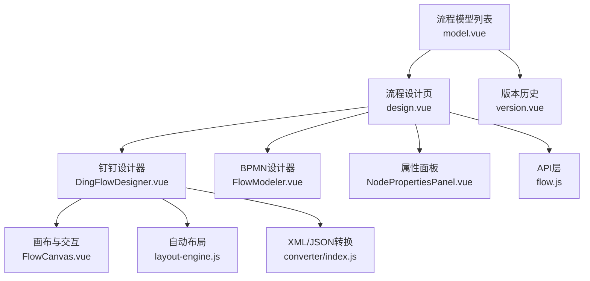
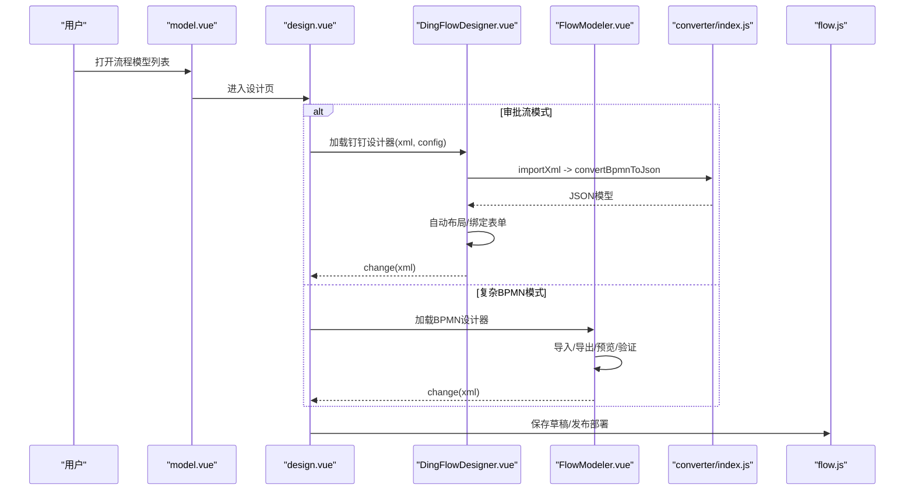
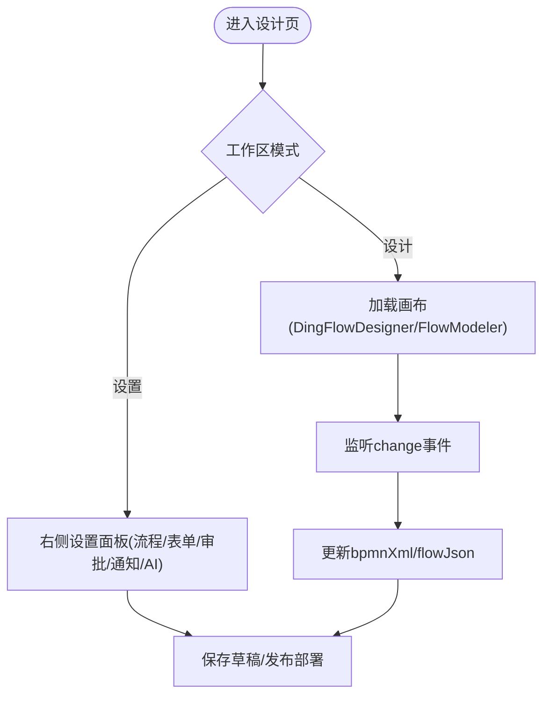
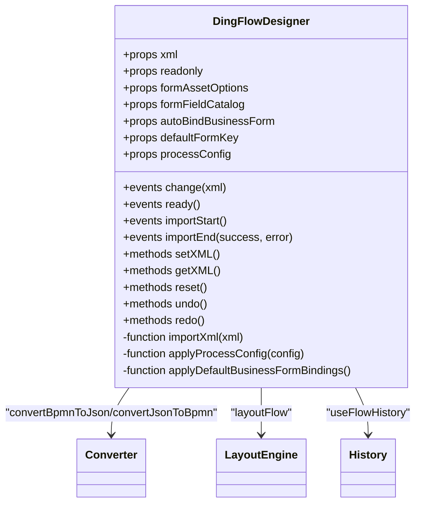
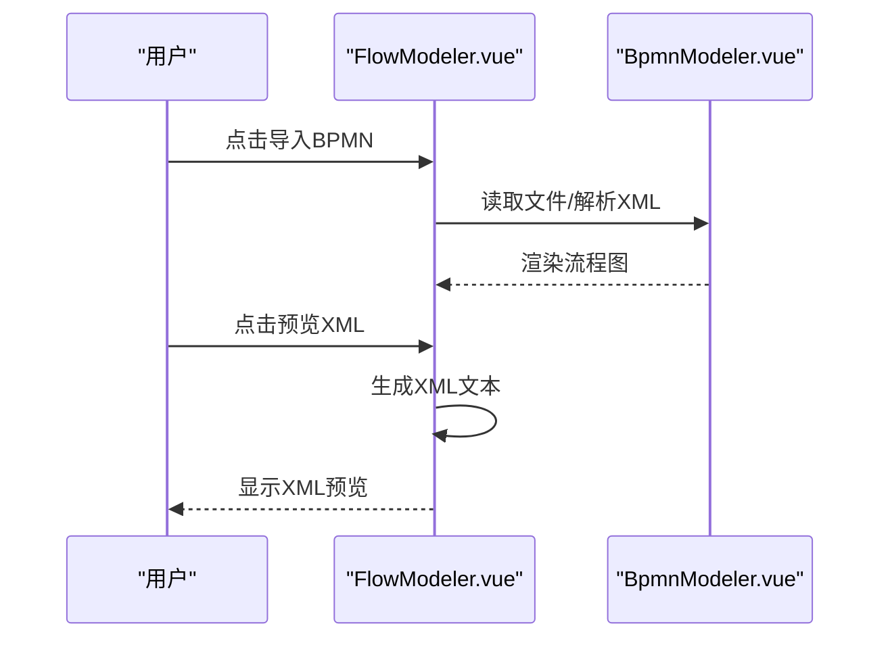
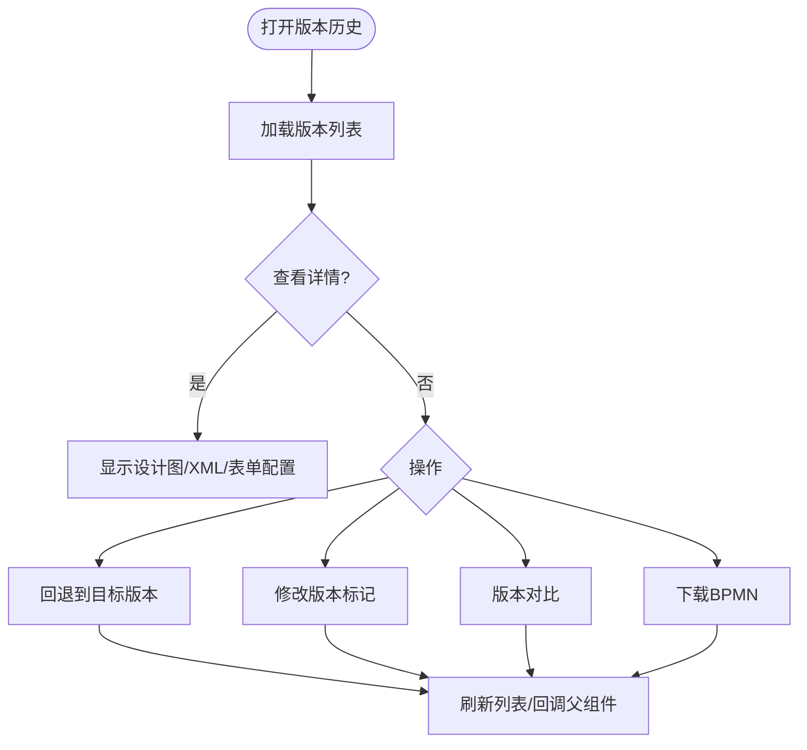
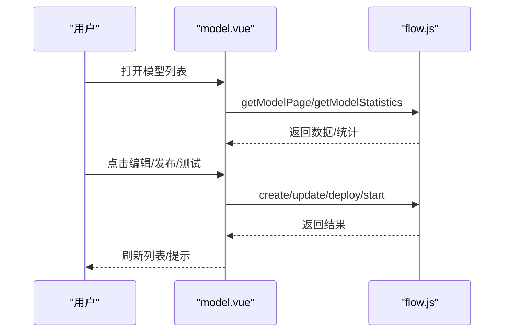
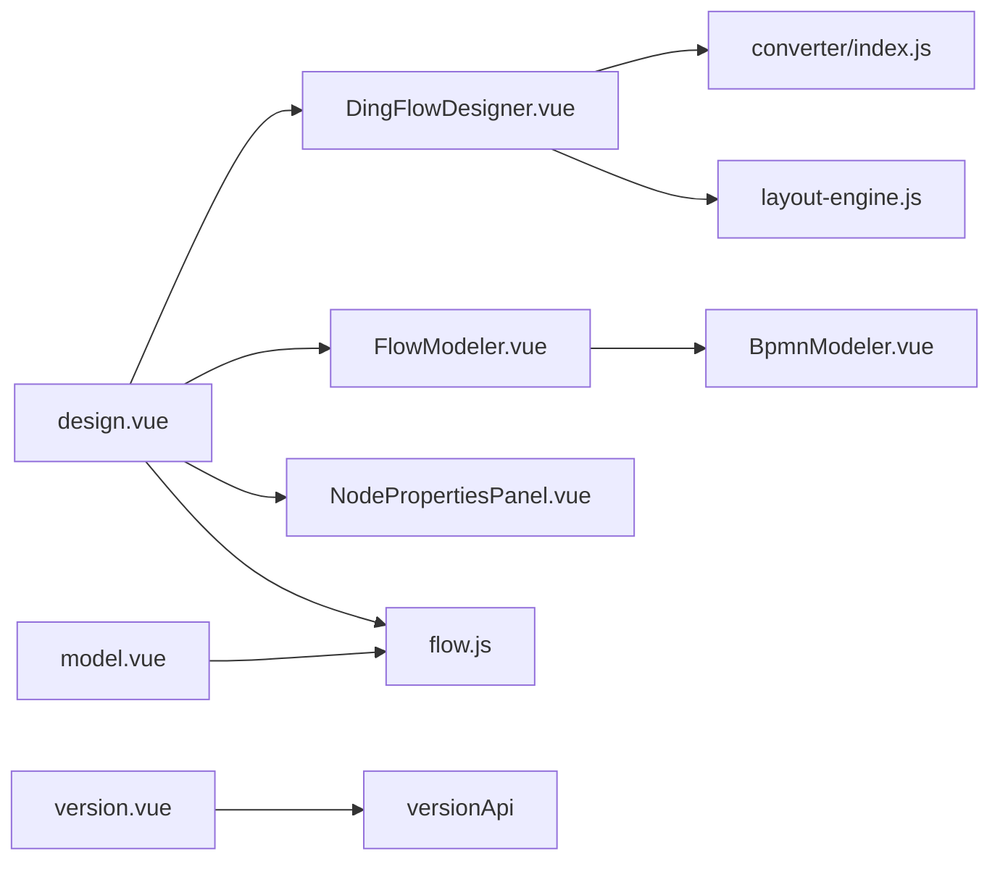

# 流程设计器

<cite>
**本文引用的文件**
- [design.vue](file://forge-admin-ui/src/views/flow/design.vue)
- [model.vue](file://forge-admin-ui/src/views/flow/model.vue)
- [version.vue](file://forge-admin-ui/src/views/flow/version.vue)
- [DingFlowDesigner.vue](file://forge-admin-ui/src/components/flow-designer/DingFlowDesigner.vue)
- [FlowModeler.vue](file://forge-admin-ui/src/components/bpmn/FlowModeler.vue)
- [flow.js](file://forge-admin-ui/src/api/flow.js)
- [categoryOptions.js](file://forge-admin-ui/src/views/flow/utils/categoryOptions.js)
- [form-field-catalog.js](file://forge-admin-ui/src/views/flow/utils/form-field-catalog.js)
- [processDisplay.js](file://forge-admin-ui/src/views/flow/utils/processDisplay.js)
- [BpmnModeler.vue](file://forge-admin-ui/src/components/bpmn/BpmnModeler.vue)
- [NodePropertiesPanel.vue](file://forge-admin-ui/src/components/bpmn/NodePropertiesPanel.vue)
- [FlowCanvas.vue](file://forge-admin-ui/src/components/flow-designer/canvas/FlowCanvas.vue)
- [layout-engine.js](file://forge-admin-ui/src/components/flow-designer/canvas/layout-engine.js)
- [converter/index.js](file://forge-admin-ui/src/components/flow-designer/converter/index.js)
</cite>

## 目录
1. [简介](#简介)
2. [项目结构](#项目结构)
3. [核心组件](#核心组件)
4. [架构总览](#架构总览)
5. [详细组件分析](#详细组件分析)
6. [依赖关系分析](#依赖关系分析)
7. [性能考虑](#性能考虑)
8. [故障排查指南](#故障排查指南)
9. [结论](#结论)
10. [附录](#附录)

## 简介
本技术文档面向 Forge Admin 的流程设计器，聚焦 BPMN 可视化设计器的实现原理与工程实践。内容覆盖节点拖拽、连线配置、属性面板、实时预览、流程模型管理、版本控制机制、BPMN XML 生成逻辑，以及条件分支、网关、事件和任务分配的可视化配置方法。同时提供最佳实践、性能优化建议与常见问题解决方案，帮助读者快速理解并高效使用或扩展该设计器。

## 项目结构
流程设计器由“页面级视图 + 设计器组件 + 画布与布局引擎 + 转换器 + API 层”构成：
- 页面级视图
  - 流程模型列表与操作入口：model.vue
  - 流程设计主界面（含顶部工具栏、画布、属性面板、设置区、AI助手）：design.vue
  - 版本历史与回退：version.vue
- 设计器组件
  - 钉钉风格设计器：DingFlowDesigner.vue（封装 JSON 模型、画布、属性抽屉、自动布局、业务表单绑定等）
  - 传统 BPMN 设计器：FlowModeler.vue（基于 BpmnModeler 的导入导出、预览、验证、缩放等）
- 画布与布局
  - FlowCanvas.vue：节点渲染、连线绘制、交互事件
  - layout-engine.js：流程图自动布局算法
- 转换器
  - converter/index.js：BPMN XML 与内部 JSON 模型互转
- API 层
  - flow.js：流程模型、实例、任务、模板、分类、通知渠道等接口封装
  - version.vue 中使用的版本相关 API（通过 versionApi 调用）

**图表来源**
- [model.vue:1-200](file://forge-admin-ui/src/views/flow/model.vue#L1-L200)
- [design.vue:1-200](file://forge-admin-ui/src/views/flow/design.vue#L1-L200)
- [DingFlowDesigner.vue:1-120](file://forge-admin-ui/src/components/flow-designer/DingFlowDesigner.vue#L1-L120)
- [FlowModeler.vue:1-120](file://forge-admin-ui/src/components/bpmn/FlowModeler.vue#L1-L120)
- [FlowCanvas.vue](file://forge-admin-ui/src/components/flow-designer/canvas/FlowCanvas.vue)
- [layout-engine.js](file://forge-admin-ui/src/components/flow-designer/canvas/layout-engine.js)
- [converter/index.js](file://forge-admin-ui/src/components/flow-designer/converter/index.js)
- [NodePropertiesPanel.vue](file://forge-admin-ui/src/components/bpmn/NodePropertiesPanel.vue)
- [flow.js:150-240](file://forge-admin-ui/src/api/flow.js#L150-L240)

**章节来源**
- [model.vue:1-200](file://forge-admin-ui/src/views/flow/model.vue#L1-L200)
- [design.vue:1-200](file://forge-admin-ui/src/views/flow/design.vue#L1-L200)

## 核心组件
- 流程设计主界面 design.vue
  - 顶部工具栏：返回、工作区切换（设计/设置）、更改记录、AI生成、保存草稿、发布部署
  - 画布区域：根据模式选择 DingFlowDesigner 或 FlowModeler；支持导入/导出、预览、验证、自动布局
  - 属性面板：选中元素时展示 NodePropertiesPanel，支持节点属性编辑并触发 change 事件
  - 设置区：流程属性、表单配置、审批与待办、通知矩阵、说明、AI流程助手
- 钉钉设计器 DingFlowDesigner.vue
  - 对外接口兼容 FlowModeler：xml/readonly、change/ready/importStart/importEnd、setXML/getXML/reset/undo/redo
  - 内部维护 flowJson 模型与 history 栈；监听 props.xml 变化进行导入；应用 processConfig；自动绑定业务表单资产
  - 自动布局：computed 同步计算 layoutResult，避免新增节点位置闪烁
- BPMN 设计器 FlowModeler.vue
  - 工具栏：撤销/重做、缩放、导入/导出 BPMN/SVG、预览 XML、验证流程、自动布局、主题切换
  - 画布容器：承载 BpmnModeler，叠加迷你地图与快捷键栏
  - 导入弹窗：支持本地文件与粘贴 XML；预览弹窗：显示当前 XML
- 版本历史 version.vue
  - 版本列表、详情（设计图、BPMN XML、表单配置）、回退、标记、对比、下载 BPMN
  - 回退会创建新版本，运行中的实例继续按旧版本执行
- API 层 flow.js
  - 流程模型 CRUD、状态变更（启用/禁用/挂起/激活）、复制、统计、分页查询
  - 流程实例启动、终止、变量获取；任务审批、驳回、撤回、转办、改派、终结
  - 模板、分类、通知渠道、表单定义、入口、填报批次等

**章节来源**
- [design.vue:1-200](file://forge-admin-ui/src/views/flow/design.vue#L1-L200)
- [DingFlowDesigner.vue:1-200](file://forge-admin-ui/src/components/flow-designer/DingFlowDesigner.vue#L1-L200)
- [FlowModeler.vue:1-200](file://forge-admin-ui/src/components/bpmn/FlowModeler.vue#L1-L200)
- [version.vue:1-200](file://forge-admin-ui/src/views/flow/version.vue#L1-L200)
- [flow.js:150-240](file://forge-admin-ui/src/api/flow.js#L150-L240)

## 架构总览
设计器采用“双设计器 + 统一数据模型 + 转换器 + 属性面板 + 版本管理”的架构：
- 双设计器：钉钉风格（推荐用于审批流）与传统 BPMN（适合复杂编排）
- 统一数据模型：内部 JSON 表示流程节点、连线、属性、配置；通过 converter 与 BPMN XML 互转
- 属性面板：针对 BPMN 元素提供可编辑的属性，修改后触发 change 事件更新模型
- 版本管理：每次发布生成版本，支持查看、对比、回退、下载

**图表来源**
- [design.vue:70-120](file://forge-admin-ui/src/views/flow/design.vue#L70-L120)
- [DingFlowDesigner.vue:110-140](file://forge-admin-ui/src/components/flow-designer/DingFlowDesigner.vue#L110-L140)
- [FlowModeler.vue:60-120](file://forge-admin-ui/src/components/bpmn/FlowModeler.vue#L60-L120)
- [flow.js:150-240](file://forge-admin-ui/src/api/flow.js#L150-L240)

## 详细组件分析

### 流程设计主界面 design.vue
- 工作区模式
  - 设计模式：展示画布与属性面板
  - 设置模式：流程属性、表单配置、审批与待办、通知矩阵、说明、AI助手
- 画布集成
  - 根据 isApprovalDesigner 选择 DingFlowDesigner 或 FlowModeler
  - 监听 change/ready/importStart/importEnd 事件，处理导入与模型更新
- 属性面板
  - 使用 FlowPropertyPanelShell 包裹 NodePropertiesPanel，支持元素属性编辑并触发 update
- 设置项
  - 流程属性：名称、编码、分类、描述
  - 表单配置：动态表单、外置表单、业务应用表单资产选择
  - 审批与待办：提交人撤回、指定节点驳回、待办跳转模板、自动审批策略
  - 通知矩阵：事件×渠道矩阵，模板选择与预览
  - AI流程助手：自然语言生成流程图，阶段进度、草稿加载、XML预览

**图表来源**
- [design.vue:1-200](file://forge-admin-ui/src/views/flow/design.vue#L1-L200)

**章节来源**
- [design.vue:1-200](file://forge-admin-ui/src/views/flow/design.vue#L1-L200)

### 钉钉设计器 DingFlowDesigner.vue
- 外部接口
  - Props：xml、readonly、formAssetOptions、formFieldCatalog、autoBindBusinessForm、defaultFormKey、processConfig
  - Events：change(xml)、ready、importStart、importEnd
  - Methods：setXML、getXML、reset、undo、redo
- 内部逻辑
  - 使用 useFlowDesigner 与 useFlowHistory 管理 flowJson 与撤销栈
  - watch props.xml：导入 XML -> convertBpmnToJson -> loadJson -> 自动布局 -> emit importEnd
  - applyProcessConfig：规范化 allowSubmitterWithdraw、autoApprovalMode 并写入 flowJson.config
  - applyDefaultBusinessFormBindings：为 approver 节点自动绑定业务表单资产与字段权限
  - 防回环：lastEmittedXml 比对避免父组件 v-model 回写导致重复导入
- 自动布局
  - computed layoutResult = layoutFlow(flowJson)，避免 ref+watch 时序问题导致节点堆叠

**图表来源**
- [DingFlowDesigner.vue:1-200](file://forge-admin-ui/src/components/flow-designer/DingFlowDesigner.vue#L1-L200)
- [converter/index.js](file://forge-admin-ui/src/components/flow-designer/converter/index.js)
- [layout-engine.js](file://forge-admin-ui/src/components/flow-designer/canvas/layout-engine.js)

**章节来源**
- [DingFlowDesigner.vue:1-200](file://forge-admin-ui/src/components/flow-designer/DingFlowDesigner.vue#L1-L200)

### BPMN 设计器 FlowModeler.vue
- 工具栏能力
  - 撤销/重做、缩放、导入/导出 BPMN/SVG、预览 XML、验证流程、自动布局、主题切换
- 画布与叠加层
  - 承载 BpmnModeler，叠加迷你地图与快捷键栏
- 导入/预览
  - 支持本地 .bpmn/.xml 文件与粘贴 XML；预览弹窗显示当前 XML

**图表来源**
- [FlowModeler.vue:60-200](file://forge-admin-ui/src/components/bpmn/FlowModeler.vue#L60-L200)
- [BpmnModeler.vue](file://forge-admin-ui/src/components/bpmn/BpmnModeler.vue)

**章节来源**
- [FlowModeler.vue:1-200](file://forge-admin-ui/src/components/bpmn/FlowModeler.vue#L1-L200)

### 版本历史 version.vue
- 功能
  - 版本列表分页、详情（设计图、BPMN XML、表单配置）、回退、标记、对比、下载 BPMN
- 回退机制
  - 基于目标版本发布新版本；运行中的实例继续按旧版本执行
- 下载与复制
  - 下载版本文件（Blob），文件名从 Content-Disposition 解析；复制 XML 到剪贴板

**图表来源**
- [version.vue:1-200](file://forge-admin-ui/src/views/flow/version.vue#L1-L200)
- [version.vue:360-470](file://forge-admin-ui/src/views/flow/version.vue#L360-L470)

**章节来源**
- [version.vue:1-200](file://forge-admin-ui/src/views/flow/version.vue#L1-L200)
- [version.vue:360-470](file://forge-admin-ui/src/views/flow/version.vue#L360-L470)

### 流程模型管理 model.vue
- 列表与筛选
  - 统计卡片、搜索框、分类树、状态筛选、分页
- 操作
  - 新增/编辑模型（设计器类型、名称、Key、分类、描述）
  - 发布、挂起/激活、删除、复制、发起测试
- 异步加载
  - 设计器、表单渲染器、版本历史均使用异步组件加载，提升首屏性能

**图表来源**
- [model.vue:640-800](file://forge-admin-ui/src/views/flow/model.vue#L640-L800)
- [flow.js:150-240](file://forge-admin-ui/src/api/flow.js#L150-L240)

**章节来源**
- [model.vue:1-200](file://forge-admin-ui/src/views/flow/model.vue#L1-L200)
- [model.vue:640-800](file://forge-admin-ui/src/views/flow/model.vue#L640-L800)

## 依赖关系分析
- 组件耦合
  - design.vue 依赖 DingFlowDesigner/FlowModeler、NodePropertiesPanel、API 层
  - DingFlowDesigner 依赖 converter、layout-engine、history、canvas
  - FlowModeler 依赖 BpmnModeler、Minimap、ShortcutsBar
- 外部依赖
  - flow.js 封装后端接口；version.vue 使用 versionApi
  - categoryOptions.js、form-field-catalog.js、processDisplay.js 提供分类、字段目录、流程展示辅助

**图表来源**
- [design.vue:70-120](file://forge-admin-ui/src/views/flow/design.vue#L70-L120)
- [DingFlowDesigner.vue:1-120](file://forge-admin-ui/src/components/flow-designer/DingFlowDesigner.vue#L1-L120)
- [FlowModeler.vue:1-120](file://forge-admin-ui/src/components/bpmn/FlowModeler.vue#L1-L120)
- [flow.js:150-240](file://forge-admin-ui/src/api/flow.js#L150-L240)

**章节来源**
- [design.vue:70-120](file://forge-admin-ui/src/views/flow/design.vue#L70-L120)
- [DingFlowDesigner.vue:1-120](file://forge-admin-ui/src/components/flow-designer/DingFlowDesigner.vue#L1-L120)
- [FlowModeler.vue:1-120](file://forge-admin-ui/src/components/bpmn/FlowModeler.vue#L1-L120)
- [flow.js:150-240](file://forge-admin-ui/src/api/flow.js#L150-L240)

## 性能考虑
- 异步加载
  - 设计器、表单渲染器、版本历史使用 defineAsyncComponent，延迟首次加载资源
- 自动布局优化
  - 使用 computed 同步计算 layoutResult，避免 ref+watch 导致的渲染抖动
- 防回环
  - lastEmittedXml 比对避免父组件 v-model 回写导致重复导入
- 批量操作
  - 列表分页、统计并行请求（Promise.all）减少等待时间
- 资源复用
  - 画布与属性面板按需显示，减少 DOM 压力

[本节为通用指导，不直接分析具体文件]

## 故障排查指南
- 导入失败
  - 检查 XML 是否有效；查看 importStart/importEnd 事件错误信息
  - 确认 converter 是否正确解析 BPMN
- 节点位置异常
  - 检查 layout-engine 输出；确保 flowJson 结构完整
- 表单绑定未生效
  - 确认 autoBindBusinessForm 与 formAssetOptions/defaultFormKey 配置正确
  - 检查 applyDefaultBusinessFormBindings 是否命中 approver 节点
- 版本回退异常
  - 确认目标版本存在且可回退；检查运行实例数量与消息提示
- 下载失败
  - 检查 Content-Disposition 解析；确认网络与鉴权头

**章节来源**
- [DingFlowDesigner.vue:110-140](file://forge-admin-ui/src/components/flow-designer/DingFlowDesigner.vue#L110-L140)
- [version.vue:470-560](file://forge-admin-ui/src/views/flow/version.vue#L470-L560)

## 结论
Forge Admin 流程设计器通过双设计器与统一数据模型，提供了灵活的 BPMN 可视化设计与强大的版本管理能力。钉钉风格设计器适合审批流场景，传统 BPMN 设计器适合复杂编排。结合属性面板、自动布局、转换器与版本回退，能够满足企业级流程建模与治理需求。建议在复杂流程中使用 BPMN 模式，在审批流中使用钉钉模式；合理配置表单与通知矩阵，利用版本管理保障稳定性。

[本节为总结性内容，不直接分析具体文件]

## 附录
- 条件分支配置
  - 在属性面板中为连线或网关设置条件表达式；使用 formFieldCatalog 提供的字段目录构建表达式
- 网关设置
  - 排他网关/并行网关/包容网关在属性面板中配置出口条件与聚合行为
- 事件定义
  - 开始/结束/中间事件在节点属性中配置触发条件与动作
- 任务分配策略
  - 审批节点支持发起人自选、自动审批策略（firstOnly/consecutive/none）、退回策略（allowMultiReturn）
- 最佳实践
  - 使用钉钉设计器简化审批流；复杂编排使用 BPMN 设计器
  - 合理划分流程分类与模板，便于复用与管理
  - 开启版本管理与回退，保障生产稳定
- 常见问题
  - 表单字段权限不一致：重新初始化 formFieldPermissions
  - 通知渠道不可用：刷新渠道与模板，检查短信成本警告

[本节为概念性内容，不直接分析具体文件]