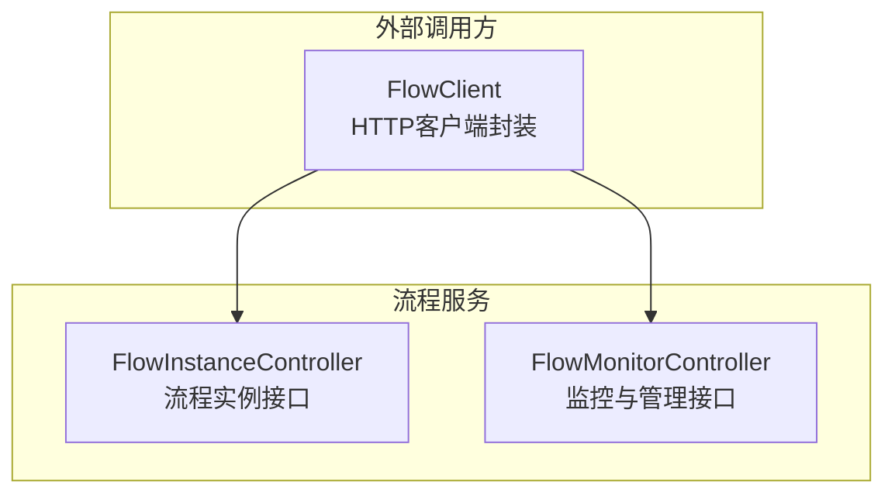
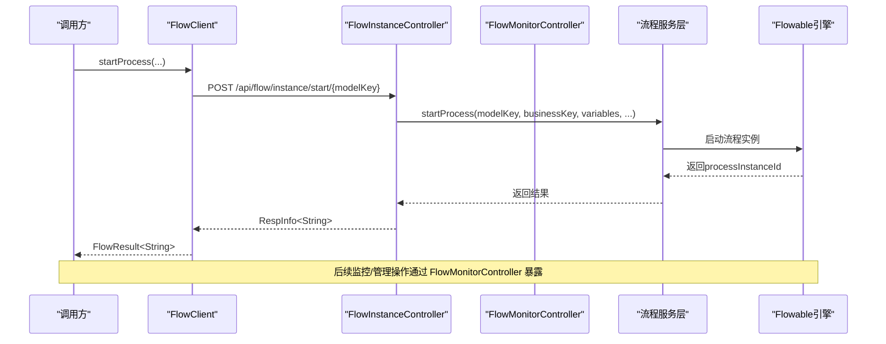
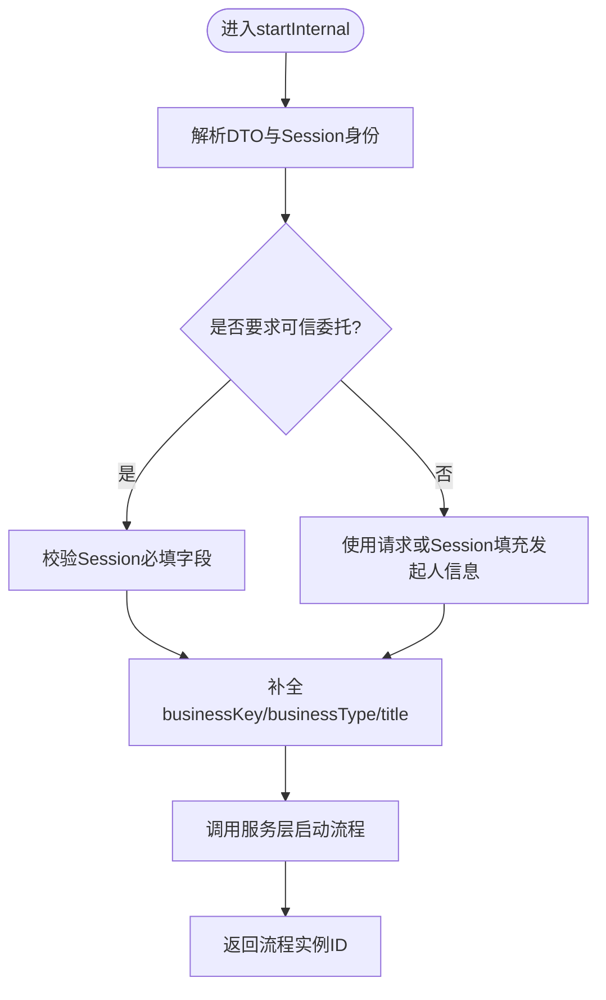
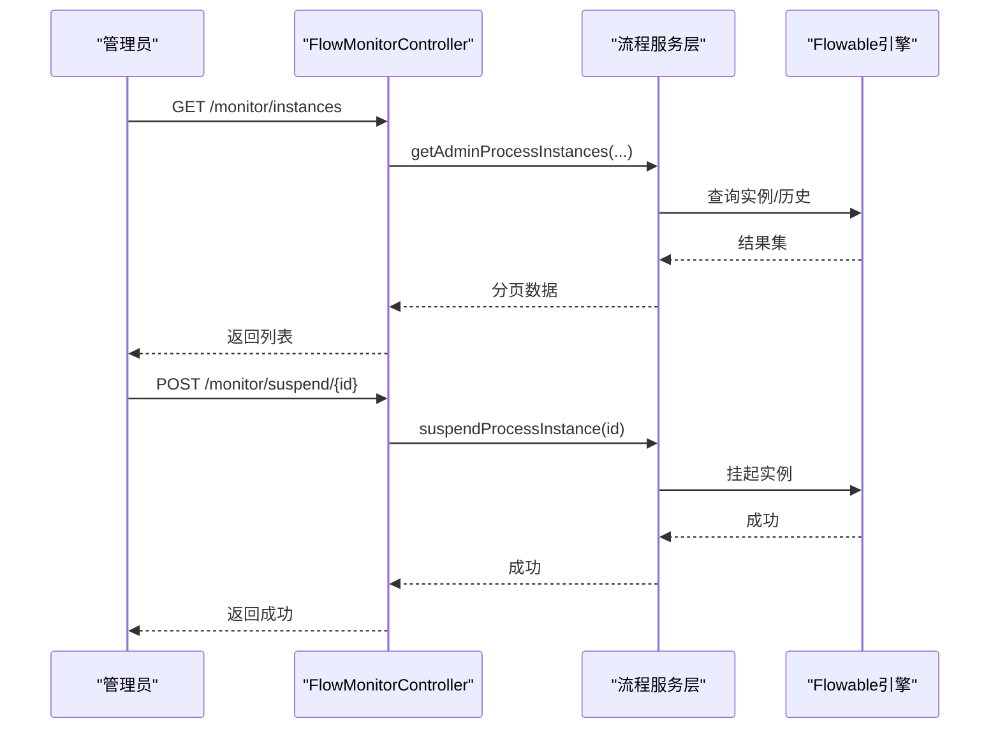
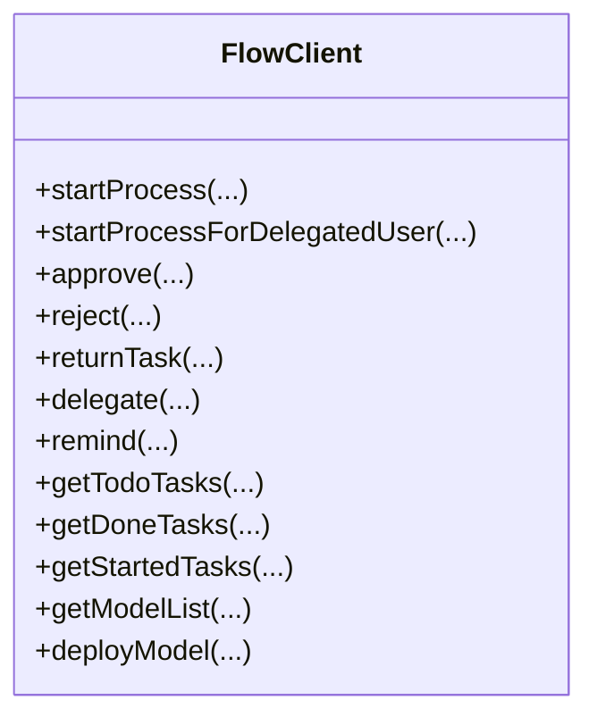
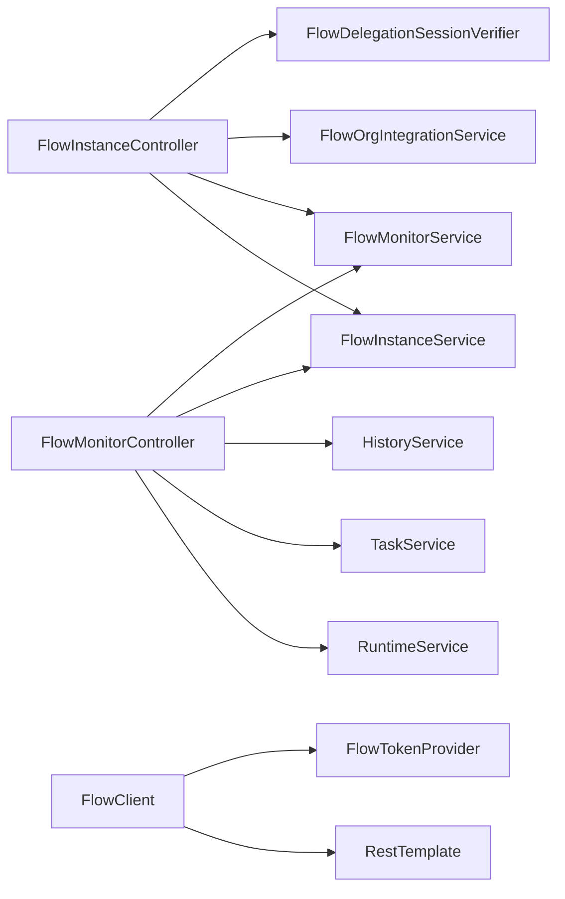

# 流程运行时

<cite>
**本文引用的文件**
- [FlowInstanceController.java](file://forge-server/forge-flow/forge-flow-server/src/main/java/com/mdframe/forge/flow/controller/FlowInstanceController.java)
- [FlowMonitorController.java](file://forge-server/forge-flow/forge-flow-server/src/main/java/com/mdframe/forge/flow/controller/FlowMonitorController.java)
- [FlowClient.java](file://forge-server/forge-flow/forge-flow-client/src/main/java/com/mdframe/forge/flow/client/FlowClient.java)
</cite>

## 目录
1. [简介](#简介)
2. [项目结构](#项目结构)
3. [核心组件](#核心组件)
4. [架构总览](#架构总览)
5. [详细组件分析](#详细组件分析)
6. [依赖关系分析](#依赖关系分析)
7. [性能考虑](#性能考虑)
8. [故障排查指南](#故障排查指南)
9. [结论](#结论)
10. [附录](#附录)

## 简介
本技术文档聚焦 Forge Admin 的流程运行时代码，围绕流程实例的生命周期管理（启动、执行、暂停、恢复、终止）、与 Flowable 引擎的集成方式、流程变量传递与上下文管理、事务边界、调用 API、异步执行、错误处理与重试策略、监控接口、历史数据查询以及性能调优要点进行系统化说明。文档以代码为依据，提供可追溯的章节来源与图示来源，便于读者快速定位实现细节。

## 项目结构
与流程运行直接相关的后端模块位于 forge-server/forge-flow 下：
- 服务端控制器：暴露流程实例与监控相关 REST 接口
- 客户端 SDK：为其他服务提供 HTTP 调用封装，统一鉴权透传与异常包装

**图示来源**
- [FlowInstanceController.java:31-42](file://forge-server/forge-flow/forge-flow-server/src/main/java/com/mdframe/forge/flow/controller/FlowInstanceController.java#L31-L42)
- [FlowMonitorController.java:34-46](file://forge-server/forge-flow/forge-flow-server/src/main/java/com/mdframe/forge/flow/controller/FlowMonitorController.java#L34-L46)
- [FlowClient.java:33-55](file://forge-server/forge-flow/forge-flow-client/src/main/java/com/mdframe/forge/flow/client/FlowClient.java#L33-L55)

**章节来源**
- [FlowInstanceController.java:31-42](file://forge-server/forge-flow/forge-flow-server/src/main/java/com/mdframe/forge/flow/controller/FlowInstanceController.java#L31-L42)
- [FlowMonitorController.java:34-46](file://forge-server/forge-flow/forge-flow-server/src/main/java/com/mdframe/forge/flow/controller/FlowMonitorController.java#L34-L46)
- [FlowClient.java:33-55](file://forge-server/forge-flow/forge-flow-client/src/main/java/com/mdframe/forge/flow/client/FlowClient.java#L33-L55)

## 核心组件
- 流程实例控制器：负责流程发起、状态查询、变量读写、终止与删除等入口
- 监控控制器：提供统计、分页查询、活动节点、当前任务、挂起/激活、回退、转派、清理等管理能力
- 流程客户端：对外暴露统一的 HTTP 调用方法，自动注入 Token、构造请求体并解析响应

**章节来源**
- [FlowInstanceController.java:44-145](file://forge-server/forge-flow/forge-flow-server/src/main/java/com/mdframe/forge/flow/controller/FlowInstanceController.java#L44-L145)
- [FlowMonitorController.java:48-236](file://forge-server/forge-flow/forge-flow-server/src/main/java/com/mdframe/forge/flow/controller/FlowMonitorController.java#L48-L236)
- [FlowClient.java:73-216](file://forge-server/forge-flow/forge-flow-client/src/main/java/com/mdframe/forge/flow/client/FlowClient.java#L73-L216)

## 架构总览
下图展示了从外部调用到流程服务的端到端路径，包括鉴权头透传、参数校验、业务编排与结果返回。

**图示来源**
- [FlowClient.java:109-124](file://forge-server/forge-flow/forge-flow-client/src/main/java/com/mdframe/forge/flow/client/FlowClient.java#L109-L124)
- [FlowInstanceController.java:47-145](file://forge-server/forge-flow/forge-flow-server/src/main/java/com/mdframe/forge/flow/controller/FlowInstanceController.java#L47-L145)

## 详细组件分析

### 流程实例生命周期管理
- 启动流程
  - 支持普通发起与“委托身份”发起（严格校验 Session 中的用户、租户与组织）
  - 自动生成 businessKey、默认 businessType/title，并持久化流程变量
  - 返回流程实例 ID
- 查询状态与变量
  - 按 businessKey 获取流程状态与变量
  - 支持更新流程变量
- 终止与删除
  - 支持按 businessKey 终止或删除流程实例
- 分页与详情
  - 分页查询流程实例列表，支持按模型键、状态、标题、申请人筛选
  - 根据流程实例 ID 获取详情

**图示来源**
- [FlowInstanceController.java:79-145](file://forge-server/forge-flow/forge-flow-server/src/main/java/com/mdframe/forge/flow/controller/FlowInstanceController.java#L79-L145)

**章节来源**
- [FlowInstanceController.java:47-145](file://forge-server/forge-flow/forge-flow-server/src/main/java/com/mdframe/forge/flow/controller/FlowInstanceController.java#L47-L145)

### 监控与管理能力
- 统计与趋势
  - 管理员统计、任务处理趋势、流程分布统计
- 实例管理
  - 分页查询实例、查看实例详情、查看变量、查看活动节点与当前任务
- 运维操作
  - 挂起/激活流程实例
  - 管理员终止、回退至指定节点、转派任务
  - 单条/批量删除流程数据（需确认文本）

**图示来源**
- [FlowMonitorController.java:67-101](file://forge-server/forge-flow/forge-flow-server/src/main/java/com/mdframe/forge/flow/controller/FlowMonitorController.java#L67-L101)
- [FlowMonitorController.java:349-382](file://forge-server/forge-flow/forge-flow-server/src/main/java/com/mdframe/forge/flow/controller/FlowMonitorController.java#L349-L382)

**章节来源**
- [FlowMonitorController.java:48-236](file://forge-server/forge-flow/forge-flow-server/src/main/java/com/mdframe/forge/flow/controller/FlowMonitorController.java#L48-L236)
- [FlowMonitorController.java:238-382](file://forge-server/forge-flow/forge-flow-server/src/main/java/com/mdframe/forge/flow/controller/FlowMonitorController.java#L238-L382)

### 流程调用API（客户端）
- 发起流程
  - 普通发起：传入 modelKey、businessKey、title、variables、发起人信息等
  - 委托发起：由服务端从 Session 解析发起人、租户与组织
  - 高风险审批专用委托：固定业务类型
- 任务操作
  - 待办/已办/我发起的任务查询
  - 签收、审批通过、驳回（含驳回到发起人）、退回、转办、催办
- 模型与表单
  - 模型列表、详情、启动配置、创建/更新/发布
  - 任务表单信息与流程关联表单信息
- 认证与加密
  - 自动设置 X-Inner-Call 头以跳过请求体加解密
  - 动态 Token 优先，静态 Token 降级；失败时抛出客户端异常

**图示来源**
- [FlowClient.java:73-514](file://forge-server/forge-flow/forge-flow-client/src/main/java/com/mdframe/forge/flow/client/FlowClient.java#L73-L514)

**章节来源**
- [FlowClient.java:73-514](file://forge-server/forge-flow/forge-flow-client/src/main/java/com/mdframe/forge/flow/client/FlowClient.java#L73-L514)

### 流程变量传递与上下文管理
- 启动时变量
  - 通过 FlowInstanceStartDTO.resolveVariables() 合并变量后传入服务层
- 运行时变量
  - 监控接口在流程运行中从 RuntimeService 读取变量，已完成流程从 HistoryService 聚合变量
- 上下文与身份
  - 委托发起强制校验 Session 中的 userId、tenantId、activeOrgId
  - 客户端通过 TokenProvider 动态获取 Token，并在请求头中携带 Authorization

**章节来源**
- [FlowInstanceController.java:83-120](file://forge-server/forge-flow/forge-flow-server/src/main/java/com/mdframe/forge/flow/controller/FlowInstanceController.java#L83-L120)
- [FlowMonitorController.java:238-275](file://forge-server/forge-flow/forge-flow-server/src/main/java/com/mdframe/forge/flow/controller/FlowMonitorController.java#L238-L275)
- [FlowClient.java:524-547](file://forge-server/forge-flow/forge-flow-client/src/main/java/com/mdframe/forge/flow/client/FlowClient.java#L524-L547)

### 事务处理机制
- 控制器层未显式声明事务注解，事务边界通常由服务层或框架级事务管理器控制
- 建议将跨多表写操作（如业务实体与流程实例关联）置于服务层事务中，保证一致性
- 对幂等性敏感的操作可通过客户端 idempotencyKey 与服务端去重逻辑配合

[本节为通用实践说明，不直接分析具体文件]

### 异步执行与重试策略
- 客户端侧
  - 基于 RestTemplate 同步调用，无内置重试；可在上层引入重试中间件或断路器
- 服务端侧
  - 控制器未包含异步注解；若涉及耗时任务，建议在服务层采用异步执行与重试策略
- 建议
  - 对网络调用与外部系统交互增加超时、重试与熔断保护
  - 对关键流程步骤记录审计日志，便于问题回溯

[本节为通用实践说明，不直接分析具体文件]

### 错误处理与重试策略
- 客户端异常
  - 空响应体或网络异常统一包装为 FlowClientException，便于上层捕获与重试
- 服务端异常
  - 监控接口对部分操作捕获业务异常并返回友好提示
  - 委托发起缺失必要 Session 字段时抛出非法参数异常

**章节来源**
- [FlowClient.java:549-599](file://forge-server/forge-flow/forge-flow-client/src/main/java/com/mdframe/forge/flow/client/FlowClient.java#L549-L599)
- [FlowMonitorController.java:349-382](file://forge-server/forge-flow/forge-flow-server/src/main/java/com/mdframe/forge/flow/controller/FlowMonitorController.java#L349-L382)
- [FlowInstanceController.java:94-99](file://forge-server/forge-flow/forge-flow-server/src/main/java/com/mdframe/forge/flow/controller/FlowInstanceController.java#L94-L99)

## 依赖关系分析
- 控制器依赖
  - FlowInstanceController 依赖 FlowInstanceService、FlowMonitorService、FlowOrgIntegrationService、FlowDelegationSessionVerifier
  - FlowMonitorController 依赖 Flowable 的 RuntimeService、TaskService、HistoryService 及 FlowInstanceService、FlowMonitorService
- 客户端依赖
  - FlowClient 依赖 RestTemplate、ObjectMapper，并通过 TokenProvider 动态获取鉴权令牌

**图示来源**
- [FlowInstanceController.java:39-42](file://forge-server/forge-flow/forge-flow-server/src/main/java/com/mdframe/forge/flow/controller/FlowInstanceController.java#L39-L42)
- [FlowMonitorController.java:42-46](file://forge-server/forge-flow/forge-flow-server/src/main/java/com/mdframe/forge/flow/controller/FlowMonitorController.java#L42-L46)
- [FlowClient.java:33-55](file://forge-server/forge-flow/forge-flow-client/src/main/java/com/mdframe/forge/flow/client/FlowClient.java#L33-L55)

**章节来源**
- [FlowInstanceController.java:39-42](file://forge-server/forge-flow/forge-flow-server/src/main/java/com/mdframe/forge/flow/controller/FlowInstanceController.java#L39-L42)
- [FlowMonitorController.java:42-46](file://forge-server/forge-flow/forge-flow-server/src/main/java/com/mdframe/forge/flow/controller/FlowMonitorController.java#L42-L46)
- [FlowClient.java:33-55](file://forge-server/forge-flow/forge-flow-client/src/main/java/com/mdframe/forge/flow/client/FlowClient.java#L33-L55)

## 性能考虑
- 查询优化
  - 监控分页查询应结合索引字段（如 processDefKey、status、applyUserId）提升检索效率
  - 历史变量与活动节点查询仅在必要时触发，避免大对象传输
- 并发与吞吐
  - 对高频发起流程的场景，建议在服务层引入限流与缓存（如模型元数据）
  - 客户端连接池与超时时间需合理配置，避免资源耗尽
- 存储与归档
  - 定期清理历史数据，避免历史表膨胀影响查询性能
- 监控指标
  - 关注接口耗时、错误率、队列堆积情况，结合日志与链路追踪定位瓶颈

[本节为通用实践说明，不直接分析具体文件]

## 故障排查指南
- 委托发起失败
  - 检查 Session 是否包含 userId、tenantId、activeOrgId
  - 确认权限标识与委托验证器配置正确
- 变量读取为空
  - 运行中流程从 RuntimeService 读取，已完成流程从 HistoryService 聚合
  - 核对流程变量命名与作用域
- 客户端调用异常
  - 检查 flowServiceUrl、TokenProvider 是否正确注入
  - 查看服务端日志与响应体是否为空
- 监控操作失败
  - 核对权限标识（如 flow:monitor:view/manage/cleanup）
  - 检查目标实例是否存在且属于当前租户

**章节来源**
- [FlowInstanceController.java:94-99](file://forge-server/forge-flow/forge-flow-server/src/main/java/com/mdframe/forge/flow/controller/FlowInstanceController.java#L94-L99)
- [FlowMonitorController.java:238-275](file://forge-server/forge-flow/forge-flow-server/src/main/java/com/mdframe/forge/flow/controller/FlowMonitorController.java#L238-L275)
- [FlowClient.java:524-599](file://forge-server/forge-flow/forge-flow-client/src/main/java/com/mdframe/forge/flow/client/FlowClient.java#L524-L599)

## 结论
Forge Admin 的流程运行时代码通过清晰的控制器分层与客户端封装，提供了完整的流程实例生命周期管理与监控能力。借助 Flowable 引擎，实现了流程变量的灵活传递、上下文身份的严格校验以及丰富的运维操作。结合合理的性能优化与错误处理策略，可满足企业级流程运行的稳定性与可观测性需求。

[本节为总结性内容，不直接分析具体文件]

## 附录
- 常用接口速查
  - 流程实例：启动、状态、变量、终止、删除、分页、详情
  - 监控管理：统计、实例列表、活动节点、当前任务、挂起/激活、回退、转派、清理
  - 客户端：发起、任务操作、模型管理、表单信息

[本节为概览性内容，不直接分析具体文件]