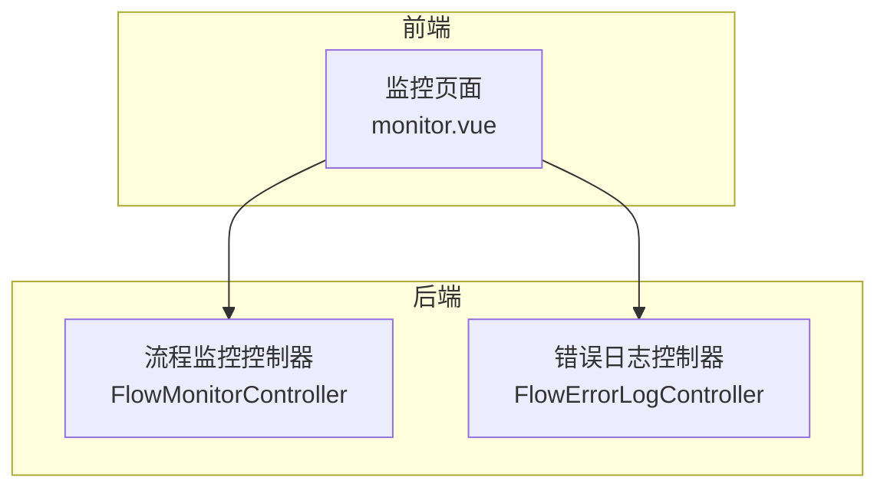
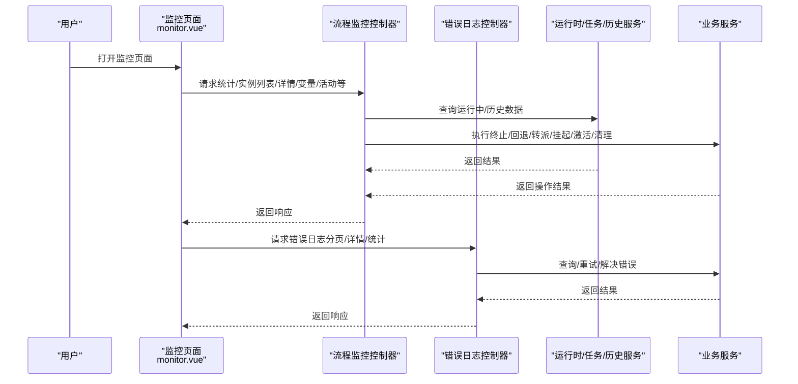
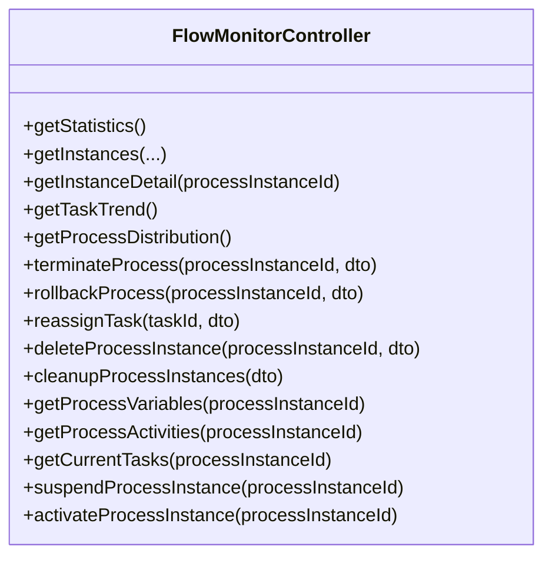
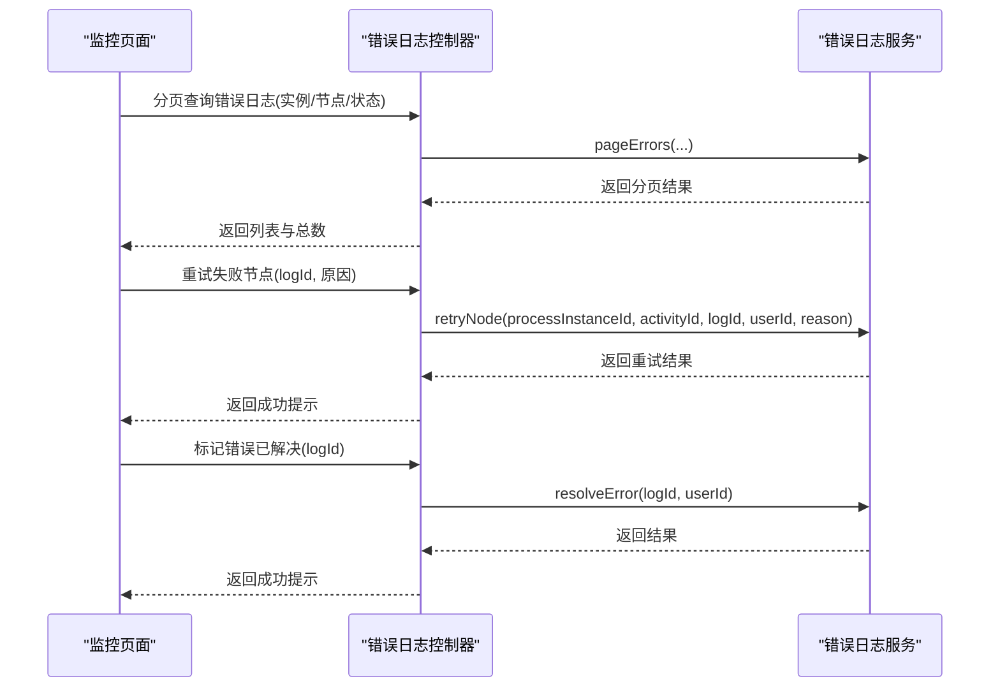
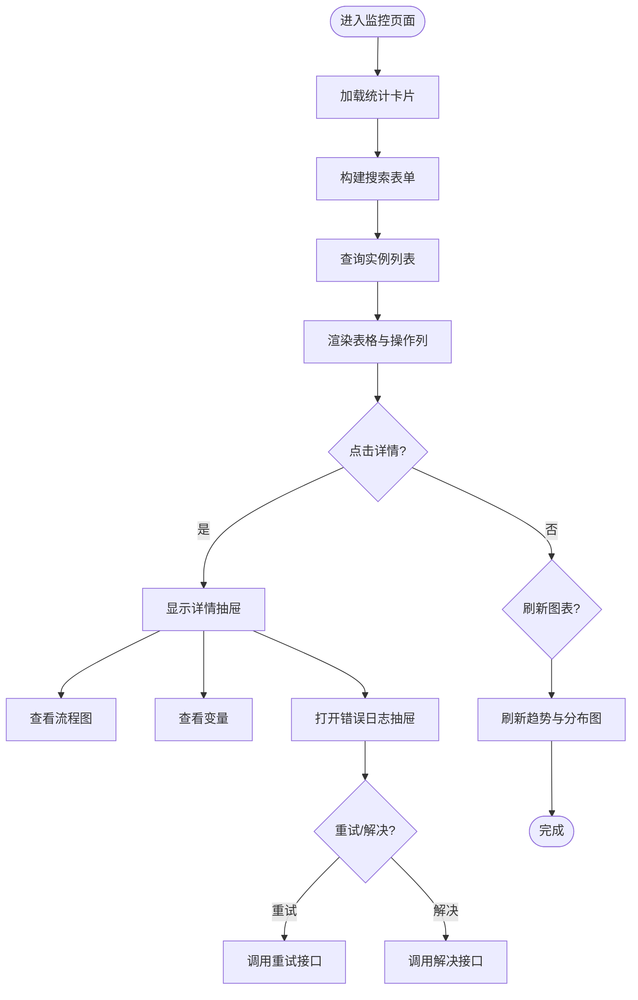
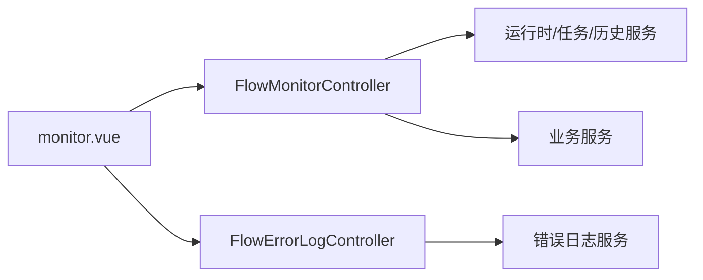

# 监控追踪

<cite>
**本文引用的文件**
- [FlowMonitorController.java](file://forge-server/forge-flow/forge-flow-server/src/main/java/com/mdframe/forge/flow/controller/FlowMonitorController.java)
- [FlowErrorLogController.java](file://forge-server/forge-flow/forge-flow-server/src/main/java/com/mdframe/forge/flow/controller/FlowErrorLogController.java)
- [monitor.vue](file://forge-admin-ui/src/views/flow/monitor.vue)
</cite>

## 目录
1. [简介](#简介)
2. [项目结构](#项目结构)
3. [核心组件](#核心组件)
4. [架构总览](#架构总览)
5. [详细组件分析](#详细组件分析)
6. [依赖关系分析](#依赖关系分析)
7. [性能考虑](#性能考虑)
8. [故障排查指南](#故障排查指南)
9. [结论](#结论)
10. [附录](#附录)

## 简介
本技术文档面向 Forge Admin 工作流监控追踪系统，聚焦以下能力：流程执行状态监控、节点执行轨迹与性能指标收集、错误日志记录与异常堆栈分析、故障诊断工具使用、实时监控仪表盘、告警配置与报表生成原理、监控数据查询 API、自定义监控指标以及性能优化建议。文档基于后端控制器与前端监控页面实现进行说明，帮助读者快速理解并高效使用该系统的监控与运维能力。

## 项目结构
围绕“监控追踪”能力，仓库中与监控相关的关键代码集中在后端 Flowable 集成层与前端监控页面：
- 后端提供统一的流程监控与错误日志接口，覆盖统计、实例列表、详情、变量、活动节点、当前任务、终止/回退/转派、挂起/激活、批量清理等能力。
- 前端提供可视化监控仪表盘，包含统计卡片、搜索过滤、实例列表、流程图查看、错误日志抽屉、重试与解决操作、图表趋势与分布等。

**图示来源**
- [FlowMonitorController.java:31-46](file://forge-server/forge-flow/forge-flow-server/src/main/java/com/mdframe/forge/flow/controller/FlowMonitorController.java#L31-L46)
- [FlowErrorLogController.java:22-33](file://forge-server/forge-flow/forge-flow-server/src/main/java/com/mdframe/forge/flow/controller/FlowErrorLogController.java#L22-L33)
- [monitor.vue:1-128](file://forge-admin-ui/src/views/flow/monitor.vue#L1-L128)

**章节来源**
- [FlowMonitorController.java:31-46](file://forge-server/forge-flow/forge-flow-server/src/main/java/com/mdframe/forge/flow/controller/FlowMonitorController.java#L31-L46)
- [FlowErrorLogController.java:22-33](file://forge-server/forge-flow/forge-flow-server/src/main/java/com/mdframe/forge/flow/controller/FlowErrorLogController.java#L22-L33)
- [monitor.vue:1-128](file://forge-admin-ui/src/views/flow/monitor.vue#L1-L128)

## 核心组件
- 流程监控控制器：提供流程实例的统计、分页查询、详情、变量、历史活动、当前任务、终止/回退/转派、挂起/激活、批量清理等能力，统一封装为 RESTful 接口，并通过权限注解控制访问。
- 错误日志控制器：提供错误日志的分页查询、详情、统计、重试与标记已解决等操作，支持按流程实例、节点、状态筛选。
- 监控前端页面：聚合统计卡片、搜索过滤、实例表格、流程图、错误日志抽屉、重试/解决弹窗、趋势与分布图表等，形成完整的监控工作台。

**章节来源**
- [FlowMonitorController.java:48-382](file://forge-server/forge-flow/forge-flow-server/src/main/java/com/mdframe/forge/flow/controller/FlowMonitorController.java#L48-L382)
- [FlowErrorLogController.java:35-145](file://forge-server/forge-flow/forge-flow-server/src/main/java/com/mdframe/forge/flow/controller/FlowErrorLogController.java#L35-L145)
- [monitor.vue:1-800](file://forge-admin-ui/src/views/flow/monitor.vue#L1-L800)

## 架构总览
监控追踪系统采用前后端分离架构：
- 前端通过 HTTP 调用后端控制器接口，获取统计数据、实例列表、错误日志等，并在页面中进行可视化展示与交互。
- 后端控制器依赖运行时服务、任务服务、历史服务与业务服务，完成流程实例与任务的查询与变更操作，同时对接错误日志服务进行错误处理与重试。

**图示来源**
- [FlowMonitorController.java:48-382](file://forge-server/forge-flow/forge-flow-server/src/main/java/com/mdframe/forge/flow/controller/FlowMonitorController.java#L48-L382)
- [FlowErrorLogController.java:35-145](file://forge-server/forge-flow/forge-flow-server/src/main/java/com/mdframe/forge/flow/controller/FlowErrorLogController.java#L35-L145)
- [monitor.vue:1-800](file://forge-admin-ui/src/views/flow/monitor.vue#L1-L800)

## 详细组件分析

### 流程监控控制器（FlowMonitorController）
职责与能力：
- 统计与概览：提供监控统计数据、任务处理趋势、流程分布统计。
- 实例管理：分页查询流程实例、获取实例详情、查看变量、查看历史活动节点、查看当前任务。
- 管理员干预：终止流程、回退到指定节点、转派任务、挂起/激活流程。
- 数据清理：删除单个或批量删除流程实例数据（需确认文本）。
- 安全与加密：接口受权限控制，启用 API 加解密。

关键接口路径（示例）：
- GET /api/flow/monitor/statistics
- GET /api/flow/monitor/instances
- GET /api/flow/monitor/instance/{processInstanceId}
- GET /api/flow/monitor/taskTrend
- GET /api/flow/monitor/processDistribution
- POST /api/flow/monitor/terminate/{processInstanceId}
- POST /api/flow/monitor/rollback/{processInstanceId}
- POST /api/flow/monitor/reassign/{taskId}
- POST /api/flow/monitor/instance/{processInstanceId}/delete
- POST /api/flow/monitor/instances/cleanup
- GET /api/flow/monitor/variables/{processInstanceId}
- GET /api/flow/monitor/activities/{processInstanceId}
- GET /api/flow/monitor/current-tasks/{processInstanceId}
- POST /api/flow/monitor/suspend/{processInstanceId}
- POST /api/flow/monitor/activate/{processInstanceId}

**图示来源**
- [FlowMonitorController.java:48-382](file://forge-server/forge-flow/forge-flow-server/src/main/java/com/mdframe/forge/flow/controller/FlowMonitorController.java#L48-L382)

**章节来源**
- [FlowMonitorController.java:48-382](file://forge-server/forge-flow/forge-flow-server/src/main/java/com/mdframe/forge/flow/controller/FlowMonitorController.java#L48-L382)

### 错误日志控制器（FlowErrorLogController）
职责与能力：
- 错误日志分页查询：支持按流程实例ID、节点ID、状态筛选。
- 错误日志详情：根据日志ID获取完整记录。
- 错误日志统计：汇总总数、未解决、重试次数、重试失败等。
- 重试与解决：对失败节点进行重试，或将错误日志标记为已解决。

关键接口路径（示例）：
- GET /api/flow/monitor/error-logs
- GET /api/flow/monitor/error-logs/{logId}
- GET /api/flow/monitor/error-logs/statistics
- POST /api/flow/monitor/error-logs/{logId}/retry
- PUT /api/flow/monitor/error-logs/{logId}/resolve

**图示来源**
- [FlowErrorLogController.java:35-145](file://forge-server/forge-flow/forge-flow-server/src/main/java/com/mdframe/forge/flow/controller/FlowErrorLogController.java#L35-L145)

**章节来源**
- [FlowErrorLogController.java:35-145](file://forge-server/forge-flow/forge-flow-server/src/main/java/com/mdframe/forge/flow/controller/FlowErrorLogController.java#L35-L145)

### 监控前端页面（monitor.vue）
功能要点：
- 统计卡片：运行中流程、待办任务、今日完成、超时任务（点击可筛选）。
- 搜索与过滤：流程名称、发起人、状态、时间范围。
- 实例列表：分页展示，支持查看详情、查看流程图、查看变量、查看错误日志、管理员干预、删除流程数据。
- 错误日志抽屉：分页展示错误日志，支持状态筛选、详情查看、重试与解决。
- 图表：任务处理趋势（近7天/近30天）、流程分布统计。
- 流程图：通过组件渲染流程实例的执行视图。
- 管理员干预：挂起/激活、终止、回退、转派，含权限判断与二次确认。

**图示来源**
- [monitor.vue:1-800](file://forge-admin-ui/src/views/flow/monitor.vue#L1-L800)

**章节来源**
- [monitor.vue:1-800](file://forge-admin-ui/src/views/flow/monitor.vue#L1-L800)

## 依赖关系分析
- 控制器间无直接耦合，均通过各自的服务层与底层引擎/数据库交互。
- 前端页面依赖多个后端接口，形成稳定的契约关系；权限控制由注解保障。
- 错误日志与流程监控在业务层面解耦，但共享相同的权限模型与租户隔离策略。

**图示来源**
- [FlowMonitorController.java:48-382](file://forge-server/forge-flow/forge-flow-server/src/main/java/com/mdframe/forge/flow/controller/FlowMonitorController.java#L48-L382)
- [FlowErrorLogController.java:35-145](file://forge-server/forge-flow/forge-flow-server/src/main/java/com/mdframe/forge/flow/controller/FlowErrorLogController.java#L35-L145)
- [monitor.vue:1-800](file://forge-admin-ui/src/views/flow/monitor.vue#L1-L800)

**章节来源**
- [FlowMonitorController.java:48-382](file://forge-server/forge-flow/forge-flow-server/src/main/java/com/mdframe/forge/flow/controller/FlowMonitorController.java#L48-L382)
- [FlowErrorLogController.java:35-145](file://forge-server/forge-flow/forge-flow-server/src/main/java/com/mdframe/forge/flow/controller/FlowErrorLogController.java#L35-L145)
- [monitor.vue:1-800](file://forge-admin-ui/src/views/flow/monitor.vue#L1-L800)

## 性能考虑
- 分页与过滤：后端接口普遍支持分页参数与多条件过滤，前端合理设置 pageSize 与查询条件，避免全表扫描。
- 只读查询优化：统计、趋势、分布等接口应结合缓存或预聚合，降低实时计算压力。
- 大对象传输：变量与堆栈信息可能较大，建议在详情页按需加载，避免首屏阻塞。
- 并发与幂等：管理员干预操作（终止、回退、转派、清理）应具备幂等性与事务保护，防止重复提交导致的数据不一致。
- 资源释放：长时间运行的流程实例应及时归档或清理，减少运行时与历史表膨胀。

[本节为通用指导，不直接分析具体文件]

## 故障排查指南
常见问题与定位方法：
- 无法获取流程变量：检查流程是否已完成，若已完成则从历史服务读取；若运行中则从运行时服务读取。遇到异常时查看后端日志。
- 获取活动节点失败：确认流程实例是否存在且具备历史活动；仅返回用户任务节点用于回退选择。
- 当前任务为空：检查流程是否处于活跃状态，或任务是否已被领取/完成。
- 错误日志为空或统计异常：检查错误日志服务是否可用，必要时降级返回空集合与默认统计值。
- 重试/解决失败：核对权限与租户隔离，确保传入的流程实例ID、节点ID与日志ID匹配。

参考接口与行为：
- 变量获取：先尝试运行时，再回退到历史；异常时记录错误并返回友好提示。
- 活动节点：按开始时间排序，仅返回 userTask 类型。
- 当前任务：查询 active 的任务列表。
- 错误日志：分页查询、详情、统计、重试、解决，异常时记录日志并返回安全响应。

**章节来源**
- [FlowMonitorController.java:238-346](file://forge-server/forge-flow/forge-flow-server/src/main/java/com/mdframe/forge/flow/controller/FlowMonitorController.java#L238-L346)
- [FlowErrorLogController.java:35-145](file://forge-server/forge-flow/forge-flow-server/src/main/java/com/mdframe/forge/flow/controller/FlowErrorLogController.java#L35-L145)

## 结论
Forge Admin 的监控追踪系统以清晰的控制器分层与完善的前端界面，提供了从概览到细节的全链路监控能力。通过统计、实例管理、错误日志与管理员干预等功能，运维人员可以快速定位问题、恢复流程并持续优化性能。建议在生产环境中结合缓存、预聚合与合理的清理策略，进一步提升监控系统的稳定性与可扩展性。

[本节为总结性内容，不直接分析具体文件]

## 附录
- 监控数据查询 API 清单（示例）：
  - 流程监控：/api/flow/monitor/statistics、/api/flow/monitor/instances、/api/flow/monitor/instance/{id}、/api/flow/monitor/taskTrend、/api/flow/monitor/processDistribution、/api/flow/monitor/variables/{id}、/api/flow/monitor/activities/{id}、/api/flow/monitor/current-tasks/{id}
  - 管理员干预：/api/flow/monitor/terminate/{id}、/api/flow/monitor/rollback/{id}、/api/flow/monitor/reassign/{taskId}、/api/flow/monitor/suspend/{id}、/api/flow/monitor/activate/{id}
  - 数据清理：/api/flow/monitor/instance/{id}/delete、/api/flow/monitor/instances/cleanup
  - 错误日志：/api/flow/monitor/error-logs、/api/flow/monitor/error-logs/{logId}、/api/flow/monitor/error-logs/statistics、/api/flow/monitor/error-logs/{logId}/retry、/api/flow/monitor/error-logs/{logId}/resolve

- 自定义监控指标建议：
  - 流程维度：平均耗时、P95/P99 耗时、失败率、超时率、重试次数。
  - 节点维度：各节点耗时、拒绝率、等待时长、瓶颈识别。
  - 组织/租户维度：负载分布、热点流程、异常集中点。

- 告警配置思路：
  - 阈值告警：失败率、超时率、重试失败率超过阈值触发。
  - 事件告警：流程被终止、回退、转派、挂起/激活等关键操作。
  - 资源告警：运行时/历史表大小、慢查询、内存/CPU 使用率。

- 报表生成建议：
  - 定时导出：每日/每周生成流程健康报告、错误分析报告。
  - 可视化报表：趋势图、分布图、热力图，便于管理层审阅。
  - 数据归档：将历史报表与原始数据归档至对象存储或数据仓库。

[本节为扩展建议，不直接分析具体文件]