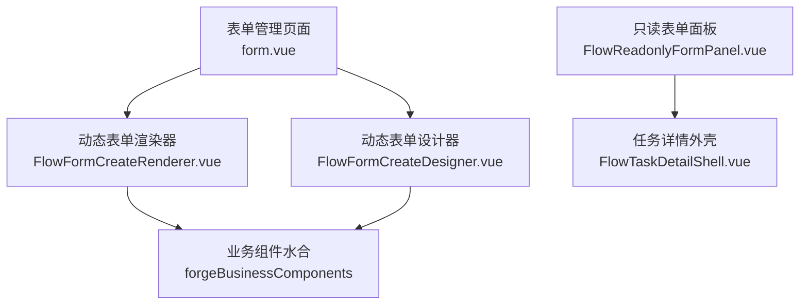
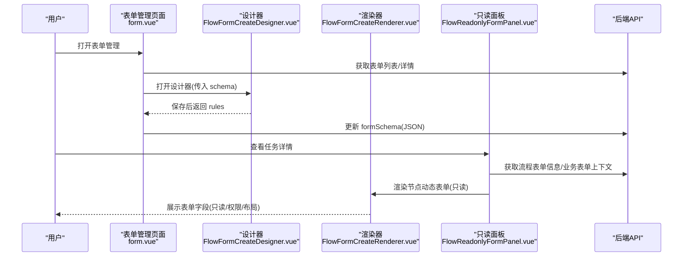
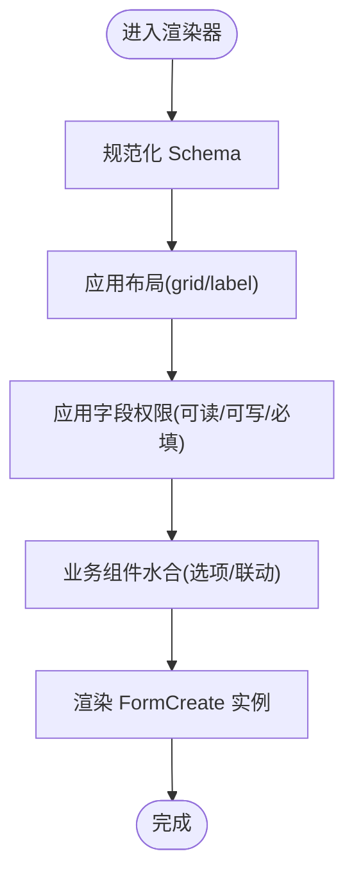
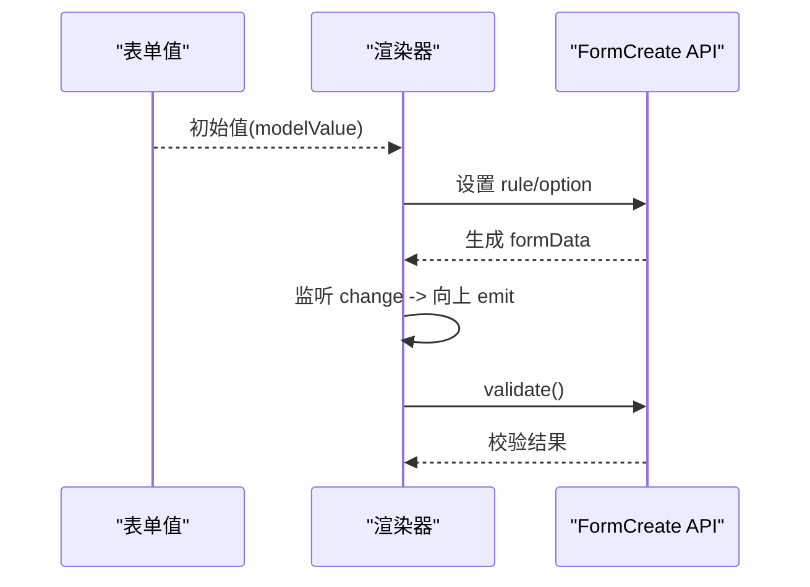
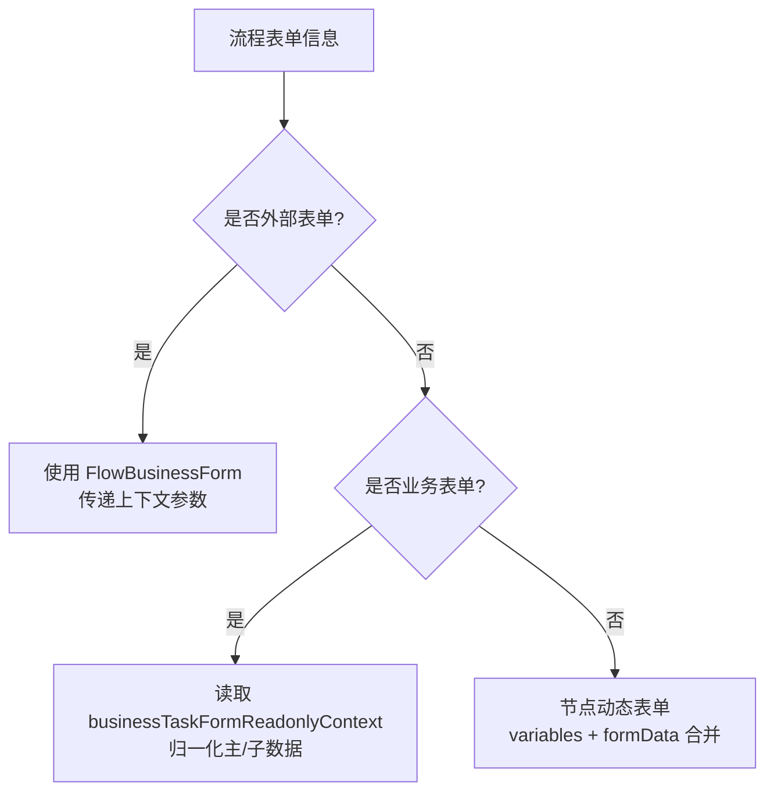
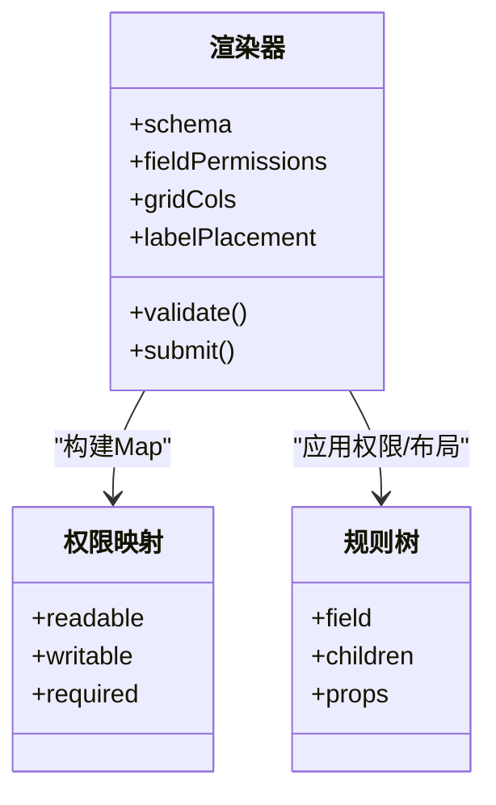
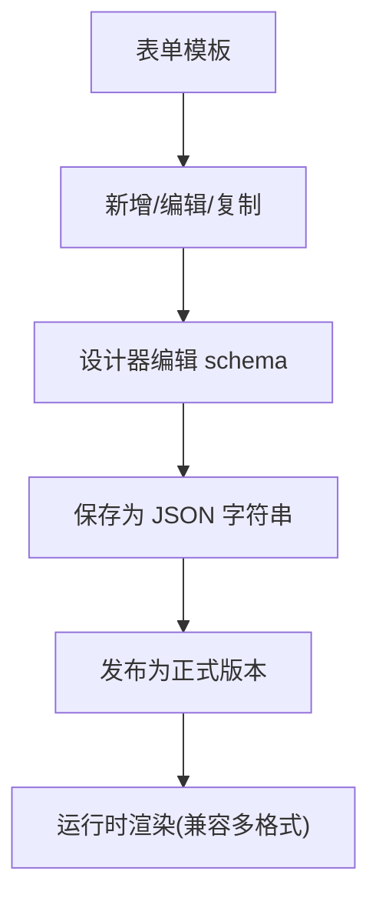
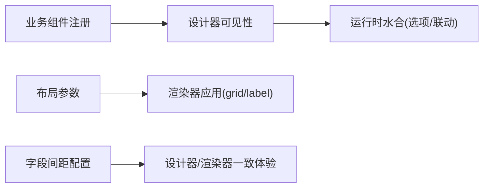
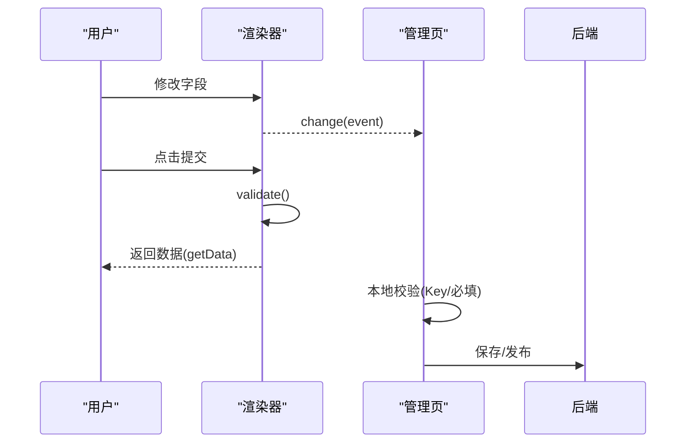
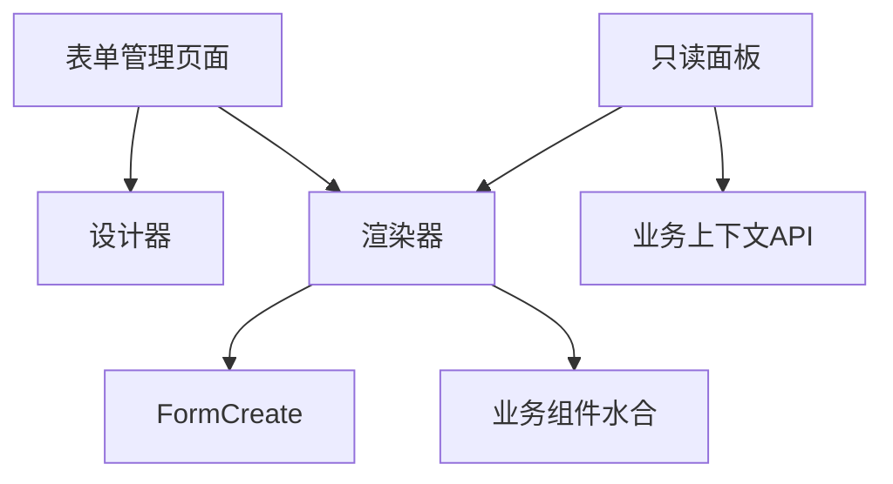

# 表单集成

<cite>
**本文引用的文件**
- [form.vue](file://forge-admin-ui/src/views/flow/form.vue)
- [FlowFormCreateDesigner.vue](file://forge-admin-ui/src/components/form-create/FlowFormCreateDesigner.vue)
- [FlowFormCreateRenderer.vue](file://forge-admin-ui/src/components/form-create/FlowFormCreateRenderer.vue)
- [FlowReadonlyFormPanel.vue](file://forge-admin-ui/src/components/flow/FlowReadonlyFormPanel.vue)
- [FlowTaskDetailShell.vue](file://forge-admin-ui/src/components/flow/FlowTaskDetailShell.vue)
</cite>

## 目录
1. [简介](#简介)
2. [项目结构](#项目结构)
3. [核心组件](#核心组件)
4. [架构总览](#架构总览)
5. [详细组件分析](#详细组件分析)
6. [依赖关系分析](#依赖关系分析)
7. [性能与可用性](#性能与可用性)
8. [故障排查指南](#故障排查指南)
9. [结论](#结论)
10. [附录](#附录)

## 简介
本技术文档围绕 Forge Admin 工作流表单集成的实现，系统阐述动态表单加载、字段绑定与数据验证机制；深入解释表单与流程变量的映射关系、条件显示规则与字段权限控制；并给出表单模板管理、组件扩展与样式定制方法；最后提供表单事件处理、数据提交与版本兼容性的实践指南。内容基于前端代码的实际实现进行归纳与可视化说明，便于不同技术背景的读者理解与维护。

## 项目结构
与表单集成相关的前端模块主要分布在以下位置：
- 表单管理页面：用于创建、编辑、设计、预览、发布与复制表单元信息
- 动态表单设计器：基于 FormCreate 的可视化设计器，支持业务组件注入与预览水合
- 动态表单渲染器：将设计器产出的 Schema 渲染为可交互表单，支持只读模式、字段权限与布局配置
- 只读表单面板：在任务详情中展示“节点动态表单”和“业务表单”，并统一转换为只读视图
- 任务详情外壳：承载审批记录、签名、要点等上下文信息，作为表单展示的容器

图表来源
- [form.vue:125-158](file://forge-admin-ui/src/views/flow/form.vue#L125-L158)
- [FlowFormCreateDesigner.vue:22-36](file://forge-admin-ui/src/components/form-create/FlowFormCreateDesigner.vue#L22-L36)
- [FlowFormCreateRenderer.vue:3-13](file://forge-admin-ui/src/components/form-create/FlowFormCreateRenderer.vue#L3-L13)
- [FlowReadonlyFormPanel.vue:16-84](file://forge-admin-ui/src/components/flow/FlowReadonlyFormPanel.vue#L16-L84)
- [FlowTaskDetailShell.vue:1-108](file://forge-admin-ui/src/components/flow/FlowTaskDetailShell.vue#L1-L108)

章节来源
- [form.vue:1-603](file://forge-admin-ui/src/views/flow/form.vue#L1-L603)
- [FlowFormCreateDesigner.vue:1-416](file://forge-admin-ui/src/components/form-create/FlowFormCreateDesigner.vue#L1-L416)
- [FlowFormCreateRenderer.vue:1-276](file://forge-admin-ui/src/components/form-create/FlowFormCreateRenderer.vue#L1-L276)
- [FlowReadonlyFormPanel.vue:1-424](file://forge-admin-ui/src/components/flow/FlowReadonlyFormPanel.vue#L1-L424)
- [FlowTaskDetailShell.vue:1-806](file://forge-admin-ui/src/components/flow/FlowTaskDetailShell.vue#L1-L806)

## 核心组件
- 表单管理页面（form.vue）
  - 负责表单元数据的增删改查、状态切换、版本发布与复制
  - 通过弹窗集成“表单设计器”与“表单预览”，保存时以 JSON 字符串形式持久化 formSchema
- 动态表单设计器（FlowFormCreateDesigner.vue）
  - 封装 FormCreate 设计器，注入业务组件、预览水合与字段行间距配置
  - 监听设计器变更，批量刷新并回写 modelValue，供上层保存
- 动态表单渲染器（FlowFormCreateRenderer.vue）
  - 将 Schema 渲染为 FormCreate 实例，应用布局、标签宽度、只读模式与字段权限
  - 暴露 validate/getData/submit 能力，支持异步校验与数据收集
- 只读表单面板（FlowReadonlyFormPanel.vue）
  - 根据任务上下文决定渲染外部表单、业务表单或节点动态表单
  - 将动态表单 Schema 与业务字段统一转换为只读，并合并字段权限
- 任务详情外壳（FlowTaskDetailShell.vue）
  - 提供审批记录、签名、要点等展示容器，配合表单面板形成完整审批详情页

章节来源
- [form.vue:162-587](file://forge-admin-ui/src/views/flow/form.vue#L162-L587)
- [FlowFormCreateDesigner.vue:40-279](file://forge-admin-ui/src/components/form-create/FlowFormCreateDesigner.vue#L40-L279)
- [FlowFormCreateRenderer.vue:17-234](file://forge-admin-ui/src/components/form-create/FlowFormCreateRenderer.vue#L17-L234)
- [FlowReadonlyFormPanel.vue:91-373](file://forge-admin-ui/src/components/flow/FlowReadonlyFormPanel.vue#L91-L373)
- [FlowTaskDetailShell.vue:110-216](file://forge-admin-ui/src/components/flow/FlowTaskDetailShell.vue#L110-L216)

## 架构总览
下图展示了从“表单管理”到“运行时渲染”的整体链路，包括设计期与运行期的关键交互。

图表来源
- [form.vue:477-539](file://forge-admin-ui/src/views/flow/form.vue#L477-L539)
- [FlowFormCreateDesigner.vue:133-179](file://forge-admin-ui/src/components/form-create/FlowFormCreateDesigner.vue#L133-L179)
- [FlowReadonlyFormPanel.vue:303-332](file://forge-admin-ui/src/components/flow/FlowReadonlyFormPanel.vue#L303-L332)
- [FlowFormCreateRenderer.vue:83-118](file://forge-admin-ui/src/components/form-create/FlowFormCreateRenderer.vue#L83-L118)

## 详细组件分析

### 动态表单加载与渲染
- 设计期
  - 设计器初始化时安装 FormCreate 与业务组件，并将传入的 schema 规范化后设置到设计器
  - 监听设计器事件，延迟批量刷新，避免频繁写入；最终将最新 rules 回写到父级 modelValue
- 运行期
  - 渲染器接收 schema、options、fieldPermissions、gridCols、labelPlacement 等配置
  - 将 schema 规范化、应用布局与字段权限，再调用业务组件水合函数，得到最终 rules
  - 暴露 validate/submit/getData，便于上层统一校验与提交

图表来源
- [FlowFormCreateRenderer.vue:83-118](file://forge-admin-ui/src/components/form-create/FlowFormCreateRenderer.vue#L83-L118)
- [FlowFormCreateRenderer.vue:120-168](file://forge-admin-ui/src/components/form-create/FlowFormCreateRenderer.vue#L120-L168)
- [FlowFormCreateRenderer.vue:204-228](file://forge-admin-ui/src/components/form-create/FlowFormCreateRenderer.vue#L204-L228)

章节来源
- [FlowFormCreateDesigner.vue:133-179](file://forge-admin-ui/src/components/form-create/FlowFormCreateDesigner.vue#L133-L179)
- [FlowFormCreateRenderer.vue:17-234](file://forge-admin-ui/src/components/form-create/FlowFormCreateRenderer.vue#L17-L234)

### 字段绑定与数据验证
- 字段绑定
  - 设计器中的字段 ID 即变量/业务字段标识，渲染时通过 field 属性与表单值双向绑定
  - 渲染器通过 v-model 与 formApi.formData 同步值，并在 change 事件中向上抛出
- 数据验证
  - 渲染器暴露 validate/submit，内部调用 FormCreate 的 validate
  - 当字段权限要求必填时，自动注入 required 校验规则
  - 管理页面对表单元数据（名称、Key、类型）也具备基础校验

图表来源
- [FlowFormCreateRenderer.vue:65-118](file://forge-admin-ui/src/components/form-create/FlowFormCreateRenderer.vue#L65-L118)
- [FlowFormCreateRenderer.vue:214-228](file://forge-admin-ui/src/components/form-create/FlowFormCreateRenderer.vue#L214-L228)
- [form.vue:221-233](file://forge-admin-ui/src/views/flow/form.vue#L221-L233)

章节来源
- [FlowFormCreateRenderer.vue:65-168](file://forge-admin-ui/src/components/form-create/FlowFormCreateRenderer.vue#L65-L168)
- [form.vue:221-233](file://forge-admin-ui/src/views/flow/form.vue#L221-L233)

### 表单与流程变量的映射关系
- 只读面板在加载流程表单信息时，会将 variables 与 formData 合并为 dynamicFormData，作为节点动态表单的数据源
- 业务表单通过 businessTaskFormReadonlyContext 获取 recordData，并归一化为父子数据结构，分别绑定到主表与子表编辑器
- 外部表单通过 formUrl 直接嵌入，传递 taskId/businessKey/processInstanceId 等上下文参数

图表来源
- [FlowReadonlyFormPanel.vue:16-84](file://forge-admin-ui/src/components/flow/FlowReadonlyFormPanel.vue#L16-L84)
- [FlowReadonlyFormPanel.vue:249-301](file://forge-admin-ui/src/components/flow/FlowReadonlyFormPanel.vue#L249-L301)
- [FlowReadonlyFormPanel.vue:303-332](file://forge-admin-ui/src/components/flow/FlowReadonlyFormPanel.vue#L303-L332)

章节来源
- [FlowReadonlyFormPanel.vue:16-84](file://forge-admin-ui/src/components/flow/FlowReadonlyFormPanel.vue#L16-L84)
- [FlowReadonlyFormPanel.vue:249-332](file://forge-admin-ui/src/components/flow/FlowReadonlyFormPanel.vue#L249-L332)

### 条件显示规则与字段权限控制
- 条件显示
  - 设计器侧通过 FormCreate 的规则与联动配置实现字段显隐与联动（由设计器与业务组件水合共同完成）
  - 渲染器侧对规则进行水合，确保下拉选项、联动等运行时数据就绪
- 字段权限
  - 渲染器将 fieldPermissions 转换为 Map，按字段粒度控制 readable/writable/required
  - 只读模式下强制 disabled/readonly，并过滤不可读字段
  - 只读面板通过 pickFirstNonEmptyFieldPermissions 合并任务级与表单级权限，统一转为只读

图表来源
- [FlowFormCreateRenderer.vue:75-86](file://forge-admin-ui/src/components/form-create/FlowFormCreateRenderer.vue#L75-L86)
- [FlowFormCreateRenderer.vue:120-168](file://forge-admin-ui/src/components/form-create/FlowFormCreateRenderer.vue#L120-L168)
- [FlowReadonlyFormPanel.vue:158-174](file://forge-admin-ui/src/components/flow/FlowReadonlyFormPanel.vue#L158-L174)

章节来源
- [FlowFormCreateRenderer.vue:75-168](file://forge-admin-ui/src/components/form-create/FlowFormCreateRenderer.vue#L75-L168)
- [FlowReadonlyFormPanel.vue:158-174](file://forge-admin-ui/src/components/flow/FlowReadonlyFormPanel.vue#L158-L174)

### 表单模板管理与版本兼容性
- 模板管理
  - 表单元数据包含 formName/formKey/formType/defaultDataMode/description 等
  - 表单 Schema 以 JSON 字符串形式存储于 formSchema，支持设计器编辑与预览
- 版本与发布
  - 支持复制表单快速复用模板
  - 提供发布接口，将当前设计稿发布为可用版本
- 兼容性
  - 渲染器对 options/schema 做规范化处理，兼容数组/字符串等不同输入
  - 设计器支持字段行间距配置，保证不同屏幕下的视觉一致性

图表来源
- [form.vue:211-233](file://forge-admin-ui/src/views/flow/form.vue#L211-L233)
- [form.vue:477-539](file://forge-admin-ui/src/views/flow/form.vue#L477-L539)
- [FlowFormCreateRenderer.vue:20-28](file://forge-admin-ui/src/components/form-create/FlowFormCreateRenderer.vue#L20-L28)

章节来源
- [form.vue:211-233](file://forge-admin-ui/src/views/flow/form.vue#L211-L233)
- [form.vue:477-539](file://forge-admin-ui/src/views/flow/form.vue#L477-L539)
- [FlowFormCreateRenderer.vue:20-28](file://forge-admin-ui/src/components/form-create/FlowFormCreateRenderer.vue#L20-L28)

### 组件扩展与样式定制
- 组件扩展
  - 设计器通过 installForgeBusinessComponents 注入业务组件，使表单字段可直接关联业务模型字段
  - 渲染器通过 hydrateForgeBusinessPreviewRules 在运行时补齐选项与联动数据
- 样式定制
  - 设计器支持字段行间距配置，影响所有字段的底部外边距
  - 渲染器支持 labelPlacement/labelWidth/gridCols 等布局参数，适配不同排版需求
  - 全局样式可通过 CSS 变量与 scoped 样式覆盖默认外观

图表来源
- [FlowFormCreateDesigner.vue:181-199](file://forge-admin-ui/src/components/form-create/FlowFormCreateDesigner.vue#L181-L199)
- [FlowFormCreateDesigner.vue:233-258](file://forge-admin-ui/src/components/form-create/FlowFormCreateDesigner.vue#L233-L258)
- [FlowFormCreateRenderer.vue:88-99](file://forge-admin-ui/src/components/form-create/FlowFormCreateRenderer.vue#L88-L99)

章节来源
- [FlowFormCreateDesigner.vue:181-258](file://forge-admin-ui/src/components/form-create/FlowFormCreateDesigner.vue#L181-L258)
- [FlowFormCreateRenderer.vue:88-99](file://forge-admin-ui/src/components/form-create/FlowFormCreateRenderer.vue#L88-L99)

### 表单事件处理、数据提交与版本兼容性
- 事件处理
  - 设计器监听 create/copy/delete/drag/sort/change-field 等事件，触发批量刷新
  - 渲染器在 change 时向上抛出新值，便于父级收集
- 数据提交
  - 渲染器 submit 会先执行 validate，再返回 getData 的结果
  - 管理页面对表单元数据提交前进行本地校验与 Key 唯一性检查
- 版本兼容性
  - 渲染器对 options/schema 做兼容处理，支持多种输入形态
  - 设计器在载入与保存时对 rules 进行规范化，避免历史数据差异导致异常

图表来源
- [FlowFormCreateDesigner.vue:22-36](file://forge-admin-ui/src/components/form-create/FlowFormCreateDesigner.vue#L22-L36)
- [FlowFormCreateRenderer.vue:115-118](file://forge-admin-ui/src/components/form-create/FlowFormCreateRenderer.vue#L115-L118)
- [FlowFormCreateRenderer.vue:214-228](file://forge-admin-ui/src/components/form-create/FlowFormCreateRenderer.vue#L214-L228)
- [form.vue:439-475](file://forge-admin-ui/src/views/flow/form.vue#L439-L475)

章节来源
- [FlowFormCreateDesigner.vue:22-36](file://forge-admin-ui/src/components/form-create/FlowFormCreateDesigner.vue#L22-L36)
- [FlowFormCreateRenderer.vue:115-228](file://forge-admin-ui/src/components/form-create/FlowFormCreateRenderer.vue#L115-L228)
- [form.vue:439-475](file://forge-admin-ui/src/views/flow/form.vue#L439-L475)

## 依赖关系分析
- 组件耦合
  - 表单管理页面依赖设计器与渲染器，承担元数据与生命周期管理
  - 只读面板依赖业务表单上下文与流程表单信息，决定渲染策略
  - 渲染器依赖 FormCreate 与业务组件水合，负责最终 UI 呈现
- 外部依赖
  - FormCreate 设计器与运行时
  - 业务组件水合函数（选项/联动/字典等）
  - 路由与消息提示等通用能力

图表来源
- [form.vue:162-179](file://forge-admin-ui/src/views/flow/form.vue#L162-L179)
- [FlowReadonlyFormPanel.vue:91-103](file://forge-admin-ui/src/components/flow/FlowReadonlyFormPanel.vue#L91-L103)
- [FlowFormCreateRenderer.vue:17-28](file://forge-admin-ui/src/components/form-create/FlowFormCreateRenderer.vue#L17-L28)

章节来源
- [form.vue:162-179](file://forge-admin-ui/src/views/flow/form.vue#L162-L179)
- [FlowReadonlyFormPanel.vue:91-103](file://forge-admin-ui/src/components/flow/FlowReadonlyFormPanel.vue#L91-L103)
- [FlowFormCreateRenderer.vue:17-28](file://forge-admin-ui/src/components/form-create/FlowFormCreateRenderer.vue#L17-L28)

## 性能与可用性
- 设计器变更节流
  - 使用定时器批量刷新，减少频繁写入与重渲染
- 渲染优化
  - 仅在必要时进行业务组件水合，避免重复计算
  - 通过 computed 缓存权限映射与规则，提升响应速度
- 用户体验
  - 只读模式统一禁用与隐藏，避免误操作
  - 空态与加载中状态明确，提升感知

[本节为通用指导，不直接分析具体文件]

## 故障排查指南
- 表单未显示
  - 检查是否已设计并保存 schema；若为空则仅显示空态提示
- 字段不可见或不可编辑
  - 检查字段权限是否标记为不可读或不可写；只读模式下会强制禁用
- 校验失败
  - 确认必填字段是否已注入 required 规则；提交前会执行 validate
- 发布失败
  - 确认已完成设计且存在有效 schema；发布前会校验

章节来源
- [FlowFormCreateRenderer.vue:120-168](file://forge-admin-ui/src/components/form-create/FlowFormCreateRenderer.vue#L120-L168)
- [FlowFormCreateRenderer.vue:214-228](file://forge-admin-ui/src/components/form-create/FlowFormCreateRenderer.vue#L214-L228)
- [form.vue:477-539](file://forge-admin-ui/src/views/flow/form.vue#L477-L539)

## 结论
本方案通过“设计器+渲染器+只读面板”的分层架构，实现了工作流场景下动态表单的灵活配置与稳定运行。借助字段权限、条件显示与业务组件水合，既能满足复杂业务需求，又保证了运行时的性能与可维护性。结合版本发布与模板复制，进一步提升了交付效率与一致性。

## 附录
- 建议实践
  - 在设计器中优先使用业务组件，减少自定义逻辑
  - 通过字段权限集中管控敏感字段的可读/可写
  - 使用只读面板统一展示，避免重复实现
- 参考路径
  - 表单管理：[form.vue](file://forge-admin-ui/src/views/flow/form.vue)
  - 设计器：[FlowFormCreateDesigner.vue](file://forge-admin-ui/src/components/form-create/FlowFormCreateDesigner.vue)
  - 渲染器：[FlowFormCreateRenderer.vue](file://forge-admin-ui/src/components/form-create/FlowFormCreateRenderer.vue)
  - 只读面板：[FlowReadonlyFormPanel.vue](file://forge-admin-ui/src/components/flow/FlowReadonlyFormPanel.vue)
  - 任务外壳：[FlowTaskDetailShell.vue](file://forge-admin-ui/src/components/flow/FlowTaskDetailShell.vue)