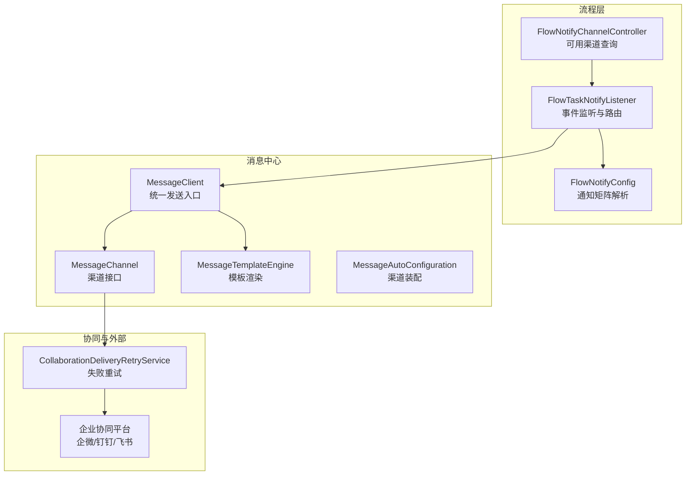
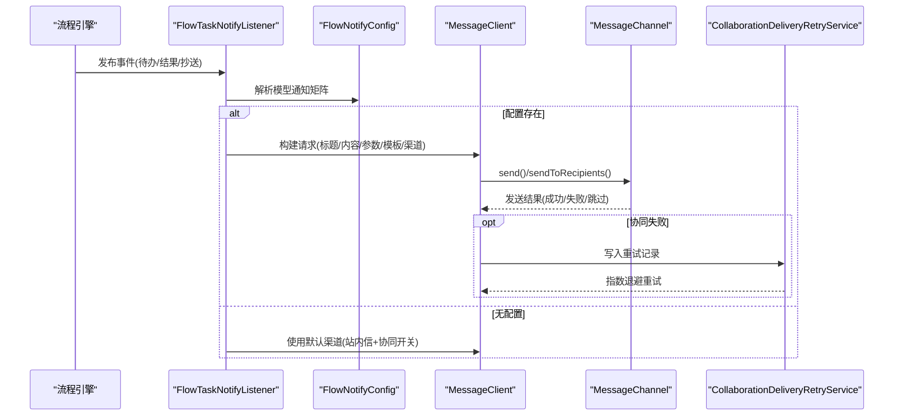
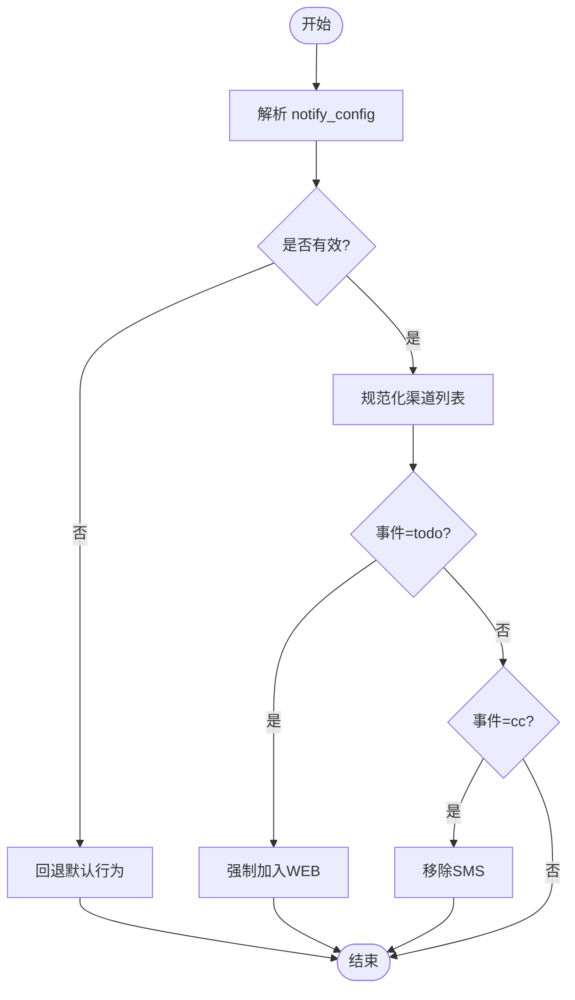
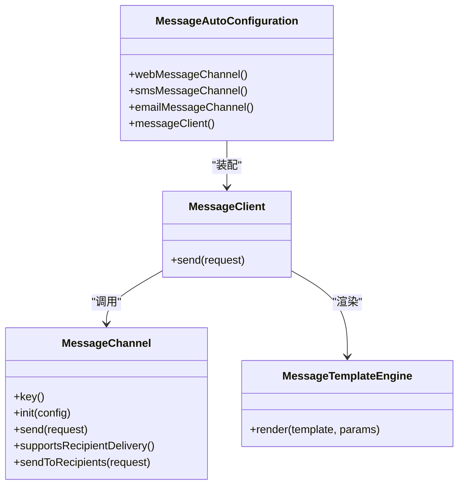
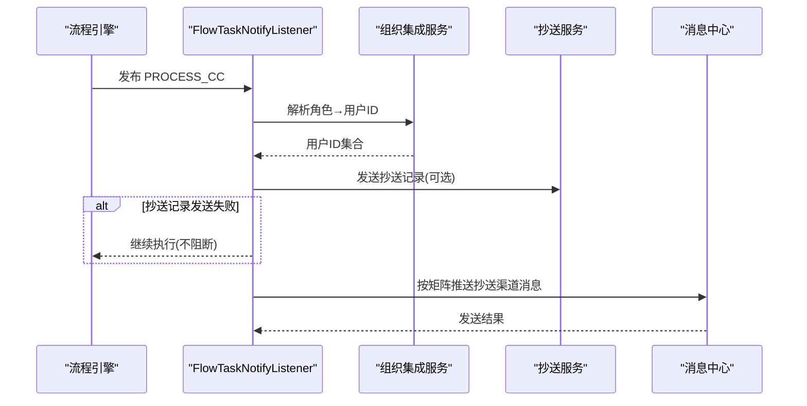
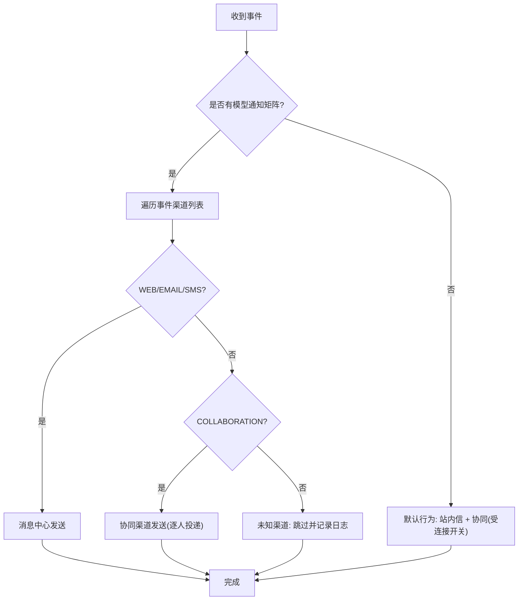
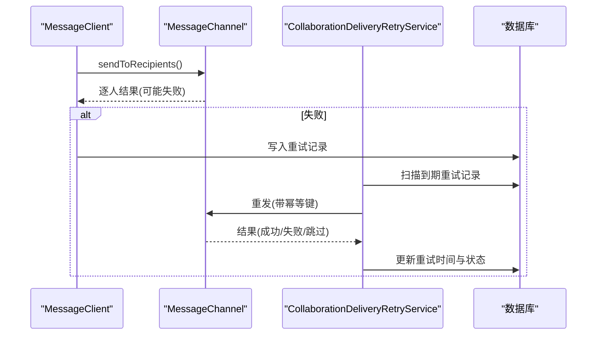
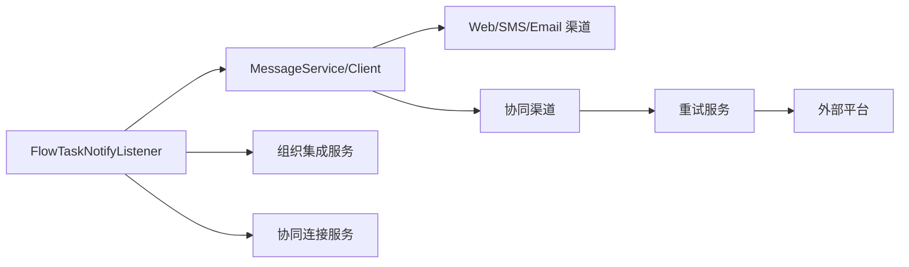

# 通知系统

<cite>
**本文引用的文件**
- [FlowTaskNotifyListener.java](file://forge-server/forge-framework/forge-plugin-parent/forge-plugin-flow/src/main/java/com/mdframe/forge/starter/flow/listener/FlowTaskNotifyListener.java)
- [FlowNotifyConfig.java](file://forge-server/forge-framework/forge-plugin-parent/forge-plugin-flow/src/main/java/com/mdframe/forge/starter/flow/support/FlowNotifyConfig.java)
- [FlowNotifyChannelController.java](file://forge-server/forge-flow/forge-flow-server/src/main/java/com/mdframe/forge/flow/controller/FlowNotifyChannelController.java)
- [MessageAutoConfiguration.java](file://forge-server/forge-framework/forge-starter-parent/forge-starter-message/src/main/java/com/mdframe/forge/starter/message/config/MessageAutoConfiguration.java)
- [MessageClient.java](file://forge-server/forge-framework/forge-starter-parent/forge-starter-message/src/main/java/com/mdframe/forge/starter/message/sdk/MessageClient.java)
- [MessageChannel.java](file://forge-server/forge-framework/forge-starter-parent/forge-starter-message/src/main/java/com/mdframe/forge/starter/message/channel/MessageChannel.java)
- [MessageTemplateEngine.java](file://forge-server/forge-framework/forge-starter-parent/forge-starter-message/src/main/java/com/mdframe/forge/starter/message/service/MessageTemplateEngine.java)
- [CollaborationDeliveryRetryService.java](file://forge-server/forge-framework/forge-plugin-parent/forge-plugin-collaboration/src/main/java/com/mdframe/forge/plugin/collaboration/service/CollaborationDeliveryRetryService.java)
- [设计文档：流程通知矩阵实现计划](file://docs/superpowers/plans/2026-08-22-flow-notify-matrix.md)
- [数据库迁移：业务消息通道初始化](file://forge-server/db/backup/V1.0.46__add_business_trigger_and_message_channel.sql)
</cite>

## 目录
1. [简介](#简介)
2. [项目结构](#项目结构)
3. [核心组件](#核心组件)
4. [架构总览](#架构总览)
5. [详细组件分析](#详细组件分析)
6. [依赖关系分析](#依赖关系分析)
7. [性能与可靠性](#性能与可靠性)
8. [故障排查指南](#故障排查指南)
9. [结论](#结论)
10. [附录](#附录)

## 简介
本技术文档面向 Forge Admin 工作流通知系统，围绕“事件×渠道”的通知矩阵、模板管理、发送策略、抄送机制、触发条件与路由规则展开。系统支持站内信、邮件、短信与企业协同（企微/钉钉/飞书等）多渠道投递，提供通知历史、发送状态跟踪与失败重试能力，确保在审批事务提交后异步、可靠地触达接收人。

## 项目结构
通知系统由三层构成：
- 流程侧：监听流程事件并解析模型级通知配置，按事件维度选择渠道与模板。
- 消息中心：统一的消息客户端与渠道抽象，负责模板渲染、渠道分发与幂等去重。
- 协同侧：企业协同连接管理与逐人投递、补偿重试。

图表来源
- [FlowTaskNotifyListener.java:118-205](file://forge-server/forge-framework/forge-plugin-parent/forge-plugin-flow/src/main/java/com/mdframe/forge/starter/flow/listener/FlowTaskNotifyListener.java#L118-L205)
- [FlowNotifyConfig.java:49-110](file://forge-server/forge-framework/forge-plugin-parent/forge-plugin-flow/src/main/java/com/mdframe/forge/starter/flow/support/FlowNotifyConfig.java#L49-L110)
- [FlowNotifyChannelController.java:50-93](file://forge-server/forge-flow/forge-flow-server/src/main/java/com/mdframe/forge/flow/controller/FlowNotifyChannelController.java#L50-L93)
- [MessageClient.java:33-44](file://forge-server/forge-framework/forge-starter-parent/forge-starter-message/src/main/java/com/mdframe/forge/starter/message/sdk/MessageClient.java#L33-L44)
- [MessageChannel.java:7-226](file://forge-server/forge-framework/forge-starter-parent/forge-starter-message/src/main/java/com/mdframe/forge/starter/message/channel/MessageChannel.java#L7-L226)
- [MessageAutoConfiguration.java:38-63](file://forge-server/forge-framework/forge-starter-parent/forge-starter-message/src/main/java/com/mdframe/forge/starter/message/config/MessageAutoConfiguration.java#L38-L63)
- [CollaborationDeliveryRetryService.java:58-117](file://forge-server/forge-framework/forge-plugin-parent/forge-plugin-collaboration/src/main/java/com/mdframe/forge/plugin/collaboration/service/CollaborationDeliveryRetryService.java#L58-L117)

章节来源
- [FlowTaskNotifyListener.java:118-205](file://forge-server/forge-framework/forge-plugin-parent/forge-plugin-flow/src/main/java/com/mdframe/forge/starter/flow/listener/FlowTaskNotifyListener.java#L118-L205)
- [FlowNotifyConfig.java:49-110](file://forge-server/forge-framework/forge-plugin-parent/forge-plugin-flow/src/main/java/com/mdframe/forge/starter/flow/support/FlowNotifyConfig.java#L49-L110)
- [FlowNotifyChannelController.java:50-93](file://forge-server/forge-flow/forge-flow-server/src/main/java/com/mdframe/forge/flow/controller/FlowNotifyChannelController.java#L50-L93)
- [MessageAutoConfiguration.java:38-63](file://forge-server/forge-framework/forge-starter-parent/forge-starter-message/src/main/java/com/mdframe/forge/starter/message/config/MessageAutoConfiguration.java#L38-L63)

## 核心组件
- 流程通知监听器：在事务提交后异步处理待办、结果、抄送等事件，按模型通知矩阵选择渠道与模板，调用消息中心发送。
- 通知配置解析：将流程模型的 JSON 配置解析为事件到渠道的映射，并进行规范化（如 todo 必含 WEB、cc 不支持 SMS）。
- 可用渠道查询：聚合内置渠道与已启用企业协同连接，返回前端用于矩阵编辑的下拉数据。
- 消息中心：统一客户端、模板引擎与渠道抽象；自动装配 Web/SMS/Email 渠道；支持模板渲染与默认渠道。
- 协同重试：对协同渠道逐人投递失败进行指数退避重试，支持手工重试与批量补偿。

章节来源
- [FlowTaskNotifyListener.java:118-205](file://forge-server/forge-framework/forge-plugin-parent/forge-plugin-flow/src/main/java/com/mdframe/forge/starter/flow/listener/FlowTaskNotifyListener.java#L118-L205)
- [FlowNotifyConfig.java:49-110](file://forge-server/forge-framework/forge-plugin-parent/forge-plugin-flow/src/main/java/com/mdframe/forge/starter/flow/support/FlowNotifyConfig.java#L49-L110)
- [FlowNotifyChannelController.java:50-93](file://forge-server/forge-flow/forge-flow-server/src/main/java/com/mdframe/forge/flow/controller/FlowNotifyChannelController.java#L50-L93)
- [MessageAutoConfiguration.java:38-63](file://forge-server/forge-framework/forge-starter-parent/forge-starter-message/src/main/java/com/mdframe/forge/starter/message/config/MessageAutoConfiguration.java#L38-L63)
- [CollaborationDeliveryRetryService.java:58-117](file://forge-server/forge-framework/forge-plugin-parent/forge-plugin-collaboration/src/main/java/com/mdframe/forge/plugin/collaboration/service/CollaborationDeliveryRetryService.java#L58-L117)

## 架构总览
通知系统以“事件驱动 + 配置化矩阵”为核心：
- 触发：流程事件（待办创建、任务已读、流程结果、流程抄送）发布事件。
- 解析：读取流程模型 notify_config，得到事件→渠道→模板覆盖的配置。
- 路由：根据渠道类型走消息中心或协同通道；未配置时回退默认行为。
- 投递：消息中心按渠道发送；协同渠道支持逐人投递与失败重试。
- 观测：通过消息记录与重试记录追踪发送状态与失败原因。

图表来源
- [FlowTaskNotifyListener.java:118-205](file://forge-server/forge-framework/forge-plugin-parent/forge-plugin-flow/src/main/java/com/mdframe/forge/starter/flow/listener/FlowTaskNotifyListener.java#L118-L205)
- [FlowNotifyConfig.java:49-110](file://forge-server/forge-framework/forge-plugin-parent/forge-plugin-flow/src/main/java/com/mdframe/forge/starter/flow/support/FlowNotifyConfig.java#L49-L110)
- [MessageClient.java:33-44](file://forge-server/forge-framework/forge-starter-parent/forge-starter-message/src/main/java/com/mdframe/forge/starter/message/sdk/MessageClient.java#L33-L44)
- [MessageChannel.java:142-226](file://forge-server/forge-framework/forge-starter-parent/forge-starter-message/src/main/java/com/mdframe/forge/starter/message/channel/MessageChannel.java#L142-L226)
- [CollaborationDeliveryRetryService.java:58-117](file://forge-server/forge-framework/forge-plugin-parent/forge-plugin-collaboration/src/main/java/com/mdframe/forge/plugin/collaboration/service/CollaborationDeliveryRetryService.java#L58-L117)

## 详细组件分析

### 通知矩阵与模板管理
- 事件维度：todo（新待办）、result（审批结果）、cc（抄送）。
- 渠道集合：WEB（站内信）、EMAIL（邮件）、SMS（短信）、COLLABORATION（企业协同）。
- 模板覆盖：每个事件可指定 templateCode；协同渠道支持平台差异化模板（如 FLOW_TODO_CARD_WECOM）。
- 规范化规则：
  - todo 事件强制包含 WEB；
  - cc 事件移除 SMS；
  - 非法/空配置回退默认行为，保证升级零回归。

图表来源
- [FlowNotifyConfig.java:49-110](file://forge-server/forge-framework/forge-plugin-parent/forge-plugin-flow/src/main/java/com/mdframe/forge/starter/flow/support/FlowNotifyConfig.java#L49-L110)

章节来源
- [FlowNotifyConfig.java:49-110](file://forge-server/forge-framework/forge-plugin-parent/forge-plugin-flow/src/main/java/com/mdframe/forge/starter/flow/support/FlowNotifyConfig.java#L49-L110)
- [设计文档：流程通知矩阵实现计划:1-53](file://docs/superpowers/plans/2026-08-22-flow-notify-matrix.md#L1-L53)

### 消息通知渠道配置与装配
- 自动装配：
  - Web 渠道默认启用；
  - SMS 渠道需 SmsConfigProvider 且开启配置；
  - Email 渠道需 EmailConfigProvider 且开启配置。
- 默认渠道：可通过配置设置默认 channel（web/sms/other）。
- 模板引擎：支持 ${key} 与 {key} 两种占位符渲染。

图表来源
- [MessageAutoConfiguration.java:38-63](file://forge-server/forge-framework/forge-starter-parent/forge-starter-message/src/main/java/com/mdframe/forge/starter/message/config/MessageAutoConfiguration.java#L38-L63)
- [MessageClient.java:33-44](file://forge-server/forge-framework/forge-starter-parent/forge-starter-message/src/main/java/com/mdframe/forge/starter/message/sdk/MessageClient.java#L33-L44)
- [MessageChannel.java:7-226](file://forge-server/forge-framework/forge-starter-parent/forge-starter-message/src/main/java/com/mdframe/forge/starter/message/channel/MessageChannel.java#L7-L226)
- [MessageTemplateEngine.java:10-23](file://forge-server/forge-framework/forge-starter-parent/forge-starter-message/src/main/java/com/mdframe/forge/starter/message/service/MessageTemplateEngine.java#L10-L23)

章节来源
- [MessageAutoConfiguration.java:38-63](file://forge-server/forge-framework/forge-starter-parent/forge-starter-message/src/main/java/com/mdframe/forge/starter/message/config/MessageAutoConfiguration.java#L38-L63)
- [MessageClient.java:33-44](file://forge-server/forge-framework/forge-starter-parent/forge-starter-message/src/main/java/com/mdframe/forge/starter/message/sdk/MessageClient.java#L33-L44)
- [MessageTemplateEngine.java:10-23](file://forge-server/forge-framework/forge-starter-parent/forge-starter-message/src/main/java/com/mdframe/forge/starter/message/service/MessageTemplateEngine.java#L10-L23)

### 抄送机制与触发条件
- 触发点：流程事件 PROCESS_CC 触发抄送逻辑。
- 接收人解析：从变量中解析角色键，再解析用户 ID 集合。
- 发送策略：
  - 先尝试落库抄送记录（可选服务），失败不阻断主流程；
  - 再按模型通知矩阵向抄送人推送渠道消息（WEB/EMAIL/SMS/COLLABORATION）。
- 限制：cc 事件不支持短信渠道（规范化阶段移除）。

图表来源
- [FlowTaskNotifyListener.java:571-625](file://forge-server/forge-framework/forge-plugin-parent/forge-plugin-flow/src/main/java/com/mdframe/forge/starter/flow/listener/FlowTaskNotifyListener.java#L571-L625)
- [FlowTaskNotifyListener.java:758-815](file://forge-server/forge-framework/forge-plugin-parent/forge-plugin-flow/src/main/java/com/mdframe/forge/starter/flow/listener/FlowTaskNotifyListener.java#L758-L815)
- [FlowNotifyConfig.java:84-110](file://forge-server/forge-framework/forge-plugin-parent/forge-plugin-flow/src/main/java/com/mdframe/forge/starter/flow/support/FlowNotifyConfig.java#L84-L110)

章节来源
- [FlowTaskNotifyListener.java:571-625](file://forge-server/forge-framework/forge-plugin-parent/forge-plugin-flow/src/main/java/com/mdframe/forge/starter/flow/listener/FlowTaskNotifyListener.java#L571-L625)
- [FlowTaskNotifyListener.java:758-815](file://forge-server/forge-framework/forge-plugin-parent/forge-plugin-flow/src/main/java/com/mdframe/forge/starter/flow/listener/FlowTaskNotifyListener.java#L758-L815)
- [FlowNotifyConfig.java:84-110](file://forge-server/forge-framework/forge-plugin-parent/forge-plugin-flow/src/main/java/com/mdframe/forge/starter/flow/support/FlowNotifyConfig.java#L84-L110)

### 消息路由规则与多通道分发
- 路由依据：
  - 模型通知矩阵的事件→渠道映射；
  - 若未配置，则回退默认行为（待办：站内信 + 协同卡片受连接开关控制）。
- 渠道类型：
  - WEB/EMAIL/SMS：通过消息中心统一发送；
  - COLLABORATION：通过协同连接平台发送，支持逐人投递与失败重试。
- 模板优先级：模型覆盖编码 → 平台差异化默认编码 → 通用默认编码 → 内置兜底排版。

图表来源
- [FlowTaskNotifyListener.java:150-205](file://forge-server/forge-framework/forge-plugin-parent/forge-plugin-flow/src/main/java/com/mdframe/forge/starter/flow/listener/FlowTaskNotifyListener.java#L150-L205)
- [FlowTaskNotifyListener.java:631-704](file://forge-server/forge-framework/forge-plugin-parent/forge-plugin-flow/src/main/java/com/mdframe/forge/starter/flow/listener/FlowTaskNotifyListener.java#L631-L704)
- [FlowTaskNotifyListener.java:758-815](file://forge-server/forge-framework/forge-plugin-parent/forge-plugin-flow/src/main/java/com/mdframe/forge/starter/flow/listener/FlowTaskNotifyListener.java#L758-L815)

章节来源
- [FlowTaskNotifyListener.java:150-205](file://forge-server/forge-framework/forge-plugin-parent/forge-plugin-flow/src/main/java/com/mdframe/forge/starter/flow/listener/FlowTaskNotifyListener.java#L150-L205)
- [FlowTaskNotifyListener.java:631-704](file://forge-server/forge-framework/forge-plugin-parent/forge-plugin-flow/src/main/java/com/mdframe/forge/starter/flow/listener/FlowTaskNotifyListener.java#L631-L704)
- [FlowTaskNotifyListener.java:758-815](file://forge-server/forge-framework/forge-plugin-parent/forge-plugin-flow/src/main/java/com/mdframe/forge/starter/flow/listener/FlowTaskNotifyListener.java#L758-L815)

### 通知历史记录、发送状态与失败重试
- 发送状态：
  - 消息中心逐人投递结果包含 SENT/FAILED/SKIPPED；
  - 协同渠道失败会写入重试记录，支持指数退避与最大尝试次数封顶。
- 重试机制：
  - 手工重试单条失败投递；
  - 批量补偿扫描到期失败记录并重发；
  - 失败时更新下次重试时间，直至成功或达到上限。
- 历史追踪：
  - 消息主记录与接收人记录保存标题、内容、渠道、模板与参数；
  - 协同投递记录保存租户、连接、消息ID、重试次数与错误码。

图表来源
- [MessageChannel.java:142-226](file://forge-server/forge-framework/forge-starter-parent/forge-starter-message/src/main/java/com/mdframe/forge/starter/message/channel/MessageChannel.java#L142-L226)
- [CollaborationDeliveryRetryService.java:58-117](file://forge-server/forge-framework/forge-plugin-parent/forge-plugin-collaboration/src/main/java/com/mdframe/forge/plugin/collaboration/service/CollaborationDeliveryRetryService.java#L58-L117)

章节来源
- [MessageChannel.java:142-226](file://forge-server/forge-framework/forge-starter-parent/forge-starter-message/src/main/java/com/mdframe/forge/starter/message/channel/MessageChannel.java#L142-L226)
- [CollaborationDeliveryRetryService.java:58-117](file://forge-server/forge-framework/forge-plugin-parent/forge-plugin-collaboration/src/main/java/com/mdframe/forge/plugin/collaboration/service/CollaborationDeliveryRetryService.java#L58-L117)

## 依赖关系分析
- 流程监听器依赖：
  - 消息中心（MessageService/MessageClient）；
  - 组织集成（角色→用户解析）；
  - 协同连接（SysSocialConfig）；
  - 流程模型（FlowModel，读取 notify_config 与深链模板）。
- 消息中心依赖：
  - 模板引擎（MessageTemplateEngine）；
  - 渠道实现（Web/SMS/Email）；
  - 协同渠道（逐人投递与重试）。
- 外部依赖：
  - 企业协同平台（企微/钉钉/飞书）；
  - 短信网关（SmsBlend）；
  - 邮件服务器（SMTP）。

图表来源
- [FlowTaskNotifyListener.java:78-112](file://forge-server/forge-framework/forge-plugin-parent/forge-plugin-flow/src/main/java/com/mdframe/forge/starter/flow/listener/FlowTaskNotifyListener.java#L78-L112)
- [MessageAutoConfiguration.java:38-63](file://forge-server/forge-framework/forge-starter-parent/forge-starter-message/src/main/java/com/mdframe/forge/starter/message/config/MessageAutoConfiguration.java#L38-L63)
- [CollaborationDeliveryRetryService.java:28-35](file://forge-server/forge-framework/forge-plugin-parent/forge-plugin-collaboration/src/main/java/com/mdframe/forge/plugin/collaboration/service/CollaborationDeliveryRetryService.java#L28-L35)

章节来源
- [FlowTaskNotifyListener.java:78-112](file://forge-server/forge-framework/forge-plugin-parent/forge-plugin-flow/src/main/java/com/mdframe/forge/starter/flow/listener/FlowTaskNotifyListener.java#L78-L112)
- [MessageAutoConfiguration.java:38-63](file://forge-server/forge-framework/forge-starter-parent/forge-starter-message/src/main/java/com/mdframe/forge/starter/message/config/MessageAutoConfiguration.java#L38-L63)
- [CollaborationDeliveryRetryService.java:28-35](file://forge-server/forge-framework/forge-plugin-parent/forge-plugin-collaboration/src/main/java/com/mdframe/forge/plugin/collaboration/service/CollaborationDeliveryRetryService.java#L28-L35)

## 性能与可靠性
- 异步与解耦：
  - 通知在事务提交后异步执行，避免阻塞审批主链路；
  - 单渠道失败不影响其他渠道，提升整体可用性。
- 幂等与去重：
  - 消息发送使用业务键与渠道组合键进行幂等；
  - 协同重试使用 receiverId 与尝试轮次作为幂等键。
- 资源与成本：
  - 短信按条计费，前端提供成本提示；
  - 协同卡片 H5 地址校验，避免无效链接导致整批拒绝。
- 可扩展性：
  - 新增渠道只需实现 MessageChannel 接口并装配；
  - 通知矩阵支持动态扩展事件与渠道。

[本节为通用指导，无需特定文件引用]

## 故障排查指南
- 渠道不可用：
  - 检查对应渠道是否启用（如 SMS/Email 需要配置 Provider 且 enabled=true）；
  - 查看可用渠道接口返回，确认内置与协同渠道是否加载。
- 模板未生效：
  - 确认模板编码是否存在且启用；
  - 检查模板渲染参数是否完整。
- 协同卡片推送失败：
  - 检查连接是否启用且配置了 H5 地址；
  - 查看逐人投递失败码与错误信息；
  - 使用重试服务手工重试或等待补偿任务。
- 抄送未发送：
  - 确认抄送角色解析是否成功；
  - 检查 cc 事件是否配置了渠道（注意 cc 不支持 SMS）。

章节来源
- [FlowNotifyChannelController.java:50-93](file://forge-server/forge-flow/forge-flow-server/src/main/java/com/mdframe/forge/flow/controller/FlowNotifyChannelController.java#L50-L93)
- [MessageAutoConfiguration.java:38-63](file://forge-server/forge-framework/forge-starter-parent/forge-starter-message/src/main/java/com/mdframe/forge/starter/message/config/MessageAutoConfiguration.java#L38-L63)
- [CollaborationDeliveryRetryService.java:58-117](file://forge-server/forge-framework/forge-plugin-parent/forge-plugin-collaboration/src/main/java/com/mdframe/forge/plugin/collaboration/service/CollaborationDeliveryRetryService.java#L58-L117)
- [FlowTaskNotifyListener.java:571-625](file://forge-server/forge-framework/forge-plugin-parent/forge-plugin-flow/src/main/java/com/mdframe/forge/starter/flow/listener/FlowTaskNotifyListener.java#L571-L625)

## 结论
Forge Admin 工作流通知系统通过“事件×渠道”的通知矩阵实现了灵活、可扩展的多渠道通知能力。系统在流程侧解析配置、在消息中心统一分发、在协同侧提供逐人投递与重试保障，兼顾了性能、可靠性与可观测性。结合模板管理与渠道发现，能够满足不同租户与平台的差异化需求。

[本节为总结，无需特定文件引用]

## 附录
- 数据库初始化：
  - 内置站内信通道与第三方通道占位记录，便于后续扩展。
- 前端矩阵编辑器：
  - 在流程模型编辑界面展示事件×渠道矩阵，支持模板选择与变更序列化。

章节来源
- [数据库迁移：业务消息通道初始化:80-100](file://forge-server/db/backup/V1.0.46__add_business_trigger_and_message_channel.sql#L80-L100)
- [设计文档：流程通知矩阵实现计划:35-53](file://docs/superpowers/plans/2026-08-22-flow-notify-matrix.md#L35-L53)