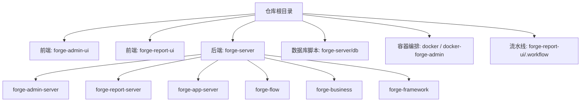
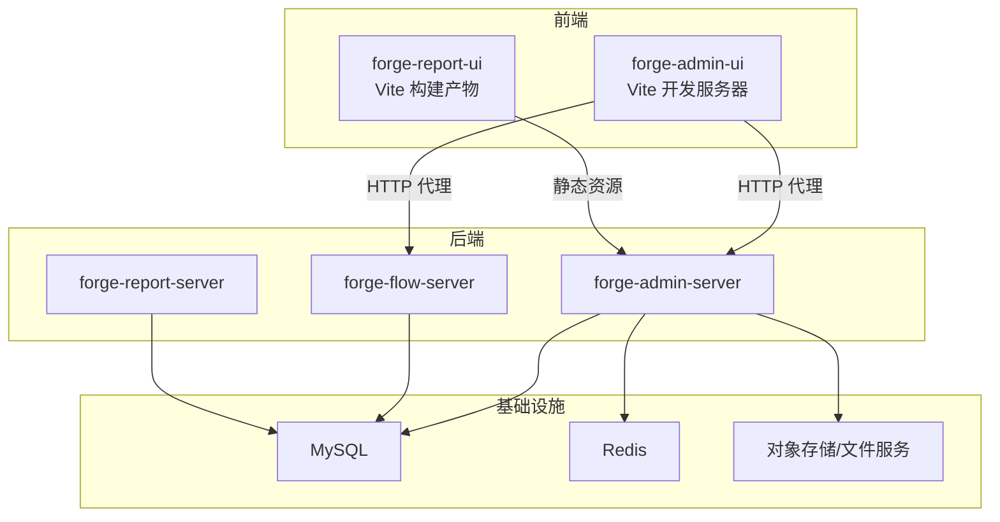
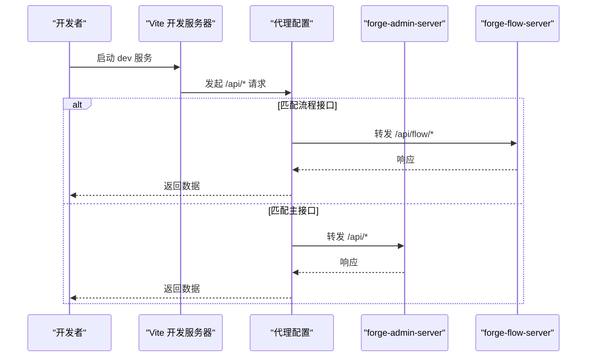
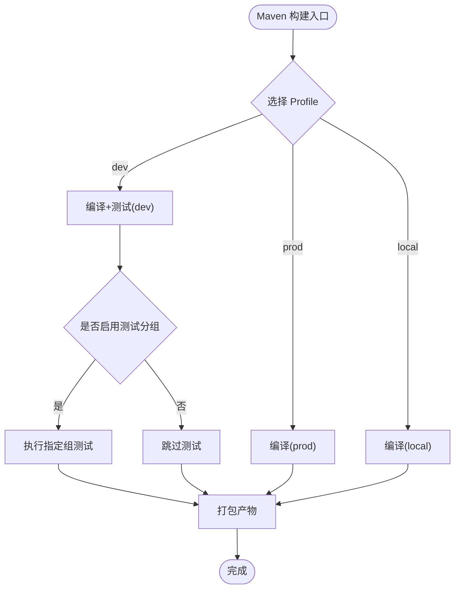
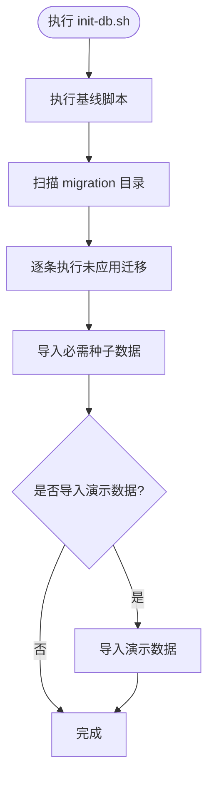
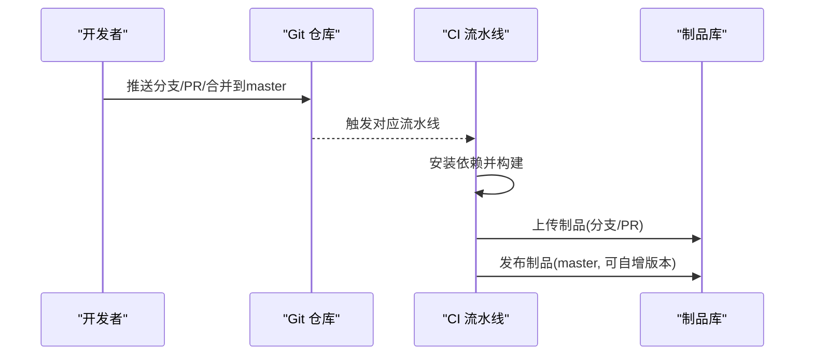
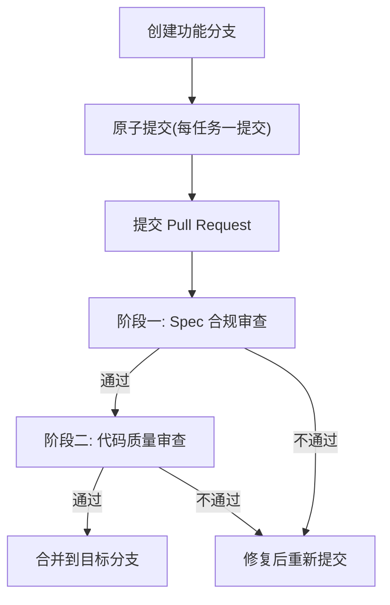
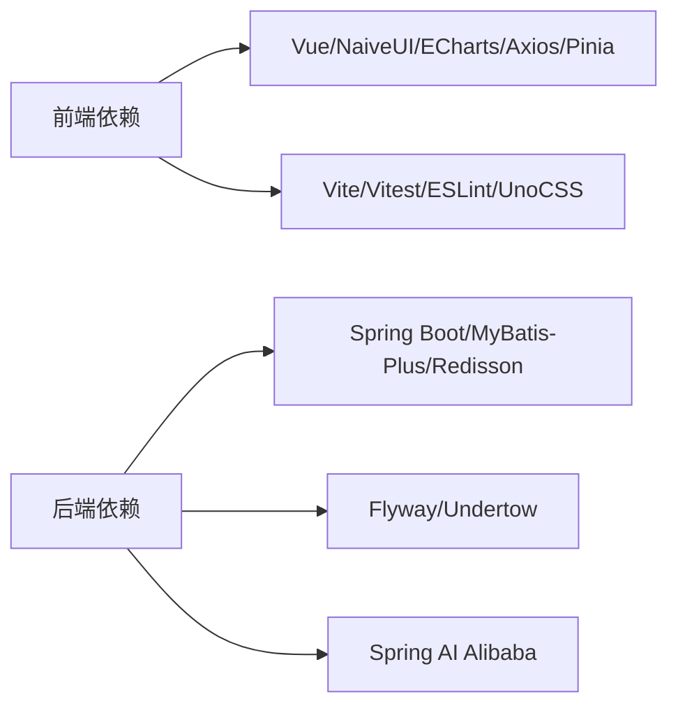

# 开发工作流

<cite>
**本文引用的文件**
- [README.md](file://README.md)
- [package.json](file://package.json)
- [forge-admin-ui/package.json](file://forge-admin-ui/package.json)
- [forge-server/pom.xml](file://forge-server/pom.xml)
- [forge-admin-ui/vite.config.js](file://forge-admin-ui/vite.config.js)
- [forge-report-ui/.workflow/branch-pipeline.yml](file://forge-report-ui/.workflow/branch-pipeline.yml)
- [forge-report-ui/.workflow/master-pipeline.yml](file://forge-report-ui/.workflow/master-pipeline.yml)
- [forge-report-ui/.workflow/pr-pipeline.yml](file://forge-report-ui/.workflow/pr-pipeline.yml)
- [code-copilot/agents/copilot-prompt.md](file://code-copilot/agents/copilot-prompt.md)
</cite>

## 目录
1. [简介](#简介)
2. [项目结构](#项目结构)
3. [核心组件](#核心组件)
4. [架构总览](#架构总览)
5. [详细组件分析](#详细组件分析)
6. [依赖分析](#依赖分析)
7. [性能考虑](#性能考虑)
8. [故障排查指南](#故障排查指南)
9. [结论](#结论)
10. [附录](#附录)

## 简介
本指南面向 Forge Admin 项目的开发者与运维人员，系统化说明从项目初始化、依赖管理、构建流程到部署流水线的全链路工作流；并给出 Git 分支策略、代码审查、版本管理与发布流程的落地规范。同时覆盖开发环境配置、调试技巧、性能分析与故障排查方法，以及团队协作最佳实践、冲突解决策略与知识沉淀机制，帮助团队高效协作、稳定交付。

## 项目结构
Forge Admin 采用前后端分离与多模块后端工程：
- 前端：基于 Vue 3 + Vite 的管理端（forge-admin-ui）与大屏端（forge-report-ui），使用 pnpm 进行包管理。
- 后端：基于 Spring Boot 3 的多模块 Maven 工程（forge-server），包含 admin、report、app、flow、business、framework 等子模块。
- 数据库：通过 Flyway 管理迁移脚本，提供统一初始化与演示数据导入脚本。
- 容器化：提供 Dockerfile 与 docker-compose 用于本地或生产编排。
- 流水线：针对前端提供分支、主分支与 PR 流水线定义。

**章节来源**
- [README.md:241-259](file://README.md#L241-L259)
- [forge-server/pom.xml:186-193](file://forge-server/pom.xml#L186-L193)

## 核心组件
- 前端工程
  - 包管理与脚本：pnpm 作为包管理器，提供 dev/build/preview/test 等命令。
  - 构建工具：Vite 7，启用路由自动生成、组件自动引入、UnoCSS、代理与优化。
  - 测试：Vitest 单元测试与 UI 模式。
- 后端工程
  - 多模块 Maven 工程，统一版本与插件管理，支持 local/dev/prod 环境 Profile。
  - 依赖管理：Spring Boot BOM、Spring AI Alibaba BOM、Flyway、MyBatis-Plus、Redisson 等。
  - 构建与测试：编译器注解处理器、Surefire 测试分组执行、Flatten 插件统一版本号。
- 数据库与迁移
  - Flyway 驱动迁移，基线脚本与增量脚本分离，提供统一初始化脚本与演示数据导入。
- 容器与编排
  - 提供多个 Dockerfile 与 compose 文件，便于本地联调与生产部署。
- 流水线
  - 分支/主分支/PR 三种流水线，分别触发编译、制品上传与发布。

**章节来源**
- [forge-admin-ui/package.json:6-17](file://forge-admin-ui/package.json#L6-L17)
- [forge-admin-ui/vite.config.js:14-176](file://forge-admin-ui/vite.config.js#L14-L176)
- [forge-server/pom.xml:12-72](file://forge-server/pom.xml#L12-L72)
- [forge-server/pom.xml:129-184](file://forge-server/pom.xml#L129-L184)
- [forge-server/pom.xml:197-299](file://forge-server/pom.xml#L197-L299)
- [README.md:292-341](file://README.md#L292-L341)
- [forge-report-ui/.workflow/branch-pipeline.yml:1-52](file://forge-report-ui/.workflow/branch-pipeline.yml#L1-L52)
- [forge-report-ui/.workflow/master-pipeline.yml:1-50](file://forge-report-ui/.workflow/master-pipeline.yml#L1-L50)
- [forge-report-ui/.workflow/pr-pipeline.yml:1-37](file://forge-report-ui/.workflow/pr-pipeline.yml#L1-L37)

## 架构总览
下图展示从前端到后端、再到数据库与外部服务的调用关系，以及开发期代理与构建产物流转。

**图表来源**
- [forge-admin-ui/vite.config.js:120-158](file://forge-admin-ui/vite.config.js#L120-L158)
- [README.md:241-259](file://README.md#L241-L259)

**章节来源**
- [forge-admin-ui/vite.config.js:120-158](file://forge-admin-ui/vite.config.js#L120-L158)
- [README.md:241-259](file://README.md#L241-L259)

## 详细组件分析

### 前端开发与构建（forge-admin-ui）
- 开发服务器
  - 端口与环境变量：通过环境变量控制 HTTP 端口、请求前缀、公共路径与代理目标。
  - 路由与组件：使用 unplugin-vue-router 自动生成路由，unplugin-vue-components 自动引入 Naive UI 组件。
  - 代理：将业务接口与流程接口代理至后端服务，支持 WebSocket 转发。
- 构建与优化
  - 关闭源码映射、使用 oxc 压缩、esbuild 压缩 CSS，降低内存占用与构建时间。
  - 分包阈值与输出目录可配置。
- 测试与质量
  - Vitest 单测与 UI 模式，ESLint 规则与格式化。

**图表来源**
- [forge-admin-ui/vite.config.js:120-158](file://forge-admin-ui/vite.config.js#L120-L158)

**章节来源**
- [forge-admin-ui/package.json:6-17](file://forge-admin-ui/package.json#L6-L17)
- [forge-admin-ui/vite.config.js:14-176](file://forge-admin-ui/vite.config.js#L14-L176)

### 后端多模块构建与打包（forge-server）
- 环境与 Profile
  - 支持 local/dev/prod 三套环境，默认激活 dev。
  - 日志级别与测试分组可通过属性控制。
- 依赖与版本
  - 通过 Spring Boot BOM、Spring AI Alibaba BOM、内部 forge-dependencies 统一管理版本。
  - 引入 Flyway、MyBatis-Plus、Redisson、Undertow 等关键依赖。
- 构建与测试
  - 编译器启用参数保留、注解处理器链（Lombok、MapStruct-Plus、Configuration Processor）。
  - Surefire 支持测试分组执行，Flatten 插件在构建时解析 CI 友好版本号。

**图表来源**
- [forge-server/pom.xml:74-127](file://forge-server/pom.xml#L74-L127)
- [forge-server/pom.xml:197-299](file://forge-server/pom.xml#L197-L299)

**章节来源**
- [forge-server/pom.xml:12-72](file://forge-server/pom.xml#L12-L72)
- [forge-server/pom.xml:129-184](file://forge-server/pom.xml#L129-L184)
- [forge-server/pom.xml:197-299](file://forge-server/pom.xml#L197-L299)

### 数据库初始化与迁移
- 统一初始化脚本
  - 按顺序执行历史初始化 SQL、migration 迁移脚本、必需种子数据，可选导入演示数据。
- 迁移规范
  - 命名约定、单调递增版本、幂等性要求、禁止提交敏感信息。
- 启动行为
  - 主后台服务启动时执行迁移；独立报表服务不执行主库迁移。
  - 支持环境变量覆盖迁移位置与开关。

**图表来源**
- [README.md:292-341](file://README.md#L292-L341)

**章节来源**
- [README.md:292-341](file://README.md#L292-L341)

### 部署流水线（前端）
- 分支流水线
  - 非 master 分支推送触发，执行 Node 构建并上传制品。
- 主分支流水线
  - 推送至 master 触发，构建并制品发布，支持版本自增。
- PR 流水线
  - 向 master 提 PR 触发，仅构建与制品暂存，不发布。

**图表来源**
- [forge-report-ui/.workflow/branch-pipeline.yml:1-52](file://forge-report-ui/.workflow/branch-pipeline.yml#L1-L52)
- [forge-report-ui/.workflow/master-pipeline.yml:1-50](file://forge-report-ui/.workflow/master-pipeline.yml#L1-L50)
- [forge-report-ui/.workflow/pr-pipeline.yml:1-37](file://forge-report-ui/.workflow/pr-pipeline.yml#L1-L37)

**章节来源**
- [forge-report-ui/.workflow/branch-pipeline.yml:1-52](file://forge-report-ui/.workflow/branch-pipeline.yml#L1-L52)
- [forge-report-ui/.workflow/master-pipeline.yml:1-50](file://forge-report-ui/.workflow/master-pipeline.yml#L1-L50)
- [forge-report-ui/.workflow/pr-pipeline.yml:1-37](file://forge-report-ui/.workflow/pr-pipeline.yml#L1-L37)

### Git 分支策略与代码审查
- 分支策略
  - 禁止直接修改 master 分支；功能/修复类变更在独立分支进行。
- 提交规范
  - 每个任务/修复一个 commit；提交信息格式遵循“[变更名] 中文简述”。
- 审查流程
  - 两阶段审查：先 Spec 合规性检查，再代码质量检查；优先以子 Agent 隔离上下文执行。
- 自动化辅助
  - 提供 /review、/test、/archive 等命令，辅助生成单测、归档知识与沉淀经验。

**图表来源**
- [code-copilot/agents/copilot-prompt.md:50-73](file://code-copilot/agents/copilot-prompt.md#L50-L73)

**章节来源**
- [code-copilot/agents/copilot-prompt.md:50-73](file://code-copilot/agents/copilot-prompt.md#L50-L73)

### 版本管理与发布流程
- 后端版本
  - 使用 Maven 属性统一管理版本号，构建时通过 Flatten 插件解析 CI 友好版本。
- 前端制品
  - 流水线中制品命名与版本自增由流水线配置控制。
- 发布建议
  - 主分支流水线负责发布制品；分支与 PR 流水线仅用于构建与暂存。

**章节来源**
- [forge-server/pom.xml:12-20](file://forge-server/pom.xml#L12-L20)
- [forge-server/pom.xml:254-279](file://forge-server/pom.xml#L254-L279)
- [forge-report-ui/.workflow/master-pipeline.yml:32-44](file://forge-report-ui/.workflow/master-pipeline.yml#L32-L44)

## 依赖分析
- 前端依赖
  - 运行时依赖包括 Vue、Naive UI、ECharts、Axios、Pinia、BPMN.js 等。
  - 开发依赖包括 Vite、Vitest、ESLint、UnoCSS、组件自动引入等。
- 后端依赖
  - 通过 BOM 与内部依赖管理统一版本，避免版本漂移。
  - 关键依赖：Spring Boot、MyBatis-Plus、Redisson、Flyway、Undertow、Spring AI Alibaba。
- 构建依赖
  - 前端使用 pnpm 锁定版本；后端使用 Maven 多模块聚合构建。

**图表来源**
- [forge-admin-ui/package.json:19-105](file://forge-admin-ui/package.json#L19-L105)
- [forge-server/pom.xml:12-72](file://forge-server/pom.xml#L12-L72)
- [forge-server/pom.xml:129-184](file://forge-server/pom.xml#L129-L184)

**章节来源**
- [forge-admin-ui/package.json:19-105](file://forge-admin-ui/package.json#L19-L105)
- [forge-server/pom.xml:12-72](file://forge-server/pom.xml#L12-L72)
- [forge-server/pom.xml:129-184](file://forge-server/pom.xml#L129-L184)

## 性能考虑
- 前端构建
  - 关闭源码映射、使用 oxc 压缩、esbuild 压缩 CSS，显著降低构建内存与时间。
  - 合理设置 chunk 大小警告阈值，避免大包影响加载性能。
- 开发体验
  - 预构建常用依赖，减少首次访问时的二次优化与缓存失效问题。
  - 使用代理与 WebSocket 转发，提升联调效率。
- 后端构建
  - 通过 Profile 控制测试执行范围，加快 CI 速度。
  - 使用注解处理器链提升编译期能力，减少运行时代码体积。

**章节来源**
- [forge-admin-ui/vite.config.js:160-173](file://forge-admin-ui/vite.config.js#L160-L173)
- [forge-admin-ui/vite.config.js:66-109](file://forge-admin-ui/vite.config.js#L66-L109)
- [forge-server/pom.xml:74-127](file://forge-server/pom.xml#L74-L127)
- [forge-server/pom.xml:197-239](file://forge-server/pom.xml#L197-L239)

## 故障排查指南
- 常见问题定位
  - 首次启动数据库/Redis 连接错误：检查 application-dev.yml 配置是否正确复制与填写。
  - 前端请求失败：确认后端服务端口与 .env.development 中的代理目标地址。
  - 新增配置项：确保通用配置同步到示例配置文件并使用占位符，避免提交敏感信息。
  - 误提交敏感配置：立即更换密钥并从仓库历史清理，补充 .gitignore。
- 调试技巧
  - 前端：使用 Vite DevTools、查看代理响应头 x-real-url 定位真实后端地址。
  - 后端：通过日志级别与测试分组快速验证变更影响面。
- 数据库问题
  - 通过 schema_history 表查看迁移执行状态；必要时新增修正脚本而非修改已执行脚本。

**章节来源**
- [README.md:502-518](file://README.md#L502-L518)
- [forge-admin-ui/vite.config.js:144-148](file://forge-admin-ui/vite.config.js#L144-L148)
- [README.md:332-341](file://README.md#L332-L341)

## 结论
本工作流以“标准化初始化、严格依赖管理、可重复构建与发布、自动化流水线”为核心，结合清晰的分支策略与代码审查流程，保障 Forge Admin 项目在团队协作中的稳定性与可维护性。通过前端代理与后端多模块构建的配合，以及数据库迁移的统一治理，团队可在保证质量的前提下快速迭代与交付。

## 附录
- 快速开始
  - 克隆项目、初始化数据库、准备本地配置、启动后端与前端、构建生产包。
- 社区数据库同步
  - 使用导出脚本进行 dry-run 校验后再执行导出，确保迁移命名、种子数据与敏感字段符合规范。

**章节来源**
- [README.md:275-427](file://README.md#L275-L427)