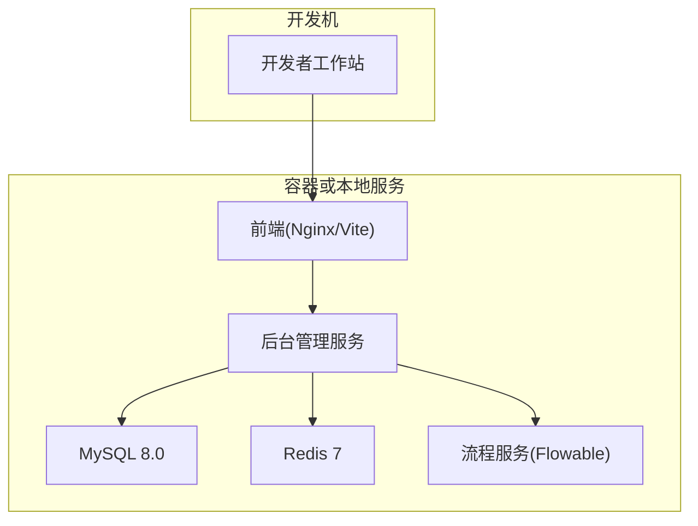
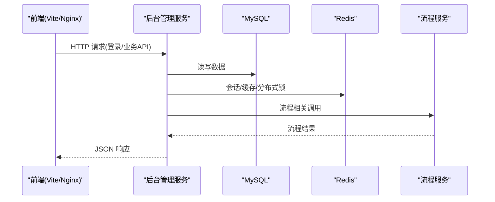
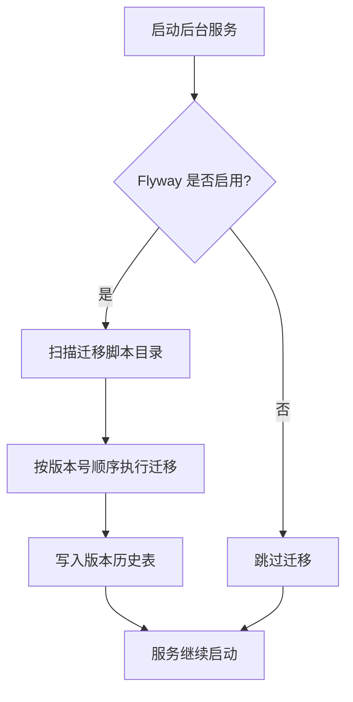
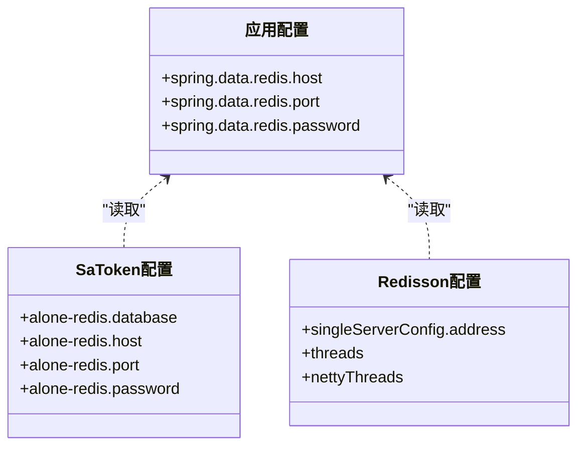
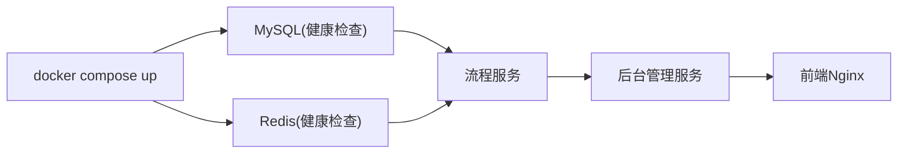
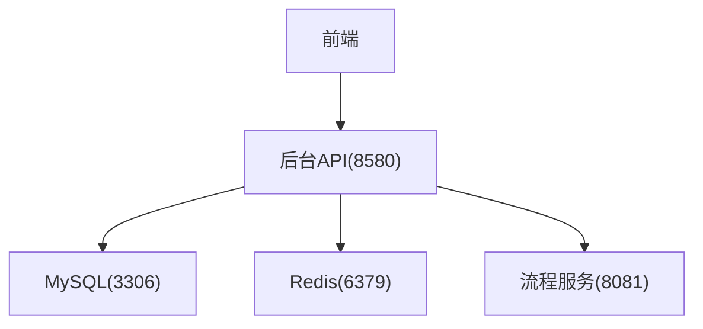

# 开发环境配置

<cite>
**本文引用的文件**
- [README.md](file://README.md)
- [application.yml](file://forge-server/forge-admin-server/src/main/resources/application.yml)
- [application-dev.example.yml](file://forge-server/forge-admin-server/src/main/resources/application-dev.example.yml)
- [docker-compose.yml](file://docker/docker-compose.yml)
- [docker-compose.yml（本地化）](file://docker-forge-admin/docker-compose.yml)
- [Dockerfile.admin](file://docker/Dockerfile.admin)
- [package.json（前端工程）](file://forge-admin-ui/package.json)
- [package.json（根工程）](file://package.json)
</cite>

## 目录
1. [简介](#简介)
2. [项目结构](#项目结构)
3. [核心组件](#核心组件)
4. [架构总览](#架构总览)
5. [详细组件分析](#详细组件分析)
6. [依赖关系分析](#依赖关系分析)
7. [性能注意事项](#性能注意事项)
8. [故障排查指南](#故障排查指南)
9. [结论](#结论)
10. [附录](#附录)

## 简介
本指南面向首次搭建 Forge Admin 开发环境的工程师，覆盖 Node.js、Java、MySQL、Redis 等依赖的安装与配置要求；给出 VS Code、IntelliJ IDEA 的推荐配置与插件建议；说明环境变量、数据库连接、缓存服务初始化步骤；并提供常见问题的定位方法与解决方案。内容基于仓库中的配置文件与脚本进行整理，确保可操作且可追溯。

## 项目结构
Forge Admin 采用前后端分离与多模块后端架构：
- 后端：Spring Boot 3 + Java 17，使用 Maven 多模块组织，包含主后台服务、流程服务、报表服务等。
- 前端：Vue 3 + Vite + pnpm，提供管理端与报表前端。
- 基础设施：MySQL 8.0、Redis 7，支持 Docker Compose 一键拉起。



图表来源
- [docker-compose.yml:11-168](file://docker/docker-compose.yml#L11-L168)
- [docker-compose.yml（本地化）:11-173](file://docker-forge-admin/docker-compose.yml#L11-L173)
- [Dockerfile.admin:1-39](file://docker/Dockerfile.admin#L1-L39)

章节来源
- [README.md:241-259](file://README.md#L241-L259)

## 核心组件
- 运行环境与工具链
  - Java 17（后端运行与构建）
  - Node.js 20.19+（前端开发与构建）
  - pnpm 8+（包管理）
  - MySQL 8.0+（持久化存储）
  - Redis 6.0+（缓存与会话）
- 关键服务
  - 后台管理服务：默认端口 8580
  - 流程服务：默认端口 8081
  - 前端：开发模式默认 3000，生产由 Nginx 代理

章节来源
- [README.md:265-274](file://README.md#L265-L274)
- [application.yml:1-10](file://forge-server/forge-admin-server/src/main/resources/application.yml#L1-L10)
- [package.json（前端工程）:6-18](file://forge-admin-ui/package.json#L6-L18)

## 架构总览
下图展示了开发环境下各组件的交互关系：前端通过代理访问后台接口，后台通过数据源访问 MySQL，使用 Redis 做会话与缓存，并调用流程服务完成工作流相关能力。



图表来源
- [docker-compose.yml:61-132](file://docker/docker-compose.yml#L61-L132)
- [application.yml:97-131](file://forge-server/forge-admin-server/src/main/resources/application.yml#L97-L131)

## 详细组件分析

### 后端服务与环境变量
- 启动参数与 Profile
  - 应用名称：forge-admin-server
  - 默认端口：8580
  - Profile：通过环境变量 SPRING_PROFILES_ACTIVE 控制
- 数据库连接
  - 动态数据源主库 URL、用户名、密码通过 JVM 参数或环境变量注入
- 缓存与会话
  - Sa-Token 使用 Redis 存储 Session
  - Redisson 用于分布式锁与高级特性
- 加密与密钥
  - 支持 Bootstrap 生成并持久化密钥，可通过环境变量开关与路径配置
- 流程服务集成
  - 通过 FLOW_CLIENT_URL 指向流程服务地址

```mermaid
flowchart TD
Start(["进程启动"]) --> LoadEnv["加载环境变量与Profile"]
LoadEnv --> InitDS["初始化数据源(MySQL)"]
InitDS --> InitCache["初始化缓存(Redis/Redisson)"]
InitCache --> InitCrypto["初始化加密与密钥"]
InitCrypto --> InitFlow["初始化流程客户端"]
InitFlow --> Ready([("服务就绪")])
```

图表来源
- [Dockerfile.admin:14-38](file://docker/Dockerfile.admin#L14-L38)
- [application.yml:97-131](file://forge-server/forge-admin-server/src/main/resources/application.yml#L97-L131)
- [application.yml:200-212](file://forge-server/forge-admin-server/src/main/resources/application.yml#L200-L212)

章节来源
- [application.yml:1-10](file://forge-server/forge-admin-server/src/main/resources/application.yml#L1-L10)
- [application.yml:97-131](file://forge-server/forge-admin-server/src/main/resources/application.yml#L97-L131)
- [application.yml:200-212](file://forge-server/forge-admin-server/src/main/resources/application.yml#L200-L212)
- [Dockerfile.admin:14-38](file://docker/Dockerfile.admin#L14-L38)

### 数据库与迁移
- 版本与字符集
  - MySQL 8.0+，推荐 utf8mb4 与对应排序规则
- 迁移策略
  - Flyway 启用，扫描 db/migration 目录执行版本化迁移
  - 基线版本与表名可配置
- 初始化脚本
  - 推荐使用仓库提供的 init-db.sh 脚本执行初始化与可选演示数据导入



图表来源
- [application.yml:65-72](file://forge-server/forge-admin-server/src/main/resources/application.yml#L65-L72)
- [README.md:292-341](file://README.md#L292-L341)

章节来源
- [application.yml:65-72](file://forge-server/forge-admin-server/src/main/resources/application.yml#L65-L72)
- [README.md:292-341](file://README.md#L292-L341)

### 缓存与会话
- Redis 基础配置
  - host、port、database、password、timeout
- Redisson 配置
  - singleServerConfig 中 address、password、线程池与超时等
- Sa-Token 集成
  - alone-redis 配置项读取 spring.data.redis.* 属性



图表来源
- [application-dev.example.yml:35-63](file://forge-server/forge-admin-server/src/main/resources/application-dev.example.yml#L35-L63)
- [application.yml:118-131](file://forge-server/forge-admin-server/src/main/resources/application.yml#L118-L131)

章节来源
- [application-dev.example.yml:35-63](file://forge-server/forge-admin-server/src/main/resources/application-dev.example.yml#L35-L63)
- [application.yml:118-131](file://forge-server/forge-admin-server/src/main/resources/application.yml#L118-L131)

### 前端工程与开发服务器
- 技术栈
  - Vue 3、Vite、Pinia、UnoCSS、Naive UI
- 脚本命令
  - dev：启动开发服务器
  - build/build:prod：构建产物
- 包管理器
  - pnpm（根工程指定版本）

章节来源
- [package.json（前端工程）:1-18](file://forge-admin-ui/package.json#L1-L18)
- [package.json（根工程）:1-10](file://package.json#L1-L10)

### Docker Compose 一键启动
- 服务组成
  - MySQL、Redis、流程服务、后台管理服务、前端 Nginx
- 健康检查
  - MySQL、Redis 提供 healthcheck，保障依赖就绪
- 环境变量
  - MYSQL_*、REDIS_*、FLOW_CLIENT_URL、FORGE_CRYPTO_* 等
- 端口映射
  - 默认暴露 3306、6379、8081、8580、80



图表来源
- [docker-compose.yml:11-168](file://docker/docker-compose.yml#L11-L168)
- [docker-compose.yml（本地化）:11-173](file://docker-forge-admin/docker-compose.yml#L11-L173)

章节来源
- [docker-compose.yml:11-168](file://docker/docker-compose.yml#L11-L168)
- [docker-compose.yml（本地化）:11-173](file://docker-forge-admin/docker-compose.yml#L11-L173)

## 依赖关系分析
- 后端对 MySQL、Redis、流程服务的运行时依赖
- 前端对后端 API 的代理与跨域访问
- 通过环境变量与配置文件解耦不同环境差异



图表来源
- [docker-compose.yml:61-132](file://docker/docker-compose.yml#L61-L132)
- [application.yml:1-10](file://forge-server/forge-admin-server/src/main/resources/application.yml#L1-L10)

章节来源
- [docker-compose.yml:61-132](file://docker/docker-compose.yml#L61-L132)
- [application.yml:1-10](file://forge-server/forge-admin-server/src/main/resources/application.yml#L1-L10)

## 性能注意事项
- 数据库连接池
  - HikariCP 最大连接数、空闲连接、超时等可按负载调优
- 线程模型
  - Undertow IO 与 Worker 线程数影响并发处理能力
- 缓存与锁
  - Redisson 线程池与 Netty 线程数需与 CPU 核数匹配
- 迁移与索引
  - 合理设计 Flyway 脚本与数据库索引，避免全表扫描

章节来源
- [application-dev.example.yml:19-33](file://forge-server/forge-admin-server/src/main/resources/application-dev.example.yml#L19-L33)
- [application.yml:8-21](file://forge-server/forge-admin-server/src/main/resources/application.yml#L8-L21)
- [application-dev.example.yml:50-63](file://forge-server/forge-admin-server/src/main/resources/application-dev.example.yml#L50-L63)

## 故障排查指南
- 首次启动报数据库或 Redis 连接错误
  - 确认已复制 application-dev.example.yml 为 application-dev.yml 并填写正确的 MySQL、Redis 连接信息
- 前端请求后端失败
  - 检查前端代理目标是否指向本地后端端口
- 迁移未执行或报错
  - 检查 Flyway 是否启用、迁移脚本路径是否正确、版本是否单调递增
- 流程服务不可用
  - 确认 FLOW_CLIENT_URL 指向正确地址，流程服务已先于后台服务启动
- 敏感配置泄露
  - 立即更换密钥与密码，清理仓库历史并补充 .gitignore

章节来源
- [README.md:502-519](file://README.md#L502-L519)
- [application.yml:65-72](file://forge-server/forge-admin-server/src/main/resources/application.yml#L65-L72)
- [docker-compose.yml:61-132](file://docker/docker-compose.yml#L61-L132)

## 结论
按照本指南完成 JDK、Node.js、pnpm、MySQL、Redis 的安装与配置后，即可通过本地或 Docker Compose 方式快速启动 Forge Admin 开发环境。建议在开发过程中严格遵循环境变量与配置文件约定，使用 Flyway 管理数据库变更，并通过日志与健康检查定位问题。

## 附录

### 环境安装清单与版本
- Java：17+
- Node.js：20.19+
- pnpm：8+
- MySQL：8.0+
- Redis：6.0+

章节来源
- [README.md:265-274](file://README.md#L265-L274)

### 本地开发启动步骤
- 初始化数据库
  - 使用脚本执行初始化与可选演示数据导入
- 准备本地配置
  - 复制示例配置到 application-dev.yml 并修改数据库与 Redis 连接
- 启动后端
  - 主后台服务、流程服务、报表服务按需启动
- 启动前端
  - 进入前端目录安装依赖并启动开发服务器

章节来源
- [README.md:292-393](file://README.md#L292-L393)

### IDE 推荐配置与插件
- IntelliJ IDEA
  - 安装 Lombok、MyBatisX、Maven Helper、Alibaba Java Coding Guidelines
  - 开启注解处理与自动导入
  - 设置 Spring Boot 运行配置，指定 active profile 与 JVM 参数
- VS Code
  - 安装 Extension Pack for Java、Vue Language Features、ESLint、Prettier
  - 配置 ESLint 与 Prettier 统一代码风格
  - 在 tasks 中封装常用命令（如 pnpm dev、mvn spring-boot:run）

[本节为通用实践建议，不直接引用具体代码文件]

### 环境变量参考
- 数据库
  - MYSQL_HOST、MYSQL_PORT、MYSQL_DB、MYSQL_USER、MYSQL_PASSWORD
- 缓存
  - REDIS_HOST、REDIS_PORT、REDIS_PASSWORD
- 流程服务
  - FLOW_CLIENT_URL
- 加密与安全
  - FORGE_CRYPTO_BOOTSTRAP_ENABLED、FORGE_CRYPTO_BOOTSTRAP_FILE、FORGE_CRYPTO_SECRET_KEY、FORGE_CRYPTO_PERSISTENCE_*、FORGE_AUTH_LEGACY_CLIENT_SECRET_READ_ENABLED

章节来源
- [docker-compose.yml:75-126](file://docker/docker-compose.yml#L75-L126)
- [docker-compose.yml（本地化）:75-129](file://docker-forge-admin/docker-compose.yml#L75-L129)
- [Dockerfile.admin:14-38](file://docker/Dockerfile.admin#L14-L38)