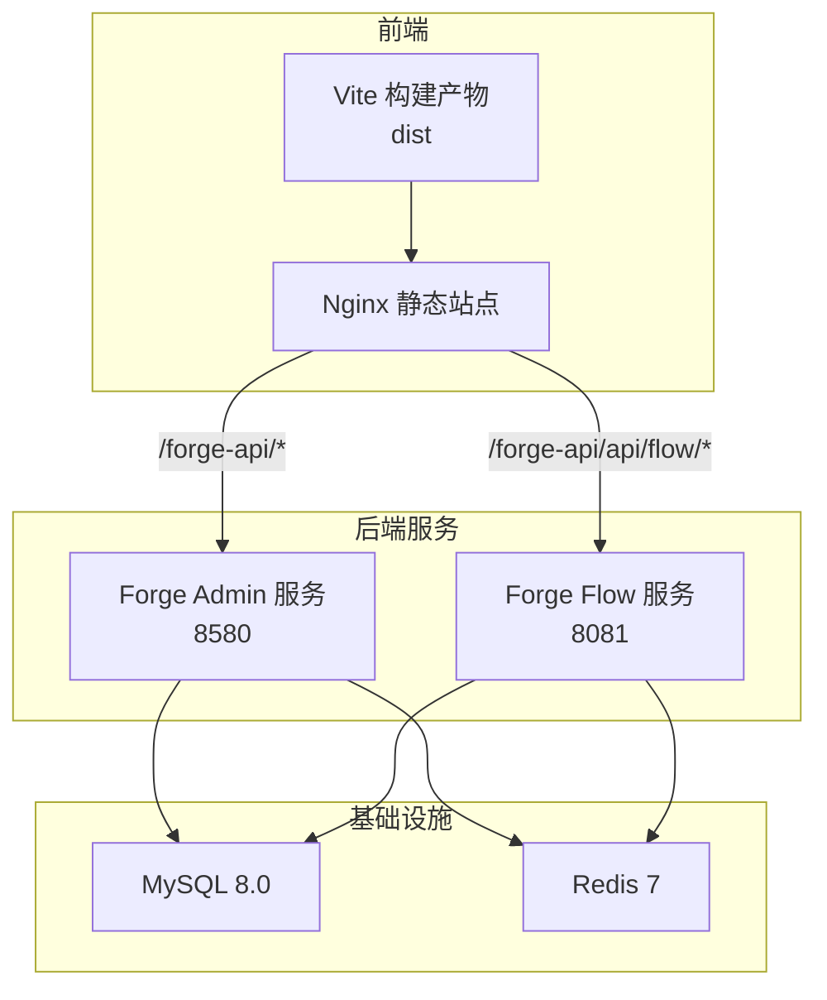
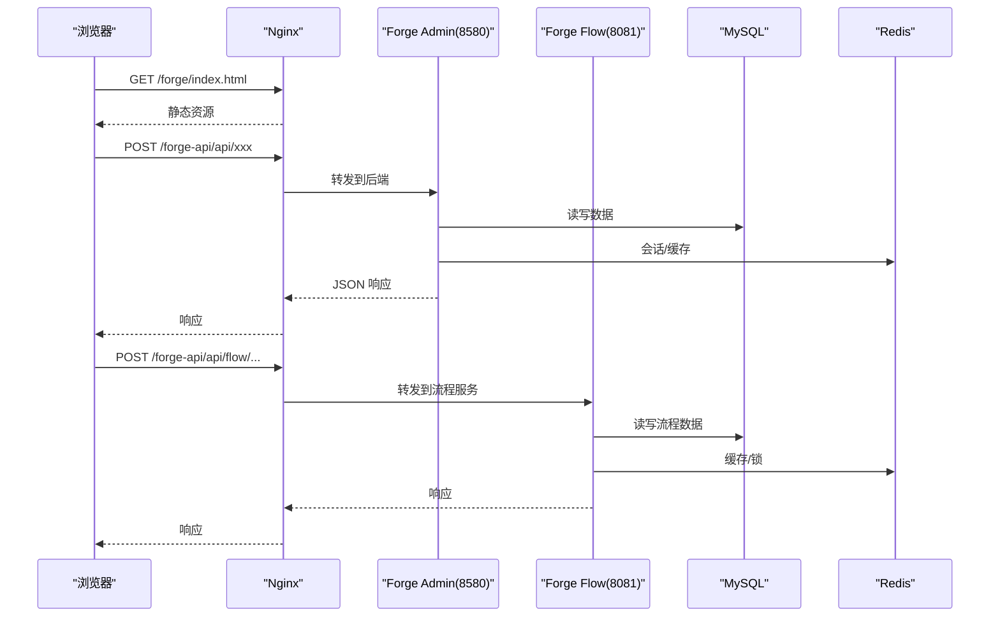
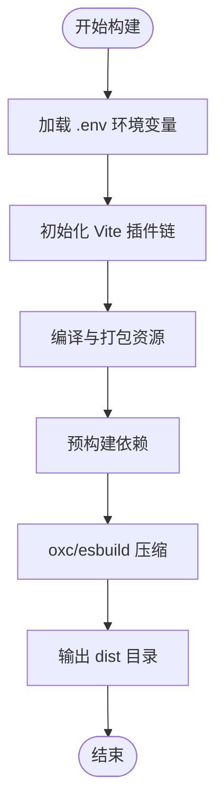
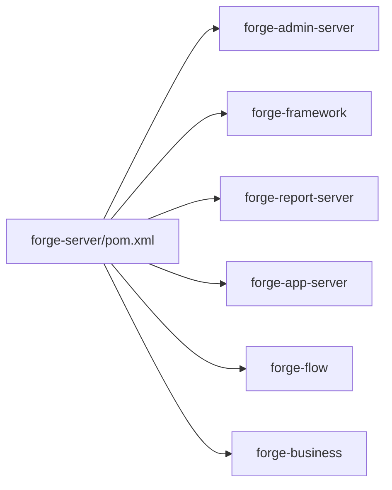
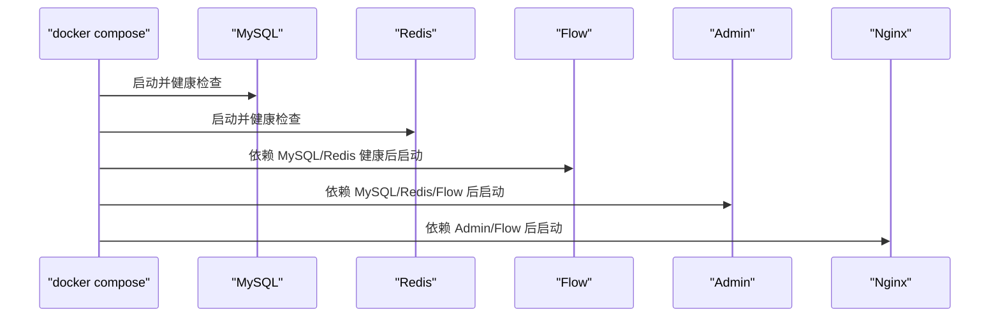
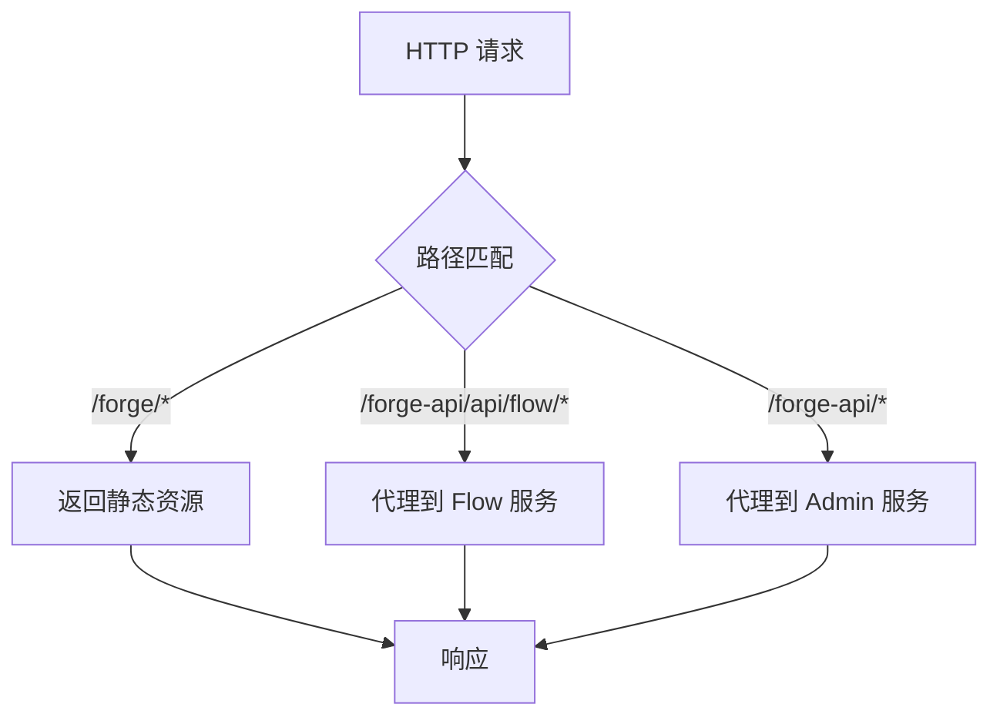
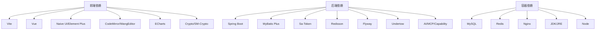

# 构建与部署

<cite>
**本文引用的文件**
- [forge-admin-ui/package.json](file://forge-admin-ui/package.json)
- [forge-admin-ui/vite.config.js](file://forge-admin-ui/vite.config.js)
- [forge-admin-ui/.env.example](file://forge-admin-ui/.env.example)
- [forge-server/pom.xml](file://forge-server/pom.xml)
- [forge-server/forge-admin-server/pom.xml](file://forge-server/forge-admin-server/pom.xml)
- [forge-server/forge-admin-server/src/main/resources/application.yml](file://forge-server/forge-admin-server/src/main/resources/application.yml)
- [docker/docker-compose.yml](file://docker/docker-compose.yml)
- [docker/Dockerfile.admin](file://docker/Dockerfile.admin)
- [docker/Dockerfile.ui](file://docker/Dockerfile.ui)
- [docker/nginx.conf](file://docker/nginx.conf)
- [forge-report-ui/.workflow/master-pipeline.yml](file://forge-report-ui/.workflow/master-pipeline.yml)
- [forge-report-ui/.workflow/branch-pipeline.yml](file://forge-report-ui/.workflow/branch-pipeline.yml)
- [forge-report-ui/.workflow/pr-pipeline.yml](file://forge-report-ui/.workflow/pr-pipeline.yml)
</cite>

## 目录
1. [简介](#简介)
2. [项目结构](#项目结构)
3. [核心组件](#核心组件)
4. [架构总览](#架构总览)
5. [详细组件分析](#详细组件分析)
6. [依赖关系分析](#依赖关系分析)
7. [性能考虑](#性能考虑)
8. [故障排查指南](#故障排查指南)
9. [结论](#结论)
10. [附录](#附录)

## 简介
本指南面向 Forge Admin 的构建与部署，覆盖前端 Vite 打包、后端 Maven 多模块构建、Docker 容器化构建，以及开发环境启动、测试环境部署、生产发布流程。同时给出 CI/CD 流水线配置要点、自动化测试开关、性能优化建议与监控告警设置，并提供常见问题的排查方法与运维最佳实践。

## 项目结构
Forge Admin 采用前后端分离与多服务编排：
- 前端：基于 Vite + Vue 3 的管理界面，位于 forge-admin-ui，提供开发与构建脚本、代理与分包优化配置。
- 后端：基于 Spring Boot 的多模块 Maven 工程，位于 forge-server，包含 admin、flow、report、app、business、framework 等模块。
- 容器化：通过 docker-compose 编排 MySQL、Redis、Flow 服务、Admin 服务与 Nginx 前端静态资源。
- CI/CD：在报告前端子工程中提供了分支/主分支/PR 流水线示例，可作为参考扩展至全仓。

图表来源
- [docker/docker-compose.yml:11-149](file://docker/docker-compose.yml#L11-L149)
- [docker/nginx.conf:1-42](file://docker/nginx.conf#L1-L42)
- [docker/Dockerfile.admin:5-38](file://docker/Dockerfile.admin#L5-L38)
- [docker/Dockerfile.ui:5-16](file://docker/Dockerfile.ui#L5-L16)

章节来源
- [forge-admin-ui/package.json:6-17](file://forge-admin-ui/package.json#L6-L17)
- [forge-server/pom.xml:186-193](file://forge-server/pom.xml#L186-L193)
- [docker/docker-compose.yml:11-149](file://docker/docker-compose.yml#L11-L149)

## 核心组件
- 前端构建（Vite）
  - 开发命令：vite dev
  - 构建命令：node --max_old_space_size=4096 vite build，支持 prod 模式与环境变量注入
  - 插件生态：Vue、JSX、Unocss、自动导入、组件按需解析、路由生成、开发工具、体积分析与警告处理
  - 代理：开发时按前缀将请求转发到后端与流程服务，并支持 WebSocket 代理
  - 构建优化：关闭 sourcemap、使用 oxc 压缩、esbuild 压缩 CSS、控制 chunk 大小与输出目录
- 后端构建（Maven 多模块）
  - 根 POM 管理版本、仓库镜像、Profile（local/dev/prod）、测试开关与统一编译参数
  - 模块划分：admin、flow、report、app、business、framework
  - 插件：Spring Boot repackage、Surefire 测试、Flatten 版本号
- Docker 容器化
  - 多阶段构建：JDK 构建 JAR，Node 构建静态资源
  - Compose 编排：MySQL、Redis、Flow、Admin、Nginx 五服务联动，健康检查与数据卷
  - Nginx 反向代理：静态资源、API 与 Flow API 路径区分与超时配置
- 环境变量与配置
  - 前端 .env.* 控制标题、公共路径、代理目标、SSO 桥接等
  - 后端 application.yml 定义 Undertow、日志、Flyway、Sa-Token、能力开放、加密引导等

章节来源
- [forge-admin-ui/package.json:6-17](file://forge-admin-ui/package.json#L6-L17)
- [forge-admin-ui/vite.config.js:14-173](file://forge-admin-ui/vite.config.js#L14-L173)
- [forge-admin-ui/.env.example:1-38](file://forge-admin-ui/.env.example#L1-L38)
- [forge-server/pom.xml:12-72](file://forge-server/pom.xml#L12-L72)
- [forge-server/pom.xml:186-193](file://forge-server/pom.xml#L186-L193)
- [docker/docker-compose.yml:11-149](file://docker/docker-compose.yml#L11-L149)
- [docker/Dockerfile.admin:5-38](file://docker/Dockerfile.admin#L5-L38)
- [docker/Dockerfile.ui:5-16](file://docker/Dockerfile.ui#L5-L16)
- [docker/nginx.conf:1-42](file://docker/nginx.conf#L1-L42)
- [forge-server/forge-admin-server/src/main/resources/application.yml:1-228](file://forge-server/forge-admin-server/src/main/resources/application.yml#L1-L228)

## 架构总览
下图展示从浏览器到 Nginx、再到后端与流程服务的请求链路，以及数据库与缓存的依赖关系。

图表来源
- [docker/nginx.conf:6-32](file://docker/nginx.conf#L6-L32)
- [docker/docker-compose.yml:61-149](file://docker/docker-compose.yml#L61-L149)

## 详细组件分析

### 前端构建（Vite）
- 开发服务器
  - 端口与代理：根据环境变量配置 HTTP 端口与前缀，将 /api 与 /ws 请求转发到后端与流程服务
  - 路由与组件：启用文件系统路由、按需组件解析、自动导入与 Unocss
- 构建产物
  - 输出目录：可通过环境变量控制
  - 压缩器：使用 oxc 进行 JS 压缩，esbuild 进行 CSS 压缩，关闭源码映射与体积上报以降低内存
  - 预构建依赖：显式 include 大型库，避免首次加载时的二次优化问题
- 环境变量
  - 标题、公共路径、首页路径、SSO 桥接地址、客户端标识等

图表来源
- [forge-admin-ui/vite.config.js:14-173](file://forge-admin-ui/vite.config.js#L14-L173)
- [forge-admin-ui/package.json:6-17](file://forge-admin-ui/package.json#L6-L17)
- [forge-admin-ui/.env.example:1-38](file://forge-admin-ui/.env.example#L1-L38)

章节来源
- [forge-admin-ui/vite.config.js:14-173](file://forge-admin-ui/vite.config.js#L14-L173)
- [forge-admin-ui/package.json:6-17](file://forge-admin-ui/package.json#L6-L17)
- [forge-admin-ui/.env.example:1-38](file://forge-admin-ui/.env.example#L1-L38)

### 后端构建（Maven 多模块）
- 根 POM
  - 统一属性：Java 版本、Spring Boot、框架版本、仓库镜像
  - Profile：local/dev/prod 切换日志级别与激活环境
  - 测试开关：通过属性控制编译与测试执行
- 模块
  - forge-admin-server：聚合系统插件、能力平台、AI、MCP、外部接口代理、数据源、Flyway 迁移等
  - 其他模块：flow、report、app、business、framework
- 插件
  - Surefire：按标签分组执行测试
  - Flatten：CI 友好版本号处理
  - Spring Boot：repackage 生成可执行 JAR

图表来源
- [forge-server/pom.xml:186-193](file://forge-server/pom.xml#L186-L193)
- [forge-server/forge-admin-server/pom.xml:14-155](file://forge-server/forge-admin-server/pom.xml#L14-L155)

章节来源
- [forge-server/pom.xml:12-72](file://forge-server/pom.xml#L12-L72)
- [forge-server/pom.xml:186-193](file://forge-server/pom.xml#L186-L193)
- [forge-server/forge-admin-server/pom.xml:14-155](file://forge-server/forge-admin-server/pom.xml#L14-L155)

### Docker 容器化构建
- 多阶段构建
  - Admin 服务：JDK 构建 JAR，JRE 运行镜像，注入数据库、Redis、Flow 地址等环境变量
  - UI 服务：Node 构建静态资源，Nginx 托管并暴露端口
- Compose 编排
  - 服务顺序：MySQL/Redis 健康检查后启动 Flow，再启动 Admin，最后启动 Nginx
  - 数据持久化：MySQL 与 Redis 数据卷，加密密钥卷
  - 网络：自定义 bridge 网络隔离服务通信

图表来源
- [docker/docker-compose.yml:11-149](file://docker/docker-compose.yml#L11-L149)
- [docker/Dockerfile.admin:5-38](file://docker/Dockerfile.admin#L5-L38)
- [docker/Dockerfile.ui:5-16](file://docker/Dockerfile.ui#L5-L16)

章节来源
- [docker/docker-compose.yml:11-149](file://docker/docker-compose.yml#L11-L149)
- [docker/Dockerfile.admin:5-38](file://docker/Dockerfile.admin#L5-L38)
- [docker/Dockerfile.ui:5-16](file://docker/Dockerfile.ui#L5-L16)

### 反向代理与路由（Nginx）
- 静态资源：/forge/ 指向构建产物目录，支持 SPA 回退
- 流程服务：/forge-api/api/flow/ 优先匹配并转发到 Flow
- 主服务：/forge-api/ 转发到 Admin
- 超时与上传限制：合理设置代理超时与最大请求体

图表来源
- [docker/nginx.conf:6-32](file://docker/nginx.conf#L6-L32)

章节来源
- [docker/nginx.conf:1-42](file://docker/nginx.conf#L1-L42)

### 环境变量与运行时配置
- 前端
  - 标题、公共路径、首页路径、SSO 桥接、客户端标识等
- 后端
  - Undertow 线程与缓冲、日志级别、Flyway 迁移、Sa-Token Redis、能力开放与安全、加密引导、Actuator 健康端点

章节来源
- [forge-admin-ui/.env.example:1-38](file://forge-admin-ui/.env.example#L1-L38)
- [forge-server/forge-admin-server/src/main/resources/application.yml:1-228](file://forge-server/forge-admin-server/src/main/resources/application.yml#L1-L228)

## 依赖关系分析
- 前端依赖
  - Vite、Vue、UI 组件库、编辑器、图表、加密库等
  - 构建期依赖：ESLint、Vitest、UnoCSS、自动导入与组件解析
- 后端依赖
  - Spring Boot、MyBatis Plus、Sa-Token、Redisson、Flyway、Undertow、AI/MCP/能力平台等
- 容器依赖
  - MySQL、Redis、Nginx、JDK/JRE、Node

图表来源
- [forge-admin-ui/package.json:19-105](file://forge-admin-ui/package.json#L19-L105)
- [forge-server/forge-admin-server/pom.xml:14-155](file://forge-server/forge-admin-server/pom.xml#L14-L155)
- [docker/docker-compose.yml:11-149](file://docker/docker-compose.yml#L11-L149)

章节来源
- [forge-admin-ui/package.json:19-105](file://forge-admin-ui/package.json#L19-L105)
- [forge-server/forge-admin-server/pom.xml:14-155](file://forge-server/forge-admin-server/pom.xml#L14-L155)
- [docker/docker-compose.yml:11-149](file://docker/docker-compose.yml#L11-L149)

## 性能考虑
- 前端
  - 构建期：关闭 sourcemap、使用 oxc 压缩、esbuild 压缩 CSS、控制 chunk 大小与输出目录，减少内存占用
  - 依赖预构建：显式 include 大依赖，避免首次加载时的二次优化导致超时或 504
  - 代理优化：开发时合理设置代理超时与重写规则，减少跨域与重定向开销
- 后端
  - Undertow 线程池与缓冲：根据负载调整 IO 与 worker 线程数
  - 文件上传：限制单文件与总请求大小，避免阻塞
  - Flyway 迁移：确保迁移脚本幂等与高效
- 容器
  - JVM 参数：根据容器资源设置堆大小与线程数
  - Nginx：开启 gzip、合理设置超时与连接数
  - 数据卷：持久化关键数据，避免重启丢失

[本节为通用指导，不直接分析具体文件]

## 故障排查指南
- 前端
  - 构建内存不足：增大 Node 堆空间或使用 oxc 压缩；检查是否生成了过大的 chunk
  - 首次加载慢：确认依赖预构建列表是否包含大型库；检查代理目标是否正确
  - 路由警告：已内置移除非必要的动态路由警告插件
- 后端
  - 启动失败：检查数据库、Redis、Flow 地址与凭据；查看 Flyway 迁移是否成功
  - 认证与会话：确认 Sa-Token Redis 配置与密码；检查 Actuator 健康端点
  - 能力开放与安全：根据环境变量控制 MCP、能力网关、高敏感动作开关
- 容器
  - 服务依赖：确保 MySQL/Redis 健康后再启动 Flow/Admin；检查端口冲突
  - 代理超时：调整 Nginx 代理超时时间；检查后端响应耗时
  - 日志定位：查看各容器日志，结合 TraceId 与错误码定位问题

章节来源
- [forge-admin-ui/vite.config.js:120-173](file://forge-admin-ui/vite.config.js#L120-L173)
- [forge-server/forge-admin-server/src/main/resources/application.yml:1-228](file://forge-server/forge-admin-server/src/main/resources/application.yml#L1-L228)
- [docker/docker-compose.yml:11-149](file://docker/docker-compose.yml#L11-L149)
- [docker/nginx.conf:1-42](file://docker/nginx.conf#L1-L42)

## 结论
本项目通过 Vite 高效构建前端、Maven 多模块统一管理后端、Docker Compose 一键编排服务，形成完整的开发与交付闭环。建议在 CI/CD 中引入统一的构建与测试步骤，结合监控与告警提升稳定性与可观测性。遵循本文的最佳实践，可有效降低构建失败率、缩短发布周期并提高线上稳定性。

[本节为总结，不直接分析具体文件]

## 附录

### 开发环境启动
- 前置条件
  - Node 18+、pnpm 8+、Java 17、Maven、Docker
- 前端开发
  - 进入 forge-admin-ui，安装依赖后执行开发命令
  - 配置 .env 中的代理目标与公共路径
- 后端开发
  - 在 forge-server 根目录选择 profile 并构建指定模块
  - 配置 application.yml 中的数据库、Redis、Flow 地址
- 容器化本地运行
  - 在 docker 目录复制环境变量模板并修改，执行编排启动

章节来源
- [forge-admin-ui/package.json:6-17](file://forge-admin-ui/package.json#L6-L17)
- [forge-admin-ui/.env.example:1-38](file://forge-admin-ui/.env.example#L1-L38)
- [forge-server/pom.xml:74-127](file://forge-server/pom.xml#L74-L127)
- [docker/docker-compose.yml:1-168](file://docker/docker-compose.yml#L1-L168)

### 测试环境部署
- 构建产物
  - 前端：执行构建命令生成 dist
  - 后端：使用 prod profile 构建 JAR
- 容器编排
  - 使用 docker-compose 启动完整环境，验证健康检查与服务依赖
- 代理与域名
  - 配置 Nginx 反向代理与域名解析，设置合理的超时与上传限制

章节来源
- [forge-admin-ui/package.json:6-17](file://forge-admin-ui/package.json#L6-L17)
- [forge-server/pom.xml:74-127](file://forge-server/pom.xml#L74-L127)
- [docker/docker-compose.yml:11-149](file://docker/docker-compose.yml#L11-L149)
- [docker/nginx.conf:1-42](file://docker/nginx.conf#L1-L42)

### 生产环境发布流程
- 代码合并与触发
  - 推送至主干分支触发流水线，执行构建与制品发布
- 构建与制品
  - 前端：构建 dist 并上传制品库
  - 后端：构建 JAR 并上传制品库
- 部署与验证
  - 拉取最新镜像或制品，部署到生产集群
  - 验证健康端点、核心业务与集成服务连通性

章节来源
- [forge-report-ui/.workflow/master-pipeline.yml:1-50](file://forge-report-ui/.workflow/master-pipeline.yml#L1-L50)
- [forge-report-ui/.workflow/branch-pipeline.yml:1-33](file://forge-report-ui/.workflow/branch-pipeline.yml#L1-L33)
- [forge-report-ui/.workflow/pr-pipeline.yml:1-36](file://forge-report-ui/.workflow/pr-pipeline.yml#L1-L36)

### CI/CD 流水线配置要点
- 分支流水线
  - 编译阶段执行依赖安装与构建，产出 dist 并暂存
  - 上传制品供下游任务使用
- 主分支流水线
  - 在主分支推送时执行构建与制品发布，支持版本自增
- PR 流水线
  - 对合并请求执行编译与制品上传，保障代码质量

章节来源
- [forge-report-ui/.workflow/branch-pipeline.yml:1-33](file://forge-report-ui/.workflow/branch-pipeline.yml#L1-L33)
- [forge-report-ui/.workflow/master-pipeline.yml:1-50](file://forge-report-ui/.workflow/master-pipeline.yml#L1-L50)
- [forge-report-ui/.workflow/pr-pipeline.yml:1-36](file://forge-report-ui/.workflow/pr-pipeline.yml#L1-L36)

### 自动化测试
- 前端
  - 使用 Vitest 执行单元测试与 UI 测试，支持 watch 与 UI 模式
- 后端
  - 通过 Maven Surefire 执行测试，支持按标签分组与排除特定测试
  - 可通过 profile 控制测试执行范围

章节来源
- [forge-admin-ui/package.json:6-17](file://forge-admin-ui/package.json#L6-L17)
- [forge-server/pom.xml:240-253](file://forge-server/pom.xml#L240-L253)
- [forge-server/pom.xml:102-127](file://forge-server/pom.xml#L102-L127)

### 性能优化与监控告警
- 性能优化
  - 前端：关闭 sourcemap、使用 oxc/esbuild、控制 chunk 大小、预构建依赖
  - 后端：调整 Undertow 线程与缓冲、限制上传大小、Flyway 迁移优化
  - 容器：JVM 参数调优、Nginx gzip 与超时配置
- 监控告警
  - 后端暴露健康端点，便于探针检测
  - 结合日志与错误诊断，建立告警规则（如启动失败、数据库不可用、代理超时）

章节来源
- [forge-admin-ui/vite.config.js:160-173](file://forge-admin-ui/vite.config.js#L160-L173)
- [forge-server/forge-admin-server/src/main/resources/application.yml:1-228](file://forge-server/forge-admin-server/src/main/resources/application.yml#L1-L228)
- [docker/nginx.conf:1-42](file://docker/nginx.conf#L1-L42)

### 运维最佳实践
- 配置管理
  - 使用环境变量与配置文件分离，避免硬编码敏感信息
- 安全加固
  - 限制公网暴露端口，仅暴露 Nginx；数据库与缓存内网访问
  - 启用加密引导与能力开放的安全开关
- 可观测性
  - 统一日志格式与 TraceId，集中收集与分析
  - 健康检查与探针，配合告警策略
- 变更管理
  - 通过流水线进行灰度发布与回滚，确保变更可控

[本节为通用指导，不直接分析具体文件]