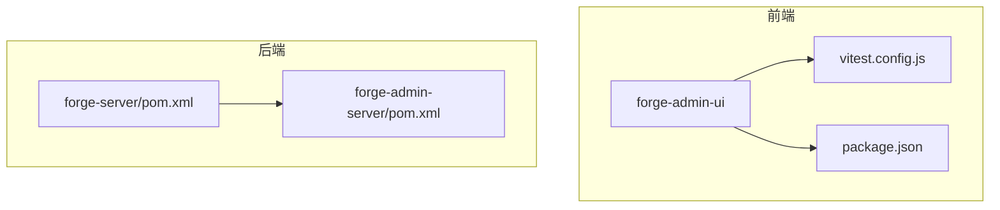
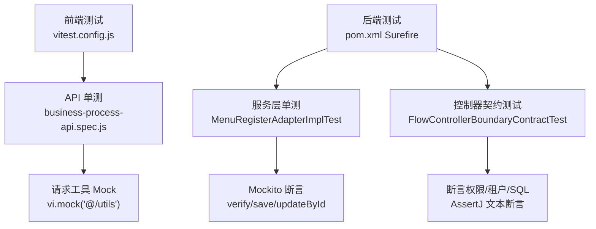
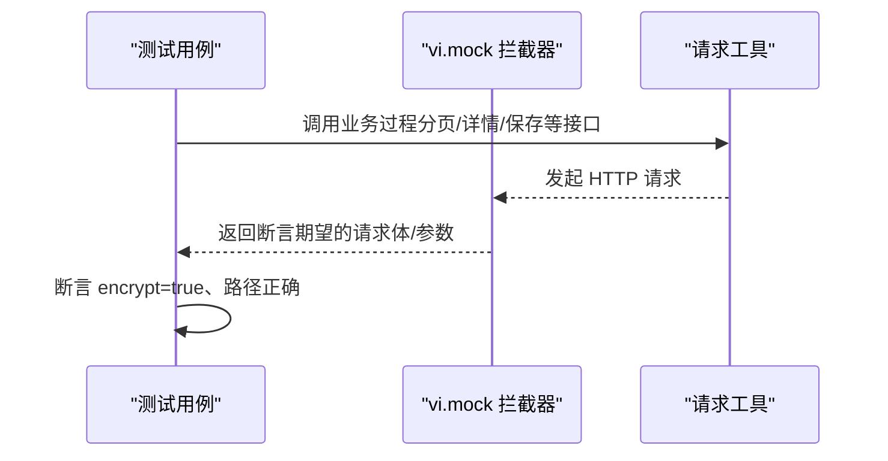
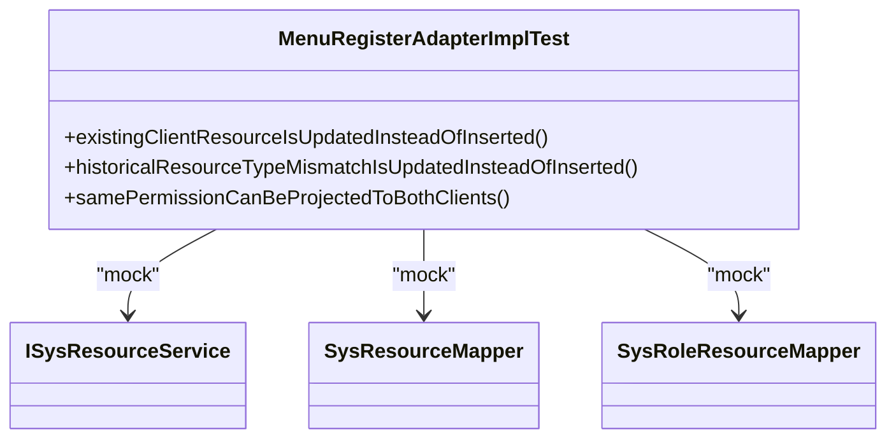
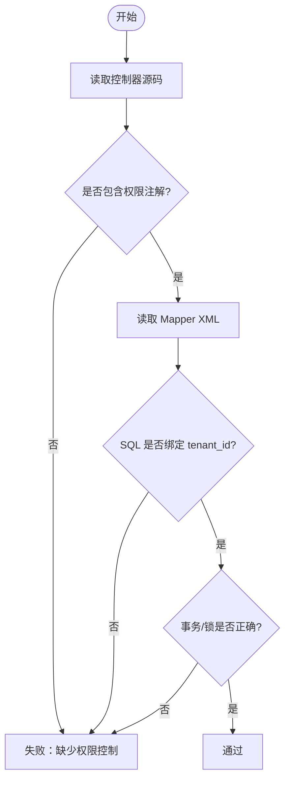
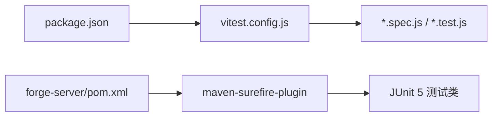

# 测试策略

<cite>
**本文引用的文件**
- [forge-admin-ui/vitest.config.js](file://forge-admin-ui/vitest.config.js)
- [forge-admin-ui/package.json](file://forge-admin-ui/package.json)
- [forge-admin-ui/src/api/__tests__/business-process-api.spec.js](file://forge-admin-ui/src/api/__tests__/business-process-api.spec.js)
- [forge-admin-ui/src/components/job/__tests__/cron-builder.test.js](file://forge-admin-ui/src/components/job/__tests__/cron-builder.test.js)
- [forge-server/pom.xml](file://forge-server/pom.xml)
- [forge-server/forge-admin-server/pom.xml](file://forge-server/forge-admin-server/pom.xml)
- [forge-server/forge-admin-server/src/test/java/com/mdframe/forge/admin/bridge/MenuRegisterAdapterImplTest.java](file://forge-server/forge-admin-server/src/test/java/com/mdframe/forge/admin/bridge/MenuRegisterAdapterImplTest.java)
- [forge-server/forge-flow/forge-flow-server/src/test/java/com/mdframe/forge/flow/controller/FlowControllerBoundaryContractTest.java](file://forge-server/forge-flow/forge-flow-server/src/test/java/com/mdframe/forge/flow/controller/FlowControllerBoundaryContractTest.java)
</cite>

## 目录
1. [简介](#简介)
2. [项目结构](#项目结构)
3. [核心组件](#核心组件)
4. [架构总览](#架构总览)
5. [详细组件分析](#详细组件分析)
6. [依赖分析](#依赖分析)
7. [性能考虑](#性能考虑)
8. [故障排查指南](#故障排查指南)
9. [结论](#结论)
10. [附录](#附录)

## 简介
本指南面向 Forge Admin 项目的测试策略与落地实践，覆盖单元测试、集成测试、端到端测试的编写规范与执行流程。重点说明：
- 前端测试：基于 Vitest + jsdom + Vue 插件，提供组件与 API 层的单测范式、覆盖率统计与质量门禁建议。
- 后端测试：基于 JUnit 5 + Mockito，结合 Spring Boot Test，给出控制器边界契约测试、服务层断言与外部依赖隔离的实践。
- 测试数据与环境：统一通过配置与脚本管理，保证可重复、可隔离、可观测。
- 覆盖率与质量门禁：以 v8 为覆盖率提供者，配合 CI 阶段阈值检查，保障代码质量。
- 最佳实践与常见问题：从命名、Mock、异步、事务、权限与租户隔离等角度总结经验与排错方法。

## 项目结构
Forge Admin 采用前后端分离的多模块工程：
- 前端（forge-admin-ui）：使用 Vite 构建，Vitest 独立配置文件，测试用例集中在 src/**/__tests__ 下，支持 .spec/.test 后缀。
- 后端（forge-server）：Maven 多模块聚合工程，通过 maven-surefire-plugin 统一执行 JUnit 5 测试，支持按 profile 控制是否编译与运行测试。

**图表来源**
- [forge-admin-ui/vitest.config.js:1-36](file://forge-admin-ui/vitest.config.js#L1-L36)
- [forge-admin-ui/package.json:1-107](file://forge-admin-ui/package.json#L1-L107)
- [forge-server/pom.xml:1-370](file://forge-server/pom.xml#L1-L370)
- [forge-server/forge-admin-server/pom.xml:1-190](file://forge-server/forge-admin-server/pom.xml#L1-L190)

**章节来源**
- [forge-admin-ui/vitest.config.js:1-36](file://forge-admin-ui/vitest.config.js#L1-L36)
- [forge-admin-ui/package.json:1-107](file://forge-admin-ui/package.json#L1-L107)
- [forge-server/pom.xml:1-370](file://forge-server/pom.xml#L1-L370)
- [forge-server/forge-admin-server/pom.xml:1-190](file://forge-server/forge-admin-server/pom.xml#L1-L190)

## 核心组件
- 前端测试栈
  - 框架：Vitest（测试运行时）、jsdom（浏览器环境模拟）、@vitejs/plugin-vue（解析 .vue 文件）。
  - 入口：vitest.config.js 定义 include、coverage、alias 等；package.json 提供 test/test:watch/test:ui 脚本。
  - 示例：API 层单测通过 vi.mock 拦截请求工具，验证加密参数与端点路径；业务逻辑单测验证 cron 表达式构建与解析。
- 后端测试栈
  - 框架：JUnit 5（测试框架）、Spring Boot Test（上下文）、Mockito（依赖隔离）。
  - 入口：父级 pom.xml 通过 maven-surefire-plugin 统一配置 groups/excludedGroups，enable-tests profile 控制编译与测试开关。
  - 示例：服务层适配器测试通过 mock 资源服务与 Mapper，断言更新/插入行为；控制器边界契约测试校验权限、租户隔离、SQL 语义与事务边界。

**章节来源**
- [forge-admin-ui/vitest.config.js:1-36](file://forge-admin-ui/vitest.config.js#L1-L36)
- [forge-admin-ui/package.json:1-107](file://forge-admin-ui/package.json#L1-L107)
- [forge-admin-ui/src/api/__tests__/business-process-api.spec.js:1-75](file://forge-admin-ui/src/api/__tests__/business-process-api.spec.js#L1-L75)
- [forge-admin-ui/src/components/job/__tests__/cron-builder.test.js:1-26](file://forge-admin-ui/src/components/job/__tests__/cron-builder.test.js#L1-L26)
- [forge-server/pom.xml:1-370](file://forge-server/pom.xml#L1-L370)
- [forge-server/forge-admin-server/pom.xml:1-190](file://forge-server/forge-admin-server/pom.xml#L1-L190)
- [forge-server/forge-admin-server/src/test/java/com/mdframe/forge/admin/bridge/MenuRegisterAdapterImplTest.java:1-120](file://forge-server/forge-admin-server/src/test/java/com/mdframe/forge/admin/bridge/MenuRegisterAdapterImplTest.java#L1-L120)
- [forge-server/forge-flow/forge-flow-server/src/test/java/com/mdframe/forge/flow/controller/FlowControllerBoundaryContractTest.java:1-316](file://forge-server/forge-flow/forge-flow-server/src/test/java/com/mdframe/forge/flow/controller/FlowControllerBoundaryContractTest.java#L1-L316)

## 架构总览
下图展示前后端测试在工程中的位置与关键配置关系，以及典型调用链：前端 API 单测通过 vi.mock 拦截请求；后端控制器契约测试读取源码与 SQL 进行断言。

**图表来源**
- [forge-admin-ui/vitest.config.js:1-36](file://forge-admin-ui/vitest.config.js#L1-L36)
- [forge-admin-ui/src/api/__tests__/business-process-api.spec.js:1-75](file://forge-admin-ui/src/api/__tests__/business-process-api.spec.js#L1-L75)
- [forge-server/pom.xml:1-370](file://forge-server/pom.xml#L1-L370)
- [forge-server/forge-admin-server/src/test/java/com/mdframe/forge/admin/bridge/MenuRegisterAdapterImplTest.java:1-120](file://forge-server/forge-admin-server/src/test/java/com/mdframe/forge/admin/bridge/MenuRegisterAdapterImplTest.java#L1-L120)
- [forge-server/forge-flow/forge-flow-server/src/test/java/com/mdframe/forge/flow/controller/FlowControllerBoundaryContractTest.java:1-316](file://forge-server/forge-flow/forge-flow-server/src/test/java/com/mdframe/forge/flow/controller/FlowControllerBoundaryContractTest.java#L1-L316)

## 详细组件分析

### 前端测试（Vitest）
- 环境与配置
  - 使用 jsdom 提供 DOM 能力，仅启用 @vitejs/plugin-vue 解析 .vue，避免启动时加载过多插件。
  - 测试文件匹配规则：src/**/__tests__/**/*.{spec,test}.{js,ts}。
  - 覆盖率：v8 提供者，输出 text/html，默认仅对 flow-designer 组件目录生成报告，排除测试与 index 入口。
- 执行方式
  - npm scripts：test（单次运行）、test:watch（监听模式）、test:ui（可视化界面）。
- 示例：API 层单测
  - 通过 vi.mock 拦截请求工具，验证各接口是否携带加密标志与正确路径。
- 示例：工具函数单测
  - 验证 cron 表达式构建与解析的边界情况，保持复杂表达式在专家模式下不被破坏。

**图表来源**
- [forge-admin-ui/src/api/__tests__/business-process-api.spec.js:1-75](file://forge-admin-ui/src/api/__tests__/business-process-api.spec.js#L1-L75)

**章节来源**
- [forge-admin-ui/vitest.config.js:1-36](file://forge-admin-ui/vitest.config.js#L1-L36)
- [forge-admin-ui/package.json:1-107](file://forge-admin-ui/package.json#L1-L107)
- [forge-admin-ui/src/api/__tests__/business-process-api.spec.js:1-75](file://forge-admin-ui/src/api/__tests__/business-process-api.spec.js#L1-L75)
- [forge-admin-ui/src/components/job/__tests__/cron-builder.test.js:1-26](file://forge-admin-ui/src/components/job/__tests__/cron-builder.test.js#L1-L26)

### 后端测试（JUnit 5 + Mockito）
- 执行与过滤
  - 通过 maven-surefire-plugin 的 groups/excludedGroups 控制测试集，enable-tests profile 开启编译与测试。
- 示例：服务层适配器测试
  - 使用 Mockito mock 资源服务与 Mapper，断言“已存在资源应更新而非插入”、“历史类型不匹配应更新”、“同一权限投影到多客户端”的行为。
- 示例：控制器边界契约测试
  - 读取控制器与 Mapper XML，断言不使用 MyBatis Wrapper/Mapper 直接访问、清理 SQL 保留逻辑/物理删除语义、权限与租户隔离、事务边界与错误信息稳定性等。

**图表来源**
- [forge-server/forge-admin-server/src/test/java/com/mdframe/forge/admin/bridge/MenuRegisterAdapterImplTest.java:1-120](file://forge-server/forge-admin-server/src/test/java/com/mdframe/forge/admin/bridge/MenuRegisterAdapterImplTest.java#L1-L120)

**图表来源**
- [forge-server/forge-flow/forge-flow-server/src/test/java/com/mdframe/forge/flow/controller/FlowControllerBoundaryContractTest.java:1-316](file://forge-server/forge-flow/forge-flow-server/src/test/java/com/mdframe/forge/flow/controller/FlowControllerBoundaryContractTest.java#L1-L316)

**章节来源**
- [forge-server/pom.xml:1-370](file://forge-server/pom.xml#L1-L370)
- [forge-server/forge-admin-server/src/test/java/com/mdframe/forge/admin/bridge/MenuRegisterAdapterImplTest.java:1-120](file://forge-server/forge-admin-server/src/test/java/com/mdframe/forge/admin/bridge/MenuRegisterAdapterImplTest.java#L1-L120)
- [forge-server/forge-flow/forge-flow-server/src/test/java/com/mdframe/forge/flow/controller/FlowControllerBoundaryContractTest.java:1-316](file://forge-server/forge-flow/forge-flow-server/src/test/java/com/mdframe/forge/flow/controller/FlowControllerBoundaryContractTest.java#L1-L316)

### 端到端测试（E2E）建议
- 目标：验证用户完整业务流程（登录→创建→审批→归档），覆盖跨模块交互。
- 建议方案：
  - 前端：Playwright/Cypress + 本地或容器化 UI 实例，配合 Mock 后端或 Testcontainers 启动真实服务。
  - 后端：Testcontainers 启动 MySQL/Redis/Flowable 等依赖，注入测试数据，执行 REST 调用并断言状态机流转。
- 数据与环境：
  - 使用 Flyway 迁移脚本初始化数据库，种子数据放在固定目录，确保幂等与可回滚。
  - 环境变量区分 dev/stage/prod，测试专用配置与生产隔离。

[本节为概念性指导，不直接分析具体文件]

## 依赖分析
- 前端依赖
  - vitest、jsdom、@vitejs/plugin-vue、@vue/test-utils（可选用于组件挂载）。
  - 通过 package.json 的 scripts 统一管理测试命令。
- 后端依赖
  - spring-boot-starter-test（含 JUnit 5、Mockito、AssertJ）。
  - maven-surefire-plugin 统一执行测试，支持分组与排除。
  - enable-tests profile 控制编译与测试开关，便于 CI 按需执行。

**图表来源**
- [forge-admin-ui/package.json:1-107](file://forge-admin-ui/package.json#L1-L107)
- [forge-admin-ui/vitest.config.js:1-36](file://forge-admin-ui/vitest.config.js#L1-L36)
- [forge-server/pom.xml:1-370](file://forge-server/pom.xml#L1-L370)

**章节来源**
- [forge-admin-ui/package.json:1-107](file://forge-admin-ui/package.json#L1-L107)
- [forge-admin-ui/vitest.config.js:1-36](file://forge-admin-ui/vitest.config.js#L1-L36)
- [forge-server/pom.xml:1-370](file://forge-server/pom.xml#L1-L370)

## 性能考虑
- 前端
  - 使用独立的 vitest.config.js 减少插件加载，提升启动速度。
  - 合理拆分测试套件，避免全量扫描；利用 include 精确匹配。
  - 覆盖率仅针对关键目录（如 flow-designer），降低报告体积与生成时间。
- 后端
  - 通过 exclude 与 excludedGroups 跳过耗时或不稳定测试。
  - 使用 Mockito 隔离外部依赖，避免网络/IO 开销。
  - 在 CI 中并行执行测试任务，缩短反馈周期。

[本节提供通用指导，不直接分析具体文件]

## 故障排查指南
- 前端
  - 组件无法解析：确认 vitest.config.js 已引入 @vitejs/plugin-vue 且 alias 指向 src。
  - Pinia 注入失败：在组件测试中使用 createTestingPinia 并配置 createSpy。
  - 请求未触发：检查 vi.mock 的路径与模块名是否与生产一致。
- 后端
  - 测试被跳过：确认 enable-tests profile 已激活，surefire skip 参数为 false。
  - 权限/租户断言失败：核对控制器注解与 SQL 中 tenant_id 绑定。
  - 事务异常：检查 @Transactional 配置与异常传播策略，避免吞掉异常导致状态不一致。

**章节来源**
- [forge-admin-ui/vitest.config.js:1-36](file://forge-admin-ui/vitest.config.js#L1-L36)
- [forge-server/pom.xml:1-370](file://forge-server/pom.xml#L1-L370)
- [forge-server/forge-flow/forge-flow-server/src/test/java/com/mdframe/forge/flow/controller/FlowControllerBoundaryContractTest.java:1-316](file://forge-server/forge-flow/forge-flow-server/src/test/java/com/mdframe/forge/flow/controller/FlowControllerBoundaryContractTest.java#L1-L316)

## 结论
Forge Admin 的测试体系以前端 Vitest 与后端 JUnit+Mockito 为核心，辅以契约测试与覆盖率统计，形成从单元到边界的完整质量保障。建议在 CI 中固化测试命令与覆盖率阈值，持续回归关键路径，确保交付质量与稳定性。

[本节为总结性内容，不直接分析具体文件]

## 附录

### 测试数据准备与环境搭建
- 数据库
  - 使用 Flyway 迁移脚本初始化，种子数据集中管理，保证幂等。
  - 测试环境建议使用内存库或 Testcontainers 快速拉起。
- 缓存与消息
  - 使用嵌入式或容器化 Redis/MQ，避免污染本地环境。
- 配置隔离
  - 通过 profiles 区分 local/dev/prod，测试专用配置与生产解耦。

[本节为通用指导，不直接分析具体文件]

### 覆盖率统计与质量门禁
- 前端
  - 使用 v8 提供者，输出 text/html；建议将覆盖率纳入 PR 检查，设置最低阈值。
- 后端
  - 可通过 JaCoCo 插件集成覆盖率统计（若需扩展），在 CI 中阻断低于阈值的合并。

**章节来源**
- [forge-admin-ui/vitest.config.js:1-36](file://forge-admin-ui/vitest.config.js#L1-L36)

### 最佳实践清单
- 命名与组织
  - 前端：*.spec.js/*.test.js，放置于 __tests__ 目录；后端：*Test.java。
- Mock 策略
  - 优先 Mock 外部依赖（网络、DB、第三方 SDK），聚焦被测单元逻辑。
- 异步与并发
  - 前端：等待 Promise/微任务完成后再断言；后端：注意线程安全与事务边界。
- 权限与租户
  - 所有涉及数据的接口必须校验权限与租户隔离，契约测试应覆盖此类场景。
- 可观测性
  - 测试日志与断言失败信息要清晰，便于定位问题。

[本节为通用指导，不直接分析具体文件]