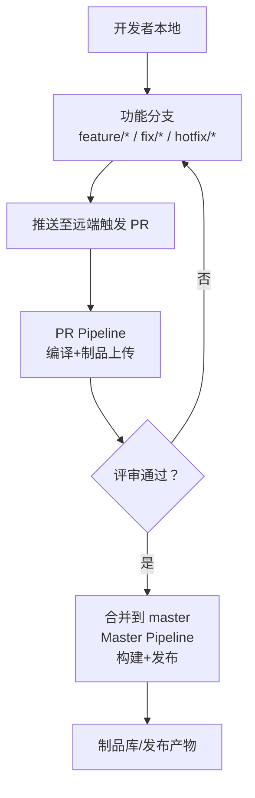
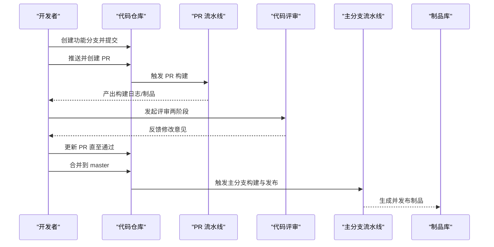
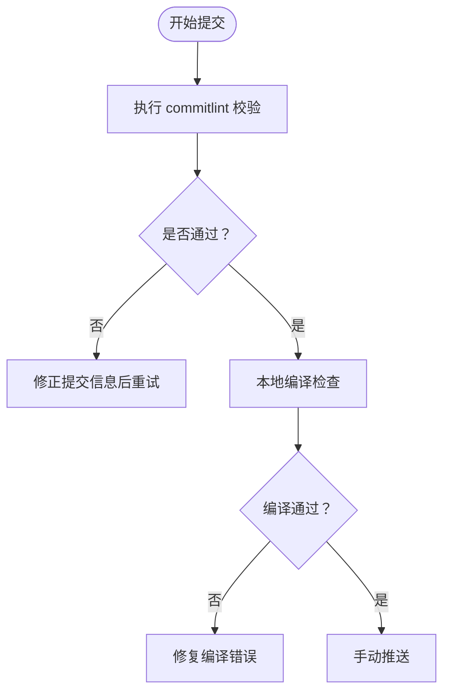
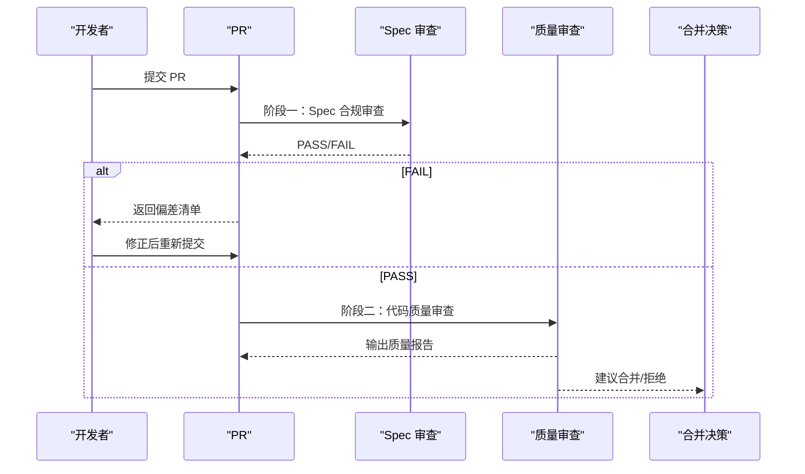
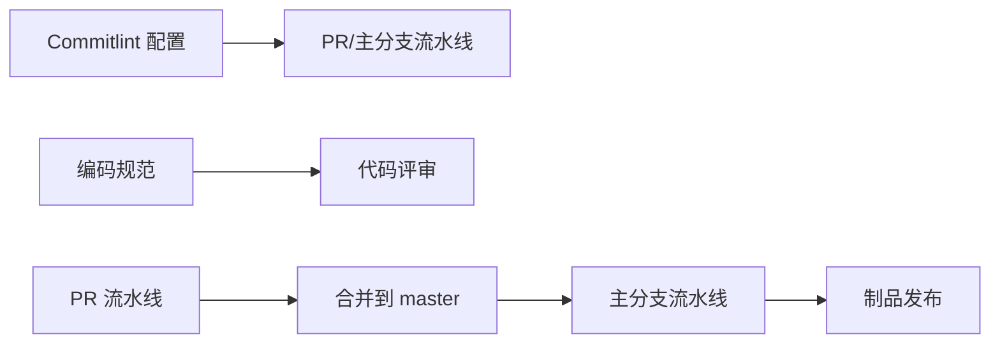

# 版本控制工作流

<cite>
**本文引用的文件**
- [.pull_request_template.md](file://.pull_request_template.md)
- [branch-pipeline.yml](file://forge-report-ui/.workflow/branch-pipeline.yml)
- [master-pipeline.yml](file://forge-report-ui/.workflow/master-pipeline.yml)
- [pr-pipeline.yml](file://forge-report-ui/.workflow/pr-pipeline.yml)
- [commitlint 配置](file://forge-report-ui/.commitlintrc.js)
- [编码规范（含 Git 提交规范）](file://code-copilot/rules/coding-style.md)
- [代码审查命令说明](file://.opencode/commands/review.md)
- [质量审查员规则](file://code-copilot/agents/code-quality-reviewer.md)
- [根级忽略规则](file://.gitignore)
</cite>

## 目录
1. [简介](#简介)
2. [项目结构](#项目结构)
3. [核心组件](#核心组件)
4. [架构总览](#架构总览)
5. [详细组件分析](#详细组件分析)
6. [依赖关系分析](#依赖关系分析)
7. [性能与效率考量](#性能与效率考量)
8. [故障排查指南](#故障排查指南)
9. [结论](#结论)
10. [附录](#附录)

## 简介
本规范面向 Forge Admin 项目的团队协作，统一版本控制工作流，覆盖分支策略、提交信息规范、代码审查流程、Pull Request 模板使用、冲突解决、合并策略与回滚机制，并给出最佳实践与常见问题解决方案。目标是让多人协作更高效、可追溯、可回滚、可审计。

## 项目结构
仓库包含前端、后端、报告 UI、Docker 编排与 CI 流水线等。其中与版本控制直接相关的配置集中在：
- 根级 Pull Request 模板
- 报告前端的工作流流水线（分支构建、PR 构建、主分支发布）
- Commitlint 配置（提交信息规范）
- 编码规范中的 Git 提交约定
- 根级 .gitignore（避免敏感配置入库）

**图示来源**
- [branch-pipeline.yml:1-52](file://forge-report-ui/.workflow/branch-pipeline.yml#L1-L52)
- [master-pipeline.yml:1-50](file://forge-report-ui/.workflow/master-pipeline.yml#L1-L50)
- [pr-pipeline.yml:1-37](file://forge-report-ui/.workflow/pr-pipeline.yml#L1-L37)

**章节来源**
- [.pull_request_template.md:1-31](file://.pull_request_template.md#L1-L31)
- [branch-pipeline.yml:1-52](file://forge-report-ui/.workflow/branch-pipeline.yml#L1-L52)
- [master-pipeline.yml:1-50](file://forge-report-ui/.workflow/master-pipeline.yml#L1-L50)
- [pr-pipeline.yml:1-37](file://forge-report-ui/.workflow/pr-pipeline.yml#L1-L37)
- [commitlint 配置:1-4](file://forge-report-ui/.commitlintrc.js#L1-L4)
- [编码规范（含 Git 提交规范）:30-35](file://code-copilot/rules/coding-style.md#L30-L35)
- [根级忽略规则:75-99](file://.gitignore#L75-L99)

## 核心组件
- 分支策略：以 master 为受保护主干，开发通过功能分支进行，修复走独立分支。
- 提交信息：遵循 Conventional Commits，并通过 commitlint 校验。
- 代码审查：两阶段审查（Spec 合规 + 代码质量），结合自动化流水线。
- 流水线：PR 触发编译与制品上传；master 触发构建与发布；其他分支默认构建。
- 安全与合规：禁止将敏感配置提交到仓库；PR 模板要求自测与破坏性变更声明。

**章节来源**
- [编码规范（含 Git 提交规范）:30-35](file://code-copilot/rules/coding-style.md#L30-L35)
- [commitlint 配置:1-4](file://forge-report-ui/.commitlintrc.js#L1-L4)
- [代码审查命令说明:1-81](file://.opencode/commands/review.md#L1-L81)
- [质量审查员规则:1-10](file://code-copilot/agents/code-quality-reviewer.md#L1-L10)
- [根级忽略规则:75-99](file://.gitignore#L75-L99)

## 架构总览
下图展示从开发到发布的端到端流程，包括分支创建、PR 构建、评审、合并与发布。

**图示来源**
- [branch-pipeline.yml:1-52](file://forge-report-ui/.workflow/branch-pipeline.yml#L1-L52)
- [master-pipeline.yml:1-50](file://forge-report-ui/.workflow/master-pipeline.yml#L1-L50)
- [pr-pipeline.yml:1-37](file://forge-report-ui/.workflow/pr-pipeline.yml#L1-L37)
- [代码审查命令说明:1-81](file://.opencode/commands/review.md#L1-L81)

## 详细组件分析

### 分支策略与命名规范
- 主分支
  - master：受保护的生产主干，仅允许通过 PR 合并，禁止直接推送。
- 开发分支
  - 当前仓库未显式维护长期 develop 分支，建议以 feature/* 作为特性集成点，最终合并至 master。
- 功能分支
  - feature/*：新功能开发，命名示例 feature/模块名-功能简述。
  - fix/*：缺陷修复，命名示例 fix/问题编号-简述。
  - hotfix/*：线上紧急修复，命名示例 hotfix/版本号-简述。
- 分支保护
  - master 禁止直推；所有变更必须通过 PR 合并。
  - 合并前需通过 PR 流水线构建与代码评审。

**章节来源**
- [master-pipeline.yml:45-50](file://forge-report-ui/.workflow/master-pipeline.yml#L45-L50)
- [branch-pipeline.yml:45-52](file://forge-report-ui/.workflow/branch-pipeline.yml#L45-L52)
- [编码规范（含 Git 提交规范）:30-35](file://code-copilot/rules/coding-style.md#L30-L35)

### 提交信息规范
- 采用 Conventional Commits，由 commitlint 强制校验。
- 编码规范中明确：每个任务一个 commit；提交前确保可编译；禁止自动 Push；Message 格式为 [<变更名>] <中文简述>。
- 建议在提交时附带关联的需求/任务编号，便于追踪。

**图示来源**
- [commitlint 配置:1-4](file://forge-report-ui/.commitlintrc.js#L1-L4)
- [编码规范（含 Git 提交规范）:30-35](file://code-copilot/rules/coding-style.md#L30-L35)

**章节来源**
- [commitlint 配置:1-4](file://forge-report-ui/.commitlintrc.js#L1-L4)
- [编码规范（含 Git 提交规范）:30-35](file://code-copilot/rules/coding-style.md#L30-L35)

### 代码审查流程
- 两阶段审查：
  - 阶段一：Spec 合规审查，核对实现是否符合需求规格与任务拆解。
  - 阶段二：代码质量审查，依据质量审查员规则评估安全性、可维护性与风险。
- 评审工具与指令：通过 /review 命令驱动，读取 spec/tasks 与编码规则，输出结构化报告。
- 评审通过后才能合并。

**图示来源**
- [代码审查命令说明:1-81](file://.opencode/commands/review.md#L1-L81)
- [质量审查员规则:1-10](file://code-copilot/agents/code-quality-reviewer.md#L1-L10)

**章节来源**
- [代码审查命令说明:1-81](file://.opencode/commands/review.md#L1-L81)
- [质量审查员规则:1-10](file://code-copilot/agents/code-quality-reviewer.md#L1-L10)

### Pull Request 模板使用
- 必填字段：
  - 变更简述：清晰描述本次修改解决的问题或新增的能力。
  - 修改类型：Bug 修复、新增功能、重构优化、文档更新、UI 调整、依赖升级等。
  - 适配数据库自测：至少勾选 MySQL 自测项。
  - 自测说明：描述本地测试情况，确保功能正常、无报错。
  - 是否存在破坏性变更：如存在需标注影响范围与升级注意事项。
  - 贡献协议确认：确认原创、许可授权、商业化条款等。
- 评审要点：
  - 是否完整填写自测与破坏性变更说明。
  - 是否遵循编码规范与提交信息规范。
  - 是否通过 PR 流水线构建。

**章节来源**
- [.pull_request_template.md:1-31](file://.pull_request_template.md#L1-L31)

### 冲突解决策略
- 原则
  - 保持小步提交，降低冲突概率。
  - 合并前务必 rebase 或 merge 最新 master，保证分支与主干一致。
- 步骤
  - 拉取最新 master 到本地。
  - 在功能分支上 rebase 或 merge master。
  - 解决冲突后重新运行本地构建与测试。
  - 推送更新后的分支并刷新 PR。
- 注意
  - 涉及数据库迁移或配置变更时，需在多环境验证后再合并。
  - 若冲突涉及多人同时修改同一模块，优先沟通拆分职责或分阶段合并。

[本节为通用操作指导，不直接引用具体文件]

### 合并策略
- 合并路径
  - 功能分支 → 通过 PR → 合并到 master。
  - master 分支触发主分支流水线，完成构建与发布。
- 合并前检查
  - PR 流水线构建通过。
  - 代码评审通过（两阶段）。
  - 提交信息符合规范。
- 合并方式
  - 推荐 squash merge 或 rebase merge，保持主干历史简洁。
  - 重大变更建议使用 merge commit 保留上下文。

**章节来源**
- [master-pipeline.yml:45-50](file://forge-report-ui/.workflow/master-pipeline.yml#L45-L50)
- [branch-pipeline.yml:45-52](file://forge-report-ui/.workflow/branch-pipeline.yml#L45-L52)
- [编码规范（含 Git 提交规范）:30-35](file://code-copilot/rules/coding-style.md#L30-L35)

### 回滚机制
- 快速回滚
  - 对最近一次错误合并，可在 master 上创建 revert 提交，撤销变更。
- 版本回退
  - 基于制品库已发布版本进行回滚部署。
- 数据回滚
  - 如涉及数据库变更，需准备反向迁移脚本并在低环境验证后执行。
- 风险控制
  - 回滚前评估影响面，必要时灰度或分批回滚。
  - 记录回滚原因与时间，便于复盘。

[本节为通用操作指导，不直接引用具体文件]

### 团队协作最佳实践
- 分支与提交
  - 严格遵循分支命名与提交信息规范。
  - 每个任务一个 commit，保持原子性与可回溯。
- 评审与质量
  - 所有变更必须经过两阶段评审。
  - 关注 Critical 级别问题，阻塞合并。
- 安全与合规
  - 严禁提交敏感配置与密钥；使用 .gitignore 排除本地与环境变量。
  - PR 模板中破坏性变更必须说明。
- 流水线与制品
  - 利用 PR 流水线提前发现构建问题。
  - 主分支流水线负责构建与发布，确保产物可追溯。

**章节来源**
- [根级忽略规则:75-99](file://.gitignore#L75-L99)
- [编码规范（含 Git 提交规范）:30-35](file://code-copilot/rules/coding-style.md#L30-L35)
- [代码审查命令说明:1-81](file://.opencode/commands/review.md#L1-L81)
- [质量审查员规则:1-10](file://code-copilot/agents/code-quality-reviewer.md#L1-L10)

### 常见问题解决方案
- 提交被拒绝
  - 检查 commitlint 校验失败原因，修正提交信息格式。
- 构建失败
  - 查看 PR 流水线日志，定位依赖或编译错误；本地先复现再修复。
- 评审不通过
  - 根据评审意见逐项修复，必要时拆分 PR 聚焦单一变更。
- 冲突频繁
  - 缩短分支生命周期，频繁同步 master；拆分大变更。
- 敏感配置泄露
  - 立即轮换密钥，清理历史提交，完善 .gitignore 与本地环境变量管理。

**章节来源**
- [commitlint 配置:1-4](file://forge-report-ui/.commitlintrc.js#L1-L4)
- [branch-pipeline.yml:1-52](file://forge-report-ui/.workflow/branch-pipeline.yml#L1-L52)
- [master-pipeline.yml:1-50](file://forge-report-ui/.workflow/master-pipeline.yml#L1-L50)
- [根级忽略规则:75-99](file://.gitignore#L75-L99)

## 依赖关系分析
- 流水线依赖
  - PR 流水线依赖 Node 构建与制品上传。
  - 主分支流水线依赖 PR 产物或直接构建，并执行发布。
- 评审依赖
  - 评审流程依赖 Spec 与编码规则，以及质量审查员规则。
- 提交规范依赖
  - 提交信息规范依赖 commitlint 配置与编码规范中的 Git 约定。

**图示来源**
- [commitlint 配置:1-4](file://forge-report-ui/.commitlintrc.js#L1-L4)
- [branch-pipeline.yml:1-52](file://forge-report-ui/.workflow/branch-pipeline.yml#L1-L52)
- [master-pipeline.yml:1-50](file://forge-report-ui/.workflow/master-pipeline.yml#L1-L50)
- [编码规范（含 Git 提交规范）:30-35](file://code-copilot/rules/coding-style.md#L30-L35)
- [代码审查命令说明:1-81](file://.opencode/commands/review.md#L1-L81)

**章节来源**
- [branch-pipeline.yml:1-52](file://forge-report-ui/.workflow/branch-pipeline.yml#L1-L52)
- [master-pipeline.yml:1-50](file://forge-report-ui/.workflow/master-pipeline.yml#L1-L50)
- [pr-pipeline.yml:1-37](file://forge-report-ui/.workflow/pr-pipeline.yml#L1-L37)
- [commitlint 配置:1-4](file://forge-report-ui/.commitlintrc.js#L1-L4)
- [编码规范（含 Git 提交规范）:30-35](file://code-copilot/rules/coding-style.md#L30-L35)
- [代码审查命令说明:1-81](file://.opencode/commands/review.md#L1-L81)

## 性能与效率考量
- 流水线优化
  - 缓存依赖与构建产物，减少重复安装与打包时间。
  - 并行化测试与构建任务，缩短反馈周期。
- 分支粒度
  - 小步快跑，降低冲突与回归风险。
- 评审效率
  - 拆分 PR，聚焦单一职责，提升评审速度与质量。
- 本地预检
  - 本地执行 lint、构建与基础测试，减少流水线失败次数。

[本节为通用指导，不直接引用具体文件]

## 故障排查指南
- 提交信息不符合规范
  - 检查 commitlint 配置与提交消息格式，按提示修正。
- PR 构建失败
  - 查看流水线日志，定位依赖缺失、编译错误或环境问题。
- 评审阻塞
  - 对照评审意见逐项修复，必要时请求二次评审。
- 敏感配置泄露
  - 立即轮换密钥，清理历史提交，完善 .gitignore 与本地环境变量管理。
- 合并后生产异常
  - 使用制品库回滚到上一稳定版本，准备反向变更并尽快修复。

**章节来源**
- [commitlint 配置:1-4](file://forge-report-ui/.commitlintrc.js#L1-L4)
- [branch-pipeline.yml:1-52](file://forge-report-ui/.workflow/branch-pipeline.yml#L1-L52)
- [master-pipeline.yml:1-50](file://forge-report-ui/.workflow/master-pipeline.yml#L1-L50)
- [根级忽略规则:75-99](file://.gitignore#L75-L99)

## 结论
本规范通过明确的分支策略、严格的提交信息规范、两阶段代码审查与自动化流水线，保障 Forge Admin 项目在多人协作下的稳定性与可追溯性。配合冲突解决、合并策略与回滚机制，以及最佳实践与常见问题解决方案，团队可高效交付高质量版本。

## 附录
- 术语
  - PR：Pull Request，用于代码合并请求。
  - Spec：需求规格说明，定义功能点与验收标准。
  - 制品：构建产物，供发布与部署使用。
- 参考
  - 编码规范中的 Git 提交约定。
  - 流水线配置文件与 PR 模板。

[本节为补充说明，不直接引用具体文件]