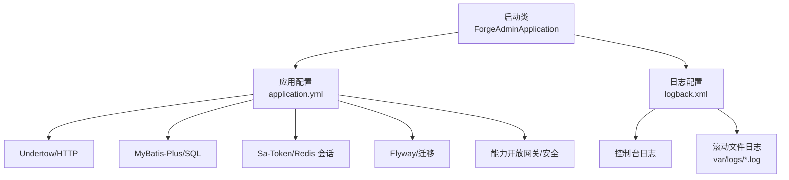
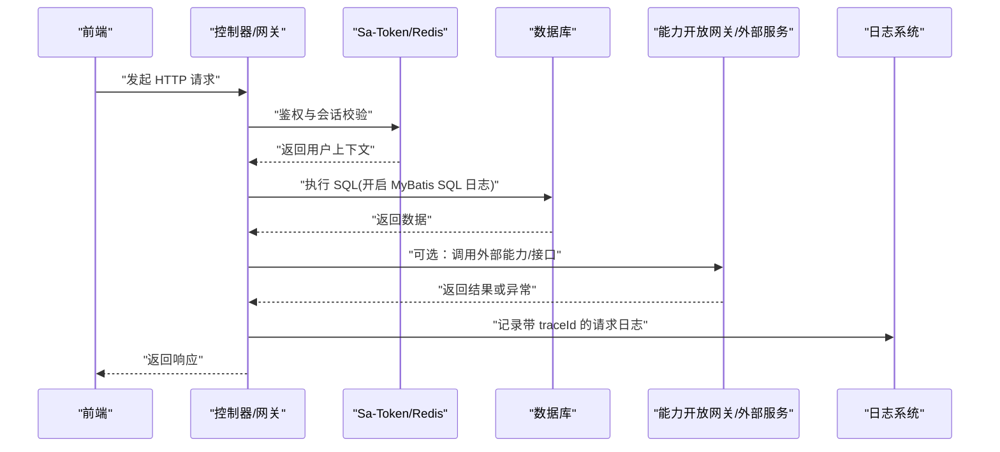
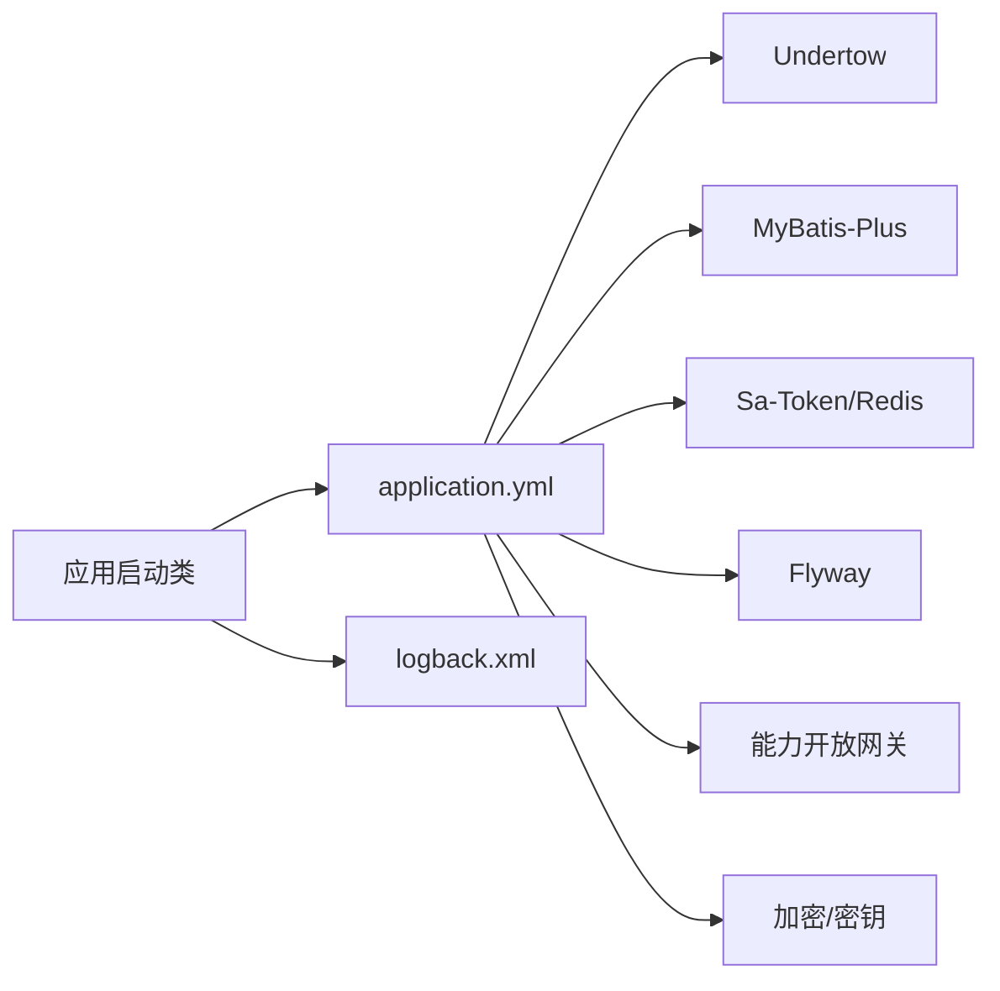

# 调试与故障排查

<cite>
**本文引用的文件**
- [ForgeAdminApplication.java](file://forge-server/forge-admin-server/src/main/java/com/mdframe/forge/admin/ForgeAdminApplication.java)
- [application.yml](file://forge-server/forge-admin-server/src/main/resources/application.yml)
- [logback.xml](file://forge-server/forge-admin-server/src/main/resources/logback.xml)
- [JobOpenApiExceptionHandler.java](file://forge-server/forge-framework/forge-plugin-parent/forge-plugin-job/src/main/java/com/mdframe/forge/plugin/job/controller/openapi/JobOpenApiExceptionHandler.java)
- [FlowClientException.java](file://forge-server/forge-flow/forge-flow-client/src/main/java/com/mdframe/forge/flow/client/FlowClientException.java)
- [AccountLockedException.java](file://forge-server/forge-framework/forge-starter-parent/forge-starter-auth/src/main/java/com/mdframe/forge/starter/auth/exception/AccountLockedException.java)
</cite>

## 目录
1. [简介](#简介)
2. [项目结构](#项目结构)
3. [核心组件](#核心组件)
4. [架构总览](#架构总览)
5. [详细组件分析](#详细组件分析)
6. [依赖关系分析](#依赖关系分析)
7. [性能考虑](#性能考虑)
8. [故障排查指南](#故障排查指南)
9. [结论](#结论)
10. [附录](#附录)

## 简介
本指南面向 Forge Admin 的调试与故障排查，覆盖前后端调试技巧、日志分析方法、性能分析工具使用，以及常见问题（数据库连接、缓存异常、API 调用失败）的诊断与解决方案。同时提供内存泄漏检测、线程分析、网络请求调试等高级调试技术，并总结最佳实践与推荐工具。

## 项目结构
- 后端服务入口：Spring Boot 应用启动类位于 admin 模块，启用扫描、Mapper 扫描与 AOP。
- 配置中心：application.yml 集中管理 Undertow、MyBatis-Plus、Sa-Token、Flyway、AI/MCP、能力开放网关、加密等关键运行时参数；logging.level 控制日志级别；management.endpoints.web.exposure 暴露健康检查。
- 日志框架：logback.xml 定义控制台与滚动文件输出，包含 traceId 追踪字段，便于链路追踪。
- 异常处理：统一异常处理器与领域异常类型用于规范化错误响应与可观测性。

**图表来源**
- [ForgeAdminApplication.java:8-15](file://forge-server/forge-admin-server/src/main/java/com/mdframe/forge/admin/ForgeAdminApplication.java#L8-L15)
- [application.yml:1-228](file://forge-server/forge-admin-server/src/main/resources/application.yml#L1-L228)
- [logback.xml:1-49](file://forge-server/forge-admin-server/src/main/resources/logback.xml#L1-L49)

**章节来源**
- [ForgeAdminApplication.java:8-15](file://forge-server/forge-admin-server/src/main/java/com/mdframe/forge/admin/ForgeAdminApplication.java#L8-L15)
- [application.yml:1-228](file://forge-server/forge-admin-server/src/main/resources/application.yml#L1-L228)
- [logback.xml:1-49](file://forge-server/forge-admin-server/src/main/resources/logback.xml#L1-L49)

## 核心组件
- 应用启动与装配：启用包扫描、Mapper 扫描与 AOP，为后续模块加载奠定基础。
- 运行时配置：
  - 服务器：Undertow 线程池、缓冲、最大 POST 大小。
  - 数据访问：MyBatis-Plus 多包扫描、SQL 日志、主键策略。
  - 认证与会话：Sa-Token 基于 Redis 的会话存储与超时。
  - 数据库迁移：Flyway 启用开关、位置、基线版本。
  - 能力与安全：MCP、能力开放网关、加密密钥与持久化。
  - 监控：仅暴露 health 端点。
- 日志体系：按模块设置日志级别，traceId 贯穿日志，便于问题定位。

**章节来源**
- [application.yml:1-228](file://forge-server/forge-admin-server/src/main/resources/application.yml#L1-L228)
- [logback.xml:1-49](file://forge-server/forge-admin-server/src/main/resources/logback.xml#L1-L49)

## 架构总览
下图展示从前端到后端的典型请求路径及关键组件交互，包括认证、数据访问、外部能力调用与日志记录。

**图表来源**
- [application.yml:97-111](file://forge-server/forge-admin-server/src/main/resources/application.yml#L97-L111)
- [application.yml:118-131](file://forge-server/forge-admin-server/src/main/resources/application.yml#L118-L131)
- [application.yml:192-199](file://forge-server/forge-admin-server/src/main/resources/application.yml#L192-L199)
- [logback.xml:5-6](file://forge-server/forge-admin-server/src/main/resources/logback.xml#L5-L6)

## 详细组件分析

### 启动与装配
- 启动类负责 Spring Boot 应用初始化，启用包扫描、Mapper 扫描与 AOP，确保各模块正确加载。
- 建议：在本地开发时通过环境变量或 Profile 切换不同配置，避免误用生产配置。

**章节来源**
- [ForgeAdminApplication.java:8-15](file://forge-server/forge-admin-server/src/main/java/com/mdframe/forge/admin/ForgeAdminApplication.java#L8-L15)

### 配置与运行时参数
- 服务器层：Undertow 线程数、缓冲大小、POST 大小限制影响吞吐与稳定性。
- 数据层：MyBatis-Plus 的 mapperPackage/mapperLocations/typeAliasesPackage 决定 SQL 映射范围；logImpl 将 SQL 输出到 SLF4J。
- 认证层：Sa-Token 使用 Redis 作为会话存储，需关注 host/port/password/timeout。
- 迁移层：Flyway 支持多位置与基线版本，便于环境一致性。
- 能力与安全：能力开放网关、MCP、加密密钥与持久化开关，可按环境启用。
- 监控：仅暴露 health 端点，减少攻击面。

**章节来源**
- [application.yml:1-228](file://forge-server/forge-admin-server/src/main/resources/application.yml#L1-L228)

### 日志与可观测性
- logback 输出包含 traceId，便于跨组件追踪。
- 日志级别可在 application.yml 中按包名调整，便于定位问题。
- 建议：在问题复现场景临时提升相关包的日志级别，并在问题解决后恢复默认。

**章节来源**
- [logback.xml:5-6,14-47:5-6](file://forge-server/forge-admin-server/src/main/resources/logback.xml#L5-L6)
- [application.yml:23-30](file://forge-server/forge-admin-server/src/main/resources/application.yml#L23-L30)

### 异常处理与错误分类
- 统一异常处理器：对作业/任务等模块进行统一错误封装与响应。
- 领域异常：如流程客户端异常、账户锁定异常等，便于上层捕获与提示。
- 建议：在业务代码中抛出明确的领域异常，配合统一处理器返回友好错误信息。

**章节来源**
- [JobOpenApiExceptionHandler.java](file://forge-server/forge-framework/forge-plugin-parent/forge-plugin-job/src/main/java/com/mdframe/forge/plugin/job/controller/openapi/JobOpenApiExceptionHandler.java)
- [FlowClientException.java](file://forge-server/forge-flow/forge-flow-client/src/main/java/com/mdframe/forge/flow/client/FlowClientException.java)
- [AccountLockedException.java](file://forge-server/forge-framework/forge-starter-parent/forge-starter-auth/src/main/java/com/mdframe/forge/starter/auth/exception/AccountLockedException.java)

## 依赖关系分析
- 启动类依赖 Spring Boot 自动装配与自定义扫描。
- 配置驱动各子系统：Undertow、MyBatis-Plus、Sa-Token、Flyway、能力开放网关、加密等。
- 日志框架贯穿全链路，traceId 由 MDC 注入，便于关联请求。

**图表来源**
- [ForgeAdminApplication.java:8-15](file://forge-server/forge-admin-server/src/main/java/com/mdframe/forge/admin/ForgeAdminApplication.java#L8-L15)
- [application.yml:1-228](file://forge-server/forge-admin-server/src/main/resources/application.yml#L1-L228)
- [logback.xml:1-49](file://forge-server/forge-admin-server/src/main/resources/logback.xml#L1-L49)

**章节来源**
- [application.yml:1-228](file://forge-server/forge-admin-server/src/main/resources/application.yml#L1-L228)

## 性能考虑
- Undertow 线程池与缓冲：根据负载调整 io/worker 线程数与 buffer-size，避免阻塞与内存浪费。
- 上传限制：max-file-size/max-request-size 防止大文件导致 OOM。
- SQL 日志：仅在调试时开启，生产保持 info/error，降低 IO 开销。
- Redis 会话：合理设置 timeout，避免过期过快或过长造成资源占用。
- Flyway：基线与迁移脚本需保持一致，避免启动耗时过长。
- 能力开放网关：限流参数 read-permits-per-minute/write-permits-per-minute 保护下游。

[本节为通用指导，不直接分析具体文件]

## 故障排查指南

### 前后端调试技巧
- 前端
  - 使用浏览器开发者工具的 Network 面板查看请求头、响应体、状态码与耗时。
  - 使用 Console 查看 JS 错误与断点调试。
  - 针对跨域/鉴权问题，检查 Cookie/Token 是否正确携带。
- 后端
  - 通过 application.yml 的 logging.level 临时提高相关包级别，观察详细日志。
  - 利用 logback 中的 traceId 串联前后端日志。
  - 使用 /actuator/health 检查服务健康状态。

**章节来源**
- [application.yml:23-30](file://forge-server/forge-admin-server/src/main/resources/application.yml#L23-L30)
- [logback.xml:5-6](file://forge-server/forge-admin-server/src/main/resources/logback.xml#L5-L6)
- [application.yml:220-228](file://forge-server/forge-admin-server/src/main/resources/application.yml#L220-L228)

### 日志分析方法
- 定位 traceId：在请求日志中获取 traceId，过滤同一请求的全链路日志。
- 分层过滤：按包名调整日志级别，聚焦问题模块。
- 滚动文件：查看 var/logs 下的历史日志，注意保留天数与磁盘占用。

**章节来源**
- [logback.xml:14-47](file://forge-server/forge-admin-server/src/main/resources/logback.xml#L14-L47)

### 性能分析工具使用
- 线程分析：结合 JVM 线程 dump 与日志线程名，识别热点线程与阻塞点。
- CPU 分析：使用采样器（如 async-profiler）生成火焰图，定位热点方法。
- 内存分析：导出堆转储，使用 MAT/JProfiler 分析对象引用链与潜在泄漏。
- SQL 性能：开启 MyBatis SQL 日志，结合数据库慢查询日志分析。

[本节为通用指导，不直接分析具体文件]

### 常见问题诊断与解决

#### 数据库连接问题
- 现象：启动时报连接失败、连接池耗尽或查询超时。
- 排查要点
  - 检查 application.yml 中数据库连接参数与 profile。
  - 确认 Flyway 迁移是否成功，表结构与版本一致。
  - 观察 MyBatis SQL 日志，定位慢查询或锁等待。
- 解决建议
  - 调整连接池大小与超时时间。
  - 修复迁移脚本或回滚不一致版本。
  - 优化 SQL 与索引。

**章节来源**
- [application.yml:97-111](file://forge-server/forge-admin-server/src/main/resources/application.yml#L97-L111)
- [application.yml:65-72](file://forge-server/forge-admin-server/src/main/resources/application.yml#L65-L72)

#### 缓存异常（Redis/Sa-Token）
- 现象：登录态丢失、鉴权失败或会话不稳定。
- 排查要点
  - 检查 Sa-Token 的 Redis 配置（host/port/password/timeout）。
  - 验证 Redis 连通性与权限。
  - 观察鉴权相关日志与错误码。
- 解决建议
  - 修正 Redis 地址与密码，必要时增加超时与重试。
  - 清理过期或损坏的会话数据。

**章节来源**
- [application.yml:118-131](file://forge-server/forge-admin-server/src/main/resources/application.yml#L118-L131)

#### API 调用失败
- 现象：外部能力调用失败、超时或返回异常。
- 排查要点
  - 检查能力开放网关开关与限流参数。
  - 查看外部服务可达性与鉴权令牌。
  - 使用 FlowClientException 等异常类型定位调用阶段。
- 解决建议
  - 调整限流与超时参数。
  - 修复外部服务配置或网络策略。
  - 在业务层捕获并降级处理。

**章节来源**
- [application.yml:192-199](file://forge-server/forge-admin-server/src/main/resources/application.yml#L192-L199)
- [FlowClientException.java](file://forge-server/forge-flow/forge-flow-client/src/main/java/com/mdframe/forge/flow/client/FlowClientException.java)

#### 账户锁定与鉴权问题
- 现象：登录后被锁定或鉴权失败。
- 排查要点
  - 检查 AccountLockedException 及相关日志。
  - 核对 Sa-Token 会话与权限配置。
- 解决建议
  - 解锁账户或调整锁定策略。
  - 修正权限与角色绑定。

**章节来源**
- [AccountLockedException.java](file://forge-server/forge-framework/forge-starter-parent/forge-starter-auth/src/main/java/com/mdframe/forge/starter/auth/exception/AccountLockedException.java)

### 高级调试技术

#### 内存泄漏检测
- 定期导出堆转储，使用 MAT/JProfiler 分析大对象与未释放引用。
- 关注长生命周期对象（如全局缓存、静态集合）的扩容与清理策略。
- 结合 GC 日志与指标，评估回收效果。

[本节为通用指导，不直接分析具体文件]

#### 线程分析
- 收集线程 dump，分析阻塞线程与死锁。
- 结合日志线程名与 traceId，定位慢请求的线程栈。
- 调整 Undertow worker 线程数与队列策略，避免堆积。

[本节为通用指导，不直接分析具体文件]

#### 网络请求调试
- 使用抓包工具（如 Wireshark/tcpdump）分析 TCP 握手、重传与丢包。
- 在前端 Network 与后端日志中对比请求/响应时间与错误码。
- 检查代理、防火墙与证书配置。

[本节为通用指导，不直接分析具体文件]

### 最佳实践与工具推荐
- 日志规范：统一 traceId、结构化日志、分级输出。
- 配置管理：按环境分离配置，敏感信息使用环境变量或密钥管理。
- 监控告警：接入健康检查与指标采集，设置阈值告警。
- 工具推荐：JVM 分析（async-profiler、MAT）、网络分析（Wireshark）、日志聚合（ELK/Loki）、APM（SkyWalking/Pinpoint）。

[本节为通用指导，不直接分析具体文件]

## 结论
通过合理的配置、完善的日志与统一的异常处理，Forge Admin 具备良好的可观测性与可维护性。结合前后端调试技巧、性能分析与高级调试手段，能够快速定位并解决数据库、缓存、API 等常见问题。建议在生产环境持续优化配置与监控，保障系统稳定运行。

## 附录
- 常用命令与路径
  - 日志目录：var/logs
  - 健康检查：/actuator/health
  - 配置文件：application.yml、logback.xml
- 快速定位步骤
  - 从前端 Network 获取请求与错误码。
  - 在后端日志中按 traceId 过滤。
  - 逐步缩小范围至模块/方法/SQL。
  - 结合指标与工具进行深入分析。

[本节为通用指导，不直接分析具体文件]