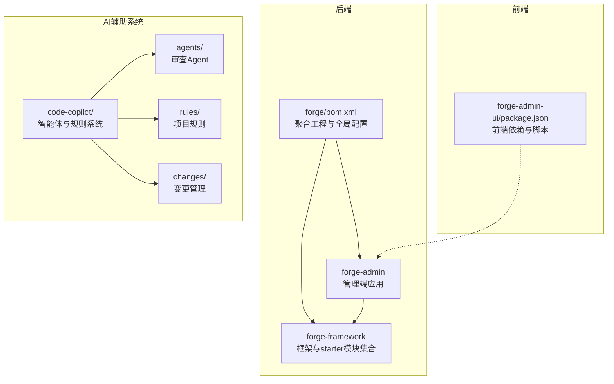
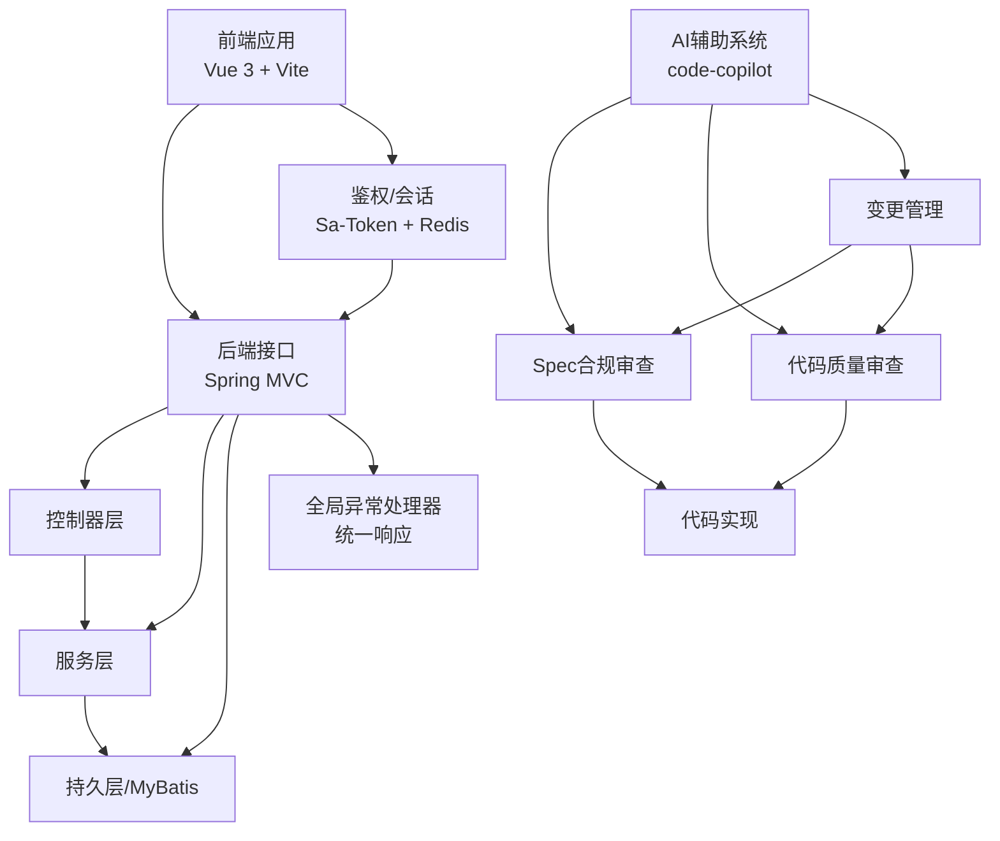
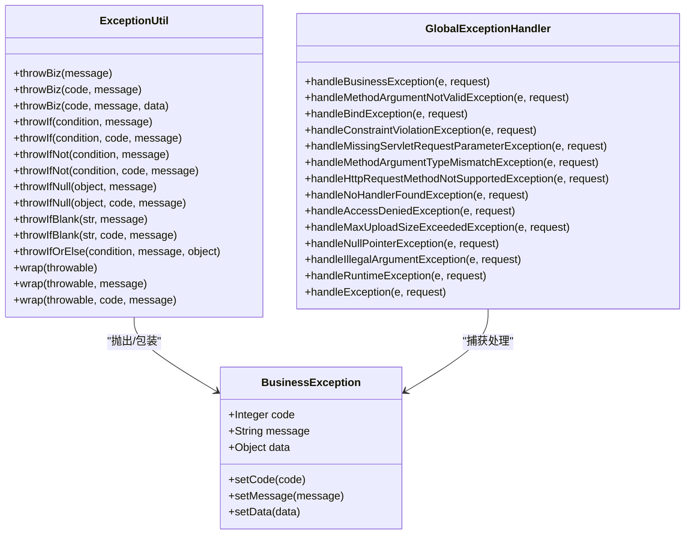
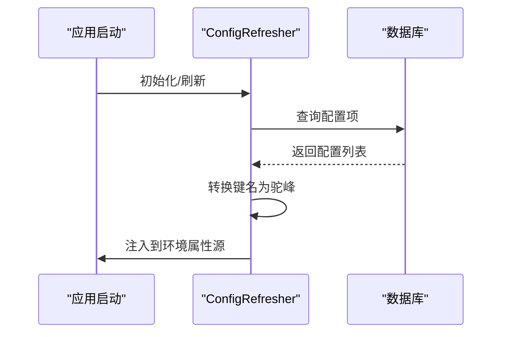
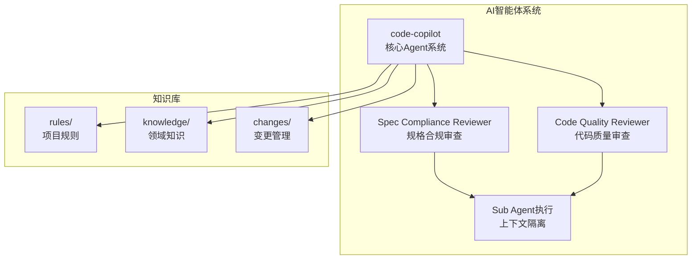
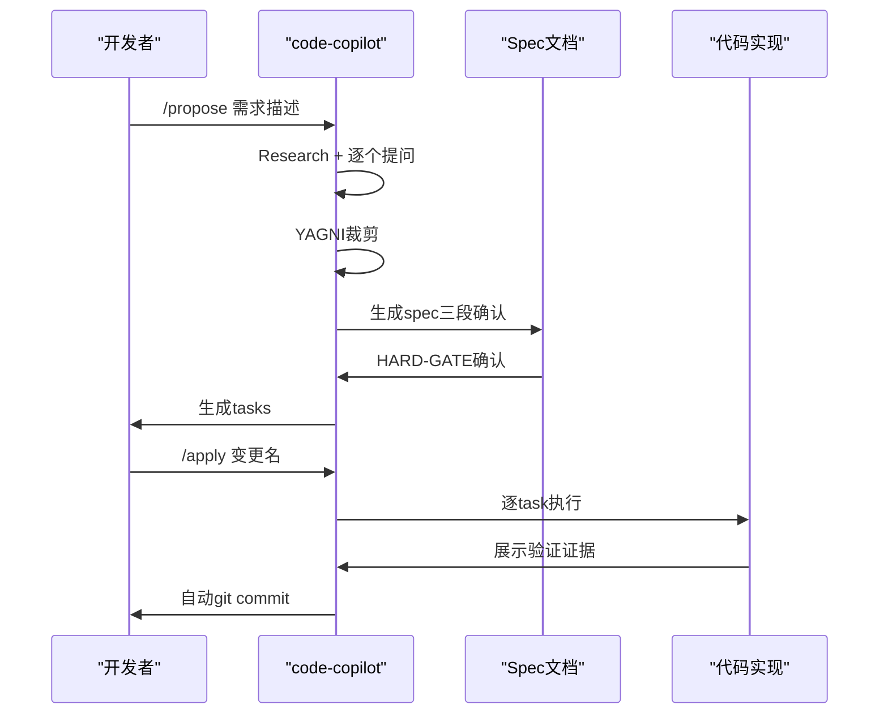
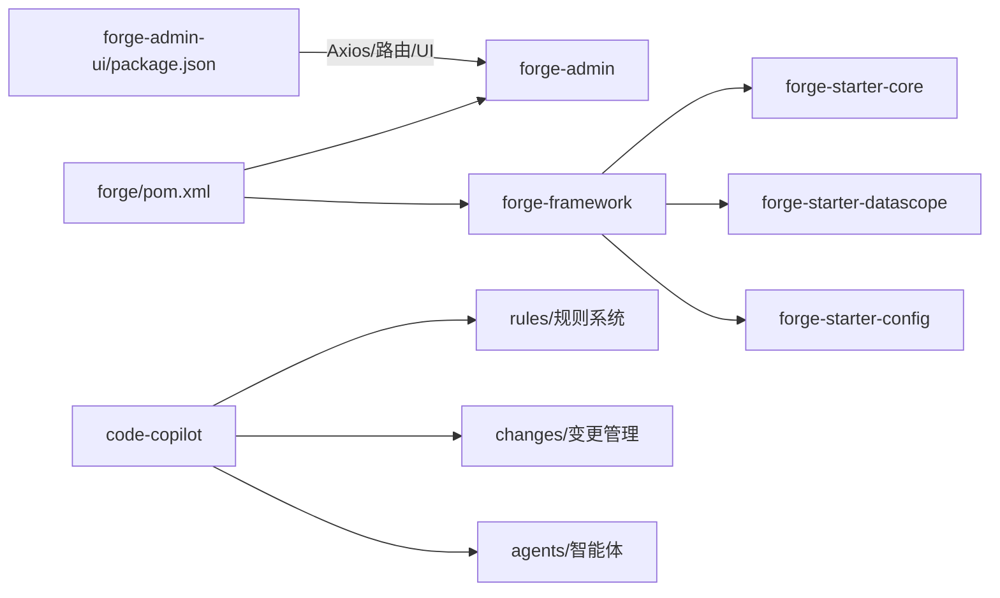

# 开发指南

<cite>
**本文引用的文件**
- [forge/pom.xml](file://forge/pom.xml)
- [forge/forge-admin/src/main/resources/application.yml](file://forge/forge-admin/src/main/resources/application.yml)
- [forge-admin-ui/package.json](file://forge-admin-ui/package.json)
- [forge/forge-framework/forge-starter-parent/forge-starter-core/EXCEPTION_USAGE.md](file://forge/forge-framework/forge-starter-parent/forge-starter-core/EXCEPTION_USAGE.md)
- [forge/forge-framework/forge-starter-parent/forge-starter-core/src/main/java/com/mdframe/forge/starter/core/exception/BusinessException.java](file://forge/forge-framework/forge-starter-parent/forge-starter-core/src/main/java/com/mdframe/forge/starter/core/exception/BusinessException.java)
- [forge/forge-framework/forge-starter-parent/forge-starter-core/src/main/java/com/mdframe/forge/starter/core/exception/ExceptionUtil.java](file://forge/forge-framework/forge-starter-parent/forge-starter-core/src/main/java/com/mdframe/forge/starter/core/exception/ExceptionUtil.java)
- [forge/forge-framework/forge-starter-parent/forge-starter-core/src/main/java/com/mdframe/forge/starter/core/exception/GlobalExceptionHandler.java](file://forge/forge-framework/forge-starter-parent/forge-starter-core/src/main/java/com/mdframe/forge/starter/core/exception/GlobalExceptionHandler.java)
- [forge/forge-framework/forge-starter-parent/forge-starter-datascope/DATA_SCOPE_CONFIG_GUIDE.md](file://forge/forge-framework/forge-starter-parent/forge-starter-datascope/DATA_SCOPE_CONFIG_GUIDE.md)
- [forge/forge-framework/forge-starter-parent/forge-starter-config/src/main/java/com/mdframe/forge/starter/property/refresh/ConfigRefresher.java](file://forge/forge-framework/forge-starter-parent/forge-starter-config/src/main/java/com/mdframe/forge/starter/property/refresh/ConfigRefresher.java)
- [code-copilot/agents/copilot-prompt.md](file://code-copilot/agents/copilot-prompt.md)
- [code-copilot/agents/code-quality-reviewer.md](file://code-copilot/agents/code-quality-reviewer.md)
- [code-copilot/agents/spec-reviewer.md](file://code-copilot/agents/spec-reviewer.md)
- [code-copilot/rules/project-context.md](file://code-copilot/rules/project-context.md)
- [code-copilot/rules/domain-rules.md](file://code-copilot/rules/domain-rules.md)
- [code-copilot/rules/security.md](file://code-copilot/rules/security.md)
- [code-copilot/changes/client-management/client-validation-guide.md](file://code-copilot/changes/client-management/client-validation-guide.md)
- [code-copilot/changes/demo-environment-control/spec.md](file://code-copilot/changes/demo-environment-control/spec.md)
- [code-copilot/changes/idempotent-refactor/spec.md](file://code-copilot/changes/idempotent-refactor/spec.md)
</cite>

## 更新摘要
**所做更改**
- 新增AI辅助开发工具章节，介绍code-copilot智能体系统
- 更新开发规范章节，增加AI代码审查和规范检查流程
- 新增变更管理流程，基于AI驱动的Spec合规审查
- 更新测试策略，增加AI辅助测试生成和验证
- 新增知识管理和沉淀机制，支持AI发现的知识积累

## 目录
1. [简介](#简介)
2. [项目结构](#项目结构)
3. [核心组件](#核心组件)
4. [架构总览](#架构总览)
5. [组件详解](#组件详解)
6. [AI辅助开发工具](#ai辅助开发工具)
7. [变更管理流程](#变更管理流程)
8. [依赖关系分析](#依赖关系分析)
9. [性能考量](#性能考量)
10. [故障排查指南](#故障排查指南)
11. [结论](#结论)
12. [附录](#附录)

## 简介
本开发指南面向Forge框架的开发者，覆盖从基础开发规范到高级扩展开发的全流程，重点包括：
- 代码规范、命名约定、注释标准
- 异常处理机制与最佳实践
- 新功能开发流程、插件扩展开发、第三方集成方案
- 单元测试、集成测试、性能测试策略
- 调试技巧、问题排查、版本升级与维护
- **新增** AI辅助开发工具集成，包括代码质量审查Agent、规范审查Agent等智能体系统

目标是帮助团队建立统一的开发标准与高效的工作流，同时利用AI工具提升开发效率和代码质量。

## 项目结构
Forge采用多模块Maven聚合工程，后端由Spring Boot驱动，前端基于Vue 3 + Vite，配套丰富的starter模块与插件体系，支撑认证授权、数据权限、定时任务、消息、Excel、文件、分布式ID、多租户等能力。

**图表来源**
- [forge/pom.xml:114-118](file://forge/pom.xml#L114-L118)
- [forge/forge-admin/src/main/resources/application.yml:1-100](file://forge/forge-admin/src/main/resources/application.yml#L1-L100)
- [forge-admin-ui/package.json:1-68](file://forge-admin-ui/package.json#L1-L68)
- [code-copilot/agents/copilot-prompt.md:1-71](file://code-copilot/agents/copilot-prompt.md#L1-L71)

**章节来源**
- [forge/pom.xml:1-259](file://forge/pom.xml#L1-L259)
- [forge/forge-admin/src/main/resources/application.yml:1-100](file://forge/forge-admin/src/main/resources/application.yml#L1-L100)
- [forge-admin-ui/package.json:1-68](file://forge-admin-ui/package.json#L1-L68)

## 核心组件
- 异常处理体系：统一业务异常、参数校验异常、全局异常处理器，保证前后端一致的错误响应格式。
- 数据权限模块：通过可视化配置实现对Mapper查询的动态SQL条件注入，支持用户、组织、租户维度。
- 配置中心刷新：支持从数据库动态加载与刷新配置项，便于灰度与热更新。
- 插件与starter：提供Job、Message、System、Tenant等插件与starter，按需组合使用。
- **新增** AI辅助开发系统：基于code-copilot的智能体系统，提供代码质量审查、规范合规检查、变更提案生成等能力。

**章节来源**
- [forge/forge-framework/forge-starter-parent/forge-starter-core/EXCEPTION_USAGE.md:1-358](file://forge/forge-framework/forge-starter-parent/forge-starter-core/EXCEPTION_USAGE.md#L1-L358)
- [forge/forge-framework/forge-starter-parent/forge-starter-datascope/DATA_SCOPE_CONFIG_GUIDE.md:1-291](file://forge/forge-framework/forge-starter-parent/forge-starter-datascope/DATA_SCOPE_CONFIG_GUIDE.md#L1-L291)
- [forge/forge-framework/forge-starter-parent/forge-starter-config/src/main/java/com/mdframe/forge/starter/property/refresh/ConfigRefresher.java:114-156](file://forge/forge-framework/forge-starter-parent/forge-starter-config/src/main/java/com/mdframe/forge/starter/property/refresh/ConfigRefresher.java#L114-L156)
- [code-copilot/agents/copilot-prompt.md:1-71](file://code-copilot/agents/copilot-prompt.md#L1-L71)

## 架构总览
后端通过Spring Boot启动，统一由全局异常处理器拦截并标准化响应；前端通过Axios与后端交互，配合鉴权与主题配置完成用户体验闭环。AI辅助系统作为开发过程中的智能助手，提供代码审查、规范检查、变更管理等能力。

**图表来源**
- [forge/forge-admin/src/main/resources/application.yml:87-100](file://forge/forge-admin/src/main/resources/application.yml#L87-L100)
- [forge/forge-framework/forge-starter-parent/forge-starter-core/src/main/java/com/mdframe/forge/starter/core/exception/GlobalExceptionHandler.java:28-175](file://forge/forge-framework/forge-starter-parent/forge-starter-core/src/main/java/com/mdframe/forge/starter/core/exception/GlobalExceptionHandler.java#L28-L175)
- [code-copilot/agents/copilot-prompt.md:48-50](file://code-copilot/agents/copilot-prompt.md#L48-L50)

## 组件详解

### 异常处理体系
- BusinessException：携带code/message/data的业务异常载体，支持链式setter。
- ExceptionUtil：提供便捷的抛出与包装方法，涵盖条件判断、空值/空白检查、异常包装等。
- GlobalExceptionHandler：统一拦截各类异常，输出统一RespInfo响应结构，记录日志并区分业务与系统异常级别。

**图表来源**
- [forge/forge-framework/forge-starter-parent/forge-starter-core/src/main/java/com/mdframe/forge/starter/core/exception/BusinessException.java:1-86](file://forge/forge-framework/forge-starter-parent/forge-starter-core/src/main/java/com/mdframe/forge/starter/core/exception/BusinessException.java#L1-L86)
- [forge/forge-framework/forge-starter-parent/forge-starter-core/src/main/java/com/mdframe/forge/starter/core/exception/ExceptionUtil.java:1-195](file://forge/forge-framework/forge-starter-parent/forge-starter-core/src/main/java/com/mdframe/forge/starter/core/exception/ExceptionUtil.java#L1-L195)
- [forge/forge-framework/forge-starter-parent/forge-starter-core/src/main/java/com/mdframe/forge/starter/core/exception/GlobalExceptionHandler.java:28-175](file://forge/forge-framework/forge-starter-parent/forge-starter-core/src/main/java/com/mdframe/forge/starter/core/exception/GlobalExceptionHandler.java#L28-L175)

**章节来源**
- [forge/forge-framework/forge-starter-parent/forge-starter-core/EXCEPTION_USAGE.md:1-358](file://forge/forge-framework/forge-starter-parent/forge-starter-core/EXCEPTION_USAGE.md#L1-L358)
- [forge/forge-framework/forge-starter-parent/forge-starter-core/src/main/java/com/mdframe/forge/starter/core/exception/BusinessException.java:1-86](file://forge/forge-framework/forge-starter-parent/forge-starter-core/src/main/java/com/mdframe/forge/starter/core/exception/BusinessException.java#L1-L86)
- [forge/forge-framework/forge-starter-parent/forge-starter-core/src/main/java/com/mdframe/forge/starter/core/exception/ExceptionUtil.java:1-195](file://forge/forge-framework/forge-starter-parent/forge-starter-core/src/main/java/com/mdframe/forge/starter/core/exception/ExceptionUtil.java#L1-L195)
- [forge/forge-framework/forge-starter-parent/forge-starter-core/src/main/java/com/mdframe/forge/starter/core/exception/GlobalExceptionHandler.java:28-175](file://forge/forge-framework/forge-starter-parent/forge-starter-core/src/main/java/com/mdframe/forge/starter/core/exception/GlobalExceptionHandler.java#L28-L175)

### 数据权限配置管理
- 通过sys_data_scope_config表配置资源编码、Mapper方法、表别名与用户/组织/租户字段规则。
- 支持简单字段与复杂SQL模式，动态拼接WHERE条件，拦截器实时生效。
- 提供安装、配置、缓存刷新、注意事项与常见问题排查指引。

**图表来源**
- [forge/forge-framework/forge-starter-parent/forge-starter-datascope/DATA_SCOPE_CONFIG_GUIDE.md:202-227](file://forge/forge-framework/forge-starter-parent/forge-starter-datascope/DATA_SCOPE_CONFIG_GUIDE.md#L202-L227)

**章节来源**
- [forge/forge-framework/forge-starter-parent/forge-starter-datascope/DATA_SCOPE_CONFIG_GUIDE.md:1-291](file://forge/forge-framework/forge-starter-parent/forge-starter-datascope/DATA_SCOPE_CONFIG_GUIDE.md#L1-L291)

### 配置中心刷新
- 从config_properties表加载配置项，转换为驼峰键名，合并到环境属性源。
- 提供数据库配置源获取与加载失败的告警日志。

**图表来源**
- [forge/forge-framework/forge-starter-parent/forge-starter-config/src/main/java/com/mdframe/forge/starter/property/refresh/ConfigRefresher.java:114-156](file://forge/forge-framework/forge-starter-parent/forge-starter-config/src/main/java/com/mdframe/forge/starter/property/refresh/ConfigRefresher.java#L114-L156)

**章节来源**
- [forge/forge-framework/forge-starter-parent/forge-starter-config/src/main/java/com/mdframe/forge/starter/property/refresh/ConfigRefresher.java:114-156](file://forge/forge-framework/forge-starter-parent/forge-starter-config/src/main/java/com/mdframe/forge/starter/property/refresh/ConfigRefresher.java#L114-L156)

## AI辅助开发工具

### code-copilot智能体系统
Forge框架集成了基于AI的开发辅助系统code-copilot，提供智能化的代码审查、规范检查和变更管理能力。

#### 核心Agent架构
- **Spec Compliance Reviewer**：专门验证代码实现是否符合spec规格，只读不写，独立于实现者的上下文
- **Code Quality Reviewer**：专职审查代码质量、安全性和可维护性，前置条件为spec审查通过
- **Copilot Prompt**：AI助手的核心指令系统，基于rules、knowledge、changes三个目录工作

**图表来源**
- [code-copilot/agents/copilot-prompt.md:1-71](file://code-copilot/agents/copilot-prompt.md#L1-L71)
- [code-copilot/agents/spec-reviewer.md:1-19](file://code-copilot/agents/spec-reviewer.md#L1-L19)
- [code-copilot/agents/code-quality-reviewer.md:1-10](file://code-copilot/agents/code-quality-reviewer.md#L1-L10)

#### Spec合规审查Agent
- **核心理念**：**不信报告，只信代码** — reviewer必须读实际代码独立验证
- **审查维度**：
  1. 缺失实现：spec要求了但代码没做的
  2. 多余实现：spec没要求但代码多做了的（YAGNI违规）
  3. 理解偏差：做了但做错了方向的
  4. 业务规则落地：spec §4中的规则是否全部体现在代码中
  5. 数据变更准确性：spec §5中的表/字段变更是否准确落地

#### 代码质量审查Agent
- **审查分级**：
  - **Critical**（阻塞）：安全漏洞、资金逻辑错误、并发安全、数据丢失风险
  - **Important**（应修复）：异常被吞、缺少参数校验、魔法值、方法过长、命名不清
  - **Minor**（建议）：Javadoc缺失、注释过时、import未清理
- **工具权限**：仅需Read/Grep/Glob/Bash（只读），不需要写入权限

**章节来源**
- [code-copilot/agents/copilot-prompt.md:1-71](file://code-copilot/agents/copilot-prompt.md#L1-L71)
- [code-copilot/agents/spec-reviewer.md:1-19](file://code-copilot/agents/spec-reviewer.md#L1-L19)
- [code-copilot/agents/code-quality-reviewer.md:1-10](file://code-copilot/agents/code-quality-reviewer.md#L1-L10)

### 项目规则系统
AI系统基于四个核心规则文件提供开发约束：

#### 工程上下文规则
- **项目概况**：Forge Admin基于Vue3 + Spring Boot的企业级中后台管理框架
- **技术栈详情**：后端Spring Boot 3.2.9 + 前端Vue 3.5 + 多种核心技术组件
- **目录结构**：详细的后端和前端目录结构说明
- **模块依赖**：后端模块依赖关系图和分层架构

#### 业务领域规则
- **金额处理**：所有金额使用long类型，单位为分
- **时间字段**：统一使用LocalDatetime类型
- **外部接口**：必须设置超时（默认3s）并做降级处理
- **状态变更**：必须通过状态机，禁止直接set状态字段

#### 安全红线规则
- **代码安全**：禁止硬编码密钥、AK/SK、数据库密码
- **业务安全**：涉及资金变更的逻辑必须人工审查
- **敏感信息**：禁止在日志中打印手机号、身份证、银行卡等

**章节来源**
- [code-copilot/rules/project-context.md:1-433](file://code-copilot/rules/project-context.md#L1-L433)
- [code-copilot/rules/domain-rules.md:1-14](file://code-copilot/rules/domain-rules.md#L1-L14)
- [code-copilot/rules/security.md:1-14](file://code-copilot/rules/security.md#L1-L14)

## 变更管理流程

### AI驱动的变更流程
Forge框架采用基于AI的变更管理模式，通过code-copilot实现规范化的开发流程：

#### 变更提案流程
1. **/spec:init**：初始化项目上下文，分析工程结构、依赖、分层模式
2. **/propose**：创建变更提案，基于Research → 逐个提问 → YAGNI裁剪 → 分三段生成spec
3. **/apply**：执行编码，前置检查spec + tasks + 用户确认
4. **/fix**：Review后修正迭代，增量修正 + 文档同步
5. **/review**：两阶段审查（Spec Compliance → Code Quality）

#### 变更管理示例
系统包含多个实际的变更管理示例：

##### 客户端验证配置
- **功能说明**：客户端验证功能用于验证登录请求的客户端身份
- **核心能力**：AppId验证、可选验证、安全日志
- **配置方式**：支持在application.yml中启用客户端验证
- **前端使用**：登录时传递AppId参数，支持多客户端类型

##### 演示环境控制
- **背景动机**：Forge Admin系统需要对外提供演示环境
- **核心功能**：演示环境配置、API请求拦截、前端提示、接口白名单
- **技术实现**：拦截器设计、配置模型、注解扩展

##### 分布式幂等模块优化
- **现状分析**：现有幂等模块的功能缺失、安全不足、监控缺失等问题
- **优化目标**：增强功能完整性、提升可靠性、完善可观测性
- **核心改进**：结果缓存能力、Token机制、Redisson分布式锁、监控统计

**图表来源**
- [code-copilot/agents/copilot-prompt.md:37-46](file://code-copilot/agents/copilot-prompt.md#L37-L46)
- [code-copilot/agents/copilot-prompt.md:48-50](file://code-copilot/agents/copilot-prompt.md#L48-L50)

**章节来源**
- [code-copilot/agents/copilot-prompt.md:35-61](file://code-copilot/agents/copilot-prompt.md#L35-L61)
- [code-copilot/changes/client-management/client-validation-guide.md:1-309](file://code-copilot/changes/client-management/client-validation-guide.md#L1-L309)
- [code-copilot/changes/demo-environment-control/spec.md:1-601](file://code-copilot/changes/demo-environment-control/spec.md#L1-L601)
- [code-copilot/changes/idempotent-refactor/spec.md:1-823](file://code-copilot/changes/idempotent-refactor/spec.md#L1-L823)

## 依赖关系分析
- Maven聚合与模块划分：父POM集中管理版本、插件与资源过滤，模块间通过依赖传递与继承保持一致性。
- 后端运行时依赖：Spring Boot、MyBatis-Plus、Sa-Token、Redisson、MapStruct等。
- 前端依赖：Vue 3、Naive UI、Axios、Pinia、路由与加密工具。
- **新增** AI辅助系统依赖：code-copilot智能体系统，提供代码审查、规范检查、变更管理能力。

**图表来源**
- [forge/pom.xml:114-118](file://forge/pom.xml#L114-L118)
- [forge-admin-ui/package.json:13-41](file://forge-admin-ui/package.json#L13-L41)

**章节来源**
- [forge/pom.xml:1-259](file://forge/pom.xml#L1-L259)
- [forge-admin-ui/package.json:1-68](file://forge-admin-ui/package.json#L1-L68)

## 性能考量
- Web容器与线程模型： Undertow配置调整IO线程与worker线程数量，提升高并发下的吞吐。
- MyBatis-Plus：开启驼峰映射、缓存、主键自增策略，减少ORM开销。
- 数据权限：复杂SQL可能影响查询性能，建议使用EXPLAIN分析与优化。
- 前端构建：合理配置Vite插件，避免重复注册导致的构建异常与性能损耗。
- **新增** AI辅助系统：智能体执行需要考虑CPU和内存开销，建议合理配置AI审查的触发时机和频率。

**章节来源**
- [forge/forge-admin/src/main/resources/application.yml:8-22](file://forge/forge-admin/src/main/resources/application.yml#L8-L22)
- [forge/forge-admin/src/main/resources/application.yml:65-86](file://forge/forge-admin/src/main/resources/application.yml#L65-L86)
- [forge/forge-framework/forge-starter-parent/forge-starter-datascope/DATA_SCOPE_CONFIG_GUIDE.md:233-234](file://forge/forge-framework/forge-starter-parent/forge-starter-datascope/DATA_SCOPE_CONFIG_GUIDE.md#L233-L234)

## 故障排查指南
- 异常响应格式：统一为包含code/message/data/timestamp的结构，便于前端与监控系统消费。
- 常见异常分类：参数校验失败、缺少参数、类型不匹配、404、权限不足、文件超限、空指针、非法参数、运行时异常、未知异常。
- 数据权限：若配置后未生效，检查启用状态、Mapper方法路径、表别名与缓存刷新；SQL模式注意占位符与语法。
- 配置刷新：加载失败会记录告警日志，确认数据库连通与表结构。
- 前端插件重复注册：避免在vite.config.js与inlineConfig同时注册相同插件，可通过调试插件注册数量定位问题。
- **新增** AI辅助系统故障：检查智能体权限配置、规则文件完整性、变更管理目录结构，确保AI审查Agent能够正常访问所需资源。

**章节来源**
- [forge/forge-framework/forge-starter-parent/forge-starter-core/src/main/java/com/mdframe/forge/starter/core/exception/GlobalExceptionHandler.java:35-173](file://forge/forge-framework/forge-starter-parent/forge-starter-core/src/main/java/com/mdframe/forge/starter/core/exception/GlobalExceptionHandler.java#L35-L173)
- [forge/forge-framework/forge-starter-parent/forge-starter-datascope/DATA_SCOPE_CONFIG_GUIDE.md:237-259](file://forge/forge-framework/forge-starter-parent/forge-starter-datascope/DATA_SCOPE_CONFIG_GUIDE.md#L237-L259)
- [forge/forge-framework/forge-starter-parent/forge-starter-config/src/main/java/com/mdframe/forge/starter/property/refresh/ConfigRefresher.java:119-121](file://forge/forge-framework/forge-starter-parent/forge-starter-config/src/main/java/com/mdframe/forge/starter/property/refresh/ConfigRefresher.java#L119-L121)

## 结论
Forge框架通过统一的异常处理、可视化的数据权限与灵活的配置刷新机制，为业务快速迭代提供了坚实基础。新增的AI辅助开发工具进一步提升了开发效率和代码质量。建议团队在日常开发中遵循统一的命名与注释规范，严格使用异常工具类与参数校验注解，结合数据权限与配置中心实现安全、可控、可演进的系统。同时充分利用AI智能体进行代码审查和规范检查，确保代码质量和开发流程的标准化。

## 附录

### 开发规范与最佳实践
- 命名约定
  - 包名：com.mdframe.forge.{模块}.xxx
  - 类名：名词或复合词，首字母大写；工具类以Util结尾；异常类以Exception结尾
  - 方法：动词短语，小驼峰；常量全大写+下划线
  - 配置键：中划线风格，转换为驼峰键名
- 注释标准
  - 类/方法：简述职责、参数、返回值、异常
  - 关键流程：标注前置条件、边界情况、性能影响
- 参数校验
  - DTO使用@NotNull/@NotBlank等注解
  - 控制器方法使用@Valid/@Validated
- 日志记录
  - 业务异常：WARN
  - 系统异常：ERROR
  - 请求URI、错误码、消息均纳入日志上下文
- **新增** AI代码审查规范
  - 使用Spec驱动的开发流程，确保代码与spec一致
  - 重视AI审查Agent的反馈，特别是安全性和质量方面的建议
  - 及时响应AI发现的问题，进行代码重构和优化

**章节来源**
- [forge/forge-framework/forge-starter-parent/forge-starter-core/EXCEPTION_USAGE.md:314-339](file://forge/forge-framework/forge-starter-parent/forge-starter-core/EXCEPTION_USAGE.md#L314-L339)
- [forge/forge-framework/forge-starter-parent/forge-starter-config/src/main/java/com/mdframe/forge/starter/property/refresh/ConfigRefresher.java:129-148](file://forge/forge-framework/forge-starter-parent/forge-starter-config/src/main/java/com/mdframe/forge/starter/property/refresh/ConfigRefresher.java#L129-L148)
- [code-copilot/agents/spec-reviewer.md:1-19](file://code-copilot/agents/spec-reviewer.md#L1-L19)
- [code-copilot/agents/code-quality-reviewer.md:1-10](file://code-copilot/agents/code-quality-reviewer.md#L1-L10)

### 测试策略
- 单元测试
  - 使用JUnit与Mock，覆盖核心Service逻辑与边界条件
  - 使用@MockBean模拟外部依赖，隔离测试
- 集成测试
  - 基于@SpringBootTest启动容器，验证异常处理器与数据权限拦截器行为
  - 使用@TestPropertySource或profiles切换环境配置
- 性能测试
  - 使用JMeter/LoadRunner对关键接口进行并发压测
  - 关注数据库慢查询与连接池占用，结合数据权限SQL分析
- **新增** AI辅助测试策略
  - 利用AI生成测试规范，确保测试覆盖率和质量
  - 通过AI审查测试代码，发现潜在问题和改进点
  - 基于AI建议优化测试流程和测试用例设计

**章节来源**
- [forge/pom.xml:164-175](file://forge/pom.xml#L164-L175)
- [forge/forge-admin/src/main/resources/application.yml:39-40](file://forge/forge-admin/src/main/resources/application.yml#L39-L40)

### 版本升级与维护
- Maven版本与插件
  - 通过properties集中管理版本，使用flatten-maven-plugin统一POM
- 前端依赖
  - 使用package.json管理依赖，定期使用taze等工具进行依赖升级
- 配置与环境
  - 通过profiles.active切换环境日志级别与资源过滤
- 数据权限与配置
  - 修改配置后自动刷新缓存，上线前进行充分权限与SQL性能验证
- **新增** AI系统维护
  - 定期更新AI规则和知识库，确保审查准确性
  - 监控AI智能体性能，优化审查效率和质量
  - 基于AI发现的问题进行持续改进和知识沉淀

**章节来源**
- [forge/pom.xml:12-61](file://forge/pom.xml#L12-L61)
- [forge/pom.xml:177-201](file://forge/pom.xml#L177-L201)
- [forge/forge-admin/src/main/resources/application.yml:39-40](file://forge/forge-admin/src/main/resources/application.yml#L39-L40)
- [forge/forge-framework/forge-starter-parent/forge-starter-datascope/DATA_SCOPE_CONFIG_GUIDE.md:220-227](file://forge/forge-framework/forge-starter-parent/forge-starter-datascope/DATA_SCOPE_CONFIG_GUIDE.md#L220-L227)

### AI智能体使用指南
- **意图确认**：收到用户自然语言指令时，先识别意图并映射到对应命令
- **命令流程**：支持/spec:init、/propose、/apply、/fix、/review、/test、/archive等命令
- **Git规范**：禁止master分支变更，每个task/fix自动commit，禁止自动push
- **调试流程**：四阶段根因调查 → 模式分析 → 假设验证 → 实施修复
- **工具调用**：严格遵循opencode工具调用规则，确保代码质量和可追溯性

**章节来源**
- [code-copilot/agents/copilot-prompt.md:18-71](file://code-copilot/agents/copilot-prompt.md#L18-L71)