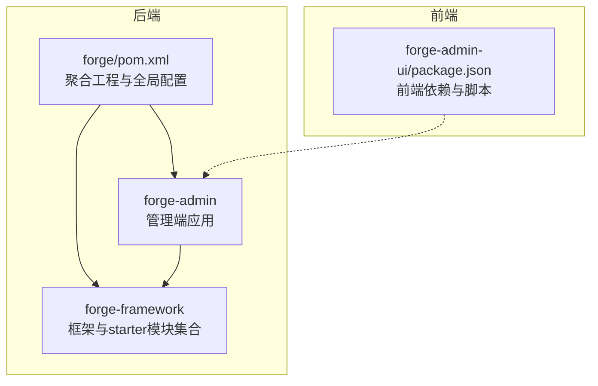
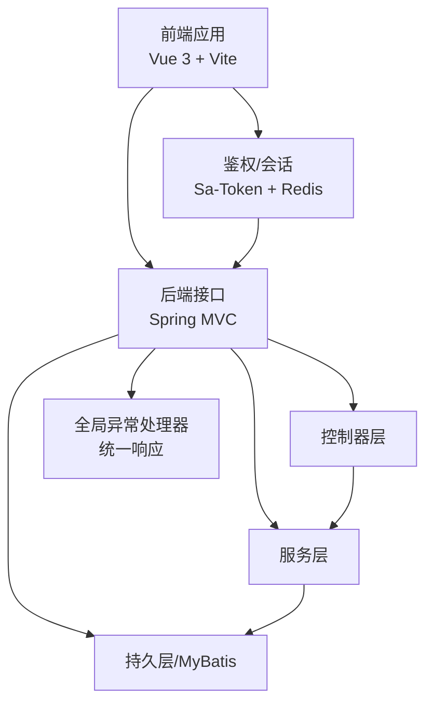
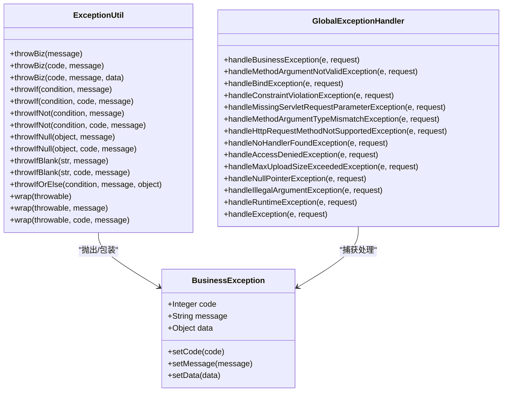
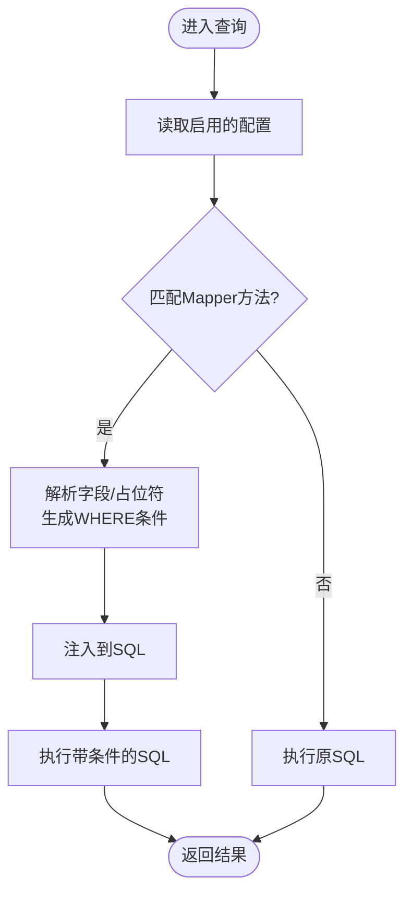
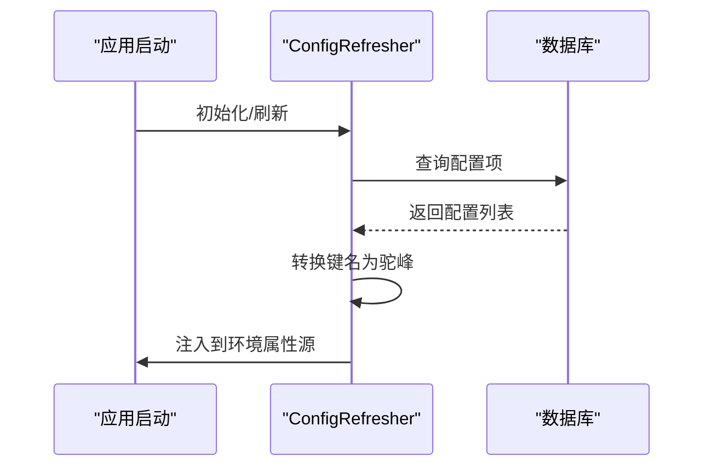
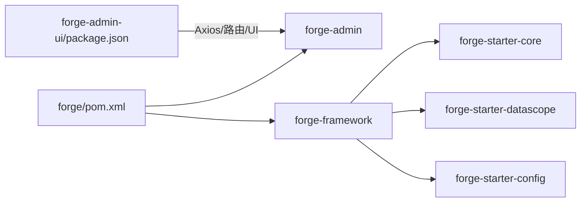

# 开发指南

<cite>
**本文引用的文件**
- [forge/pom.xml](file://forge/pom.xml)
- [forge/forge-admin/src/main/resources/application.yml](file://forge/forge-admin/src/main/resources/application.yml)
- [forge-admin-ui/package.json](file://forge-admin-ui/package.json)
- [forge/forge-framework/forge-starter-parent/forge-starter-core/EXCEPTION_USAGE.md](file://forge/forge-framework/forge-starter-parent/forge-starter-core/EXCEPTION_USAGE.md)
- [forge/forge-framework/forge-starter-parent/forge-starter-core/src/main/java/com/mdframe/forge/starter/core/exception/BusinessException.java](file://forge/forge-framework/forge-starter-parent/forge-starter-core/src/main/java/com/mdframe/forge/starter/core/exception/BusinessException.java)
- [forge/forge-framework/forge-starter-parent/forge-starter-core/src/main/java/com/mdframe/forge/starter/core/exception/ExceptionUtil.java](file://forge/forge-framework/forge-starter-parent/forge-starter-core/src/main/java/com/mdframe/forge/starter/core/exception/ExceptionUtil.java)
- [forge/forge-framework/forge-starter-parent/forge-starter-core/src/main/java/com/mdframe/forge/starter/core/exception/GlobalExceptionHandler.java](file://forge/forge-framework/forge-starter-parent/forge-starter-core/src/main/java/com/mdframe/forge/starter/core/exception/GlobalExceptionHandler.java)
- [forge/forge-framework/forge-starter-parent/forge-starter-datascope/DATA_SCOPE_CONFIG_GUIDE.md](file://forge/forge-framework/forge-starter-parent/forge-starter-datascope/DATA_SCOPE_CONFIG_GUIDE.md)
- [forge/forge-framework/forge-starter-parent/forge-starter-config/src/main/java/com/mdframe/forge/starter/property/refresh/ConfigRefresher.java](file://forge/forge-framework/forge-starter-parent/forge-starter-config/src/main/java/com/mdframe/forge/starter/property/refresh/ConfigRefresher.java)
</cite>

## 目录
1. [简介](#简介)
2. [项目结构](#项目结构)
3. [核心组件](#核心组件)
4. [架构总览](#架构总览)
5. [组件详解](#组件详解)
6. [依赖关系分析](#依赖关系分析)
7. [性能考量](#性能考量)
8. [故障排查指南](#故障排查指南)
9. [结论](#结论)
10. [附录](#附录)

## 简介
本开发指南面向Forge框架的开发者，覆盖从基础开发规范到高级扩展开发的全流程，重点包括：
- 代码规范、命名约定、注释标准
- 异常处理机制与最佳实践
- 新功能开发流程、插件扩展开发、第三方集成方案
- 单元测试、集成测试、性能测试策略
- 调试技巧、问题排查、版本升级与维护

目标是帮助团队建立统一的开发标准与高效的工作流。

## 项目结构
Forge采用多模块Maven聚合工程，后端由Spring Boot驱动，前端基于Vue 3 + Vite，配套丰富的starter模块与插件体系，支撑认证授权、数据权限、定时任务、消息、Excel、文件、分布式ID、多租户等能力。

图表来源
- [forge/pom.xml](file://forge/pom.xml#L114-L118)
- [forge/forge-admin/src/main/resources/application.yml](file://forge/forge-admin/src/main/resources/application.yml#L1-L100)
- [forge-admin-ui/package.json](file://forge-admin-ui/package.json#L1-L68)

章节来源
- [forge/pom.xml](file://forge/pom.xml#L1-L259)
- [forge/forge-admin/src/main/resources/application.yml](file://forge/forge-admin/src/main/resources/application.yml#L1-L100)
- [forge-admin-ui/package.json](file://forge-admin-ui/package.json#L1-L68)

## 核心组件
- 异常处理体系：统一业务异常、参数校验异常、全局异常处理器，保证前后端一致的错误响应格式。
- 数据权限模块：通过可视化配置实现对Mapper查询的动态SQL条件注入，支持用户、组织、租户维度。
- 配置中心刷新：支持从数据库动态加载与刷新配置项，便于灰度与热更新。
- 插件与starter：提供Job、Message、System、Tenant等插件与starter，按需组合使用。

章节来源
- [forge/forge-framework/forge-starter-parent/forge-starter-core/EXCEPTION_USAGE.md](file://forge/forge-framework/forge-starter-parent/forge-starter-core/EXCEPTION_USAGE.md#L1-L358)
- [forge/forge-framework/forge-starter-parent/forge-starter-datascope/DATA_SCOPE_CONFIG_GUIDE.md](file://forge/forge-framework/forge-starter-parent/forge-starter-datascope/DATA_SCOPE_CONFIG_GUIDE.md#L1-L291)
- [forge/forge-framework/forge-starter-parent/forge-starter-config/src/main/java/com/mdframe/forge/starter/property/refresh/ConfigRefresher.java](file://forge/forge-framework/forge-starter-parent/forge-starter-config/src/main/java/com/mdframe/forge/starter/property/refresh/ConfigRefresher.java#L114-L156)

## 架构总览
后端通过Spring Boot启动，统一由全局异常处理器拦截并标准化响应；前端通过Axios与后端交互，配合鉴权与主题配置完成用户体验闭环。

图表来源
- [forge/forge-admin/src/main/resources/application.yml](file://forge/forge-admin/src/main/resources/application.yml#L87-L100)
- [forge/forge-framework/forge-starter-parent/forge-starter-core/src/main/java/com/mdframe/forge/starter/core/exception/GlobalExceptionHandler.java](file://forge/forge-framework/forge-starter-parent/forge-starter-core/src/main/java/com/mdframe/forge/starter/core/exception/GlobalExceptionHandler.java#L28-L175)

## 组件详解

### 异常处理体系
- BusinessException：携带code/message/data的业务异常载体，支持链式setter。
- ExceptionUtil：提供便捷的抛出与包装方法，涵盖条件判断、空值/空白检查、异常包装等。
- GlobalExceptionHandler：统一拦截各类异常，输出统一RespInfo响应结构，记录日志并区分业务与系统异常级别。

图表来源
- [forge/forge-framework/forge-starter-parent/forge-starter-core/src/main/java/com/mdframe/forge/starter/core/exception/BusinessException.java](file://forge/forge-framework/forge-starter-parent/forge-starter-core/src/main/java/com/mdframe/forge/starter/core/exception/BusinessException.java#L1-L86)
- [forge/forge-framework/forge-starter-parent/forge-starter-core/src/main/java/com/mdframe/forge/starter/core/exception/ExceptionUtil.java](file://forge/forge-framework/forge-starter-parent/forge-starter-core/src/main/java/com/mdframe/forge/starter/core/exception/ExceptionUtil.java#L1-L195)
- [forge/forge-framework/forge-starter-parent/forge-starter-core/src/main/java/com/mdframe/forge/starter/core/exception/GlobalExceptionHandler.java](file://forge/forge-framework/forge-starter-parent/forge-starter-core/src/main/java/com/mdframe/forge/starter/core/exception/GlobalExceptionHandler.java#L28-L175)

章节来源
- [forge/forge-framework/forge-starter-parent/forge-starter-core/EXCEPTION_USAGE.md](file://forge/forge-framework/forge-starter-parent/forge-starter-core/EXCEPTION_USAGE.md#L1-L358)
- [forge/forge-framework/forge-starter-parent/forge-starter-core/src/main/java/com/mdframe/forge/starter/core/exception/BusinessException.java](file://forge/forge-framework/forge-starter-parent/forge-starter-core/src/main/java/com/mdframe/forge/starter/core/exception/BusinessException.java#L1-L86)
- [forge/forge-framework/forge-starter-parent/forge-starter-core/src/main/java/com/mdframe/forge/starter/core/exception/ExceptionUtil.java](file://forge/forge-framework/forge-starter-parent/forge-starter-core/src/main/java/com/mdframe/forge/starter/core/exception/ExceptionUtil.java#L1-L195)
- [forge/forge-framework/forge-starter-parent/forge-starter-core/src/main/java/com/mdframe/forge/starter/core/exception/GlobalExceptionHandler.java](file://forge/forge-framework/forge-starter-parent/forge-starter-core/src/main/java/com/mdframe/forge/starter/core/exception/GlobalExceptionHandler.java#L28-L175)

### 数据权限配置管理
- 通过sys_data_scope_config表配置资源编码、Mapper方法、表别名与用户/组织/租户字段规则。
- 支持简单字段与复杂SQL模式，动态拼接WHERE条件，拦截器实时生效。
- 提供安装、配置、缓存刷新、注意事项与常见问题排查指引。

图表来源
- [forge/forge-framework/forge-starter-parent/forge-starter-datascope/DATA_SCOPE_CONFIG_GUIDE.md](file://forge/forge-framework/forge-starter-parent/forge-starter-datascope/DATA_SCOPE_CONFIG_GUIDE.md#L202-L227)

章节来源
- [forge/forge-framework/forge-starter-parent/forge-starter-datascope/DATA_SCOPE_CONFIG_GUIDE.md](file://forge/forge-framework/forge-starter-parent/forge-starter-datascope/DATA_SCOPE_CONFIG_GUIDE.md#L1-L291)

### 配置中心刷新
- 从config_properties表加载配置项，转换为驼峰键名，合并到环境属性源。
- 提供数据库配置源获取与加载失败的告警日志。

图表来源
- [forge/forge-framework/forge-starter-parent/forge-starter-config/src/main/java/com/mdframe/forge/starter/property/refresh/ConfigRefresher.java](file://forge/forge-framework/forge-starter-parent/forge-starter-config/src/main/java/com/mdframe/forge/starter/property/refresh/ConfigRefresher.java#L114-L156)

章节来源
- [forge/forge-framework/forge-starter-parent/forge-starter-config/src/main/java/com/mdframe/forge/starter/property/refresh/ConfigRefresher.java](file://forge/forge-framework/forge-starter-parent/forge-starter-config/src/main/java/com/mdframe/forge/starter/property/refresh/ConfigRefresher.java#L114-L156)

## 依赖关系分析
- Maven聚合与模块划分：父POM集中管理版本、插件与资源过滤，模块间通过依赖传递与继承保持一致性。
- 后端运行时依赖：Spring Boot、MyBatis-Plus、Sa-Token、Redisson、MapStruct等。
- 前端依赖：Vue 3、Naive UI、Axios、Pinia、路由与加密工具等。

图表来源
- [forge/pom.xml](file://forge/pom.xml#L114-L118)
- [forge-admin-ui/package.json](file://forge-admin-ui/package.json#L13-L41)

章节来源
- [forge/pom.xml](file://forge/pom.xml#L1-L259)
- [forge-admin-ui/package.json](file://forge-admin-ui/package.json#L1-L68)

## 性能考量
- Web容器与线程模型： Undertow配置调整IO线程与worker线程数量，提升高并发下的吞吐。
- MyBatis-Plus：开启驼峰映射、缓存、主键自增策略，减少ORM开销。
- 数据权限：复杂SQL可能影响查询性能，建议使用EXPLAIN分析与优化。
- 前端构建：合理配置Vite插件，避免重复注册导致的构建异常与性能损耗。

章节来源
- [forge/forge-admin/src/main/resources/application.yml](file://forge/forge-admin/src/main/resources/application.yml#L8-L22)
- [forge/forge-admin/src/main/resources/application.yml](file://forge/forge-admin/src/main/resources/application.yml#L65-L86)
- [forge/forge-framework/forge-starter-parent/forge-starter-datascope/DATA_SCOPE_CONFIG_GUIDE.md](file://forge/forge-framework/forge-starter-parent/forge-starter-datascope/DATA_SCOPE_CONFIG_GUIDE.md#L233-L234)

## 故障排查指南
- 异常响应格式：统一为包含code/message/data/timestamp的结构，便于前端与监控系统消费。
- 常见异常分类：参数校验失败、缺少参数、类型不匹配、404、权限不足、文件超限、空指针、非法参数、运行时异常、未知异常。
- 数据权限：若配置后未生效，检查启用状态、Mapper方法路径、表别名与缓存刷新；SQL模式注意占位符与语法。
- 配置刷新：加载失败会记录告警日志，确认数据库连通与表结构。
- 前端插件重复注册：避免在vite.config.js与inlineConfig同时注册相同插件，可通过调试插件注册数量定位问题。

章节来源
- [forge/forge-framework/forge-starter-parent/forge-starter-core/src/main/java/com/mdframe/forge/starter/core/exception/GlobalExceptionHandler.java](file://forge/forge-framework/forge-starter-parent/forge-starter-core/src/main/java/com/mdframe/forge/starter/core/exception/GlobalExceptionHandler.java#L35-L173)
- [forge/forge-framework/forge-starter-parent/forge-starter-datascope/DATA_SCOPE_CONFIG_GUIDE.md](file://forge/forge-framework/forge-starter-parent/forge-starter-datascope/DATA_SCOPE_CONFIG_GUIDE.md#L237-L259)
- [forge/forge-framework/forge-starter-parent/forge-starter-config/src/main/java/com/mdframe/forge/starter/property/refresh/ConfigRefresher.java](file://forge/forge-framework/forge-starter-parent/forge-starter-config/src/main/java/com/mdframe/forge/starter/property/refresh/ConfigRefresher.java#L119-L121)

## 结论
Forge框架通过统一的异常处理、可视化的数据权限与灵活的配置刷新机制，为业务快速迭代提供了坚实基础。建议团队在日常开发中遵循统一的命名与注释规范，严格使用异常工具类与参数校验注解，结合数据权限与配置中心实现安全、可控、可演进的系统。

## 附录

### 开发规范与最佳实践
- 命名约定
  - 包名：com.mdframe.forge.{模块}.xxx
  - 类名：名词或复合词，首字母大写；工具类以Util结尾；异常类以Exception结尾
  - 方法：动词短语，小驼峰；常量全大写+下划线
  - 配置键：中划线风格，转换为驼峰键名
- 注释标准
  - 类/方法：简述职责、参数、返回值、异常
  - 关键流程：标注前置条件、边界情况、性能影响
- 参数校验
  - DTO使用@NotNull/@NotBlank等注解
  - 控制器方法使用@Valid/@Validated
- 日志记录
  - 业务异常：WARN
  - 系统异常：ERROR
  - 请求URI、错误码、消息均纳入日志上下文

章节来源
- [forge/forge-framework/forge-starter-parent/forge-starter-core/EXCEPTION_USAGE.md](file://forge/forge-framework/forge-starter-parent/forge-starter-core/EXCEPTION_USAGE.md#L314-L339)
- [forge/forge-framework/forge-starter-parent/forge-starter-config/src/main/java/com/mdframe/forge/starter/property/refresh/ConfigRefresher.java](file://forge/forge-framework/forge-starter-parent/forge-starter-config/src/main/java/com/mdframe/forge/starter/property/refresh/ConfigRefresher.java#L129-L148)

### 测试策略
- 单元测试
  - 使用JUnit与Mock，覆盖核心Service逻辑与边界条件
  - 使用@MockBean模拟外部依赖，隔离测试
- 集成测试
  - 基于@SpringBootTest启动容器，验证异常处理器与数据权限拦截器行为
  - 使用@TestPropertySource或profiles切换环境配置
- 性能测试
  - 使用JMeter/LoadRunner对关键接口进行并发压测
  - 关注数据库慢查询与连接池占用，结合数据权限SQL分析

章节来源
- [forge/pom.xml](file://forge/pom.xml#L164-L175)
- [forge/forge-admin/src/main/resources/application.yml](file://forge/forge-admin/src/main/resources/application.yml#L39-L40)

### 版本升级与维护
- Maven版本与插件
  - 通过properties集中管理版本，使用flatten-maven-plugin统一POM
- 前端依赖
  - 使用package.json管理依赖，定期使用taze等工具进行依赖升级
- 配置与环境
  - 通过profiles.active切换环境日志级别与资源过滤
- 数据权限与配置
  - 修改配置后自动刷新缓存，上线前进行充分权限与SQL性能验证

章节来源
- [forge/pom.xml](file://forge/pom.xml#L12-L61)
- [forge/pom.xml](file://forge/pom.xml#L177-L201)
- [forge/forge-admin/src/main/resources/application.yml](file://forge/forge-admin/src/main/resources/application.yml#L39-L40)
- [forge/forge-framework/forge-starter-parent/forge-starter-datascope/DATA_SCOPE_CONFIG_GUIDE.md](file://forge/forge-framework/forge-starter-parent/forge-starter-datascope/DATA_SCOPE_CONFIG_GUIDE.md#L220-L227)