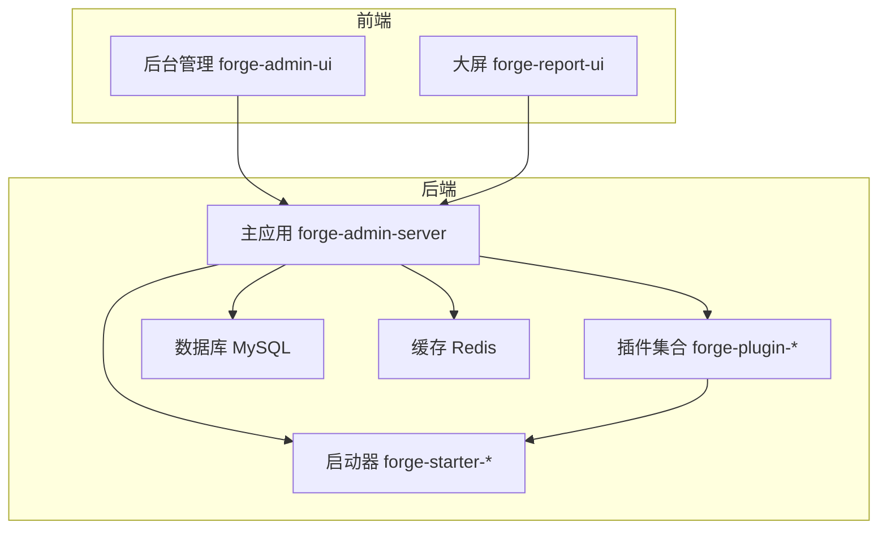
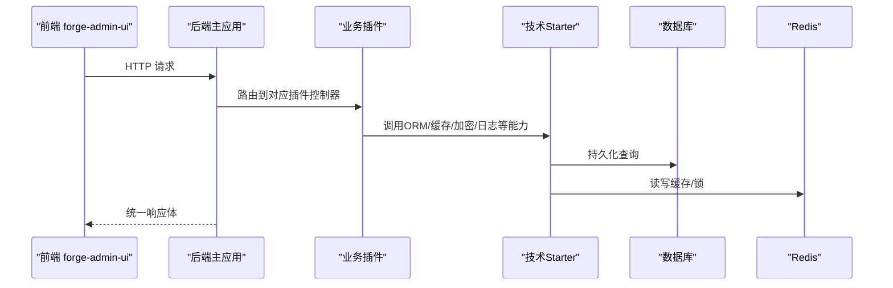
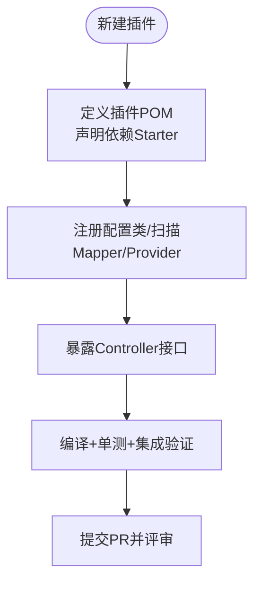
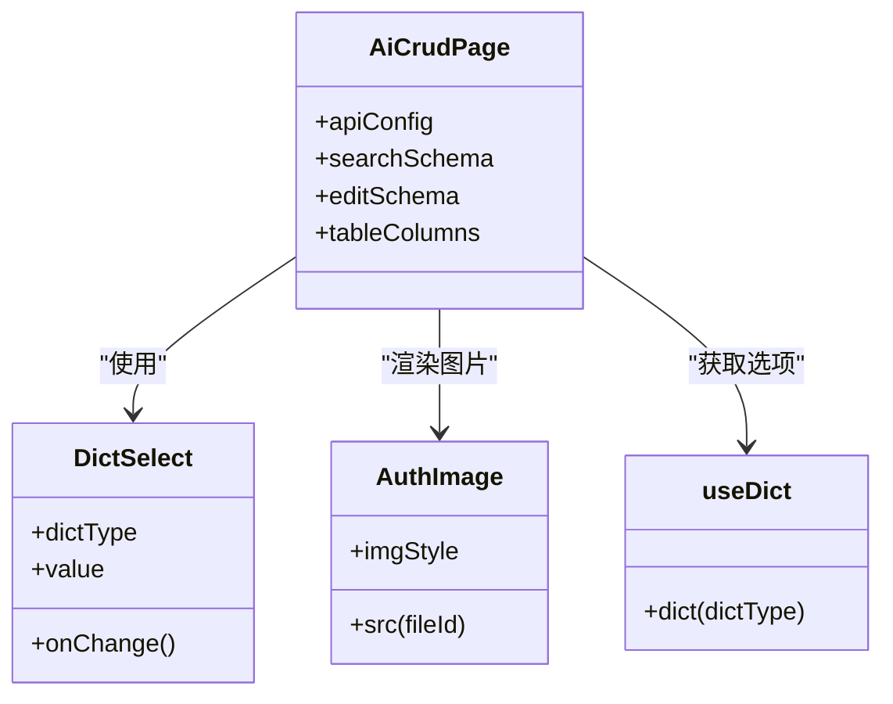
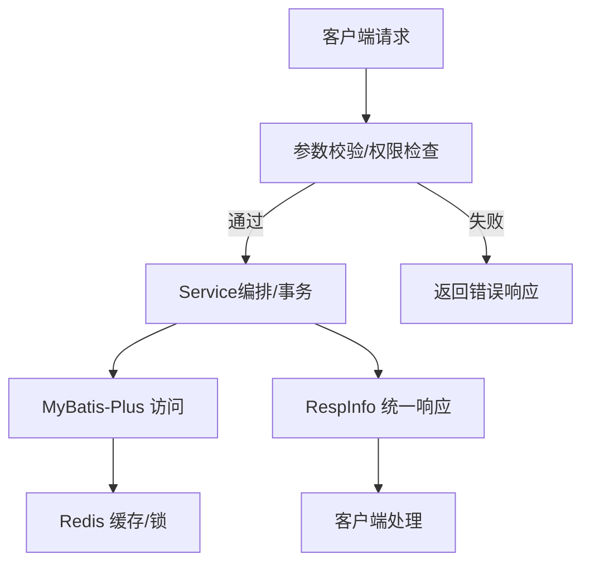
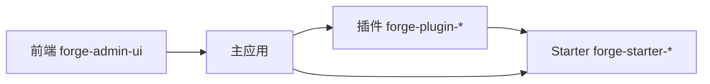

# 开发指南

<cite>
**本文引用的文件**
- [README.md](file://README.md)
- [Forge Admin前端开发与组件规范.md](file://forge-admin-ui/Forge Admin前端开发与组件规范.md)
- [编码规范（后端）.md](file://code-copilot/rules/coding-style.md)
- [自动化测试与验证标准.md](file://code-copilot/rules/automated-testing-standard.md)
- [工程上下文.md](file://code-copilot/rules/project-context.md)
- [package.json](file://forge-admin-ui/package.json)
- [common-rules.md](file://forge-admin-ui/.turing_coder_rules/common-rules.md)
- [forge-plugin-parent/pom.xml](file://forge-server/forge-framework/forge-plugin-parent/pom.xml)
</cite>

## 目录
1. [简介](#简介)
2. [项目结构](#项目结构)
3. [核心组件](#核心组件)
4. [架构总览](#架构总览)
5. [详细组件分析](#详细组件分析)
6. [依赖分析](#依赖分析)
7. [性能考虑](#性能考虑)
8. [故障排查指南](#故障排查指南)
9. [结论](#结论)
10. [附录](#附录)

## 简介
本指南面向 Forge Admin 的开发者与协作者，覆盖编码规范、提交规范、测试规范、文档规范；深入说明插件开发流程、组件开发模式、API 设计原则与代码审查标准；并提供开发环境搭建、IDE 配置、调试技巧、性能分析与质量保证措施，以及团队协作最佳实践。目标是让新成员快速上手、老成员高效协作，确保代码质量与交付稳定性。

## 项目结构
Forge Admin 采用“微内核 + 插件化”的后端架构与“Vue3 + Naive UI + UnoCSS”的前端工程组织：
- 后端分层：starter（技术能力）、plugin（业务能力）、应用服务聚合插件对外提供接口。
- 前端分层：views/components/composables/api/utils/stores 等职责清晰，统一通过请求工具与字典能力。

```mermaid
graph TB
subgraph "后端"
A["主应用 forge-admin-server"]
B["插件集合 forge-plugin-*"]
C["启动器 forge-starter-*"]
D["数据库 MySQL"]
E["缓存 Redis"]
end
subgraph "前端"
F["后台管理 forge-admin-ui"]
G["大屏 forge-report-ui"]
end
A --> B
A --> C
B --> C
A --> D
A --> E
F --> A
G --> A
```

图表来源
- [README.md:241-259](file://README.md#L241-L259)
- [工程上下文.md:51-109](file://code-copilot/rules/project-context.md#L51-L109)

章节来源
- [README.md:241-259](file://README.md#L241-L259)
- [工程上下文.md:51-109](file://code-copilot/rules/project-context.md#L51-L109)

## 核心组件
- 插件体系：系统、任务、消息、流程、AI、协同、数据等插件以 starter 为基座组合，主应用按需装配。
- 前端通用能力：AiCrudPage/AiForm/AiTable、字典、权限、文件鉴权、主从工作台等。
- 构建与工具链：Maven（后端）、pnpm/Vite（前端）、ESLint、Vitest、Flyway。

章节来源
- [README.md:489-499](file://README.md#L489-L499)
- [Forge Admin前端开发与组件规范.md:20-39](file://forge-admin-ui/Forge Admin前端开发与组件规范.md#L20-L39)
- [package.json:6-17](file://forge-admin-ui/package.json#L6-L17)

## 架构总览
后端采用 Starter 抽象技术能力，Plugin 封装业务域，应用服务聚合并暴露 API；前端通过统一的请求与组件库实现 CRUD、表单、表格、权限与文件处理。

```mermaid
sequenceDiagram
participant FE as "前端 forge-admin-ui"
participant BE as "后端主应用"
participant PL as "业务插件"
participant ST as "技术Starter"
participant DB as "数据库"
participant RD as "Redis"
FE->>BE : HTTP 请求
BE->>PL : 路由到对应插件控制器
PL->>ST : 调用ORM/缓存/加密/日志等能力
ST->>DB : 持久化查询
ST->>RD : 读写缓存/锁
BE-->>FE : 统一响应体
```

图表来源
- [工程上下文.md:176-206](file://code-copilot/rules/project-context.md#L176-L206)
- [README.md:68-73](file://README.md#L68-L73)

## 详细组件分析

### 插件开发流程
- 新增插件应遵循“仅依赖 Starter，不反向依赖其他 Plugin”的原则，通过 SPI/Provider 注册扩展点。
- 在插件父 POM 中声明模块，并在主应用引入该插件。
- 插件内按 Controller/Service/Manager/Mapper 分层，DTO/VO 明确类型，避免 Map 接收请求体。

```mermaid
flowchart TD
Start(["新建插件"]) --> DefinePOM["定义插件POM<br/>声明依赖Starter"]
DefinePOM --> RegisterBean["注册配置类/扫描Mapper/Provider"]
RegisterBean --> ExposeAPI["暴露Controller接口"]
ExposeAPI --> TestVerify["编译+单测+集成验证"]
TestVerify --> MergePR["提交PR并评审"]
```

图表来源
- [forge-plugin-parent/pom.xml:18-30](file://forge-server/forge-framework/forge-plugin-parent/pom.xml#L18-L30)
- [工程上下文.md:176-206](file://code-copilot/rules/project-context.md#L176-L206)

章节来源
- [forge-plugin-parent/pom.xml:18-30](file://forge-server/forge-framework/forge-plugin-parent/pom.xml#L18-L30)
- [工程上下文.md:176-206](file://code-copilot/rules/project-context.md#L176-L206)

### 组件开发模式（前端）
- 页面使用 AiCrudPage/AiForm/AiTable 进行配置化开发，减少样板代码。
- 字典通过 useDict 获取，Schema 用 computed 派生，保证异步回显。
- 图片/文件字段使用 AuthImage 与 getFileUrl，避免 token 缺失导致下载失败。
- 样式优先 UnoCSS，复杂样式使用 scoped SCSS，主题变量驱动亮暗主题。

```mermaid
classDiagram
class AiCrudPage {
+apiConfig
+searchSchema
+editSchema
+tableColumns
}
class DictSelect {
+dictType
+value
+onChange()
}
class AuthImage {
+src(fileId)
+imgStyle
}
class useDict {
+dict(dictType)
}
AiCrudPage --> DictSelect : "使用"
AiCrudPage --> AuthImage : "渲染图片"
AiCrudPage --> useDict : "获取选项"
```

图表来源
- [Forge Admin前端开发与组件规范.md:80-96](file://forge-admin-ui/Forge Admin前端开发与组件规范.md#L80-L96)
- [编码规范（后端）.md:52-87](file://code-copilot/rules/coding-style.md#L52-L87)

章节来源
- [Forge Admin前端开发与组件规范.md:80-96](file://forge-admin-ui/Forge Admin前端开发与组件规范.md#L80-L96)
- [编码规范（后端）.md:52-87](file://code-copilot/rules/coding-style.md#L52-L87)

### API 设计原则
- RESTful 风格：GET /page、GET /{id}、POST /、PUT /、DELETE /{id}。
- 统一响应体 RespInfo.success/error。
- 敏感接口使用注解加解密；Controller 必须使用 DTO/VO，禁止 Map 接收请求体。
- 枚举替代魔法值，前端展示走字典，前后端状态码一致。

```mermaid
flowchart TD
Req["客户端请求"] --> Validate["参数校验/权限检查"]
Validate --> |通过| Service["Service编排/事务"]
Validate --> |失败| Err["返回错误响应"]
Service --> ORM["MyBatis-Plus 访问"]
ORM --> Cache["Redis 缓存/锁"]
Service --> Resp["RespInfo 统一响应"]
Resp --> Client["客户端处理"]
```

图表来源
- [工程上下文.md:344-357](file://code-copilot/rules/project-context.md#L344-L357)
- [编码规范（后端）.md:89-117](file://code-copilot/rules/coding-style.md#L89-L117)

章节来源
- [工程上下文.md:344-357](file://code-copilot/rules/project-context.md#L344-L357)
- [编码规范（后端）.md:89-117](file://code-copilot/rules/coding-style.md#L89-L117)

### 代码审查标准
- 是否复用现有组件/Composable/API，避免重复实现。
- 是否正确处理 loading、空态、错误、重复点击与组件卸载。
- 是否遵守字典、租户、权限、文件与加密约定。
- 是否避免硬编码颜色、枚举、接口地址、密钥与用户敏感信息。
- 是否在亮暗主题与窄屏下保持可读、可滚动、可点击。
- 是否只修改任务相关文件，保留用户工作区改动。

章节来源
- [Forge Admin前端开发与组件规范.md:268-289](file://forge-admin-ui/Forge Admin前端开发与组件规范.md#L268-L289)

## 依赖分析
- 后端插件由 forge-plugin-parent 统一管理，主应用按需引入；Starter 提供跨插件共享能力。
- 前端依赖 Vue3、Naive UI、UnoCSS、Pinia、Vite 等，脚本命令集中管理构建与测试。

```mermaid
graph LR
P["插件 forge-plugin-*"] --> S["Starter forge-starter-*"]
A["主应用"] --> P
A --> S
FE["前端 forge-admin-ui"] --> A
```

图表来源
- [forge-plugin-parent/pom.xml:18-30](file://forge-server/forge-framework/forge-plugin-parent/pom.xml#L18-L30)
- [package.json:19-105](file://forge-admin-ui/package.json#L19-L105)

章节来源
- [forge-plugin-parent/pom.xml:18-30](file://forge-server/forge-framework/forge-plugin-parent/pom.xml#L18-L30)
- [package.json:19-105](file://forge-admin-ui/package.json#L19-L105)

## 性能考虑
- 后端
  - 外部调用设置超时与降级；并发场景明确同步策略。
  - 高频查询建索引，避免全表扫描；SQL 幂等或防重。
  - 合理使用缓存与分布式锁，避免热点竞争。
- 前端
  - 列表分页、懒加载与虚拟滚动；大组件按需动态导入。
  - 计算属性与受控状态最小化重渲染；避免无意义动画。
  - 图片/文件通过鉴权组件与工具函数，减少无效请求。

章节来源
- [编码规范（后端）.md:22-28](file://code-copilot/rules/coding-style.md#L22-L28)
- [Forge Admin前端开发与组件规范.md:121-129](file://forge-admin-ui/Forge Admin前端开发与组件规范.md#L121-L129)

## 故障排查指南
- 首次启动报数据库/Redis 连接错误：检查 application-dev.yml 与端口、账号密码。
- 前端请求失败：确认后端端口与 .env.development 代理目标。
- 字典为空：检查数据库中字典数据的 tenant_id 是否为 1（被拦截器过滤）。
- 图片无法预览/下载：使用 AuthImage 与 getFileUrl，避免直接拼接 URL。
- Flyway 迁移失败：检查 SQL 命名、占位符与幂等性；查看 forge_schema_history。

章节来源
- [README.md:502-518](file://README.md#L502-L518)
- [编码规范（后端）.md:37-49](file://code-copilot/rules/coding-style.md#L37-L49)
- [编码规范（后端）.md:52-87](file://code-copilot/rules/coding-style.md#L52-L87)

## 结论
Forge Admin 以插件化与 Starter 解耦技术能力，配合前端配置化组件与统一规范，形成高内聚、低耦合的工程体系。遵循本指南的编码、提交、测试与文档规范，结合自动化检查与最小闭环验证，可显著提升交付质量与团队协作效率。

## 附录

### 开发环境与 IDE 配置
- 环境要求：JDK 17+、Node.js 20.19+、pnpm 8+、MySQL 8.0+、Redis 6.0+。
- 后端：复制 application-dev.example.yml 为 application-dev.yml，配置数据库与 Redis，使用 mvn spring-boot:run 启动。
- 前端：进入 forge-admin-ui，执行 pnpm install 与 pnpm dev。
- IDE：启用 ESLint、Vite 插件、Vue DevTools；Java 侧开启 Lombok/MapStruct 注解处理器。

章节来源
- [README.md:265-393](file://README.md#L265-L393)
- [工程上下文.md:295-327](file://code-copilot/rules/project-context.md#L295-L327)

### 编码规范要点
- 命名：类名大驼峰、方法小驼峰、常量全大写；禁止拼音与中英混拼。
- 异常与日志：业务异常带错误码；系统异常兜底；禁止吞异常；日志不含敏感信息。
- SQL：基础字段齐全；utf8mb4/InnoDB；高频字段索引；禁止模板占位符泄露。
- 前端：字典/图片/操作列按钮/样式层次/可访问性均有明确约定。

章节来源
- [编码规范（后端）.md:6-36](file://code-copilot/rules/coding-style.md#L6-L36)
- [编码规范（后端）.md:37-117](file://code-copilot/rules/coding-style.md#L37-L117)
- [Forge Admin前端开发与组件规范.md:98-136](file://forge-admin-ui/Forge Admin前端开发与组件规范.md#L98-L136)

### 提交规范
- 禁止 master 分支变更；每个 task/fix 一个 commit；commit 前编译通过；禁止自动 Push。
- Message 格式：[<变更名>] <中文简述>。
- 前端提交前执行 git diff --check、ESLint 与构建。

章节来源
- [编码规范（后端）.md:30-36](file://code-copilot/rules/coding-style.md#L30-L36)
- [Forge Admin前端开发与组件规范.md:130-136](file://forge-admin-ui/Forge Admin前端开发与组件规范.md#L130-L136)

### 测试规范
- 增量优先、证据优先、最小闭环、可复跑、不污染环境。
- 根据变更类型选择验证矩阵：后端编译、Mapper XML 语法、Flyway 静态检查、前端构建与浏览器验证。
- 记录执行命令、关键输出、失败原因与跳过项；回填 tasks/spec/memory。

章节来源
- [自动化测试与验证标准.md:5-40](file://code-copilot/rules/automated-testing-standard.md#L5-L40)
- [自动化测试与验证标准.md:42-80](file://code-copilot/rules/automated-testing-standard.md#L42-L80)
- [自动化测试与验证标准.md:81-134](file://code-copilot/rules/automated-testing-standard.md#L81-L134)

### 文档规范
- 需求与设计：先 Spec/Task，再 Code（No Spec No Code）。
- 变更记录：在 code-copilot/changes 下维护 spec/tasks/test-spec/execution-log。
- 知识库：将决策与踩坑沉淀至 memory/decisions 与 pitfalls。

章节来源
- [工程上下文.md:433-442](file://code-copilot/rules/project-context.md#L433-L442)
- [自动化测试与验证标准.md:61-80](file://code-copilot/rules/automated-testing-standard.md#L61-L80)

### 调试技巧
- 后端：统一异常处理器、P6Spy SQL 监控、日志分级；必要时使用 X-Inner-Call 做内部链路验证。
- 前端：Vue DevTools、Network 面板、控制台日志（仅开发环境）；构建产物可视化分析。
- 数据库：Flyway 历史表、慢查询与索引分析。

章节来源
- [工程上下文.md:344-357](file://code-copilot/rules/project-context.md#L344-L357)
- [common-rules.md:538-560](file://forge-admin-ui/.turing_coder_rules/common-rules.md#L538-L560)

### 质量保证措施
- 静态检查：ESLint、构建产物校验、git diff --check。
- 单元测试：关键逻辑补充单测；覆盖率关注核心路径。
- 集成验证：必要服务联调、接口 curl 验证、数据库落库检查。
- 安全：敏感字段脱敏、禁止明文密钥、权限与数据范围后端最终控制。

章节来源
- [Forge Admin前端开发与组件规范.md:268-289](file://forge-admin-ui/Forge Admin前端开发与组件规范.md#L268-L289)
- [编码规范（后端）.md:13-28](file://code-copilot/rules/coding-style.md#L13-L28)
- [编码规范（后端）.md:94-117](file://code-copilot/rules/coding-style.md#L94-L117)

### 团队协作最佳实践
- 分支与 PR：feature 分支开发，PR 描述包含背景、影响面、验证命令与结果。
- 评审清单：复用性、健壮性、安全性、可维护性、可观测性。
- 知识共享：沉淀决策与踩坑，定期复盘与更新规范。

章节来源
- [自动化测试与验证标准.md:5-12](file://code-copilot/rules/automated-testing-standard.md#L5-L12)
- [Forge Admin前端开发与组件规范.md:281-289](file://forge-admin-ui/Forge Admin前端开发与组件规范.md#L281-L289)