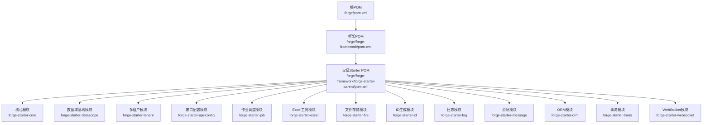
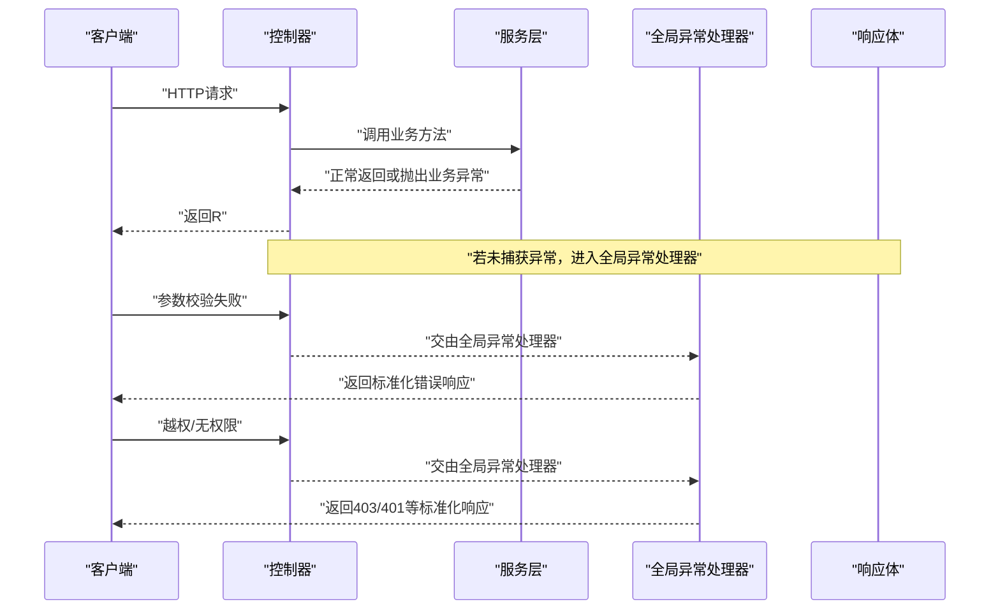
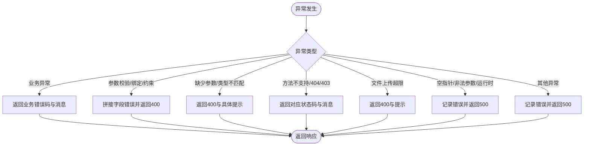
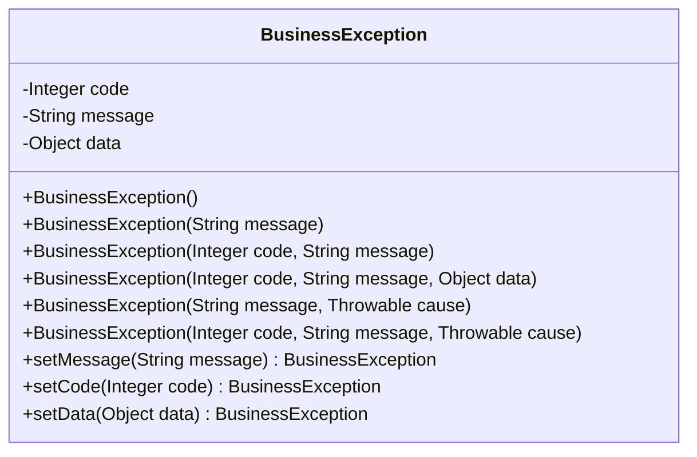
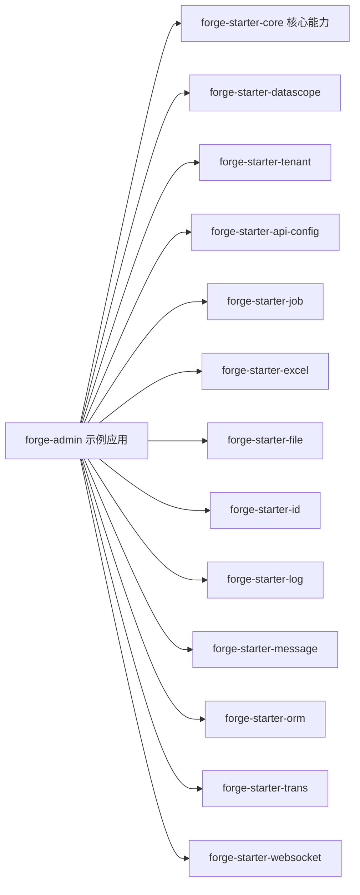

# 开发规范

<cite>
**本文引用的文件**
- [GlobalExceptionHandler.java](file://forge/forge-framework/forge-starter-parent/forge-starter-core/src/main/java/com/mdframe/forge/starter/core/exception/GlobalExceptionHandler.java)
- [BusinessException.java](file://forge/forge-framework/forge-starter-parent/forge-starter-core/src/main/java/com/mdframe/forge/starter/core/exception/BusinessException.java)
- [RespInfo.java](file://forge/forge-framework/forge-starter-parent/forge-starter-core/src/main/java/com/mdframe/forge/starter/core/domain/RespInfo.java)
- [application.yml](file://forge/forge-admin/src/main/resources/application.yml)
- [README.md](file://forge/forge-framework/forge-starter-parent/forge-starter-core/README.md)
- [EXCEPTION_USAGE.md](file://forge/forge-framework/forge-starter-parent/forge-starter-core/EXCEPTION_USAGE.md)
- [DATA_SCOPE_CONFIG_GUIDE.md](file://forge/forge-framework/forge-starter-parent/forge-starter-datascope/DATA_SCOPE_CONFIG_GUIDE.md)
- [TENANT_USAGE.md](file://forge/forge-framework/forge-starter-parent/forge-starter-tenant/README.md)
- [README.md](file://forge/forge-framework/forge-starter-parent/forge-starter-api-config/README.md)
- [README.md](file://forge/forge-framework/forge-starter-parent/forge-starter-job/API.md)
- [README.md](file://forge/forge-framework/forge-starter-parent/forge-starter-excel/README.md)
- [README.md](file://forge/forge-framework/forge-starter-parent/forge-starter-file/README.md)
- [README.md](file://forge/forge-framework/forge-starter-parent/forge-starter-id/README.md)
- [README.md](file://forge/forge-framework/forge-starter-parent/forge-starter-log/README.md)
- [README.md](file://forge/forge-framework/forge-starter-parent/forge-starter-message/README.md)
- [README.md](file://forge/forge-framework/forge-starter-parent/forge-starter-orm/README.md)
- [README.md](file://forge/forge-framework/forge-starter-parent/forge-starter-trans/README.md)
- [README.md](file://forge/forge-framework/forge-starter-parent/forge-starter-websocket/README.md)
- [.gitignore](file://forge/.gitignore)
- [.gitignore](file://forge/forge-admin/.gitignore)
- [.gitignore](file://forge/forge-framework/.gitignore)
- [pom.xml](file://forge/pom.xml)
- [pom.xml](file://forge/forge-framework/pom.xml)
- [pom.xml](file://forge/forge-framework/forge-starter-parent/pom.xml)
- [pom.xml](file://forge/forge-framework/forge-starter-parent/forge-starter-core/pom.xml)
- [pom.xml](file://forge/forge-framework/forge-starter-parent/forge-starter-datascope/pom.xml)
- [pom.xml](file://forge/forge-framework/forge-starter-parent/forge-starter-tenant/pom.xml)
- [pom.xml](file://forge/forge-framework/forge-starter-parent/forge-starter-api-config/pom.xml)
- [pom.xml](file://forge/forge-framework/forge-starter-parent/forge-starter-job/pom.xml)
- [pom.xml](file://forge/forge-framework/forge-starter-parent/forge-starter-excel/pom.xml)
- [pom.xml](file://forge/forge-framework/forge-starter-parent/forge-starter-file/pom.xml)
- [pom.xml](file://forge/forge-framework/forge-starter-parent/forge-starter-id/pom.xml)
- [pom.xml](file://forge/forge-framework/forge-starter-parent/forge-starter-log/pom.xml)
- [pom.xml](file://forge/forge-framework/forge-starter-parent/forge-starter-message/pom.xml)
- [pom.xml](file://forge/forge-framework/forge-starter-parent/forge-starter-orm/pom.xml)
- [pom.xml](file://forge/forge-framework/forge-starter-parent/forge-starter-trans/pom.xml)
- [pom.xml](file://forge/forge-framework/forge-starter-parent/forge-starter-websocket/pom.xml)
</cite>

## 目录
1. 引言
2. 项目结构
3. 核心组件
4. 架构总览
5. 详细组件分析
6. 依赖分析
7. 性能考虑
8. 故障排查指南
9. 结论
10. 附录

## 引言
本开发规范面向Forge框架的Java后端与前端团队，旨在统一代码风格、命名约定、注释标准、异常处理机制与响应格式，规范实体类与接口设计、参数校验与全局异常处理的使用方式，明确代码审查清单、Git提交与分支管理策略，以提升团队协作效率与代码质量。

## 项目结构
Forge采用多模块Maven工程组织，核心能力通过starter模块组合提供，admin子项目作为示例与集成入口。整体结构遵循“父POM聚合+子模块拆分”的分层架构，便于功能扩展与版本治理。

图表来源
- [pom.xml](file://forge/pom.xml#L1-L50)
- [pom.xml](file://forge/forge-framework/pom.xml#L1-L50)
- [pom.xml](file://forge/forge-framework/forge-starter-parent/pom.xml#L1-L50)

章节来源
- [pom.xml](file://forge/pom.xml#L1-L120)
- [pom.xml](file://forge/forge-framework/pom.xml#L1-L120)
- [pom.xml](file://forge/forge-framework/forge-starter-parent/pom.xml#L1-L120)

## 核心组件
- 全局异常处理器：集中捕获并规范化各类异常，统一返回响应体。
- 业务异常类：封装业务错误码、消息与可选数据，便于上抛与前端展示。
- 响应体模型：统一响应结构，包含状态码、消息与数据载体。

章节来源
- [GlobalExceptionHandler.java](file://forge/forge-framework/forge-starter-parent/forge-starter-core/src/main/java/com/mdframe/forge/starter/core/exception/GlobalExceptionHandler.java#L24-L175)
- [BusinessException.java](file://forge/forge-framework/forge-starter-parent/forge-starter-core/src/main/java/com/mdframe/forge/starter/core/exception/BusinessException.java#L5-L86)
- [RespInfo.java](file://forge/forge-framework/forge-starter-parent/forge-starter-core/src/main/java/com/mdframe/forge/starter/core/domain/RespInfo.java)

## 架构总览
下图展示了从控制器到全局异常处理器的典型调用链路，以及异常分类与响应构建流程。

图表来源
- [GlobalExceptionHandler.java](file://forge/forge-framework/forge-starter-parent/forge-starter-core/src/main/java/com/mdframe/forge/starter/core/exception/GlobalExceptionHandler.java#L35-L173)
- [BusinessException.java](file://forge/forge-framework/forge-starter-parent/forge-starter-core/src/main/java/com/mdframe/forge/starter/core/exception/BusinessException.java#L10-L85)

## 详细组件分析

### 全局异常处理器（GlobalExceptionHandler）
- 职责：统一拦截各类异常，记录日志，构造统一响应体。
- 覆盖范围：业务异常、参数校验异常、参数绑定异常、约束违反异常、缺少请求参数、参数类型不匹配、请求方法不支持、404、403、文件上传超限、空指针、非法参数、运行时异常、未知异常。
- 日志策略：对警告级别异常输出URI与错误信息；对错误级别异常输出URI与堆栈。
- 响应策略：根据异常类型映射到对应HTTP状态码与错误码，统一通过响应体模型返回。

图表来源
- [GlobalExceptionHandler.java](file://forge/forge-framework/forge-starter-parent/forge-starter-core/src/main/java/com/mdframe/forge/starter/core/exception/GlobalExceptionHandler.java#L35-L173)

章节来源
- [GlobalExceptionHandler.java](file://forge/forge-framework/forge-starter-parent/forge-starter-core/src/main/java/com/mdframe/forge/starter/core/exception/GlobalExceptionHandler.java#L24-L175)

### 业务异常类（BusinessException）
- 设计要点：继承运行时异常，提供多构造器以支持不同场景（仅消息、带错误码、带数据），支持链式设置属性。
- 使用建议：在服务层抛出，由全局异常处理器捕获并返回给前端；避免在控制器层直接构造业务异常。

图表来源
- [BusinessException.java](file://forge/forge-framework/forge-starter-parent/forge-starter-core/src/main/java/com/mdframe/forge/starter/core/exception/BusinessException.java#L10-L85)

章节来源
- [BusinessException.java](file://forge/forge-framework/forge-starter-parent/forge-starter-core/src/main/java/com/mdframe/forge/starter/core/exception/BusinessException.java#L5-L86)

### 响应体模型（RespInfo）
- 设计要点：统一承载响应状态码、消息与数据，配合全局异常处理器进行序列化输出。
- 使用建议：控制器返回时优先使用响应体模型；全局异常处理器在捕获异常时也通过该模型返回。

章节来源
- [RespInfo.java](file://forge/forge-framework/forge-starter-parent/forge-starter-core/src/main/java/com/mdframe/forge/starter/core/domain/RespInfo.java)

### 参数校验与接口设计
- 参数校验：优先使用Bean Validation注解进行入参校验；控制器方法使用@Validated或@Valid触发校验。
- 接口设计：遵循REST风格，统一使用响应体模型；对可选参数提供默认值与边界检查；对敏感操作增加鉴权与审计。
- 参考文档：各starter模块README中包含使用示例与注意事项。

章节来源
- [GlobalExceptionHandler.java](file://forge/forge-framework/forge-starter-parent/forge-starter-core/src/main/java/com/mdframe/forge/starter/core/exception/GlobalExceptionHandler.java#L47-L78)
- [README.md](file://forge/forge-framework/forge-starter-parent/forge-starter-api-config/README.md)
- [README.md](file://forge/forge-framework/forge-starter-parent/forge-starter-job/API.md)
- [README.md](file://forge/forge-framework/forge-starter-parent/forge-starter-excel/README.md)
- [README.md](file://forge/forge-framework/forge-starter-parent/forge-starter-file/README.md)
- [README.md](file://forge/forge-framework/forge-starter-parent/forge-starter-id/README.md)
- [README.md](file://forge/forge-framework/forge-starter-parent/forge-starter-log/README.md)
- [README.md](file://forge/forge-framework/forge-starter-parent/forge-starter-message/README.md)
- [README.md](file://forge/forge-framework/forge-starter-parent/forge-starter-orm/README.md)
- [README.md](file://forge/forge-framework/forge-starter-parent/forge-starter-trans/README.md)
- [README.md](file://forge/forge-framework/forge-starter-parent/forge-starter-websocket/README.md)

### 数据域隔离与多租户
- 数据域隔离：通过配置启用表级/列级数据范围控制，避免跨域数据泄露。
- 多租户：通过租户维度隔离数据，结合路由与拦截器实现自动切换数据源与上下文。

章节来源
- [DATA_SCOPE_CONFIG_GUIDE.md](file://forge/forge-framework/forge-starter-parent/forge-starter-datascope/DATA_SCOPE_CONFIG_GUIDE.md)
- [TENANT_USAGE.md](file://forge/forge-framework/forge-starter-parent/forge-starter-tenant/README.md)

## 依赖分析
- 模块间耦合：核心模块提供异常与响应基础能力，其他模块按需引入；admin示例模块聚合多个starter模块。
- 外部依赖：Spring Web、Validation、日志、数据库驱动等由父POM统一管理。
- 版本治理：通过父POM锁定版本，子模块按需声明依赖。

图表来源
- [pom.xml](file://forge/forge-framework/forge-starter-parent/pom.xml#L1-L120)
- [pom.xml](file://forge/forge-admin/pom.xml#L1-L120)

章节来源
- [pom.xml](file://forge/forge-framework/forge-starter-parent/pom.xml#L1-L200)
- [pom.xml](file://forge/forge-admin/pom.xml#L1-L200)

## 性能考虑
- 异常处理开销：避免在高频路径中频繁抛出异常；对可预期的边界条件使用快速失败与参数校验减少异常路径。
- 响应体序列化：统一使用响应体模型，减少重复序列化逻辑；对大对象分页或懒加载。
- 日志级别：区分warn与error，避免在热路径打印过多堆栈；生产环境适当降低日志级别。

## 故障排查指南
- 业务异常：检查服务层是否正确抛出业务异常；确认全局异常处理器已捕获并返回。
- 参数校验异常：核对控制器方法上的校验注解与@Valid/@Validated使用位置；查看字段错误集合。
- 权限与403：确认鉴权配置与权限白名单；检查访问拒绝日志。
- 文件上传：检查最大上传大小配置与异常捕获。
- 404：确认URL路径与控制器映射；检查静态资源与Swagger配置。
- 运行时异常：查看错误日志定位问题；必要时补充更精确的异常类型。

章节来源
- [GlobalExceptionHandler.java](file://forge/forge-framework/forge-starter-parent/forge-starter-core/src/main/java/com/mdframe/forge/starter/core/exception/GlobalExceptionHandler.java#L35-L173)

## 结论
通过统一的异常处理与响应模型、规范的参数校验与接口设计、清晰的模块职责与版本治理，Forge框架能够有效提升团队开发一致性与代码质量。建议在日常开发中严格遵循本规范，并结合模块文档与示例进行落地。

## 附录

### Java代码规范与命名约定
- 包名：采用反向域名+模块层级，如com.mdframe.forge.starter.core。
- 类名：采用帕斯卡命名法；接口以I前缀或抽象类以Abstract前缀区分。
- 方法名：采用驼峰命名法；布尔方法以is/has/get等语义动词开头。
- 常量：全大写+下划线分隔。
- 字段：私有字段以下划线前缀，受保护字段不加前缀；枚举项全大写。
- 注释：类与方法使用Javadoc；复杂逻辑添加行内注释；TODO/FIXME标注待办事项。

### 注释标准
- 类注释：描述职责、关键行为与使用注意。
- 方法注释：参数、返回值、异常、示例与注意事项。
- 字段注释：业务含义、取值范围、默认值与约束。
- 配置注释：环境变量、配置项说明与默认值。

### 异常处理最佳实践
- 业务异常：在服务层抛出，携带错误码与可选数据；避免吞掉异常或抛出通用异常。
- 系统异常：由全局异常处理器兜底，保证对外一致的错误响应。
- 自定义异常：尽量复用现有异常类型；新增异常需配套测试与文档。

### 实体类设计规范
- 字段设计：遵循业务语义命名；必要时提供枚举与校验注解。
- 关系映射：使用ORM注解明确一对多/多对多关系；避免N+1查询。
- 序列化：对敏感字段进行脱敏；对外暴露DTO，避免直接暴露持久化实体。

### 接口设计原则
- REST风格：资源名词化、幂等性、状态码语义化。
- 参数校验：入参必填与范围校验前置；返回结构统一。
- 安全性：鉴权、授权与审计日志贯穿接口设计。

### 参数校验规则
- Bean Validation：使用@NotNull、@NotBlank、@Min/@Max、@Pattern等。
- 分组校验：按新增/编辑/删除场景划分校验组。
- 自定义校验：通过Constraint注解与实现类扩展复杂规则。

### 响应格式标准
- 成功：包含状态码、消息与数据；数据可为对象、数组或分页结构。
- 失败：包含状态码、消息与可选错误详情；禁止泄漏敏感信息。
- 统一模型：使用响应体模型承载结果，便于全局拦截与转换。

### 代码审查清单
- 规范性：包名、类名、方法名、注释是否符合规范。
- 正确性：参数校验、边界条件、空值处理、异常分支覆盖。
- 安全性：鉴权、脱敏、SQL注入与XSS防护。
- 可维护性：模块职责清晰、依赖关系合理、文档齐全。
- 性能：热点路径优化、异常与日志控制、缓存与异步处理。

### Git提交规范与分支管理策略
- 提交信息：采用类型+主题+说明的格式；类型包括feat、fix、docs、style、refactor、test、chore等。
- 分支策略：主分支保护，功能开发在feature分支，修复hotfix分支，发布release分支。
- 合并与审核：Pull Request必须通过代码审查；合并前确保通过CI与测试。

章节来源
- [application.yml](file://forge/forge-admin/src/main/resources/application.yml)
- [README.md](file://forge/forge-framework/forge-starter-parent/forge-starter-core/README.md)
- [EXCEPTION_USAGE.md](file://forge/forge-framework/forge-starter-parent/forge-starter-core/EXCEPTION_USAGE.md)
- [.gitignore](file://forge/.gitignore)
- [.gitignore](file://forge/forge-admin/.gitignore)
- [.gitignore](file://forge/forge-framework/.gitignore)