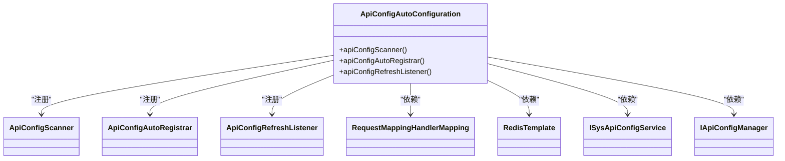
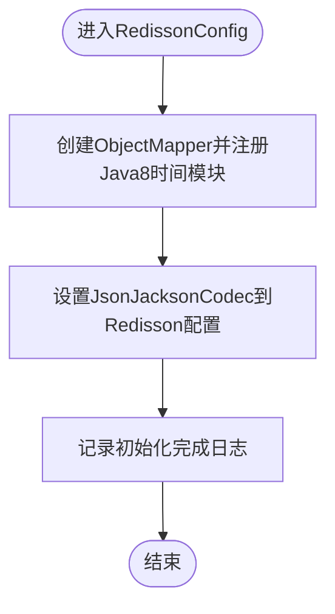
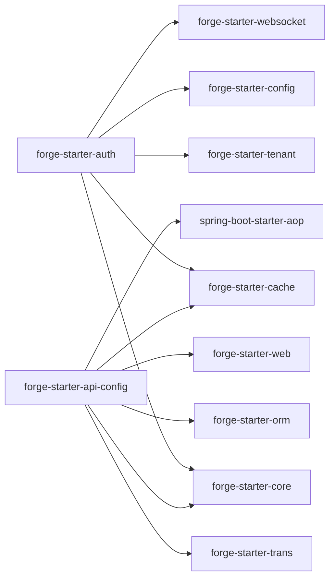

# Starter模块开发

<cite>
**本文引用的文件**
- [forge-starter-parent/pom.xml](file://forge/forge-framework/forge-starter-parent/pom.xml)
- [forge-starter-api-config/pom.xml](file://forge/forge-framework/forge-starter-parent/forge-starter-api-config/pom.xml)
- [forge-starter-auth/pom.xml](file://forge/forge-framework/forge-starter-parent/forge-starter-auth/pom.xml)
- [forge-starter-cache/pom.xml](file://forge/forge-framework/forge-starter-parent/forge-starter-cache/pom.xml)
- [forge-starter-config/pom.xml](file://forge/forge-framework/forge-starter-parent/forge-starter-config/pom.xml)
- [org.springframework.boot.autoconfigure.AutoConfiguration.imports（core）](file://forge/forge-framework/forge-starter-parent/forge-starter-core/src/main/resources/META-INF/spring/org.springframework.boot.autoconfigure.AutoConfiguration.imports)
- [org.springframework.boot.autoconfigure.AutoConfiguration.imports（cache）](file://forge/forge-framework/forge-starter-parent/forge-starter-cache/src/main/resources/META-INF/spring/org.springframework.boot.autoconfigure.AutoConfiguration.imports)
- [JacksonConfig.java](file://forge/forge-framework/forge-starter-parent/forge-starter-core/src/main/java/com/mdframe/forge/starter/core/config/JacksonConfig.java)
- [ExceptionAutoConfiguration.java](file://forge/forge-framework/forge-starter-parent/forge-starter-core/src/main/java/com/mdframe/forge/starter/core/config/ExceptionAutoConfiguration.java)
- [RedissonConfig.java](file://forge/forge-framework/forge-starter-parent/forge-starter-cache/src/main/java/com/mdframe/forge/starter/cache/config/RedissonConfig.java)
- [ApiConfigAutoConfiguration.java](file://forge/forge-framework/forge-starter-parent/forge-starter-api-config/src/main/java/com/mdframe/forge/starter/apiconfig/config/ApiConfigAutoConfiguration.java)
</cite>

## 目录
1. [简介](#简介)
2. [项目结构](#项目结构)
3. [核心组件](#核心组件)
4. [架构总览](#架构总览)
5. [详细组件分析](#详细组件分析)
6. [依赖分析](#依赖分析)
7. [性能考虑](#性能考虑)
8. [故障排查指南](#故障排查指南)
9. [结论](#结论)
10. [附录](#附录)

## 简介
本指南面向希望基于Spring Boot Starter机制开发自定义模块的工程师，围绕Forge框架的Starter体系，系统讲解模块结构设计、依赖管理、自动装配配置与Bean注册策略，并结合真实代码示例，给出从项目初始化、依赖配置、自动装配实现到测试验证的完整开发流程。同时覆盖模块间依赖关系与版本兼容性问题的最佳实践与常见问题解决方案。

## 项目结构
Forge Starter采用多模块聚合的Maven工程组织方式，父POM统一管理子模块，每个子模块代表一个可独立使用的Starter能力单元，如核心能力、缓存、认证、配置中心、任务调度等。Starter之间通过依赖关系形成能力组合，满足不同业务场景下的按需装配。

```mermaid
graph TB
P["forge-starter-parent<br/>父POM"] --> C1["forge-starter-core"]
P --> C2["forge-starter-cache"]
P --> C3["forge-starter-auth"]
P --> C4["forge-starter-config"]
P --> C5["forge-starter-api-config"]
P --> C6["forge-starter-orm"]
P --> C7["forge-starter-web"]
P --> C8["forge-starter-log"]
P --> C9["forge-starter-trans"]
P --> C10["forge-starter-file"]
P --> C11["forge-starter-excel"]
P --> C12["forge-starter-job"]
P --> C13["forge-starter-id"]
P --> C14["forge-starter-datascope"]
P --> C15["forge-starter-message"]
P --> C16["forge-starter-tenant"]
P --> C17["forge-starter-crypto"]
P --> C18["forge-starter-websocket"]
```

图表来源
- [forge-starter-parent/pom.xml](file://forge/forge-framework/forge-starter-parent/pom.xml#L15-L34)

章节来源
- [forge-starter-parent/pom.xml](file://forge/forge-framework/forge-starter-parent/pom.xml#L1-L37)

## 核心组件
- 自动装配入口
  - Spring Boot 2.4+ 推荐使用META-INF/spring/org.springframework.boot.autoconfigure.AutoConfiguration.imports声明自动配置类，无需@EnableAutoConfiguration或@ComponentScan。
  - 示例路径：[org.springframework.boot.autoconfigure.AutoConfiguration.imports（core）](file://forge/forge-framework/forge-starter-parent/forge-starter-core/src/main/resources/META-INF/spring/org.springframework.boot.autoconfigure.AutoConfiguration.imports#L1-L3)
- 核心配置类
  - JacksonConfig：在核心自动配置中前置注册，统一JSON序列化策略（时间类型、大数、时区等）。
    - 参考路径：[JacksonConfig.java](file://forge/forge-framework/forge-starter-parent/forge-starter-core/src/main/java/com/mdframe/forge/starter/core/config/JacksonConfig.java#L24-L44)
  - ExceptionAutoConfiguration：注册全局异常处理器Bean，便于统一异常处理。
    - 参考路径：[ExceptionAutoConfiguration.java](file://forge/forge-framework/forge-starter-parent/forge-starter-core/src/main/java/com/mdframe/forge/starter/core/config/ExceptionAutoConfiguration.java#L12-L19)
- 缓存配置
  - RedissonConfig：自定义Redisson序列化器，支持Java 8时间类型，提升分布式缓存的兼容性与稳定性。
    - 参考路径：[RedissonConfig.java](file://forge/forge-framework/forge-starter-parent/forge-starter-cache/src/main/java/com/mdframe/forge/starter/cache/config/RedissonConfig.java#L23-L33)

章节来源
- [org.springframework.boot.autoconfigure.AutoConfiguration.imports（core）](file://forge/forge-framework/forge-starter-parent/forge-starter-core/src/main/resources/META-INF/spring/org.springframework.boot.autoconfigure.AutoConfiguration.imports#L1-L3)
- [JacksonConfig.java](file://forge/forge-framework/forge-starter-parent/forge-starter-core/src/main/java/com/mdframe/forge/starter/core/config/JacksonConfig.java#L1-L47)
- [ExceptionAutoConfiguration.java](file://forge/forge-framework/forge-starter-parent/forge-starter-core/src/main/java/com/mdframe/forge/starter/core/config/ExceptionAutoConfiguration.java#L1-L21)
- [RedissonConfig.java](file://forge/forge-framework/forge-starter-parent/forge-starter-cache/src/main/java/com/mdframe/forge/starter/cache/config/RedissonConfig.java#L1-L35)

## 架构总览
Forge Starter体系以“核心能力”为基础，向上扩展出认证、缓存、配置中心、任务调度、Excel导入导出、文件存储、消息、事务、数据权限、租户、加解密、WebSocket等模块；向下通过ORM/Web等基础模块支撑。各模块通过依赖组合，实现按需装配与版本统一管理。

```mermaid
graph TB
subgraph "核心层"
CORE["forge-starter-core"]
ORM["forge-starter-orm"]
WEB["forge-starter-web"]
end
subgraph "能力层"
AUTH["forge-starter-auth"]
CACHE["forge-starter-cache"]
CONFIG["forge-starter-config"]
API["forge-starter-api-config"]
LOG["forge-starter-log"]
TRANS["forge-starter-trans"]
EXCEL["forge-starter-excel"]
FILE["forge-starter-file"]
JOB["forge-starter-job"]
ID["forge-starter-id"]
DATASCOPE["forge-starter-datascope"]
MSG["forge-starter-message"]
TENANT["forge-starter-tenant"]
CRYPTO["forge-starter-crypto"]
WS["forge-starter-websocket"]
end
CORE --> AUTH
CORE --> CACHE
CORE --> CONFIG
CORE --> API
CORE --> LOG
CORE --> TRANS
CORE --> EXCEL
CORE --> FILE
CORE --> JOB
CORE --> ID
CORE --> DATASCOPE
CORE --> MSG
CORE --> TENANT
CORE --> CRYPTO
CORE --> WS
ORM --> AUTH
ORM --> API
ORM --> DATASCOPE
ORM --> ID
ORM --> EXCEL
ORM --> FILE
ORM --> JOB
ORM --> LOG
ORM --> TRANS
ORM --> MSG
ORM --> TENANT
ORM --> CRYPTO
ORM --> WS
WEB --> AUTH
WEB --> API
WEB --> EXCEL
WEB --> FILE
WEB --> JOB
WEB --> LOG
WEB --> MSG
WEB --> TENANT
WEB --> WS
```

图表来源
- [forge-starter-parent/pom.xml](file://forge/forge-framework/forge-starter-parent/pom.xml#L15-L34)
- [forge-starter-auth/pom.xml](file://forge/forge-framework/forge-starter-parent/forge-starter-auth/pom.xml#L14-L79)
- [forge-starter-cache/pom.xml](file://forge/forge-framework/forge-starter-parent/forge-starter-cache/pom.xml#L14-L41)
- [forge-starter-config/pom.xml](file://forge/forge-framework/forge-starter-parent/forge-starter-config/pom.xml#L14-L24)
- [forge-starter-api-config/pom.xml](file://forge/forge-framework/forge-starter-parent/forge-starter-api-config/pom.xml#L15-L79)

## 详细组件分析

### 自动装配与条件注解：ApiConfigAutoConfiguration
该类展示了Starter中典型的自动装配实现模式：
- 基于Web应用启用（@ConditionalOnWebApplication）
- 基于配置开关启用（@ConditionalOnProperty，前缀forge.api-config.enabled）
- 异步支持（@EnableAsync）
- Bean注册策略：
  - 扫描器Bean：ApiConfigScanner
  - 自动注册器Bean：ApiConfigAutoRegistrar（受forge.api-config.auto-register控制）
  - 刷新监听器Bean：ApiConfigRefreshListener

图表来源
- [ApiConfigAutoConfiguration.java](file://forge/forge-framework/forge-starter-parent/forge-starter-api-config/src/main/java/com/mdframe/forge/starter/apiconfig/config/ApiConfigAutoConfiguration.java#L22-L56)

章节来源
- [ApiConfigAutoConfiguration.java](file://forge/forge-framework/forge-starter-parent/forge-starter-api-config/src/main/java/com/mdframe/forge/starter/apiconfig/config/ApiConfigAutoConfiguration.java#L1-L57)

### 缓存自动装配：RedissonConfig
该配置类演示了如何在Starter中自定义第三方组件的自动配置：
- 注册RedissonAutoConfigurationCustomizer Bean
- 自定义JsonJacksonCodec，集成Java 8时间模块，确保分布式缓存序列化一致性

图表来源
- [RedissonConfig.java](file://forge/forge-framework/forge-starter-parent/forge-starter-cache/src/main/java/com/mdframe/forge/starter/cache/config/RedissonConfig.java#L23-L33)

章节来源
- [RedissonConfig.java](file://forge/forge-framework/forge-starter-parent/forge-starter-cache/src/main/java/com/mdframe/forge/starter/cache/config/RedissonConfig.java#L1-L35)

### 核心自动装配：JacksonConfig与ExceptionAutoConfiguration
- JacksonConfig
  - 在核心自动配置中前置执行，统一JSON序列化策略（时间格式、大数处理、时区等），避免全局重复配置。
  - 参考路径：[JacksonConfig.java](file://forge/forge-framework/forge-starter-parent/forge-starter-core/src/main/java/com/mdframe/forge/starter/core/config/JacksonConfig.java#L24-L44)
- ExceptionAutoConfiguration
  - 注册全局异常处理器Bean，便于集中处理异常，提升系统可观测性与用户体验。
  - 参考路径：[ExceptionAutoConfiguration.java](file://forge/forge-framework/forge-starter-parent/forge-starter-core/src/main/java/com/mdframe/forge/starter/core/config/ExceptionAutoConfiguration.java#L12-L19)

章节来源
- [JacksonConfig.java](file://forge/forge-framework/forge-starter-parent/forge-starter-core/src/main/java/com/mdframe/forge/starter/core/config/JacksonConfig.java#L1-L47)
- [ExceptionAutoConfiguration.java](file://forge/forge-framework/forge-starter-parent/forge-starter-core/src/main/java/com/mdframe/forge/starter/core/config/ExceptionAutoConfiguration.java#L1-L21)

## 依赖分析
- 模块聚合与继承
  - 父POM统一管理子模块，子模块通过artifactId命名区分功能域，便于版本与依赖统一管控。
  - 参考路径：[forge-starter-parent/pom.xml](file://forge/forge-framework/forge-starter-parent/pom.xml#L15-L34)
- 模块间依赖关系
  - 认证模块依赖核心、缓存、租户、配置、WebSocket等模块，体现“认证能力”对周边能力的复用。
    - 参考路径：[forge-starter-auth/pom.xml](file://forge/forge-framework/forge-starter-parent/forge-starter-auth/pom.xml#L14-L79)
  - API配置管理模块依赖核心、事务、缓存、ORM、Web、AOP等，体现“配置中心”作为横切能力的定位。
    - 参考路径：[forge-starter-api-config/pom.xml](file://forge/forge-framework/forge-starter-parent/forge-starter-api-config/pom.xml#L15-L79)
  - 缓存模块依赖核心、Redisson、Lock4j、Caffeine等，强调“缓存与分布式锁”的组合能力。
    - 参考路径：[forge-starter-cache/pom.xml](file://forge/forge-framework/forge-starter-parent/forge-starter-cache/pom.xml#L14-L41)
  - 配置模块依赖核心与Spring JDBC Starter，强调“属性配置”的基础能力。
    - 参考路径：[forge-starter-config/pom.xml](file://forge/forge-framework/forge-starter-parent/forge-starter-config/pom.xml#L14-L24)

图表来源
- [forge-starter-auth/pom.xml](file://forge/forge-framework/forge-starter-parent/forge-starter-auth/pom.xml#L14-L79)
- [forge-starter-api-config/pom.xml](file://forge/forge-framework/forge-starter-parent/forge-starter-api-config/pom.xml#L15-L79)

章节来源
- [forge-starter-auth/pom.xml](file://forge/forge-framework/forge-starter-parent/forge-starter-auth/pom.xml#L1-L82)
- [forge-starter-api-config/pom.xml](file://forge/forge-framework/forge-starter-parent/forge-starter-api-config/pom.xml#L1-L82)
- [forge-starter-cache/pom.xml](file://forge/forge-framework/forge-starter-parent/forge-starter-cache/pom.xml#L1-L45)
- [forge-starter-config/pom.xml](file://forge/forge-framework/forge-starter-parent/forge-starter-config/pom.xml#L1-L28)

## 性能考虑
- 序列化性能与一致性
  - 在缓存与分布式场景中，统一使用Jackson序列化策略，减少因类型不一致导致的反序列化失败与性能损耗。
  - 参考路径：[RedissonConfig.java](file://forge/forge-framework/forge-starter-parent/forge-starter-cache/src/main/java/com/mdframe/forge/starter/cache/config/RedissonConfig.java#L23-L33)
- 时间类型处理
  - 统一时间序列化格式与时区，避免跨系统时间解析差异带来的性能与数据问题。
  - 参考路径：[JacksonConfig.java](file://forge/forge-framework/forge-starter-parent/forge-starter-core/src/main/java/com/mdframe/forge/starter/core/config/JacksonConfig.java#L28-L44)
- 异步与并发
  - 对需要异步刷新或批量处理的配置中心能力，开启异步支持，降低主线程阻塞风险。
  - 参考路径：[ApiConfigAutoConfiguration.java](file://forge/forge-framework/forge-starter-parent/forge-starter-api-config/src/main/java/com/mdframe/forge/starter/apiconfig/config/ApiConfigAutoConfiguration.java#L25-L56)

## 故障排查指南
- 自动装配未生效
  - 确认是否正确声明自动配置类（META-INF/spring/org.springframework.boot.autoconfigure.AutoConfiguration.imports）。
    - 参考路径：[org.springframework.boot.autoconfigure.AutoConfiguration.imports（core）](file://forge/forge-framework/forge-starter-parent/forge-starter-core/src/main/resources/META-INF/spring/org.springframework.boot.autoconfigure.AutoConfiguration.imports#L1-L3)
    - 参考路径：[org.springframework.boot.autoconfigure.AutoConfiguration.imports（cache）](file://forge/forge-framework/forge-starter-parent/forge-starter-cache/src/main/resources/META-INF/spring/org.springframework.boot.autoconfigure.AutoConfiguration.imports#L1-L2)
  - 检查条件注解是否满足（Web环境、配置开关等）。
    - 参考路径：[ApiConfigAutoConfiguration.java](file://forge/forge-framework/forge-starter-parent/forge-starter-api-config/src/main/java/com/mdframe/forge/starter/apiconfig/config/ApiConfigAutoConfiguration.java#L22-L26)
- 缓存序列化异常
  - 确认Redisson已使用JsonJacksonCodec并注册Java8时间模块。
    - 参考路径：[RedissonConfig.java](file://forge/forge-framework/forge-starter-parent/forge-starter-cache/src/main/java/com/mdframe/forge/starter/cache/config/RedissonConfig.java#L23-L33)
- JSON序列化不一致
  - 检查核心自动配置中的Jackson定制是否生效，确认前置顺序与全局时区设置。
    - 参考路径：[JacksonConfig.java](file://forge/forge-framework/forge-starter-parent/forge-starter-core/src/main/java/com/mdframe/forge/starter/core/config/JacksonConfig.java#L24-L44)
- 全局异常未捕获
  - 确认异常自动配置类已注册全局异常处理器Bean。
    - 参考路径：[ExceptionAutoConfiguration.java](file://forge/forge-framework/forge-starter-parent/forge-starter-core/src/main/java/com/mdframe/forge/starter/core/config/ExceptionAutoConfiguration.java#L12-L19)

章节来源
- [org.springframework.boot.autoconfigure.AutoConfiguration.imports（core）](file://forge/forge-framework/forge-starter-parent/forge-starter-core/src/main/resources/META-INF/spring/org.springframework.boot.autoconfigure.AutoConfiguration.imports#L1-L3)
- [org.springframework.boot.autoconfigure.AutoConfiguration.imports（cache）](file://forge/forge-framework/forge-starter-parent/forge-starter-cache/src/main/resources/META-INF/spring/org.springframework.boot.autoconfigure.AutoConfiguration.imports#L1-L2)
- [ApiConfigAutoConfiguration.java](file://forge/forge-framework/forge-starter-parent/forge-starter-api-config/src/main/java/com/mdframe/forge/starter/apiconfig/config/ApiConfigAutoConfiguration.java#L1-L57)
- [RedissonConfig.java](file://forge/forge-framework/forge-starter-parent/forge-starter-cache/src/main/java/com/mdframe/forge/starter/cache/config/RedissonConfig.java#L1-L35)
- [JacksonConfig.java](file://forge/forge-framework/forge-starter-parent/forge-starter-core/src/main/java/com/mdframe/forge/starter/core/config/JacksonConfig.java#L1-L47)
- [ExceptionAutoConfiguration.java](file://forge/forge-framework/forge-starter-parent/forge-starter-core/src/main/java/com/mdframe/forge/starter/core/config/ExceptionAutoConfiguration.java#L1-L21)

## 结论
Forge Starter体系通过“自动装配 + 条件注解 + Bean注册策略”的组合，实现了高内聚、低耦合的能力模块化。开发者可参考本文档的结构设计、依赖管理与自动装配范式，快速构建符合Spring Boot生态的自定义Starter，并通过统一的配置与序列化策略保障系统性能与稳定性。

## 附录

### 开发流程清单（从零到一）
- 项目初始化
  - 创建Starter模块POM，声明artifactId与描述信息。
    - 参考路径：[forge-starter-parent/pom.xml](file://forge/forge-framework/forge-starter-parent/pom.xml#L15-L34)
- 依赖配置
  - 明确Starter所需依赖（核心、Web、ORM、缓存、消息等），并在模块POM中声明。
    - 参考路径：[forge-starter-api-config/pom.xml](file://forge/forge-framework/forge-starter-parent/forge-starter-api-config/pom.xml#L15-L79)
    - 参考路径：[forge-starter-auth/pom.xml](file://forge/forge-framework/forge-starter-parent/forge-starter-auth/pom.xml#L14-L79)
    - 参考路径：[forge-starter-cache/pom.xml](file://forge/forge-framework/forge-starter-parent/forge-starter-cache/pom.xml#L14-L41)
    - 参考路径：[forge-starter-config/pom.xml](file://forge/forge-framework/forge-starter-parent/forge-starter-config/pom.xml#L14-L24)
- 自动装配实现
  - 在resources/META-INF/spring目录下创建AutoConfiguration.imports，声明自动配置类。
    - 参考路径：[org.springframework.boot.autoconfigure.AutoConfiguration.imports（core）](file://forge/forge-framework/forge-starter-parent/forge-starter-core/src/main/resources/META-INF/spring/org.springframework.boot.autoconfigure.AutoConfiguration.imports#L1-L3)
  - 编写AutoConfiguration类，使用@ConditionalOnWebApplication、@ConditionalOnProperty等条件注解，按需注册Bean。
    - 参考路径：[ApiConfigAutoConfiguration.java](file://forge/forge-framework/forge-starter-parent/forge-starter-api-config/src/main/java/com/mdframe/forge/starter/apiconfig/config/ApiConfigAutoConfiguration.java#L22-L56)
- Bean注册策略
  - 将通用配置（如Jackson）置于核心自动配置中前置执行，保证全局一致性。
    - 参考路径：[JacksonConfig.java](file://forge/forge-framework/forge-starter-parent/forge-starter-core/src/main/java/com/mdframe/forge/starter/core/config/JacksonConfig.java#L24-L44)
  - 将异常处理等横切能力封装为自动配置Bean，便于统一接入。
    - 参考路径：[ExceptionAutoConfiguration.java](file://forge/forge-framework/forge-starter-parent/forge-starter-core/src/main/java/com/mdframe/forge/starter/core/config/ExceptionAutoConfiguration.java#L12-L19)
- 测试验证
  - 在集成测试中验证条件注解生效（如关闭开关后相关Bean不注册）、缓存序列化正常、全局异常处理可用。
  - 可参考以下Bean注册与条件判断的实现位置进行断言：
    - [ApiConfigAutoConfiguration.java](file://forge/forge-framework/forge-starter-parent/forge-starter-api-config/src/main/java/com/mdframe/forge/starter/apiconfig/config/ApiConfigAutoConfiguration.java#L22-L56)
    - [RedissonConfig.java](file://forge/forge-framework/forge-starter-parent/forge-starter-cache/src/main/java/com/mdframe/forge/starter/cache/config/RedissonConfig.java#L23-L33)
    - [JacksonConfig.java](file://forge/forge-framework/forge-starter-parent/forge-starter-core/src/main/java/com/mdframe/forge/starter/core/config/JacksonConfig.java#L24-L44)
    - [ExceptionAutoConfiguration.java](file://forge/forge-framework/forge-starter-parent/forge-starter-core/src/main/java/com/mdframe/forge/starter/core/config/ExceptionAutoConfiguration.java#L12-L19)