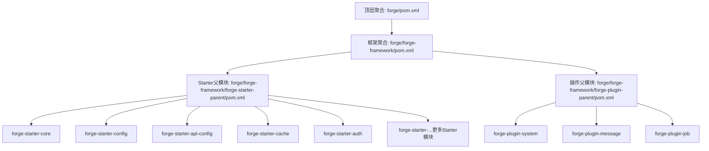
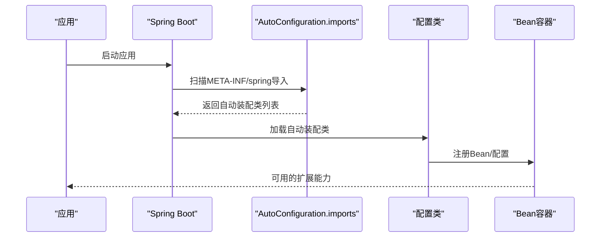
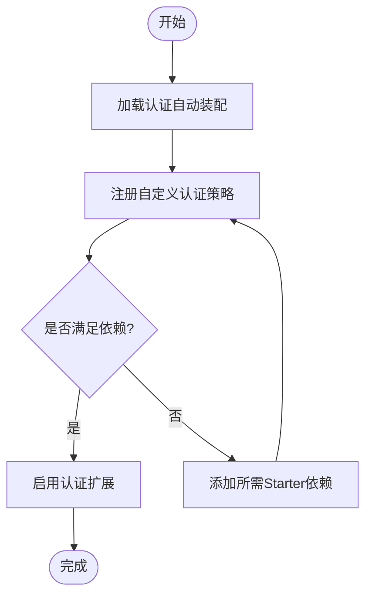
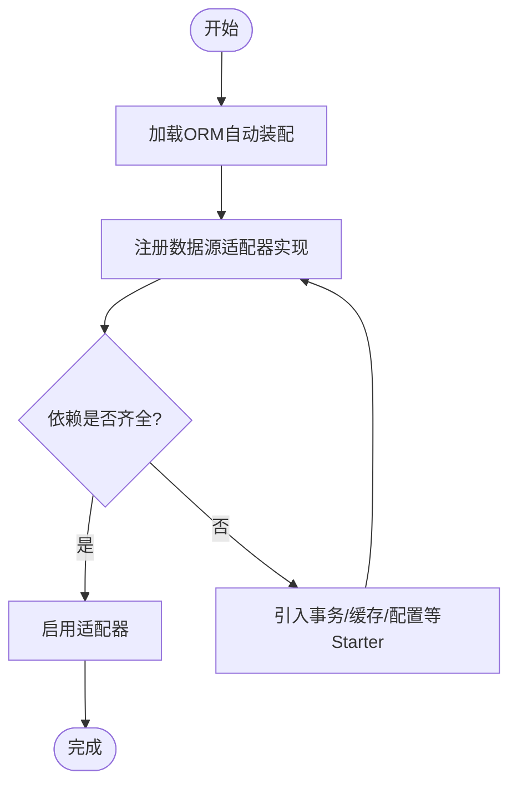
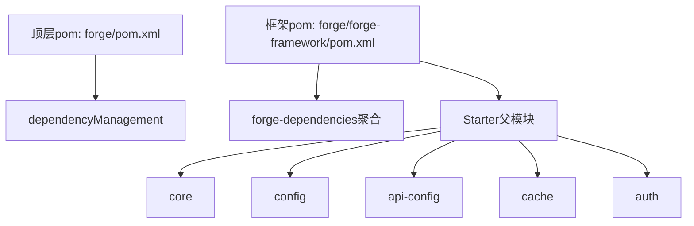

# 扩展开发

<cite>
**本文引用的文件**
- [forge/pom.xml](file://forge/pom.xml)
- [forge/forge-framework/pom.xml](file://forge/forge-framework/pom.xml)
- [forge/forge-framework/forge-starter-parent/pom.xml](file://forge/forge-framework/forge-starter-parent/pom.xml)
- [forge/forge-framework/forge-starter-parent/forge-starter-api-config/pom.xml](file://forge/forge-framework/forge-starter-parent/forge-starter-api-config/pom.xml)
- [forge/forge-framework/forge-starter-parent/forge-starter-auth/pom.xml](file://forge/forge-framework/forge-starter-parent/forge-starter-auth/pom.xml)
- [forge/forge-framework/forge-starter-parent/forge-starter-core/src/main/resources/META-INF/spring/org.springframework.boot.autoconfigure.AutoConfiguration.imports](file://forge/forge-framework/forge-starter-parent/forge-starter-core/src/main/resources/META-INF/spring/org.springframework.boot.autoconfigure.AutoConfiguration.imports)
- [forge/forge-framework/forge-starter-parent/forge-starter-config/src/main/resources/META-INF/spring/org.springframework.boot.autoconfigure.AutoConfiguration.imports](file://forge/forge-framework/forge-starter-parent/forge-starter-config/src/main/resources/META-INF/spring/org.springframework.boot.autoconfigure.AutoConfiguration.imports)
- [forge/forge-framework/forge-starter-parent/forge-starter-api-config/src/main/resources/META-INF/spring/org.springframework.boot.autoconfigure.AutoConfiguration.imports](file://forge/forge-framework/forge-starter-parent/forge-starter-api-config/src/main/resources/META-INF/spring/org.springframework.boot.autoconfigure.AutoConfiguration.imports)
- [forge/forge-framework/forge-starter-parent/forge-starter-cache/src/main/resources/META-INF/spring/org.springframework.boot.autoconfigure.AutoConfiguration.imports](file://forge/forge-framework/forge-starter-parent/forge-starter-cache/src/main/resources/META-INF/spring/org.springframework.boot.autoconfigure.AutoConfiguration.imports)
</cite>

## 目录
1. [简介](#简介)
2. [项目结构](#项目结构)
3. [核心组件](#核心组件)
4. [架构总览](#架构总览)
5. [详细组件分析](#详细组件分析)
6. [依赖关系分析](#依赖关系分析)
7. [性能考量](#性能考量)
8. [故障排查指南](#故障排查指南)
9. [结论](#结论)
10. [附录](#附录)

## 简介
本指南面向希望基于Forge框架扩展功能的开发者，围绕Starter模块体系，系统讲解如何进行自定义Starter开发、模块化设计原则、依赖管理策略，并结合现有模块（如认证、配置、API配置、缓存等）说明插件开发示例、配置自动装配机制、SPI扩展点使用方式。同时覆盖集成第三方组件、实现自定义认证策略、开发新的数据源适配器的实践路径，以及扩展模块的测试策略、发布流程与版本兼容性考虑，帮助开发者快速构建符合Forge架构规范的功能模块。

## 项目结构
Forge采用多模块聚合工程组织，顶层通过统一属性与依赖管理控制版本，框架层进一步拆分为“依赖聚合”“Starter父模块”“插件父模块”，Starter父模块下包含多个功能Starter子模块，形成可按需启用的模块化能力集合。

图表来源
- [forge/pom.xml](file://forge/pom.xml#L114-L118)
- [forge/forge-framework/pom.xml](file://forge/forge-framework/pom.xml#L26-L30)
- [forge/forge-framework/forge-starter-parent/pom.xml](file://forge/forge-framework/forge-starter-parent/pom.xml#L15-L34)

章节来源
- [forge/pom.xml](file://forge/pom.xml#L114-L118)
- [forge/forge-framework/pom.xml](file://forge/forge-framework/pom.xml#L26-L30)
- [forge/forge-framework/forge-starter-parent/pom.xml](file://forge/forge-framework/forge-starter-parent/pom.xml#L15-L34)

## 核心组件
- 版本与依赖管理
  - 顶层pom集中定义Java版本、Spring Boot版本、常用第三方组件版本，通过dependencyManagement统一约束，避免版本漂移。
  - 框架层pom引入forge-dependencies作为依赖聚合，确保Starter与插件模块共享一致的版本矩阵。
- Starter父模块
  - 聚合核心能力模块（核心、ORM、Web、缓存、认证、日志、事务、文件、Excel、配置、任务、ID、数据范围、消息、租户、加解密、WebSocket、API配置等），便于按需组合。
- 自动装配机制
  - 各Starter模块在META-INF/spring目录下提供AutoConfiguration.imports文件，声明自动装配入口类，Spring Boot在启动时扫描加载，实现零配置或最小配置即可启用功能。

章节来源
- [forge/pom.xml](file://forge/pom.xml#L12-L61)
- [forge/forge-framework/pom.xml](file://forge/forge-framework/pom.xml#L32-L42)
- [forge/forge-framework/forge-starter-parent/pom.xml](file://forge/forge-framework/forge-starter-parent/pom.xml#L15-L34)
- [forge/forge-framework/forge-starter-parent/forge-starter-core/src/main/resources/META-INF/spring/org.springframework.boot.autoconfigure.AutoConfiguration.imports](file://forge/forge-framework/forge-starter-parent/forge-starter-core/src/main/resources/META-INF/spring/org.springframework.boot.autoconfigure.AutoConfiguration.imports#L1-L3)
- [forge/forge-framework/forge-starter-parent/forge-starter-config/src/main/resources/META-INF/spring/org.springframework.boot.autoconfigure.AutoConfiguration.imports](file://forge/forge-framework/forge-starter-parent/forge-starter-config/src/main/resources/META-INF/spring/org.springframework.boot.autoconfigure.AutoConfiguration.imports#L1-L3)
- [forge/forge-framework/forge-starter-parent/forge-starter-api-config/src/main/resources/META-INF/spring/org.springframework.boot.autoconfigure.AutoConfiguration.imports](file://forge/forge-framework/forge-starter-parent/forge-starter-api-config/src/main/resources/META-INF/spring/org.springframework.boot.autoconfigure.AutoConfiguration.imports#L1-L2)
- [forge/forge-framework/forge-starter-parent/forge-starter-cache/src/main/resources/META-INF/spring/org.springframework.boot.autoconfigure.AutoConfiguration.imports](file://forge/forge-framework/forge-starter-parent/forge-starter-cache/src/main/resources/META-INF/spring/org.springframework.boot.autoconfigure.AutoConfiguration.imports#L1-L2)

## 架构总览
Forge的扩展架构以Starter为核心，遵循“功能即模块”的设计思想。每个Starter聚焦单一领域能力，通过自动装配机制与Spring Boot无缝集成；跨模块协作通过依赖声明与公共依赖聚合实现松耦合。

```mermaid
graph TB
subgraph "应用侧"
APP["业务应用"]
end
subgraph "Forge框架"
STCORE["Starter: core"]
STCONF["Starter: config"]
STAPICONF["Starter: api-config"]
STCACHE["Starter: cache"]
STAUTH["Starter: auth"]
STWEB["Starter: web"]
STORM["Starter: orm"]
STLOG["Starter: log"]
STTRANS["Starter: trans"]
STFILE["Starter: file"]
STEXCEL["Starter: excel"]
STJOB["Starter: job"]
STID["Starter: id"]
STDSCOPE["Starter: datascope"]
STMSG["Starter: message"]
STTENANT["Starter: tenant"]
STCRYPTO["Starter: crypto"]
STWS["Starter: websocket"]
end
APP --> STCORE
APP --> STCONF
APP --> STAPICONF
APP --> STCACHE
APP --> STAUTH
APP --> STWEB
APP --> STORM
APP --> STLOG
APP --> STTRANS
APP --> STFILE
APP --> STEXCEL
APP --> STJOB
APP --> STID
APP --> STDSCOPE
APP --> STMSG
APP --> STTENANT
APP --> STCRYPTO
APP --> STWS
```

图表来源
- [forge/forge-framework/forge-starter-parent/pom.xml](file://forge/forge-framework/forge-starter-parent/pom.xml#L15-L34)

## 详细组件分析

### 自动装配与SPI扩展点
- 自动装配入口
  - 各Starter在META-INF/spring目录提供AutoConfiguration.imports文件，声明自动装配类，Spring Boot启动时扫描加载，实现“按需启用、自动装配”。
- SPI扩展点
  - 基于Spring Boot的自动装配机制，可通过新增实现类并注册到容器中，实现对默认行为的替换或增强（例如自定义认证策略、数据源适配器等）。
- 配置刷新与API配置
  - 配置Starter提供属性刷新与配置自动装配；API配置Starter提供接口鉴权、加密、租户等统一配置能力，二者均通过自动装配机制接入。

图表来源
- [forge/forge-framework/forge-starter-parent/forge-starter-config/src/main/resources/META-INF/spring/org.springframework.boot.autoconfigure.AutoConfiguration.imports](file://forge/forge-framework/forge-starter-parent/forge-starter-config/src/main/resources/META-INF/spring/org.springframework.boot.autoconfigure.AutoConfiguration.imports#L1-L3)
- [forge/forge-framework/forge-starter-parent/forge-starter-api-config/src/main/resources/META-INF/spring/org.springframework.boot.autoconfigure.AutoConfiguration.imports](file://forge/forge-framework/forge-starter-parent/forge-starter-api-config/src/main/resources/META-INF/spring/org.springframework.boot.autoconfigure.AutoConfiguration.imports#L1-L2)
- [forge/forge-framework/forge-starter-parent/forge-starter-cache/src/main/resources/META-INF/spring/org.springframework.boot.autoconfigure.AutoConfiguration.imports](file://forge/forge-framework/forge-starter-parent/forge-starter-cache/src/main/resources/META-INF/spring/org.springframework.boot.autoconfigure.AutoConfiguration.imports#L1-L2)

章节来源
- [forge/forge-framework/forge-starter-parent/forge-starter-config/src/main/resources/META-INF/spring/org.springframework.boot.autoconfigure.AutoConfiguration.imports](file://forge/forge-framework/forge-starter-parent/forge-starter-config/src/main/resources/META-INF/spring/org.springframework.boot.autoconfigure.AutoConfiguration.imports#L1-L3)
- [forge/forge-framework/forge-starter-parent/forge-starter-api-config/src/main/resources/META-INF/spring/org.springframework.boot.autoconfigure.AutoConfiguration.imports](file://forge/forge-framework/forge-starter-parent/forge-starter-api-config/src/main/resources/META-INF/spring/org.springframework.boot.autoconfigure.AutoConfiguration.imports#L1-L2)
- [forge/forge-framework/forge-starter-parent/forge-starter-cache/src/main/resources/META-INF/spring/org.springframework.boot.autoconfigure.AutoConfiguration.imports](file://forge/forge-framework/forge-starter-parent/forge-starter-cache/src/main/resources/META-INF/spring/org.springframework.boot.autoconfigure.AutoConfiguration.imports#L1-L2)

### 认证扩展：自定义认证策略
- 设计思路
  - 基于认证Starter的自动装配机制，新增自定义认证策略实现类，注册到容器中，替换或补充默认认证逻辑。
  - 若需支持多租户、验证码、WebSocket等场景，可复用认证Starter所依赖的租户、配置、WebSocket等模块。
- 依赖参考
  - 认证Starter依赖核心、缓存、租户、配置、WebSocket、API配置等模块，可据此评估扩展所需的依赖组合。

图表来源
- [forge/forge-framework/forge-starter-parent/forge-starter-auth/pom.xml](file://forge/forge-framework/forge-starter-parent/forge-starter-auth/pom.xml#L14-L79)

章节来源
- [forge/forge-framework/forge-starter-parent/forge-starter-auth/pom.xml](file://forge/forge-framework/forge-starter-parent/forge-starter-auth/pom.xml#L14-L79)

### 数据源适配器：开发新数据源适配器
- 设计思路
  - 基于ORM Starter提供的基础能力，结合事务、缓存、配置等模块，开发新的数据源适配器。
  - 通过自动装配机制注入适配器实现，确保与Spring Boot生态无缝集成。
- 依赖参考
  - ORM Starter通常与事务、缓存、配置等模块协同工作，可按需引入。

图表来源
- [forge/forge-framework/forge-starter-parent/forge-starter-api-config/pom.xml](file://forge/forge-framework/forge-starter-parent/forge-starter-api-config/pom.xml#L15-L79)

章节来源
- [forge/forge-framework/forge-starter-parent/forge-starter-api-config/pom.xml](file://forge/forge-framework/forge-starter-parent/forge-starter-api-config/pom.xml#L15-L79)

### 第三方组件集成
- 集成策略
  - 在目标Starter的pom中声明第三方依赖，遵循框架层的依赖聚合与版本管理，避免版本冲突。
  - 通过自动装配机制暴露必要的Bean与配置，确保外部组件与Forge模块协同工作。
- 示例参考
  - API配置Starter集成了Web、AOP、Redis、Jackson、Hutool等组件，可作为集成第三方组件的模板。

图表来源
- [forge/forge-framework/forge-starter-parent/forge-starter-api-config/pom.xml](file://forge/forge-framework/forge-starter-parent/forge-starter-api-config/pom.xml#L15-L79)

章节来源
- [forge/forge-framework/forge-starter-parent/forge-starter-api-config/pom.xml](file://forge/forge-framework/forge-starter-parent/forge-starter-api-config/pom.xml#L15-L79)

### 插件开发示例
- 插件父模块
  - 提供插件开发的统一父pom，内含生成器、系统、消息、作业等插件模块，可作为扩展开发的参考模板。
- 开发步骤
  - 基于插件父模块创建新模块，声明必要依赖，编写自动装配类与配置类，通过AutoConfiguration.imports注册。
  - 使用Spring Boot的测试与打包插件，保证可测试性与可发布性。

章节来源
- [forge/forge-framework/pom.xml](file://forge/forge-framework/pom.xml#L26-L30)

## 依赖关系分析
- 顶层依赖管理
  - 顶层pom集中定义Java版本、Spring Boot版本及常用组件版本，通过dependencyManagement统一约束。
- 框架层依赖聚合
  - 框架层pom引入forge-dependencies，确保Starter与插件模块共享一致的版本矩阵。
- Starter模块依赖
  - 各Starter通过pom声明对其他Starter或外部依赖的引用，形成清晰的功能边界与依赖关系。

图表来源
- [forge/pom.xml](file://forge/pom.xml#L94-L112)
- [forge/forge-framework/pom.xml](file://forge/forge-framework/pom.xml#L32-L42)
- [forge/forge-framework/forge-starter-parent/pom.xml](file://forge/forge-framework/forge-starter-parent/pom.xml#L15-L34)

章节来源
- [forge/pom.xml](file://forge/pom.xml#L94-L112)
- [forge/forge-framework/pom.xml](file://forge/forge-framework/pom.xml#L32-L42)
- [forge/forge-framework/forge-starter-parent/pom.xml](file://forge/forge-framework/forge-starter-parent/pom.xml#L15-L34)

## 性能考量
- 自动装配与延迟初始化
  - 通过自动装配按需加载，避免不必要的Bean初始化，降低启动时间与内存占用。
- 缓存策略
  - 利用缓存Starter提供的本地与分布式缓存能力，减少重复计算与IO开销。
- 事务与ORM
  - 结合事务与ORM Starter，优化数据库访问路径，合理设置连接池与SQL执行策略。

## 故障排查指南
- 自动装配未生效
  - 检查Starter的AutoConfiguration.imports文件是否存在且路径正确，确认包名与类名无误。
- 依赖冲突
  - 使用依赖树检查工具定位冲突版本，优先通过框架层的依赖聚合解决。
- Bean冲突或重复注册
  - 审核自定义实现类的命名与包结构，避免与默认实现重名；必要时使用条件注解控制注册时机。

## 结论
Forge的Starter体系通过“功能即模块”的设计与自动装配机制，实现了高内聚、低耦合的扩展能力。开发者可基于现有Starter快速扩展认证策略、数据源适配器与第三方组件，遵循依赖管理与版本兼容策略，确保扩展模块的稳定性与可维护性。

## 附录
- 测试策略
  - 使用Spring Boot Test与Surefire插件，按环境标签执行测试，覆盖单元测试与集成测试。
- 发布流程
  - 通过统一版本管理与flatten插件，确保发布产物一致性；遵循仓库镜像配置，保障依赖拉取稳定。
- 版本兼容性
  - 严格遵循顶层pom的版本约束，避免与Spring Boot或第三方组件版本不匹配导致的问题。