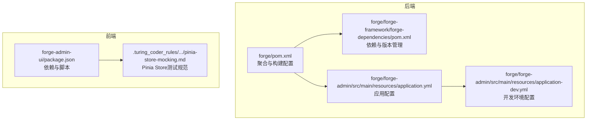
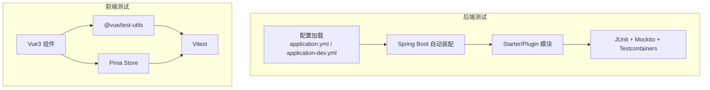
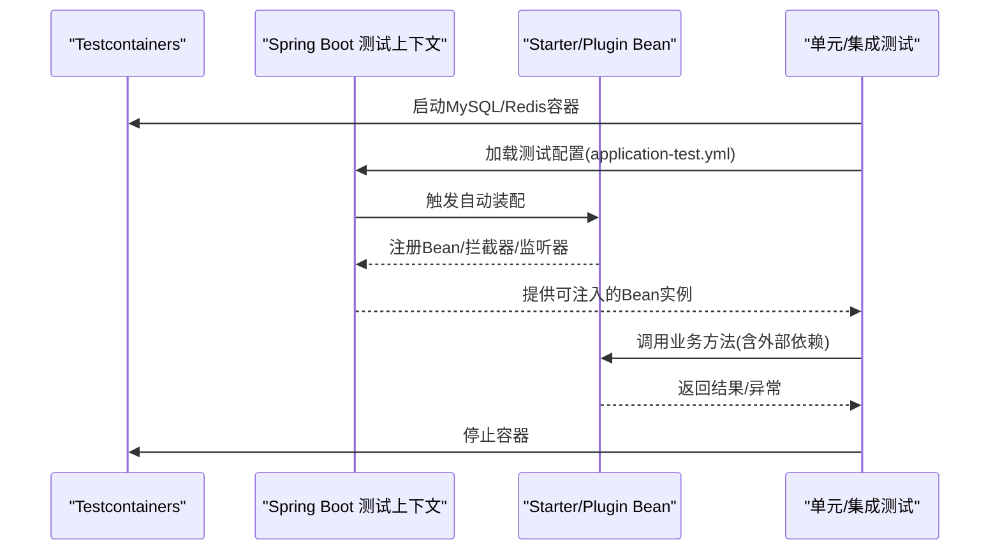
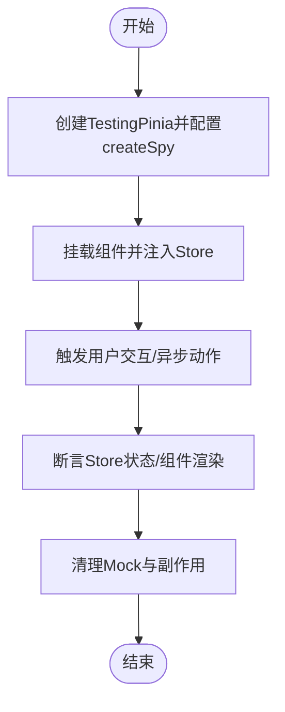
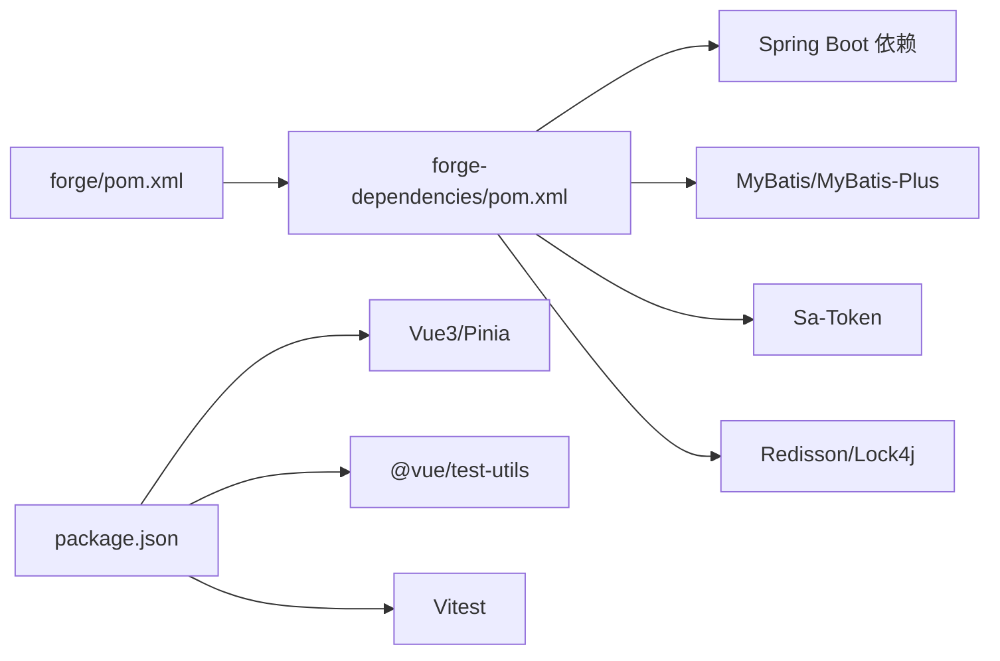

# 扩展模块测试策略

<cite>
**本文引用的文件**
- [forge/pom.xml](file://forge/pom.xml)
- [forge/forge-framework/forge-dependencies/pom.xml](file://forge/forge-framework/forge-dependencies/pom.xml)
- [forge/forge-admin/src/main/resources/application.yml](file://forge/forge-admin/src/main/resources/application.yml)
- [forge/forge-admin/src/main/resources/application-dev.yml](file://forge/forge-admin/src/main/resources/application-dev.yml)
- [forge-admin-ui/package.json](file://forge-admin-ui/package.json)
- [forge-admin-ui/.turing_coder_rules/vue-best-practices/rules/pinia-store-mocking.md](file://forge-admin-ui/.turing_coder_rules/vue-best-practices/rules/pinia-store-mocking.md)
</cite>

## 目录
1. [简介](#简介)
2. [项目结构](#项目结构)
3. [核心组件](#核心组件)
4. [架构总览](#架构总览)
5. [详细组件分析](#详细组件分析)
6. [依赖分析](#依赖分析)
7. [性能考量](#性能考量)
8. [故障排查指南](#故障排查指南)
9. [结论](#结论)
10. [附录](#附录)

## 简介
本指南面向Forge框架扩展模块（自定义Starter、插件、第三方集成）的测试策略设计与落地，覆盖单元测试、集成测试、端到端测试的实施方法与最佳实践。结合仓库现有Maven与前端工程配置，给出测试框架选择建议（JUnit、Mockito、Testcontainers等）、外部依赖模拟、配置加载与自动装配验证、测试数据与环境搭建、持续集成配置思路，并补充性能测试、安全测试、兼容性测试的实施方案要点，以及测试覆盖率、报告生成与缺陷跟踪的质量保障流程建议。

## 项目结构
Forge采用多模块聚合工程组织，核心由“管理端应用”与“框架与依赖管理”两大部分构成；前端采用Vite+Vue3生态。测试策略需分别覆盖后端Starter/Plugin模块与前端UI组件/Store。

**图示来源**
- [forge/pom.xml](file://forge/pom.xml#L114-L119)
- [forge/forge-framework/forge-dependencies/pom.xml](file://forge/forge-framework/forge-dependencies/pom.xml#L72-L112)
- [forge/forge-admin/src/main/resources/application.yml](file://forge/forge-admin/src/main/resources/application.yml#L1-L100)
- [forge/forge-admin/src/main/resources/application-dev.yml](file://forge/forge-admin/src/main/resources/application-dev.yml#L1-L70)
- [forge-admin-ui/package.json](file://forge-admin-ui/package.json#L1-L69)
- [forge-admin-ui/.turing_coder_rules/vue-best-practices/rules/pinia-store-mocking.md](file://forge-admin-ui/.turing_coder_rules/vue-best-practices/rules/pinia-store-mocking.md#L1-L160)

**章节来源**
- [forge/pom.xml](file://forge/pom.xml#L114-L119)
- [forge/forge-framework/forge-dependencies/pom.xml](file://forge/forge-framework/forge-dependencies/pom.xml#L72-L112)
- [forge/forge-admin/src/main/resources/application.yml](file://forge/forge-admin/src/main/resources/application.yml#L1-L100)
- [forge/forge-admin/src/main/resources/application-dev.yml](file://forge/forge-admin/src/main/resources/application-dev.yml#L1-L70)
- [forge-admin-ui/package.json](file://forge-admin-ui/package.json#L1-L69)
- [forge-admin-ui/.turing_coder_rules/vue-best-practices/rules/pinia-store-mocking.md](file://forge-admin-ui/.turing_coder_rules/vue-best-practices/rules/pinia-store-mocking.md#L1-L160)

## 核心组件
- 测试执行与环境隔离
  - Maven Surefire插件按profile标签分组执行测试，支持本地/开发/生产三档环境的测试分层与排除。
  - Spring Profile与配置文件联动，确保Starter/Plugin在不同环境下的配置加载与行为一致性。
- 前端测试基础设施
  - Vite+Vue3+Pinia生态，结合Vitest与@vue/test-utils进行组件与Store测试，遵循Pinia Testing规范以避免常见注入与spy问题。

**章节来源**
- [forge/pom.xml](file://forge/pom.xml#L163-L175)
- [forge/forge-admin/src/main/resources/application.yml](file://forge/forge-admin/src/main/resources/application.yml#L39-L40)
- [forge/forge-admin/src/main/resources/application-dev.yml](file://forge/forge-admin/src/main/resources/application-dev.yml#L1-L70)
- [forge-admin-ui/package.json](file://forge-admin-ui/package.json#L1-L69)
- [forge-admin-ui/.turing_coder_rules/vue-best-practices/rules/pinia-store-mocking.md](file://forge-admin-ui/.turing_coder_rules/vue-best-practices/rules/pinia-store-mocking.md#L26-L55)

## 架构总览
下图展示测试策略在系统中的位置与交互关系：后端Starter/Plugin通过Spring Boot自动装配加载配置；前端通过Pinia管理状态并通过组件测试验证交互逻辑。

**图示来源**
- [forge/forge-admin/src/main/resources/application.yml](file://forge/forge-admin/src/main/resources/application.yml#L1-L100)
- [forge/forge-admin/src/main/resources/application-dev.yml](file://forge/forge-admin/src/main/resources/application-dev.yml#L1-L70)
- [forge-admin-ui/package.json](file://forge-admin-ui/package.json#L1-L69)
- [forge-admin-ui/.turing_coder_rules/vue-best-practices/rules/pinia-store-mocking.md](file://forge-admin-ui/.turing_coder_rules/vue-best-practices/rules/pinia-store-mocking.md#L82-L99)

## 详细组件分析

### 后端Starter/Plugin测试策略
- 单元测试
  - 使用JUnit与Mockito对Starter/Plugin中的服务类、工具类进行隔离测试；对Spring管理的Bean通过@MockBean或Test Configuration进行替换。
  - 利用@Import注解引入最小化测试配置，避免加载完整上下文。
- 集成测试
  - 使用Testcontainers启动真实外部依赖（如MySQL、Redis），在容器内执行集成测试，确保Starter/Plugin与第三方组件的协同工作。
  - 通过@ActiveProfiles激活对应环境配置，验证配置加载与自动装配效果。
- 端到端测试
  - 基于REST Assured或WebTestClient对Starter提供的接口进行端到端验证，覆盖典型业务场景。
- 配置加载与自动装配验证
  - 使用@AutoConfigureTestDatabase禁用嵌入式数据库，强制使用Testcontainers中的真实实例。
  - 通过@ImportRuntimeHints或自定义条件注解验证Starter是否正确注册了自动装配条件。

**图示来源**
- [forge/forge-admin/src/main/resources/application.yml](file://forge/forge-admin/src/main/resources/application.yml#L39-L40)
- [forge/forge-admin/src/main/resources/application-dev.yml](file://forge/forge-admin/src/main/resources/application-dev.yml#L1-L70)
- [forge/pom.xml](file://forge/pom.xml#L163-L175)

**章节来源**
- [forge/pom.xml](file://forge/pom.xml#L63-L91)
- [forge/forge-framework/forge-dependencies/pom.xml](file://forge/forge-framework/forge-dependencies/pom.xml#L72-L112)
- [forge/forge-admin/src/main/resources/application.yml](file://forge/forge-admin/src/main/resources/application.yml#L39-L40)
- [forge/forge-admin/src/main/resources/application-dev.yml](file://forge/forge-admin/src/main/resources/application-dev.yml#L1-L70)

### 前端组件与Store测试策略
- 组件测试
  - 使用@vue/test-utils与Vitest对Vue3组件进行快照与交互测试；通过createTestingPinia注入Store，确保依赖注入正常。
- Store测试
  - 使用createTestingPinia并配置createSpy，避免“injection Symbol(pinia) not found”错误；通过initialState初始化状态，确保测试可重复性。
- 状态重置与副作用清理
  - 在每个测试用例前后清理Mock与副作用，避免跨用例污染。

**图示来源**
- [forge-admin-ui/.turing_coder_rules/vue-best-practices/rules/pinia-store-mocking.md](file://forge-admin-ui/.turing_coder_rules/vue-best-practices/rules/pinia-store-mocking.md#L26-L55)
- [forge-admin-ui/.turing_coder_rules/vue-best-practices/rules/pinia-store-mocking.md](file://forge-admin-ui/.turing_coder_rules/vue-best-practices/rules/pinia-store-mocking.md#L117-L133)

**章节来源**
- [forge-admin-ui/package.json](file://forge-admin-ui/package.json#L1-L69)
- [forge-admin-ui/.turing_coder_rules/vue-best-practices/rules/pinia-store-mocking.md](file://forge-admin-ui/.turing_coder_rules/vue-best-practices/rules/pinia-store-mocking.md#L1-L160)

### 第三方集成测试策略
- 数据库集成
  - 使用Testcontainers启动MySQL容器，配合Flyway/Hibernate对Schema进行初始化，验证Starter/Plugin的ORM与事务行为。
- 缓存与消息
  - 使用Testcontainers启动Redis/RabbitMQ/Kafka等，验证缓存写入、消息发送与消费链路。
- 安全与认证
  - 集成Sa-Token/JWT等认证组件，通过REST Assured验证登录、鉴权与权限控制流程。

**章节来源**
- [forge/forge-framework/forge-dependencies/pom.xml](file://forge/forge-framework/forge-dependencies/pom.xml#L128-L156)
- [forge/forge-framework/forge-dependencies/pom.xml](file://forge/forge-framework/forge-dependencies/pom.xml#L202-L213)

## 依赖分析
- 后端依赖与版本管理
  - 通过forge-dependencies统一管理Spring Boot、MyBatis、Sa-Token、Redisson、Lock4j等组件版本，确保Starter/Plugin在一致的依赖树下运行。
- 前端依赖与测试工具
  - Vue3、Pinia、@vue/test-utils、Vitest构成前端测试栈；通过package.json统一管理。

**图示来源**
- [forge/pom.xml](file://forge/pom.xml#L94-L112)
- [forge/forge-framework/forge-dependencies/pom.xml](file://forge/forge-framework/forge-dependencies/pom.xml#L72-L112)
- [forge-admin-ui/package.json](file://forge-admin-ui/package.json#L1-L69)

**章节来源**
- [forge/pom.xml](file://forge/pom.xml#L94-L112)
- [forge/forge-framework/forge-dependencies/pom.xml](file://forge/forge-framework/forge-dependencies/pom.xml#L72-L112)
- [forge-admin-ui/package.json](file://forge-admin-ui/package.json#L1-L69)

## 性能考量
- 单元测试
  - 尽量使用Mock隔离外部依赖，减少IO开销；对热点方法进行基准测试（Benchmark）以评估优化收益。
- 集成测试
  - 使用Testcontainers共享容器或复用测试环境，缩短启动时间；对数据库Schema预热，避免首次迁移带来的抖动。
- 前端测试
  - 通过createTestingPinia避免真实网络请求；对复杂计算逻辑进行纯函数化拆分以便快速测试。
- 报告与度量
  - 后端可接入Jacoco生成覆盖率报告；前端可使用Vitest内置覆盖率与可视化工具链。

[本节为通用指导，无需列出具体文件来源]

## 故障排查指南
- Spring Profile与Surefire分组
  - 若测试未按预期执行，检查profiles.active与Surefire groups/excludedGroups配置，确认@Tag与profile一致。
- 配置加载问题
  - 确认application.yml中profiles.active占位符已被正确替换；开发环境配置文件application-dev.yml中数据源与Redis配置是否可用。
- 前端Store注入错误
  - 遵循Pinia Testing规范，确保createTestingPinia的createSpy选项已配置；避免在挂载前获取Store实例。

**章节来源**
- [forge/pom.xml](file://forge/pom.xml#L63-L91)
- [forge/pom.xml](file://forge/pom.xml#L163-L175)
- [forge/forge-admin/src/main/resources/application.yml](file://forge/forge-admin/src/main/resources/application.yml#L39-L40)
- [forge/forge-admin/src/main/resources/application-dev.yml](file://forge/forge-admin/src/main/resources/application-dev.yml#L1-L70)
- [forge-admin-ui/.turing_coder_rules/vue-best-practices/rules/pinia-store-mocking.md](file://forge-admin-ui/.turing_coder_rules/vue-best-practices/rules/pinia-store-mocking.md#L17-L23)

## 结论
通过将Maven Surefire与Spring Profile结合，配合Testcontainers与JUnit/Mockito实现Starter/Plugin的单元与集成测试；前端采用Vitest+@vue/test-utils+Pinia Testing规范保障组件与Store质量。在此基础上，补充性能、安全与兼容性测试方案，并建立覆盖率与报告机制，形成完整的扩展模块测试闭环。

[本节为总结性内容，无需列出具体文件来源]

## 附录
- 测试数据准备
  - 使用SQL脚本初始化测试数据；对于缓存/消息场景，使用Testcontainers中的真实实例进行预热。
- 测试环境搭建
  - 后端：本地Docker环境+Testcontainers；前端：Vite开发服务器+Vitest。
- 持续集成
  - 在CI中按profile执行测试分组，结合容器化数据库/缓存服务，确保每次提交均覆盖关键路径。
- 覆盖率与报告
  - 后端：Jacoco生成覆盖率报告；前端：Vitest内置覆盖率与可视化。
- 缺陷跟踪
  - 建议使用Issue模板记录测试失败场景、环境信息与复现步骤，便于回归与追踪。

[本节为通用指导，无需列出具体文件来源]