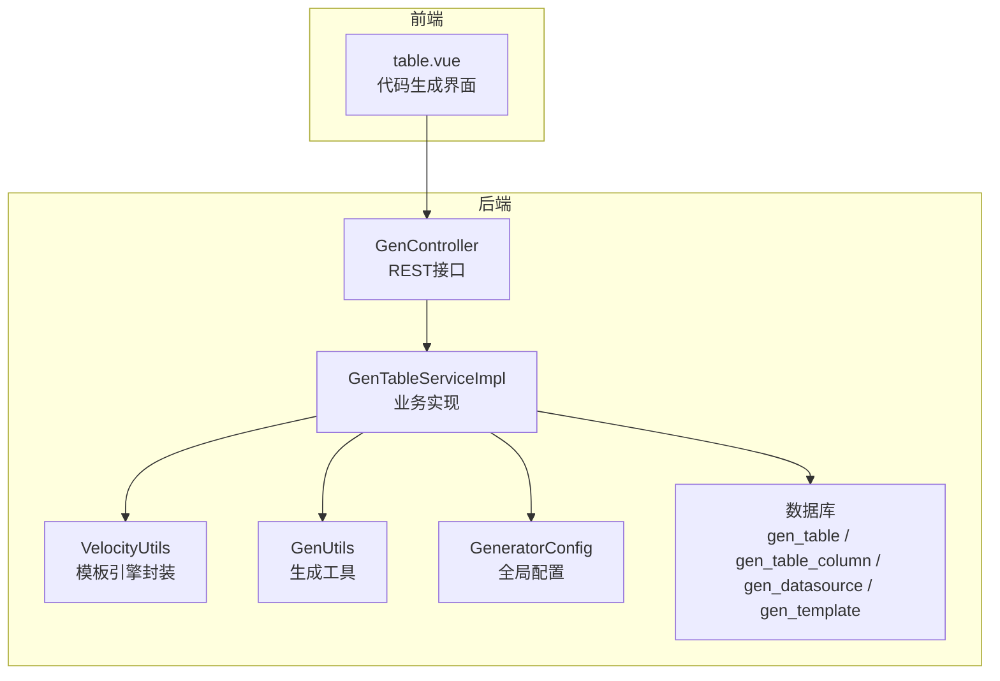
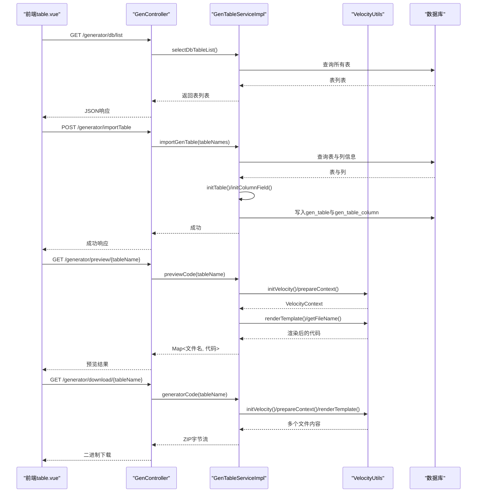
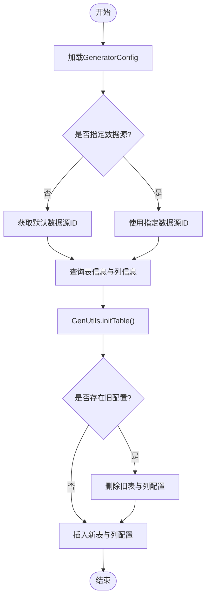
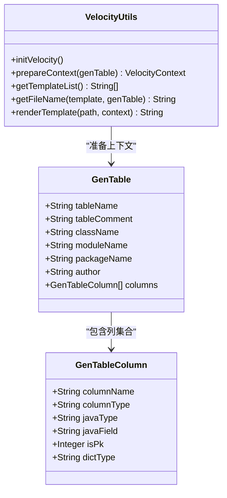
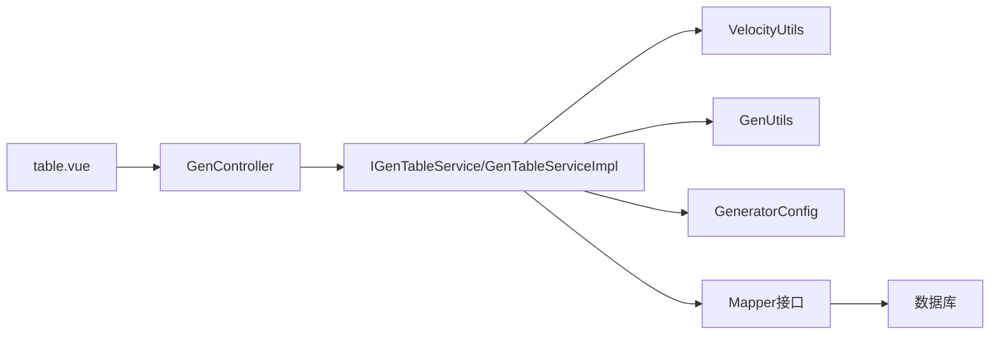

# 代码生成插件开发

<cite>
**本文档引用的文件**
- [GenController.java](file://forge/forge-framework/forge-plugin-parent/forge-plugin-generator/src/main/java/com/mdframe/forge/plugin/generator/controller/GenController.java)
- [IGenTableService.java](file://forge/forge-framework/forge-plugin-parent/forge-plugin-generator/src/main/java/com/mdframe/forge/plugin/generator/service/IGenTableService.java)
- [GenTableServiceImpl.java](file://forge/forge-framework/forge-plugin-parent/forge-plugin-generator/src/main/java/com/mdframe/forge/plugin/generator/service/impl/GenTableServiceImpl.java)
- [VelocityUtils.java](file://forge/forge-framework/forge-plugin-parent/forge-plugin-generator/src/main/java/com/mdframe/forge/plugin/generator/util/VelocityUtils.java)
- [GenUtils.java](file://forge/forge-framework/forge-plugin-parent/forge-plugin-generator/src/main/java/com/mdframe/forge/plugin/generator/util/GenUtils.java)
- [GeneratorConfig.java](file://forge/forge-framework/forge-plugin-parent/forge-plugin-generator/src/main/java/com/mdframe/forge/plugin/generator/config/GeneratorConfig.java)
- [entity.java.vm](file://forge/forge-framework/forge-plugin-parent/forge-plugin-generator/src/main/resources/templates/vm/entity.java.vm)
- [generator_tables.sql](file://forge/forge-framework/forge-plugin-parent/forge-plugin-generator/src/main/resources/sql/generator_tables.sql)
- [application.yml](file://forge/forge-framework/forge-plugin-parent/forge-plugin-generator/src/main/resources/application.yml)
- [table.vue](file://forge-admin-ui/src/views/generator/table.vue)
</cite>

## 目录
1. [简介](#简介)
2. [项目结构](#项目结构)
3. [核心组件](#核心组件)
4. [架构总览](#架构总览)
5. [详细组件分析](#详细组件分析)
6. [依赖关系分析](#依赖关系分析)
7. [性能考虑](#性能考虑)
8. [故障排除指南](#故障排除指南)
9. [结论](#结论)
10. [附录](#附录)

## 简介
本指南面向在Forge框架上开发“代码生成插件”的工程师与架构师，系统讲解代码生成器的核心架构与实现要点，涵盖：
- 控制器层：GenController对外暴露REST接口，支撑表结构导入、配置管理、代码生成与预览下载。
- 服务层：GenTableServiceImpl负责数据库表结构识别、字段映射、模板上下文准备、批量生成与打包。
- 模板引擎：VelocityUtils封装Velocity模板引擎初始化、上下文构建、模板渲染与文件名生成。
- 配置管理：GeneratorConfig集中管理默认作者、包名、模块名、模板引擎、表前缀等全局参数。
- 前端集成：table.vue通过统一的CRUD页面组件与后端交互，完成导入、配置、预览与下载。

目标是帮助读者快速掌握从“表结构导入”到“模板渲染生成”的完整流程，并具备定制模板、批量生成、国际化与错误处理的能力。

## 项目结构
代码生成插件位于Forge框架的插件体系中，采用“插件父工程 + 具体插件模块”的组织方式。核心目录与职责如下：
- controller：对外HTTP接口，如表列表查询、导入、编辑、删除、预览、下载、批量下载。
- service：业务逻辑实现，包括导入表结构、生成代码、预览、批量生成、更新与删除。
- util：工具类，包括Velocity模板引擎封装、通用生成工具、动态数据源工具。
- domain/entity：持久化实体，对应数据库表结构（gen_table、gen_table_column、gen_datasource、gen_template）。
- mapper：MyBatis映射接口，配合service进行数据访问。
- resources：模板资源、SQL脚本、应用配置。

图表来源
- [GenController.java](file://forge/forge-framework/forge-plugin-parent/forge-plugin-generator/src/main/java/com/mdframe/forge/plugin/generator/controller/GenController.java#L25-L141)
- [GenTableServiceImpl.java](file://forge/forge-framework/forge-plugin-parent/forge-plugin-generator/src/main/java/com/mdframe/forge/plugin/generator/service/impl/GenTableServiceImpl.java#L35-L272)
- [VelocityUtils.java](file://forge/forge-framework/forge-plugin-parent/forge-plugin-generator/src/main/java/com/mdframe/forge/plugin/generator/util/VelocityUtils.java#L16-L154)
- [GenUtils.java](file://forge/forge-framework/forge-plugin-parent/forge-plugin-generator/src/main/java/com/mdframe/forge/plugin/generator/util/GenUtils.java#L15-L237)
- [GeneratorConfig.java](file://forge/forge-framework/forge-plugin-parent/forge-plugin-generator/src/main/java/com/mdframe/forge/plugin/generator/config/GeneratorConfig.java#L13-L49)
- [generator_tables.sql](file://forge/forge-framework/forge-plugin-parent/forge-plugin-generator/src/main/resources/sql/generator_tables.sql#L3-L102)

章节来源
- [GenController.java](file://forge/forge-framework/forge-plugin-parent/forge-plugin-generator/src/main/java/com/mdframe/forge/plugin/generator/controller/GenController.java#L25-L141)
- [GenTableServiceImpl.java](file://forge/forge-framework/forge-plugin-parent/forge-plugin-generator/src/main/java/com/mdframe/forge/plugin/generator/service/impl/GenTableServiceImpl.java#L35-L272)
- [VelocityUtils.java](file://forge/forge-framework/forge-plugin-parent/forge-plugin-generator/src/main/java/com/mdframe/forge/plugin/generator/util/VelocityUtils.java#L16-L154)
- [GenUtils.java](file://forge/forge-framework/forge-plugin-parent/forge-plugin-generator/src/main/java/com/mdframe/forge/plugin/generator/util/GenUtils.java#L15-L237)
- [GeneratorConfig.java](file://forge/forge-framework/forge-plugin-parent/forge-plugin-generator/src/main/java/com/mdframe/forge/plugin/generator/config/GeneratorConfig.java#L13-L49)
- [generator_tables.sql](file://forge/forge-framework/forge-plugin-parent/forge-plugin-generator/src/main/resources/sql/generator_tables.sql#L3-L102)

## 核心组件
- GenController：提供数据库表列表查询、导入表结构、编辑配置、删除配置、预览代码、下载代码包、批量下载等接口。
- IGenTableService/GenTableServiceImpl：定义并实现导入、生成、预览、批量生成、更新与删除等核心业务。
- VelocityUtils：封装Velocity模板引擎初始化、上下文准备、模板渲染、文件名生成与模板列表管理。
- GenUtils：数据库类型到Java类型的映射、表名/列名转换、字段初始化、HTML类型推断、字典类型解析、基类字段过滤等。
- GeneratorConfig：集中式配置，支持作者、包名、模块名、模板引擎、表前缀、基础路径等。
- 前端table.vue：提供导入弹窗、字段配置、代码预览、下载等功能入口。

章节来源
- [GenController.java](file://forge/forge-framework/forge-plugin-parent/forge-plugin-generator/src/main/java/com/mdframe/forge/plugin/generator/controller/GenController.java#L25-L141)
- [IGenTableService.java](file://forge/forge-framework/forge-plugin-parent/forge-plugin-generator/src/main/java/com/mdframe/forge/plugin/generator/service/IGenTableService.java#L12-L48)
- [GenTableServiceImpl.java](file://forge/forge-framework/forge-plugin-parent/forge-plugin-generator/src/main/java/com/mdframe/forge/plugin/generator/service/impl/GenTableServiceImpl.java#L35-L272)
- [VelocityUtils.java](file://forge/forge-framework/forge-plugin-parent/forge-plugin-generator/src/main/java/com/mdframe/forge/plugin/generator/util/VelocityUtils.java#L16-L154)
- [GenUtils.java](file://forge/forge-framework/forge-plugin-parent/forge-plugin-generator/src/main/java/com/mdframe/forge/plugin/generator/util/GenUtils.java#L15-L237)
- [GeneratorConfig.java](file://forge/forge-framework/forge-plugin-parent/forge-plugin-generator/src/main/java/com/mdframe/forge/plugin/generator/config/GeneratorConfig.java#L13-L49)
- [table.vue](file://forge-admin-ui/src/views/generator/table.vue#L92-L395)

## 架构总览
下图展示从前端到后端、再到模板引擎与数据库的整体调用链路：

图表来源
- [GenController.java](file://forge/forge-framework/forge-plugin-parent/forge-plugin-generator/src/main/java/com/mdframe/forge/plugin/generator/controller/GenController.java#L35-L140)
- [GenTableServiceImpl.java](file://forge/forge-framework/forge-plugin-parent/forge-plugin-generator/src/main/java/com/mdframe/forge/plugin/generator/service/impl/GenTableServiceImpl.java#L42-L155)
- [VelocityUtils.java](file://forge/forge-framework/forge-plugin-parent/forge-plugin-generator/src/main/java/com/mdframe/forge/plugin/generator/util/VelocityUtils.java#L21-L153)

## 详细组件分析

### 控制器层：GenController
- 功能点
  - 查询数据库表列表：支持直接查询当前默认数据源下的所有表。
  - 分页查询已导入表：支持按表名/注释模糊搜索，按创建时间倒序。
  - 获取表配置详情：按表ID查询。
  - 导入表结构：支持默认数据源与指定数据源两种导入方式。
  - 编辑/删除表配置：支持更新与批量删除。
  - 预览代码：返回每个模板渲染后的文本内容。
  - 生成代码：返回ZIP压缩包供下载；支持批量生成。
- 关键设计
  - 统一返回包装RespInfo，便于前端统一处理。
  - 使用@OperationLog记录操作日志，便于审计。
  - 下载接口设置正确的Content-Disposition与Content-Type，确保浏览器正确触发下载。

章节来源
- [GenController.java](file://forge/forge-framework/forge-plugin-parent/forge-plugin-generator/src/main/java/com/mdframe/forge/plugin/generator/controller/GenController.java#L25-L141)

### 服务层：GenTableServiceImpl
- 功能点
  - 导入表结构：支持默认数据源与指定数据源；若表已存在则先删除旧配置再插入新配置。
  - 生成代码：逐模板渲染，写入ZipOutputStream，最终返回字节数组。
  - 批量生成：对多个表依次渲染并合并到同一ZIP包。
  - 预览代码：不写入Zip，直接返回Map<文件名, 代码>。
  - 更新/删除：更新表与列配置，删除时级联删除列配置。
- 关键设计
  - 使用VelocityUtils准备上下文与渲染模板。
  - 通过GenUtils完成表名/列名转换、Java类型映射、字典类型解析、HTML类型推断等。
  - 事务性保证导入过程的原子性。
  - 异常统一捕获并抛出运行时异常，便于上层处理。

图表来源
- [GenTableServiceImpl.java](file://forge/forge-framework/forge-plugin-parent/forge-plugin-generator/src/main/java/com/mdframe/forge/plugin/generator/service/impl/GenTableServiceImpl.java#L48-L111)
- [GenUtils.java](file://forge/forge-framework/forge-plugin-parent/forge-plugin-generator/src/main/java/com/mdframe/forge/plugin/generator/util/GenUtils.java#L86-L96)

章节来源
- [GenTableServiceImpl.java](file://forge/forge-framework/forge-plugin-parent/forge-plugin-generator/src/main/java/com/mdframe/forge/plugin/generator/service/impl/GenTableServiceImpl.java#L35-L272)
- [GenUtils.java](file://forge/forge-framework/forge-plugin-parent/forge-plugin-generator/src/main/java/com/mdframe/forge/plugin/generator/util/GenUtils.java#L15-L237)

### 模板引擎：VelocityUtils
- 功能点
  - 初始化Velocity引擎：设置资源加载器与字符集。
  - 准备VelocityContext：注入表基本信息、列信息、导入判断标志、模块路径等。
  - 模板列表管理：内置标准模板集合（实体、Mapper、Service、Controller、DTO、Query、XML、SQL等）。
  - 文件名生成：根据模板类型与表配置生成目标文件路径。
  - 模板渲染：将上下文与模板合并，输出字符串。
- 关键设计
  - 上下文包含hasBigDecimal、hasDate、hasBaseEntity、hasDictTrans等布尔标志，用于模板条件渲染。
  - getFileName根据模板路径映射到Java源码或资源文件路径，确保生成文件结构清晰。

图表来源
- [VelocityUtils.java](file://forge/forge-framework/forge-plugin-parent/forge-plugin-generator/src/main/java/com/mdframe/forge/plugin/generator/util/VelocityUtils.java#L16-L154)
- [GenTable.java](file://forge/forge-framework/forge-plugin-parent/forge-plugin-generator/src/main/java/com/mdframe/forge/plugin/generator/domain/entity/GenTable.java)
- [GenTableColumn.java](file://forge/forge-framework/forge-plugin-parent/forge-plugin-generator/src/main/java/com/mdframe/forge/plugin/generator/domain/entity/GenTableColumn.java)

章节来源
- [VelocityUtils.java](file://forge/forge-framework/forge-plugin-parent/forge-plugin-generator/src/main/java/com/mdframe/forge/plugin/generator/util/VelocityUtils.java#L16-L154)

### 生成工具：GenUtils
- 功能点
  - 数据库类型到Java类型的映射：覆盖常见数值、字符串、日期、布尔、二进制等类型。
  - 列名转Java字段名：采用驼峰命名。
  - 表名转类名：支持自动移除表前缀、帕斯卡命名。
  - 初始化表与列：设置类名、业务名、功能名、包名、模块名、作者、模板引擎、生成类型、生成路径等；列初始化包括Java类型、查询类型、HTML类型、字典类型解析、基类字段排除等。
  - 辅助判断：是否包含BigDecimal、LocalDateTime、基类字段、字典翻译等。
  - 主键列获取：从列集合中筛选主键列。
- 关键设计
  - 字典类型解析：从字段注释中解析“值:标签”或“值-标签”格式，自动设置dictType。
  - HTML类型推断：根据Java类型选择INPUT、DATETIME等。
  - 基类字段过滤：当存在BaseEntity相关字段时，过滤掉基类公共字段，避免重复生成。

章节来源
- [GenUtils.java](file://forge/forge-framework/forge-plugin-parent/forge-plugin-generator/src/main/java/com/mdframe/forge/plugin/generator/util/GenUtils.java#L15-L237)

### 配置管理：GeneratorConfig
- 功能点
  - 默认作者、包名、模块名、模板引擎、是否自动移除表前缀、表前缀列表、基础路径等。
  - 通过@ConfigurationProperties(prefix = "forge.generator")绑定配置文件。
- 关键设计
  - application.yml中提供默认值，可在不同环境覆盖。
  - 与GenUtils.initTable配合，统一初始化表配置。

章节来源
- [GeneratorConfig.java](file://forge/forge-framework/forge-plugin-parent/forge-plugin-generator/src/main/java/com/mdframe/forge/plugin/generator/config/GeneratorConfig.java#L13-L49)
- [application.yml](file://forge/forge-framework/forge-plugin-parent/forge-plugin-generator/src/main/resources/application.yml#L2-L17)

### 前端集成：table.vue
- 功能点
  - CRUD页面：分页查询、搜索、编辑、删除。
  - 导入表：打开ImportTableModal，导入后刷新列表。
  - 字段配置：打开ColumnConfigModal，支持对列属性进行微调。
  - 预览代码：打开CodePreviewModal，展示各模板渲染结果。
  - 生成下载：调用后端下载接口，生成ZIP并触发浏览器下载。
- 关键设计
  - 使用AiCrudPage组件统一管理API配置与表格列。
  - 生成方式与模板引擎在编辑表单中可配置，便于切换生成策略。

章节来源
- [table.vue](file://forge-admin-ui/src/views/generator/table.vue#L92-L395)

## 依赖关系分析
- 控制器依赖服务接口，服务实现依赖工具类与配置类。
- 服务实现依赖数据库访问（Mapper），并通过GenUtils与VelocityUtils协作完成模板渲染。
- 前端通过HTTP请求与控制器交互，控制器与服务之间通过RespInfo统一响应格式。

图表来源
- [GenController.java](file://forge/forge-framework/forge-plugin-parent/forge-plugin-generator/src/main/java/com/mdframe/forge/plugin/generator/controller/GenController.java#L25-L141)
- [GenTableServiceImpl.java](file://forge/forge-framework/forge-plugin-parent/forge-plugin-generator/src/main/java/com/mdframe/forge/plugin/generator/service/impl/GenTableServiceImpl.java#L35-L272)
- [VelocityUtils.java](file://forge/forge-framework/forge-plugin-parent/forge-plugin-generator/src/main/java/com/mdframe/forge/plugin/generator/util/VelocityUtils.java#L16-L154)
- [GenUtils.java](file://forge/forge-framework/forge-plugin-parent/forge-plugin-generator/src/main/java/com/mdframe/forge/plugin/generator/util/GenUtils.java#L15-L237)
- [GeneratorConfig.java](file://forge/forge-framework/forge-plugin-parent/forge-plugin-generator/src/main/java/com/mdframe/forge/plugin/generator/config/GeneratorConfig.java#L13-L49)

章节来源
- [GenController.java](file://forge/forge-framework/forge-plugin-parent/forge-plugin-generator/src/main/java/com/mdframe/forge/plugin/generator/controller/GenController.java#L25-L141)
- [GenTableServiceImpl.java](file://forge/forge-framework/forge-plugin-parent/forge-plugin-generator/src/main/java/com/mdframe/forge/plugin/generator/service/impl/GenTableServiceImpl.java#L35-L272)

## 性能考虑
- 模板渲染：VelocityUtils在每次生成前初始化引擎，建议在应用启动阶段预热，减少首次渲染延迟。
- 批量生成：GenTableServiceImpl.batchGeneratorCode对每个表独立准备上下文与模板列表，注意内存占用与IO开销。
- 数据库访问：导入表结构时先删除旧配置再插入，建议在高并发场景下优化事务边界与索引。
- 压缩包生成：ZipOutputStream写入频繁，注意缓冲区大小与及时关闭流，避免内存泄漏。

## 故障排除指南
- 表不存在：导入时若指定数据源或默认数据源均未找到表，会抛出运行时异常。请检查表名拼写与数据源配置。
- 生成失败：generatorCode/batchGeneratorCode/previewCode过程中捕获IOException并抛出运行时异常。请检查模板路径、上下文变量与文件编码。
- 预览为空：确认getTemplateList返回的模板列表非空，且模板路径正确。
- 字段映射异常：检查数据库类型与GenUtils.convertDbTypeToJavaType的映射规则，必要时扩展映射表。
- 前端下载失败：确认后端下载接口返回正确的Content-Disposition与Content-Type，浏览器是否拦截下载。

章节来源
- [GenTableServiceImpl.java](file://forge/forge-framework/forge-plugin-parent/forge-plugin-generator/src/main/java/com/mdframe/forge/plugin/generator/service/impl/GenTableServiceImpl.java#L114-L155)
- [GenTableServiceImpl.java](file://forge/forge-framework/forge-plugin-parent/forge-plugin-generator/src/main/java/com/mdframe/forge/plugin/generator/service/impl/GenTableServiceImpl.java#L157-L191)
- [GenTableServiceImpl.java](file://forge/forge-framework/forge-plugin-parent/forge-plugin-generator/src/main/java/com/mdframe/forge/plugin/generator/service/impl/GenTableServiceImpl.java#L193-L216)

## 结论
Forge框架的代码生成插件通过“控制器 + 服务 + 模板引擎 + 工具类 + 配置”的分层设计，实现了从数据库表结构到多文件模板渲染的完整自动化流程。开发者可基于此架构快速扩展模板类型、定制生成策略，并结合前端界面实现高效的代码生成工作流。

## 附录

### 开发流程清单
- 表结构导入
  - 在前端导入弹窗中选择数据源与表名，调用导入接口。
  - 后端通过GenTableServiceImpl.importGenTable完成表与列信息的读取与入库。
- 模板配置
  - 在GenTableServiceImpl中维护模板列表；或通过GenTemplate表扩展自定义模板。
  - 通过VelocityUtils.getTemplateList管理模板集合。
- 代码生成实现
  - 调用generatorCode或batchGeneratorCode，内部通过VelocityUtils.prepareContext与renderTemplate完成渲染。
  - 生成的文件名由VelocityUtils.getFileName决定，确保输出路径规范。
- 结果输出
  - 下载接口返回ZIP字节流，前端触发浏览器下载。
  - 预览接口返回Map<文件名, 代码>，前端弹窗展示。

章节来源
- [GenTableServiceImpl.java](file://forge/forge-framework/forge-plugin-parent/forge-plugin-generator/src/main/java/com/mdframe/forge/plugin/generator/service/impl/GenTableServiceImpl.java#L113-L191)
- [VelocityUtils.java](file://forge/forge-framework/forge-plugin-parent/forge-plugin-generator/src/main/java/com/mdframe/forge/plugin/generator/util/VelocityUtils.java#L92-L153)

### 模板引擎使用方法
- 初始化：调用VelocityUtils.initVelocity，设置资源加载器与编码。
- 上下文：调用VelocityUtils.prepareContext(genTable)准备表与列信息。
- 渲染：遍历模板列表，调用renderTemplate(template, context)获取代码。
- 文件名：调用getFileName(template, genTable)生成目标文件路径。

章节来源
- [VelocityUtils.java](file://forge/forge-framework/forge-plugin-parent/forge-plugin-generator/src/main/java/com/mdframe/forge/plugin/generator/util/VelocityUtils.java#L21-L153)

### 自定义模板开发
- 模板位置：resources/templates/vm/下新增.vm文件。
- 模板命名：遵循现有命名约定，确保getFileName能正确映射到目标路径。
- 上下文变量：参考entity.java.vm，使用Velocity语法访问上下文变量（如${className}、$columns等）。
- 模板注册：在GenTableServiceImpl.getTemplateList中添加新模板路径。

章节来源
- [entity.java.vm](file://forge/forge-framework/forge-plugin-parent/forge-plugin-generator/src/main/resources/templates/vm/entity.java.vm#L1-L58)
- [VelocityUtils.java](file://forge/forge-framework/forge-plugin-parent/forge-plugin-generator/src/main/java/com/mdframe/forge/plugin/generator/util/VelocityUtils.java#L92-L107)

### 批量代码生成策略
- 前端：传入多个表名数组，调用POST /generator/batchDownload。
- 后端：GenTableServiceImpl.batchGeneratorCode循环渲染每个表的模板，合并到同一ZIP包。
- 注意：批量生成时应控制并发与内存，避免长时间阻塞。

章节来源
- [GenController.java](file://forge/forge-framework/forge-plugin-parent/forge-plugin-generator/src/main/java/com/mdframe/forge/plugin/generator/controller/GenController.java#L132-L140)
- [GenTableServiceImpl.java](file://forge/forge-framework/forge-plugin-parent/forge-plugin-generator/src/main/java/com/mdframe/forge/plugin/generator/service/impl/GenTableServiceImpl.java#L157-L191)

### 配置文件管理
- application.yml：forge.generator.*配置项，影响默认作者、包名、模块名、模板引擎、表前缀、基础路径等。
- GeneratorConfig：通过@ConfigurationProperties绑定配置，供GenUtils.initTable使用。

章节来源
- [application.yml](file://forge/forge-framework/forge-plugin-parent/forge-plugin-generator/src/main/resources/application.yml#L2-L17)
- [GeneratorConfig.java](file://forge/forge-framework/forge-plugin-parent/forge-plugin-generator/src/main/java/com/mdframe/forge/plugin/generator/config/GeneratorConfig.java#L13-L49)

### 国际化支持
- 项目中存在i18n目录与messages_*文件，可在后端与前端分别进行国际化配置与使用。
- 建议在操作日志与提示信息中使用国际化键值，提升多语言支持能力。

章节来源
- [messages_zh_CN.properties](file://forge/forge-admin/src/main/resources/i18n/messages_zh_CN.properties#L1-L1)

### 错误处理机制
- 服务层捕获IOException并抛出运行时异常，便于统一处理。
- 控制器层使用RespInfo包装响应，前端可根据code与message进行提示。
- 建议在网关或全局异常拦截器中统一处理运行时异常，返回标准化错误响应。

章节来源
- [GenTableServiceImpl.java](file://forge/forge-framework/forge-plugin-parent/forge-plugin-generator/src/main/java/com/mdframe/forge/plugin/generator/service/impl/GenTableServiceImpl.java#L148-L154)
- [GenTableServiceImpl.java](file://forge/forge-framework/forge-plugin-parent/forge-plugin-generator/src/main/java/com/mdframe/forge/plugin/generator/service/impl/GenTableServiceImpl.java#L184-L186)
- [GenTableServiceImpl.java](file://forge/forge-framework/forge-plugin-parent/forge-plugin-generator/src/main/java/com/mdframe/forge/plugin/generator/service/impl/GenTableServiceImpl.java#L210-L212)