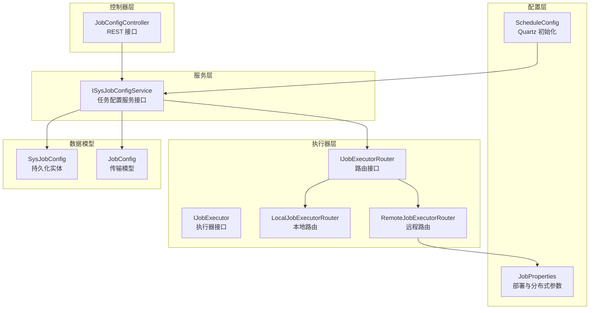
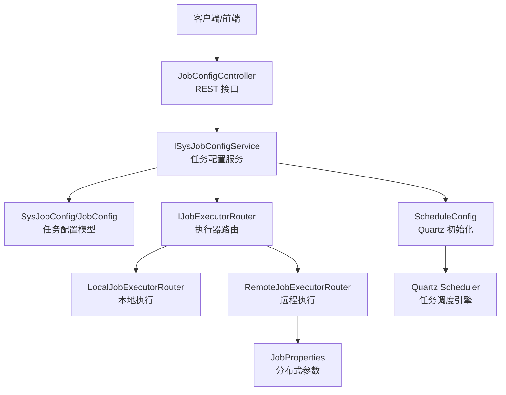
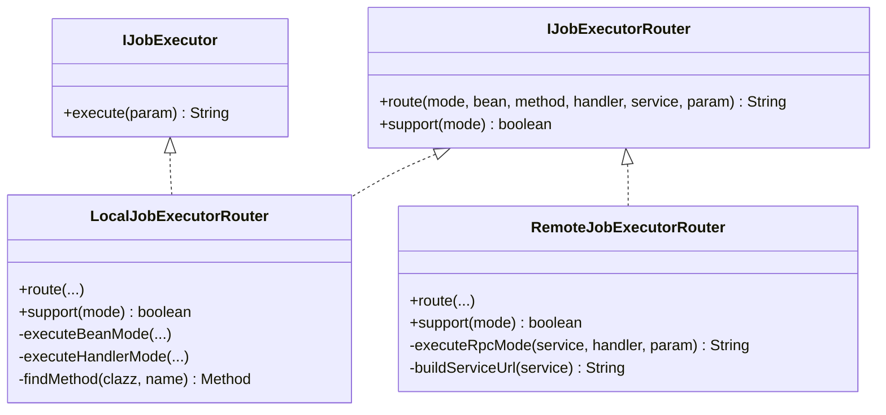
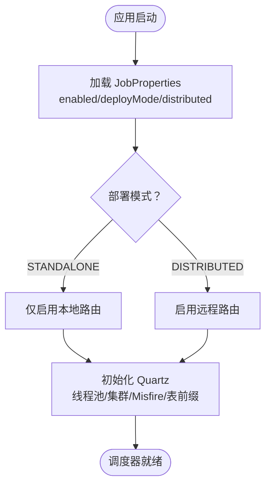
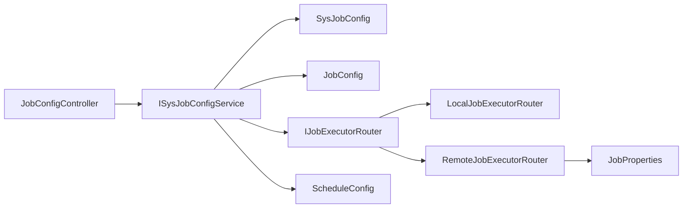

# 任务调度插件开发

<cite>
**本文引用的文件**
- [JobConfigController.java](file://forge/forge-framework/forge-plugin-parent/forge-plugin-job/src/main/java/com/mdframe/forge/plugin/job/controller/JobConfigController.java)
- [ISysJobConfigService.java](file://forge/forge-framework/forge-plugin-parent/forge-plugin-job/src/main/java/com/mdframe/forge/plugin/job/service/ISysJobConfigService.java)
- [IJobExecutor.java](file://forge/forge-framework/forge-plugin-parent/forge-plugin-job/src/main/java/com/mdframe/forge/plugin/job/executor/IJobExecutor.java)
- [IJobExecutorRouter.java](file://forge/forge-framework/forge-plugin-parent/forge-plugin-job/src/main/java/com/mdframe/forge/plugin/job/executor/IJobExecutorRouter.java)
- [LocalJobExecutorRouter.java](file://forge/forge-framework/forge-plugin-parent/forge-plugin-job/src/main/java/com/mdframe/forge/plugin/job/executor/impl/LocalJobExecutorRouter.java)
- [RemoteJobExecutorRouter.java](file://forge/forge-framework/forge-plugin-parent/forge-plugin-job/src/main/java/com/mdframe/forge/plugin/job/executor/impl/RemoteJobExecutorRouter.java)
- [SysJobConfig.java](file://forge/forge-framework/forge-plugin-parent/forge-plugin-job/src/main/java/com/mdframe/forge/plugin/job/entity/SysJobConfig.java)
- [JobConfig.java](file://forge/forge-framework/forge-plugin-parent/forge-plugin-job/src/main/java/com/mdframe/forge/plugin/job/model/JobConfig.java)
- [JobProperties.java](file://forge/forge-framework/forge-plugin-parent/forge-plugin-job/src/main/java/com/mdframe/forge/plugin/job/config/JobProperties.java)
- [ScheduleConfig.java](file://forge/forge-framework/forge-plugin-parent/forge-plugin-job/src/main/java/com/mdframe/forge/plugin/job/config/ScheduleConfig.java)
</cite>

## 目录
1. [简介](#简介)
2. [项目结构](#项目结构)
3. [核心组件](#核心组件)
4. [架构总览](#架构总览)
5. [详细组件分析](#详细组件分析)
6. [依赖关系分析](#依赖关系分析)
7. [性能考虑](#性能考虑)
8. [故障排查指南](#故障排查指南)
9. [结论](#结论)
10. [附录](#附录)

## 简介
本指南面向使用 Forge 框架开发“任务调度插件”的工程师与架构师，系统性阐述任务调度插件的架构设计与实现要点，覆盖以下主题：
- 任务配置管理：配置控制器、服务层接口与实体模型
- Cron 表达式解析与调度：基于 Quartz 的配置与线程池设置
- 任务执行监控：执行器路由策略、远程执行支持、任务日志记录
- 开发流程：任务定义、配置管理、执行调度、状态监控
- 高级特性：并发控制、失败重试、超时处理
- 注册机制、生命周期管理、资源清理策略
- 完整开发示例与性能优化建议

## 项目结构
任务调度插件位于 Forge 框架的插件父工程下，采用按职责分层的组织方式：
- controller 层：对外提供 REST 接口，负责任务的增删改查、启停、立即触发、Cron 更新等
- service 层：定义任务配置的服务接口，具体实现由具体模块提供
- entity/model 层：持久化实体与传输模型，承载任务元数据
- executor 层：执行器接口与路由策略，支持本地与远程两种执行模式
- config 层：任务调度与部署相关配置，含 Quartz 初始化与分布式参数

图表来源
- [JobConfigController.java](file://forge/forge-framework/forge-plugin-parent/forge-plugin-job/src/main/java/com/mdframe/forge/plugin/job/controller/JobConfigController.java#L1-L110)
- [ISysJobConfigService.java](file://forge/forge-framework/forge-plugin-parent/forge-plugin-job/src/main/java/com/mdframe/forge/plugin/job/service/ISysJobConfigService.java#L1-L52)
- [IJobExecutor.java](file://forge/forge-framework/forge-plugin-parent/forge-plugin-job/src/main/java/com/mdframe/forge/plugin/job/executor/IJobExecutor.java#L1-L16)
- [IJobExecutorRouter.java](file://forge/forge-framework/forge-plugin-parent/forge-plugin-job/src/main/java/com/mdframe/forge/plugin/job/executor/IJobExecutorRouter.java#L1-L33)
- [LocalJobExecutorRouter.java](file://forge/forge-framework/forge-plugin-parent/forge-plugin-job/src/main/java/com/mdframe/forge/plugin/job/executor/impl/LocalJobExecutorRouter.java#L1-L102)
- [RemoteJobExecutorRouter.java](file://forge/forge-framework/forge-plugin-parent/forge-plugin-job/src/main/java/com/mdframe/forge/plugin/job/executor/impl/RemoteJobExecutorRouter.java#L1-L107)
- [SysJobConfig.java](file://forge/forge-framework/forge-plugin-parent/forge-plugin-job/src/main/java/com/mdframe/forge/plugin/job/entity/SysJobConfig.java#L1-L97)
- [JobConfig.java](file://forge/forge-framework/forge-plugin-parent/forge-plugin-job/src/main/java/com/mdframe/forge/plugin/job/model/JobConfig.java#L1-L98)
- [JobProperties.java](file://forge/forge-framework/forge-plugin-parent/forge-plugin-job/src/main/java/com/mdframe/forge/plugin/job/config/JobProperties.java#L1-L66)
- [ScheduleConfig.java](file://forge/forge-framework/forge-plugin-parent/forge-plugin-job/src/main/java/com/mdframe/forge/plugin/job/config/ScheduleConfig.java#L1-L62)

章节来源
- [JobConfigController.java](file://forge/forge-framework/forge-plugin-parent/forge-plugin-job/src/main/java/com/mdframe/forge/plugin/job/controller/JobConfigController.java#L1-L110)
- [ISysJobConfigService.java](file://forge/forge-framework/forge-plugin-parent/forge-plugin-job/src/main/java/com/mdframe/forge/plugin/job/service/ISysJobConfigService.java#L1-L52)
- [SysJobConfig.java](file://forge/forge-framework/forge-plugin-parent/forge-plugin-job/src/main/java/com/mdframe/forge/plugin/job/entity/SysJobConfig.java#L1-L97)
- [JobConfig.java](file://forge/forge-framework/forge-plugin-parent/forge-plugin-job/src/main/java/com/mdframe/forge/plugin/job/model/JobConfig.java#L1-L98)
- [IJobExecutor.java](file://forge/forge-framework/forge-plugin-parent/forge-plugin-job/src/main/java/com/mdframe/forge/plugin/job/executor/IJobExecutor.java#L1-L16)
- [IJobExecutorRouter.java](file://forge/forge-framework/forge-plugin-parent/forge-plugin-job/src/main/java/com/mdframe/forge/plugin/job/executor/IJobExecutorRouter.java#L1-L33)
- [LocalJobExecutorRouter.java](file://forge/forge-framework/forge-plugin-parent/forge-plugin-job/src/main/java/com/mdframe/forge/plugin/job/executor/impl/LocalJobExecutorRouter.java#L1-L102)
- [RemoteJobExecutorRouter.java](file://forge/forge-framework/forge-plugin-parent/forge-plugin-job/src/main/java/com/mdframe/forge/plugin/job/executor/impl/RemoteJobExecutorRouter.java#L1-L107)
- [JobProperties.java](file://forge/forge-framework/forge-plugin-parent/forge-plugin-job/src/main/java/com/mdframe/forge/plugin/job/config/JobProperties.java#L1-L66)
- [ScheduleConfig.java](file://forge/forge-framework/forge-plugin-parent/forge-plugin-job/src/main/java/com/mdframe/forge/plugin/job/config/ScheduleConfig.java#L1-L62)

## 核心组件
- JobConfigController：提供任务的分页查询、详情、新增、更新、删除、启动、停止、立即触发、Cron 更新等接口，统一返回响应包装对象；支持条件启用与加解密注解
- ISysJobConfigService：任务配置服务接口，定义分页查询、新增、更新、删除、启动、停止、立即触发、更新 Cron 等能力
- SysJobConfig/JobConfig：任务配置的持久化实体与传输模型，包含任务名称、分组、描述、执行器信息、Cron 表达式、参数、状态、执行模式、重试次数、告警与 WebHook 等字段
- IJobExecutor：业务任务执行器接口，要求实现带参数的 execute 方法
- IJobExecutorRouter：执行器路由接口，负责根据执行模式（BEAN/HANDLER/RPC）选择本地或远程执行路径
- LocalJobExecutorRouter：本地路由实现，支持 BEAN 与 HANDLER 两种模式，通过 Spring 获取 Bean 或以 IJobExecutor 方式执行
- RemoteJobExecutorRouter：远程路由实现，仅支持 RPC 模式，封装 HTTP 请求并内置重试与超时控制
- JobProperties：任务调度配置属性，包含启用开关、部署模式（单体/分布式）、分布式超时、重试次数、注册中心类型与服务列表等
- ScheduleConfig：Quartz 调度器工厂配置，设置线程池大小、集群检查间隔、Misfire 阈值、表前缀等，并延时启动

章节来源
- [JobConfigController.java](file://forge/forge-framework/forge-plugin-parent/forge-plugin-job/src/main/java/com/mdframe/forge/plugin/job/controller/JobConfigController.java#L1-L110)
- [ISysJobConfigService.java](file://forge/forge-framework/forge-plugin-parent/forge-plugin-job/src/main/java/com/mdframe/forge/plugin/job/service/ISysJobConfigService.java#L1-L52)
- [SysJobConfig.java](file://forge/forge-framework/forge-plugin-parent/forge-plugin-job/src/main/java/com/mdframe/forge/plugin/job/entity/SysJobConfig.java#L1-L97)
- [JobConfig.java](file://forge/forge-framework/forge-plugin-parent/forge-plugin-job/src/main/java/com/mdframe/forge/plugin/job/model/JobConfig.java#L1-L98)
- [IJobExecutor.java](file://forge/forge-framework/forge-plugin-parent/forge-plugin-job/src/main/java/com/mdframe/forge/plugin/job/executor/IJobExecutor.java#L1-L16)
- [IJobExecutorRouter.java](file://forge/forge-framework/forge-plugin-parent/forge-plugin-job/src/main/java/com/mdframe/forge/plugin/job/executor/IJobExecutorRouter.java#L1-L33)
- [LocalJobExecutorRouter.java](file://forge/forge-framework/forge-plugin-parent/forge-plugin-job/src/main/java/com/mdframe/forge/plugin/job/executor/impl/LocalJobExecutorRouter.java#L1-L102)
- [RemoteJobExecutorRouter.java](file://forge/forge-framework/forge-plugin-parent/forge-plugin-job/src/main/java/com/mdframe/forge/plugin/job/executor/impl/RemoteJobExecutorRouter.java#L1-L107)
- [JobProperties.java](file://forge/forge-framework/forge-plugin-parent/forge-plugin-job/src/main/java/com/mdframe/forge/plugin/job/config/JobProperties.java#L1-L66)
- [ScheduleConfig.java](file://forge/forge-framework/forge-plugin-parent/forge-plugin-job/src/main/java/com/mdframe/forge/plugin/job/config/ScheduleConfig.java#L1-L62)

## 架构总览
任务调度插件采用“控制器-服务-执行器-配置”分层架构，结合 Quartz 实现任务调度，通过路由策略支持本地与远程执行模式。

图表来源
- [JobConfigController.java](file://forge/forge-framework/forge-plugin-parent/forge-plugin-job/src/main/java/com/mdframe/forge/plugin/job/controller/JobConfigController.java#L1-L110)
- [ISysJobConfigService.java](file://forge/forge-framework/forge-plugin-parent/forge-plugin-job/src/main/java/com/mdframe/forge/plugin/job/service/ISysJobConfigService.java#L1-L52)
- [SysJobConfig.java](file://forge/forge-framework/forge-plugin-parent/forge-plugin-job/src/main/java/com/mdframe/forge/plugin/job/entity/SysJobConfig.java#L1-L97)
- [JobConfig.java](file://forge/forge-framework/forge-plugin-parent/forge-plugin-job/src/main/java/com/mdframe/forge/plugin/job/model/JobConfig.java#L1-L98)
- [IJobExecutorRouter.java](file://forge/forge-framework/forge-plugin-parent/forge-plugin-job/src/main/java/com/mdframe/forge/plugin/job/executor/IJobExecutorRouter.java#L1-L33)
- [LocalJobExecutorRouter.java](file://forge/forge-framework/forge-plugin-parent/forge-plugin-job/src/main/java/com/mdframe/forge/plugin/job/executor/impl/LocalJobExecutorRouter.java#L1-L102)
- [RemoteJobExecutorRouter.java](file://forge/forge-framework/forge-plugin-parent/forge-plugin-job/src/main/java/com/mdframe/forge/plugin/job/executor/impl/RemoteJobExecutorRouter.java#L1-L107)
- [JobProperties.java](file://forge/forge-framework/forge-plugin-parent/forge-plugin-job/src/main/java/com/mdframe/forge/plugin/job/config/JobProperties.java#L1-L66)
- [ScheduleConfig.java](file://forge/forge-framework/forge-plugin-parent/forge-plugin-job/src/main/java/com/mdframe/forge/plugin/job/config/ScheduleConfig.java#L1-L62)

## 详细组件分析

### 控制器层：JobConfigController
- 功能职责
  - 提供任务分页查询、详情、新增、更新、删除、启动、停止、立即触发、Cron 更新等 REST 接口
  - 使用条件注解控制 API 开关，统一响应包装
- 关键接口
  - GET /job/config/page：分页查询任务列表
  - GET /job/config/{id}：查询任务详情
  - POST /job/config：新增任务
  - PUT /job/config：更新任务
  - DELETE /job/config/{id}：删除任务
  - POST /job/config/{id}/start：启动任务
  - POST /job/config/{id}/stop：停止任务
  - POST /job/config/{id}/trigger：立即触发一次
  - POST /job/config/{id}/cron：更新 Cron 表达式
- 设计要点
  - 统一返回 RespInfo 包装，便于前端处理
  - 条件启用开关与加解密注解，确保安全与可配置性

章节来源
- [JobConfigController.java](file://forge/forge-framework/forge-plugin-parent/forge-plugin-job/src/main/java/com/mdframe/forge/plugin/job/controller/JobConfigController.java#L1-L110)

### 服务层：ISysJobConfigService
- 功能职责
  - 定义任务配置的分页查询、新增、更新、删除、启动、停止、立即触发、更新 Cron 等服务契约
- 设计要点
  - 与控制器解耦，便于替换实现与扩展

章节来源
- [ISysJobConfigService.java](file://forge/forge-framework/forge-plugin-parent/forge-plugin-job/src/main/java/com/mdframe/forge/plugin/job/service/ISysJobConfigService.java#L1-L52)

### 数据模型：SysJobConfig 与 JobConfig
- SysJobConfig（持久化实体）
  - 字段覆盖：任务名称、分组、描述、执行器 Bean/方法、执行器 Handler、执行器服务名、Cron 表达式、任务参数、状态、执行模式、重试次数、告警邮箱、WebHook、创建/更新时间
- JobConfig（传输模型）
  - 字段覆盖：任务 ID、名称、分组、描述、执行器 Bean/方法、执行器 Handler、执行器服务名、Cron 表达式、任务参数、状态、执行模式、重试次数、告警邮箱、WebHook、创建/更新时间
- 设计要点
  - 实体与模型分离，便于持久化与跨层传输解耦

章节来源
- [SysJobConfig.java](file://forge/forge-framework/forge-plugin-parent/forge-plugin-job/src/main/java/com/mdframe/forge/plugin/job/entity/SysJobConfig.java#L1-L97)
- [JobConfig.java](file://forge/forge-framework/forge-plugin-parent/forge-plugin-job/src/main/java/com/mdframe/forge/plugin/job/model/JobConfig.java#L1-L98)

### 执行器层：IJobExecutor 与 IJobExecutorRouter
- IJobExecutor
  - 业务任务需实现的统一接口，提供带参数的 execute 方法
- IJobExecutorRouter
  - 路由接口，支持多种执行模式（BEAN/HANDLER/RPC），并提供支持判断
- LocalJobExecutorRouter
  - 本地执行：支持 BEAN 与 HANDLER 两种模式
  - BEAN 模式：通过 Spring 获取 Bean 并反射调用方法（支持无参与带 String 参数）
  - HANDLER 模式：通过 Spring 获取 IJobExecutor 实例并执行
- RemoteJobExecutorRouter
  - 仅支持 RPC 模式，封装 HTTP 请求，内置重试与超时控制
  - URL 构建：当前为简单拼接，预留服务发现集成点

图表来源
- [IJobExecutor.java](file://forge/forge-framework/forge-plugin-parent/forge-plugin-job/src/main/java/com/mdframe/forge/plugin/job/executor/IJobExecutor.java#L1-L16)
- [IJobExecutorRouter.java](file://forge/forge-framework/forge-plugin-parent/forge-plugin-job/src/main/java/com/mdframe/forge/plugin/job/executor/IJobExecutorRouter.java#L1-L33)
- [LocalJobExecutorRouter.java](file://forge/forge-framework/forge-plugin-parent/forge-plugin-job/src/main/java/com/mdframe/forge/plugin/job/executor/impl/LocalJobExecutorRouter.java#L1-L102)
- [RemoteJobExecutorRouter.java](file://forge/forge-framework/forge-plugin-parent/forge-plugin-job/src/main/java/com/mdframe/forge/plugin/job/executor/impl/RemoteJobExecutorRouter.java#L1-L107)

章节来源
- [IJobExecutor.java](file://forge/forge-framework/forge-plugin-parent/forge-plugin-job/src/main/java/com/mdframe/forge/plugin/job/executor/IJobExecutor.java#L1-L16)
- [IJobExecutorRouter.java](file://forge/forge-framework/forge-plugin-parent/forge-plugin-job/src/main/java/com/mdframe/forge/plugin/job/executor/IJobExecutorRouter.java#L1-L33)
- [LocalJobExecutorRouter.java](file://forge/forge-framework/forge-plugin-parent/forge-plugin-job/src/main/java/com/mdframe/forge/plugin/job/executor/impl/LocalJobExecutorRouter.java#L1-L102)
- [RemoteJobExecutorRouter.java](file://forge/forge-framework/forge-plugin-parent/forge-plugin-job/src/main/java/com/mdframe/forge/plugin/job/executor/impl/RemoteJobExecutorRouter.java#L1-L107)

### 配置层：JobProperties 与 ScheduleConfig
- JobProperties
  - enabled：是否启用任务调度
  - deployMode：部署模式（STANDALONE/DISTRIBUTED）
  - distributed：分布式配置，包含 registryType、executorServices、timeout、retryCount
- ScheduleConfig
  - 初始化 Quartz SchedulerFactoryBean
  - 配置线程池大小、集群检查间隔、Misfire 阈值、表前缀等
  - 延时启动与自动启动

图表来源
- [JobProperties.java](file://forge/forge-framework/forge-plugin-parent/forge-plugin-job/src/main/java/com/mdframe/forge/plugin/job/config/JobProperties.java#L1-L66)
- [ScheduleConfig.java](file://forge/forge-framework/forge-plugin-parent/forge-plugin-job/src/main/java/com/mdframe/forge/plugin/job/config/ScheduleConfig.java#L1-L62)

章节来源
- [JobProperties.java](file://forge/forge-framework/forge-plugin-parent/forge-plugin-job/src/main/java/com/mdframe/forge/plugin/job/config/JobProperties.java#L1-L66)
- [ScheduleConfig.java](file://forge/forge-framework/forge-plugin-parent/forge-plugin-job/src/main/java/com/mdframe/forge/plugin/job/config/ScheduleConfig.java#L1-L62)

### Cron 表达式解析与调度
- 解析与存储
  - Cron 表达式存储于任务配置实体与模型中，用于驱动 Quartz 调度
- Quartz 配置
  - 线程池大小、集群检查间隔、Misfire 阈值、表前缀等参数在配置类中集中管理
- 启动策略
  - 调度器延时启动，避免与数据库连接竞争；OverwriteExistingJobs 保证更新 JobDefinition 时无需手动清理

章节来源
- [SysJobConfig.java](file://forge/forge-framework/forge-plugin-parent/forge-plugin-job/src/main/java/com/mdframe/forge/plugin/job/entity/SysJobConfig.java#L1-L97)
- [JobConfig.java](file://forge/forge-framework/forge-plugin-parent/forge-plugin-job/src/main/java/com/mdframe/forge/plugin/job/model/JobConfig.java#L1-L98)
- [ScheduleConfig.java](file://forge/forge-framework/forge-plugin-parent/forge-plugin-job/src/main/java/com/mdframe/forge/plugin/job/config/ScheduleConfig.java#L1-L62)

### 任务执行监控机制
- 日志记录
  - 远程执行器在发起 HTTP 调用前后记录日志，包含服务名、处理器名、URL 与响应体
  - 失败重试时记录警告日志，包含重试次数与异常信息
- 告警与通知
  - 任务配置模型包含 alarmEmail 与 webhookUrl 字段，可用于扩展告警与通知逻辑
- 状态管理
  - 任务状态字段（0-停止，1-运行）配合控制器启停接口，实现运行态可视化

章节来源
- [RemoteJobExecutorRouter.java](file://forge/forge-framework/forge-plugin-parent/forge-plugin-job/src/main/java/com/mdframe/forge/plugin/job/executor/impl/RemoteJobExecutorRouter.java#L1-L107)
- [SysJobConfig.java](file://forge/forge-framework/forge-plugin-parent/forge-plugin-job/src/main/java/com/mdframe/forge/plugin/job/entity/SysJobConfig.java#L1-L97)
- [JobConfig.java](file://forge/forge-framework/forge-plugin-parent/forge-plugin-job/src/main/java/com/mdframe/forge/plugin/job/model/JobConfig.java#L1-L98)
- [JobConfigController.java](file://forge/forge-framework/forge-plugin-parent/forge-plugin-job/src/main/java/com/mdframe/forge/plugin/job/controller/JobConfigController.java#L1-L110)

### 任务插件开发流程
- 任务定义
  - 在任务配置中定义任务名称、分组、描述、Cron 表达式、执行模式与参数
  - 选择执行器：BEAN 模式（指定 Bean 名称与方法）、HANDLER 模式（实现 IJobExecutor）、RPC 模式（指定服务名）
- 配置管理
  - 通过控制器接口完成任务的新增、更新、启停、立即触发与 Cron 更新
- 执行调度
  - Quartz 根据 Cron 表达式调度，路由策略根据部署模式选择本地或远程执行
- 状态监控
  - 通过控制器启停接口与日志输出，实时掌握任务运行状态

章节来源
- [JobConfigController.java](file://forge/forge-framework/forge-plugin-parent/forge-plugin-job/src/main/java/com/mdframe/forge/plugin/job/controller/JobConfigController.java#L1-L110)
- [SysJobConfig.java](file://forge/forge-framework/forge-plugin-parent/forge-plugin-job/src/main/java/com/mdframe/forge/plugin/job/entity/SysJobConfig.java#L1-L97)
- [JobConfig.java](file://forge/forge-framework/forge-plugin-parent/forge-plugin-job/src/main/java/com/mdframe/forge/plugin/job/model/JobConfig.java#L1-L98)
- [IJobExecutorRouter.java](file://forge/forge-framework/forge-plugin-parent/forge-plugin-job/src/main/java/com/mdframe/forge/plugin/job/executor/IJobExecutorRouter.java#L1-L33)
- [LocalJobExecutorRouter.java](file://forge/forge-framework/forge-plugin-parent/forge-plugin-job/src/main/java/com/mdframe/forge/plugin/job/executor/impl/LocalJobExecutorRouter.java#L1-L102)
- [RemoteJobExecutorRouter.java](file://forge/forge-framework/forge-plugin-parent/forge-plugin-job/src/main/java/com/mdframe/forge/plugin/job/executor/impl/RemoteJobExecutorRouter.java#L1-L107)

### 高级特性：并发控制、失败重试、超时处理
- 并发控制
  - Quartz 线程池大小在配置类中设置，可通过调整线程数控制并发度
- 失败重试
  - 远程执行器内置重试逻辑，支持配置重试次数与递增延迟
- 超时处理
  - 远程执行器支持配置超时时间，超过阈值抛出异常并记录日志

章节来源
- [ScheduleConfig.java](file://forge/forge-framework/forge-plugin-parent/forge-plugin-job/src/main/java/com/mdframe/forge/plugin/job/config/ScheduleConfig.java#L1-L62)
- [RemoteJobExecutorRouter.java](file://forge/forge-framework/forge-plugin-parent/forge-plugin-job/src/main/java/com/mdframe/forge/plugin/job/executor/impl/RemoteJobExecutorRouter.java#L1-L107)
- [JobProperties.java](file://forge/forge-framework/forge-plugin-parent/forge-plugin-job/src/main/java/com/mdframe/forge/plugin/job/config/JobProperties.java#L1-L66)

### 注册机制、生命周期管理、资源清理策略
- 注册机制
  - 任务配置模型与实体包含任务名称、分组、描述、执行器信息、Cron 表达式、状态等字段，用于任务注册与识别
- 生命周期管理
  - 通过控制器启停接口与 Quartz 调度器实现任务生命周期管理
- 资源清理策略
  - Quartz OverwriteExistingJobs 与表前缀设置，便于升级与维护时清理与重建

章节来源
- [SysJobConfig.java](file://forge/forge-framework/forge-plugin-parent/forge-plugin-job/src/main/java/com/mdframe/forge/plugin/job/entity/SysJobConfig.java#L1-L97)
- [JobConfig.java](file://forge/forge-framework/forge-plugin-parent/forge-plugin-job/src/main/java/com/mdframe/forge/plugin/job/model/JobConfig.java#L1-L98)
- [JobConfigController.java](file://forge/forge-framework/forge-plugin-parent/forge-plugin-job/src/main/java/com/mdframe/forge/plugin/job/controller/JobConfigController.java#L1-L110)
- [ScheduleConfig.java](file://forge/forge-framework/forge-plugin-parent/forge-plugin-job/src/main/java/com/mdframe/forge/plugin/job/config/ScheduleConfig.java#L1-L62)

## 依赖关系分析
- 控制器依赖服务接口，服务接口依赖数据模型与执行器路由
- 执行器路由在不同部署模式下选择本地或远程实现
- 远程执行器依赖分布式配置属性与 HTTP 工具进行调用
- Quartz 配置独立于业务逻辑，通过工厂 Bean 注入到上下文

图表来源
- [JobConfigController.java](file://forge/forge-framework/forge-plugin-parent/forge-plugin-job/src/main/java/com/mdframe/forge/plugin/job/controller/JobConfigController.java#L1-L110)
- [ISysJobConfigService.java](file://forge/forge-framework/forge-plugin-parent/forge-plugin-job/src/main/java/com/mdframe/forge/plugin/job/service/ISysJobConfigService.java#L1-L52)
- [SysJobConfig.java](file://forge/forge-framework/forge-plugin-parent/forge-plugin-job/src/main/java/com/mdframe/forge/plugin/job/entity/SysJobConfig.java#L1-L97)
- [JobConfig.java](file://forge/forge-framework/forge-plugin-parent/forge-plugin-job/src/main/java/com/mdframe/forge/plugin/job/model/JobConfig.java#L1-L98)
- [IJobExecutorRouter.java](file://forge/forge-framework/forge-plugin-parent/forge-plugin-job/src/main/java/com/mdframe/forge/plugin/job/executor/IJobExecutorRouter.java#L1-L33)
- [LocalJobExecutorRouter.java](file://forge/forge-framework/forge-plugin-parent/forge-plugin-job/src/main/java/com/mdframe/forge/plugin/job/executor/impl/LocalJobExecutorRouter.java#L1-L102)
- [RemoteJobExecutorRouter.java](file://forge/forge-framework/forge-plugin-parent/forge-plugin-job/src/main/java/com/mdframe/forge/plugin/job/executor/impl/RemoteJobExecutorRouter.java#L1-L107)
- [JobProperties.java](file://forge/forge-framework/forge-plugin-parent/forge-plugin-job/src/main/java/com/mdframe/forge/plugin/job/config/JobProperties.java#L1-L66)
- [ScheduleConfig.java](file://forge/forge-framework/forge-plugin-parent/forge-plugin-job/src/main/java/com/mdframe/forge/plugin/job/config/ScheduleConfig.java#L1-L62)

章节来源
- [JobConfigController.java](file://forge/forge-framework/forge-plugin-parent/forge-plugin-job/src/main/java/com/mdframe/forge/plugin/job/controller/JobConfigController.java#L1-L110)
- [ISysJobConfigService.java](file://forge/forge-framework/forge-plugin-parent/forge-plugin-job/src/main/java/com/mdframe/forge/plugin/job/service/ISysJobConfigService.java#L1-L52)
- [IJobExecutorRouter.java](file://forge/forge-framework/forge-plugin-parent/forge-plugin-job/src/main/java/com/mdframe/forge/plugin/job/executor/IJobExecutorRouter.java#L1-L33)
- [RemoteJobExecutorRouter.java](file://forge/forge-framework/forge-plugin-parent/forge-plugin-job/src/main/java/com/mdframe/forge/plugin/job/executor/impl/RemoteJobExecutorRouter.java#L1-L107)
- [JobProperties.java](file://forge/forge-framework/forge-plugin-parent/forge-plugin-job/src/main/java/com/mdframe/forge/plugin/job/config/JobProperties.java#L1-L66)
- [ScheduleConfig.java](file://forge/forge-framework/forge-plugin-parent/forge-plugin-job/src/main/java/com/mdframe/forge/plugin/job/config/ScheduleConfig.java#L1-L62)

## 性能考虑
- 线程池规模：根据任务并发需求与 CPU 核心数调整 Quartz 线程池大小
- Misfire 策略：合理设置 Misfire 阈值与最大并发处理数量，避免任务堆积
- 远程调用：在分布式模式下，适当增加超时与重试次数，同时关注网络抖动对吞吐的影响
- 数据库连接：动态数据源场景下确保 Quartz 使用主库连接，避免连接竞争

## 故障排查指南
- 远程执行失败
  - 检查服务名与 URL 构建是否正确，确认服务可用性
  - 查看重试日志与异常栈，定位网络或目标服务问题
- 本地执行失败
  - 检查 Bean 名称与方法签名是否匹配，确认方法可见性与参数类型
- Cron 不生效
  - 校验 Cron 表达式格式，确认 Quartz 调度器已启动且未被覆盖关闭
- 配置未生效
  - 检查部署模式配置与条件启用开关，确认分布式参数是否正确

章节来源
- [RemoteJobExecutorRouter.java](file://forge/forge-framework/forge-plugin-parent/forge-plugin-job/src/main/java/com/mdframe/forge/plugin/job/executor/impl/RemoteJobExecutorRouter.java#L1-L107)
- [LocalJobExecutorRouter.java](file://forge/forge-framework/forge-plugin-parent/forge-plugin-job/src/main/java/com/mdframe/forge/plugin/job/executor/impl/LocalJobExecutorRouter.java#L1-L102)
- [ScheduleConfig.java](file://forge/forge-framework/forge-plugin-parent/forge-plugin-job/src/main/java/com/mdframe/forge/plugin/job/config/ScheduleConfig.java#L1-L62)
- [JobProperties.java](file://forge/forge-framework/forge-plugin-parent/forge-plugin-job/src/main/java/com/mdframe/forge/plugin/job/config/JobProperties.java#L1-L66)

## 结论
本指南系统梳理了 Forge 任务调度插件的架构与实现要点，涵盖配置管理、Cron 解析、执行路由、远程调用、监控与告警、并发与重试等关键能力。通过清晰的分层设计与可配置的部署模式，开发者可以快速构建稳定、可扩展的任务调度系统。

## 附录
- 开发步骤建议
  - 定义任务与执行器：实现 IJobExecutor 或准备 Bean/方法
  - 配置任务：填写 Cron、执行模式与参数
  - 启动与验证：通过控制器启停与日志观察
  - 监控与告警：结合 alarmEmail 与 webhookUrl 扩展通知
- 性能优化建议
  - 合理设置线程池与 Misfire 策略
  - 分布式模式下优化网络与服务发现
  - 使用动态数据源时确保 Quartz 使用主库连接