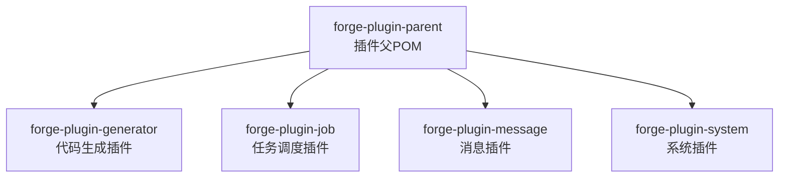
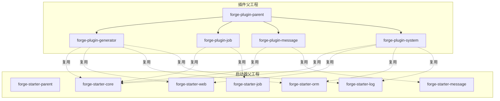
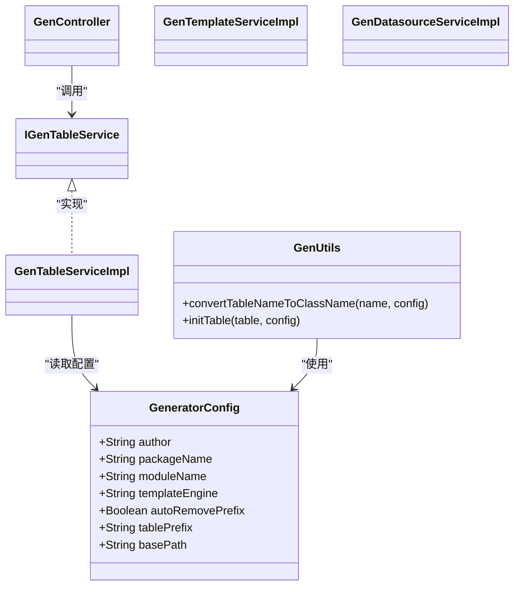
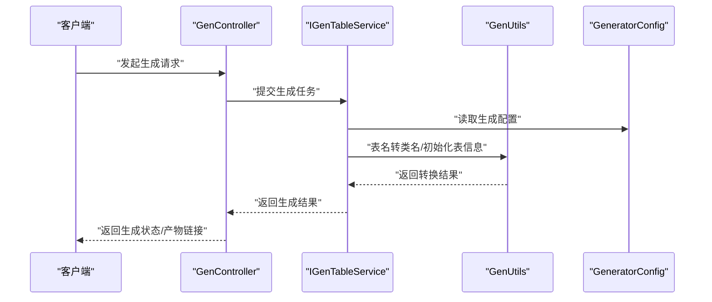
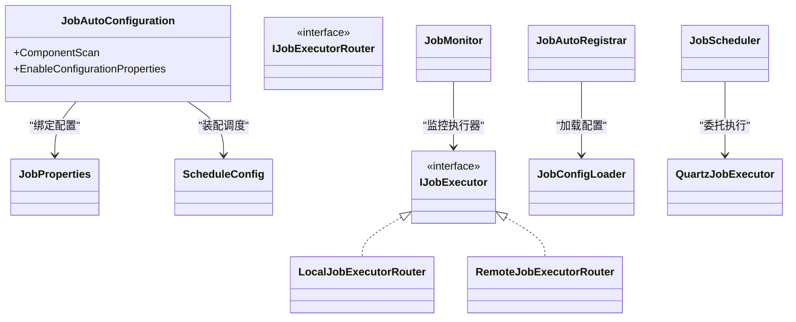
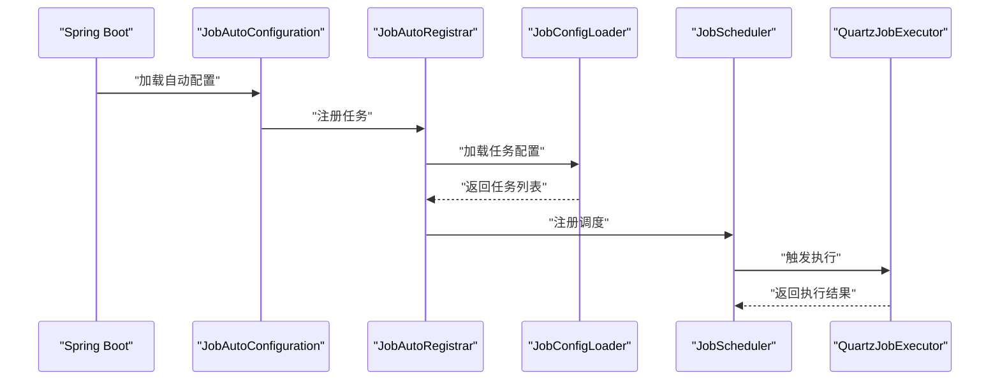
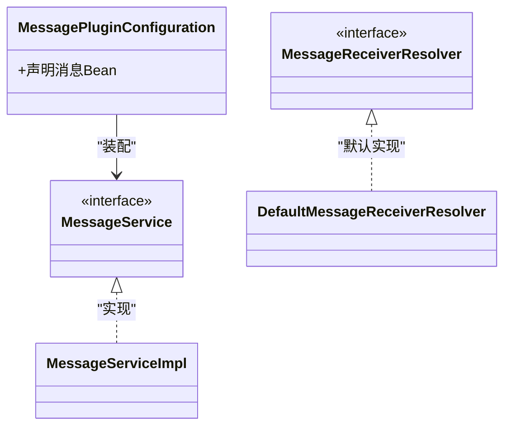
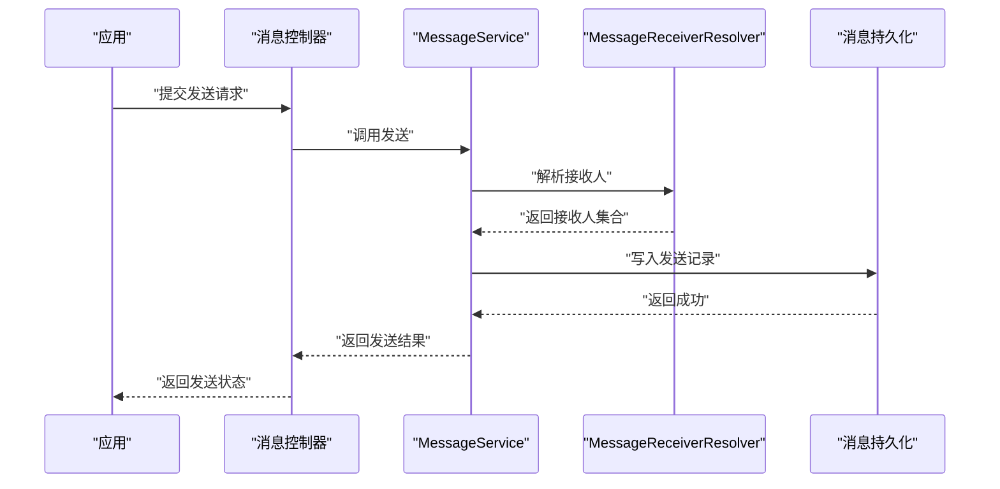
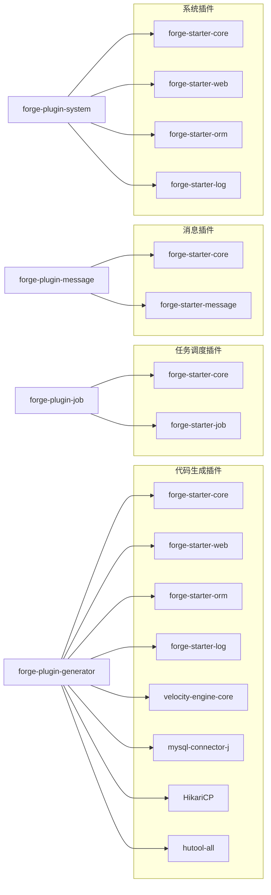

# 插件开发

<cite>
**本文引用的文件**
- [forge/forge-framework/forge-plugin-parent/pom.xml](file://forge/forge-framework/forge-plugin-parent/pom.xml)
- [forge/forge-framework/forge-plugin-parent/forge-plugin-generator/pom.xml](file://forge/forge-framework/forge-plugin-parent/forge-plugin-generator/pom.xml)
- [forge/forge-framework/forge-plugin-parent/forge-plugin-generator/src/main/java/com/mdframe/forge/plugin/generator/config/GeneratorConfig.java](file://forge/forge-framework/forge-plugin-parent/forge-plugin-generator/src/main/java/com/mdframe/forge/plugin/generator/config/GeneratorConfig.java)
- [forge/forge-framework/forge-plugin-parent/forge-plugin-generator/src/main/java/com/mdframe/forge/plugin/generator/util/GenUtils.java](file://forge/forge-framework/forge-plugin-parent/forge-plugin-generator/src/main/java/com/mdframe/forge/plugin/generator/util/GenUtils.java)
- [forge/forge-framework/forge-plugin-parent/forge-plugin-generator/src/main/resources/application.yml](file://forge/forge-framework/forge-plugin-parent/forge-plugin-generator/src/main/resources/application.yml)
- [forge/forge-framework/forge-plugin-parent/forge-plugin-job/src/main/java/com/mdframe/forge/plugin/job/config/JobAutoConfiguration.java](file://forge/forge-framework/forge-plugin-parent/forge-plugin-job/src/main/java/com/mdframe/forge/plugin/job/config/JobAutoConfiguration.java)
- [forge/forge-framework/forge-plugin-parent/forge-plugin-job/src/main/java/com/mdframe/forge/plugin/job/config/JobProperties.java](file://forge/forge-framework/forge-plugin-parent/forge-plugin-job/src/main/java/com/mdframe/forge/plugin/job/config/JobProperties.java)
- [forge/forge-framework/forge-plugin-parent/forge-plugin-job/src/main/java/com/mdframe/forge/plugin/job/config/ScheduleConfig.java](file://forge/forge-framework/forge-plugin-parent/forge-plugin-job/src/main/java/com/mdframe/forge/plugin/job/config/ScheduleConfig.java)
- [forge/forge-framework/forge-plugin-parent/forge-plugin-job/src/main/java/com/mdframe/forge/plugin/job/executor/IJobExecutor.java](file://forge/forge-framework/forge-plugin-parent/forge-plugin-job/src/main/java/com/mdframe/forge/plugin/job/executor/IJobExecutor.java)
- [forge/forge-framework/forge-plugin-parent/forge-plugin-job/src/main/java/com/mdframe/forge/plugin/job/executor/IJobExecutorRouter.java](file://forge/forge-framework/forge-plugin-parent/forge-plugin-job/src/main/java/com/mdframe/forge/plugin/job/executor/IJobExecutorRouter.java)
- [forge/forge-framework/forge-plugin-parent/forge-plugin-job/src/main/java/com/mdframe/forge/plugin/job/executor/impl/LocalJobExecutorRouter.java](file://forge/forge-framework/forge-plugin-parent/forge-plugin-job/src/main/java/com/mdframe/forge/plugin/job/executor/impl/LocalJobExecutorRouter.java)
- [forge/forge-framework/forge-plugin-parent/forge-plugin-job/src/main/java/com/mdframe/forge/plugin/job/executor/impl/RemoteJobExecutorRouter.java](file://forge/forge-framework/forge-plugin-parent/forge-plugin-job/src/main/java/com/mdframe/forge/plugin/job/executor/impl/RemoteJobExecutorRouter.java)
- [forge/forge-framework/forge-plugin-parent/forge-plugin-job/src/main/java/com/mdframe/forge/plugin/job/loader/JobConfigLoader.java](file://forge/forge-framework/forge-plugin-parent/forge-plugin-job/src/main/java/com/mdframe/forge/plugin/job/loader/JobConfigLoader.java)
- [forge/forge-framework/forge-plugin-parent/forge-plugin-job/src/main/java/com/mdframe/forge/plugin/job/monitor/JobMonitor.java](file://forge/forge-framework/forge-plugin-parent/forge-plugin-job/src/main/java/com/mdframe/forge/plugin/job/monitor/JobMonitor.java)
- [forge/forge-framework/forge-plugin-parent/forge-plugin-job/src/main/java/com/mdframe/forge/plugin/job/registry/JobAutoRegistrar.java](file://forge/forge-framework/forge-plugin-parent/forge-plugin-job/src/main/java/com/mdframe/forge/plugin/job/registry/JobAutoRegistrar.java)
- [forge/forge-framework/forge-plugin-parent/forge-plugin-job/src/main/java/com/mdframe/forge/plugin/job/scheduler/JobScheduler.java](file://forge/forge-framework/forge-plugin-parent/forge-plugin-job/src/main/java/com/mdframe/forge/plugin/job/scheduler/JobScheduler.java)
- [forge/forge-framework/forge-plugin-parent/forge-plugin-job/src/main/java/com/mdframe/forge/plugin/job/scheduler/QuartzJobExecutor.java](file://forge/forge-framework/forge-plugin-parent/forge-plugin-job/src/main/java/com/mdframe/forge/plugin/job/scheduler/QuartzJobExecutor.java)
- [forge/forge-framework/forge-plugin-parent/forge-plugin-job/src/main/resources/META-INF/spring/org.springframework.boot.autoconfigure.AutoConfiguration.imports](file://forge/forge-framework/forge-plugin-parent/forge-plugin-job/src/main/resources/META-INF/spring/org.springframework.boot.autoconfigure.AutoConfiguration.imports)
- [forge/forge-framework/forge-plugin-parent/forge-plugin-job/src/main/resources/application-job-example.yml](file://forge/forge-framework/forge-plugin-parent/forge-plugin-job/src/main/resources/application-job-example.yml)
- [forge/forge-framework/forge-plugin-parent/forge-plugin-message/src/main/java/com/mdframe/forge/plugin/message/config/MessagePluginConfiguration.java](file://forge/forge-framework/forge-plugin-parent/forge-plugin-message/src/main/java/com/mdframe/forge/plugin/message/config/MessagePluginConfiguration.java)
- [forge/forge-framework/forge-plugin-parent/forge-plugin-message/src/main/java/com/mdframe/forge/plugin/message/service/MessageService.java](file://forge/forge-framework/forge-plugin-parent/forge-plugin-message/src/main/java/com/mdframe/forge/plugin/message/service/MessageService.java)
- [forge/forge-framework/forge-plugin-parent/forge-plugin-message/src/main/java/com/mdframe/forge/plugin/message/service/impl/MessageServiceImpl.java](file://forge/forge-framework/forge-plugin-parent/forge-plugin-message/src/main/java/com/mdframe/forge/plugin/message/service/impl/MessageServiceImpl.java)
- [forge/forge-framework/forge-plugin-parent/forge-plugin-message/src/main/java/com/mdframe/forge/plugin/message/service/MessageReceiverResolver.java](file://forge/forge-framework/forge-plugin-parent/forge-plugin-message/src/main/java/com/mdframe/forge/plugin/message/service/MessageReceiverResolver.java)
- [forge/forge-framework/forge-plugin-parent/forge-plugin-message/src/main/java/com/mdframe/forge/plugin/message/service/impl/DefaultMessageReceiverResolver.java](file://forge/forge-framework/forge-plugin-parent/forge-plugin-message/src/main/java/com/mdframe/forge/plugin/message/service/impl/DefaultMessageReceiverResolver.java)
- [forge/forge-framework/forge-plugin-parent/forge-plugin-message/src/main/resources/sql/message_tables.sql](file://forge/forge-framework/forge-plugin-parent/forge-plugin-message/src/main/resources/sql/message_tables.sql)
- [forge/forge-framework/forge-plugin-parent/forge-plugin-system/src/main/java/com/mdframe/forge/plugin/system/constant/SystemConstants.java](file://forge/forge-framework/forge-plugin-parent/forge-plugin-system/src/main/java/com/mdframe/forge/plugin/system/constant/SystemConstants.java)
- [forge/forge-framework/forge-starter-parent/forge-starter-core/pom.xml](file://forge/forge-framework/forge-starter-parent/forge-starter-core/pom.xml)
- [forge/forge-framework/forge-starter-parent/forge-starter-web/pom.xml](file://forge/forge-framework/forge-starter-parent/forge-starter-web/pom.xml)
- [forge/forge-framework/forge-starter-parent/forge-starter-orm/pom.xml](file://forge/forge-framework/forge-starter-parent/forge-starter-orm/pom.xml)
- [forge/forge-framework/forge-starter-parent/forge-starter-log/pom.xml](file://forge/forge-framework/forge-starter-parent/forge-starter-log/pom.xml)
- [forge/forge-framework/forge-starter-parent/forge-starter-message/pom.xml](file://forge/forge-framework/forge-starter-parent/forge-starter-message/pom.xml)
- [forge/forge-framework/forge-starter-parent/forge-starter-job/pom.xml](file://forge/forge-framework/forge-starter-parent/forge-starter-job/pom.xml)
</cite>

## 目录
1. [引言](#引言)
2. [项目结构](#项目结构)
3. [核心组件](#核心组件)
4. [架构总览](#架构总览)
5. [详细组件分析](#详细组件分析)
6. [依赖分析](#依赖分析)
7. [性能考虑](#性能考虑)
8. [故障排查指南](#故障排查指南)
9. [结论](#结论)
10. [附录](#附录)

## 引言
本指南面向Forge框架的插件开发者，系统阐述插件架构设计原理、生命周期管理、插件间通信机制，并提供代码生成、任务调度、消息通知三类核心插件的开发范式与标准流程。文档同时覆盖插件打包发布、版本管理、依赖处理策略，以及安全机制、权限控制与资源隔离建议。最后给出从“Hello World”到复杂业务插件的完整开发示例与调试、性能优化、故障排查方法。

## 项目结构
Forge插件体系以“插件父工程”聚合多个子插件模块，当前仓库包含以下插件模块：
- 代码生成插件：提供表结构到代码的自动化生成能力
- 任务调度插件：基于Quartz的分布式/本地任务执行与监控
- 消息插件：消息模板、发送、接收解析的统一抽象
- 系统插件：系统级配置、字典、文件、日志等通用能力

图表来源
- [forge/forge-framework/forge-plugin-parent/pom.xml](file://forge/forge-framework/forge-plugin-parent/pom.xml#L18-L23)

章节来源
- [forge/forge-framework/forge-plugin-parent/pom.xml](file://forge/forge-framework/forge-plugin-parent/pom.xml#L1-L26)

## 核心组件
本节聚焦三类核心插件的关键构件与职责边界。

- 代码生成插件
  - 配置类：集中管理生成参数（作者、包名、模块名、模板引擎、表前缀、基础路径等）
  - 工具类：负责表名转类名、动态数据源解析、模板渲染辅助
  - 控制器与服务：对外暴露REST接口，封装生成逻辑
  - 资源：模板目录、初始化SQL、应用配置

- 任务调度插件
  - 自动装配：启用配置属性扫描与组件扫描
  - 执行器SPI：定义本地/远程执行路由策略
  - 加载器与注册器：加载任务配置并完成自动注册
  - 调度器与Quartz执行器：封装调度与执行
  - 监控：任务运行状态监控与告警扩展点

- 消息插件
  - 配置类：声明消息相关Bean与模板引擎集成
  - 服务层：消息发送、模板管理、接收人解析
  - 数据模型：消息、模板、发送记录、接收人等实体

章节来源
- [forge/forge-framework/forge-plugin-parent/forge-plugin-generator/src/main/java/com/mdframe/forge/plugin/generator/config/GeneratorConfig.java](file://forge/forge-framework/forge-plugin-parent/forge-plugin-generator/src/main/java/com/mdframe/forge/plugin/generator/config/GeneratorConfig.java#L1-L50)
- [forge/forge-framework/forge-plugin-parent/forge-plugin-job/src/main/java/com/mdframe/forge/plugin/job/config/JobAutoConfiguration.java](file://forge/forge-framework/forge-plugin-parent/forge-plugin-job/src/main/java/com/mdframe/forge/plugin/job/config/JobAutoConfiguration.java#L1-L27)
- [forge/forge-framework/forge-plugin-parent/forge-plugin-message/src/main/java/com/mdframe/forge/plugin/message/config/MessagePluginConfiguration.java](file://forge/forge-framework/forge-plugin-parent/forge-plugin-message/src/main/java/com/mdframe/forge/plugin/message/config/MessagePluginConfiguration.java#L1-L23)

## 架构总览
下图展示插件架构在Spring生态中的装配关系与交互路径，突出“插件父POM”对子模块的聚合、“启动器模块”对通用能力的复用，以及各插件内部的分层职责。

图表来源
- [forge/forge-framework/forge-plugin-parent/pom.xml](file://forge/forge-framework/forge-plugin-parent/pom.xml#L18-L23)
- [forge/forge-framework/forge-starter-parent/forge-starter-core/pom.xml](file://forge/forge-framework/forge-starter-parent/forge-starter-core/pom.xml)
- [forge/forge-framework/forge-starter-parent/forge-starter-web/pom.xml](file://forge/forge-framework/forge-starter-parent/forge-starter-web/pom.xml)
- [forge/forge-framework/forge-starter-parent/forge-starter-orm/pom.xml](file://forge/forge-framework/forge-starter-parent/forge-starter-orm/pom.xml)
- [forge/forge-framework/forge-starter-parent/forge-starter-log/pom.xml](file://forge/forge-framework/forge-starter-parent/forge-starter-log/pom.xml)
- [forge/forge-framework/forge-starter-parent/forge-starter-message/pom.xml](file://forge/forge-framework/forge-starter-parent/forge-starter-message/pom.xml)
- [forge/forge-framework/forge-starter-parent/forge-starter-job/pom.xml](file://forge/forge-framework/forge-starter-parent/forge-starter-job/pom.xml)

## 详细组件分析

### 代码生成插件
- 设计要点
  - 配置中心化：通过配置类集中管理生成参数，便于外部注入与热更新
  - 模板驱动：内置Velocity模板引擎，支持多模板组合生成
  - 工具链完善：提供表名转换、动态数据源解析、生成路径管理
  - 分层清晰：controller-service-mapper-entity-respository，遵循分层与职责分离

- 关键类关系（示意）

图表来源
- [forge/forge-framework/forge-plugin-parent/forge-plugin-generator/src/main/java/com/mdframe/forge/plugin/generator/config/GeneratorConfig.java](file://forge/forge-framework/forge-plugin-parent/forge-plugin-generator/src/main/java/com/mdframe/forge/plugin/generator/config/GeneratorConfig.java#L1-L50)
- [forge/forge-framework/forge-plugin-parent/forge-plugin-generator/src/main/java/com/mdframe/forge/plugin/generator/util/GenUtils.java](file://forge/forge-framework/forge-plugin-parent/forge-plugin-generator/src/main/java/com/mdframe/forge/plugin/generator/util/GenUtils.java)
- [forge/forge-framework/forge-plugin-parent/forge-plugin-generator/src/main/java/com/mdframe/forge/plugin/generator/controller/GenController.java](file://forge/forge-framework/forge-plugin-parent/forge-plugin-generator/src/main/java/com/mdframe/forge/plugin/generator/controller/GenController.java)
- [forge/forge-framework/forge-plugin-parent/forge-plugin-generator/src/main/java/com/mdframe/forge/plugin/generator/service/IGenTableService.java](file://forge/forge-framework/forge-plugin-parent/forge-plugin-generator/src/main/java/com/mdframe/forge/plugin/generator/service/IGenTableService.java)
- [forge/forge-framework/forge-plugin-parent/forge-plugin-generator/src/main/java/com/mdframe/forge/plugin/generator/service/impl/GenTableServiceImpl.java](file://forge/forge-framework/forge-plugin-parent/forge-plugin-generator/src/main/java/com/mdframe/forge/plugin/generator/service/impl/GenTableServiceImpl.java)
- [forge/forge-framework/forge-plugin-parent/forge-plugin-generator/src/main/java/com/mdframe/forge/plugin/generator/service/impl/GenTemplateServiceImpl.java](file://forge/forge-framework/forge-plugin-parent/forge-plugin-generator/src/main/java/com/mdframe/forge/plugin/generator/service/impl/GenTemplateServiceImpl.java)
- [forge/forge-framework/forge-plugin-parent/forge-plugin-generator/src/main/java/com/mdframe/forge/plugin/generator/service/impl/GenDatasourceServiceImpl.java](file://forge/forge-framework/forge-plugin-parent/forge-plugin-generator/src/main/java/com/mdframe/forge/plugin/generator/service/impl/GenDatasourceServiceImpl.java)

- 典型流程（生成流程）

图表来源
- [forge/forge-framework/forge-plugin-parent/forge-plugin-generator/src/main/java/com/mdframe/forge/plugin/generator/controller/GenController.java](file://forge/forge-framework/forge-plugin-parent/forge-plugin-generator/src/main/java/com/mdframe/forge/plugin/generator/controller/GenController.java)
- [forge/forge-framework/forge-plugin-parent/forge-plugin-generator/src/main/java/com/mdframe/forge/plugin/generator/service/IGenTableService.java](file://forge/forge-framework/forge-plugin-parent/forge-plugin-generator/src/main/java/com/mdframe/forge/plugin/generator/service/IGenTableService.java)
- [forge/forge-framework/forge-plugin-parent/forge-plugin-generator/src/main/java/com/mdframe/forge/plugin/generator/util/GenUtils.java](file://forge/forge-framework/forge-plugin-parent/forge-plugin-generator/src/main/java/com/mdframe/forge/plugin/generator/util/GenUtils.java)
- [forge/forge-framework/forge-plugin-parent/forge-plugin-generator/src/main/java/com/mdframe/forge/plugin/generator/config/GeneratorConfig.java](file://forge/forge-framework/forge-plugin-parent/forge-plugin-generator/src/main/java/com/mdframe/forge/plugin/generator/config/GeneratorConfig.java#L1-L50)

章节来源
- [forge/forge-framework/forge-plugin-parent/forge-plugin-generator/src/main/java/com/mdframe/forge/plugin/generator/config/GeneratorConfig.java](file://forge/forge-framework/forge-plugin-parent/forge-plugin-generator/src/main/java/com/mdframe/forge/plugin/generator/config/GeneratorConfig.java#L1-L50)
- [forge/forge-framework/forge-plugin-parent/forge-plugin-generator/src/main/java/com/mdframe/forge/plugin/generator/util/GenUtils.java](file://forge/forge-framework/forge-plugin-parent/forge-plugin-generator/src/main/java/com/mdframe/forge/plugin/generator/util/GenUtils.java)
- [forge/forge-framework/forge-plugin-parent/forge-plugin-generator/src/main/resources/application.yml](file://forge/forge-framework/forge-plugin-parent/forge-plugin-generator/src/main/resources/application.yml)

### 任务调度插件
- 设计要点
  - 自动装配：通过自动配置类启用组件扫描与配置属性绑定
  - 执行路由：定义本地/远程执行器路由接口，支持扩展
  - 配置加载：提供配置加载器与自动注册器，确保任务可被发现
  - 调度执行：封装Quartz执行器，统一调度入口
  - 监控与告警：预留监控与告警扩展点

- 关键类关系（示意）

图表来源
- [forge/forge-framework/forge-plugin-parent/forge-plugin-job/src/main/java/com/mdframe/forge/plugin/job/config/JobAutoConfiguration.java](file://forge/forge-framework/forge-plugin-parent/forge-plugin-job/src/main/java/com/mdframe/forge/plugin/job/config/JobAutoConfiguration.java#L1-L27)
- [forge/forge-framework/forge-plugin-parent/forge-plugin-job/src/main/java/com/mdframe/forge/plugin/job/config/JobProperties.java](file://forge/forge-framework/forge-plugin-parent/forge-plugin-job/src/main/java/com/mdframe/forge/plugin/job/config/JobProperties.java)
- [forge/forge-framework/forge-plugin-parent/forge-plugin-job/src/main/java/com/mdframe/forge/plugin/job/config/ScheduleConfig.java](file://forge/forge-framework/forge-plugin-parent/forge-plugin-job/src/main/java/com/mdframe/forge/plugin/job/config/ScheduleConfig.java)
- [forge/forge-framework/forge-plugin-parent/forge-plugin-job/src/main/java/com/mdframe/forge/plugin/job/executor/IJobExecutor.java](file://forge/forge-framework/forge-plugin-parent/forge-plugin-job/src/main/java/com/mdframe/forge/plugin/job/executor/IJobExecutor.java)
- [forge/forge-framework/forge-plugin-parent/forge-plugin-job/src/main/java/com/mdframe/forge/plugin/job/executor/IJobExecutorRouter.java](file://forge/forge-framework/forge-plugin-parent/forge-plugin-job/src/main/java/com/mdframe/forge/plugin/job/executor/IJobExecutorRouter.java)
- [forge/forge-framework/forge-plugin-parent/forge-plugin-job/src/main/java/com/mdframe/forge/plugin/job/executor/impl/LocalJobExecutorRouter.java](file://forge/forge-framework/forge-plugin-parent/forge-plugin-job/src/main/java/com/mdframe/forge/plugin/job/executor/impl/LocalJobExecutorRouter.java)
- [forge/forge-framework/forge-plugin-parent/forge-plugin-job/src/main/java/com/mdframe/forge/plugin/job/executor/impl/RemoteJobExecutorRouter.java](file://forge/forge-framework/forge-plugin-parent/forge-plugin-job/src/main/java/com/mdframe/forge/plugin/job/executor/impl/RemoteJobExecutorRouter.java)
- [forge/forge-framework/forge-plugin-parent/forge-plugin-job/src/main/java/com/mdframe/forge/plugin/job/loader/JobConfigLoader.java](file://forge/forge-framework/forge-plugin-parent/forge-plugin-job/src/main/java/com/mdframe/forge/plugin/job/loader/JobConfigLoader.java)
- [forge/forge-framework/forge-plugin-parent/forge-plugin-job/src/main/java/com/mdframe/forge/plugin/job/registry/JobAutoRegistrar.java](file://forge/forge-framework/forge-plugin-parent/forge-plugin-job/src/main/java/com/mdframe/forge/plugin/job/registry/JobAutoRegistrar.java)
- [forge/forge-framework/forge-plugin-parent/forge-plugin-job/src/main/java/com/mdframe/forge/plugin/job/scheduler/JobScheduler.java](file://forge/forge-framework/forge-plugin-parent/forge-plugin-job/src/main/java/com/mdframe/forge/plugin/job/scheduler/JobScheduler.java)
- [forge/forge-framework/forge-plugin-parent/forge-plugin-job/src/main/java/com/mdframe/forge/plugin/job/scheduler/QuartzJobExecutor.java](file://forge/forge-framework/forge-plugin-parent/forge-plugin-job/src/main/java/com/mdframe/forge/plugin/job/scheduler/QuartzJobExecutor.java)
- [forge/forge-framework/forge-plugin-parent/forge-plugin-job/src/main/java/com/mdframe/forge/plugin/job/monitor/JobMonitor.java](file://forge/forge-framework/forge-plugin-parent/forge-plugin-job/src/main/java/com/mdframe/forge/plugin/job/monitor/JobMonitor.java)

- 典型流程（任务注册与执行）

图表来源
- [forge/forge-framework/forge-plugin-parent/forge-plugin-job/src/main/java/com/mdframe/forge/plugin/job/config/JobAutoConfiguration.java](file://forge/forge-framework/forge-plugin-parent/forge-plugin-job/src/main/java/com/mdframe/forge/plugin/job/config/JobAutoConfiguration.java#L1-L27)
- [forge/forge-framework/forge-plugin-parent/forge-plugin-job/src/main/java/com/mdframe/forge/plugin/job/registry/JobAutoRegistrar.java](file://forge/forge-framework/forge-plugin-parent/forge-plugin-job/src/main/java/com/mdframe/forge/plugin/job/registry/JobAutoRegistrar.java)
- [forge/forge-framework/forge-plugin-parent/forge-plugin-job/src/main/java/com/mdframe/forge/plugin/job/loader/JobConfigLoader.java](file://forge/forge-framework/forge-plugin-parent/forge-plugin-job/src/main/java/com/mdframe/forge/plugin/job/loader/JobConfigLoader.java)
- [forge/forge-framework/forge-plugin-parent/forge-plugin-job/src/main/java/com/mdframe/forge/plugin/job/scheduler/JobScheduler.java](file://forge/forge-framework/forge-plugin-parent/forge-plugin-job/src/main/java/com/mdframe/forge/plugin/job/scheduler/JobScheduler.java)
- [forge/forge-framework/forge-plugin-parent/forge-plugin-job/src/main/java/com/mdframe/forge/plugin/job/scheduler/QuartzJobExecutor.java](file://forge/forge-framework/forge-plugin-parent/forge-plugin-job/src/main/java/com/mdframe/forge/plugin/job/scheduler/QuartzJobExecutor.java)

章节来源
- [forge/forge-framework/forge-plugin-parent/forge-plugin-job/src/main/java/com/mdframe/forge/plugin/job/config/JobAutoConfiguration.java](file://forge/forge-framework/forge-plugin-parent/forge-plugin-job/src/main/java/com/mdframe/forge/plugin/job/config/JobAutoConfiguration.java#L1-L27)
- [forge/forge-framework/forge-plugin-parent/forge-plugin-job/src/main/java/com/mdframe/forge/plugin/job/config/JobProperties.java](file://forge/forge-framework/forge-plugin-parent/forge-plugin-job/src/main/java/com/mdframe/forge/plugin/job/config/JobProperties.java)
- [forge/forge-framework/forge-plugin-parent/forge-plugin-job/src/main/java/com/mdframe/forge/plugin/job/config/ScheduleConfig.java](file://forge/forge-framework/forge-plugin-parent/forge-plugin-job/src/main/java/com/mdframe/forge/plugin/job/config/ScheduleConfig.java)
- [forge/forge-framework/forge-plugin-parent/forge-plugin-job/src/main/java/com/mdframe/forge/plugin/job/executor/IJobExecutor.java](file://forge/forge-framework/forge-plugin-parent/forge-plugin-job/src/main/java/com/mdframe/forge/plugin/job/executor/IJobExecutor.java)
- [forge/forge-framework/forge-plugin-parent/forge-plugin-job/src/main/java/com/mdframe/forge/plugin/job/executor/IJobExecutorRouter.java](file://forge/forge-framework/forge-plugin-parent/forge-plugin-job/src/main/java/com/mdframe/forge/plugin/job/executor/IJobExecutorRouter.java)
- [forge/forge-framework/forge-plugin-parent/forge-plugin-job/src/main/java/com/mdframe/forge/plugin/job/executor/impl/LocalJobExecutorRouter.java](file://forge/forge-framework/forge-plugin-parent/forge-plugin-job/src/main/java/com/mdframe/forge/plugin/job/executor/impl/LocalJobExecutorRouter.java)
- [forge/forge-framework/forge-plugin-parent/forge-plugin-job/src/main/java/com/mdframe/forge/plugin/job/executor/impl/RemoteJobExecutorRouter.java](file://forge/forge-framework/forge-plugin-parent/forge-plugin-job/src/main/java/com/mdframe/forge/plugin/job/executor/impl/RemoteJobExecutorRouter.java)
- [forge/forge-framework/forge-plugin-parent/forge-plugin-job/src/main/java/com/mdframe/forge/plugin/job/loader/JobConfigLoader.java](file://forge/forge-framework/forge-plugin-parent/forge-plugin-job/src/main/java/com/mdframe/forge/plugin/job/loader/JobConfigLoader.java)
- [forge/forge-framework/forge-plugin-parent/forge-plugin-job/src/main/java/com/mdframe/forge/plugin/job/registry/JobAutoRegistrar.java](file://forge/forge-framework/forge-plugin-parent/forge-plugin-job/src/main/java/com/mdframe/forge/plugin/job/registry/JobAutoRegistrar.java)
- [forge/forge-framework/forge-plugin-parent/forge-plugin-job/src/main/java/com/mdframe/forge/plugin/job/scheduler/JobScheduler.java](file://forge/forge-framework/forge-plugin-parent/forge-plugin-job/src/main/java/com/mdframe/forge/plugin/job/scheduler/JobScheduler.java)
- [forge/forge-framework/forge-plugin-parent/forge-plugin-job/src/main/java/com/mdframe/forge/plugin/job/scheduler/QuartzJobExecutor.java](file://forge/forge-framework/forge-plugin-parent/forge-plugin-job/src/main/java/com/mdframe/forge/plugin/job/scheduler/QuartzJobExecutor.java)
- [forge/forge-framework/forge-plugin-parent/forge-plugin-job/src/main/resources/META-INF/spring/org.springframework.boot.autoconfigure.AutoConfiguration.imports](file://forge/forge-framework/forge-plugin-parent/forge-plugin-job/src/main/resources/META-INF/spring/org.springframework.boot.autoconfigure.AutoConfiguration.imports)
- [forge/forge-framework/forge-plugin-parent/forge-plugin-job/src/main/resources/application-job-example.yml](file://forge/forge-framework/forge-plugin-parent/forge-plugin-job/src/main/resources/application-job-example.yml)

### 消息插件
- 设计要点
  - 配置类：声明消息相关Bean与模板引擎集成
  - 服务层：消息发送、模板管理、接收人解析策略可插拔
  - 数据模型：围绕消息、模板、发送记录、接收人建模
  - 可扩展：通过SPI扩展接收人解析策略

- 关键类关系（示意）

图表来源
- [forge/forge-framework/forge-plugin-parent/forge-plugin-message/src/main/java/com/mdframe/forge/plugin/message/config/MessagePluginConfiguration.java](file://forge/forge-framework/forge-plugin-parent/forge-plugin-message/src/main/java/com/mdframe/forge/plugin/message/config/MessagePluginConfiguration.java#L1-L23)
- [forge/forge-framework/forge-plugin-parent/forge-plugin-message/src/main/java/com/mdframe/forge/plugin/message/service/MessageService.java](file://forge/forge-framework/forge-plugin-parent/forge-plugin-message/src/main/java/com/mdframe/forge/plugin/message/service/MessageService.java)
- [forge/forge-framework/forge-plugin-parent/forge-plugin-message/src/main/java/com/mdframe/forge/plugin/message/service/impl/MessageServiceImpl.java](file://forge/forge-framework/forge-plugin-parent/forge-plugin-message/src/main/java/com/mdframe/forge/plugin/message/service/impl/MessageServiceImpl.java)
- [forge/forge-framework/forge-plugin-parent/forge-plugin-message/src/main/java/com/mdframe/forge/plugin/message/service/MessageReceiverResolver.java](file://forge/forge-framework/forge-plugin-parent/forge-plugin-message/src/main/java/com/mdframe/forge/plugin/message/service/MessageReceiverResolver.java)
- [forge/forge-framework/forge-plugin-parent/forge-plugin-message/src/main/java/com/mdframe/forge/plugin/message/service/impl/DefaultMessageReceiverResolver.java](file://forge/forge-framework/forge-plugin-parent/forge-plugin-message/src/main/java/com/mdframe/forge/plugin/message/service/impl/DefaultMessageReceiverResolver.java)

- 典型流程（消息发送）

图表来源
- [forge/forge-framework/forge-plugin-parent/forge-plugin-message/src/main/java/com/mdframe/forge/plugin/message/service/MessageService.java](file://forge/forge-framework/forge-plugin-parent/forge-plugin-message/src/main/java/com/mdframe/forge/plugin/message/service/MessageService.java)
- [forge/forge-framework/forge-plugin-parent/forge-plugin-message/src/main/java/com/mdframe/forge/plugin/message/service/impl/MessageServiceImpl.java](file://forge/forge-framework/forge-plugin-parent/forge-plugin-message/src/main/java/com/mdframe/forge/plugin/message/service/impl/MessageServiceImpl.java)
- [forge/forge-framework/forge-plugin-parent/forge-plugin-message/src/main/java/com/mdframe/forge/plugin/message/service/MessageReceiverResolver.java](file://forge/forge-framework/forge-plugin-parent/forge-plugin-message/src/main/java/com/mdframe/forge/plugin/message/service/MessageReceiverResolver.java)
- [forge/forge-framework/forge-plugin-parent/forge-plugin-message/src/main/java/com/mdframe/forge/plugin/message/service/impl/DefaultMessageReceiverResolver.java](file://forge/forge-framework/forge-plugin-parent/forge-plugin-message/src/main/java/com/mdframe/forge/plugin/message/service/impl/DefaultMessageReceiverResolver.java)

章节来源
- [forge/forge-framework/forge-plugin-parent/forge-plugin-message/src/main/java/com/mdframe/forge/plugin/message/config/MessagePluginConfiguration.java](file://forge/forge-framework/forge-plugin-parent/forge-plugin-message/src/main/java/com/mdframe/forge/plugin/message/config/MessagePluginConfiguration.java#L1-L23)
- [forge/forge-framework/forge-plugin-parent/forge-plugin-message/src/main/java/com/mdframe/forge/plugin/message/service/MessageService.java](file://forge/forge-framework/forge-plugin-parent/forge-plugin-message/src/main/java/com/mdframe/forge/plugin/message/service/MessageService.java)
- [forge/forge-framework/forge-plugin-parent/forge-plugin-message/src/main/java/com/mdframe/forge/plugin/message/service/impl/MessageServiceImpl.java](file://forge/forge-framework/forge-plugin-parent/forge-plugin-message/src/main/java/com/mdframe/forge/plugin/message/service/impl/MessageServiceImpl.java)
- [forge/forge-framework/forge-plugin-parent/forge-plugin-message/src/main/java/com/mdframe/forge/plugin/message/service/MessageReceiverResolver.java](file://forge/forge-framework/forge-plugin-parent/forge-plugin-message/src/main/java/com/mdframe/forge/plugin/message/service/MessageReceiverResolver.java)
- [forge/forge-framework/forge-plugin-parent/forge-plugin-message/src/main/java/com/mdframe/forge/plugin/message/service/impl/DefaultMessageReceiverResolver.java](file://forge/forge-framework/forge-plugin-parent/forge-plugin-message/src/main/java/com/mdframe/forge/plugin/message/service/impl/DefaultMessageReceiverResolver.java)
- [forge/forge-framework/forge-plugin-parent/forge-plugin-message/src/main/resources/sql/message_tables.sql](file://forge/forge-framework/forge-plugin-parent/forge-plugin-message/src/main/resources/sql/message_tables.sql)

### 系统常量与扩展点
- 系统常量：提供枚举风格的常量定义，便于跨模块共享与约束
- 扩展点：系统插件作为通用能力底座，为其他插件提供配置、字典、文件、日志等支撑

章节来源
- [forge/forge-framework/forge-plugin-parent/forge-plugin-system/src/main/java/com/mdframe/forge/plugin/system/constant/SystemConstants.java](file://forge/forge-framework/forge-plugin-parent/forge-plugin-system/src/main/java/com/mdframe/forge/plugin/system/constant/SystemConstants.java#L1-L15)

## 依赖分析
- 插件与启动器的依赖关系
  - 代码生成插件依赖：core、web、orm、log；并引入velocity、mysql驱动、HikariCP、hutool
  - 任务调度插件依赖：core、job启动器
  - 消息插件依赖：core、message启动器
  - 系统插件依赖：core、web、orm、log

- 依赖可视化

图表来源
- [forge/forge-framework/forge-plugin-parent/forge-plugin-generator/pom.xml](file://forge/forge-framework/forge-plugin-parent/forge-plugin-generator/pom.xml#L14-L62)
- [forge/forge-framework/forge-starter-parent/forge-starter-core/pom.xml](file://forge/forge-framework/forge-starter-parent/forge-starter-core/pom.xml)
- [forge/forge-framework/forge-starter-parent/forge-starter-web/pom.xml](file://forge/forge-framework/forge-starter-parent/forge-starter-web/pom.xml)
- [forge/forge-framework/forge-starter-parent/forge-starter-orm/pom.xml](file://forge/forge-framework/forge-starter-parent/forge-starter-orm/pom.xml)
- [forge/forge-framework/forge-starter-parent/forge-starter-log/pom.xml](file://forge/forge-framework/forge-starter-parent/forge-starter-log/pom.xml)
- [forge/forge-framework/forge-starter-parent/forge-starter-message/pom.xml](file://forge/forge-framework/forge-starter-parent/forge-starter-message/pom.xml)
- [forge/forge-framework/forge-starter-parent/forge-starter-job/pom.xml](file://forge/forge-framework/forge-starter-parent/forge-starter-job/pom.xml)

章节来源
- [forge/forge-framework/forge-plugin-parent/forge-plugin-generator/pom.xml](file://forge/forge-framework/forge-plugin-parent/forge-plugin-generator/pom.xml#L1-L65)
- [forge/forge-framework/forge-starter-parent/forge-starter-core/pom.xml](file://forge/forge-framework/forge-starter-parent/forge-starter-core/pom.xml)
- [forge/forge-framework/forge-starter-parent/forge-starter-web/pom.xml](file://forge/forge-framework/forge-starter-parent/forge-starter-web/pom.xml)
- [forge/forge-framework/forge-starter-parent/forge-starter-orm/pom.xml](file://forge/forge-framework/forge-starter-parent/forge-starter-orm/pom.xml)
- [forge/forge-framework/forge-starter-parent/forge-starter-log/pom.xml](file://forge/forge-framework/forge-starter-parent/forge-starter-log/pom.xml)
- [forge/forge-framework/forge-starter-parent/forge-starter-message/pom.xml](file://forge/forge-framework/forge-starter-parent/forge-starter-message/pom.xml)
- [forge/forge-framework/forge-starter-parent/forge-starter-job/pom.xml](file://forge/forge-framework/forge-starter-parent/forge-starter-job/pom.xml)

## 性能考虑
- 代码生成
  - 模板预热与缓存：对常用模板进行预热，减少首次渲染开销
  - 动态数据源连接池：合理设置连接池大小与超时，避免阻塞
  - 并发生成：对多表并行生成时注意锁与资源竞争，必要时加队列限流
- 任务调度
  - 调度粒度：避免过于频繁的任务触发，结合业务峰值调整
  - 执行路由：本地/远程执行器按负载均衡，避免单点过载
  - 日志存储：生产环境实现持久化日志存储，避免内存占用过高
- 消息发送
  - 接收人解析：批量解析时采用分页或异步策略，避免阻塞主线程
  - 发送幂等：对重复发送进行幂等校验，降低无效调用

## 故障排查指南
- 代码生成
  - 检查配置项是否正确加载（如作者、包名、模板引擎、表前缀、基础路径）
  - 校验模板是否存在且可访问
  - 查看日志中是否有数据库连接异常或表结构解析失败
- 任务调度
  - 确认自动配置是否生效（组件扫描与配置属性启用）
  - 校验任务配置加载是否成功，检查注册器是否完成注册
  - 观察调度器与执行器的错误日志，定位Quartz执行问题
- 消息发送
  - 核对接收人解析策略是否正确，确认解析结果
  - 检查消息模板是否可用，发送记录是否落库成功
  - 关注消息持久化异常与网络传输错误

## 结论
Forge插件体系通过“插件父工程+启动器复用”的方式，实现了高内聚、低耦合的模块化架构。代码生成、任务调度、消息通知三大插件分别覆盖了开发效率、运行保障与沟通协作的核心场景。遵循本文提供的接口定义、实现规范、配置管理与注册机制，可快速构建稳定可靠的插件。同时，结合性能优化与故障排查建议，可在生产环境中获得更佳的稳定性与可观测性。

## 附录
- 开发标准流程（示例步骤）
  - 插件接口定义：在service层定义接口，明确输入输出与异常约定
  - 实现类编写：实现接口，注入所需依赖，遵循分层与单一职责
  - 配置文件管理：在resources下提供application.yml与SQL脚本，确保可配置与可迁移
  - 注册机制：通过自动配置类或Spring SPI完成插件装配与注册
  - 测试与验证：编写单元测试与集成测试，覆盖关键路径
- 打包发布与版本管理
  - 使用Maven多模块管理，父POM统一版本与依赖
  - 通过插件POM声明依赖，确保启动器版本与插件版本一致
  - 制定发布流程，包括构建、测试、打包、发布与回滚策略
- 安全机制与资源隔离
  - 权限控制：在控制器与服务层增加鉴权与授权校验
  - 资源隔离：对数据库连接、线程池、缓存等资源进行隔离与限流
  - 输入校验：对所有外部输入进行严格校验与清洗
- 完整开发示例（概念性）
  - Hello World插件：最小化实现，仅包含一个控制器与一个服务接口
  - 业务插件：以消息插件为例，扩展接收人解析策略、模板引擎与持久化方案