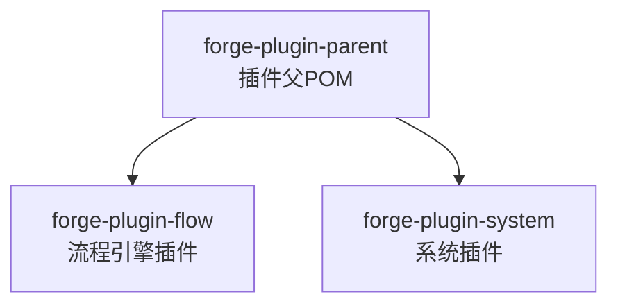
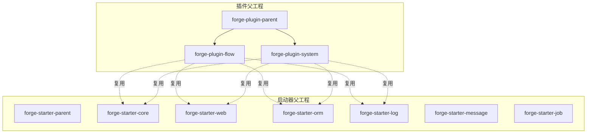
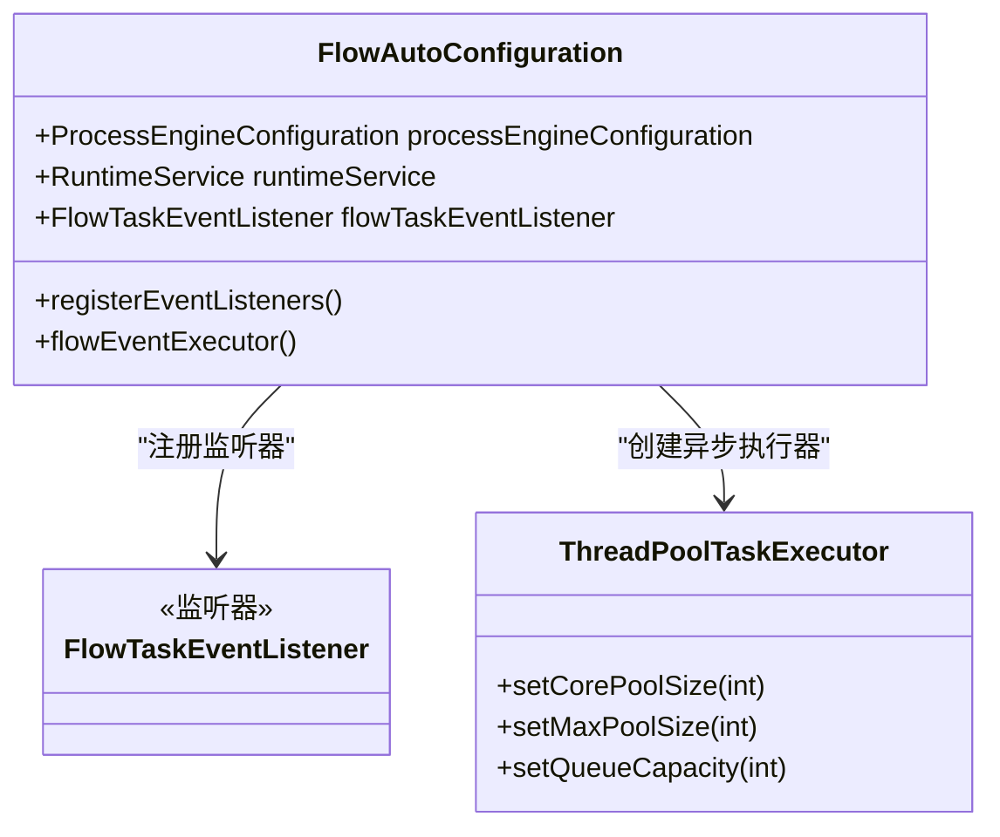
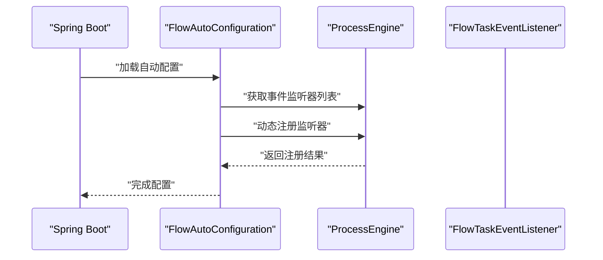

# 插件开发

<cite>
**本文引用的文件**
- [forge/forge-framework/forge-plugin-parent/pom.xml](file://forge/forge-framework/forge-plugin-parent/pom.xml)
- [forge/forge-framework/forge-plugin-parent/forge-plugin-flow/src/main/java/com/mdframe/forge/starter/flow/config/FlowAutoConfiguration.java](file://forge/forge-framework/forge-plugin-parent/forge-plugin-flow/src/main/java/com/mdframe/forge/starter/flow/config/FlowAutoConfiguration.java)
- [forge/forge-framework/forge-plugin-parent/forge-plugin-flow/src/main/resources/META-INF/spring/org.springframework.boot.autoconfigure.AutoConfiguration.imports](file://forge/forge-framework/forge-plugin-parent/forge-plugin-flow/src/main/resources/META-INF/spring/org.springframework.boot.autoconfigure.AutoConfiguration.imports)
- [forge/forge-framework/forge-plugin-parent/forge-plugin-generator/src/main/java/com/mdframe/forge/plugin/generator/config/GeneratorConfig.java](file://forge/forge-framework/forge-plugin-parent/forge-plugin-generator/src/main/java/com/mdframe/forge/plugin/generator/config/GeneratorConfig.java)
- [forge/forge-framework/forge-plugin-parent/forge-plugin-generator/src/main/resources/application.yml](file://forge/forge-framework/forge-plugin-parent/forge-plugin-generator/src/main/resources/application.yml)
- [forge/forge-framework/forge-plugin-parent/forge-plugin-job/src/main/java/com/mdframe/forge/plugin/job/config/JobAutoConfiguration.java](file://forge/forge-framework/forge-plugin-parent/forge-plugin-job/src/main/java/com/mdframe/forge/plugin/job/config/JobAutoConfiguration.java)
- [forge/forge-framework/forge-plugin-parent/forge-plugin-job/src/main/resources/application-job-example.yml](file://forge/forge-framework/forge-plugin-parent/forge-plugin-job/src/main/resources/application-job-example.yml)
- [forge/forge-framework/forge-plugin-parent/forge-plugin-message/src/main/java/com/mdframe/forge/plugin/message/config/MessagePluginConfiguration.java](file://forge/forge-framework/forge-plugin-parent/forge-plugin-message/src/main/java/com/mdframe/forge/plugin/message/config/MessagePluginConfiguration.java)
- [forge/forge-framework/forge-starter-parent/forge-starter-core/pom.xml](file://forge/forge-framework/forge-starter-parent/forge-starter-core/pom.xml)
- [forge/forge-framework/forge-starter-parent/forge-starter-web/pom.xml](file://forge/forge-framework/forge-starter-parent/forge-starter-web/pom.xml)
- [forge/forge-framework/forge-starter-parent/forge-starter-orm/pom.xml](file://forge/forge-framework/forge-starter-parent/forge-starter-orm/pom.xml)
- [forge/forge-framework/forge-starter-parent/forge-starter-log/pom.xml](file://forge/forge-framework/forge-starter-parent/forge-starter-log/pom.xml)
- [forge/forge-framework/forge-starter-parent/forge-starter-message/pom.xml](file://forge/forge-framework/forge-starter-parent/forge-starter-message/pom.xml)
- [forge/forge-framework/forge-starter-parent/forge-starter-job/pom.xml](file://forge/forge-framework/forge-starter-parent/forge-starter-job/pom.xml)
</cite>

## 更新摘要
**所做更改**
- 更新了项目结构部分，反映架构简化后的实际模块组成
- 重构了核心组件分析，重点介绍当前仍保留的flow插件
- 更新了架构总览图，展示新的插件模块关系
- 移除了已移除的generator、job、message插件的相关内容
- 新增了系统插件的详细分析
- 更新了依赖分析，反映当前可用的插件模块

## 目录
1. [引言](#引言)
2. [项目结构](#项目结构)
3. [核心组件](#核心组件)
4. [架构总览](#架构总览)
5. [详细组件分析](#详细组件分析)
6. [依赖分析](#依赖分析)
7. [性能考虑](#性能考虑)
8. [故障排查指南](#故障排查指南)
9. [结论](#结论)
10. [附录](#附录)

## 引言
本指南面向Forge框架的插件开发者，系统阐述插件架构设计原理、生命周期管理、插件间通信机制。经过架构简化后，Forge框架目前主要提供流程引擎插件作为核心功能模块，同时保留系统插件的基础能力。文档将重点介绍当前可用的插件开发范式与标准流程，涵盖插件打包发布、版本管理、依赖处理策略，以及安全机制、权限控制与资源隔离建议。最后给出从简单到复杂业务插件的完整开发示例与调试、性能优化、故障排查方法。

## 项目结构
经过架构简化，Forge插件体系目前主要包含以下模块：
- 流程引擎插件：基于Flowable的流程引擎集成与扩展
- 系统插件：系统级配置、字典、文件、日志等通用能力

**章节来源**
- [forge/forge-framework/forge-plugin-parent/pom.xml:18-24](file://forge/forge-framework/forge-plugin-parent/pom.xml#L18-L24)

## 核心组件
经过架构简化，当前Forge框架的核心插件主要包括：

### 流程引擎插件
- 自动配置类：集成Flowable引擎，配置事件监听器和异步执行器
- 事件监听：动态注册Flowable事件监听器，支持流程事件的异步处理
- 服务集成：提供流程模型、任务、历史等核心服务的封装

### 系统插件
- 系统常量：提供枚举风格的常量定义，便于跨模块共享与约束
- 控制器层：提供系统管理相关的REST接口
- 服务层：实现系统配置、用户管理、角色权限等核心业务逻辑

**章节来源**
- [forge/forge-framework/forge-plugin-parent/forge-plugin-flow/src/main/java/com/mdframe/forge/starter/flow/config/FlowAutoConfiguration.java:46-143](file://forge/forge-framework/forge-plugin-parent/forge-plugin-flow/src/main/java/com/mdframe/forge/starter/flow/config/FlowAutoConfiguration.java#L46-L143)

## 架构总览
下图展示当前Forge插件架构在Spring生态中的装配关系与交互路径，突出"插件父POM"对子模块的聚合，以及各插件内部的分层职责。

**图表来源**
- [forge/forge-framework/forge-plugin-parent/pom.xml:18-24](file://forge/forge-framework/forge-plugin-parent/pom.xml#L18-L24)
- [forge/forge-framework/forge-starter-parent/forge-starter-core/pom.xml](file://forge/forge-framework/forge-starter-parent/forge-starter-core/pom.xml)
- [forge/forge-framework/forge-starter-parent/forge-starter-web/pom.xml](file://forge/forge-framework/forge-starter-parent/forge-starter-web/pom.xml)
- [forge/forge-framework/forge-starter-parent/forge-starter-orm/pom.xml](file://forge/forge-framework/forge-starter-parent/forge-starter-orm/pom.xml)
- [forge/forge-framework/forge-starter-parent/forge-starter-log/pom.xml](file://forge/forge-framework/forge-starter-parent/forge-starter-log/pom.xml)

## 详细组件分析

### 流程引擎插件
- 设计要点
  - 自动配置：通过FlowAutoConfiguration集成Flowable引擎，配置事件监听器
  - 异步处理：提供专用的异步线程池处理流程事件，避免阻塞主流程
  - 安全集成：禁用Spring Security的HTTP Basic认证，将鉴权交给Sa-Token处理
  - 动态注册：在应用启动完成后动态注册事件监听器

- 关键类关系（示意）

**图表来源**
- [forge/forge-framework/forge-plugin-parent/forge-plugin-flow/src/main/java/com/mdframe/forge/starter/flow/config/FlowAutoConfiguration.java:46-143](file://forge/forge-framework/forge-plugin-parent/forge-plugin-flow/src/main/java/com/mdframe/forge/starter/flow/config/FlowAutoConfiguration.java#L46-L143)

- 典型流程（事件监听器注册）

**图表来源**
- [forge/forge-framework/forge-plugin-parent/forge-plugin-flow/src/main/java/com/mdframe/forge/starter/flow/config/FlowAutoConfiguration.java:85-123](file://forge/forge-framework/forge-plugin-parent/forge-plugin-flow/src/main/java/com/mdframe/forge/starter/flow/config/FlowAutoConfiguration.java#L85-L123)

**章节来源**
- [forge/forge-framework/forge-plugin-parent/forge-plugin-flow/src/main/java/com/mdframe/forge/starter/flow/config/FlowAutoConfiguration.java:46-143](file://forge/forge-framework/forge-plugin-parent/forge-plugin-flow/src/main/java/com/mdframe/forge/starter/flow/config/FlowAutoConfiguration.java#L46-L143)
- [forge/forge-framework/forge-plugin-parent/forge-plugin-flow/src/main/resources/META-INF/spring/org.springframework.boot.autoconfigure.AutoConfiguration.imports](file://forge/forge-framework/forge-plugin-parent/forge-plugin-flow/src/main/resources/META-INF/spring/org.springframework.boot.autoconfigure.AutoConfiguration.imports#L1)

### 系统插件
- 设计要点
  - 系统常量：提供枚举风格的常量定义，便于跨模块共享与约束
  - 控制器层：提供系统管理相关的REST接口，包括配置管理、用户管理、角色权限等
  - 服务层：实现系统配置、用户管理、角色权限等核心业务逻辑
  - 数据访问：通过MyBatis-Plus实现数据持久化

**章节来源**
- [forge/forge-framework/forge-plugin-parent/forge-plugin-system/src/main/java/com/mdframe/forge/plugin/system/constant/SystemConstants.java](file://forge/forge-framework/forge-plugin-parent/forge-plugin-system/src/main/java/com/mdframe/forge/plugin/system/constant/SystemConstants.java)

## 依赖分析
经过架构简化，当前Forge插件与启动器的依赖关系如下：

### 流程引擎插件依赖
- 核心依赖：forge-starter-core、forge-starter-web、forge-starter-orm、forge-starter-log
- 流程引擎：Flowable Spring Boot Starter
- 安全集成：Sa-Token权限框架

### 系统插件依赖
- 核心依赖：forge-starter-core、forge-starter-web、forge-starter-orm、forge-starter-log
- 权限框架：Sa-Token
- 数据访问：MyBatis-Plus

**章节来源**
- [forge/forge-framework/forge-starter-parent/forge-starter-core/pom.xml:14-121](file://forge/forge-framework/forge-starter-parent/forge-starter-core/pom.xml#L14-L121)
- [forge/forge-framework/forge-starter-parent/forge-starter-web/pom.xml:14-59](file://forge/forge-framework/forge-starter-parent/forge-starter-web/pom.xml#L14-L59)

## 性能考虑
- 流程引擎
  - 异步处理：使用专用线程池处理流程事件，避免阻塞主流程引擎
  - 监听器管理：动态注册事件监听器，避免重复注册和内存泄漏
  - 安全配置：禁用不必要的安全拦截，减少请求处理开销
- 系统插件
  - 缓存策略：合理使用Redis缓存系统配置和用户信息
  - 数据库优化：通过MyBatis-Plus的分页查询和批量操作提升性能
  - 权限控制：在服务层实现细粒度的权限控制，避免重复计算

## 故障排查指南
- 流程引擎
  - 检查Flowable引擎是否正确初始化
  - 验证事件监听器是否成功注册
  - 查看异步线程池配置是否合理
  - 确认Spring Security配置不会影响内部服务调用
- 系统插件
  - 核对数据库连接配置
  - 检查MyBatis-Plus映射文件是否正确
  - 验证Sa-Token权限配置
  - 查看系统配置是否正确加载

## 结论
经过架构简化，Forge框架目前专注于提供核心的流程引擎能力和系统管理能力。流程引擎插件通过Flowable实现了企业级工作流管理，系统插件提供了完善的系统管理功能。遵循本文提供的接口定义、实现规范、配置管理与注册机制，可快速构建稳定可靠的插件。同时，结合性能优化与故障排查建议，可在生产环境中获得更佳的稳定性与可观测性。

## 附录
- 开发标准流程（示例步骤）
  - 插件接口定义：在service层定义接口，明确输入输出与异常约定
  - 实现类编写：实现接口，注入所需依赖，遵循分层与单一职责
  - 配置文件管理：在resources下提供application.yml与SQL脚本，确保可配置与可迁移
  - 注册机制：通过自动配置类或Spring SPI完成插件装配与注册
  - 测试与验证：编写单元测试与集成测试，覆盖关键路径
- 打包发布与版本管理
  - 使用Maven多模块管理，父POM统一版本与依赖
  - 通过插件POM声明依赖，确保启动器版本与插件版本一致
  - 制定发布流程，包括构建、测试、打包、发布与回滚策略
- 安全机制与资源隔离
  - 权限控制：在控制器与服务层增加鉴权与授权校验
  - 资源隔离：对数据库连接、线程池、缓存等资源进行隔离与限流
  - 输入校验：对所有外部输入进行严格校验与清洗
- 完整开发示例（概念性）
  - Hello World插件：最小化实现，仅包含一个控制器与一个服务接口
  - 业务插件：以流程引擎插件为例，扩展事件监听器、自定义服务和前端界面