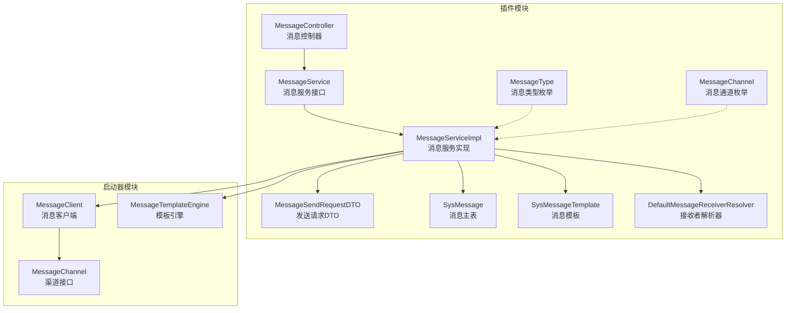
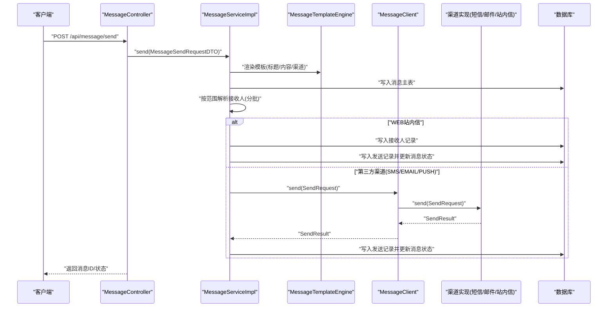
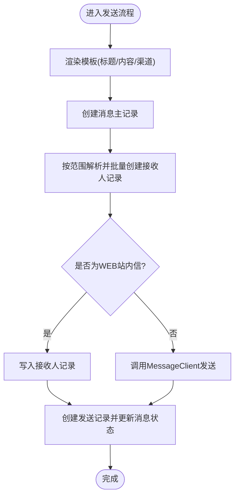
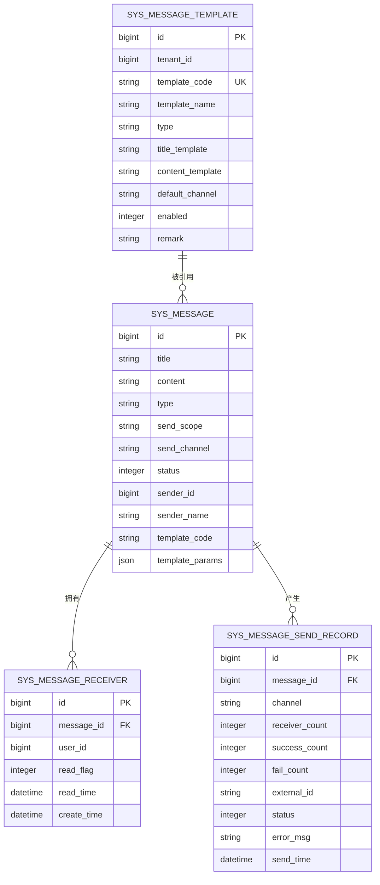
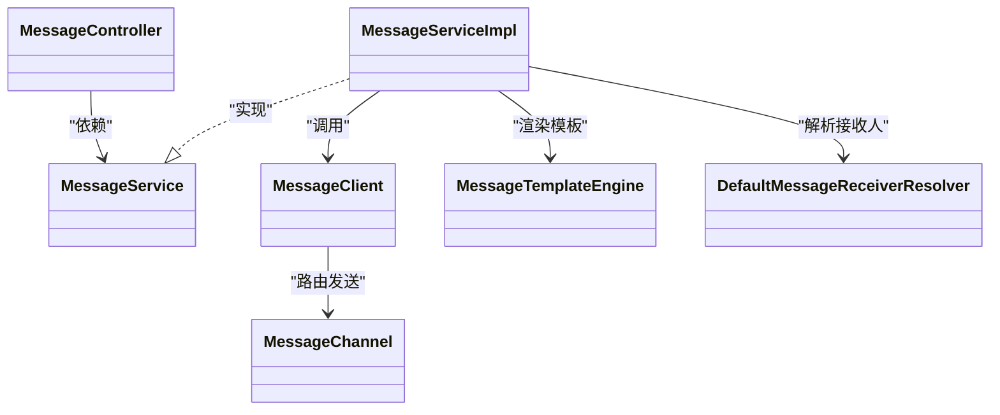

# 消息通知插件开发

<cite>
**本文引用的文件**
- [MessageController.java](file://forge/forge-framework/forge-plugin-parent/forge-plugin-message/src/main/java/com/mdframe/forge/plugin/message/controller/MessageController.java)
- [MessageService.java](file://forge/forge-framework/forge-plugin-parent/forge-plugin-message/src/main/java/com/mdframe/forge/plugin/message/service/MessageService.java)
- [MessageServiceImpl.java](file://forge/forge-framework/forge-plugin-parent/forge-plugin-message/src/main/java/com/mdframe/forge/plugin/message/service/impl/MessageServiceImpl.java)
- [MessageType.java](file://forge/forge-framework/forge-plugin-parent/forge-plugin-message/src/main/java/com/mdframe/forge/plugin/message/domain/MessageType.java)
- [MessageChannel.java](file://forge/forge-framework/forge-plugin-parent/forge-plugin-message/src/main/java/com/mdframe/forge/plugin/message/domain/MessageChannel.java)
- [MessageSendRequestDTO.java](file://forge/forge-framework/forge-plugin-parent/forge-plugin-message/src/main/java/com/mdframe/forge/plugin/message/domain/dto/MessageSendRequestDTO.java)
- [SysMessage.java](file://forge/forge-framework/forge-plugin-parent/forge-plugin-message/src/main/java/com/mdframe/forge/plugin/message/domain/entity/SysMessage.java)
- [SysMessageTemplate.java](file://forge/forge-framework/forge-plugin-parent/forge-plugin-message/src/main/java/com/mdframe/forge/plugin/message/domain/entity/SysMessageTemplate.java)
- [SysMessageTemplateMapper.java](file://forge/forge-framework/forge-plugin-parent/forge-plugin-message/src/main/java/com/mdframe/forge/plugin/message/mapper/SysMessageTemplateMapper.java)
- [DefaultMessageReceiverResolver.java](file://forge/forge-framework/forge-plugin-parent/forge-plugin-message/src/main/java/com/mdframe/forge/plugin/message/service/impl/DefaultMessageReceiverResolver.java)
- [MessageChannel.java](file://forge/forge-framework/forge-starter-parent/forge-starter-message/src/main/java/com/mdframe/forge/starter/message/channel/MessageChannel.java)
- [MessageClient.java](file://forge/forge-framework/forge-starter-parent/forge-starter-message/src/main/java/com/mdframe/forge/starter/message/sdk/MessageClient.java)
- [MessageTemplateEngine.java](file://forge/forge-framework/forge-starter-parent/forge-starter-message/src/main/java/com/mdframe/forge/starter/message/service/MessageTemplateEngine.java)
</cite>

## 目录
1. [简介](#简介)
2. [项目结构](#项目结构)
3. [核心组件](#核心组件)
4. [架构总览](#架构总览)
5. [组件详解](#组件详解)
6. [依赖关系分析](#依赖关系分析)
7. [性能与扩展性](#性能与扩展性)
8. [开发流程与最佳实践](#开发流程与最佳实践)
9. [故障排查指南](#故障排查指南)
10. [结论](#结论)

## 简介
本指南面向在Forge框架上开发“消息通知插件”的工程师，系统讲解消息插件的架构设计与实现要点，覆盖消息控制器、消息服务、消息类型与通道、模板管理、接收者解析、发送策略、多渠道集成、异步与批量处理、重试与状态跟踪、权限与安全控制等主题，并提供可落地的开发流程与最佳实践。

## 项目结构
消息插件位于插件父工程的“forge-plugin-message”模块，同时配合“forge-starter-message”启动器模块提供渠道抽象、客户端与模板引擎能力。核心目录与职责如下：
- 控制层：对外暴露REST接口，负责鉴权、加解密、权限忽略等横切处理
- 业务层：消息发送、接收人解析、状态管理、分页查询、未读统计
- 领域模型：消息、模板、接收人、发送记录等实体与枚举
- 启动器：渠道接口、消息客户端、模板引擎、自动装配配置

图表来源
- [MessageController.java](file://forge/forge-framework/forge-plugin-parent/forge-plugin-message/src/main/java/com/mdframe/forge/plugin/message/controller/MessageController.java#L1-L94)
- [MessageService.java](file://forge/forge-framework/forge-plugin-parent/forge-plugin-message/src/main/java/com/mdframe/forge/plugin/message/service/MessageService.java#L1-L51)
- [MessageServiceImpl.java](file://forge/forge-framework/forge-plugin-parent/forge-plugin-message/src/main/java/com/mdframe/forge/plugin/message/service/impl/MessageServiceImpl.java#L1-L388)
- [MessageSendRequestDTO.java](file://forge/forge-framework/forge-plugin-parent/forge-plugin-message/src/main/java/com/mdframe/forge/plugin/message/domain/dto/MessageSendRequestDTO.java#L1-L64)
- [MessageType.java](file://forge/forge-framework/forge-plugin-parent/forge-plugin-message/src/main/java/com/mdframe/forge/plugin/message/domain/MessageType.java#L1-L39)
- [MessageChannel.java](file://forge/forge-framework/forge-plugin-parent/forge-plugin-message/src/main/java/com/mdframe/forge/plugin/message/domain/MessageChannel.java#L1-L39)
- [SysMessage.java](file://forge/forge-framework/forge-plugin-parent/forge-plugin-message/src/main/java/com/mdframe/forge/plugin/message/domain/entity/SysMessage.java#L1-L76)
- [SysMessageTemplate.java](file://forge/forge-framework/forge-plugin-parent/forge-plugin-message/src/main/java/com/mdframe/forge/plugin/message/domain/entity/SysMessageTemplate.java#L1-L71)
- [DefaultMessageReceiverResolver.java](file://forge/forge-framework/forge-plugin-parent/forge-plugin-message/src/main/java/com/mdframe/forge/plugin/message/service/impl/DefaultMessageReceiverResolver.java#L1-L151)
- [MessageChannel.java](file://forge/forge-framework/forge-starter-parent/forge-starter-message/src/main/java/com/mdframe/forge/starter/message/channel/MessageChannel.java#L1-L41)
- [MessageClient.java](file://forge/forge-framework/forge-starter-parent/forge-starter-message/src/main/java/com/mdframe/forge/starter/message/sdk/MessageClient.java#L1-L56)
- [MessageTemplateEngine.java](file://forge/forge-framework/forge-starter-parent/forge-starter-message/src/main/java/com/mdframe/forge/starter/message/service/MessageTemplateEngine.java#L1-L23)

章节来源
- [MessageController.java](file://forge/forge-framework/forge-plugin-parent/forge-plugin-message/src/main/java/com/mdframe/forge/plugin/message/controller/MessageController.java#L1-L94)
- [MessageServiceImpl.java](file://forge/forge-framework/forge-plugin-parent/forge-plugin-message/src/main/java/com/mdframe/forge/plugin/message/service/impl/MessageServiceImpl.java#L1-L388)

## 核心组件
- 消息控制器（MessageController）：提供发送、分页查询、详情、已读标记、未读统计等REST接口；内置加解密与权限忽略注解，便于前后端交互与简化接入。
- 消息服务（MessageService/MessageServiceImpl）：实现消息发送、接收人批量写入、渠道发送、发送记录与状态更新、分页查询、未读统计、详情查询等。
- 消息类型（MessageType）：定义系统消息、短信、邮件、自定义等类型，用于区分消息语义与默认渠道选择。
- 消息通道（MessageChannel）：定义站内信、短信、邮件、推送等发送渠道，用于路由到不同渠道实现。
- 接收者解析器（DefaultMessageReceiverResolver）：按发送范围（全员、组织、指定人员、租户）分批解析用户ID，避免内存溢出。
- 模板与客户端（SysMessageTemplate、MessageClient、MessageTemplateEngine）：模板管理与渲染、渠道路由与初始化、模板变量替换。

章节来源
- [MessageController.java](file://forge/forge-framework/forge-plugin-parent/forge-plugin-message/src/main/java/com/mdframe/forge/plugin/message/controller/MessageController.java#L1-L94)
- [MessageService.java](file://forge/forge-framework/forge-plugin-parent/forge-plugin-message/src/main/java/com/mdframe/forge/plugin/message/service/MessageService.java#L1-L51)
- [MessageServiceImpl.java](file://forge/forge-framework/forge-plugin-parent/forge-plugin-message/src/main/java/com/mdframe/forge/plugin/message/service/impl/MessageServiceImpl.java#L1-L388)
- [MessageType.java](file://forge/forge-framework/forge-plugin-parent/forge-plugin-message/src/main/java/com/mdframe/forge/plugin/message/domain/MessageType.java#L1-L39)
- [MessageChannel.java](file://forge/forge-framework/forge-plugin-parent/forge-plugin-message/src/main/java/com/mdframe/forge/plugin/message/domain/MessageChannel.java#L1-L39)
- [DefaultMessageReceiverResolver.java](file://forge/forge-framework/forge-plugin-parent/forge-plugin-message/src/main/java/com/mdframe/forge/plugin/message/service/impl/DefaultMessageReceiverResolver.java#L1-L151)
- [SysMessageTemplate.java](file://forge/forge-framework/forge-plugin-parent/forge-plugin-message/src/main/java/com/mdframe/forge/plugin/message/domain/entity/SysMessageTemplate.java#L1-L71)
- [MessageClient.java](file://forge/forge-framework/forge-starter-parent/forge-starter-message/src/main/java/com/mdframe/forge/starter/message/sdk/MessageClient.java#L1-L56)
- [MessageTemplateEngine.java](file://forge/forge-framework/forge-starter-parent/forge-starter-message/src/main/java/com/mdframe/forge/starter/message/service/MessageTemplateEngine.java#L1-L23)

## 架构总览
消息插件采用“控制器-服务-领域模型-启动器渠道”的分层架构，消息发送流程通过模板渲染、接收人解析、渠道发送、记录落库与状态更新形成闭环。

图表来源
- [MessageController.java](file://forge/forge-framework/forge-plugin-parent/forge-plugin-message/src/main/java/com/mdframe/forge/plugin/message/controller/MessageController.java#L36-L39)
- [MessageServiceImpl.java](file://forge/forge-framework/forge-plugin-parent/forge-plugin-message/src/main/java/com/mdframe/forge/plugin/message/service/impl/MessageServiceImpl.java#L72-L89)
- [MessageTemplateEngine.java](file://forge/forge-framework/forge-starter-parent/forge-starter-message/src/main/java/com/mdframe/forge/starter/message/service/MessageTemplateEngine.java#L10-L21)
- [MessageClient.java](file://forge/forge-framework/forge-starter-parent/forge-starter-message/src/main/java/com/mdframe/forge/starter/message/sdk/MessageClient.java#L34-L45)
- [MessageChannel.java](file://forge/forge-framework/forge-starter-parent/forge-starter-message/src/main/java/com/mdframe/forge/starter/message/channel/MessageChannel.java#L22-L40)

## 组件详解

### 消息控制器（MessageController）
- 提供发送、分页查询、详情、已读标记（单条/批量/全部）、未读统计等接口
- 使用加解密注解与权限忽略注解，简化前端交互与调试
- 基于会话上下文获取当前用户ID，确保操作边界

章节来源
- [MessageController.java](file://forge/forge-framework/forge-plugin-parent/forge-plugin-message/src/main/java/com/mdframe/forge/plugin/message/controller/MessageController.java#L1-L94)

### 消息服务（MessageService/MessageServiceImpl）
- 发送流程：模板渲染 → 创建消息主记录 → 批量创建接收人记录 → 渠道发送 → 创建发送记录并更新消息状态
- 已读标记：支持单条、批量、全部标记，避免重复更新
- 分页查询与未读统计：基于接收人表进行聚合，返回用户侧视图
- 详情查询：合并消息主表与接收人表信息

图表来源
- [MessageServiceImpl.java](file://forge/forge-framework/forge-plugin-parent/forge-plugin-message/src/main/java/com/mdframe/forge/plugin/message/service/impl/MessageServiceImpl.java#L72-L89)
- [MessageServiceImpl.java](file://forge/forge-framework/forge-plugin-parent/forge-plugin-message/src/main/java/com/mdframe/forge/plugin/message/service/impl/MessageServiceImpl.java#L181-L202)
- [MessageServiceImpl.java](file://forge/forge-framework/forge-plugin-parent/forge-plugin-message/src/main/java/com/mdframe/forge/plugin/message/service/impl/MessageServiceImpl.java#L207-L225)

章节来源
- [MessageService.java](file://forge/forge-framework/forge-plugin-parent/forge-plugin-message/src/main/java/com/mdframe/forge/plugin/message/service/MessageService.java#L1-L51)
- [MessageServiceImpl.java](file://forge/forge-framework/forge-plugin-parent/forge-plugin-message/src/main/java/com/mdframe/forge/plugin/message/service/impl/MessageServiceImpl.java#L1-L388)

### 消息类型与通道（MessageType/MessageChannel）
- MessageType：系统消息、短信、邮件、自定义，用于消息分类与默认渠道推断
- MessageChannel：站内信、短信、邮件、推送，用于渠道路由与实现选择

章节来源
- [MessageType.java](file://forge/forge-framework/forge-plugin-parent/forge-plugin-message/src/main/java/com/mdframe/forge/plugin/message/domain/MessageType.java#L1-L39)
- [MessageChannel.java](file://forge/forge-framework/forge-plugin-parent/forge-plugin-message/src/main/java/com/mdframe/forge/plugin/message/domain/MessageChannel.java#L1-L39)

### 接收者解析器（DefaultMessageReceiverResolver）
- 支持四种发送范围：全员、组织、指定人员、租户（可叠加）
- 采用分页/分批回调方式，避免一次性加载大量用户导致内存溢出
- 可扩展集成用户与组织服务，按需实现租户维度解析

章节来源
- [DefaultMessageReceiverResolver.java](file://forge/forge-framework/forge-plugin-parent/forge-plugin-message/src/main/java/com/mdframe/forge/plugin/message/service/impl/DefaultMessageReceiverResolver.java#L1-L151)

### 模板与客户端（SysMessageTemplate/MessageClient/MessageTemplateEngine）
- SysMessageTemplate：模板表，支持标题/内容模板、默认渠道、启用状态
- MessageTemplateEngine：简单模板引擎，支持${key}变量替换
- MessageClient：渠道路由与初始化，按配置初始化各渠道Bean，统一发送入口

章节来源
- [SysMessageTemplate.java](file://forge/forge-framework/forge-plugin-parent/forge-plugin-message/src/main/java/com/mdframe/forge/plugin/message/domain/entity/SysMessageTemplate.java#L1-L71)
- [SysMessageTemplateMapper.java](file://forge/forge-framework/forge-plugin-parent/forge-plugin-message/src/main/java/com/mdframe/forge/plugin/message/mapper/SysMessageTemplateMapper.java#L1-L7)
- [MessageTemplateEngine.java](file://forge/forge-framework/forge-starter-parent/forge-starter-message/src/main/java/com/mdframe/forge/starter/message/service/MessageTemplateEngine.java#L1-L23)
- [MessageClient.java](file://forge/forge-framework/forge-starter-parent/forge-starter-message/src/main/java/com/mdframe/forge/starter/message/sdk/MessageClient.java#L1-L56)

### 数据模型

图表来源
- [SysMessage.java](file://forge/forge-framework/forge-plugin-parent/forge-plugin-message/src/main/java/com/mdframe/forge/plugin/message/domain/entity/SysMessage.java#L1-L76)
- [SysMessageTemplate.java](file://forge/forge-framework/forge-plugin-parent/forge-plugin-message/src/main/java/com/mdframe/forge/plugin/message/domain/entity/SysMessageTemplate.java#L1-L71)

## 依赖关系分析
- 控制器依赖消息服务接口
- 服务实现依赖模板引擎、消息客户端、接收者解析器、接收人与发送记录映射
- 客户端依赖渠道接口与配置，按渠道Bean名称路由
- 渠道接口由具体实现（短信/邮件/站内信）提供

图表来源
- [MessageController.java](file://forge/forge-framework/forge-plugin-parent/forge-plugin-message/src/main/java/com/mdframe/forge/plugin/message/controller/MessageController.java#L27-L31)
- [MessageService.java](file://forge/forge-framework/forge-plugin-parent/forge-plugin-message/src/main/java/com/mdframe/forge/plugin/message/service/MessageService.java#L14-L50)
- [MessageServiceImpl.java](file://forge/forge-framework/forge-plugin-parent/forge-plugin-message/src/main/java/com/mdframe/forge/plugin/message/service/impl/MessageServiceImpl.java#L52-L68)
- [MessageClient.java](file://forge/forge-framework/forge-starter-parent/forge-starter-message/src/main/java/com/mdframe/forge/starter/message/sdk/MessageClient.java#L18-L32)
- [MessageChannel.java](file://forge/forge-framework/forge-starter-parent/forge-starter-message/src/main/java/com/mdframe/forge/starter/message/channel/MessageChannel.java#L5-L40)
- [MessageTemplateEngine.java](file://forge/forge-framework/forge-starter-parent/forge-starter-message/src/main/java/com/mdframe/forge/starter/message/service/MessageTemplateEngine.java#L5-L22)
- [DefaultMessageReceiverResolver.java](file://forge/forge-framework/forge-plugin-parent/forge-plugin-message/src/main/java/com/mdframe/forge/plugin/message/service/impl/DefaultMessageReceiverResolver.java#L30-L62)

章节来源
- [MessageServiceImpl.java](file://forge/forge-framework/forge-plugin-parent/forge-plugin-message/src/main/java/com/mdframe/forge/plugin/message/service/impl/MessageServiceImpl.java#L1-L388)
- [MessageClient.java](file://forge/forge-framework/forge-starter-parent/forge-starter-message/src/main/java/com/mdframe/forge/starter/message/sdk/MessageClient.java#L1-L56)

## 性能与扩展性
- 批量处理：接收人解析与写入采用分批回调，避免大列表一次性加载；默认批次大小可按场景调整
- 模板渲染：简单字符串替换，复杂模板可扩展更强大的模板引擎
- 渠道扩展：新增渠道只需实现渠道接口并注册Bean，客户端按名称自动路由
- 异步与重试：当前实现为同步发送；建议在渠道实现中引入异步队列与重试策略，结合发送记录状态回写

章节来源
- [MessageServiceImpl.java](file://forge/forge-framework/forge-plugin-parent/forge-plugin-message/src/main/java/com/mdframe/forge/plugin/message/service/impl/MessageServiceImpl.java#L142-L176)
- [DefaultMessageReceiverResolver.java](file://forge/forge-framework/forge-plugin-parent/forge-plugin-message/src/main/java/com/mdframe/forge/plugin/message/service/impl/DefaultMessageReceiverResolver.java#L44-L62)
- [MessageClient.java](file://forge/forge-framework/forge-starter-parent/forge-starter-message/src/main/java/com/mdframe/forge/starter/message/sdk/MessageClient.java#L47-L54)

## 开发流程与最佳实践

### 消息定义
- 在模板表中定义消息模板，设置标题/内容模板、默认渠道、启用状态
- 在消息类型中明确消息类别，便于前端展示与后端路由

章节来源
- [SysMessageTemplate.java](file://forge/forge-framework/forge-plugin-parent/forge-plugin-message/src/main/java/com/mdframe/forge/plugin/message/domain/entity/SysMessageTemplate.java#L1-L71)
- [MessageType.java](file://forge/forge-framework/forge-plugin-parent/forge-plugin-message/src/main/java/com/mdframe/forge/plugin/message/domain/MessageType.java#L1-L39)

### 模板配置
- 使用模板引擎进行变量替换，模板参数通过请求DTO传入
- 若未显式传入标题/内容，优先从模板中渲染

章节来源
- [MessageTemplateEngine.java](file://forge/forge-framework/forge-starter-parent/forge-starter-message/src/main/java/com/mdframe/forge/starter/message/service/MessageTemplateEngine.java#L10-L21)
- [MessageServiceImpl.java](file://forge/forge-framework/forge-plugin-parent/forge-plugin-message/src/main/java/com/mdframe/forge/plugin/message/service/impl/MessageServiceImpl.java#L94-L119)

### 发送实现
- 通过消息服务发送，内部完成模板渲染、接收人解析、渠道发送与状态更新
- 对于WEB站内信，仅写入接收人记录；对第三方渠道，通过客户端路由至对应实现

章节来源
- [MessageServiceImpl.java](file://forge/forge-framework/forge-plugin-parent/forge-plugin-message/src/main/java/com/mdframe/forge/plugin/message/service/impl/MessageServiceImpl.java#L72-L89)
- [MessageServiceImpl.java](file://forge/forge-framework/forge-plugin-parent/forge-plugin-message/src/main/java/com/mdframe/forge/plugin/message/service/impl/MessageServiceImpl.java#L181-L202)
- [MessageClient.java](file://forge/forge-framework/forge-starter-parent/forge-starter-message/src/main/java/com/mdframe/forge/starter/message/sdk/MessageClient.java#L34-L45)

### 状态跟踪
- 发送记录表记录接收人数、成功/失败数、外部ID、错误信息与发送时间
- 消息主表状态字段用于标识草稿、已发送、发送失败

章节来源
- [MessageServiceImpl.java](file://forge/forge-framework/forge-plugin-parent/forge-plugin-message/src/main/java/com/mdframe/forge/plugin/message/service/impl/MessageServiceImpl.java#L207-L225)
- [SysMessage.java](file://forge/forge-framework/forge-plugin-parent/forge-plugin-message/src/main/java/com/mdframe/forge/plugin/message/domain/entity/SysMessage.java#L50-L54)

### 权限控制、内容过滤与发送限制
- 控制器层使用权限忽略注解简化演示，生产环境应结合业务权限与审计策略
- 内容过滤可通过模板引擎或渠道实现前处理
- 发送限制可在接收者解析阶段按租户/组织/用户维度控制

章节来源
- [MessageController.java](file://forge/forge-framework/forge-plugin-parent/forge-plugin-message/src/main/java/com/mdframe/forge/plugin/message/controller/MessageController.java#L22-L24)

## 故障排查指南
- 模板未生效：检查模板编码是否存在且启用；确认请求未覆盖标题/内容时模板渲染逻辑
- 接收人为空：核对发送范围与筛选条件；检查接收者解析器的分页/回调逻辑
- 渠道发送失败：查看发送记录中的错误信息与外部ID；确认渠道Bean名称与配置正确
- 状态异常：核对消息主表状态与发送记录状态一致性

章节来源
- [MessageServiceImpl.java](file://forge/forge-framework/forge-plugin-parent/forge-plugin-message/src/main/java/com/mdframe/forge/plugin/message/service/impl/MessageServiceImpl.java#L94-L119)
- [MessageServiceImpl.java](file://forge/forge-framework/forge-plugin-parent/forge-plugin-message/src/main/java/com/mdframe/forge/plugin/message/service/impl/MessageServiceImpl.java#L207-L225)
- [MessageClient.java](file://forge/forge-framework/forge-starter-parent/forge-starter-message/src/main/java/com/mdframe/forge/starter/message/sdk/MessageClient.java#L41-L44)

## 结论
本消息通知插件在Forge框架下实现了清晰的分层架构与可扩展的渠道体系，具备模板化、批量处理、状态跟踪与基础安全控制能力。建议在生产环境中进一步完善异步发送、重试与可观测性建设，并结合业务场景细化权限与内容治理策略。