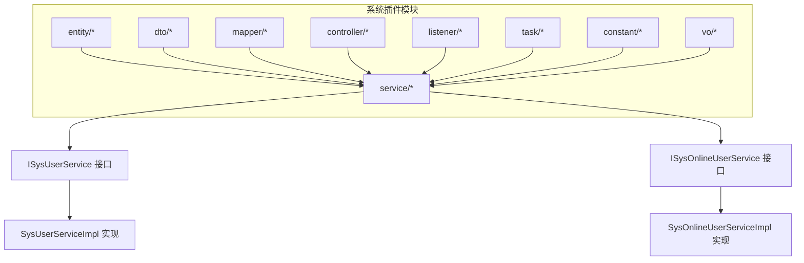
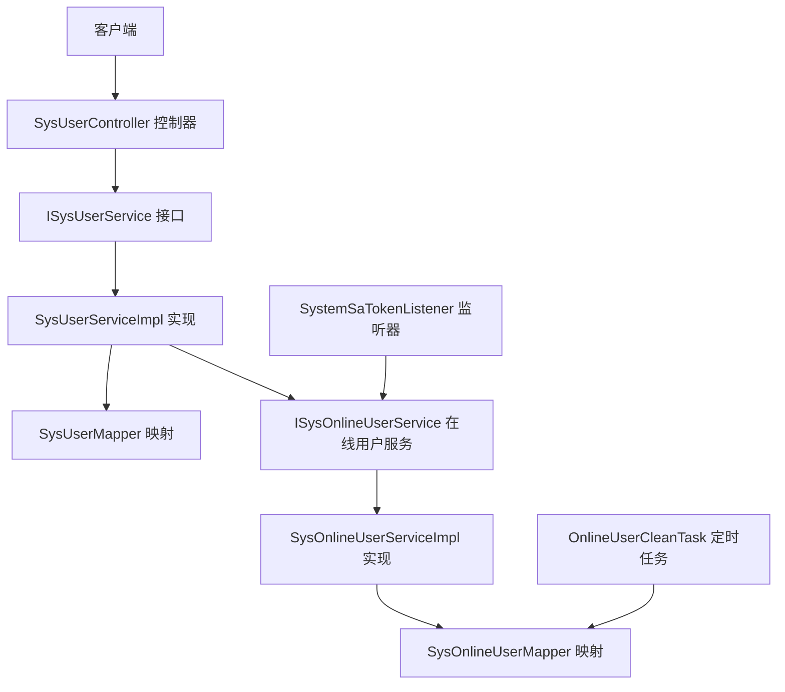
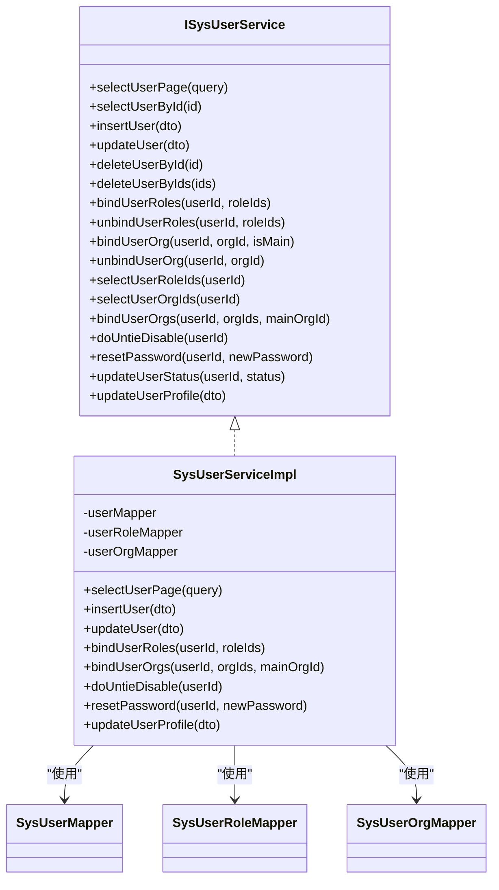
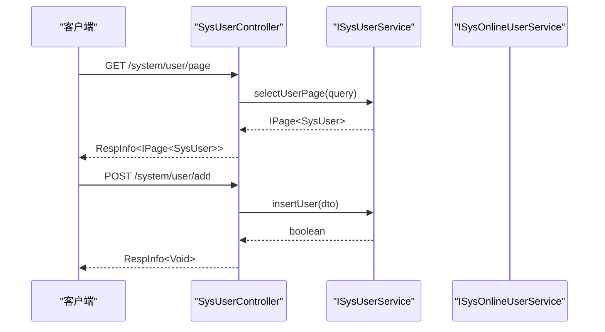
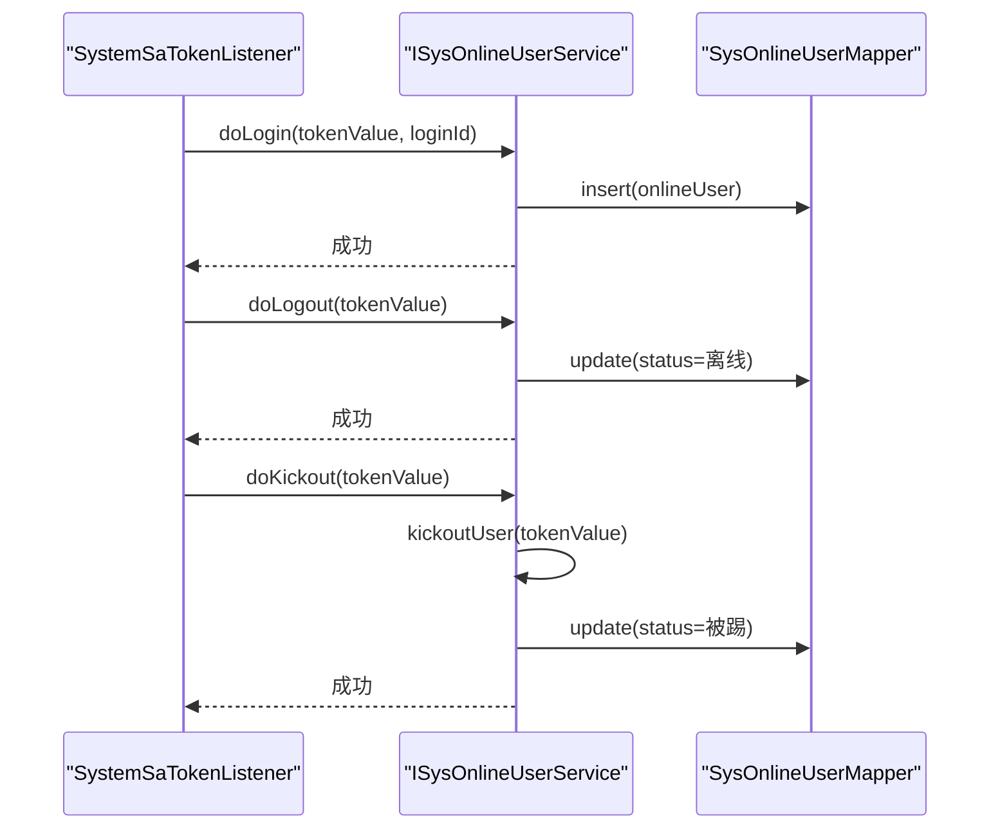
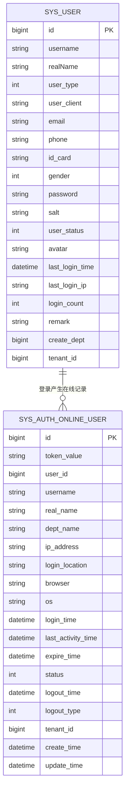
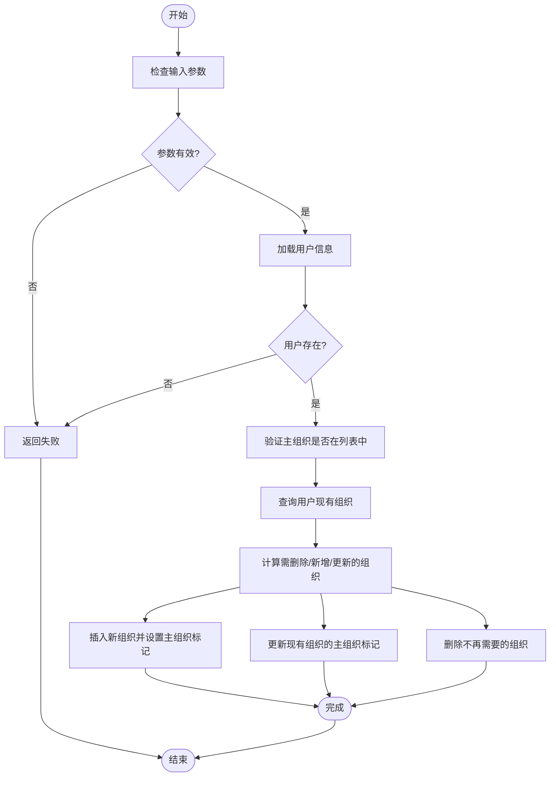
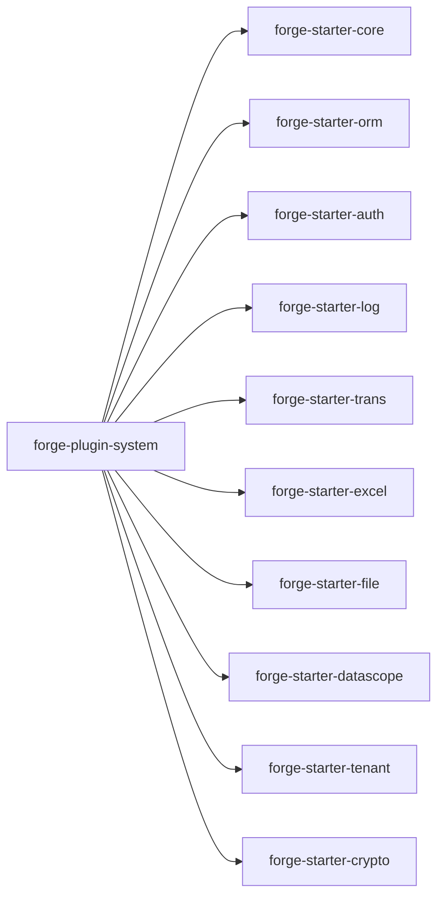

# 系统功能插件开发

<cite>
**本文档引用的文件**
- [ISysUserService.java](file://forge/forge-framework/forge-plugin-parent/forge-plugin-system/src/main/java/com/mdframe/forge/plugin/system/service/ISysUserService.java)
- [SysUserServiceImpl.java](file://forge/forge-framework/forge-plugin-parent/forge-plugin-system/src/main/java/com/mdframe/forge/plugin/system/service/impl/SysUserServiceImpl.java)
- [SysUserController.java](file://forge/forge-framework/forge-plugin-parent/forge-plugin-system/src/main/java/com/mdframe/forge/plugin/system/controller/SysUserController.java)
- [SysUser.java](file://forge/forge-framework/forge-plugin-parent/forge-plugin-system/src/main/java/com/mdframe/forge/plugin/system/entity/SysUser.java)
- [SysUserDTO.java](file://forge/forge-framework/forge-plugin-parent/forge-plugin-system/src/main/java/com/mdframe/forge/plugin/system/dto/SysUserDTO.java)
- [SysUserQuery.java](file://forge/forge-framework/forge-plugin-parent/forge-plugin-system/src/main/java/com/mdframe/forge/plugin/system/dto/SysUserQuery.java)
- [SysUserMapper.java](file://forge/forge-framework/forge-plugin-parent/forge-plugin-system/src/main/java/com/mdframe/forge/plugin/system/mapper/SysUserMapper.java)
- [ISysOnlineUserService.java](file://forge/forge-framework/forge-plugin-parent/forge-plugin-system/src/main/java/com/mdframe/forge/plugin/system/service/ISysOnlineUserService.java)
- [SysOnlineUserServiceImpl.java](file://forge/forge-framework/forge-plugin-parent/forge-plugin-system/src/main/java/com/mdframe/forge/plugin/system/service/impl/SysOnlineUserServiceImpl.java)
- [SysOnlineUser.java](file://forge/forge-framework/forge-plugin-parent/forge-plugin-system/src/main/java/com/mdframe/forge/plugin/system/entity/SysOnlineUser.java)
- [SysOnlineUserMapper.java](file://forge/forge-framework/forge-plugin-parent/forge-plugin-system/src/main/java/com/mdframe/forge/plugin/system/mapper/SysOnlineUserMapper.java)
- [SystemSaTokenListener.java](file://forge/forge-framework/forge-plugin-parent/forge-plugin-system/src/main/java/com/mdframe/forge/plugin/system/listener/SystemSaTokenListener.java)
- [SystemConstants.java](file://forge/forge-framework/forge-plugin-parent/forge-plugin-system/src/main/java/com/mdframe/forge/plugin/system/constant/SystemConstants.java)
- [OnlineUserCleanTask.java](file://forge/forge-framework/forge-plugin-parent/forge-plugin-system/src/main/java/com/mdframe/forge/plugin/system/task/OnlineUserCleanTask.java)
- [UserOrgBindDTO.java](file://forge/forge-framework/forge-plugin-parent/forge-plugin-system/src/main/java/com/mdframe/forge/plugin/system/dto/UserOrgBindDTO.java)
- [forge-plugin-system/pom.xml](file://forge/forge-framework/forge-plugin-parent/forge-plugin-system/pom.xml)
- [forge-plugin-parent/pom.xml](file://forge/forge-framework/forge-plugin-parent/pom.xml)
</cite>

## 目录
1. [简介](#简介)
2. [项目结构](#项目结构)
3. [核心组件](#核心组件)
4. [架构总览](#架构总览)
5. [详细组件分析](#详细组件分析)
6. [依赖关系分析](#依赖关系分析)
7. [性能考虑](#性能考虑)
8. [故障排查指南](#故障排查指南)
9. [结论](#结论)
10. [附录](#附录)

## 简介
本指南面向Forge框架的系统功能插件开发，聚焦用户管理、角色管理、菜单管理、权限控制等核心系统能力的插件化实现。文档围绕以下关键组件展开：ISysUserService用户服务接口、SysUser用户实体、SystemSaTokenListener系统监听器，并给出模块划分、接口定义、实现策略、开发流程、数据访问层设计、事务管理与异常处理机制，以及与框架其他模块的集成方式与依赖管理。

## 项目结构
系统插件位于Forge框架的插件父工程之下，采用按功能域分层的目录组织：
- entity：领域模型，如用户、在线用户等
- dto：数据传输对象，如用户查询、用户绑定等
- mapper：MyBatis映射接口
- service：服务接口与实现
- controller：REST控制器
- listener：系统事件监听器
- task：定时任务
- constant：常量定义
- vo：视图对象

**图表来源**
- [forge-plugin-system/pom.xml](file://forge/forge-framework/forge-plugin-parent/forge-plugin-system/pom.xml#L15-L71)
- [ISysUserService.java](file://forge/forge-framework/forge-plugin-parent/forge-plugin-system/src/main/java/com/mdframe/forge/plugin/system/service/ISysUserService.java#L13-L158)
- [ISysOnlineUserService.java](file://forge/forge-framework/forge-plugin-parent/forge-plugin-system/src/main/java/com/mdframe/forge/plugin/system/service/ISysOnlineUserService.java#L14-L133)

**章节来源**
- [forge-plugin-system/pom.xml](file://forge/forge-framework/forge-plugin-parent/forge-plugin-system/pom.xml#L1-L75)
- [forge-plugin-parent/pom.xml](file://forge/forge-framework/forge-plugin-parent/pom.xml#L1-L25)

## 核心组件
- ISysUserService：用户服务接口，定义用户分页查询、新增/修改/删除、角色与组织绑定、密码重置、状态更新、个人资料更新等方法
- SysUserServiceImpl：用户服务实现，包含业务逻辑、事务控制、权限校验、与在线用户服务联动
- SysUserController：用户管理控制器，提供REST接口，统一返回封装
- SysUser：用户实体，继承多租户基类，包含用户基本信息、状态、登录统计等字段
- SysUserDTO/SysUserQuery：用户数据传输与查询参数对象
- ISysOnlineUserService/SysOnlineUserServiceImpl：在线用户管理接口与实现，基于数据库持久化，支持强制下线、封禁/解封、WebSocket通知
- SystemSaTokenListener：基于Sa-Token的登录/登出/踢出事件监听，维护在线用户记录
- SystemConstants：系统常量定义
- OnlineUserCleanTask：定时清理过期在线用户记录的任务
- UserOrgBindDTO：用户组织批量绑定的数据对象

**章节来源**
- [ISysUserService.java](file://forge/forge-framework/forge-plugin-parent/forge-plugin-system/src/main/java/com/mdframe/forge/plugin/system/service/ISysUserService.java#L13-L158)
- [SysUserServiceImpl.java](file://forge/forge-framework/forge-plugin-parent/forge-plugin-system/src/main/java/com/mdframe/forge/plugin/system/service/impl/SysUserServiceImpl.java#L33-L335)
- [SysUserController.java](file://forge/forge-framework/forge-plugin-parent/forge-plugin-system/src/main/java/com/mdframe/forge/plugin/system/controller/SysUserController.java#L1-L181)
- [SysUser.java](file://forge/forge-framework/forge-plugin-parent/forge-plugin-system/src/main/java/com/mdframe/forge/plugin/system/entity/SysUser.java#L1-L114)
- [SysUserDTO.java](file://forge/forge-framework/forge-plugin-parent/forge-plugin-system/src/main/java/com/mdframe/forge/plugin/system/dto/SysUserDTO.java#L1-L90)
- [SysUserQuery.java](file://forge/forge-framework/forge-plugin-parent/forge-plugin-system/src/main/java/com/mdframe/forge/plugin/system/dto/SysUserQuery.java#L1-L51)
- [ISysOnlineUserService.java](file://forge/forge-framework/forge-plugin-parent/forge-plugin-system/src/main/java/com/mdframe/forge/plugin/system/service/ISysOnlineUserService.java#L14-L133)
- [SysOnlineUserServiceImpl.java](file://forge/forge-framework/forge-plugin-parent/forge-plugin-system/src/main/java/com/mdframe/forge/plugin/system/service/impl/SysOnlineUserServiceImpl.java#L41-L446)
- [SystemSaTokenListener.java](file://forge/forge-framework/forge-plugin-parent/forge-plugin-system/src/main/java/com/mdframe/forge/plugin/system/listener/SystemSaTokenListener.java#L1-L57)
- [SystemConstants.java](file://forge/forge-framework/forge-plugin-parent/forge-plugin-system/src/main/java/com/mdframe/forge/plugin/system/constant/SystemConstants.java#L1-L15)
- [OnlineUserCleanTask.java](file://forge/forge-framework/forge-plugin-parent/forge-plugin-system/src/main/java/com/mdframe/forge/plugin/system/task/OnlineUserCleanTask.java#L1-L40)
- [UserOrgBindDTO.java](file://forge/forge-framework/forge-plugin-parent/forge-plugin-system/src/main/java/com/mdframe/forge/plugin/system/dto/UserOrgBindDTO.java#L1-L23)

## 架构总览
系统插件采用分层架构：控制器层负责HTTP请求与响应封装；服务层承载业务规则与事务控制；数据访问层通过MyBatis实现；监听器与定时任务作为横切关注点参与系统行为。

**图表来源**
- [SysUserController.java](file://forge/forge-framework/forge-plugin-parent/forge-plugin-system/src/main/java/com/mdframe/forge/plugin/system/controller/SysUserController.java#L21-L27)
- [ISysUserService.java](file://forge/forge-framework/forge-plugin-parent/forge-plugin-system/src/main/java/com/mdframe/forge/plugin/system/service/ISysUserService.java#L13-L158)
- [SysUserServiceImpl.java](file://forge/forge-framework/forge-plugin-parent/forge-plugin-system/src/main/java/com/mdframe/forge/plugin/system/service/impl/SysUserServiceImpl.java#L33-L335)
- [SysUserMapper.java](file://forge/forge-framework/forge-plugin-parent/forge-plugin-system/src/main/java/com/mdframe/forge/plugin/system/mapper/SysUserMapper.java#L1-L14)
- [ISysOnlineUserService.java](file://forge/forge-framework/forge-plugin-parent/forge-plugin-system/src/main/java/com/mdframe/forge/plugin/system/service/ISysOnlineUserService.java#L14-L133)
- [SysOnlineUserServiceImpl.java](file://forge/forge-framework/forge-plugin-parent/forge-plugin-system/src/main/java/com/mdframe/forge/plugin/system/service/impl/SysOnlineUserServiceImpl.java#L41-L446)
- [SysOnlineUserMapper.java](file://forge/forge-framework/forge-plugin-parent/forge-plugin-system/src/main/java/com/mdframe/forge/plugin/system/mapper/SysOnlineUserMapper.java#L14-L36)
- [SystemSaTokenListener.java](file://forge/forge-framework/forge-plugin-parent/forge-plugin-system/src/main/java/com/mdframe/forge/plugin/system/listener/SystemSaTokenListener.java#L19-L57)
- [OnlineUserCleanTask.java](file://forge/forge-framework/forge-plugin-parent/forge-plugin-system/src/main/java/com/mdframe/forge/plugin/system/task/OnlineUserCleanTask.java#L16-L39)

## 详细组件分析

### 用户服务接口与实现
- 接口职责：定义用户全量CRUD、分页查询、角色/组织绑定、密码重置、状态变更、个人资料更新等方法
- 实现要点：
  - 使用MyBatis-Plus分页查询，支持多条件动态拼装
  - 事务注解保证角色/组织绑定的原子性
  - 权限溢出校验：非管理员不可分配自身未拥有的角色
  - 与在线用户服务联动：登录成功后记录在线用户，解封时同步更新状态
  - 密码重置使用加密工具进行加盐加密

**图表来源**
- [ISysUserService.java](file://forge/forge-framework/forge-plugin-parent/forge-plugin-system/src/main/java/com/mdframe/forge/plugin/system/service/ISysUserService.java#L13-L158)
- [SysUserServiceImpl.java](file://forge/forge-framework/forge-plugin-parent/forge-plugin-system/src/main/java/com/mdframe/forge/plugin/system/service/impl/SysUserServiceImpl.java#L33-L335)
- [SysUserMapper.java](file://forge/forge-framework/forge-plugin-parent/forge-plugin-system/src/main/java/com/mdframe/forge/plugin/system/mapper/SysUserMapper.java#L1-L14)

**章节来源**
- [ISysUserService.java](file://forge/forge-framework/forge-plugin-parent/forge-plugin-system/src/main/java/com/mdframe/forge/plugin/system/service/ISysUserService.java#L13-L158)
- [SysUserServiceImpl.java](file://forge/forge-framework/forge-plugin-parent/forge-plugin-system/src/main/java/com/mdframe/forge/plugin/system/service/impl/SysUserServiceImpl.java#L33-L335)

### 用户控制器与API流程
- 控制器提供REST接口：分页查询、详情查询、新增/编辑/删除、角色/组织绑定、密码重置、状态更新、个人资料更新等
- 统一返回封装RespInfo，简化前端处理
- 加密/解密注解用于API数据安全

**图表来源**
- [SysUserController.java](file://forge/forge-framework/forge-plugin-parent/forge-plugin-system/src/main/java/com/mdframe/forge/plugin/system/controller/SysUserController.java#L31-L56)
- [ISysUserService.java](file://forge/forge-framework/forge-plugin-parent/forge-plugin-system/src/main/java/com/mdframe/forge/plugin/system/service/ISysUserService.java#L15-L21)

**章节来源**
- [SysUserController.java](file://forge/forge-framework/forge-plugin-parent/forge-plugin-system/src/main/java/com/mdframe/forge/plugin/system/controller/SysUserController.java#L1-L181)

### 在线用户服务与监听器
- 在线用户服务：基于数据库持久化，提供在线用户增删改查、强制下线、封禁/解封、WebSocket通知、按用户获取Token等能力
- 监听器：在登录、登出、踢出事件发生时，维护在线用户记录并推送消息
- 定时任务：定期清理过期在线用户记录

**图表来源**
- [SystemSaTokenListener.java](file://forge/forge-framework/forge-plugin-parent/forge-plugin-system/src/main/java/com/mdframe/forge/plugin/system/listener/SystemSaTokenListener.java#L32-L54)
- [ISysOnlineUserService.java](file://forge/forge-framework/forge-plugin-parent/forge-plugin-system/src/main/java/com/mdframe/forge/plugin/system/service/ISysOnlineUserService.java#L22-L29)
- [SysOnlineUserMapper.java](file://forge/forge-framework/forge-plugin-parent/forge-plugin-system/src/main/java/com/mdframe/forge/plugin/system/mapper/SysOnlineUserMapper.java#L24-L26)

**章节来源**
- [ISysOnlineUserService.java](file://forge/forge-framework/forge-plugin-parent/forge-plugin-system/src/main/java/com/mdframe/forge/plugin/system/service/ISysOnlineUserService.java#L14-L133)
- [SysOnlineUserServiceImpl.java](file://forge/forge-framework/forge-plugin-parent/forge-plugin-system/src/main/java/com/mdframe/forge/plugin/system/service/impl/SysOnlineUserServiceImpl.java#L51-L136)
- [SystemSaTokenListener.java](file://forge/forge-framework/forge-plugin-parent/forge-plugin-system/src/main/java/com/mdframe/forge/plugin/system/listener/SystemSaTokenListener.java#L1-L57)
- [OnlineUserCleanTask.java](file://forge/forge-framework/forge-plugin-parent/forge-plugin-system/src/main/java/com/mdframe/forge/plugin/system/task/OnlineUserCleanTask.java#L26-L38)

### 数据模型与关系
用户实体与在线用户实体具备清晰的字段定义，支持多租户场景下的用户管理与在线会话追踪。

**图表来源**
- [SysUser.java](file://forge/forge-framework/forge-plugin-parent/forge-plugin-system/src/main/java/com/mdframe/forge/plugin/system/entity/SysUser.java#L18-L113)
- [SysOnlineUser.java](file://forge/forge-framework/forge-plugin-parent/forge-plugin-system/src/main/java/com/mdframe/forge/plugin/system/entity/SysOnlineUser.java#L19-L125)

**章节来源**
- [SysUser.java](file://forge/forge-framework/forge-plugin-parent/forge-plugin-system/src/main/java/com/mdframe/forge/plugin/system/entity/SysUser.java#L1-L114)
- [SysOnlineUser.java](file://forge/forge-framework/forge-plugin-parent/forge-plugin-system/src/main/java/com/mdframe/forge/plugin/system/entity/SysOnlineUser.java#L1-L127)

### 组织绑定与权限校验流程
用户组织批量绑定涉及去重、主组织切换、权限校验等逻辑，确保数据一致性与安全性。

**图表来源**
- [SysUserServiceImpl.java](file://forge/forge-framework/forge-plugin-parent/forge-plugin-system/src/main/java/com/mdframe/forge/plugin/system/service/impl/SysUserServiceImpl.java#L232-L294)

**章节来源**
- [SysUserServiceImpl.java](file://forge/forge-framework/forge-plugin-parent/forge-plugin-system/src/main/java/com/mdframe/forge/plugin/system/service/impl/SysUserServiceImpl.java#L231-L294)

## 依赖关系分析
系统插件依赖多个Forge Starter模块，形成完整的能力栈：
- forge-starter-core：基础能力与响应封装
- forge-starter-orm：MyBatis-Plus ORM支撑
- forge-starter-auth：认证鉴权（Sa-Token）
- forge-starter-log：日志能力
- forge-starter-trans：事务管理
- forge-starter-excel：Excel导出
- forge-starter-file：文件存储
- forge-starter-datascope：数据范围控制
- forge-starter-tenant：多租户
- forge-starter-crypto：加解密

**图表来源**
- [forge-plugin-system/pom.xml](file://forge/forge-framework/forge-plugin-parent/forge-plugin-system/pom.xml#L15-L71)

**章节来源**
- [forge-plugin-system/pom.xml](file://forge/forge-framework/forge-plugin-parent/forge-plugin-system/pom.xml#L1-L75)

## 性能考虑
- 分页查询：使用MyBatis-Plus分页，避免一次性加载大量数据
- 动态条件：按需拼装查询条件，减少无效筛选
- 事务边界：将批量写入与权限校验置于单个事务中，降低并发风险
- 定时清理：通过定时任务清理过期在线用户，避免表膨胀
- 缓存策略：结合框架缓存能力对热点数据进行缓存（如字典、配置等）

## 故障排查指南
- 登录/登出异常：检查SystemSaTokenListener是否正确注入ISysOnlineUserService，确认在线用户记录插入/更新逻辑
- 强制下线失败：确认WebSocket消息推送服务可用，核对通知主题与前端订阅
- 组织绑定异常：检查用户是否存在、主组织是否在列表中、是否触发权限溢出校验
- 密码重置失败：确认密码加密逻辑与加密工具配置一致
- 定时任务未执行：检查Spring调度注解启用与任务方法可见性

**章节来源**
- [SystemSaTokenListener.java](file://forge/forge-framework/forge-plugin-parent/forge-plugin-system/src/main/java/com/mdframe/forge/plugin/system/listener/SystemSaTokenListener.java#L32-L54)
- [SysOnlineUserServiceImpl.java](file://forge/forge-framework/forge-plugin-parent/forge-plugin-system/src/main/java/com/mdframe/forge/plugin/system/service/impl/SysOnlineUserServiceImpl.java#L210-L235)
- [SysUserServiceImpl.java](file://forge/forge-framework/forge-plugin-parent/forge-plugin-system/src/main/java/com/mdframe/forge/plugin/system/service/impl/SysUserServiceImpl.java#L87-L132)
- [OnlineUserCleanTask.java](file://forge/forge-framework/forge-plugin-parent/forge-plugin-system/src/main/java/com/mdframe/forge/plugin/system/task/OnlineUserCleanTask.java#L26-L38)

## 结论
系统功能插件通过清晰的分层设计与完善的横切能力，实现了用户、在线会话、权限控制等核心系统能力的插件化。依托Forge框架的Starter体系，开发者可以快速扩展与定制系统功能，同时保持良好的可维护性与可扩展性。

## 附录

### 开发流程建议
- 功能模块设计：明确用户、角色、组织、权限等模块边界与交互
- 接口定义：先定义服务接口与DTO，再实现具体逻辑
- 服务实现：遵循单一职责，合理拆分事务边界，加入必要的权限校验
- 控制器开发：统一返回封装，开启必要的加解密注解
- 数据访问层：使用MyBatis-Plus，注意分页与动态条件
- 事务管理：对写操作与批量操作使用@Transactional
- 异常处理：区分业务异常与系统异常，统一异常处理策略
- 集成与测试：与认证、日志、定时任务等模块协同测试

### 关键接口与实体路径参考
- 用户服务接口：[ISysUserService.java](file://forge/forge-framework/forge-plugin-parent/forge-plugin-system/src/main/java/com/mdframe/forge/plugin/system/service/ISysUserService.java#L13-L158)
- 用户服务实现：[SysUserServiceImpl.java](file://forge/forge-framework/forge-plugin-parent/forge-plugin-system/src/main/java/com/mdframe/forge/plugin/system/service/impl/SysUserServiceImpl.java#L33-L335)
- 用户控制器：[SysUserController.java](file://forge/forge-framework/forge-plugin-parent/forge-plugin-system/src/main/java/com/mdframe/forge/plugin/system/controller/SysUserController.java#L1-L181)
- 用户实体：[SysUser.java](file://forge/forge-framework/forge-plugin-parent/forge-plugin-system/src/main/java/com/mdframe/forge/plugin/system/entity/SysUser.java#L1-L114)
- 在线用户服务接口：[ISysOnlineUserService.java](file://forge/forge-framework/forge-plugin-parent/forge-plugin-system/src/main/java/com/mdframe/forge/plugin/system/service/ISysOnlineUserService.java#L14-L133)
- 在线用户服务实现：[SysOnlineUserServiceImpl.java](file://forge/forge-framework/forge-plugin-parent/forge-plugin-system/src/main/java/com/mdframe/forge/plugin/system/service/impl/SysOnlineUserServiceImpl.java#L41-L446)
- 监听器：[SystemSaTokenListener.java](file://forge/forge-framework/forge-plugin-parent/forge-plugin-system/src/main/java/com/mdframe/forge/plugin/system/listener/SystemSaTokenListener.java#L1-L57)
- 定时任务：[OnlineUserCleanTask.java](file://forge/forge-framework/forge-plugin-parent/forge-plugin-system/src/main/java/com/mdframe/forge/plugin/system/task/OnlineUserCleanTask.java#L1-L40)