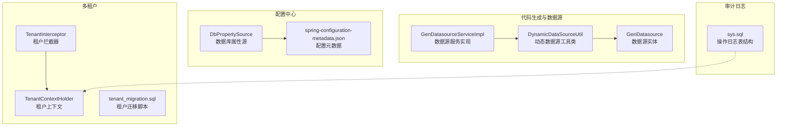
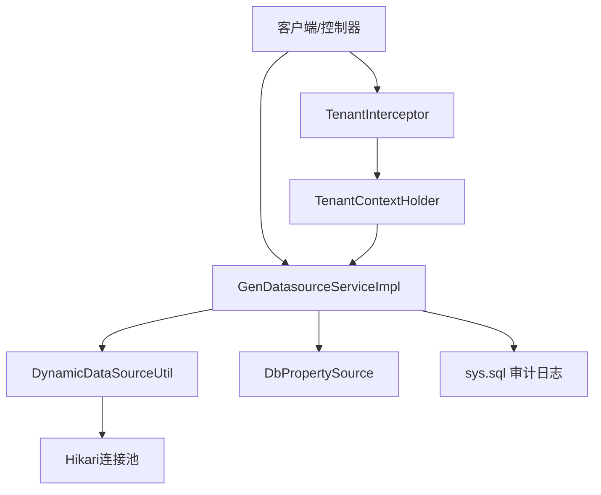
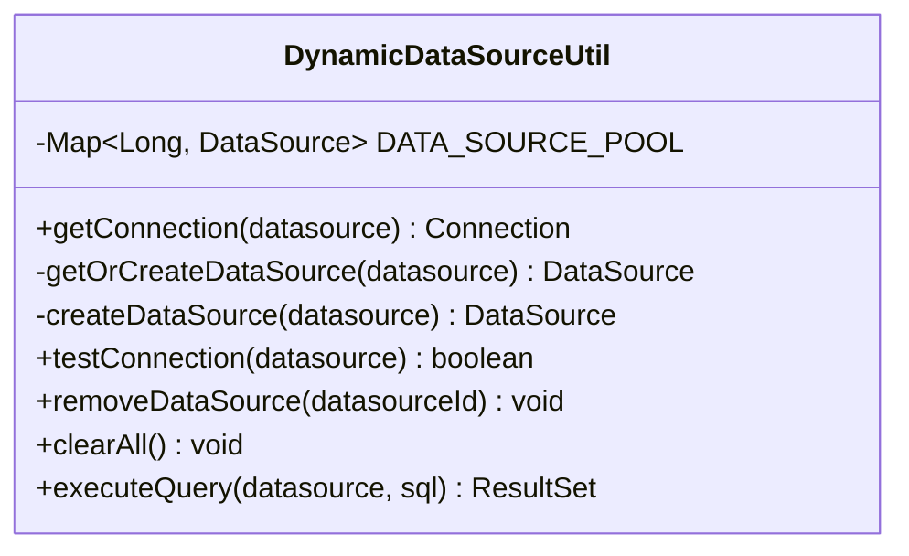
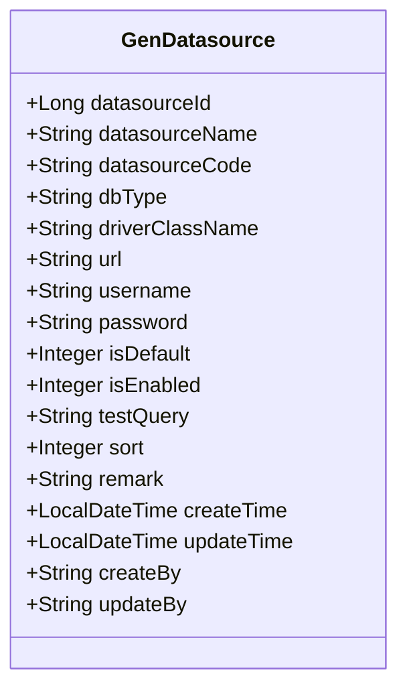
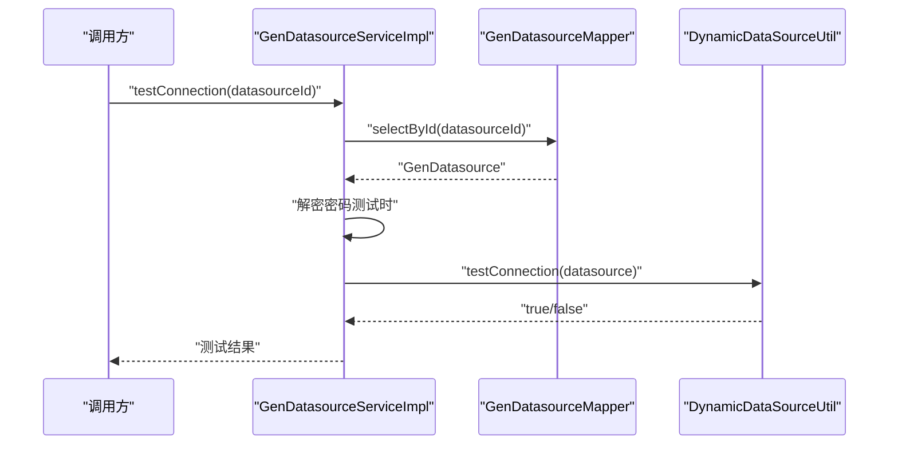
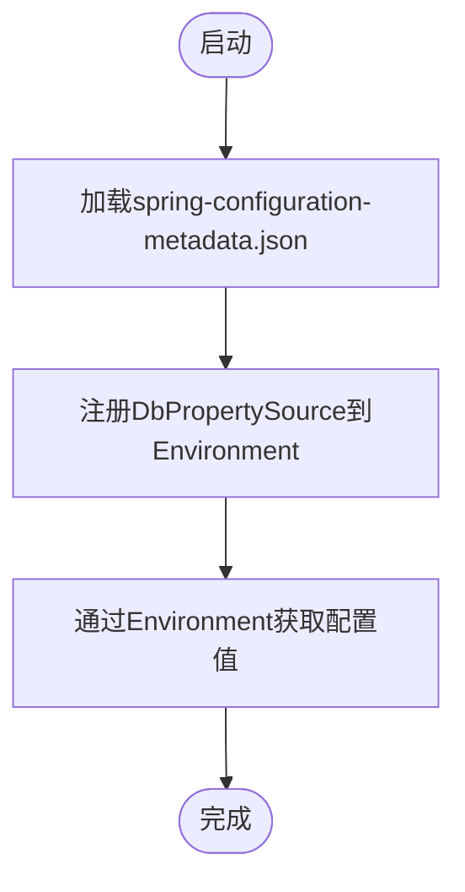
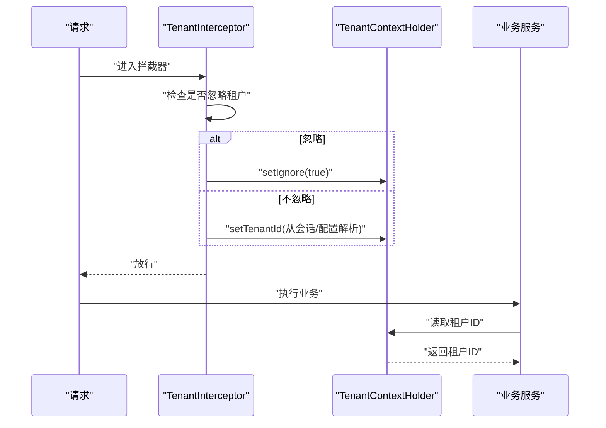
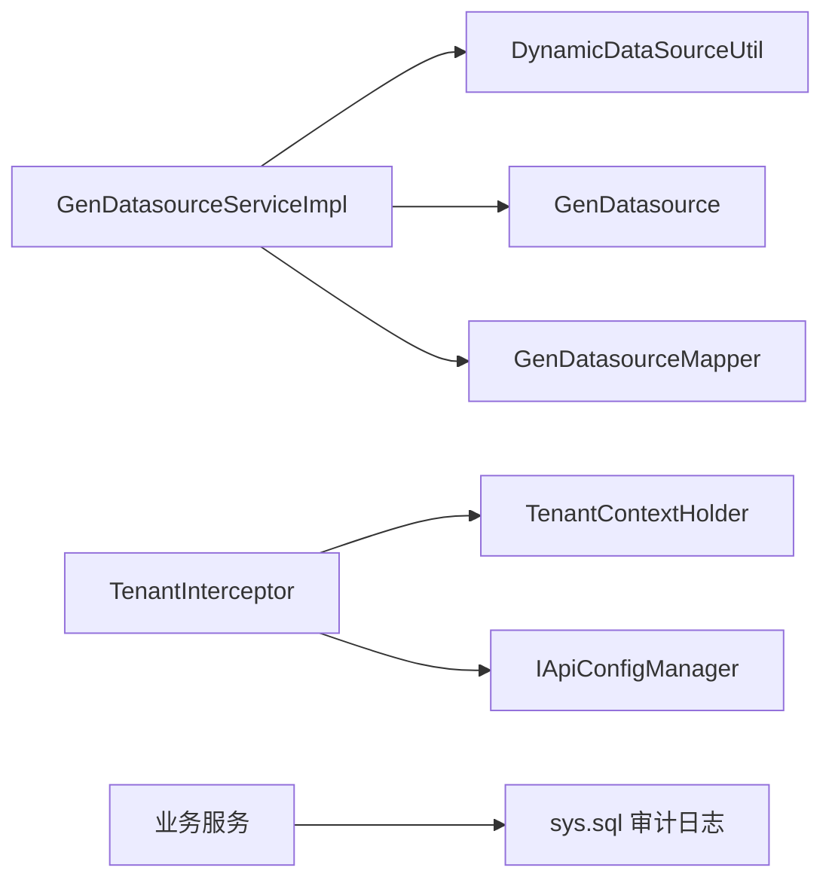

# 数据源适配器开发

<cite>
**本文引用的文件**
- [DynamicDataSourceUtil.java](file://forge/forge-framework/forge-plugin-parent/forge-plugin-generator/src/main/java/com/mdframe/forge/plugin/generator/util/DynamicDataSourceUtil.java)
- [GenDatasource.java](file://forge/forge-framework/forge-plugin-parent/forge-plugin-generator/src/main/java/com/mdframe/forge/plugin/generator/domain/entity/GenDatasource.java)
- [GenDatasourceServiceImpl.java](file://forge/forge-framework/forge-plugin-parent/forge-plugin-generator/src/main/java/com/mdframe/forge/plugin/generator/service/impl/GenDatasourceServiceImpl.java)
- [DbPropertySource.java](file://forge/forge-framework/forge-starter-parent/forge-starter-config/src/main/java/com/mdframe/forge/starter/property/DbPropertySource.java)
- [TenantContextHolder.java](file://forge/forge-framework/forge-starter-parent/forge-starter-tenant/src/main/java/com/mdframe/forge/starter/tenant/context/TenantContextHolder.java)
- [TenantInterceptor.java](file://forge/forge-framework/forge-starter-parent/forge-starter-tenant/src/main/java/com/mdframe/forge/starter/tenant/interceptor/TenantInterceptor.java)
- [tenant_migration.sql](file://forge/forge-framework/forge-starter-parent/forge-starter-tenant/src/main/resources/sql/tenant_migration.sql)
- [sys.sql](file://forge/forge-admin/sql/sys.sql)
- [spring-configuration-metadata.json](file://forge/forge-framework/forge-starter-parent/forge-starter-config/target/classes/META-INF/spring-configuration-metadata.json)
</cite>

## 目录
1. [简介](#简介)
2. [项目结构](#项目结构)
3. [核心组件](#核心组件)
4. [架构总览](#架构总览)
5. [详细组件分析](#详细组件分析)
6. [依赖关系分析](#依赖关系分析)
7. [性能考虑](#性能考虑)
8. [故障排查指南](#故障排查指南)
9. [结论](#结论)
10. [附录](#附录)

## 简介
本指南面向Forge框架的数据源适配器开发，围绕多数据源适配、动态数据源切换、读写分离、分库分表、连接池管理、事务处理、健康检查与故障转移、负载均衡、数据权限控制、多租户隔离、审计日志、性能优化与监控告警等企业级能力，提供从架构到实现的完整技术路径。文档以仓库现有实现为基础，结合可扩展点给出最佳实践与落地建议。

## 项目结构
Forge框架采用“父工程+多子模块”的组织方式，数据源相关能力主要分布在以下模块：
- 代码生成与数据源：forge-plugin-generator 提供GenDatasource实体、动态数据源工具类与服务实现
- 配置中心：forge-starter-config 提供基于数据库的属性源与配置元数据
- 多租户：forge-starter-tenant 提供租户上下文、拦截器与迁移脚本
- 审计日志：forge-admin 提供操作日志表结构定义

**图表来源**
- [DynamicDataSourceUtil.java](file://forge/forge-framework/forge-plugin-parent/forge-plugin-generator/src/main/java/com/mdframe/forge/plugin/generator/util/DynamicDataSourceUtil.java#L1-L113)
- [GenDatasource.java](file://forge/forge-framework/forge-plugin-parent/forge-plugin-generator/src/main/java/com/mdframe/forge/plugin/generator/domain/entity/GenDatasource.java#L1-L104)
- [GenDatasourceServiceImpl.java](file://forge/forge-framework/forge-plugin-parent/forge-plugin-generator/src/main/java/com/mdframe/forge/plugin/generator/service/impl/GenDatasourceServiceImpl.java#L39-L75)
- [DbPropertySource.java](file://forge/forge-framework/forge-starter-parent/forge-starter-config/src/main/java/com/mdframe/forge/starter/property/DbPropertySource.java#L1-L33)
- [spring-configuration-metadata.json](file://forge/forge-framework/forge-starter-parent/forge-starter-config/target/classes/META-INF/spring-configuration-metadata.json#L37-L55)
- [TenantContextHolder.java](file://forge/forge-framework/forge-starter-parent/forge-starter-tenant/src/main/java/com/mdframe/forge/starter/tenant/context/TenantContextHolder.java#L1-L147)
- [TenantInterceptor.java](file://forge/forge-framework/forge-starter-parent/forge-starter-tenant/src/main/java/com/mdframe/forge/starter/tenant/interceptor/TenantInterceptor.java#L18-L46)
- [tenant_migration.sql](file://forge/forge-framework/forge-starter-parent/forge-starter-tenant/src/main/resources/sql/tenant_migration.sql#L93-L106)
- [sys.sql](file://forge/forge-admin/sql/sys.sql#L300-L311)

**章节来源**
- [DynamicDataSourceUtil.java](file://forge/forge-framework/forge-plugin-parent/forge-plugin-generator/src/main/java/com/mdframe/forge/plugin/generator/util/DynamicDataSourceUtil.java#L1-L113)
- [GenDatasource.java](file://forge/forge-framework/forge-plugin-parent/forge-plugin-generator/src/main/java/com/mdframe/forge/plugin/generator/domain/entity/GenDatasource.java#L1-L104)
- [GenDatasourceServiceImpl.java](file://forge/forge-framework/forge-plugin-parent/forge-plugin-generator/src/main/java/com/mdframe/forge/plugin/generator/service/impl/GenDatasourceServiceImpl.java#L39-L75)
- [DbPropertySource.java](file://forge/forge-framework/forge-starter-parent/forge-starter-config/src/main/java/com/mdframe/forge/starter/property/DbPropertySource.java#L1-L33)
- [spring-configuration-metadata.json](file://forge/forge-framework/forge-starter-parent/forge-starter-config/target/classes/META-INF/spring-configuration-metadata.json#L37-L55)
- [TenantContextHolder.java](file://forge/forge-framework/forge-starter-parent/forge-starter-tenant/src/main/java/com/mdframe/forge/starter/tenant/context/TenantContextHolder.java#L1-L147)
- [TenantInterceptor.java](file://forge/forge-framework/forge-starter-parent/forge-starter-tenant/src/main/java/com/mdframe/forge/starter/tenant/interceptor/TenantInterceptor.java#L18-L46)
- [tenant_migration.sql](file://forge/forge-framework/forge-starter-parent/forge-starter-tenant/src/main/resources/sql/tenant_migration.sql#L93-L106)
- [sys.sql](file://forge/forge-admin/sql/sys.sql#L300-L311)

## 核心组件
- 动态数据源工具类：提供数据源连接获取、连接池创建与复用、连接测试、移除与清空等能力
- 数据源实体：封装数据源配置信息（驱动、URL、用户名、密码、测试SQL等）
- 数据源服务实现：负责数据源保存/更新（含密码加解密）、连接测试、数据库表枚举等
- 数据库属性源：将数据库中的配置注入到Spring Environment，支持配置刷新
- 租户上下文与拦截器：提供多租户隔离与忽略策略
- 审计日志表：记录操作日志，支撑审计与合规

**章节来源**
- [DynamicDataSourceUtil.java](file://forge/forge-framework/forge-plugin-parent/forge-plugin-generator/src/main/java/com/mdframe/forge/plugin/generator/util/DynamicDataSourceUtil.java#L1-L113)
- [GenDatasource.java](file://forge/forge-framework/forge-plugin-parent/forge-plugin-generator/src/main/java/com/mdframe/forge/plugin/generator/domain/entity/GenDatasource.java#L1-L104)
- [GenDatasourceServiceImpl.java](file://forge/forge-framework/forge-plugin-parent/forge-plugin-generator/src/main/java/com/mdframe/forge/plugin/generator/service/impl/GenDatasourceServiceImpl.java#L39-L75)
- [DbPropertySource.java](file://forge/forge-framework/forge-starter-parent/forge-starter-config/src/main/java/com/mdframe/forge/starter/property/DbPropertySource.java#L1-L33)
- [TenantContextHolder.java](file://forge/forge-framework/forge-starter-parent/forge-starter-tenant/src/main/java/com/mdframe/forge/starter/tenant/context/TenantContextHolder.java#L1-L147)
- [TenantInterceptor.java](file://forge/forge-framework/forge-starter-parent/forge-starter-tenant/src/main/java/com/mdframe/forge/starter/tenant/interceptor/TenantInterceptor.java#L18-L46)
- [sys.sql](file://forge/forge-admin/sql/sys.sql#L300-L311)

## 架构总览
下图展示了数据源适配器在系统中的位置与交互关系：动态数据源工具类作为底层连接提供者；GenDatasource实体承载配置；服务层负责业务编排与安全处理；配置中心提供外部化配置；多租户模块通过上下文与拦截器影响数据访问；审计日志贯穿操作过程。

**图表来源**
- [GenDatasourceServiceImpl.java](file://forge/forge-framework/forge-plugin-parent/forge-plugin-generator/src/main/java/com/mdframe/forge/plugin/generator/service/impl/GenDatasourceServiceImpl.java#L39-L75)
- [DynamicDataSourceUtil.java](file://forge/forge-framework/forge-plugin-parent/forge-plugin-generator/src/main/java/com/mdframe/forge/plugin/generator/util/DynamicDataSourceUtil.java#L1-L113)
- [DbPropertySource.java](file://forge/forge-framework/forge-starter-parent/forge-starter-config/src/main/java/com/mdframe/forge/starter/property/DbPropertySource.java#L1-L33)
- [TenantInterceptor.java](file://forge/forge-framework/forge-starter-parent/forge-starter-tenant/src/main/java/com/mdframe/forge/starter/tenant/interceptor/TenantInterceptor.java#L18-L46)
- [TenantContextHolder.java](file://forge/forge-framework/forge-starter-parent/forge-starter-tenant/src/main/java/com/mdframe/forge/starter/tenant/context/TenantContextHolder.java#L1-L147)
- [sys.sql](file://forge/forge-admin/sql/sys.sql#L300-L311)

## 详细组件分析

### 动态数据源工具类（DynamicDataSourceUtil）
- 设计模式：工厂 + 单例缓存（ConcurrentHashMap），按数据源ID缓存DataSource实例
- 连接池管理：基于HikariCP，支持最大连接数、最小空闲、连接超时、空闲超时、最大生存时间、连接测试SQL等参数
- 资源生命周期：提供移除与清空方法，确保连接池关闭与资源释放
- 健康检查：提供连接测试方法，执行测试SQL验证连通性
- 适用场景：多数据源、动态切换、按需创建与销毁

**图表来源**
- [DynamicDataSourceUtil.java](file://forge/forge-framework/forge-plugin-parent/forge-plugin-generator/src/main/java/com/mdframe/forge/plugin/generator/util/DynamicDataSourceUtil.java#L1-L113)

**章节来源**
- [DynamicDataSourceUtil.java](file://forge/forge-framework/forge-plugin-parent/forge-plugin-generator/src/main/java/com/mdframe/forge/plugin/generator/util/DynamicDataSourceUtil.java#L1-L113)

### 数据源实体（GenDatasource）
- 字段覆盖：数据源ID、名称、编码、数据库类型、驱动类名、JDBC URL、用户名、密码、是否默认、是否启用、测试SQL、排序、备注、创建/更新时间与人员
- 用途：持久化数据源配置，驱动动态数据源工具类创建连接池

**图表来源**
- [GenDatasource.java](file://forge/forge-framework/forge-plugin-parent/forge-plugin-generator/src/main/java/com/mdframe/forge/plugin/generator/domain/entity/GenDatasource.java#L1-L104)

**章节来源**
- [GenDatasource.java](file://forge/forge-framework/forge-plugin-parent/forge-plugin-generator/src/main/java/com/mdframe/forge/plugin/generator/domain/entity/GenDatasource.java#L1-L104)

### 数据源服务实现（GenDatasourceServiceImpl）
- 密码处理：保存/更新前加密，测试连接前解密，避免明文存储
- 连接测试：委托动态数据源工具类执行测试SQL
- 数据库表枚举：基于当前数据源查询可用表列表
- 业务边界：仅处理与数据源配置相关的业务逻辑，不直接参与连接池细节

**图表来源**
- [GenDatasourceServiceImpl.java](file://forge/forge-framework/forge-plugin-parent/forge-plugin-generator/src/main/java/com/mdframe/forge/plugin/generator/service/impl/GenDatasourceServiceImpl.java#L39-L75)
- [DynamicDataSourceUtil.java](file://forge/forge-framework/forge-plugin-parent/forge-plugin-generator/src/main/java/com/mdframe/forge/plugin/generator/util/DynamicDataSourceUtil.java#L66-L79)

**章节来源**
- [GenDatasourceServiceImpl.java](file://forge/forge-framework/forge-plugin-parent/forge-plugin-generator/src/main/java/com/mdframe/forge/plugin/generator/service/impl/GenDatasourceServiceImpl.java#L39-L75)

### 配置中心（DbPropertySource 与 spring-configuration-metadata）
- DbPropertySource：将Map注入为PropertySource，支持containsProperty与getProperty
- 配置元数据：声明config.datasource.url、username、password等键，便于IDE提示与自动配置
- 应用场景：将数据库中的配置动态注入到运行时环境，支持配置刷新

**图表来源**
- [DbPropertySource.java](file://forge/forge-framework/forge-starter-parent/forge-starter-config/src/main/java/com/mdframe/forge/starter/property/DbPropertySource.java#L1-L33)
- [spring-configuration-metadata.json](file://forge/forge-framework/forge-starter-parent/forge-starter-config/target/classes/META-INF/spring-configuration-metadata.json#L37-L55)

**章节来源**
- [DbPropertySource.java](file://forge/forge-framework/forge-starter-parent/forge-starter-config/src/main/java/com/mdframe/forge/starter/property/DbPropertySource.java#L1-L33)
- [spring-configuration-metadata.json](file://forge/forge-framework/forge-starter-parent/forge-starter-config/target/classes/META-INF/spring-configuration-metadata.json#L37-L55)

### 多租户（TenantContextHolder 与 TenantInterceptor）
- TenantContextHolder：基于TransmittableThreadLocal的租户上下文，支持异步线程传递；提供忽略租户、按租户执行等工具方法
- TenantInterceptor：在请求进入时从会话/配置中解析租户ID，设置到上下文；支持方法级注解忽略租户
- 迁移脚本：提供租户字段与索引示例，指导业务表进行多租户改造

**图表来源**
- [TenantInterceptor.java](file://forge/forge-framework/forge-starter-parent/forge-starter-tenant/src/main/java/com/mdframe/forge/starter/tenant/interceptor/TenantInterceptor.java#L18-L46)
- [TenantContextHolder.java](file://forge/forge-framework/forge-starter-parent/forge-starter-tenant/src/main/java/com/mdframe/forge/starter/tenant/context/TenantContextHolder.java#L1-L147)

**章节来源**
- [TenantContextHolder.java](file://forge/forge-framework/forge-starter-parent/forge-starter-tenant/src/main/java/com/mdframe/forge/starter/tenant/context/TenantContextHolder.java#L1-L147)
- [TenantInterceptor.java](file://forge/forge-framework/forge-starter-parent/forge-starter-tenant/src/main/java/com/mdframe/forge/starter/tenant/interceptor/TenantInterceptor.java#L18-L46)
- [tenant_migration.sql](file://forge/forge-framework/forge-starter-parent/forge-starter-tenant/src/main/resources/sql/tenant_migration.sql#L93-L106)

### 审计日志（sys.sql）
- 表结构：包含租户ID、用户ID、请求URL、操作状态、IP、地点、UA、执行时长、操作时间等字段
- 索引：为租户与用户、操作时间、状态、URL建立索引，支撑查询与统计
- 用途：记录操作轨迹，满足合规与审计要求

**章节来源**
- [sys.sql](file://forge/forge-admin/sql/sys.sql#L300-L311)

## 依赖关系分析
- 组件耦合
  - GenDatasourceServiceImpl 依赖 GenDatasourceMapper 与 DynamicDataSourceUtil
  - DynamicDataSourceUtil 依赖 HikariCP 与 GenDatasource 实体
  - TenantInterceptor 依赖租户上下文与API配置管理器
  - 审计日志与业务服务解耦，通过统一的日志记录入口集成
- 外部依赖
  - HikariCP：连接池
  - MyBatis-Plus：实体映射与数据访问
  - Spring Boot：自动装配与配置元数据
  - Alibaba TTL：跨线程传递租户上下文

**图表来源**
- [GenDatasourceServiceImpl.java](file://forge/forge-framework/forge-plugin-parent/forge-plugin-generator/src/main/java/com/mdframe/forge/plugin/generator/service/impl/GenDatasourceServiceImpl.java#L39-L75)
- [DynamicDataSourceUtil.java](file://forge/forge-framework/forge-plugin-parent/forge-plugin-generator/src/main/java/com/mdframe/forge/plugin/generator/util/DynamicDataSourceUtil.java#L1-L113)
- [GenDatasource.java](file://forge/forge-framework/forge-plugin-parent/forge-plugin-generator/src/main/java/com/mdframe/forge/plugin/generator/domain/entity/GenDatasource.java#L1-L104)
- [TenantInterceptor.java](file://forge/forge-framework/forge-starter-parent/forge-starter-tenant/src/main/java/com/mdframe/forge/starter/tenant/interceptor/TenantInterceptor.java#L18-L46)
- [TenantContextHolder.java](file://forge/forge-framework/forge-starter-parent/forge-starter-tenant/src/main/java/com/mdframe/forge/starter/tenant/context/TenantContextHolder.java#L1-L147)
- [sys.sql](file://forge/forge-admin/sql/sys.sql#L300-L311)

**章节来源**
- [GenDatasourceServiceImpl.java](file://forge/forge-framework/forge-plugin-parent/forge-plugin-generator/src/main/java/com/mdframe/forge/plugin/generator/service/impl/GenDatasourceServiceImpl.java#L39-L75)
- [DynamicDataSourceUtil.java](file://forge/forge-framework/forge-plugin-parent/forge-plugin-generator/src/main/java/com/mdframe/forge/plugin/generator/util/DynamicDataSourceUtil.java#L1-L113)
- [GenDatasource.java](file://forge/forge-framework/forge-plugin-parent/forge-plugin-generator/src/main/java/com/mdframe/forge/plugin/generator/domain/entity/GenDatasource.java#L1-L104)
- [TenantInterceptor.java](file://forge/forge-framework/forge-starter-parent/forge-starter-tenant/src/main/java/com/mdframe/forge/starter/tenant/interceptor/TenantInterceptor.java#L18-L46)
- [TenantContextHolder.java](file://forge/forge-framework/forge-starter-parent/forge-starter-tenant/src/main/java/com/mdframe/forge/starter/tenant/context/TenantContextHolder.java#L1-L147)
- [sys.sql](file://forge/forge-admin/sql/sys.sql#L300-L311)

## 性能考虑
- 连接池参数调优
  - 最大连接数：依据并发与数据库承载能力设定
  - 最小空闲：保证热身连接数量
  - 连接超时与空闲超时：平衡资源占用与延迟
  - 最大生存时间：防止连接老化导致异常
- 缓存与复用
  - 按数据源ID缓存DataSource，避免重复创建
  - 合理清理不再使用的连接池
- 查询优化
  - 使用测试SQL验证连通性，避免复杂查询
  - 对高频查询建立索引，减少锁竞争
- 异步与线程传递
  - 租户上下文使用TransmittableThreadLocal，保障线程池场景下的正确性
- 监控与告警
  - 连接池指标（活跃、空闲、等待、超时）纳入监控
  - 操作日志记录执行时长与状态，辅助性能分析

[本节为通用性能建议，无需列出具体文件来源]

## 故障排查指南
- 连接失败
  - 使用连接测试方法验证URL、用户名、密码与驱动
  - 检查测试SQL是否与数据库类型匹配
  - 查看连接池参数是否合理
- 数据源切换异常
  - 确认按数据源ID缓存的DataSource是否被错误移除
  - 检查是否存在并发场景下的缓存竞争
- 多租户隔离问题
  - 拦截器是否正确设置租户ID
  - 方法上是否标注了忽略租户注解
  - 租户字段与索引是否按迁移脚本完成改造
- 审计日志缺失
  - 确认日志记录入口是否被正确调用
  - 检查表结构与索引是否完整

**章节来源**
- [DynamicDataSourceUtil.java](file://forge/forge-framework/forge-plugin-parent/forge-plugin-generator/src/main/java/com/mdframe/forge/plugin/generator/util/DynamicDataSourceUtil.java#L66-L79)
- [TenantInterceptor.java](file://forge/forge-framework/forge-starter-parent/forge-starter-tenant/src/main/java/com/mdframe/forge/starter/tenant/interceptor/TenantInterceptor.java#L18-L46)
- [tenant_migration.sql](file://forge/forge-framework/forge-starter-parent/forge-starter-tenant/src/main/resources/sql/tenant_migration.sql#L93-L106)
- [sys.sql](file://forge/forge-admin/sql/sys.sql#L300-L311)

## 结论
Forge框架的数据源适配器以动态数据源工具类为核心，结合实体配置、服务编排、配置中心、多租户与审计日志，形成一套可扩展的企业级数据访问体系。通过合理的连接池参数、缓存策略、租户隔离与监控告警，可在保证性能的同时满足高可用与合规要求。后续可在现有基础上扩展读写分离、分库分表路由与故障转移策略，进一步提升系统的弹性与可维护性。

[本节为总结性内容，无需列出具体文件来源]

## 附录

### 适配器实现示例（概念性说明）
- MySQL数据源适配
  - 驱动类名与URL格式遵循MySQL规范
  - 测试SQL使用标准查询验证连通性
  - 连接池参数按MySQL特性调优
- Oracle数据源适配
  - 驱动类名与URL格式遵循Oracle规范
  - 测试SQL使用兼容查询
  - 注意字符集与时区配置
- MongoDB数据源适配
  - 使用MongoDB官方驱动
  - 采用连接池与会话管理
  - 针对文档模型优化查询与索引

[本节为概念性说明，无需列出具体文件来源]

### 企业级功能实现要点
- 数据权限控制
  - 在数据访问层增加基于租户与角色的数据范围过滤
  - 与多租户上下文联动，确保全局一致性
- 多租户隔离
  - 业务表增加租户字段与联合索引
  - 通过拦截器与上下文自动注入租户条件
- 审计日志
  - 统一记录操作人、IP、UA、执行时长与状态
  - 支持按时间、租户、状态等维度检索

[本节为通用实现建议，无需列出具体文件来源]