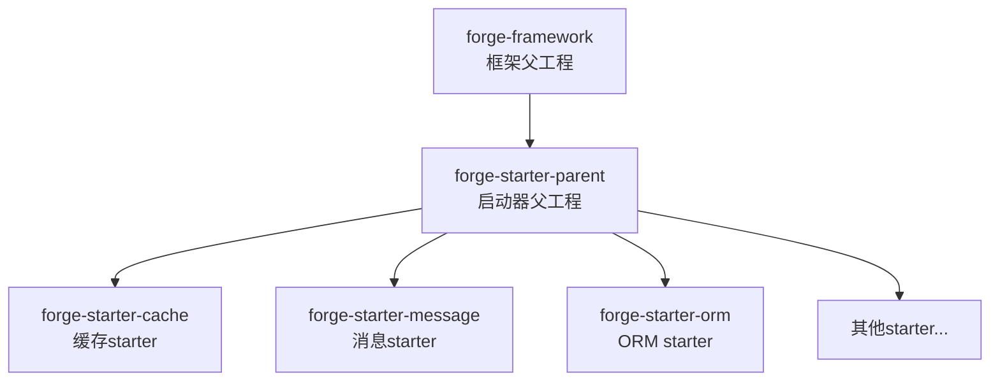
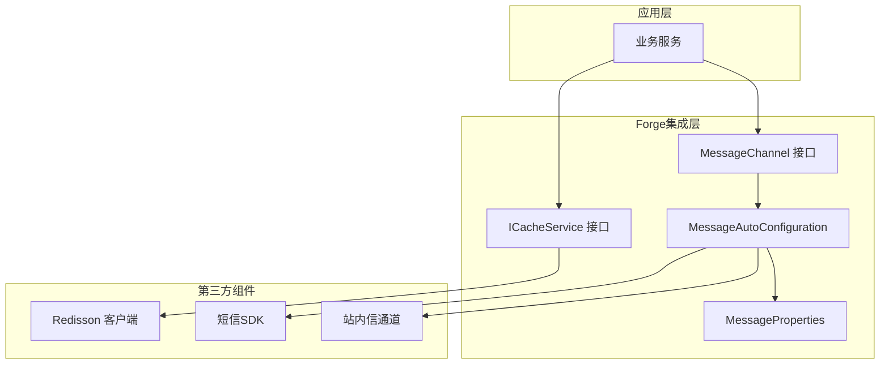
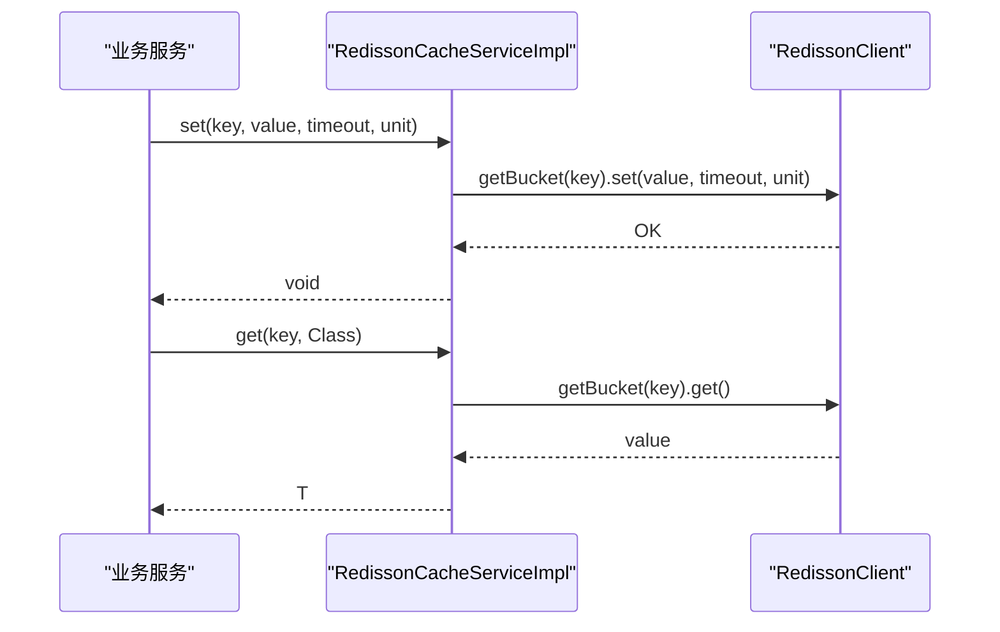
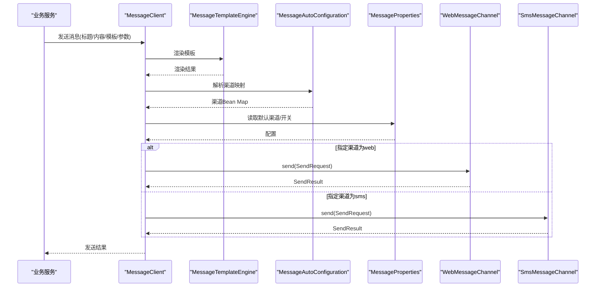
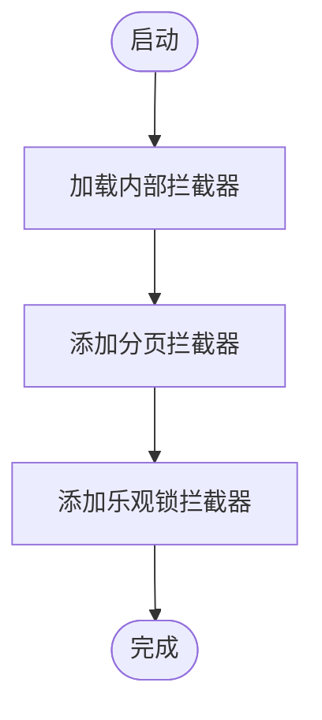
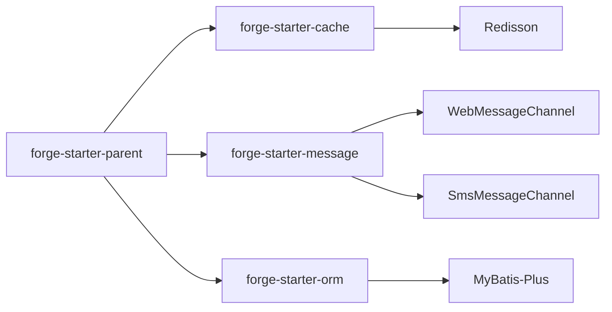

# 第三方组件集成

<cite>
**本文引用的文件**
- [forge-framework/pom.xml](file://forge/forge-framework/pom.xml)
- [forge-starter-parent/pom.xml](file://forge/forge-framework/forge-starter-parent/pom.xml)
- [ICacheService.java](file://forge/forge-framework/forge-starter-parent/forge-starter-cache/src/main/java/com/mdframe/forge/starter/cache/service/ICacheService.java)
- [RedissonCacheServiceImpl.java](file://forge/forge-framework/forge-starter-parent/forge-starter-cache/src/main/java/com/mdframe/forge/starter/cache/service/impl/RedissonCacheServiceImpl.java)
- [RedissonConfig.java](file://forge/forge-framework/forge-starter-parent/forge-starter-cache/src/main/java/com/mdframe/forge/starter/cache/config/RedissonConfig.java)
- [AutoConfiguration.imports](file://forge/forge-framework/forge-starter-parent/forge-starter-cache/src/main/resources/META-INF/spring/org.springframework.boot.autoconfigure.AutoConfiguration.imports)
- [MessageChannel.java](file://forge/forge-framework/forge-starter-parent/forge-starter-message/src/main/java/com/mdframe/forge/starter/message/channel/MessageChannel.java)
- [MessageAutoConfiguration.java](file://forge/forge-framework/forge-starter-parent/forge-starter-message/src/main/java/com/mdframe/forge/starter/message/config/MessageAutoConfiguration.java)
- [MessageProperties.java](file://forge/forge-framework/forge-starter-parent/forge-starter-message/src/main/java/com/mdframe/forge/starter/message/config/MessageProperties.java)
- [MybatisPlusConfig.java](file://forge/forge-framework/forge-starter-parent/forge-starter-orm/src/main/java/com/mdframe/forge/starter/orm/config/MybatisPlusConfig.java)
</cite>

## 目录
1. [简介](#简介)
2. [项目结构](#项目结构)
3. [核心组件](#核心组件)
4. [架构总览](#架构总览)
5. [详细组件分析](#详细组件分析)
6. [依赖关系分析](#依赖关系分析)
7. [性能考虑](#性能考虑)
8. [故障排查指南](#故障排查指南)
9. [结论](#结论)
10. [附录](#附录)

## 简介
本指南面向在Forge框架中集成第三方组件的开发者，围绕数据库连接池、消息队列、缓存系统、搜索引擎等常见组件，系统讲解如何通过Spring Boot自动装配机制、接口抽象设计与适配器模式，将外部能力无缝接入Forge生态。文档同时覆盖异步调用、超时控制、重试机制、熔断降级等分布式系统常见问题的处理思路，以及配置管理、监控告警与性能优化策略，并提供集成测试与故障排查建议。

## 项目结构
Forge采用多模块聚合结构，核心由“框架父工程”和“启动器父工程”组成。启动器父工程下包含大量功能starter模块，每个starter负责一个子系统能力（如缓存、消息、ORM、定时任务等）。各starter通过Spring Boot的自动装配机制进行装配，简化第三方组件的集成与配置。

图表来源
- [forge-framework/pom.xml](file://forge/forge-framework/pom.xml#L26-L30)
- [forge-starter-parent/pom.xml](file://forge/forge-framework/forge-starter-parent/pom.xml#L15-L34)

章节来源
- [forge-framework/pom.xml](file://forge/forge-framework/pom.xml#L1-L117)
- [forge-starter-parent/pom.xml](file://forge/forge-framework/forge-starter-parent/pom.xml#L1-L37)

## 核心组件
本节聚焦于已实现的典型第三方组件集成点，包括缓存（基于Redisson）、消息通道（Web/SMS）、ORM（MyBatis-Plus）等，展示接口抽象、自动装配与适配器模式的应用。

- 接口抽象与适配器
  - 缓存接口统一抽象，具体实现适配Redisson客户端，屏蔽底层差异。
  - 消息通道以接口抽象不同发送渠道（Web、SMS），通过自动装配按需启用。
  - ORM配置集中管理插件与ID生成策略，便于扩展与替换。

- 自动装配与条件化
  - 各starter通过AutoConfiguration导入与条件注解，实现“开箱即用”的集成体验。
  - 配置属性前缀统一，便于集中管理与环境隔离。

章节来源
- [ICacheService.java](file://forge/forge-framework/forge-starter-parent/forge-starter-cache/src/main/java/com/mdframe/forge/starter/cache/service/ICacheService.java#L10-L247)
- [MessageChannel.java](file://forge/forge-framework/forge-starter-parent/forge-starter-message/src/main/java/com/mdframe/forge/starter/message/channel/MessageChannel.java#L5-L40)
- [MybatisPlusConfig.java](file://forge/forge-framework/forge-starter-parent/forge-starter-orm/src/main/java/com/mdframe/forge/starter/orm/config/MybatisPlusConfig.java#L22-L96)

## 架构总览
Forge通过“接口抽象 + 自动装配 + 条件化启用”的架构，将第三方组件以统一的方式接入系统。下图展示了缓存与消息两个典型集成场景的交互关系：

图表来源
- [ICacheService.java](file://forge/forge-framework/forge-starter-parent/forge-starter-cache/src/main/java/com/mdframe/forge/starter/cache/service/ICacheService.java#L10-L247)
- [MessageChannel.java](file://forge/forge-framework/forge-starter-parent/forge-starter-message/src/main/java/com/mdframe/forge/starter/message/channel/MessageChannel.java#L5-L40)
- [MessageAutoConfiguration.java](file://forge/forge-framework/forge-starter-parent/forge-starter-message/src/main/java/com/mdframe/forge/starter/message/config/MessageAutoConfiguration.java#L17-L46)
- [MessageProperties.java](file://forge/forge-framework/forge-starter-parent/forge-starter-message/src/main/java/com/mdframe/forge/starter/message/config/MessageProperties.java#L7-L33)

## 详细组件分析

### 缓存组件集成（Redisson）
- 设计要点
  - 通过统一的缓存接口抽象，屏蔽Redisson的具体操作细节，便于未来替换实现或扩展新类型缓存。
  - 实现类基于RedissonClient，覆盖常用KV、Hash、Set、原子计数、TTL等能力，并提供模糊删除、分页查询键等高级能力。
  - 自动装配通过Spring Boot的AutoConfiguration导入机制，无需手动注册即可生效。

- 关键流程（设置与获取缓存）

图表来源
- [RedissonCacheServiceImpl.java](file://forge/forge-framework/forge-starter-parent/forge-starter-cache/src/main/java/com/mdframe/forge/starter/cache/service/impl/RedissonCacheServiceImpl.java#L30-L59)
- [ICacheService.java](file://forge/forge-framework/forge-starter-parent/forge-starter-cache/src/main/java/com/mdframe/forge/starter/cache/service/ICacheService.java#L15-L58)

- 配置与自动装配
  - 通过自动配置类定制Redisson序列化器，支持Java 8时间类型。
  - 通过AutoConfiguration.imports声明自动装配入口，确保Starter被加载。

章节来源
- [ICacheService.java](file://forge/forge-framework/forge-starter-parent/forge-starter-cache/src/main/java/com/mdframe/forge/starter/cache/service/ICacheService.java#L10-L247)
- [RedissonCacheServiceImpl.java](file://forge/forge-framework/forge-starter-parent/forge-starter-cache/src/main/java/com/mdframe/forge/starter/cache/service/impl/RedissonCacheServiceImpl.java#L1-L289)
- [RedissonConfig.java](file://forge/forge-framework/forge-starter-parent/forge-starter-cache/src/main/java/com/mdframe/forge/starter/cache/config/RedissonConfig.java#L12-L34)
- [AutoConfiguration.imports](file://forge/forge-framework/forge-starter-parent/forge-starter-cache/src/main/resources/META-INF/spring/org.springframework.boot.autoconfigure.AutoConfiguration.imports#L1-L2)

### 消息组件集成（Web/SMS）
- 设计要点
  - 以接口抽象不同消息渠道，支持Web站内信与短信两种渠道，默认启用Web渠道，短信渠道可按需开启。
  - 通过配置属性集中管理默认渠道与各渠道开关及参数，实现灵活的渠道选择与模板渲染。

- 关键流程（消息发送）

图表来源
- [MessageAutoConfiguration.java](file://forge/forge-framework/forge-starter-parent/forge-starter-message/src/main/java/com/mdframe/forge/starter/message/config/MessageAutoConfiguration.java#L17-L46)
- [MessageProperties.java](file://forge/forge-framework/forge-starter-parent/forge-starter-message/src/main/java/com/mdframe/forge/starter/message/config/MessageProperties.java#L7-L33)
- [MessageChannel.java](file://forge/forge-framework/forge-starter-parent/forge-starter-message/src/main/java/com/mdframe/forge/starter/message/channel/MessageChannel.java#L5-L40)

- 配置要点
  - 默认渠道与各渠道开关通过配置前缀统一管理，便于在不同环境切换。
  - 渠道Bean按条件启用，未启用的渠道不会被注入，降低运行时开销。

章节来源
- [MessageChannel.java](file://forge/forge-framework/forge-starter-parent/forge-starter-message/src/main/java/com/mdframe/forge/starter/message/channel/MessageChannel.java#L5-L40)
- [MessageAutoConfiguration.java](file://forge/forge-framework/forge-starter-parent/forge-starter-message/src/main/java/com/mdframe/forge/starter/message/config/MessageAutoConfiguration.java#L17-L46)
- [MessageProperties.java](file://forge/forge-framework/forge-starter-parent/forge-starter-message/src/main/java/com/mdframe/forge/starter/message/config/MessageProperties.java#L7-L33)

### ORM组件集成（MyBatis-Plus）
- 设计要点
  - 集中配置MyBatis-Plus拦截器链，支持自动注入其他模块提供的拦截器，保证扩展性与顺序可控。
  - 提供分页与乐观锁插件，结合ID生成器策略，满足高并发下的主键唯一性需求。

- 关键流程（拦截器链初始化）

图表来源
- [MybatisPlusConfig.java](file://forge/forge-framework/forge-starter-parent/forge-starter-orm/src/main/java/com/mdframe/forge/starter/orm/config/MybatisPlusConfig.java#L38-L76)

章节来源
- [MybatisPlusConfig.java](file://forge/forge-framework/forge-starter-parent/forge-starter-orm/src/main/java/com/mdframe/forge/starter/orm/config/MybatisPlusConfig.java#L22-L96)

## 依赖关系分析
- 模块耦合
  - 启动器父工程聚合多个功能starter，彼此低耦合，通过接口与自动装配协作。
  - 各starter仅暴露必要的接口与配置，避免对上层业务产生侵入。

- 外部依赖
  - 缓存：Redisson客户端
  - 消息：通道实现（Web/SMS）
  - ORM：MyBatis-Plus与相关插件

图表来源
- [forge-starter-parent/pom.xml](file://forge/forge-framework/forge-starter-parent/pom.xml#L15-L34)
- [RedissonCacheServiceImpl.java](file://forge/forge-framework/forge-starter-parent/forge-starter-cache/src/main/java/com/mdframe/forge/starter/cache/service/impl/RedissonCacheServiceImpl.java#L23-L28)
- [MessageAutoConfiguration.java](file://forge/forge-framework/forge-starter-parent/forge-starter-message/src/main/java/com/mdframe/forge/starter/message/config/MessageAutoConfiguration.java#L27-L37)
- [MybatisPlusConfig.java](file://forge/forge-framework/forge-starter-parent/forge-starter-orm/src/main/java/com/mdframe/forge/starter/orm/config/MybatisPlusConfig.java#L38-L59)

## 性能考虑
- 缓存
  - 使用Redisson的原生序列化器，减少反序列化开销；对异常类型值提供兜底读取策略，提升稳定性。
  - 提供批量删除与模糊删除能力，配合分页查询键，便于运维与清理。
- 消息
  - 渠道按需启用，避免无用Bean占用资源；模板引擎提前渲染，降低发送时计算成本。
- ORM
  - 拦截器链按注册顺序执行，建议将高频插件置于靠前位置；分页与乐观锁插件组合使用，平衡性能与一致性。

## 故障排查指南
- 缓存
  - 现象：反序列化失败导致读取异常
  - 处理：实现类已提供字符串兜底读取逻辑，若仍失败，检查Redis中键值编码与序列化配置是否一致
- 消息
  - 现象：未收到短信或渠道未生效
  - 处理：确认配置前缀与开关项；检查渠道Bean是否被条件化注入
- ORM
  - 现象：分页或乐观锁不生效
  - 处理：确认拦截器链注册顺序与插件配置；检查ID生成器策略是否正确

章节来源
- [RedissonCacheServiceImpl.java](file://forge/forge-framework/forge-starter-parent/forge-starter-cache/src/main/java/com/mdframe/forge/starter/cache/service/impl/RedissonCacheServiceImpl.java#L231-L270)
- [MessageAutoConfiguration.java](file://forge/forge-framework/forge-starter-parent/forge-starter-message/src/main/java/com/mdframe/forge/starter/message/config/MessageAutoConfiguration.java#L27-L37)
- [MybatisPlusConfig.java](file://forge/forge-framework/forge-starter-parent/forge-starter-orm/src/main/java/com/mdframe/forge/starter/orm/config/MybatisPlusConfig.java#L42-L59)

## 结论
Forge通过接口抽象、自动装配与条件化启用，为第三方组件集成提供了清晰、可扩展的路径。对于缓存、消息与ORM等常见组件，已形成可复用的集成范式。在此基础上，开发者可按需扩展更多组件（如数据库连接池、搜索引擎、消息队列等），遵循相同的设计原则与最佳实践，确保系统的一致性与可维护性。

## 附录

### 集成步骤与最佳实践
- 接口抽象
  - 定义统一的服务接口，封装第三方能力的差异化实现
- 适配器实现
  - 基于目标组件实现接口，保持幂等与线程安全
- 自动装配
  - 通过Spring Boot自动装配机制，按需启用与配置
- 配置管理
  - 使用统一前缀管理配置，支持多环境分离
- 监控与告警
  - 对关键指标（请求耗时、错误率、重试次数）埋点，结合日志与告警平台
- 性能优化
  - 合理设置超时与重试；对热点数据增加本地缓存；对批量操作使用批处理
- 异步与熔断
  - 对外部调用采用异步与超时控制；必要时引入熔断降级策略

### 常见组件集成参考清单
- 数据库连接池：通过Spring Boot Starter或自定义配置，结合连接池监控与健康检查
- 消息队列：定义生产者/消费者接口，按需启用对应通道（如RabbitMQ/Kafka）
- 缓存系统：除Redis外，可扩展至本地缓存或分布式缓存（如Ehcache/Infinispan）
- 搜索引擎：提供搜索接口抽象，适配Elasticsearch/OpenSearch等
- 支付网关：抽象支付接口，按需接入微信/支付宝等SDK，统一验签与回调处理