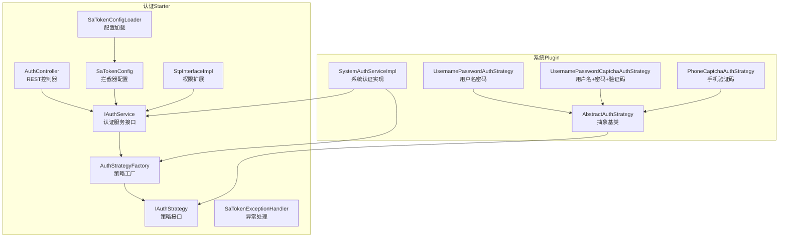
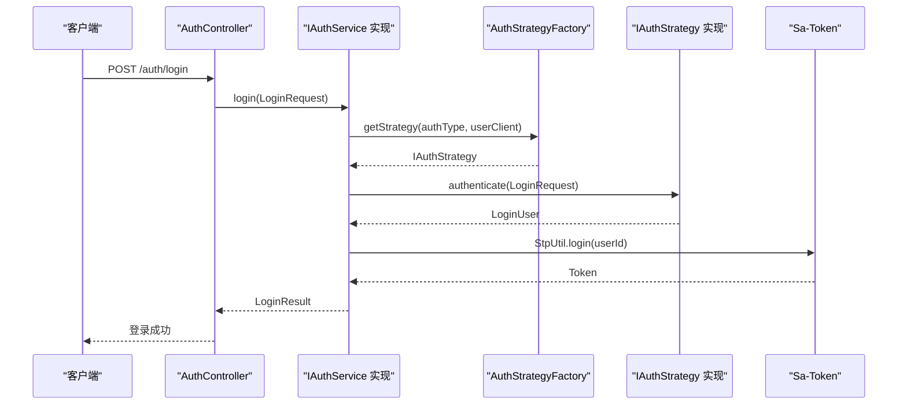
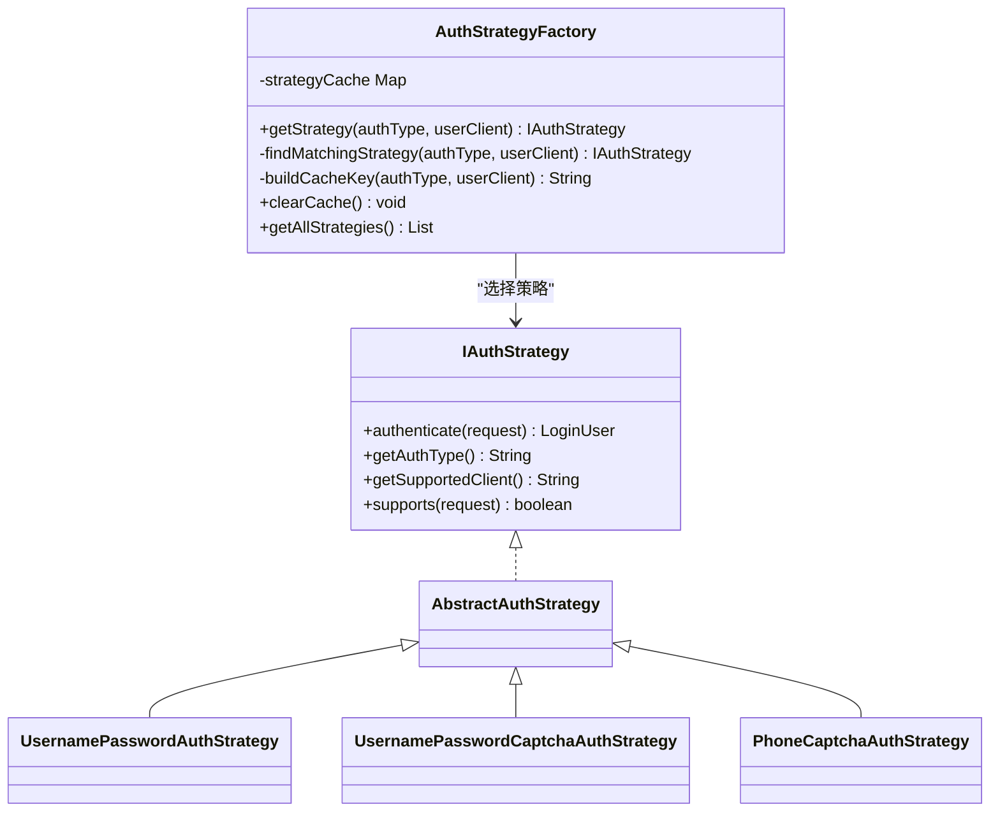
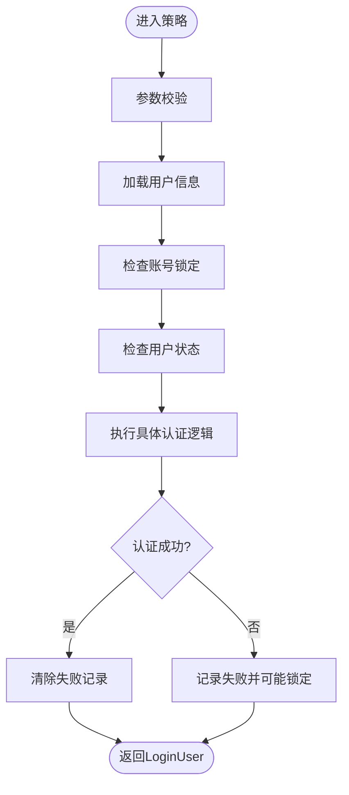
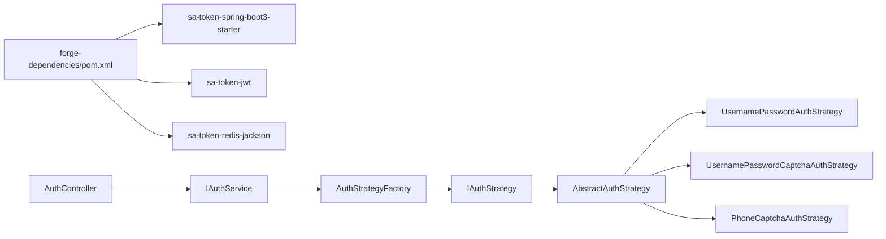

# 自定义认证策略

<cite>
**本文引用的文件**
- [forge/forge-framework/forge-starter-parent/forge-starter-auth/src/main/java/com/mdframe/forge/starter/auth/strategy/IAuthStrategy.java](file://forge/forge-framework/forge-starter-parent/forge-starter-auth/src/main/java/com/mdframe/forge/starter/auth/strategy/IAuthStrategy.java)
- [forge/forge-framework/forge-starter-parent/forge-starter-auth/src/main/java/com/mdframe/forge/starter/auth/strategy/AuthStrategyFactory.java](file://forge/forge-framework/forge-starter-parent/forge-starter-auth/src/main/java/com/mdframe/forge/starter/auth/strategy/AuthStrategyFactory.java)
- [forge/forge-framework/forge-starter-parent/forge-starter-auth/src/main/java/com/mdframe/forge/starter/auth/enums/AuthType.java](file://forge/forge-framework/forge-starter-parent/forge-starter-auth/src/main/java/com/mdframe/forge/starter/auth/enums/AuthType.java)
- [forge/forge-framework/forge-starter-parent/forge-starter-auth/src/main/java/com/mdframe/forge/starter/auth/service/IAuthService.java](file://forge/forge-framework/forge-starter-parent/forge-starter-auth/src/main/java/com/mdframe/forge/starter/auth/service/IAuthService.java)
- [forge/forge-framework/forge-starter-parent/forge-starter-auth/src/main/java/com/mdframe/forge/starter/auth/controller/AuthController.java](file://forge/forge-framework/forge-starter-parent/forge-starter-auth/src/main/java/com/mdframe/forge/starter/auth/controller/AuthController.java)
- [forge/forge-framework/forge-starter-parent/forge-starter-auth/src/main/java/com/mdframe/forge/starter/auth/config/SaTokenConfig.java](file://forge/forge-framework/forge-starter-parent/forge-starter-auth/src/main/java/com/mdframe/forge/starter/auth/config/SaTokenConfig.java)
- [forge/forge-framework/forge-starter-parent/forge-starter-auth/src/main/java/com/mdframe/forge/starter/auth/config/SaTokenConfigLoader.java](file://forge/forge-framework/forge-starter-parent/forge-starter-auth/src/main/java/com/mdframe/forge/starter/auth/config/SaTokenConfigLoader.java)
- [forge/forge-framework/forge-starter-parent/forge-starter-auth/src/main/java/com/mdframe/forge/starter/auth/config/StpInterfaceImpl.java](file://forge/forge-framework/forge-starter-parent/forge-starter-auth/src/main/java/com/mdframe/forge/starter/auth/config/StpInterfaceImpl.java)
- [forge/forge-framework/forge-starter-parent/forge-starter-auth/src/main/java/com/mdframe/forge/starter/auth/exception/SaTokenExceptionHandler.java](file://forge/forge-framework/forge-starter-parent/forge-starter-auth/src/main/java/com/mdframe/forge/starter/auth/exception/SaTokenExceptionHandler.java)
- [forge/forge-framework/forge-plugin-parent/forge-plugin-system/src/main/java/com/mdframe/forge/plugin/system/service/impl/SystemAuthServiceImpl.java](file://forge/forge-framework/forge-plugin-parent/forge-plugin-system/src/main/java/com/mdframe/forge/plugin/system/service/impl/SystemAuthServiceImpl.java)
- [forge/forge-framework/forge-plugin-parent/forge-plugin-system/src/main/java/com/mdframe/forge/plugin/system/strategy/AbstractAuthStrategy.java](file://forge/forge-framework/forge-plugin-parent/forge-plugin-system/src/main/java/com/mdframe/forge/plugin/system/strategy/AbstractAuthStrategy.java)
- [forge/forge-framework/forge-plugin-parent/forge-plugin-system/src/main/java/com/mdframe/forge/plugin/system/strategy/UsernamePasswordAuthStrategy.java](file://forge/forge-framework/forge-plugin-parent/forge-plugin-system/src/main/java/com/mdframe/forge/plugin/system/strategy/UsernamePasswordAuthStrategy.java)
- [forge/forge-framework/forge-plugin-parent/forge-plugin-system/src/main/java/com/mdframe/forge/plugin/system/strategy/UsernamePasswordCaptchaAuthStrategy.java](file://forge/forge-framework/forge-plugin-parent/forge-plugin-system/src/main/java/com/mdframe/forge/plugin/system/strategy/UsernamePasswordCaptchaAuthStrategy.java)
- [forge/forge-framework/forge-plugin-parent/forge-plugin-system/src/main/java/com/mdframe/forge/plugin/system/strategy/PhoneCaptchaAuthStrategy.java](file://forge/forge-framework/forge-plugin-parent/forge-plugin-system/src/main/java/com/mdframe/forge/plugin/system/strategy/PhoneCaptchaAuthStrategy.java)
- [forge/forge-framework/forge-dependencies/pom.xml](file://forge/forge-framework/forge-dependencies/pom.xml)
</cite>

## 目录
1. [简介](#简介)
2. [项目结构](#项目结构)
3. [核心组件](#核心组件)
4. [架构总览](#架构总览)
5. [组件详解](#组件详解)
6. [依赖关系分析](#依赖关系分析)
7. [性能与安全](#性能与安全)
8. [故障排查](#故障排查)
9. [结论](#结论)
10. [附录](#附录)

## 简介
本指南面向Forge框架的自定义认证策略开发，围绕基于Sa-Token的认证体系，系统讲解认证策略接口设计、工厂模式实现、策略注册机制与扩展点；并结合现有用户名密码认证、手机验证码认证、滑块验证码认证等实现原理，给出自定义策略的完整开发流程、配置参数、认证逻辑、异常处理、OAuth2与JWT集成思路、多因子认证实践、性能优化与安全加固建议，以及测试验证方法。

## 项目结构
认证模块采用“starter + 插件”的分层组织：
- starter层提供通用认证能力（策略接口、工厂、配置、控制器、异常处理等）
- plugin层提供具体认证策略实现（用户名密码、验证码等），并通过策略工厂按需装配
- Sa-Token作为统一的会话与权限基础设施，贯穿登录、拦截、鉴权与在线用户管理

图表来源
- [forge/forge-framework/forge-starter-parent/forge-starter-auth/src/main/java/com/mdframe/forge/starter/auth/service/IAuthService.java](file://forge/forge-framework/forge-starter-parent/forge-starter-auth/src/main/java/com/mdframe/forge/starter/auth/service/IAuthService.java#L1-L156)
- [forge/forge-framework/forge-starter-parent/forge-starter-auth/src/main/java/com/mdframe/forge/starter/auth/controller/AuthController.java](file://forge/forge-framework/forge-starter-parent/forge-starter-auth/src/main/java/com/mdframe/forge/starter/auth/controller/AuthController.java#L1-L137)
- [forge/forge-framework/forge-starter-parent/forge-starter-auth/src/main/java/com/mdframe/forge/starter/auth/strategy/IAuthStrategy.java](file://forge/forge-framework/forge-starter-parent/forge-starter-auth/src/main/java/com/mdframe/forge/starter/auth/strategy/IAuthStrategy.java#L1-L56)
- [forge/forge-framework/forge-starter-parent/forge-starter-auth/src/main/java/com/mdframe/forge/starter/auth/strategy/AuthStrategyFactory.java](file://forge/forge-framework/forge-starter-parent/forge-starter-auth/src/main/java/com/mdframe/forge/starter/auth/strategy/AuthStrategyFactory.java#L1-L115)
- [forge/forge-framework/forge-starter-parent/forge-starter-auth/src/main/java/com/mdframe/forge/starter/auth/config/SaTokenConfig.java](file://forge/forge-framework/forge-starter-parent/forge-starter-auth/src/main/java/com/mdframe/forge/starter/auth/config/SaTokenConfig.java#L1-L120)
- [forge/forge-framework/forge-starter-parent/forge-starter-auth/src/main/java/com/mdframe/forge/starter/auth/config/SaTokenConfigLoader.java](file://forge/forge-framework/forge-starter-parent/forge-starter-auth/src/main/java/com/mdframe/forge/starter/auth/config/SaTokenConfigLoader.java#L1-L120)
- [forge/forge-framework/forge-starter-parent/forge-starter-auth/src/main/java/com/mdframe/forge/starter/auth/config/StpInterfaceImpl.java](file://forge/forge-framework/forge-starter-parent/forge-starter-auth/src/main/java/com/mdframe/forge/starter/auth/config/StpInterfaceImpl.java#L1-L200)
- [forge/forge-framework/forge-starter-parent/forge-starter-auth/src/main/java/com/mdframe/forge/starter/auth/exception/SaTokenExceptionHandler.java](file://forge/forge-framework/forge-starter-parent/forge-starter-auth/src/main/java/com/mdframe/forge/starter/auth/exception/SaTokenExceptionHandler.java#L1-L200)
- [forge/forge-framework/forge-plugin-parent/forge-plugin-system/src/main/java/com/mdframe/forge/plugin/system/service/impl/SystemAuthServiceImpl.java](file://forge/forge-framework/forge-plugin-parent/forge-plugin-system/src/main/java/com/mdframe/forge/plugin/system/service/impl/SystemAuthServiceImpl.java#L1-L404)
- [forge/forge-framework/forge-plugin-parent/forge-plugin-system/src/main/java/com/mdframe/forge/plugin/system/strategy/AbstractAuthStrategy.java](file://forge/forge-framework/forge-plugin-parent/forge-plugin-system/src/main/java/com/mdframe/forge/plugin/system/strategy/AbstractAuthStrategy.java#L1-L196)
- [forge/forge-framework/forge-plugin-parent/forge-plugin-system/src/main/java/com/mdframe/forge/plugin/system/strategy/UsernamePasswordAuthStrategy.java](file://forge/forge-framework/forge-plugin-parent/forge-plugin-system/src/main/java/com/mdframe/forge/plugin/system/strategy/UsernamePasswordAuthStrategy.java#L1-L51)
- [forge/forge-framework/forge-plugin-parent/forge-plugin-system/src/main/java/com/mdframe/forge/plugin/system/strategy/UsernamePasswordCaptchaAuthStrategy.java](file://forge/forge-framework/forge-plugin-parent/forge-plugin-system/src/main/java/com/mdframe/forge/plugin/system/strategy/UsernamePasswordCaptchaAuthStrategy.java#L1-L130)
- [forge/forge-framework/forge-plugin-parent/forge-plugin-system/src/main/java/com/mdframe/forge/plugin/system/strategy/PhoneCaptchaAuthStrategy.java](file://forge/forge-framework/forge-plugin-parent/forge-plugin-system/src/main/java/com/mdframe/forge/plugin/system/strategy/PhoneCaptchaAuthStrategy.java#L1-L48)

章节来源
- [forge/forge-framework/forge-starter-parent/forge-starter-auth/src/main/java/com/mdframe/forge/starter/auth/service/IAuthService.java](file://forge/forge-framework/forge-starter-parent/forge-starter-auth/src/main/java/com/mdframe/forge/starter/auth/service/IAuthService.java#L1-L156)
- [forge/forge-framework/forge-starter-parent/forge-starter-auth/src/main/java/com/mdframe/forge/starter/auth/controller/AuthController.java](file://forge/forge-framework/forge-starter-parent/forge-starter-auth/src/main/java/com/mdframe/forge/starter/auth/controller/AuthController.java#L1-L137)
- [forge/forge-framework/forge-starter-parent/forge-starter-auth/src/main/java/com/mdframe/forge/starter/auth/strategy/AuthStrategyFactory.java](file://forge/forge-framework/forge-starter-parent/forge-starter-auth/src/main/java/com/mdframe/forge/starter/auth/strategy/AuthStrategyFactory.java#L1-L115)
- [forge/forge-framework/forge-starter-parent/forge-starter-auth/src/main/java/com/mdframe/forge/starter/auth/config/SaTokenConfig.java](file://forge/forge-framework/forge-starter-parent/forge-starter-auth/src/main/java/com/mdframe/forge/starter/auth/config/SaTokenConfig.java#L1-L120)

## 核心组件
- 认证策略接口 IAuthStrategy：定义统一的认证契约，包括执行认证、认证类型、客户端支持范围与支持判断
- 策略工厂 AuthStrategyFactory：负责按认证类型与客户端类型选择策略，内置缓存与回退策略
- 认证服务接口 IAuthService 与控制器 AuthController：对外暴露统一登录、登出、验证码、刷新Token等接口
- Sa-Token配置：注册拦截器、加载配置、扩展权限接口、异常处理
- 抽象认证策略 AbstractAuthStrategy：封装通用逻辑（账号锁定检查、失败记录、状态校验、成功处理）
- 具体策略：用户名密码、用户名密码+验证码、手机验证码等

章节来源
- [forge/forge-framework/forge-starter-parent/forge-starter-auth/src/main/java/com/mdframe/forge/starter/auth/strategy/IAuthStrategy.java](file://forge/forge-framework/forge-starter-parent/forge-starter-auth/src/main/java/com/mdframe/forge/starter/auth/strategy/IAuthStrategy.java#L1-L56)
- [forge/forge-framework/forge-starter-parent/forge-starter-auth/src/main/java/com/mdframe/forge/starter/auth/strategy/AuthStrategyFactory.java](file://forge/forge-framework/forge-starter-parent/forge-starter-auth/src/main/java/com/mdframe/forge/starter/auth/strategy/AuthStrategyFactory.java#L1-L115)
- [forge/forge-framework/forge-starter-parent/forge-starter-auth/src/main/java/com/mdframe/forge/starter/auth/service/IAuthService.java](file://forge/forge-framework/forge-starter-parent/forge-starter-auth/src/main/java/com/mdframe/forge/starter/auth/service/IAuthService.java#L1-L156)
- [forge/forge-framework/forge-starter-parent/forge-starter-auth/src/main/java/com/mdframe/forge/starter/auth/controller/AuthController.java](file://forge/forge-framework/forge-starter-parent/forge-starter-auth/src/main/java/com/mdframe/forge/starter/auth/controller/AuthController.java#L1-L137)
- [forge/forge-framework/forge-starter-parent/forge-starter-auth/src/main/java/com/mdframe/forge/starter/auth/config/SaTokenConfig.java](file://forge/forge-framework/forge-starter-parent/forge-starter-auth/src/main/java/com/mdframe/forge/starter/auth/config/SaTokenConfig.java#L1-L120)
- [forge/forge-framework/forge-plugin-parent/forge-plugin-system/src/main/java/com/mdframe/forge/plugin/system/strategy/AbstractAuthStrategy.java](file://forge/forge-framework/forge-plugin-parent/forge-plugin-system/src/main/java/com/mdframe/forge/plugin/system/strategy/AbstractAuthStrategy.java#L1-L196)

## 架构总览
下图展示从HTTP请求到策略执行再到Sa-Token登录的整体流程：

图表来源
- [forge/forge-framework/forge-starter-parent/forge-starter-auth/src/main/java/com/mdframe/forge/starter/auth/controller/AuthController.java](file://forge/forge-framework/forge-starter-parent/forge-starter-auth/src/main/java/com/mdframe/forge/starter/auth/controller/AuthController.java#L31-L36)
- [forge/forge-framework/forge-plugin-parent/forge-plugin-system/src/main/java/com/mdframe/forge/plugin/system/service/impl/SystemAuthServiceImpl.java](file://forge/forge-framework/forge-plugin-parent/forge-plugin-system/src/main/java/com/mdframe/forge/plugin/system/service/impl/SystemAuthServiceImpl.java#L48-L91)
- [forge/forge-framework/forge-starter-parent/forge-starter-auth/src/main/java/com/mdframe/forge/starter/auth/strategy/AuthStrategyFactory.java](file://forge/forge-framework/forge-starter-parent/forge-starter-auth/src/main/java/com/mdframe/forge/starter/auth/strategy/AuthStrategyFactory.java#L34-L60)
- [forge/forge-framework/forge-starter-parent/forge-starter-auth/src/main/java/com/mdframe/forge/starter/auth/strategy/IAuthStrategy.java](file://forge/forge-framework/forge-starter-parent/forge-starter-auth/src/main/java/com/mdframe/forge/starter/auth/strategy/IAuthStrategy.java#L18-L18)

## 组件详解

### 认证策略接口与工厂
- IAuthStrategy定义了统一的认证契约，支持指定认证类型与客户端支持范围，并提供默认的supports判断
- AuthStrategyFactory通过构造键值“authType_userClient”进行缓存，优先精确匹配（同时满足类型与客户端），否则回退到仅类型匹配的策略

图表来源
- [forge/forge-framework/forge-starter-parent/forge-starter-auth/src/main/java/com/mdframe/forge/starter/auth/strategy/IAuthStrategy.java](file://forge/forge-framework/forge-starter-parent/forge-starter-auth/src/main/java/com/mdframe/forge/starter/auth/strategy/IAuthStrategy.java#L10-L55)
- [forge/forge-framework/forge-starter-parent/forge-starter-auth/src/main/java/com/mdframe/forge/starter/auth/strategy/AuthStrategyFactory.java](file://forge/forge-framework/forge-starter-parent/forge-starter-auth/src/main/java/com/mdframe/forge/starter/auth/strategy/AuthStrategyFactory.java#L18-L114)
- [forge/forge-framework/forge-plugin-parent/forge-plugin-system/src/main/java/com/mdframe/forge/plugin/system/strategy/AbstractAuthStrategy.java](file://forge/forge-framework/forge-plugin-parent/forge-plugin-system/src/main/java/com/mdframe/forge/plugin/system/strategy/AbstractAuthStrategy.java#L23-L196)
- [forge/forge-framework/forge-plugin-parent/forge-plugin-system/src/main/java/com/mdframe/forge/plugin/system/strategy/UsernamePasswordAuthStrategy.java](file://forge/forge-framework/forge-plugin-parent/forge-plugin-system/src/main/java/com/mdframe/forge/plugin/system/strategy/UsernamePasswordAuthStrategy.java#L14-L50)
- [forge/forge-framework/forge-plugin-parent/forge-plugin-system/src/main/java/com/mdframe/forge/plugin/system/strategy/UsernamePasswordCaptchaAuthStrategy.java](file://forge/forge-framework/forge-plugin-parent/forge-plugin-system/src/main/java/com/mdframe/forge/plugin/system/strategy/UsernamePasswordCaptchaAuthStrategy.java#L23-L129)
- [forge/forge-framework/forge-plugin-parent/forge-plugin-system/src/main/java/com/mdframe/forge/plugin/system/strategy/PhoneCaptchaAuthStrategy.java](file://forge/forge-framework/forge-plugin-parent/forge-plugin-system/src/main/java/com/mdframe/forge/plugin/system/strategy/PhoneCaptchaAuthStrategy.java#L15-L47)

章节来源
- [forge/forge-framework/forge-starter-parent/forge-starter-auth/src/main/java/com/mdframe/forge/starter/auth/strategy/IAuthStrategy.java](file://forge/forge-framework/forge-starter-parent/forge-starter-auth/src/main/java/com/mdframe/forge/starter/auth/strategy/IAuthStrategy.java#L1-L56)
- [forge/forge-framework/forge-starter-parent/forge-starter-auth/src/main/java/com/mdframe/forge/starter/auth/strategy/AuthStrategyFactory.java](file://forge/forge-framework/forge-starter-parent/forge-starter-auth/src/main/java/com/mdframe/forge/starter/auth/strategy/AuthStrategyFactory.java#L1-L115)

### 现有认证策略实现原理
- 用户名密码认证：加载用户、检查锁定、校验密码，成功后清除失败记录
- 用户名密码+验证码认证：根据配置决定验证码类型（图形/滑块/短信），对不同类型做差异化校验，再执行密码校验
- 手机号+验证码认证：校验短信验证码，再按手机号加载用户

图表来源
- [forge/forge-framework/forge-plugin-parent/forge-plugin-system/src/main/java/com/mdframe/forge/plugin/system/strategy/AbstractAuthStrategy.java](file://forge/forge-framework/forge-plugin-parent/forge-plugin-system/src/main/java/com/mdframe/forge/plugin/system/strategy/AbstractAuthStrategy.java#L75-L138)
- [forge/forge-framework/forge-plugin-parent/forge-plugin-system/src/main/java/com/mdframe/forge/plugin/system/strategy/UsernamePasswordAuthStrategy.java](file://forge/forge-framework/forge-plugin-parent/forge-plugin-system/src/main/java/com/mdframe/forge/plugin/system/strategy/UsernamePasswordAuthStrategy.java#L23-L44)
- [forge/forge-framework/forge-plugin-parent/forge-plugin-system/src/main/java/com/mdframe/forge/plugin/system/strategy/UsernamePasswordCaptchaAuthStrategy.java](file://forge/forge-framework/forge-plugin-parent/forge-plugin-system/src/main/java/com/mdframe/forge/plugin/system/strategy/UsernamePasswordCaptchaAuthStrategy.java#L64-L96)
- [forge/forge-framework/forge-plugin-parent/forge-plugin-system/src/main/java/com/mdframe/forge/plugin/system/strategy/PhoneCaptchaAuthStrategy.java](file://forge/forge-framework/forge-plugin-parent/forge-plugin-system/src/main/java/com/mdframe/forge/plugin/system/strategy/PhoneCaptchaAuthStrategy.java#L26-L41)

章节来源
- [forge/forge-framework/forge-plugin-parent/forge-plugin-system/src/main/java/com/mdframe/forge/plugin/system/strategy/UsernamePasswordAuthStrategy.java](file://forge/forge-framework/forge-plugin-parent/forge-plugin-system/src/main/java/com/mdframe/forge/plugin/system/strategy/UsernamePasswordAuthStrategy.java#L1-L51)
- [forge/forge-framework/forge-plugin-parent/forge-plugin-system/src/main/java/com/mdframe/forge/plugin/system/strategy/UsernamePasswordCaptchaAuthStrategy.java](file://forge/forge-framework/forge-plugin-parent/forge-plugin-system/src/main/java/com/mdframe/forge/plugin/system/strategy/UsernamePasswordCaptchaAuthStrategy.java#L1-L130)
- [forge/forge-framework/forge-plugin-parent/forge-plugin-system/src/main/java/com/mdframe/forge/plugin/system/strategy/PhoneCaptchaAuthStrategy.java](file://forge/forge-framework/forge-plugin-parent/forge-plugin-system/src/main/java/com/mdframe/forge/plugin/system/strategy/PhoneCaptchaAuthStrategy.java#L1-L48)

### Sa-Token集成与拦截链
- SaTokenConfig注册全局拦截器，排除登录、注册、重置密码、验证码、静态资源、Swagger、健康检查等路径，其余路径强制登录校验
- SaTokenConfigLoader从配置中心加载Sa-Token运行参数（如token名称、前缀、超时、共享等），动态应用到Sa-Token配置
- StpInterfaceImpl扩展权限接口，配合权限拦截器ApiPermissionInterceptor实现细粒度权限控制
- SaTokenExceptionHandler统一处理认证相关异常

章节来源
- [forge/forge-framework/forge-starter-parent/forge-starter-auth/src/main/java/com/mdframe/forge/starter/auth/config/SaTokenConfig.java](file://forge/forge-framework/forge-starter-parent/forge-starter-auth/src/main/java/com/mdframe/forge/starter/auth/config/SaTokenConfig.java#L29-L53)
- [forge/forge-framework/forge-starter-parent/forge-starter-auth/src/main/java/com/mdframe/forge/starter/auth/config/SaTokenConfigLoader.java](file://forge/forge-framework/forge-starter-parent/forge-starter-auth/src/main/java/com/mdframe/forge/starter/auth/config/SaTokenConfigLoader.java#L38-L60)
- [forge/forge-framework/forge-starter-parent/forge-starter-auth/src/main/java/com/mdframe/forge/starter/auth/config/StpInterfaceImpl.java](file://forge/forge-framework/forge-starter-parent/forge-starter-auth/src/main/java/com/mdframe/forge/starter/auth/config/StpInterfaceImpl.java#L1-L200)
- [forge/forge-framework/forge-starter-parent/forge-starter-auth/src/main/java/com/mdframe/forge/starter/auth/exception/SaTokenExceptionHandler.java](file://forge/forge-framework/forge-starter-parent/forge-starter-auth/src/main/java/com/mdframe/forge/starter/auth/exception/SaTokenExceptionHandler.java#L1-L200)

### 认证服务与控制器
- IAuthService定义统一认证入口、登出、注册、改密、重置密码、验证码、刷新Token、用户加载、密码与验证码校验等能力
- AuthController提供对外REST接口，统一登录、登出、注册、改密、重置密码、验证码、登录配置、刷新Token等

章节来源
- [forge/forge-framework/forge-starter-parent/forge-starter-auth/src/main/java/com/mdframe/forge/starter/auth/service/IAuthService.java](file://forge/forge-framework/forge-starter-parent/forge-starter-auth/src/main/java/com/mdframe/forge/starter/auth/service/IAuthService.java#L1-L156)
- [forge/forge-framework/forge-starter-parent/forge-starter-auth/src/main/java/com/mdframe/forge/starter/auth/controller/AuthController.java](file://forge/forge-framework/forge-starter-parent/forge-starter-auth/src/main/java/com/mdframe/forge/starter/auth/controller/AuthController.java#L1-L137)

## 依赖关系分析
- Sa-Token依赖：starter中引入spring-boot3 starter、jwt扩展、Redis Jackson序列化
- 认证策略与系统实现解耦：策略通过Spring注入聚合，系统实现通过工厂选择策略
- 控制器依赖认证服务接口，服务实现依赖策略工厂与用户加载服务

图表来源
- [forge/forge-framework/forge-dependencies/pom.xml](file://forge/forge-framework/forge-dependencies/pom.xml#L128-L152)
- [forge/forge-framework/forge-starter-parent/forge-starter-auth/src/main/java/com/mdframe/forge/starter/auth/controller/AuthController.java](file://forge/forge-framework/forge-starter-parent/forge-starter-auth/src/main/java/com/mdframe/forge/starter/auth/controller/AuthController.java#L20-L21)
- [forge/forge-framework/forge-starter-parent/forge-starter-auth/src/main/java/com/mdframe/forge/starter/auth/service/IAuthService.java](file://forge/forge-framework/forge-starter-parent/forge-starter-auth/src/main/java/com/mdframe/forge/starter/auth/service/IAuthService.java#L18-L18)
- [forge/forge-framework/forge-starter-parent/forge-starter-auth/src/main/java/com/mdframe/forge/starter/auth/strategy/AuthStrategyFactory.java](file://forge/forge-framework/forge-starter-parent/forge-starter-auth/src/main/java/com/mdframe/forge/starter/auth/strategy/AuthStrategyFactory.java#L20-L21)
- [forge/forge-framework/forge-plugin-parent/forge-plugin-system/src/main/java/com/mdframe/forge/plugin/system/strategy/AbstractAuthStrategy.java](file://forge/forge-framework/forge-plugin-parent/forge-plugin-system/src/main/java/com/mdframe/forge/plugin/system/strategy/AbstractAuthStrategy.java#L23-L23)
- [forge/forge-framework/forge-plugin-parent/forge-plugin-system/src/main/java/com/mdframe/forge/plugin/system/strategy/UsernamePasswordAuthStrategy.java](file://forge/forge-framework/forge-plugin-parent/forge-plugin-system/src/main/java/com/mdframe/forge/plugin/system/strategy/UsernamePasswordAuthStrategy.java#L14-L14)
- [forge/forge-framework/forge-plugin-parent/forge-plugin-system/src/main/java/com/mdframe/forge/plugin/system/strategy/UsernamePasswordCaptchaAuthStrategy.java](file://forge/forge-framework/forge-plugin-parent/forge-plugin-system/src/main/java/com/mdframe/forge/plugin/system/strategy/UsernamePasswordCaptchaAuthStrategy.java#L23-L23)
- [forge/forge-framework/forge-plugin-parent/forge-plugin-system/src/main/java/com/mdframe/forge/plugin/system/strategy/PhoneCaptchaAuthStrategy.java](file://forge/forge-framework/forge-plugin-parent/forge-plugin-system/src/main/java/com/mdframe/forge/plugin/system/strategy/PhoneCaptchaAuthStrategy.java#L15-L15)

章节来源
- [forge/forge-framework/forge-dependencies/pom.xml](file://forge/forge-framework/forge-dependencies/pom.xml#L128-L152)
- [forge/forge-framework/forge-starter-parent/forge-starter-auth/src/main/java/com/mdframe/forge/starter/auth/strategy/AuthStrategyFactory.java](file://forge/forge-framework/forge-starter-parent/forge-starter-auth/src/main/java/com/mdframe/forge/starter/auth/strategy/AuthStrategyFactory.java#L20-L21)

## 性能与安全
- 性能优化
  - 策略工厂缓存：避免重复扫描与实例化，降低策略选择开销
  - 并发安全：使用线程安全Map存储策略缓存
  - 登录配置动态加载：通过配置加载器按需应用，减少重启成本
- 安全加固
  - 账号锁定与失败次数：登录失败自动记录并可能锁定账户
  - 密码校验：用户名密码+验证码策略中对密码进行解密与比对
  - 验证码类型配置：支持图形、滑块、短信三种类型，按配置切换
  - OAuth2与JWT：starter中引入sa-token-jwt，可结合Sa-Token实现JWT令牌处理

章节来源
- [forge/forge-framework/forge-starter-parent/forge-starter-auth/src/main/java/com/mdframe/forge/starter/auth/strategy/AuthStrategyFactory.java](file://forge/forge-framework/forge-starter-parent/forge-starter-auth/src/main/java/com/mdframe/forge/starter/auth/strategy/AuthStrategyFactory.java#L25-L25)
- [forge/forge-framework/forge-plugin-parent/forge-plugin-system/src/main/java/com/mdframe/forge/plugin/system/strategy/AbstractAuthStrategy.java](file://forge/forge-framework/forge-plugin-parent/forge-plugin-system/src/main/java/com/mdframe/forge/plugin/system/strategy/AbstractAuthStrategy.java#L75-L108)
- [forge/forge-framework/forge-plugin-parent/forge-plugin-system/src/main/java/com/mdframe/forge/plugin/system/strategy/UsernamePasswordCaptchaAuthStrategy.java](file://forge/forge-framework/forge-plugin-parent/forge-plugin-system/src/main/java/com/mdframe/forge/plugin/system/strategy/UsernamePasswordCaptchaAuthStrategy.java#L90-L93)
- [forge/forge-framework/forge-dependencies/pom.xml](file://forge/forge-framework/forge-dependencies/pom.xml#L134-L145)

## 故障排查
- 未找到匹配的认证策略：检查请求中的authType与userClient是否与策略实现一致
- 登录失败与锁定：关注登录锁服务是否启用、剩余尝试次数与锁定时长
- 验证码错误：确认验证码类型配置与前端传参一致
- Sa-Token拦截异常：检查拦截器排除路径与登录状态

章节来源
- [forge/forge-framework/forge-starter-parent/forge-starter-auth/src/main/java/com/mdframe/forge/starter/auth/strategy/AuthStrategyFactory.java](file://forge/forge-framework/forge-starter-parent/forge-starter-auth/src/main/java/com/mdframe/forge/starter/auth/strategy/AuthStrategyFactory.java#L47-L51)
- [forge/forge-framework/forge-plugin-parent/forge-plugin-system/src/main/java/com/mdframe/forge/plugin/system/strategy/AbstractAuthStrategy.java](file://forge/forge-framework/forge-plugin-parent/forge-plugin-system/src/main/java/com/mdframe/forge/plugin/system/strategy/AbstractAuthStrategy.java#L96-L108)
- [forge/forge-framework/forge-starter-parent/forge-starter-auth/src/main/java/com/mdframe/forge/starter/auth/config/SaTokenConfig.java](file://forge/forge-framework/forge-starter-parent/forge-starter-auth/src/main/java/com/mdframe/forge/starter/auth/config/SaTokenConfig.java#L32-L52)

## 结论
Forge框架通过策略模式与Sa-Token的深度集成，提供了高扩展性的认证体系。开发者可基于IAuthStrategy快速实现自定义认证策略，并通过AuthStrategyFactory进行注册与选择；结合Sa-Token的拦截、配置与异常处理，能够覆盖从基础用户名密码到多因子、OAuth2与JWT等复杂场景。

## 附录

### 自定义认证策略开发流程
- 实现IAuthStrategy接口
  - 定义getAuthType返回策略标识
  - 实现authenticate(LoginRequest)执行认证
  - 如需限制客户端，覆写getSupportedClient
- 继承AbstractAuthStrategy
  - 在validateRequest中校验请求参数
  - 在doAuthenticate中实现具体认证逻辑
  - 复用checkAccountLocked、checkUserStatus、handleLoginSuccess等通用逻辑
- 注册策略
  - Spring容器自动发现@Component策略实现
  - AuthStrategyFactory通过构造键值“authType_userClient”进行缓存与选择
- 配置参数
  - 登录配置（验证码类型、是否记住我、是否记录登录日志等）可通过配置中心读取
  - Sa-Token运行参数（token名称、前缀、超时、共享等）通过配置加载器动态应用
- 异常处理
  - 使用统一异常处理器与登录锁服务，确保失败记录与锁定逻辑一致
- 高级场景
  - OAuth2集成：结合Sa-Token与第三方平台授权流程，返回用户标识后交由策略加载用户
  - JWT令牌处理：引入sa-token-jwt，结合Sa-Token实现JWT令牌签发与续期
  - 多因子认证：在validateRequest中增加第二因子校验（如短信/邮箱验证码），在doAuthenticate中完成最终认证

章节来源
- [forge/forge-framework/forge-starter-parent/forge-starter-auth/src/main/java/com/mdframe/forge/starter/auth/strategy/IAuthStrategy.java](file://forge/forge-framework/forge-starter-parent/forge-starter-auth/src/main/java/com/mdframe/forge/starter/auth/strategy/IAuthStrategy.java#L10-L55)
- [forge/forge-framework/forge-plugin-parent/forge-plugin-system/src/main/java/com/mdframe/forge/plugin/system/strategy/AbstractAuthStrategy.java](file://forge/forge-framework/forge-plugin-parent/forge-plugin-system/src/main/java/com/mdframe/forge/plugin/system/strategy/AbstractAuthStrategy.java#L38-L138)
- [forge/forge-framework/forge-starter-parent/forge-starter-auth/src/main/java/com/mdframe/forge/starter/auth/enums/AuthType.java](file://forge/forge-framework/forge-starter-parent/forge-starter-auth/src/main/java/com/mdframe/forge/starter/auth/enums/AuthType.java#L11-L41)
- [forge/forge-framework/forge-starter-parent/forge-starter-auth/src/main/java/com/mdframe/forge/starter/auth/config/SaTokenConfigLoader.java](file://forge/forge-framework/forge-starter-parent/forge-starter-auth/src/main/java/com/mdframe/forge/starter/auth/config/SaTokenConfigLoader.java#L38-L60)
- [forge/forge-framework/forge-dependencies/pom.xml](file://forge/forge-framework/forge-dependencies/pom.xml#L134-L145)

### 测试验证方法
- 单元测试
  - 针对策略的参数校验、认证逻辑、状态检查与成功处理分别编写断言
  - 使用Mock注入用户加载服务与登录锁服务，验证失败记录与锁定行为
- 集成测试
  - 启动认证控制器，调用登录接口，传入不同authType与userClient组合
  - 验证拦截器生效、Token签发、会话设置与返回结果
- 场景回归
  - 验证验证码类型切换（图形/滑块/短信）、OAuth2授权回调、JWT续期等

章节来源
- [forge/forge-framework/forge-starter-parent/forge-starter-auth/src/main/java/com/mdframe/forge/starter/auth/controller/AuthController.java](file://forge/forge-framework/forge-starter-parent/forge-starter-auth/src/main/java/com/mdframe/forge/starter/auth/controller/AuthController.java#L31-L36)
- [forge/forge-framework/forge-plugin-parent/forge-plugin-system/src/main/java/com/mdframe/forge/plugin/system/service/impl/SystemAuthServiceImpl.java](file://forge/forge-framework/forge-plugin-parent/forge-plugin-system/src/main/java/com/mdframe/forge/plugin/system/service/impl/SystemAuthServiceImpl.java#L48-L91)