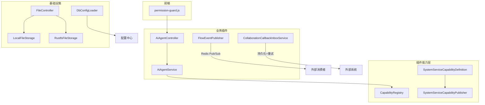
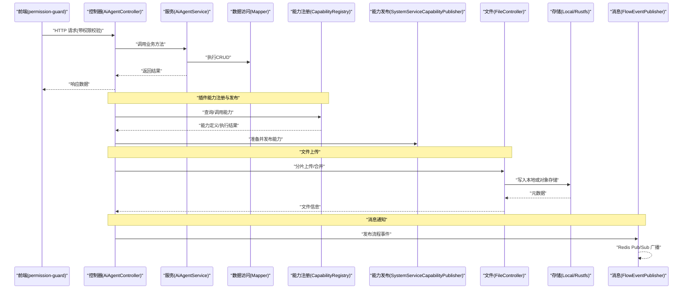
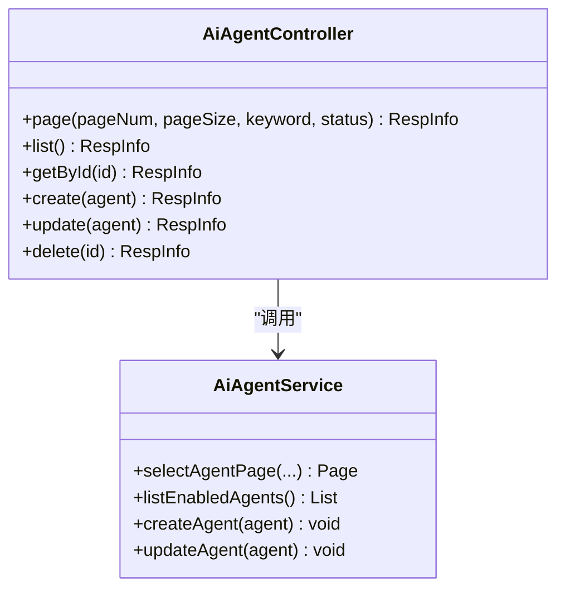
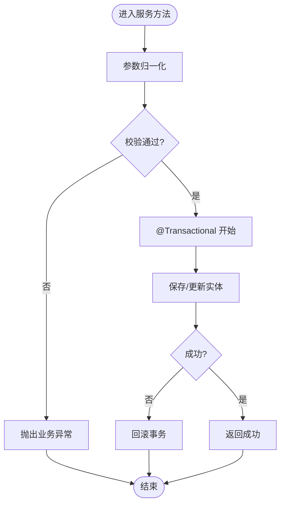
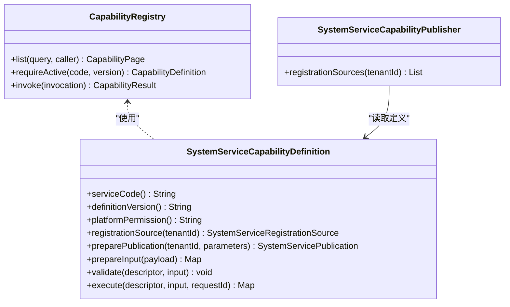
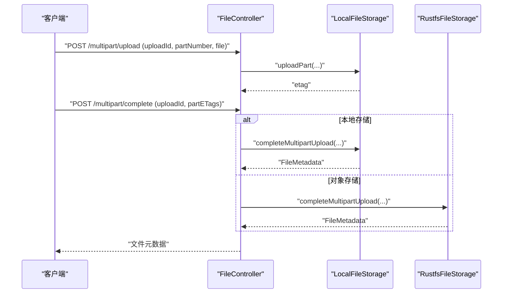
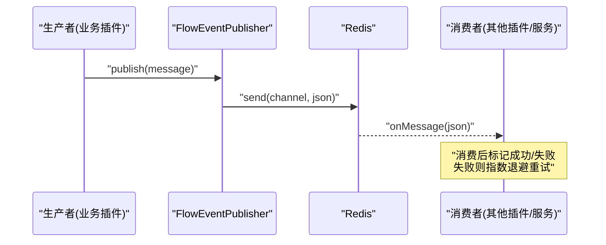
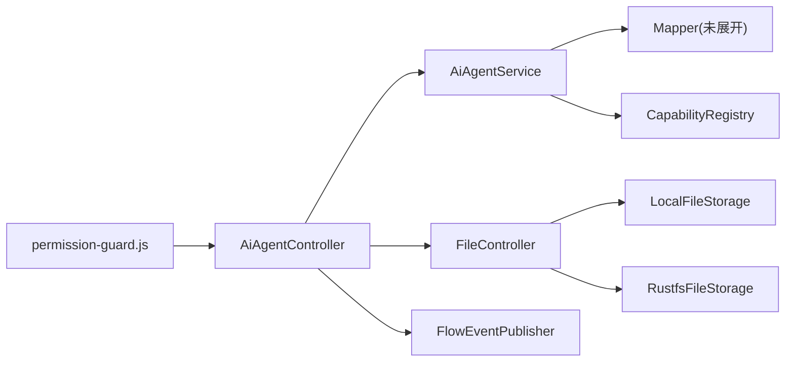

# Plugin插件开发

<cite>
**本文引用的文件**
- [AiAgentController.java](file://forge-server/forge-framework/forge-plugin-parent/forge-plugin-ai/src/main/java/com/mdframe/forge/plugin/ai/agent/controller/AiAgentController.java)
- [AiAgentService.java](file://forge-server/forge-framework/forge-plugin-parent/forge-plugin-ai/src/main/java/com/mdframe/forge/plugin/ai/agent/service/AiAgentService.java)
- [CapabilityRegistry.java](file://forge-server/forge-framework/forge-plugin-parent/forge-plugin-capability-parent/forge-plugin-capability-core/src/main/java/com/mdframe/forge/plugin/capability/registry/CapabilityRegistry.java)
- [SystemServiceCapabilityDefinition.java](file://forge-server/forge-framework/forge-plugin-parent/forge-plugin-capability-parent/forge-plugin-capability-actions/src/main/java/com/mdframe/forge/plugin/capability/secureaction/system/SystemServiceCapabilityDefinition.java)
- [SystemServiceRegistrationSource.java](file://forge-server/forge-framework/forge-plugin-parent/forge-plugin-capability-parent/forge-plugin-capability-actions/src/main/java/com/mdframe/forge/plugin/capability/secureaction/system/SystemServiceRegistrationSource.java)
- [SystemServiceCapabilityPublisher.java](file://forge-server/forge-framework/forge-plugin-parent/forge-plugin-capability-parent/forge-plugin-capability-actions/src/main/java/com/mdframe/forge/plugin/capability/secureaction/system/SystemServiceCapabilityPublisher.java)
- [FlowEventPublisher.java](file://forge-server/forge-framework/forge-plugin-parent/forge-plugin-flow/src/main/java/com/mdframe/forge/starter/flow/event/FlowEventPublisher.java)
- [CollaborationCallbackInboxService.java](file://forge-server/forge-framework/forge-plugin-parent/forge-plugin-collaboration/src/main/java/com/mdframe/forge/plugin/collaboration/service/CollaborationCallbackInboxService.java)
- [FileController.java](file://forge-server/forge-framework/forge-starter-parent/forge-starter-file/src/main/java/com/mdframe/forge/starter/file/controller/FileController.java)
- [LocalFileStorage.java](file://forge-server/forge-framework/forge-starter-parent/forge-starter-file/src/main/java/com/mdframe/forge/starter/file/storage/impl/LocalFileStorage.java)
- [RustfsFileStorage.java](file://forge-server/forge-framework/forge-starter-parent/forge-starter-file/src/main/java/com/mdframe/forge/starter/file/storage/impl/RustfsFileStorage.java)
- [permission-guard.js](file://forge-admin-ui/src/router/guards/permission-guard.js)
- [DbConfigLoader.java](file://forge-server/forge-framework/forge-starter-parent/forge-starter-config/src/main/java/com/mdframe/forge/starter/property/DbConfigLoader.java)
- [V1.0.3__add_logic_delete_to_platform_internal_tables.sql](file://forge-server/db/migration/V1.0.3__add_logic删除到平台内部表.sql)
- [sql-seeds.md](file://.agents/skills/forge-codegen-crud/references/sql-seeds.md)
</cite>

## 目录
1. [简介](#简介)
2. [项目结构](#项目结构)
3. [核心组件](#核心组件)
4. [架构总览](#架构总览)
5. [详细组件分析](#详细组件分析)
6. [依赖关系分析](#依赖关系分析)
7. [性能考虑](#性能考虑)
8. [故障排查指南](#故障排查指南)
9. [结论](#结论)
10. [附录](#附录)

## 简介
本文件面向在 Forge 框架下开发“Plugin 插件”的工程师，系统性说明插件的控制器层、服务层与数据访问层的组织方式；阐述插件注册机制、路由映射与权限控制集成；提供 CRUD、文件上传、消息通知等常见场景的开发示例；并给出数据库迁移脚本编写、SQL 映射配置与事务管理的最佳实践。同时覆盖插件间的数据共享、事件订阅与异步处理机制，帮助开发者快速构建可维护、可扩展的插件能力。

## 项目结构
Forge 采用多模块分层架构：
- 插件能力层：以 capability 为核心，定义能力接口、注册与发布机制，便于跨插件复用。
- 业务插件层：如 AI、Flow、Collaboration 等插件，各自实现控制器、服务与数据访问。
- 基础设施层：文件存储、配置加载、加密、启动守卫等通用能力。
- 前端工程：Vue 应用负责路由、权限校验与页面交互。

图表来源
- [CapabilityRegistry.java:10-17](file://forge-server/forge-framework/forge-plugin-parent/forge-plugin-capability-parent/forge-plugin-capability-core/src/main/java/com/mdframe/forge/plugin/capability/registry/CapabilityRegistry.java#L10-L17)
- [SystemServiceCapabilityDefinition.java:8-28](file://forge-server/forge-framework/forge-plugin-parent/forge-plugin-capability-parent/forge-plugin-capability-actions/src/main/java/com/mdframe/forge/plugin/capability/secureaction/system/SystemServiceCapabilityDefinition.java#L8-L28)
- [SystemServiceCapabilityPublisher.java:13-32](file://forge-server/forge-framework/forge-plugin-parent/forge-plugin-capability-parent/forge-plugin-capability-actions/src/main/java/com/mdframe/forge/plugin/capability/secureaction/system/SystemServiceCapabilityPublisher.java#L13-L32)
- [AiAgentController.java:14-59](file://forge-server/forge-framework/forge-plugin-parent/forge-plugin-ai/src/main/java/com/mdframe/forge/plugin/ai/agent/controller/AiAgentController.java#L14-L59)
- [AiAgentService.java:19-62](file://forge-server/forge-framework/forge-plugin-parent/forge-plugin-ai/src/main/java/com/mdframe/forge/plugin/ai/agent/service/AiAgentService.java#L19-L62)
- [FlowEventPublisher.java:14-116](file://forge-server/forge-framework/forge-plugin-parent/forge-plugin-flow/src/main/java/com/mdframe/forge/starter/flow/event/FlowEventPublisher.java#L14-L116)
- [CollaborationCallbackInboxService.java:107-136](file://forge-server/forge-framework/forge-plugin-parent/forge-plugin-collaboration/src/main/java/com/mdframe/forge/plugin/collaboration/service/CollaborationCallbackInboxService.java#L107-L136)
- [FileController.java:140-164](file://forge-server/forge-framework/forge-starter-parent/forge-starter-file/src/main/java/com/mdframe/forge/starter/file/controller/FileController.java#L140-L164)
- [LocalFileStorage.java:186-214](file://forge-server/forge-framework/forge-starter-parent/forge-starter-file/src/main/java/com/mdframe/forge/starter/file/storage/impl/LocalFileStorage.java#L186-L214)
- [RustfsFileStorage.java:230-261](file://forge-server/forge-framework/forge-starter-parent/forge-starter-file/src/main/java/com/mdframe/forge/starter/file/storage/impl/RustfsFileStorage.java#L230-L261)
- [permission-guard.js:56-66](file://forge-admin-ui/src/router/guards/permission-guard.js#L56-L66)
- [DbConfigLoader.java:14-44](file://forge-server/forge-framework/forge-starter-parent/forge-starter-config/src/main/java/com/mdframe/forge/starter/property/DbConfigLoader.java#L14-L44)

章节来源
- [AiAgentController.java:14-59](file://forge-server/forge-framework/forge-plugin-parent/forge-plugin-ai/src/main/java/com/mdframe/forge/plugin/ai/agent/controller/AiAgentController.java#L14-L59)
- [AiAgentService.java:19-62](file://forge-server/forge-framework/forge-plugin-parent/forge-plugin-ai/src/main/java/com/mdframe/forge/plugin/ai/agent/service/AiAgentService.java#L19-L62)
- [CapabilityRegistry.java:10-17](file://forge-server/forge-framework/forge-plugin-parent/forge-plugin-capability-parent/forge-plugin-capability-core/src/main/java/com/mdframe/forge/plugin/capability/registry/CapabilityRegistry.java#L10-L17)

## 核心组件
- 控制器层（Controller）
  - 统一 REST 风格接口，使用分页、列表、详情、创建、更新、删除等标准方法。
  - 通过注解进行加解密与权限控制，保证接口安全。
- 服务层（Service）
  - 封装业务逻辑，包含参数归一化、校验、事务管理、跨模块调用。
  - 通过 MyBatis-Plus 的 ServiceImpl 简化数据访问。
- 数据访问层（Mapper）
  - 基于 MyBatis-Plus Mapper 进行 SQL 映射与分页查询。
  - 结合迁移脚本保障数据结构一致性。

章节来源
- [AiAgentController.java:14-59](file://forge-server/forge-framework/forge-plugin-parent/forge-plugin-ai/src/main/java/com/mdframe/forge/plugin/ai/agent/controller/AiAgentController.java#L14-L59)
- [AiAgentService.java:19-62](file://forge-server/forge-framework/forge-plugin-parent/forge-plugin-ai/src/main/java/com/mdframe/forge/plugin/ai/agent/service/AiAgentService.java#L19-L62)

## 架构总览
下图展示从前端到后端再到基础设施与外部系统的完整链路，包括插件能力注册、CRUD 流程、文件上传与消息通知。

图表来源
- [AiAgentController.java:14-59](file://forge-server/forge-framework/forge-plugin-parent/forge-plugin-ai/src/main/java/com/mdframe/forge/plugin/ai/agent/controller/AiAgentController.java#L14-L59)
- [AiAgentService.java:19-62](file://forge-server/forge-framework/forge-plugin-parent/forge-plugin-ai/src/main/java/com/mdframe/forge/plugin/ai/agent/service/AiAgentService.java#L19-L62)
- [CapabilityRegistry.java:10-17](file://forge-server/forge-framework/forge-plugin-parent/forge-plugin-capability-parent/forge-plugin-capability-core/src/main/java/com/mdframe/forge/plugin/capability/registry/CapabilityRegistry.java#L10-L17)
- [SystemServiceCapabilityPublisher.java:13-32](file://forge-server/forge-framework/forge-plugin-parent/forge-plugin-capability-parent/forge-plugin-capability-actions/src/main/java/com/mdframe/forge/plugin/capability/secureaction/system/SystemServiceCapabilityPublisher.java#L13-L32)
- [FileController.java:140-164](file://forge-server/forge-framework/forge-starter-parent/forge-starter-file/src/main/java/com/mdframe/forge/starter/file/controller/FileController.java#L140-L164)
- [LocalFileStorage.java:186-214](file://forge-server/forge-framework/forge-starter-parent/forge-starter-file/src/main/java/com/mdframe/forge/starter/file/storage/impl/LocalFileStorage.java#L186-L214)
- [RustfsFileStorage.java:230-261](file://forge-server/forge-framework/forge-starter-parent/forge-starter-file/src/main/java/com/mdframe/forge/starter/file/storage/impl/RustfsFileStorage.java#L230-L261)
- [FlowEventPublisher.java:14-116](file://forge-server/forge-framework/forge-plugin-parent/forge-plugin-flow/src/main/java/com/mdframe/forge/starter/flow/event/FlowEventPublisher.java#L14-L116)

## 详细组件分析

### 控制器层：REST 接口与权限集成
- 职责
  - 接收 HTTP 请求，参数校验，调用服务层，统一返回格式。
  - 使用注解完成接口级加解密与权限控制。
- 关键点
  - 分页、列表、详情、增删改的标准接口模式。
  - 权限由前端路由守卫与后端注解共同保障。

图表来源
- [AiAgentController.java:14-59](file://forge-server/forge-framework/forge-plugin-parent/forge-plugin-ai/src/main/java/com/mdframe/forge/plugin/ai/agent/controller/AiAgentController.java#L14-L59)
- [AiAgentService.java:19-62](file://forge-server/forge-framework/forge-plugin-parent/forge-plugin-ai/src/main/java/com/mdframe/forge/plugin/ai/agent/service/AiAgentService.java#L19-L62)

章节来源
- [AiAgentController.java:14-59](file://forge-server/forge-framework/forge-plugin-parent/forge-plugin-ai/src/main/java/com/mdframe/forge/plugin/ai/agent/controller/AiAgentController.java#L14-L59)
- [permission-guard.js:56-66](file://forge-admin-ui/src/router/guards/permission-guard.js#L56-L66)

### 服务层：事务管理与业务校验
- 职责
  - 封装复杂业务逻辑，确保数据一致性与完整性。
  - 使用事务注解包裹写操作，失败回滚。
- 关键点
  - 参数归一化、状态校验、关联策略校验。
  - 异常统一抛出，便于上层捕获与处理。

图表来源
- [AiAgentService.java:44-62](file://forge-server/forge-framework/forge-plugin-parent/forge-plugin-ai/src/main/java/com/mdframe/forge/plugin/ai/agent/service/AiAgentService.java#L44-L62)

章节来源
- [AiAgentService.java:19-62](file://forge-server/forge-framework/forge-plugin-parent/forge-plugin-ai/src/main/java/com/mdframe/forge/plugin/ai/agent/service/AiAgentService.java#L19-L62)

### 数据访问层：MyBatis-Plus 与迁移脚本
- 职责
  - 通过 Mapper 进行 SQL 映射与分页查询。
  - 配合 Flyway 迁移脚本保证数据库结构演进。
- 关键点
  - 迁移脚本遵循不可变历史原则，新增版本修正变更。
  - 使用条件建表与幂等插入避免重复执行问题。

章节来源
- [sql-seeds.md:1-11](file://.agents/skills/forge-codegen-crud/references/sql-seeds.md#L1-L11)
- [V1.0.3__add_logic_delete_to_platform_internal_tables.sql:91-102](file://forge-server/db/migration/V1.0.3__add_logic删除到平台内部表.sql#L91-L102)

### 插件注册机制：能力定义与发布
- 能力注册
  - CapabilityRegistry 提供能力列表、强依赖获取与调用入口。
- 能力定义
  - SystemServiceCapabilityDefinition 描述能力元数据、权限、输入输出与执行流程。
- 能力发布
  - SystemServiceCapabilityPublisher 将定义转换为注册源并推送到目录服务。

图表来源
- [CapabilityRegistry.java:10-17](file://forge-server/forge-framework/forge-plugin-parent/forge-plugin-capability-parent/forge-plugin-capability-core/src/main/java/com/mdframe/forge/plugin/capability/registry/CapabilityRegistry.java#L10-L17)
- [SystemServiceCapabilityDefinition.java:8-28](file://forge-server/forge-framework/forge-plugin-parent/forge-plugin-capability-parent/forge-plugin-capability-actions/src/main/java/com/mdframe/forge/plugin/capability/secureaction/system/SystemServiceCapabilityDefinition.java#L8-L28)
- [SystemServiceCapabilityPublisher.java:13-32](file://forge-server/forge-framework/forge-plugin-parent/forge-plugin-capability-parent/forge-plugin-capability-actions/src/main/java/com/mdframe/forge/plugin/capability/secureaction/system/SystemServiceCapabilityPublisher.java#L13-L32)

章节来源
- [CapabilityRegistry.java:10-17](file://forge-server/forge-framework/forge-plugin-parent/forge-plugin-capability-parent/forge-plugin-capability-core/src/main/java/com/mdframe/forge/plugin/capability/registry/CapabilityRegistry.java#L10-L17)
- [SystemServiceCapabilityDefinition.java:8-28](file://forge-server/forge-framework/forge-plugin-parent/forge-plugin-capability-parent/forge-plugin-capability-actions/src/main/java/com/mdframe/forge/plugin/capability/secureaction/system/SystemServiceCapabilityDefinition.java#L8-L28)
- [SystemServiceCapabilityPublisher.java:13-32](file://forge-server/forge-framework/forge-plugin-parent/forge-plugin-capability-parent/forge-plugin-capability-actions/src/main/java/com/mdframe/forge/plugin/capability/secureaction/system/SystemServiceCapabilityPublisher.java#L13-L32)

### 路由映射与权限控制集成
- 后端
  - 控制器使用注解声明路径与方法，统一返回体。
  - 权限注解在后端拦截器中生效，结合 Sa-Token 等机制。
- 前端
  - 路由守卫根据用户权限动态判断是否允许访问目标路由。

章节来源
- [AiAgentController.java:14-59](file://forge-server/forge-framework/forge-plugin-parent/forge-plugin-ai/src/main/java/com/mdframe/forge/plugin/ai/agent/controller/AiAgentController.java#L14-L59)
- [permission-guard.js:56-66](file://forge-admin-ui/src/router/guards/permission-guard.js#L56-L66)

### 文件上传：分片上传与存储适配
- 控制器
  - 提供分片上传与合并接口，支持指定存储类型。
- 存储实现
  - 本地存储：合并分片、清理临时文件。
  - 对象存储：分片上传、完成合并、生成元数据。

图表来源
- [FileController.java:140-164](file://forge-server/forge-framework/forge-starter-parent/forge-starter-file/src/main/java/com/mdframe/forge/starter/file/controller/FileController.java#L140-L164)
- [LocalFileStorage.java:186-214](file://forge-server/forge-framework/forge-starter-parent/forge-starter-file/src/main/java/com/mdframe/forge/starter/file/storage/impl/LocalFileStorage.java#L186-L214)
- [RustfsFileStorage.java:230-261](file://forge-server/forge-framework/forge-starter-parent/forge-starter-file/src/main/java/com/mdframe/forge/starter/file/storage/impl/RustfsFileStorage.java#L230-L261)

章节来源
- [FileController.java:140-164](file://forge-server/forge-framework/forge-starter-parent/forge-starter-file/src/main/java/com/mdframe/forge/starter/file/controller/FileController.java#L140-L164)
- [LocalFileStorage.java:186-214](file://forge-server/forge-framework/forge-starter-parent/forge-starter-file/src/main/java/com/mdframe/forge/starter/file/storage/impl/LocalFileStorage.java#L186-L214)
- [RustfsFileStorage.java:230-261](file://forge-server/forge-framework/forge-starter-parent/forge-starter-file/src/main/java/com/mdframe/forge/starter/file/storage/impl/RustfsFileStorage.java#L230-L261)

### 消息通知：异步事件与重试机制
- 事件发布
  - FlowEventPublisher 将流程事件异步发布到 Redis 频道，支持精准与全量订阅。
- 回调处理
  - CollaborationCallbackInboxService 提供事件领取、标记成功/失败与指数退避重试。

图表来源
- [FlowEventPublisher.java:14-116](file://forge-server/forge-framework/forge-plugin-parent/forge-plugin-flow/src/main/java/com/mdframe/forge/starter/flow/event/FlowEventPublisher.java#L14-L116)
- [CollaborationCallbackInboxService.java:107-136](file://forge-server/forge-framework/forge-plugin-parent/forge-plugin-collaboration/src/main/java/com/mdframe/forge/plugin/collaboration/service/CollaborationCallbackInboxService.java#L107-L136)

章节来源
- [FlowEventPublisher.java:14-116](file://forge-server/forge-framework/forge-plugin-parent/forge-plugin-flow/src/main/java/com/mdframe/forge/starter/flow/event/FlowEventPublisher.java#L14-L116)
- [CollaborationCallbackInboxService.java:107-136](file://forge-server/forge-framework/forge-plugin-parent/forge-plugin-collaboration/src/main/java/com/mdframe/forge/plugin/collaboration/service/CollaborationCallbackInboxService.java#L107-L136)

### 插件间数据共享与配置加载
- 配置加载
  - DbConfigLoader 统一从数据库加载配置，合并分组 JSON，生成驼峰键兼容。
- 数据共享
  - 通过能力注册与发布机制，插件间共享能力定义与执行上下文。

章节来源
- [DbConfigLoader.java:14-44](file://forge-server/forge-framework/forge-starter-parent/forge-starter-config/src/main/java/com/mdframe/forge/starter/property/DbConfigLoader.java#L14-L44)
- [CapabilityRegistry.java:10-17](file://forge-server/forge-framework/forge-plugin-parent/forge-plugin-capability-parent/forge-plugin-capability-core/src/main/java/com/mdframe/forge/plugin/capability/registry/CapabilityRegistry.java#L10-L17)

## 依赖关系分析
- 控制器依赖服务，服务依赖数据访问与能力注册。
- 文件上传依赖存储实现，支持本地与对象存储。
- 消息通知依赖 Redis，具备可选依赖特性。
- 前端路由守卫依赖权限模型，与后端权限注解协同。

图表来源
- [AiAgentController.java:14-59](file://forge-server/forge-framework/forge-plugin-parent/forge-plugin-ai/src/main/java/com/mdframe/forge/plugin/ai/agent/controller/AiAgentController.java#L14-L59)
- [AiAgentService.java:19-62](file://forge-server/forge-framework/forge-plugin-parent/forge-plugin-ai/src/main/java/com/mdframe/forge/plugin/ai/agent/service/AiAgentService.java#L19-L62)
- [CapabilityRegistry.java:10-17](file://forge-server/forge-framework/forge-plugin-parent/forge-plugin-capability-parent/forge-plugin-capability-core/src/main/java/com/mdframe/forge/plugin/capability/registry/CapabilityRegistry.java#L10-L17)
- [FileController.java:140-164](file://forge-server/forge-framework/forge-starter-parent/forge-starter-file/src/main/java/com/mdframe/forge/starter/file/controller/FileController.java#L140-L164)
- [LocalFileStorage.java:186-214](file://forge-server/forge-framework/forge-starter-parent/forge-starter-file/src/main/java/com/mdframe/forge/starter/file/storage/impl/LocalFileStorage.java#L186-L214)
- [RustfsFileStorage.java:230-261](file://forge-server/forge-framework/forge-starter-parent/forge-starter-file/src/main/java/com/mdframe/forge/starter/file/storage/impl/RustfsFileStorage.java#L230-L261)
- [FlowEventPublisher.java:14-116](file://forge-server/forge-framework/forge-plugin-parent/forge-plugin-flow/src/main/java/com/mdframe/forge/starter/flow/event/FlowEventPublisher.java#L14-L116)
- [permission-guard.js:56-66](file://forge-admin-ui/src/router/guards/permission-guard.js#L56-L66)

## 性能考虑
- 分页与索引
  - 列表查询使用分页，合理设计索引提升查询性能。
- 事务边界
  - 仅对写操作开启事务，减少锁竞争与回滚成本。
- 异步解耦
  - 使用 Redis Pub/Sub 异步发布事件，降低主流程延迟。
- 文件上传
  - 分片上传提升大文件稳定性与并发能力，合并时清理临时文件释放空间。

[本节为通用指导，不直接分析具体文件]

## 故障排查指南
- 权限问题
  - 检查前端路由守卫是否放行目标路径，确认后端权限注解是否正确配置。
- 事务回滚
  - 确认服务方法是否标注事务注解，异常是否被正确抛出。
- 文件上传失败
  - 核对分片顺序与 ETag，检查存储实现日志与磁盘/对象存储空间。
- 事件丢失
  - 确认 Redis 连接与频道命名，检查消费者订阅与重试策略。

章节来源
- [permission-guard.js:56-66](file://forge-admin-ui/src/router/guards/permission-guard.js#L56-L66)
- [AiAgentService.java:44-62](file://forge-server/forge-framework/forge-plugin-parent/forge-plugin-ai/src/main/java/com/mdframe/forge/plugin/ai/agent/service/AiAgentService.java#L44-L62)
- [FileController.java:140-164](file://forge-server/forge-framework/forge-starter-parent/forge-starter-file/src/main/java/com/mdframe/forge/starter/file/controller/FileController.java#L140-L164)
- [FlowEventPublisher.java:14-116](file://forge-server/forge-framework/forge-plugin-parent/forge-plugin-flow/src/main/java/com/mdframe/forge/starter/flow/event/FlowEventPublisher.java#L14-L116)

## 结论
Forge 插件体系通过清晰的分层与能力抽象，实现了高内聚、低耦合的扩展机制。控制器、服务与数据访问层各司其职，能力注册与发布保障了插件间的解耦与复用；文件上传与消息通知提供了稳定的基础设施支撑；结合迁移脚本与事务管理，确保了数据的可演进性与一致性。按照本文的实践建议，开发者可以快速构建高质量、可维护的插件功能。

## 附录
- 开发清单
  - 控制器：定义 REST 接口，统一返回体，启用加解密与权限注解。
  - 服务：封装业务逻辑，添加事务注解，完善参数校验与异常处理。
  - 数据访问：使用 MyBatis-Plus Mapper，编写幂等迁移脚本。
  - 能力：实现能力定义与发布，接入能力注册中心。
  - 文件：选择合适存储实现，使用分片上传与合并。
  - 消息：发布事件到 Redis，实现消费者与重试机制。
- 参考路径
  - 控制器与服务示例：[AiAgentController.java:14-59](file://forge-server/forge-framework/forge-plugin-parent/forge-plugin-ai/src/main/java/com/mdframe/forge/plugin/ai/agent/controller/AiAgentController.java#L14-L59)、[AiAgentService.java:19-62](file://forge-server/forge-framework/forge-plugin-parent/forge-plugin-ai/src/main/java/com/mdframe/forge/plugin/ai/agent/service/AiAgentService.java#L19-L62)
  - 能力注册与发布：[CapabilityRegistry.java:10-17](file://forge-server/forge-framework/forge-plugin-parent/forge-plugin-capability-parent/forge-plugin-capability-core/src/main/java/com/mdframe/forge/plugin/capability/registry/CapabilityRegistry.java#L10-L17)、[SystemServiceCapabilityPublisher.java:13-32](file://forge-server/forge-framework/forge-plugin-parent/forge-plugin-capability-parent/forge-plugin-capability-actions/src/main/java/com/mdframe/forge/plugin/capability/secureaction/system/SystemServiceCapabilityPublisher.java#L13-L32)
  - 文件上传：[FileController.java:140-164](file://forge-server/forge-framework/forge-starter-parent/forge-starter-file/src/main/java/com/mdframe/forge/starter/file/controller/FileController.java#L140-L164)
  - 消息通知：[FlowEventPublisher.java:14-116](file://forge-server/forge-framework/forge-plugin-parent/forge-plugin-flow/src/main/java/com/mdframe/forge/starter/flow/event/FlowEventPublisher.java#L14-L116)
  - 迁移规范：[sql-seeds.md:1-11](file://.agents/skills/forge-codegen-crud/references/sql-seeds.md#L1-L11)