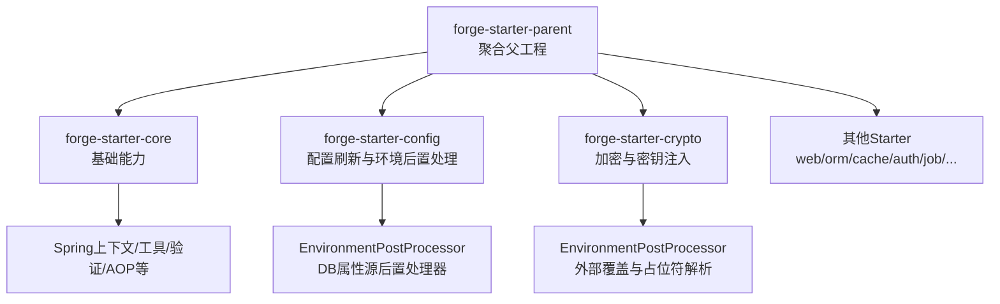
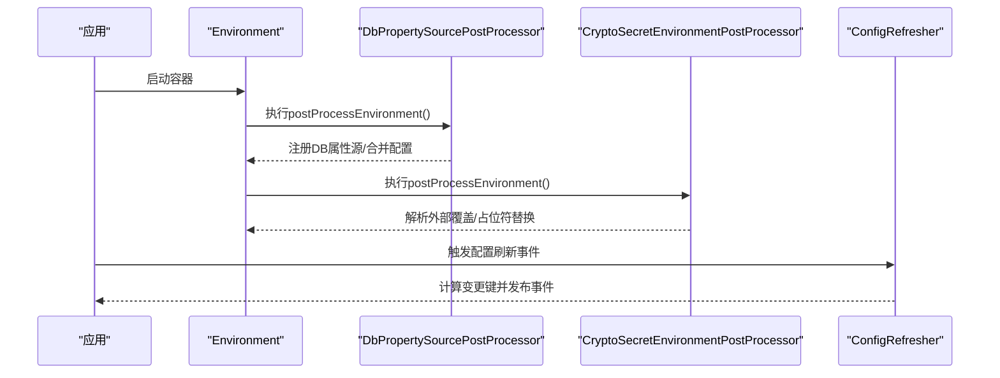
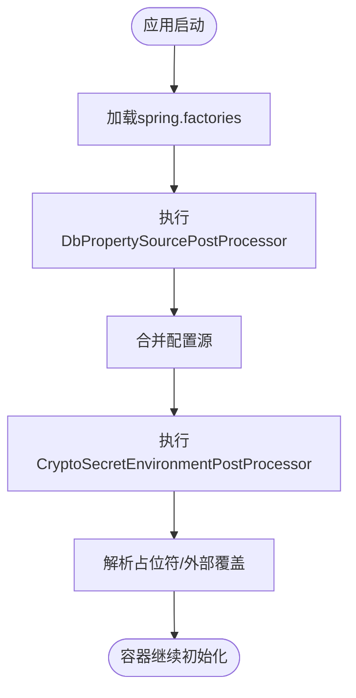
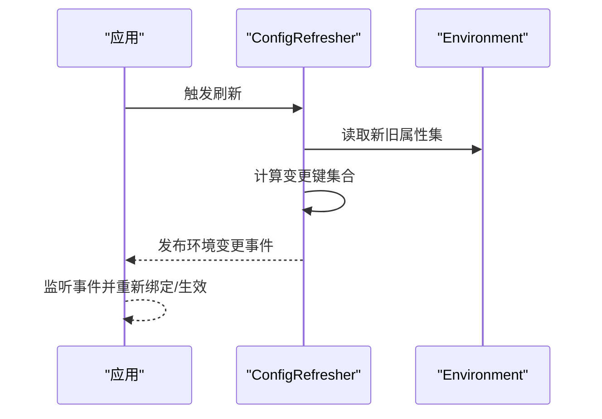
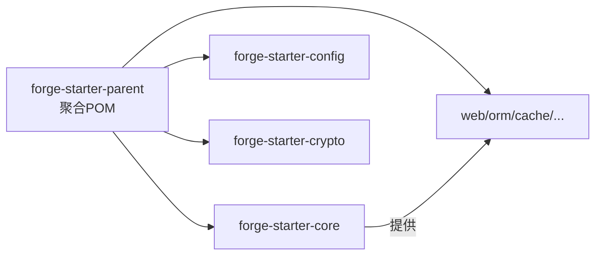
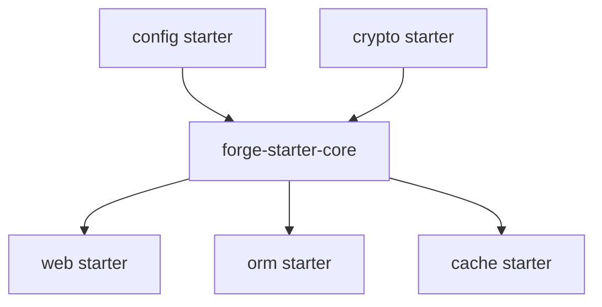

# Starter插件开发

<cite>
**本文引用的文件**
- [forge-starter-parent/pom.xml](file://forge-server/forge-framework/forge-starter-parent/pom.xml)
- [forge-starter-core/pom.xml](file://forge-server/forge-framework/forge-starter-parent/forge-starter-core/pom.xml)
- [spring.factories (config)](file://forge-server/forge-framework/forge-starter-parent/forge-starter-config/src/main/resources/META-INF/spring.factories)
- [spring.factories (crypto)](file://forge-server/forge-framework/forge-starter-parent/forge-starter-crypto/src/main/resources/META-INF/spring.factories)
- [CryptoSecretEnvironmentPostProcessor.java](file://forge-server/forge-framework/forge-starter-parent/forge-starter-crypto/src/main/java/com/mdframe/forge/starter/crypto/config/CryptoSecretEnvironmentPostProcessor.java)
- [ConfigRefresher.java](file://forge-server/forge-framework/forge-starter-parent/forge-starter-config/src/main/java/com/mdframe/forge/starter/property/refresh/ConfigRefresher.java)
</cite>

## 目录
1. [简介](#简介)
2. [项目结构](#项目结构)
3. [核心组件](#核心组件)
4. [架构总览](#架构总览)
5. [详细组件分析](#详细组件分析)
6. [依赖分析](#依赖分析)
7. [性能考虑](#性能考虑)
8. [故障排查指南](#故障排查指南)
9. [结论](#结论)
10. [附录](#附录)

## 简介
本指南面向希望在 Forge 平台中开发 Starter 插件的工程师，系统讲解从项目结构搭建、Maven 配置与依赖管理，到自动装配机制、条件注解使用、配置属性绑定、单元测试与集成测试、性能优化、发布到 Maven 仓库以及版本兼容性管理的完整流程。内容基于仓库内现有 Starter 实现（如 core、config、crypto 等）进行提炼与总结，确保可落地、可复用。

## 项目结构
Forge 的 Starter 以多模块方式组织在 forge-starter-parent 下，每个 Starter 是一个独立的 Maven 模块，对外暴露最小化的能力边界，并通过 Spring Boot 自动装配机制被应用按需启用。

图表来源
- [forge-starter-parent/pom.xml:15-39](file://forge-server/forge-framework/forge-starter-parent/pom.xml#L15-L39)

章节来源
- [forge-starter-parent/pom.xml:1-42](file://forge-server/forge-framework/forge-starter-parent/pom.xml#L1-L42)

## 核心组件
- 基础能力层：提供通用工具、异常体系、序列化、AOP、验证等，作为各 Starter 的公共依赖。
- 配置与刷新：通过 EnvironmentPostProcessor 在启动早期加载并合并配置，支持动态刷新。
- 安全与加解密：在环境初始化阶段注入或覆盖敏感配置，避免硬编码。
- 业务扩展点：通过注解、拦截器、AOP、监听器等扩展点，将能力以“即插即用”的方式接入应用。

章节来源
- [forge-starter-core/pom.xml:14-122](file://forge-server/forge-framework/forge-starter-parent/forge-starter-core/pom.xml#L14-L122)
- [spring.factories (config):1-3](file://forge-server/forge-framework/forge-starter-parent/forge-starter-config/src/main/resources/META-INF/spring.factories#L1-L3)
- [spring.factories (crypto):1-3](file://forge-server/forge-framework/forge-starter-parent/forge-starter-crypto/src/main/resources/META-INF/spring.factories#L1-L3)

## 架构总览
下图展示了 Starter 在 Spring Boot 启动过程中的关键阶段与交互关系，重点体现 EnvironmentPostProcessor 的早期介入、配置合并与刷新机制。

图表来源
- [spring.factories (config):1-3](file://forge-server/forge-framework/forge-starter-parent/forge-starter-config/src/main/resources/META-INF/spring.factories#L1-L3)
- [spring.factories (crypto):1-3](file://forge-server/forge-framework/forge-starter-parent/forge-starter-crypto/src/main/resources/META-INF/spring.factories#L1-L3)
- [CryptoSecretEnvironmentPostProcessor.java:119-156](file://forge-server/forge-framework/forge-starter-parent/forge-starter-crypto/src/main/java/com/mdframe/forge/starter/crypto/config/CryptoSecretEnvironmentPostProcessor.java#L119-L156)
- [ConfigRefresher.java:124-156](file://forge-server/forge-framework/forge-starter-parent/forge-starter-config/src/main/java/com/mdframe/forge/starter/property/refresh/ConfigRefresher.java#L124-L156)

## 详细组件分析

### 自动装配与环境后置处理
- 通过 META-INF/spring.factories 声明 EnvironmentPostProcessor，实现在 Spring 容器初始化前对 Environment 的增强与配置合并。
- config 模块提供数据库属性源的后置处理器，用于将配置集中化存储并动态加载。
- crypto 模块提供密钥相关的环境后置处理，支持外部覆盖与占位符解析，保证敏感信息不落地。

图表来源
- [spring.factories (config):1-3](file://forge-server/forge-framework/forge-starter-parent/forge-starter-config/src/main/resources/META-INF/spring.factories#L1-L3)
- [spring.factories (crypto):1-3](file://forge-server/forge-framework/forge-starter-parent/forge-starter-crypto/src/main/resources/META-INF/spring.factories#L1-L3)
- [CryptoSecretEnvironmentPostProcessor.java:119-156](file://forge-server/forge-framework/forge-starter-parent/forge-starter-crypto/src/main/java/com/mdframe/forge/starter/crypto/config/CryptoSecretEnvironmentPostProcessor.java#L119-L156)

章节来源
- [spring.factories (config):1-3](file://forge-server/forge-framework/forge-starter-parent/forge-starter-config/src/main/resources/META-INF/spring.factories#L1-L3)
- [spring.factories (crypto):1-3](file://forge-server/forge-framework/forge-starter-parent/forge-starter-crypto/src/main/resources/META-INF/spring.factories#L1-L3)
- [CryptoSecretEnvironmentPostProcessor.java:119-156](file://forge-server/forge-framework/forge-starter-parent/forge-starter-crypto/src/main/java/com/mdframe/forge/starter/crypto/config/CryptoSecretEnvironmentPostProcessor.java#L119-L156)

### 配置属性绑定与动态刷新
- 通过 @ConfigurationProperties 或自定义属性类完成配置绑定。
- 结合 ConfigRefresher 计算变更键并发布环境变更事件，驱动运行时热更新。

图表来源
- [ConfigRefresher.java:124-156](file://forge-server/forge-framework/forge-starter-parent/forge-starter-config/src/main/java/com/mdframe/forge/starter/property/refresh/ConfigRefresher.java#L124-L156)

章节来源
- [ConfigRefresher.java:124-156](file://forge-server/forge-framework/forge-starter-parent/forge-starter-config/src/main/java/com/mdframe/forge/starter/property/refresh/ConfigRefresher.java#L124-L156)

### 依赖管理与Maven工程组织
- 使用父 POM 聚合所有 Starter 模块，统一版本与构建策略。
- 各 Starter 仅引入必要依赖，保持最小化边界；core 模块提供通用依赖，减少重复。

图表来源
- [forge-starter-parent/pom.xml:15-39](file://forge-server/forge-framework/forge-starter-parent/pom.xml#L15-L39)

章节来源
- [forge-starter-parent/pom.xml:1-42](file://forge-server/forge-framework/forge-starter-parent/pom.xml#L1-L42)
- [forge-starter-core/pom.xml:14-122](file://forge-server/forge-framework/forge-starter-parent/forge-starter-core/pom.xml#L14-L122)

### 条件注解与自动装配最佳实践
- 使用 @ConditionalOnXxx 控制 Bean 的创建时机，避免不必要的资源占用。
- 将易变的外部依赖（如 Redis、消息队列、第三方 SDK）封装为独立 Starter，按需引入。
- 通过 spring.factories 或新的自动装配入口（如 org.springframework.boot.autoconfigure.AutoConfiguration.imports）声明自动装配类。

[本节为概念性说明，不直接分析具体文件]

### 从简单到复杂的示例路径
- 简单功能模块：参考 core 中的通用能力（异常、序列化、AOP、验证），新建一个轻量 Starter，仅包含配置类与少量 Bean。
- 复杂业务服务集成：参考 config 与 crypto 的 EnvironmentPostProcessor 模式，在启动早期完成外部资源连接与配置注入，再暴露服务接口供业务调用。

[本节为概念性说明，不直接分析具体文件]

## 依赖分析
- 耦合度：core 作为基础层被多数 Starter 依赖，形成稳定的内核；上层 Starter 尽量低耦合，通过接口或注解扩展。
- 循环依赖：应避免 Starter 之间相互依赖，必要时抽取公共抽象到 core。
- 外部依赖：优先使用 Spring Boot 官方 Starter，减少冲突；对第三方库采用适配层隔离。

图表来源
- [forge-starter-parent/pom.xml:15-39](file://forge-server/forge-framework/forge-starter-parent/pom.xml#L15-L39)
- [forge-starter-core/pom.xml:14-122](file://forge-server/forge-framework/forge-starter-parent/forge-starter-core/pom.xml#L14-L122)

章节来源
- [forge-starter-parent/pom.xml:1-42](file://forge-server/forge-framework/forge-starter-parent/pom.xml#L1-L42)
- [forge-starter-core/pom.xml:14-122](file://forge-server/forge-framework/forge-starter-parent/forge-starter-core/pom.xml#L14-L122)

## 性能考虑
- 启动期优化：将非必要的自动装配推迟到首次使用时再初始化；避免在 EnvironmentPostProcessor 中进行重型 I/O。
- 配置刷新：仅在必要时触发刷新，批量变更时合并事件，降低广播开销。
- 缓存与懒加载：对热点数据与远程配置增加本地缓存；对昂贵对象采用懒加载。
- 资源隔离：不同 Starter 间避免共享全局状态，防止竞争与内存泄漏。

[本节为通用指导，不直接分析具体文件]

## 故障排查指南
- 配置未生效：检查 spring.factories 是否正确声明 EnvironmentPostProcessor；确认属性源优先级与覆盖顺序。
- 占位符解析失败：核对外部覆盖是否已正确传入；确认未被过滤的属性源名称。
- 刷新无效：确认是否触发了刷新事件；监听器是否正确订阅并重新绑定属性。

章节来源
- [spring.factories (config):1-3](file://forge-server/forge-framework/forge-starter-parent/forge-starter-config/src/main/resources/META-INF/spring.factories#L1-L3)
- [spring.factories (crypto):1-3](file://forge-server/forge-framework/forge-starter-parent/forge-starter-crypto/src/main/resources/META-INF/spring.factories#L1-L3)
- [CryptoSecretEnvironmentPostProcessor.java:119-156](file://forge-server/forge-framework/forge-starter-parent/forge-starter-crypto/src/main/java/com/mdframe/forge/starter/crypto/config/CryptoSecretEnvironmentPostProcessor.java#L119-L156)
- [ConfigRefresher.java:124-156](file://forge-server/forge-framework/forge-starter-parent/forge-starter-config/src/main/java/com/mdframe/forge/starter/property/refresh/ConfigRefresher.java#L124-L156)

## 结论
Forge 的 Starter 体系以“最小可用、按需启用”为核心原则，通过 EnvironmentPostProcessor 在启动早期完成配置注入与合并，配合动态刷新机制实现运行时弹性。遵循模块化、低耦合、高内聚的设计，可有效提升可维护性与可扩展性。建议在新特性开发中优先复用 core 能力，并以独立 Starter 形式对外暴露，便于版本治理与生态演进。

## 附录
- 单元测试：针对配置绑定与刷新逻辑编写用例，模拟不同属性源与覆盖场景。
- 集成测试：在真实环境中验证自动装配、Bean 生命周期与外部依赖连通性。
- 发布与版本兼容：通过父 POM 统一管理版本；升级时关注 breaking changes 并提供迁移指引。

[本节为通用指导，不直接分析具体文件]