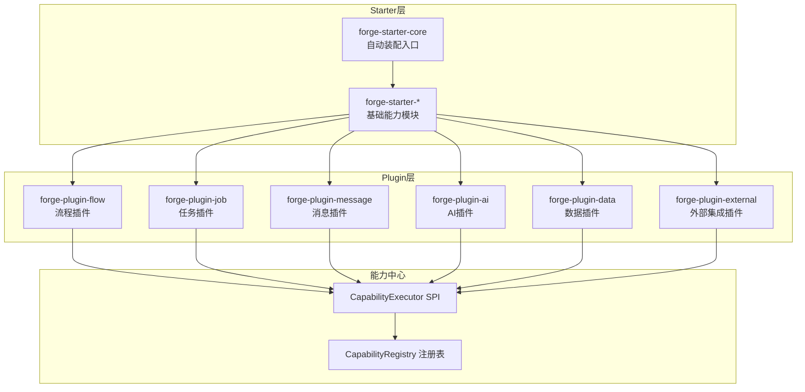
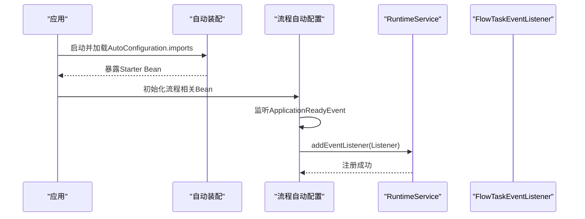
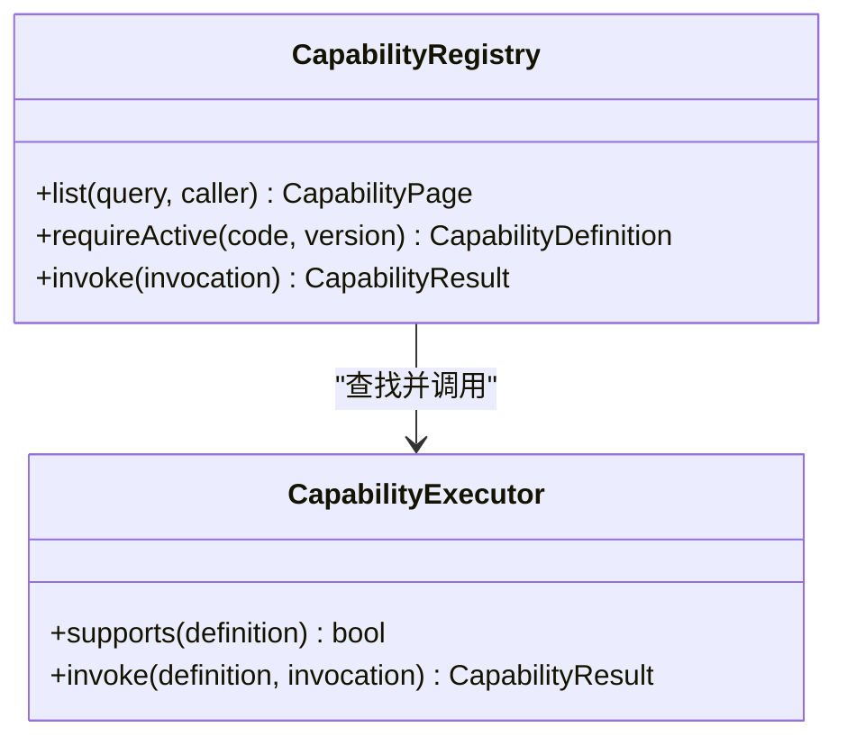
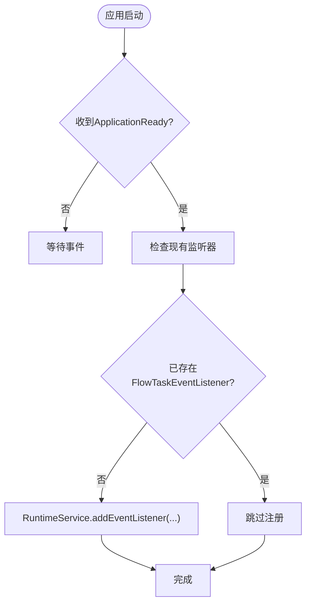
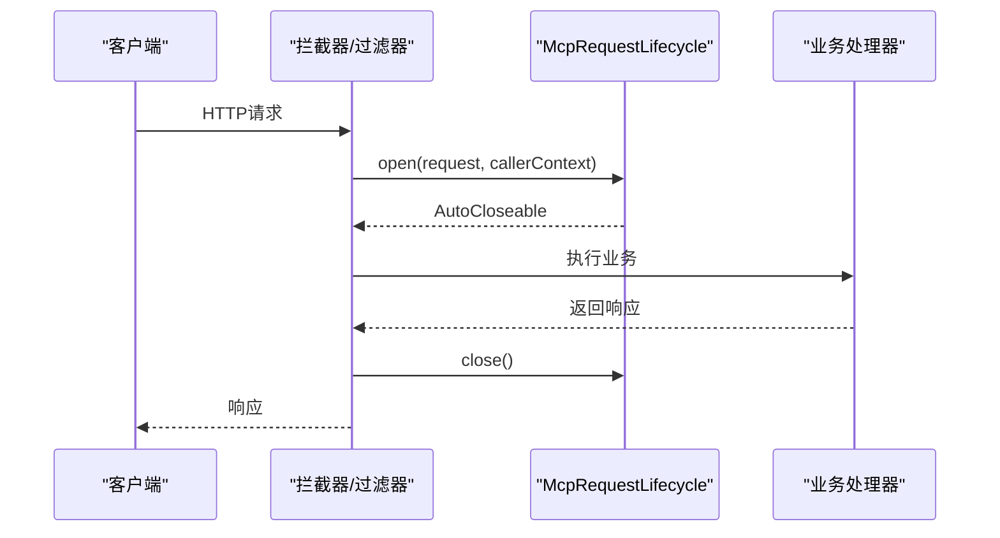
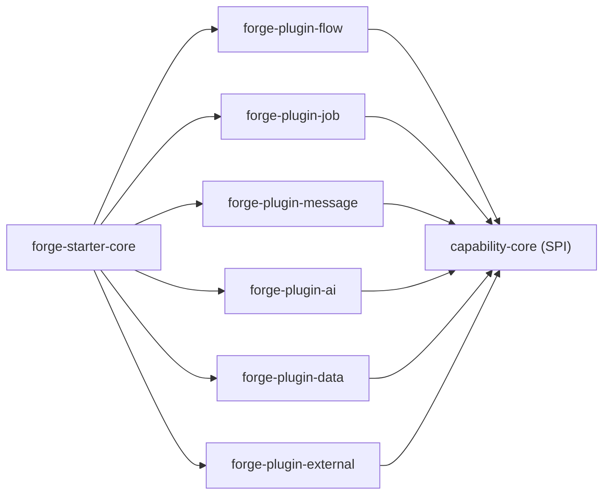

# 插件开发

<cite>
**本文引用的文件**
- [FlowAutoConfiguration.java](file://forge-server/forge-framework/forge-plugin-parent/forge-plugin-flow/src/main/java/com/mdframe/forge/starter/flow/config/FlowAutoConfiguration.java)
- [CapabilityExecutor.java](file://forge-server/forge-framework/forge-plugin-parent/forge-plugin-capability-parent/forge-plugin-capability-core/src/main/java/com/mdframe/forge/plugin/capability/spi/CapabilityExecutor.java)
- [CapabilityRegistry.java](file://forge-server/forge-framework/forge-plugin-parent/forge-plugin-capability-parent/forge-plugin-capability-core/src/main/java/com/mdframe/forge/plugin/capability/registry/CapabilityRegistry.java)
- [McpRequestLifecycle.java](file://forge-server/forge-framework/forge-plugin-parent/forge-plugin-mcp/src/main/java/com/mdframe/forge/plugin/mcp/security/McpRequestLifecycle.java)
- [org.springframework.boot.autoconfigure.AutoConfiguration.imports（核心）](file://forge-server/forge-framework/forge-starter-parent/forge-starter-core/src/main/resources/META-INF/spring/org.springframework.boot.autoconfigure.AutoConfiguration.imports)
- [org.springframework.boot.autoconfigure.AutoConfiguration.imports（流程）](file://forge-server/forge-framework/forge-plugin-parent/forge-plugin-flow/src/main/resources/META-INF/spring/org.springframework.boot.autoconfigure.AutoConfiguration.imports)
</cite>

## 目录
1. [简介](#简介)
2. [项目结构](#项目结构)
3. [核心组件](#核心组件)
4. [架构总览](#架构总览)
5. [详细组件分析](#详细组件分析)
6. [依赖分析](#依赖分析)
7. [性能考虑](#性能考虑)
8. [故障排查指南](#故障排查指南)
9. [结论](#结论)
10. [附录](#附录)

## 简介
本指南面向Forge Admin插件开发者，围绕“Starter插件”与“Plugin插件”两类扩展形态，系统阐述插件架构设计、生命周期管理、注册机制与依赖注入模式。文档以仓库中已有的能力中心SPI、自动装配机制以及流程引擎集成示例为依据，给出从接口定义、配置管理、事件处理到扩展点实现的完整路径，并提供打包发布与版本管理的最佳实践建议。

## 项目结构
仓库采用多模块分层组织：
- Starter层：提供可被应用直接引入的基础能力（如缓存、消息、Web、ORM等），通过Spring Boot自动装配暴露Bean。
- Plugin层：基于Starter构建的业务或领域插件（如流程、任务、消息、AI、数据、外部系统集成等），通过SPI与能力中心进行解耦扩展。
- 能力中心：以SPI形式定义能力执行器与注册表，实现“声明式能力 + 运行时调度”。

图表来源
- [org.springframework.boot.autoconfigure.AutoConfiguration.imports（核心）:1-200](file://forge-server/forge-framework/forge-starter-parent/forge-starter-core/src/main/resources/META-INF/spring/org.springframework.boot.autoconfigure.AutoConfiguration.imports#L1-L200)
- [org.springframework.boot.autoconfigure.AutoConfiguration.imports（流程）:1-200](file://forge-server/forge-framework/forge-plugin-parent/forge-plugin-flow/src/main/resources/META-INF/spring/org.springframework.boot.autoconfigure.AutoConfiguration.imports#L1-L200)
- [CapabilityExecutor.java:1-12](file://forge-server/forge-framework/forge-plugin-parent/forge-plugin-capability-parent/forge-plugin-capability-core/src/main/java/com/mdframe/forge/plugin/capability/spi/CapabilityExecutor.java#L1-L12)
- [CapabilityRegistry.java:1-17](file://forge-server/forge-framework/forge-plugin-parent/forge-plugin-capability-parent/forge-plugin-capability-core/src/main/java/com/mdframe/forge/plugin/capability/registry/CapabilityRegistry.java#L1-L17)

章节来源
- [FlowAutoConfiguration.java:1-144](file://forge-server/forge-framework/forge-plugin-parent/forge-plugin-flow/src/main/java/com/mdframe/forge/starter/flow/config/FlowAutoConfiguration.java#L1-L144)
- [CapabilityExecutor.java:1-12](file://forge-server/forge-framework/forge-plugin-parent/forge-plugin-capability-parent/forge-plugin-capability-core/src/main/java/com/mdframe/forge/plugin/capability/spi/CapabilityExecutor.java#L1-L12)
- [CapabilityRegistry.java:1-17](file://forge-server/forge-framework/forge-plugin-parent/forge-plugin-capability-parent/forge-plugin-capability-core/src/main/java/com/mdframe/forge/plugin/capability/registry/CapabilityRegistry.java#L1-L17)
- [org.springframework.boot.autoconfigure.AutoConfiguration.imports（核心）:1-200](file://forge-server/forge-framework/forge-starter-parent/forge-starter-core/src/main/resources/META-INF/spring/org.springframework.boot.autoconfigure.AutoConfiguration.imports#L1-L200)
- [org.springframework.boot.autoconfigure.AutoConfiguration.imports（流程）:1-200](file://forge-server/forge-framework/forge-plugin-parent/forge-plugin-flow/src/main/resources/META-INF/spring/org.springframework.boot.autoconfigure.AutoConfiguration.imports#L1-L200)

## 核心组件
- 自动装配与启动期初始化
  - 通过META-INF下的AutoConfiguration.imports声明自动装配类，使Starter/Plugin在应用启动时按需加载。
  - 插件可在ApplicationReady阶段完成动态资源注册（例如事件监听器）。
- 能力中心SPI
  - CapabilityExecutor：定义能力执行契约，支持按能力定义进行匹配与调用。
  - CapabilityRegistry：能力注册与发现中心，提供查询、强依赖获取与统一调用入口。
- 请求生命周期钩子
  - McpRequestLifecycle：为请求级上下文提供开闭式生命周期管理，便于鉴权、租户隔离、审计等横切关注点。

章节来源
- [org.springframework.boot.autoconfigure.AutoConfiguration.imports（核心）:1-200](file://forge-server/forge-framework/forge-starter-parent/forge-starter-core/src/main/resources/META-INF/spring/org.springframework.boot.autoconfigure.AutoConfiguration.imports#L1-L200)
- [org.springframework.boot.autoconfigure.AutoConfiguration.imports（流程）:1-200](file://forge-server/forge-framework/forge-plugin-parent/forge-plugin-flow/src/main/resources/META-INF/spring/org.springframework.boot.autoconfigure.AutoConfiguration.imports#L1-L200)
- [CapabilityExecutor.java:1-12](file://forge-server/forge-framework/forge-plugin-parent/forge-plugin-capability-parent/forge-plugin-capability-core/src/main/java/com/mdframe/forge/plugin/capability/spi/CapabilityExecutor.java#L1-L12)
- [CapabilityRegistry.java:1-17](file://forge-server/forge-framework/forge-plugin-parent/forge-plugin-capability-parent/forge-plugin-capability-core/src/main/java/com/mdframe/forge/plugin/capability/registry/CapabilityRegistry.java#L1-L17)
- [McpRequestLifecycle.java:1-15](file://forge-server/forge-framework/forge-plugin-parent/forge-plugin-mcp/src/main/java/com/mdframe/forge/plugin/mcp/security/McpRequestLifecycle.java#L1-L15)

## 架构总览
下图展示了Starter与Plugin的协作方式：Starter负责基础设施与自动装配；Plugin通过SPI接入能力中心；流程插件在启动后动态注册事件监听器，体现插件生命周期管理能力。

图表来源
- [FlowAutoConfiguration.java:81-123](file://forge-server/forge-framework/forge-plugin-parent/forge-plugin-flow/src/main/java/com/mdframe/forge/starter/flow/config/FlowAutoConfiguration.java#L81-L123)
- [org.springframework.boot.autoconfigure.AutoConfiguration.imports（流程）:1-200](file://forge-server/forge-framework/forge-plugin-parent/forge-plugin-flow/src/main/resources/META-INF/spring/org.springframework.boot.autoconfigure.AutoConfiguration.imports#L1-L200)

## 详细组件分析

### 能力中心SPI（CapabilityExecutor / CapabilityRegistry）
- 设计要点
  - 解耦：业务插件不直接耦合具体实现，通过SPI进行扩展。
  - 发现与选择：根据能力定义（类型、版本、标签等）匹配执行器。
  - 统一调用：通过注册表进行参数校验、上下文传递与结果封装。
- 复杂度与扩展性
  - 新增能力只需实现Executor并注册到Registry，无需修改调用方。
  - 支持多版本并存与灰度切换。

图表来源
- [CapabilityExecutor.java:1-12](file://forge-server/forge-framework/forge-plugin-parent/forge-plugin-capability-parent/forge-plugin-capability-core/src/main/java/com/mdframe/forge/plugin/capability/spi/CapabilityExecutor.java#L1-L12)
- [CapabilityRegistry.java:1-17](file://forge-server/forge-framework/forge-plugin-parent/forge-plugin-capability-parent/forge-plugin-capability-core/src/main/java/com/mdframe/forge/plugin/capability/registry/CapabilityRegistry.java#L1-L17)

章节来源
- [CapabilityExecutor.java:1-12](file://forge-server/forge-framework/forge-plugin-parent/forge-plugin-capability-parent/forge-plugin-capability-core/src/main/java/com/mdframe/forge/plugin/capability/spi/CapabilityExecutor.java#L1-L12)
- [CapabilityRegistry.java:1-17](file://forge-server/forge-framework/forge-plugin-parent/forge-plugin-capability-parent/forge-plugin-capability-core/src/main/java/com/mdframe/forge/plugin/capability/registry/CapabilityRegistry.java#L1-L17)

### 流程插件自动配置与事件注册
- 启动期行为
  - 启用异步，创建专用线程池用于流程事件处理。
  - 在ApplicationReady事件中检查并注册Flowable事件监听器，避免重复注册。
- 配置项
  - 通过application.yml中的flowable.*前缀控制数据库更新、历史级别、异步执行器等。
- 安全与认证
  - 注释掉的SecurityFilterChain表明默认HTTP Basic已禁用，由Sa-Token统一鉴权。

图表来源
- [FlowAutoConfiguration.java:81-123](file://forge-server/forge-framework/forge-plugin-parent/forge-plugin-flow/src/main/java/com/mdframe/forge/starter/flow/config/FlowAutoConfiguration.java#L81-L123)

章节来源
- [FlowAutoConfiguration.java:1-144](file://forge-server/forge-framework/forge-plugin-parent/forge-plugin-flow/src/main/java/com/mdframe/forge/starter/flow/config/FlowAutoConfiguration.java#L1-L144)

### 请求生命周期钩子（McpRequestLifecycle）
- 用途
  - 在请求进入与退出时执行开闭式逻辑，适合做鉴权、租户上下文、审计埋点、资源清理等。
- 使用方式
  - 通过函数式接口open返回AutoCloseable，确保资源释放。
  - 提供noop默认实现，便于按需启用。

图表来源
- [McpRequestLifecycle.java:1-15](file://forge-server/forge-framework/forge-plugin-parent/forge-plugin-mcp/src/main/java/com/mdframe/forge/plugin/mcp/security/McpRequestLifecycle.java#L1-L15)

章节来源
- [McpRequestLifecycle.java:1-15](file://forge-server/forge-framework/forge-plugin-parent/forge-plugin-mcp/src/main/java/com/mdframe/forge/plugin/mcp/security/McpRequestLifecycle.java#L1-L15)

### Starter与Plugin的开发流程
- Starter插件
  - 目标：提供可复用的基础设施能力（如缓存、消息、Web、ORM等）。
  - 关键点：
    - 在META-INF/spring下声明AutoConfiguration.imports，暴露必要Bean。
    - 通过@ConditionalOnXxx条件装配，避免污染主应用。
    - 提供配置属性类，集中管理开关与默认值。
- Plugin插件
  - 目标：基于Starter实现领域能力（流程、任务、消息、AI、数据、外部集成等）。
  - 关键点：
    - 通过SPI（如CapabilityExecutor）扩展能力，保持松耦合。
    - 在启动期完成动态注册（如事件监听器、路由、菜单等）。
    - 使用McpRequestLifecycle等钩子完成横切逻辑。
- 接口定义与配置管理
  - 接口优先：定义清晰的SPI接口与DTO，稳定契约。
  - 配置外置：将可变参数放入配置文件，支持环境差异与热更新。
- 事件处理与扩展点
  - 事件驱动：利用框架事件（如ApplicationReady、流程事件）触发扩展逻辑。
  - 扩展点：通过SPI注册实现类，实现“零侵入”扩展。

章节来源
- [org.springframework.boot.autoconfigure.AutoConfiguration.imports（核心）:1-200](file://forge-server/forge-framework/forge-starter-parent/forge-starter-core/src/main/resources/META-INF/spring/org.springframework.boot.autoconfigure.AutoConfiguration.imports#L1-L200)
- [org.springframework.boot.autoconfigure.AutoConfiguration.imports（流程）:1-200](file://forge-server/forge-framework/forge-plugin-parent/forge-plugin-flow/src/main/resources/META-INF/spring/org.springframework.boot.autoconfigure.AutoConfiguration.imports#L1-L200)
- [FlowAutoConfiguration.java:81-123](file://forge-server/forge-framework/forge-plugin-parent/forge-plugin-flow/src/main/java/com/mdframe/forge/starter/flow/config/FlowAutoConfiguration.java#L81-L123)
- [CapabilityExecutor.java:1-12](file://forge-server/forge-framework/forge-plugin-parent/forge-plugin-capability-parent/forge-plugin-capability-core/src/main/java/com/mdframe/forge/plugin/capability/spi/CapabilityExecutor.java#L1-L12)
- [CapabilityRegistry.java:1-17](file://forge-server/forge-framework/forge-plugin-parent/forge-plugin-capability-parent/forge-plugin-capability-core/src/main/java/com/mdframe/forge/plugin/capability/registry/CapabilityRegistry.java#L1-L17)
- [McpRequestLifecycle.java:1-15](file://forge-server/forge-framework/forge-plugin-parent/forge-plugin-mcp/src/main/java/com/mdframe/forge/plugin/mcp/security/McpRequestLifecycle.java#L1-L15)

## 依赖分析
- 组件内聚与耦合
  - Starter与Plugin之间通过自动装配与SPI解耦，降低循环依赖风险。
  - 能力中心作为横向扩展点，各插件仅依赖抽象，提升可替换性。
- 外部依赖
  - 流程插件依赖Flowable引擎，通过自动配置与事件机制集成。
  - 安全与鉴权由上层框架（如Sa-Token）统一处理，插件侧专注业务。

图表来源
- [org.springframework.boot.autoconfigure.AutoConfiguration.imports（核心）:1-200](file://forge-server/forge-framework/forge-starter-parent/forge-starter-core/src/main/resources/META-INF/spring/org.springframework.boot.autoconfigure.AutoConfiguration.imports#L1-L200)
- [org.springframework.boot.autoconfigure.AutoConfiguration.imports（流程）:1-200](file://forge-server/forge-framework/forge-plugin-parent/forge-plugin-flow/src/main/resources/META-INF/spring/org.springframework.boot.autoconfigure.AutoConfiguration.imports#L1-L200)
- [CapabilityExecutor.java:1-12](file://forge-server/forge-framework/forge-plugin-parent/forge-plugin-capability-parent/forge-plugin-capability-core/src/main/java/com/mdframe/forge/plugin/capability/spi/CapabilityExecutor.java#L1-L12)
- [CapabilityRegistry.java:1-17](file://forge-server/forge-framework/forge-plugin-parent/forge-plugin-capability-parent/forge-plugin-capability-core/src/main/java/com/mdframe/forge/plugin/capability/registry/CapabilityRegistry.java#L1-L17)

章节来源
- [org.springframework.boot.autoconfigure.AutoConfiguration.imports（核心）:1-200](file://forge-server/forge-framework/forge-starter-parent/forge-starter-core/src/main/resources/META-INF/spring/org.springframework.boot.autoconfigure.AutoConfiguration.imports#L1-L200)
- [org.springframework.boot.autoconfigure.AutoConfiguration.imports（流程）:1-200](file://forge-server/forge-framework/forge-plugin-parent/forge-plugin-flow/src/main/resources/META-INF/spring/org.springframework.boot.autoconfigure.AutoConfiguration.imports#L1-L200)
- [CapabilityExecutor.java:1-12](file://forge-server/forge-framework/forge-plugin-parent/forge-plugin-capability-parent/forge-plugin-capability-core/src/main/java/com/mdframe/forge/plugin/capability/spi/CapabilityExecutor.java#L1-L12)
- [CapabilityRegistry.java:1-17](file://forge-server/forge-framework/forge-plugin-parent/forge-plugin-capability-parent/forge-plugin-capability-core/src/main/java/com/mdframe/forge/plugin/capability/registry/CapabilityRegistry.java#L1-L17)

## 性能考虑
- 事件处理异步化
  - 为流程事件提供专用线程池，避免阻塞流程引擎主线程。
- 资源复用
  - 通过自动装配复用连接池、缓存、消息通道等共享资源。
- 扩展点开销
  - 能力匹配与调用应轻量，避免在热点路径中进行重型计算。
- 监控与限流
  - 对能力调用与事件处理增加指标采集与熔断限流策略。

[本节为通用指导，不直接分析具体文件]

## 故障排查指南
- 事件未触发
  - 检查是否在ApplicationReady阶段完成监听器注册，且未重复注册。
  - 确认流程引擎配置正确（数据库更新、异步执行器、历史级别）。
- 能力未生效
  - 核对能力定义与执行器是否匹配（类型、版本、标签）。
  - 检查能力注册表是否能列出并解析能力定义。
- 请求上下文异常
  - 确认McpRequestLifecycle是否正确实现open/close，避免上下文泄漏。
  - 检查拦截器链顺序，确保生命周期钩子在业务处理之前执行。

章节来源
- [FlowAutoConfiguration.java:81-123](file://forge-server/forge-framework/forge-plugin-parent/forge-plugin-flow/src/main/java/com/mdframe/forge/starter/flow/config/FlowAutoConfiguration.java#L81-L123)
- [CapabilityRegistry.java:1-17](file://forge-server/forge-framework/forge-plugin-parent/forge-plugin-capability-parent/forge-plugin-capability-core/src/main/java/com/mdframe/forge/plugin/capability/registry/CapabilityRegistry.java#L1-L17)
- [McpRequestLifecycle.java:1-15](file://forge-server/forge-framework/forge-plugin-parent/forge-plugin-mcp/src/main/java/com/mdframe/forge/plugin/mcp/security/McpRequestLifecycle.java#L1-L15)

## 结论
Forge Admin的插件体系以“Starter提供基础设施 + Plugin通过SPI扩展”为核心，结合自动装配与启动期动态注册，实现了高内聚、低耦合的可插拔架构。能力中心进一步将扩展点标准化，使插件具备更强的可维护性与演进能力。遵循本文的流程与最佳实践，可高效构建从简单功能到复杂业务的各类插件。

[本节为总结性内容，不直接分析具体文件]

## 附录
- 打包与发布
  - 将Starter/Plugin独立为Maven模块，通过父POM统一管理依赖与版本。
  - 使用Spring Boot的自动装配机制，确保引入依赖即可生效。
- 版本管理
  - 通过能力定义中的版本号进行兼容控制，支持多版本并存与灰度发布。
  - 在能力注册表中记录版本元数据，便于回滚与审计。
- 配置管理
  - 使用配置属性类集中管理开关与阈值，支持多环境差异化配置。
  - 对敏感配置进行加密与权限控制。
- 测试与验证
  - 为SPI实现编写单元测试，覆盖匹配与调用路径。
  - 对事件注册与生命周期钩子进行集成测试，确保启动期行为正确。

[本节为通用指导，不直接分析具体文件]