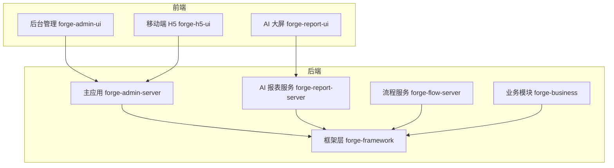
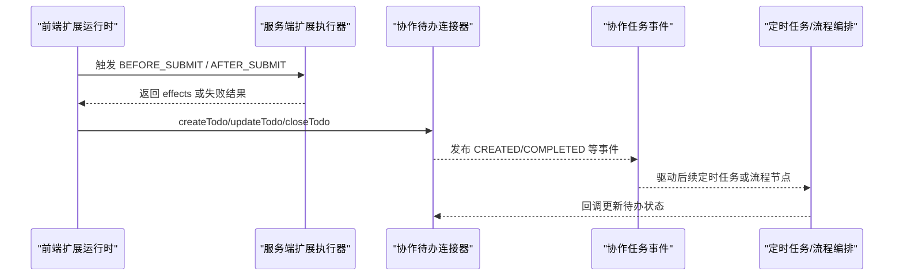
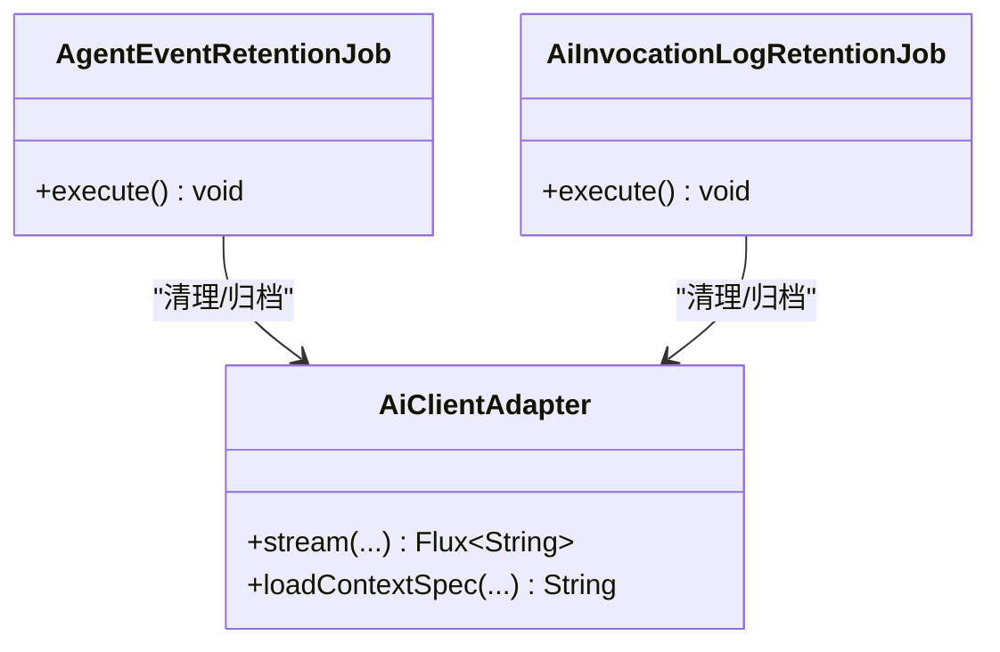
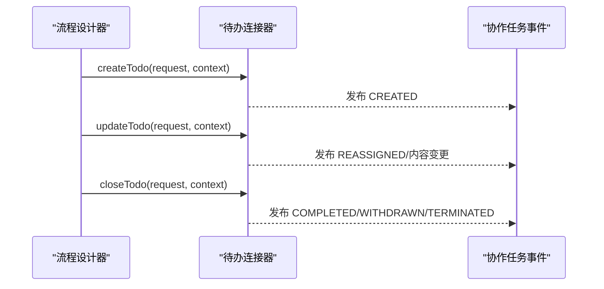
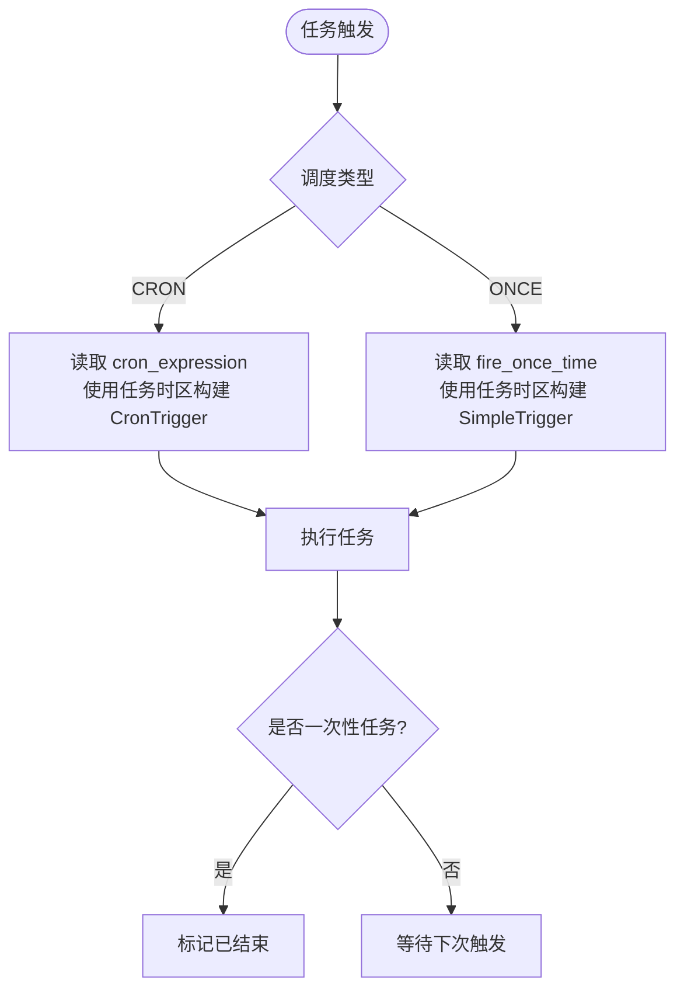
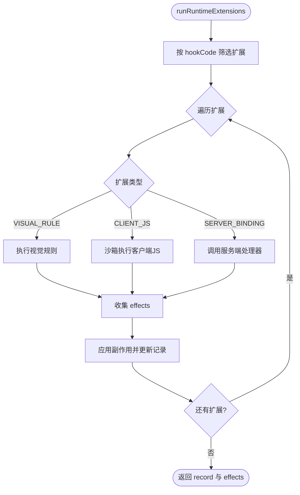
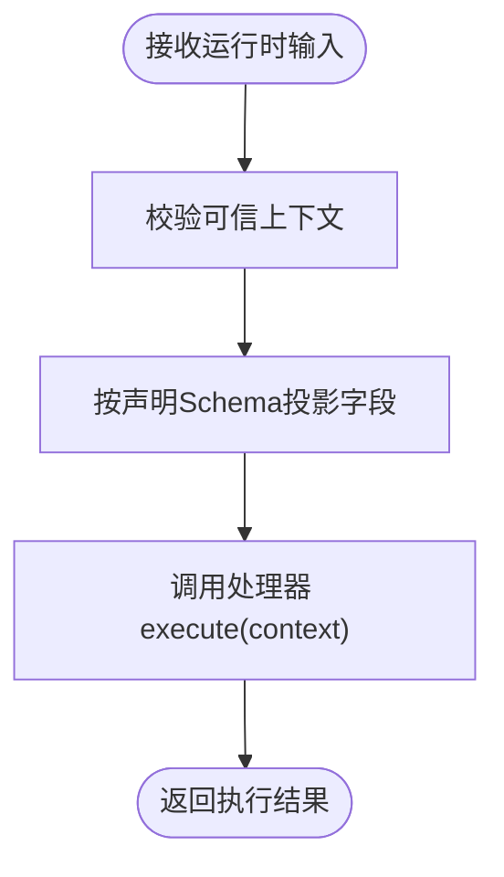
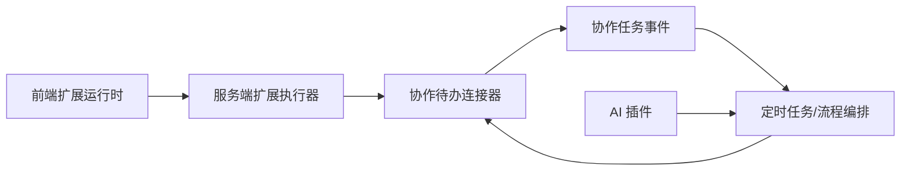

# 插件开发示例

<cite>
**本文引用的文件**
- [README.md](file://README.md)
- [package.json](file://package.json)
- [BusinessExtensionHook.java](file://forge-server/forge-framework/forge-plugin-parent/forge-plugin-generator/src/main/java/com/mdframe/forge/plugin/generator/constant/BusinessExtensionHook.java)
- [ServerBindingExecutor.java](file://forge-server/forge-framework/forge-plugin-parent/forge-plugin-generator/src/main/java/com/mdframe/forge/plugin/generator/service/businessapp/extension/ServerBindingExecutor.java)
- [application-extension-runtime.js](file://forge-admin-ui/src/components/lowcode-extension/runtime/application-extension-runtime.js)
- [user-task-parser.js](file://forge-admin-ui/src/components/flow-designer/converter/user-task-parser.js)
- [CollaborationTaskEvent.java](file://forge-server/forge-framework/forge-starter-parent/forge-starter-collaboration/src/main/java/com/mdframe/forge/starter/collaboration/model/CollaborationTaskEvent.java)
- [TodoConnector.java](file://forge-server/forge-framework/forge-starter-parent/forge-starter-collaboration/src/main/java/com/mdframe/forge/starter/collaboration/connector/TodoConnector.java)
- [JobFlowRuntimeService.java](file://forge-server/forge-framework/forge-plugin-parent/forge-plugin-flow/src/main/java/com/mdframe/forge/starter/flow/job/JobFlowRuntimeService.java)
- [LocalJobFlowExecutor.java](file://forge-server/forge-framework/forge-plugin-parent/forge-plugin-flow/src/main/java/com/mdframe/forge/starter/flow/job/LocalJobFlowExecutor.java)
- [RemoteJobFlowExecutor.java](file://forge-server/forge-flow/forge-flow-client/src/main/java/com/mdframe/forge/flow/client/job/RemoteJobFlowExecutor.java)
- [ScheduleConfig.java](file://forge-server/forge-framework/forge-plugin-parent/forge-plugin-job/src/main/java/com/mdframe/forge/plugin/job/config/ScheduleConfig.java)
- [JobAutoConfiguration.java](file://forge-server/forge-framework/forge-plugin-parent/forge-plugin-job/src/main/java/com/mdframe/forge/plugin/job/config/JobAutoConfiguration.java)
- [JobProperties.java](file://forge-server/forge-framework/forge-plugin-parent/forge-plugin-job/src/main/java/com/mdframe/forge/plugin/job/config/JobProperties.java)
- [AgentEventRetentionJob.java](file://forge-server/forge-framework/forge-plugin-parent/forge-plugin-ai/src/main/java/com/mdframe/forge/plugin/ai/agent/engine/event/job/AgentEventRetentionJob.java)
- [AiInvocationLogRetentionJob.java](file://forge-server/forge-framework/forge-plugin-parent/forge-plugin-ai/src/main/java/com/mdframe/forge/plugin/ai/invocation/job/AiInvocationLogRetentionJob.java)
- [create-project.mjs](file://scripts/forge-create/create-project.mjs)
</cite>

## 目录
1. [简介](#简介)
2. [项目结构](#项目结构)
3. [核心组件](#核心组件)
4. [架构总览](#架构总览)
5. [详细组件分析](#详细组件分析)
6. [依赖关系分析](#依赖关系分析)
7. [性能考虑](#性能考虑)
8. [故障排查指南](#故障排查指南)
9. [结论](#结论)
10. [附录](#附录)

## 简介
本文件面向希望在 Forge Admin 平台上进行插件开发的工程师，提供从简单到复杂的多层次示例集合，覆盖基础功能插件、业务逻辑插件与系统集成插件。重点讲解三类典型插件：
- AI 能力集成插件：通过智能体与模型供应商抽象，将 AI 能力以插件方式接入系统。
- 协作功能插件：基于待办卡片连接器与事件模型，打通流程任务与外部协作系统的待办同步。
- 定时任务插件：结合调度配置、一次性任务与时区支持，实现可靠的任务编排与执行。

文档同时给出前端组件集成、API 接口设计与用户体验优化的最佳实践，并附带常见问题解决方案与性能调优建议。

## 项目结构
Forge Admin 采用“微内核 + 插件化”的架构：核心框架提供认证、缓存、ORM、多租户、数据权限等 Starter；业务能力以 Plugin 形式组合；应用服务按场景聚合插件对外暴露接口。前端包含后台管理、AI 大屏与 H5 移动端。

**图表来源**
- [README.md:241-259](file://README.md#L241-L259)

**章节来源**
- [README.md:241-259](file://README.md#L241-L259)

## 核心组件
- 低代码扩展运行时（前端）：负责在页面生命周期钩子中安全地执行客户端 JS、视觉规则与服务端绑定处理器，并对副作用进行字段级治理与错误策略控制。
- 服务端扩展执行器：对服务端处理器进行输入投影与安全校验，确保仅允许声明字段进入处理器上下文。
- 协作待办连接器：定义创建、更新、关闭待办的统一接口，供不同协作提供方实现。
- 协作任务事件：描述流程任务的生命周期事件，用于跨系统同步待办状态。
- 定时任务与流程编排：提供本地与远程两种执行方式，支持 CRON 与一次性任务，以及独立时区配置。
- AI 插件：提供智能体引擎、会话与调用日志清理等定时任务，支撑 AI 能力的可观测性与资源回收。

**章节来源**
- [application-extension-runtime.js:49-160](file://forge-admin-ui/src/components/lowcode-extension/runtime/application-extension-runtime.js#L49-L160)
- [ServerBindingExecutor.java:73-98](file://forge-server/forge-framework/forge-plugin-parent/forge-plugin-generator/src/main/java/com/mdframe/forge/plugin/generator/service/businessapp/extension/ServerBindingExecutor.java#L73-L98)
- [TodoConnector.java:1-32](file://forge-server/forge-framework/forge-starter-parent/forge-starter-collaboration/src/main/java/com/mdframe/forge/starter/collaboration/connector/TodoConnector.java#L1-L32)
- [CollaborationTaskEvent.java:1-41](file://forge-server/forge-framework/forge-starter-parent/forge-starter-collaboration/src/main/java/com/mdframe/forge/starter/collaboration/model/CollaborationTaskEvent.java#L1-L41)
- [JobFlowRuntimeService.java](file://forge-server/forge-framework/forge-plugin-parent/forge-plugin-flow/src/main/java/com/mdframe/forge/starter/flow/job/JobFlowRuntimeService.java)
- [LocalJobFlowExecutor.java](file://forge-server/forge-framework/forge-plugin-parent/forge-plugin-flow/src/main/java/com/mdframe/forge/starter/flow/job/LocalJobFlowExecutor.java)
- [RemoteJobFlowExecutor.java](file://forge-server/forge-flow/forge-flow-client/src/main/java/com/mdframe/forge/flow/client/job/RemoteJobFlowExecutor.java)
- [ScheduleConfig.java](file://forge-server/forge-framework/forge-plugin-parent/forge-plugin-job/src/main/java/com/mdframe/forge/plugin/job/config/ScheduleConfig.java)
- [JobAutoConfiguration.java](file://forge-server/forge-framework/forge-plugin-parent/forge-plugin-job/src/main/java/com/mdframe/forge/plugin/job/config/JobAutoConfiguration.java)
- [JobProperties.java](file://forge-server/forge-framework/forge-plugin-parent/forge-plugin-job/src/main/java/com/mdframe/forge/plugin/job/config/JobProperties.java)
- [AgentEventRetentionJob.java](file://forge-server/forge-framework/forge-plugin-parent/forge-plugin-ai/src/main/java/com/mdframe/forge/plugin/ai/agent/engine/event/job/AgentEventRetentionJob.java)
- [AiInvocationLogRetentionJob.java](file://forge-server/forge-framework/forge-plugin-parent/forge-plugin-ai/src/main/java/com/mdframe/forge/plugin/ai/invocation/job/AiInvocationLogRetentionJob.java)

## 架构总览
下图展示了“前端扩展运行时 -> 服务端处理器 -> 协作待办 -> 流程任务事件 -> 定时任务”的端到端链路，体现插件间的解耦与职责边界。

**图表来源**
- [application-extension-runtime.js:49-160](file://forge-admin-ui/src/components/lowcode-extension/runtime/application-extension-runtime.js#L49-L160)
- [ServerBindingExecutor.java:73-98](file://forge-server/forge-framework/forge-plugin-parent/forge-plugin-generator/src/main/java/com/mdframe/forge/plugin/generator/service/businessapp/extension/ServerBindingExecutor.java#L73-L98)
- [TodoConnector.java:1-32](file://forge-server/forge-framework/forge-starter-parent/forge-starter-collaboration/src/main/java/com/mdframe/forge/starter/collaboration/connector/TodoConnector.java#L1-L32)
- [CollaborationTaskEvent.java:1-41](file://forge-server/forge-framework/forge-starter-parent/forge-starter-collaboration/src/main/java/com/mdframe/forge/starter/collaboration/model/CollaborationTaskEvent.java#L1-L41)
- [JobFlowRuntimeService.java](file://forge-server/forge-framework/forge-plugin-parent/forge-plugin-flow/src/main/java/com/mdframe/forge/starter/flow/job/JobFlowRuntimeService.java)

## 详细组件分析

### 组件一：AI 能力集成插件
- 目标：以插件方式接入多种 AI 供应商，提供智能体管理与对话流，并通过定时任务清理历史数据。
- 关键要点：
  - 智能体生命周期管理：草稿、已发布、下线。
  - 流式调用与上下文裁剪，避免上下文膨胀。
  - 调用日志与事件保留策略，降低存储压力。
- 参考路径：
  - 智能体事件保留任务：[AgentEventRetentionJob.java](file://forge-server/forge-framework/forge-plugin-parent/forge-plugin-ai/src/main/java/com/mdframe/forge/plugin/ai/agent/engine/event/job/AgentEventRetentionJob.java)
  - 调用日志保留任务：[AiInvocationLogRetentionJob.java](file://forge-server/forge-framework/forge-plugin-parent/forge-plugin-ai/src/main/java/com/mdframe/forge/plugin/ai/invocation/job/AiInvocationLogRetentionJob.java)
  - 脚手架中 AI 适配器降级：[create-project.mjs:496-523](file://scripts/forge-create/create-project.mjs#L496-L523)

**图表来源**
- [AgentEventRetentionJob.java](file://forge-server/forge-framework/forge-plugin-parent/forge-plugin-ai/src/main/java/com/mdframe/forge/plugin/ai/agent/engine/event/job/AgentEventRetentionJob.java)
- [AiInvocationLogRetentionJob.java](file://forge-server/forge-framework/forge-plugin-parent/forge-plugin-ai/src/main/java/com/mdframe/forge/plugin/ai/invocation/job/AiInvocationLogRetentionJob.java)
- [create-project.mjs:496-523](file://scripts/forge-create/create-project.mjs#L496-L523)

**章节来源**
- [create-project.mjs:496-523](file://scripts/forge-create/create-project.mjs#L496-L523)

### 组件二：协作功能插件
- 目标：将流程任务映射为外部协作系统的待办卡片，支持创建、更新、关闭，并通过事件驱动状态同步。
- 关键要点：
  - 统一的待办连接器接口，屏蔽下游差异。
  - 事件模型涵盖创建、转派、完成、撤回、拒绝、终止等状态。
  - 与流程设计器中的用户任务配置联动，支持表单、处理人表达式与提醒策略。
- 参考路径：
  - 待办连接器：[TodoConnector.java:1-32](file://forge-server/forge-framework/forge-starter-parent/forge-starter-collaboration/src/main/java/com/mdframe/forge/starter/collaboration/connector/TodoConnector.java#L1-L32)
  - 任务事件模型：[CollaborationTaskEvent.java:1-41](file://forge-server/forge-framework/forge-starter-parent/forge-starter-collaboration/src/main/java/com/mdframe/forge/starter/collaboration/model/CollaborationTaskEvent.java#L1-L41)
  - 用户任务解析默认配置：[user-task-parser.js:44-91](file://forge-admin-ui/src/components/flow-designer/converter/user-task-parser.js#L44-L91)

**图表来源**
- [TodoConnector.java:1-32](file://forge-server/forge-framework/forge-starter-parent/forge-starter-collaboration/src/main/java/com/mdframe/forge/starter/collaboration/connector/TodoConnector.java#L1-L32)
- [CollaborationTaskEvent.java:1-41](file://forge-server/forge-framework/forge-starter-parent/forge-starter-collaboration/src/main/java/com/mdframe/forge/starter/collaboration/model/CollaborationTaskEvent.java#L1-L41)
- [user-task-parser.js:44-91](file://forge-admin-ui/src/components/flow-designer/converter/user-task-parser.js#L44-L91)

**章节来源**
- [TodoConnector.java:1-32](file://forge-server/forge-framework/forge-starter-parent/forge-starter-collaboration/src/main/java/com/mdframe/forge/starter/collaboration/connector/TodoConnector.java#L1-L32)
- [CollaborationTaskEvent.java:1-41](file://forge-server/forge-framework/forge-starter-parent/forge-starter-collaboration/src/main/java/com/mdframe/forge/starter/collaboration/model/CollaborationTaskEvent.java#L1-L41)
- [user-task-parser.js:44-91](file://forge-admin-ui/src/components/flow-designer/converter/user-task-parser.js#L44-L91)

### 组件三：定时任务插件
- 目标：提供可靠的定时任务编排，支持 CRON 与一次性任务，具备独立时区与执行日志。
- 关键要点：
  - 调度类型：CRON 保存 cron_expression；ONCE 保存 fire_once_time，且必须晚于当前时间。
  - 时区：每个任务保存 IANA 时区，CronTrigger 显式使用任务时区；ONCE 使用 SimpleTrigger。
  - 执行后状态：一次性任务结束后进入已结束，不再自动重复。
  - 手动执行不改变计划状态。
- 参考路径：
  - 调度配置与属性：[ScheduleConfig.java](file://forge-server/forge-framework/forge-plugin-parent/forge-plugin-job/src/main/java/com/mdframe/forge/plugin/job/config/ScheduleConfig.java), [JobProperties.java](file://forge-server/forge-framework/forge-plugin-parent/forge-plugin-job/src/main/java/com/mdframe/forge/plugin/job/config/JobProperties.java)
  - 自动装配：[JobAutoConfiguration.java](file://forge-server/forge-framework/forge-plugin-parent/forge-plugin-job/src/main/java/com/mdframe/forge/plugin/job/config/JobAutoConfiguration.java)
  - 流程任务编排：[JobFlowRuntimeService.java](file://forge-server/forge-framework/forge-plugin-parent/forge-plugin-flow/src/main/java/com/mdframe/forge/starter/flow/job/JobFlowRuntimeService.java), [LocalJobFlowExecutor.java](file://forge-server/forge-framework/forge-plugin-parent/forge-plugin-flow/src/main/java/com/mdframe/forge/starter/flow/job/LocalJobFlowExecutor.java), [RemoteJobFlowExecutor.java](file://forge-server/forge-flow/forge-flow-client/src/main/java/com/mdframe/forge/flow/client/job/RemoteJobFlowExecutor.java)

**图表来源**
- [ScheduleConfig.java](file://forge-server/forge-framework/forge-plugin-parent/forge-plugin-job/src/main/java/com/mdframe/forge/plugin/job/config/ScheduleConfig.java)
- [JobProperties.java](file://forge-server/forge-framework/forge-plugin-parent/forge-plugin-job/src/main/java/com/mdframe/forge/plugin/job/config/JobProperties.java)
- [JobAutoConfiguration.java](file://forge-server/forge-framework/forge-plugin-parent/forge-plugin-job/src/main/java/com/mdframe/forge/plugin/job/config/JobAutoConfiguration.java)
- [JobFlowRuntimeService.java](file://forge-server/forge-framework/forge-plugin-parent/forge-plugin-flow/src/main/java/com/mdframe/forge/starter/flow/job/JobFlowRuntimeService.java)
- [LocalJobFlowExecutor.java](file://forge-server/forge-framework/forge-plugin-parent/forge-plugin-flow/src/main/java/com/mdframe/forge/starter/flow/job/LocalJobFlowExecutor.java)
- [RemoteJobFlowExecutor.java](file://forge-server/forge-flow/forge-flow-client/src/main/java/com/mdframe/forge/flow/client/job/RemoteJobFlowExecutor.java)

**章节来源**
- [ScheduleConfig.java](file://forge-server/forge-framework/forge-plugin-parent/forge-plugin-job/src/main/java/com/mdframe/forge/plugin/job/config/ScheduleConfig.java)
- [JobProperties.java](file://forge-server/forge-framework/forge-plugin-parent/forge-plugin-job/src/main/java/com/mdframe/forge/plugin/job/config/JobProperties.java)
- [JobAutoConfiguration.java](file://forge-server/forge-framework/forge-plugin-parent/forge-plugin-job/src/main/java/com/mdframe/forge/plugin/job/config/JobAutoConfiguration.java)
- [JobFlowRuntimeService.java](file://forge-server/forge-framework/forge-plugin-parent/forge-plugin-flow/src/main/java/com/mdframe/forge/starter/flow/job/JobFlowRuntimeService.java)
- [LocalJobFlowExecutor.java](file://forge-server/forge-framework/forge-plugin-parent/forge-plugin-flow/src/main/java/com/mdframe/forge/starter/flow/job/LocalJobFlowExecutor.java)
- [RemoteJobFlowExecutor.java](file://forge-server/forge-flow/forge-flow-client/src/main/java/com/mdframe/forge/flow/client/job/RemoteJobFlowExecutor.java)

### 组件四：低代码扩展运行时（前端）
- 目标：在页面生命周期钩子中安全执行客户端 JS、视觉规则与服务端绑定，并对副作用进行字段级治理与错误策略控制。
- 关键要点：
  - 选择器：根据 hookCode 与上下文筛选扩展。
  - 执行器：区分 VISUAL_RULE、CLIENT_JS、SERVER_BINDING 三种类型。
  - 副作用治理：限制可读写字段范围，校验效果合法性。
  - 错误策略：BLOCK 阻断、WARN 告警。
- 参考路径：
  - 运行时入口与执行流程：[application-extension-runtime.js:49-160](file://forge-admin-ui/src/components/lowcode-extension/runtime/application-extension-runtime.js#L49-L160)
  - 钩子白名单：[BusinessExtensionHook.java:1-36](file://forge-server/forge-framework/forge-plugin-parent/forge-plugin-generator/src/main/java/com/mdframe/forge/plugin/generator/constant/BusinessExtensionHook.java#L1-L36)

**图表来源**
- [application-extension-runtime.js:49-160](file://forge-admin-ui/src/components/lowcode-extension/runtime/application-extension-runtime.js#L49-L160)
- [BusinessExtensionHook.java:1-36](file://forge-server/forge-framework/forge-plugin-parent/forge-plugin-generator/src/main/java/com/mdframe/forge/plugin/generator/constant/BusinessExtensionHook.java#L1-L36)

**章节来源**
- [application-extension-runtime.js:49-160](file://forge-admin-ui/src/components/lowcode-extension/runtime/application-extension-runtime.js#L49-L160)
- [BusinessExtensionHook.java:1-36](file://forge-server/forge-framework/forge-plugin-parent/forge-plugin-generator/src/main/java/com/mdframe/forge/plugin/generator/constant/BusinessExtensionHook.java#L1-L36)

### 组件五：服务端扩展执行器（输入投影与安全）
- 目标：在服务端执行扩展处理器前，对输入进行可信投影，仅允许声明字段进入处理器上下文。
- 关键要点：
  - 严格校验上下文来源。
  - 基于处理器声明的输入 Schema 投影运行时输入。
  - 未声明字段不会进入处理器，防止不可信输入注入。
- 参考路径：
  - 运行时执行与输入投影：[ServerBindingExecutor.java:73-98](file://forge-server/forge-framework/forge-plugin-parent/forge-plugin-generator/src/main/java/com/mdframe/forge/plugin/generator/service/businessapp/extension/ServerBindingExecutor.java#L73-L98)

**图表来源**
- [ServerBindingExecutor.java:73-98](file://forge-server/forge-framework/forge-plugin-parent/forge-plugin-generator/src/main/java/com/mdframe/forge/plugin/generator/service/businessapp/extension/ServerBindingExecutor.java#L73-L98)

**章节来源**
- [ServerBindingExecutor.java:73-98](file://forge-server/forge-framework/forge-plugin-parent/forge-plugin-generator/src/main/java/com/mdframe/forge/plugin/generator/service/businessapp/extension/ServerBindingExecutor.java#L73-L98)

## 依赖关系分析
- 前端扩展运行时依赖后端处理器注册与执行能力，通过统一接口调用服务端扩展。
- 协作插件通过事件模型与流程设计器的用户任务配置联动，形成闭环。
- 定时任务插件与流程编排服务解耦，支持本地与远程执行，便于横向扩展。
- AI 插件通过定时任务维护事件与日志，保障系统长期稳定运行。

**图表来源**
- [application-extension-runtime.js:49-160](file://forge-admin-ui/src/components/lowcode-extension/runtime/application-extension-runtime.js#L49-L160)
- [ServerBindingExecutor.java:73-98](file://forge-server/forge-framework/forge-plugin-parent/forge-plugin-generator/src/main/java/com/mdframe/forge/plugin/generator/service/businessapp/extension/ServerBindingExecutor.java#L73-L98)
- [TodoConnector.java:1-32](file://forge-server/forge-framework/forge-starter-parent/forge-starter-collaboration/src/main/java/com/mdframe/forge/starter/collaboration/connector/TodoConnector.java#L1-L32)
- [CollaborationTaskEvent.java:1-41](file://forge-server/forge-framework/forge-starter-parent/forge-starter-collaboration/src/main/java/com/mdframe/forge/starter/collaboration/model/CollaborationTaskEvent.java#L1-L41)
- [JobFlowRuntimeService.java](file://forge-server/forge-framework/forge-plugin-parent/forge-plugin-flow/src/main/java/com/mdframe/forge/starter/flow/job/JobFlowRuntimeService.java)
- [AgentEventRetentionJob.java](file://forge-server/forge-framework/forge-plugin-parent/forge-plugin-ai/src/main/java/com/mdframe/forge/plugin/ai/agent/engine/event/job/AgentEventRetentionJob.java)
- [AiInvocationLogRetentionJob.java](file://forge-server/forge-framework/forge-plugin-parent/forge-plugin-ai/src/main/java/com/mdframe/forge/plugin/ai/invocation/job/AiInvocationLogRetentionJob.java)

**章节来源**
- [application-extension-runtime.js:49-160](file://forge-admin-ui/src/components/lowcode-extension/runtime/application-extension-runtime.js#L49-L160)
- [ServerBindingExecutor.java:73-98](file://forge-server/forge-framework/forge-plugin-parent/forge-plugin-generator/src/main/java/com/mdframe/forge/plugin/generator/service/businessapp/extension/ServerBindingExecutor.java#L73-L98)
- [TodoConnector.java:1-32](file://forge-server/forge-framework/forge-starter-parent/forge-starter-collaboration/src/main/java/com/mdframe/forge/starter/collaboration/connector/TodoConnector.java#L1-L32)
- [CollaborationTaskEvent.java:1-41](file://forge-server/forge-framework/forge-starter-parent/forge-starter-collaboration/src/main/java/com/mdframe/forge/starter/collaboration/model/CollaborationTaskEvent.java#L1-L41)
- [JobFlowRuntimeService.java](file://forge-server/forge-framework/forge-plugin-parent/forge-plugin-flow/src/main/java/com/mdframe/forge/starter/flow/job/JobFlowRuntimeService.java)
- [AgentEventRetentionJob.java](file://forge-server/forge-framework/forge-plugin-parent/forge-plugin-ai/src/main/java/com/mdframe/forge/plugin/ai/agent/engine/event/job/AgentEventRetentionJob.java)
- [AiInvocationLogRetentionJob.java](file://forge-server/forge-framework/forge-plugin-parent/forge-plugin-ai/src/main/java/com/mdframe/forge/plugin/ai/invocation/job/AiInvocationLogRetentionJob.java)

## 性能考虑
- 前端扩展运行时：
  - 仅在必要钩子执行扩展，减少不必要的计算。
  - 对客户端 JS 使用沙箱执行，限制可访问 API 与字段读写范围。
  - 对副作用进行最小化更新，避免频繁重渲染。
- 服务端扩展执行器：
  - 输入投影减少不必要的数据传输与校验开销。
  - 处理器超时与失败策略可控，避免阻塞主流程。
- 协作待办连接器：
  - 批量操作与重试机制可降低网络抖动影响。
  - 事件幂等设计避免重复消费。
- 定时任务：
  - 一次性任务结束后立即结束，避免无效轮询。
  - 独立时区避免跨时区计算误差导致的误触发。
- AI 插件：
  - 事件与日志保留策略控制存储增长。
  - 流式响应与上下文裁剪降低内存占用。

## 故障排查指南
- 首次启动数据库或 Redis 连接错误：
  - 检查本地配置文件是否已复制并正确设置连接信息。
- 前端请求后端失败：
  - 确认后端端口已启动，检查代理配置是否指向本地服务。
- 新增配置项注意事项：
  - 敏感配置不要提交；通用配置需同步到示例配置并使用占位符。
- 不小心提交敏感配置：
  - 立即更换相关密钥并从仓库历史与索引中清理。
- 扩展执行失败：
  - 查看前端通知与控制台警告；若策略为 BLOCK，会阻断后续流程。
- 定时任务未按预期触发：
  - 核对调度类型、cron 表达式或一次性时间与时区配置。

**章节来源**
- [README.md:502-518](file://README.md#L502-L518)

## 结论
本示例集合围绕 Forge Admin 的插件化架构，提供了从基础到集成的多层次插件开发范式。通过低代码扩展运行时、服务端扩展执行器、协作待办连接器、定时任务与 AI 插件的组合，开发者可以高效构建可扩展、可观测、易维护的企业级能力。建议在实现过程中遵循输入投影、错误策略、事件幂等与时区隔离等最佳实践，以获得更稳定的系统表现。

## 附录
- 快速开始与环境准备请参考项目根 README。
- 前端工程脚本与包管理器版本见 package.json。

**章节来源**
- [README.md:263-393](file://README.md#L263-L393)
- [package.json:1-10](file://package.json#L1-L10)