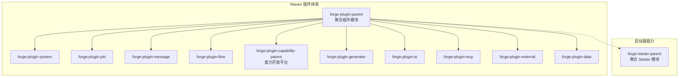
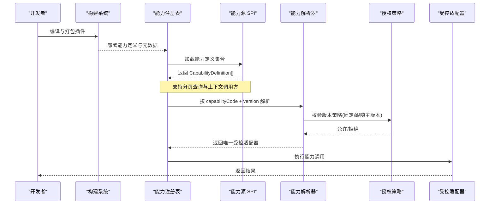
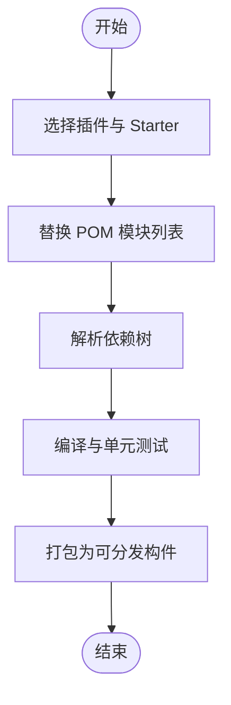
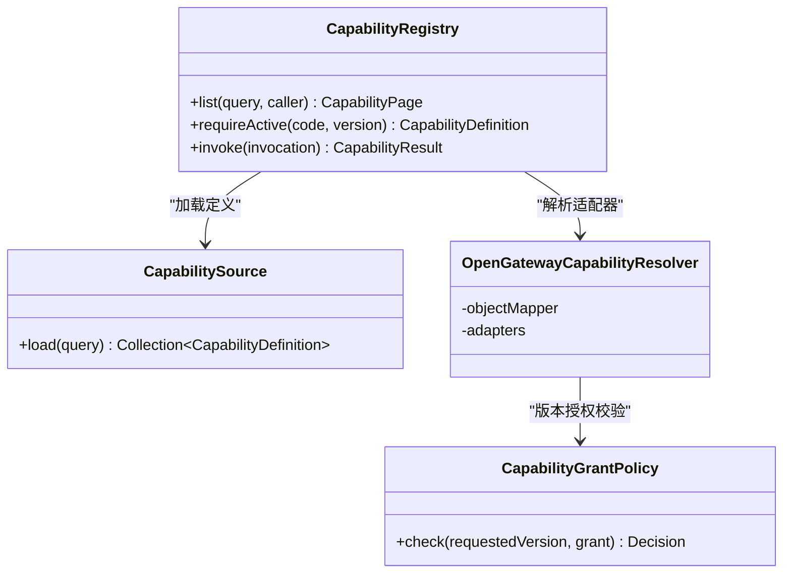
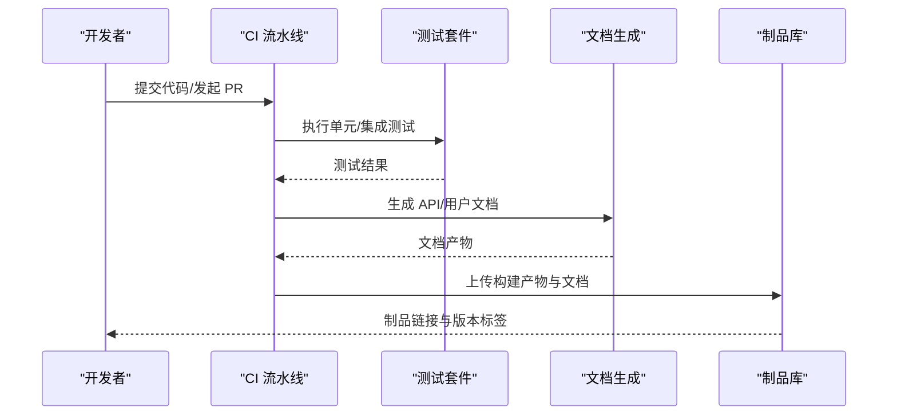
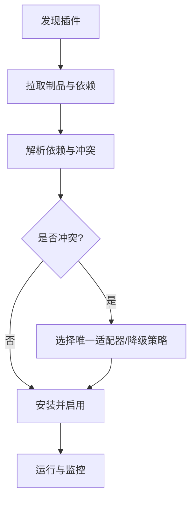
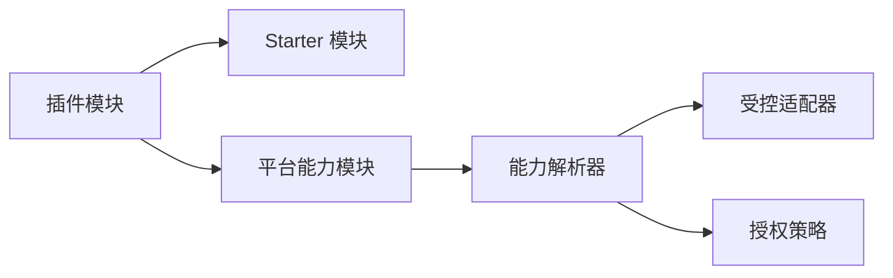

# 插件打包与发布

<cite>
**本文引用的文件**
- [forge-plugin-parent/pom.xml](file://forge-server/forge-framework/forge-plugin-parent/pom.xml)
- [forge-starter-parent/pom.xml](file://forge-server/forge-framework/forge-starter-parent/pom.xml)
- [forge-plugin-system/pom.xml](file://forge-server/forge-framework/forge-plugin-parent/forge-plugin-system/pom.xml)
- [CapabilityRegistry.java](file://forge-server/forge-framework/forge-plugin-parent/forge-plugin-capability-parent/forge-plugin-capability-core/src/main/java/com/mdframe/forge/plugin/capability/registry/CapabilityRegistry.java)
- [CapabilitySource.java](file://forge-server/forge-framework/forge-plugin-parent/forge-plugin-capability-parent/forge-plugin-capability-core/src/main/java/com/mdframe/forge/plugin/capability/spi/CapabilitySource.java)
- [OpenGatewayCapabilityResolver.java](file://forge-server/forge-framework/forge-plugin-parent/forge-plugin-capability-parent/forge-plugin-capability-platform/src/main/java/com/mdframe/forge/plugin/capability/opengateway/catalog/OpenGatewayCapabilityResolver.java)
- [CapabilityGrantPolicy.java](file://forge-server/forge-framework/forge-plugin-parent/forge-plugin-capability-parent/forge-plugin-capability-platform/src/main/java/com/mdframe/forge/plugin/capability/controlplane/security/CapabilityGrantPolicy.java)
- [create-project.mjs](file://scripts/forge-create/create-project.mjs)
- [master-pipeline.yml](file://forge-report-ui/.workflow/master-pipeline.yml)
- [branch-pipeline.yml](file://forge-report-ui/.workflow/branch-pipeline.yml)
- [pr-pipeline.yml](file://forge-report-ui/.workflow/pr-pipeline.yml)
- [automated-testing-standard.md](file://code-copilot/rules/automated-testing-standard.md)
- [test-spec.md](file://code-copilot/changes/templates/test-spec.md)
</cite>

## 目录
1. [简介](#简介)
2. [项目结构](#项目结构)
3. [核心组件](#核心组件)
4. [架构总览](#架构总览)
5. [详细组件分析](#详细组件分析)
6. [依赖分析](#依赖分析)
7. [性能考虑](#性能考虑)
8. [故障排查指南](#故障排查指南)
9. [结论](#结论)
10. [附录](#附录)

## 简介
本指南面向 Forge Admin 的插件开发者与维护者，系统化说明插件项目的构建配置、依赖管理、资源打包策略、版本管理与向后兼容策略，以及完整的发布流程（代码审查、自动化测试、文档生成与仓库发布）。同时给出在 Forge Admin 平台中安装与管理第三方插件的方法，包括插件发现、依赖解析与冲突解决机制，并总结安全检查与漏洞扫描的最佳实践。

## 项目结构
Forge 后端采用 Maven 多模块组织，插件体系以“插件父工程”为中心，聚合多个能力域插件；启动器父工程提供通用能力 Starter，供插件按需引入。前端工程通过工作流流水线完成构建与制品上传。

图表来源
- [forge-plugin-parent/pom.xml:18-30](file://forge-server/forge-framework/forge-plugin-parent/pom.xml#L18-L30)
- [forge-starter-parent/pom.xml:15-39](file://forge-server/forge-framework/forge-starter-parent/pom.xml#L15-L39)

章节来源
- [forge-plugin-parent/pom.xml:1-33](file://forge-server/forge-framework/forge-plugin-parent/pom.xml#L1-L33)
- [forge-starter-parent/pom.xml:1-42](file://forge-server/forge-framework/forge-starter-parent/pom.xml#L1-L42)

## 核心组件
- 插件聚合与依赖基线：插件父工程声明所有插件子模块；启动器父工程统一收敛常用 Starter，便于插件复用基础设施能力。
- 能力注册与调用：能力注册表提供能力列表查询、按版本获取定义与执行调用；能力源 SPI 用于加载能力定义。
- 能力解析与授权：开放网关能力解析器从不可变发布版本中选择唯一受控适配器；授权策略对版本策略进行校验（固定版本或跟随主版本）。
- 工程脚手架：创建脚本根据目录清单动态裁剪后端 POM 模块，确保最小化依赖与可维护性。

章节来源
- [forge-plugin-system/pom.xml:15-99](file://forge-server/forge-framework/forge-plugin-parent/forge-plugin-system/pom.xml#L15-L99)
- [CapabilityRegistry.java:10-17](file://forge-server/forge-framework/forge-plugin-parent/forge-plugin-capability-parent/forge-plugin-capability-core/src/main/java/com/mdframe/forge/plugin/capability/registry/CapabilityRegistry.java#L10-L17)
- [CapabilitySource.java:8-12](file://forge-server/forge-framework/forge-plugin-parent/forge-plugin-capability-parent/forge-plugin-capability-core/src/main/java/com/mdframe/forge/plugin/capability/spi/CapabilitySource.java#L8-L12)
- [OpenGatewayCapabilityResolver.java:13-20](file://forge-server/forge-framework/forge-plugin-parent/forge-plugin-capability-parent/forge-plugin-capability-platform/src/main/java/com/mdframe/forge/plugin/capability/opengateway/catalog/OpenGatewayCapabilityResolver.java#L13-L20)
- [CapabilityGrantPolicy.java:62-83](file://forge-server/forge-framework/forge-plugin-parent/forge-plugin-capability-parent/forge-plugin-capability-platform/src/main/java/com/mdframe/forge/plugin/capability/controlplane/security/CapabilityGrantPolicy.java#L62-L83)
- [create-project.mjs:14-31](file://scripts/forge-create/create-project.mjs#L14-L31)

## 架构总览
下图展示插件从开发到运行时的关键路径：插件通过 SPI 暴露能力定义，运行时由能力注册表加载并按版本解析，授权策略控制版本访问，最终由适配层执行。

图表来源
- [CapabilityRegistry.java:10-17](file://forge-server/forge-framework/forge-plugin-parent/forge-plugin-capability-parent/forge-plugin-capability-core/src/main/java/com/mdframe/forge/plugin/capability/registry/CapabilityRegistry.java#L10-L17)
- [CapabilitySource.java:8-12](file://forge-server/forge-framework/forge-plugin-parent/forge-plugin-capability-parent/forge-plugin-capability-core/src/main/java/com/mdframe/forge/plugin/capability/spi/CapabilitySource.java#L8-L12)
- [OpenGatewayCapabilityResolver.java:13-20](file://forge-server/forge-framework/forge-plugin-parent/forge-plugin-capability-parent/forge-plugin-capability-platform/src/main/java/com/mdframe/forge/plugin/capability/opengateway/catalog/OpenGatewayCapabilityResolver.java#L13-L20)
- [CapabilityGrantPolicy.java:62-83](file://forge-server/forge-framework/forge-plugin-parent/forge-plugin-capability-parent/forge-plugin-capability-platform/src/main/java/com/mdframe/forge/plugin/capability/controlplane/security/CapabilityGrantPolicy.java#L62-L83)

## 详细组件分析

### 插件构建与依赖管理
- 插件聚合：插件父工程集中声明所有插件子模块，便于统一构建与发布。
- 启动器依赖：插件通过引入启动器 Starter（如 core、orm、auth、cache、log、trans、excel、file、datascope、tenant、crypto、social、message、outbound 等）获得基础设施能力。
- 工程裁剪：脚手架脚本根据选择自动替换根 POM 与框架 POM 中的模块列表，保证产物最小化且可维护。

图表来源
- [forge-plugin-parent/pom.xml:18-30](file://forge-server/forge-framework/forge-plugin-parent/pom.xml#L18-L30)
- [forge-plugin-system/pom.xml:15-99](file://forge-server/forge-framework/forge-plugin-parent/forge-plugin-system/pom.xml#L15-L99)
- [create-project.mjs:545-577](file://scripts/forge-create/create-project.mjs#L545-L577)

章节来源
- [forge-plugin-parent/pom.xml:1-33](file://forge-server/forge-framework/forge-plugin-parent/pom.xml#L1-L33)
- [forge-plugin-system/pom.xml:1-103](file://forge-server/forge-framework/forge-plugin-parent/forge-plugin-system/pom.xml#L1-L103)
- [create-project.mjs:1-116](file://scripts/forge-create/create-project.mjs#L1-L116)

### 能力注册与版本解析
- 能力注册表：提供能力分页查询、按 code+version 获取活跃定义、执行调用。
- 能力源 SPI：以函数式接口形式加载能力定义集合，解耦实现。
- 能力解析器：从不可变发布版本中选择唯一的受控来源适配器，避免多实现冲突。
- 授权策略：对请求版本进行策略校验，支持固定版本与跟随主版本两种模式，未满足则拒绝。

图表来源
- [CapabilityRegistry.java:10-17](file://forge-server/forge-framework/forge-plugin-parent/forge-plugin-capability-parent/forge-plugin-capability-core/src/main/java/com/mdframe/forge/plugin/capability/registry/CapabilityRegistry.java#L10-L17)
- [CapabilitySource.java:8-12](file://forge-server/forge-framework/forge-plugin-parent/forge-plugin-capability-parent/forge-plugin-capability-core/src/main/java/com/mdframe/forge/plugin/capability/spi/CapabilitySource.java#L8-L12)
- [OpenGatewayCapabilityResolver.java:13-20](file://forge-server/forge-framework/forge-plugin-parent/forge-plugin-capability-parent/forge-plugin-capability-platform/src/main/java/com/mdframe/forge/plugin/capability/opengateway/catalog/OpenGatewayCapabilityResolver.java#L13-L20)
- [CapabilityGrantPolicy.java:62-83](file://forge-server/forge-framework/forge-plugin-parent/forge-plugin-capability-parent/forge-plugin-capability-platform/src/main/java/com/mdframe/forge/plugin/capability/controlplane/security/CapabilityGrantPolicy.java#L62-L83)

章节来源
- [CapabilityRegistry.java:10-17](file://forge-server/forge-framework/forge-plugin-parent/forge-plugin-capability-parent/forge-plugin-capability-core/src/main/java/com/mdframe/forge/plugin/capability/registry/CapabilityRegistry.java#L10-L17)
- [CapabilitySource.java:8-12](file://forge-server/forge-framework/forge-plugin-parent/forge-plugin-capability-parent/forge-plugin-capability-core/src/main/java/com/mdframe/forge/plugin/capability/spi/CapabilitySource.java#L8-L12)
- [OpenGatewayCapabilityResolver.java:13-20](file://forge-server/forge-framework/forge-plugin-parent/forge-plugin-capability-parent/forge-plugin-capability-platform/src/main/java/com/mdframe/forge/plugin/capability/opengateway/catalog/OpenGatewayCapabilityResolver.java#L13-L20)
- [CapabilityGrantPolicy.java:62-83](file://forge-server/forge-framework/forge-plugin-parent/forge-plugin-capability-parent/forge-plugin-capability-platform/src/main/java/com/mdframe/forge/plugin/capability/controlplane/security/CapabilityGrantPolicy.java#L62-L83)

### 版本管理与向后兼容性
- 语义化版本：能力版本使用三段式语义版本（主.次.修订），发布快照不可变，同一 code+version 仅能注册一次。
- 版本策略：
  - PINNED（固定版本）：必须完全匹配授予版本。
  - FOLLOW_MAJOR（跟随主版本）：主版本一致即允许。
- 兼容性建议：
  - 新增字段默认值可空或带默认值，避免破坏旧客户端。
  - 删除或重命名字段需通过迁移脚本与废弃期过渡。
  - 对外 API 变更遵循最小破坏原则，优先扩展而非修改。

章节来源
- [CapabilityGrantPolicy.java:62-83](file://forge-server/forge-framework/forge-plugin-parent/forge-plugin-capability-parent/forge-plugin-capability-platform/src/main/java/com/mdframe/forge/plugin/capability/controlplane/security/CapabilityGrantPolicy.java#L62-L83)

### 发布流程（代码审查、自动化测试、文档生成、仓库发布）
- 分支与流水线：
  - PR 流水线：Node 环境构建、产物暂存与上传制品库。
  - 分支流水线：构建与制品上传，后续可接入 release 阶段。
  - Master 流水线：构建与制品上传，后续可接入 release 阶段。
- 测试规范：
  - 增量优先、证据优先、最小闭环、可复跑、不污染环境。
  - 每次验证前读取现有 spec、tasks、test-spec、execution-log，避免重复劳动。
- 文档生成：建议在流水线中集成 Javadoc/Swagger/Markdown 文档生成步骤，并将产物作为制品归档。
- 仓库发布：制品上传至制品库后，通过版本号与标签关联源码，便于回溯与回滚。

图表来源
- [pr-pipeline.yml:1-36](file://forge-report-ui/.workflow/pr-pipeline.yml#L1-L36)
- [branch-pipeline.yml:1-33](file://forge-report-ui/.workflow/branch-pipeline.yml#L1-L33)
- [master-pipeline.yml:1-33](file://forge-report-ui/.workflow/master-pipeline.yml#L1-L33)
- [automated-testing-standard.md:1-24](file://code-copilot/rules/automated-testing-standard.md#L1-L24)
- [test-spec.md:1-47](file://code-copilot/changes/templates/test-spec.md#L1-L47)

章节来源
- [pr-pipeline.yml:1-36](file://forge-report-ui/.workflow/pr-pipeline.yml#L1-L36)
- [branch-pipeline.yml:1-33](file://forge-report-ui/.workflow/branch-pipeline.yml#L1-L33)
- [master-pipeline.yml:1-33](file://forge-report-ui/.workflow/master-pipeline.yml#L1-L33)
- [automated-testing-standard.md:1-24](file://code-copilot/rules/automated-testing-standard.md#L1-L24)
- [test-spec.md:1-47](file://code-copilot/changes/templates/test-spec.md#L1-L47)

### 在 Forge Admin 平台安装与管理第三方插件
- 插件发现：通过能力注册表列出可用能力，支持分页与过滤。
- 依赖解析：插件依赖 Starter 与平台能力，构建时由 Maven 解析依赖树，确保无循环与缺失。
- 冲突解决：开放网关能力解析器从不可变发布版本中选择唯一适配器，避免多实现冲突。
- 安装步骤（概念流程）：
  1) 将插件制品部署至制品库。
  2) 在目标环境中引入对应 Starter 与插件依赖。
  3) 启动服务，能力注册表加载 SPI 实现。
  4) 通过管理界面或 API 启用所需能力与版本。

图表来源
- [CapabilityRegistry.java:10-17](file://forge-server/forge-framework/forge-plugin-parent/forge-plugin-capability-parent/forge-plugin-capability-core/src/main/java/com/mdframe/forge/plugin/capability/registry/CapabilityRegistry.java#L10-L17)
- [OpenGatewayCapabilityResolver.java:13-20](file://forge-server/forge-framework/forge-plugin-parent/forge-plugin-capability-parent/forge-plugin-capability-platform/src/main/java/com/mdframe/forge/plugin/capability/opengateway/catalog/OpenGatewayCapabilityResolver.java#L13-L20)

章节来源
- [CapabilityRegistry.java:10-17](file://forge-server/forge-framework/forge-plugin-parent/forge-plugin-capability-parent/forge-plugin-capability-core/src/main/java/com/mdframe/forge/plugin/capability/registry/CapabilityRegistry.java#L10-L17)
- [OpenGatewayCapabilityResolver.java:13-20](file://forge-server/forge-framework/forge-plugin-parent/forge-plugin-capability-parent/forge-plugin-capability-platform/src/main/java/com/mdframe/forge/plugin/capability/opengateway/catalog/OpenGatewayCapabilityResolver.java#L13-L20)

### 安全检查与漏洞扫描最佳实践
- 依赖安全：在流水线中加入依赖漏洞扫描（如 SCA 工具），阻断高危漏洞制品入库。
- 代码安全：静态扫描（SAST）与依赖泄露检查，禁止硬编码密钥与敏感信息。
- 制品签名与校验：对发布制品进行签名与完整性校验，防止篡改。
- 权限最小化：插件仅声明必要依赖与权限，减少攻击面。
- 审计与追踪：记录构建环境与依赖版本，确保可追溯。

[本节为通用指导，不直接分析具体文件]

## 依赖分析
- 耦合与内聚：插件通过 Starter 获得基础设施能力，降低与具体实现的耦合；能力 SPI 进一步解耦实现与调用方。
- 直接依赖：插件依赖 Starter 与平台能力模块；能力解析器依赖 ObjectMapper 与适配器集合。
- 间接依赖：通过 Maven 依赖管理统一版本，避免版本漂移。
- 外部依赖：Spring Boot Web、Jackson 等基础库。

图表来源
- [forge-plugin-system/pom.xml:15-99](file://forge-server/forge-framework/forge-plugin-parent/forge-plugin-system/pom.xml#L15-L99)
- [OpenGatewayCapabilityResolver.java:13-20](file://forge-server/forge-framework/forge-plugin-parent/forge-plugin-capability-parent/forge-plugin-capability-platform/src/main/java/com/mdframe/forge/plugin/capability/opengateway/catalog/OpenGatewayCapabilityResolver.java#L13-L20)
- [CapabilityGrantPolicy.java:62-83](file://forge-server/forge-framework/forge-plugin-parent/forge-plugin-capability-parent/forge-plugin-capability-platform/src/main/java/com/mdframe/forge/plugin/capability/controlplane/security/CapabilityGrantPolicy.java#L62-L83)

章节来源
- [forge-plugin-system/pom.xml:15-99](file://forge-server/forge-framework/forge-plugin-parent/forge-plugin-system/pom.xml#L15-L99)
- [OpenGatewayCapabilityResolver.java:13-20](file://forge-server/forge-framework/forge-plugin-parent/forge-plugin-capability-parent/forge-plugin-capability-platform/src/main/java/com/mdframe/forge/plugin/capability/opengateway/catalog/OpenGatewayCapabilityResolver.java#L13-L20)
- [CapabilityGrantPolicy.java:62-83](file://forge-server/forge-framework/forge-plugin-parent/forge-plugin-capability-parent/forge-plugin-capability-platform/src/main/java/com/mdframe/forge/plugin/capability/controlplane/security/CapabilityGrantPolicy.java#L62-L83)

## 性能考虑
- 依赖最小化：通过脚手架裁剪 POM 模块，减少依赖体积与启动时间。
- 能力解析缓存：对能力定义与解析结果进行缓存，降低重复解析开销。
- 版本策略优化：优先使用 FOLLOW_MAJOR 策略提升兼容性，减少频繁升级成本。
- 构建并行化：利用 Maven 并行构建与缓存加速流水线。

[本节为通用指导，不直接分析具体文件]

## 故障排查指南
- 构建失败：检查 POM 模块列表与依赖版本，确认脚手架是否正确裁剪。
- 依赖冲突：查看依赖树，定位重复或冲突版本，必要时引入排除或强制版本。
- 能力解析失败：确认能力定义已正确注册，版本策略是否满足授权要求。
- 授权拒绝：核对请求版本与授予版本的策略（PINNED/FOLLOW_MAJOR），调整版本或策略。
- 流水线失败：查看流水线日志，确认 Node 版本、构建命令与制品路径配置。

章节来源
- [create-project.mjs:545-577](file://scripts/forge-create/create-project.mjs#L545-L577)
- [CapabilityGrantPolicy.java:62-83](file://forge-server/forge-framework/forge-plugin-parent/forge-plugin-capability-parent/forge-plugin-capability-platform/src/main/java/com/mdframe/forge/plugin/capability/controlplane/security/CapabilityGrantPolicy.java#L62-L83)
- [pr-pipeline.yml:1-36](file://forge-report-ui/.workflow/pr-pipeline.yml#L1-L36)

## 结论
Forge Admin 的插件体系通过清晰的模块化与 SPI 设计，实现了高内聚低耦合的能力开放与扩展。借助统一的构建与发布流水线、严格的版本策略与安全扫描，能够稳定地交付高质量插件。建议在开发过程中严格遵循测试规范与版本管理策略，确保向后兼容与可维护性。

## 附录
- 快速参考：
  - 插件父工程：聚合插件模块，统一管理构建与发布。
  - 启动器父工程：收敛 Starter，提供基础设施能力。
  - 能力注册表：能力发现、版本解析与调用入口。
  - 流水线：PR/Branch/Master 三套流水线覆盖构建、测试与制品发布。
  - 测试规范：增量优先、证据优先、最小闭环、可复跑、不污染环境。

[本节为概览性内容，不直接分析具体文件]