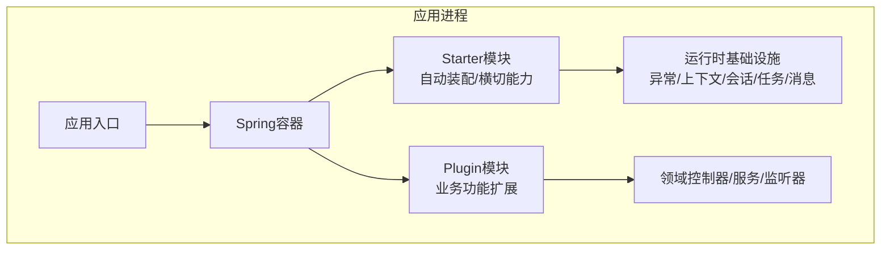
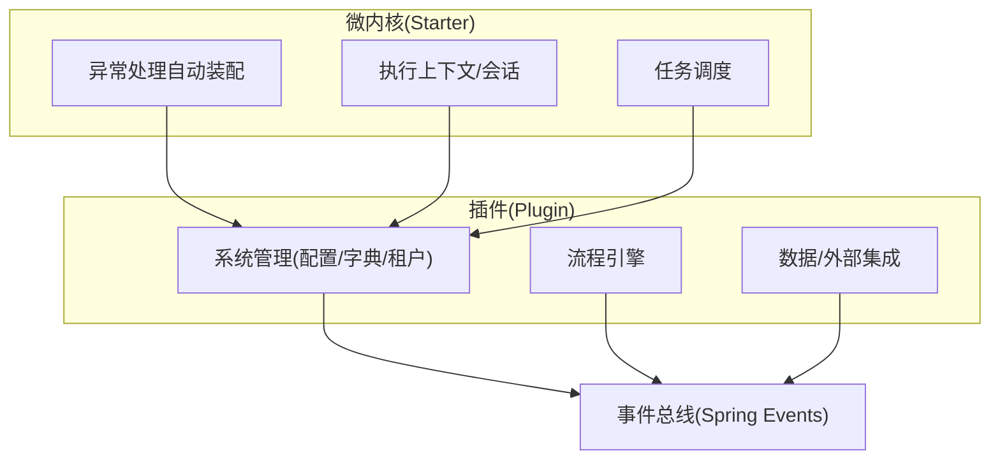
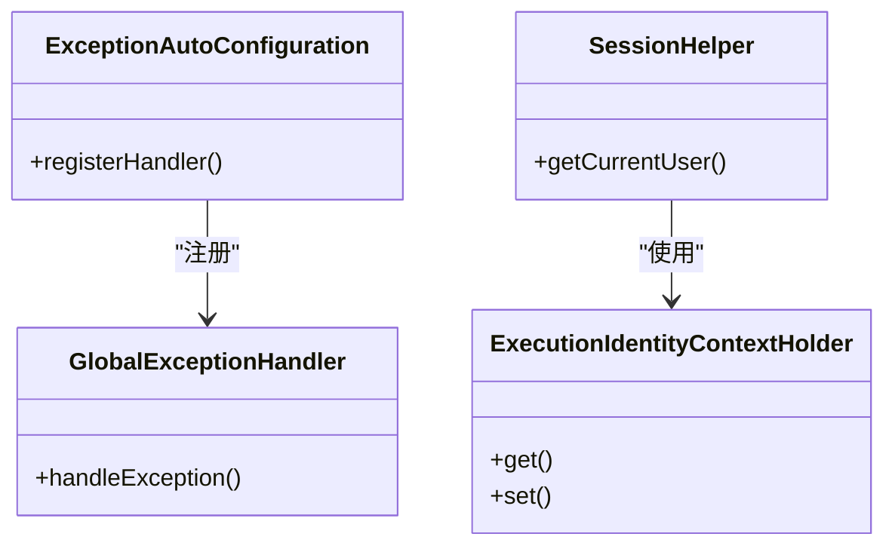
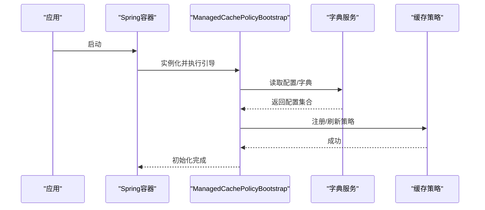
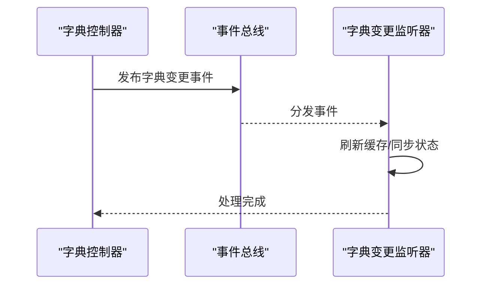
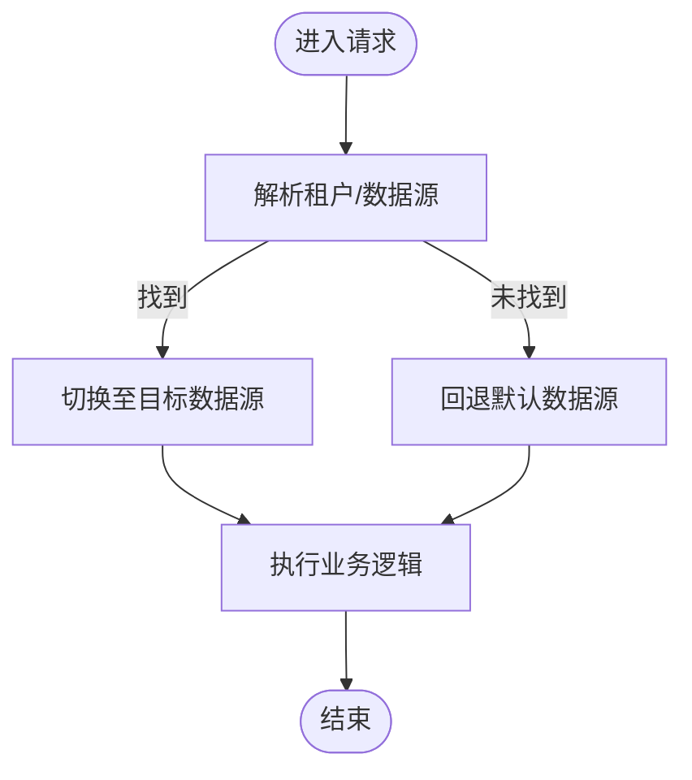
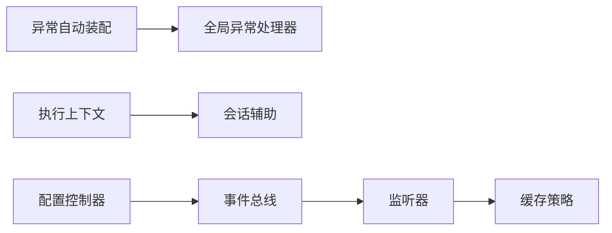

# 插件架构设计

<cite>
**本文引用的文件**
- [forge-starter-core/ExceptionAutoConfiguration.java](file://forge-server/forge-framework/forge-starter-parent/forge-starter-core/src/main/java/com/mdframe/forge/starter/core/config/ExceptionAutoConfiguration.java)
- [forge-starter-core/GlobalExceptionHandler.java](file://forge-server/forge-framework/forge-starter-parent/forge-starter-core/src/main/java/com/mdframe/forge/starter/core/exception/GlobalExceptionHandler.java)
- [forge-starter-core/BusinessException.java](file://forge-server/forge-framework/forge-starter-parent/forge-starter-core/src/main/java/com/mdframe/forge/starter/core/exception/BusinessException.java)
- [forge-starter-core/ExecutionIdentityContextHolder.java](file://forge-server/forge-framework/forge-starter-parent/forge-starter-core/src/main/java/com/mdframe/forge/starter/core/context/ExecutionIdentityContextHolder.java)
- [forge-starter-core/ExecutionIdentity.java](file://forge-server/forge-framework/forge-starter-parent/forge-starter-core/src/main/java/com/mdframe/forge/starter/core/context/ExecutionIdentity.java)
- [forge-starter-core/LoginUser.java](file://forge-server/forge-framework/forge-starter-parent/forge-starter-core/src/main/java/com/mdframe/forge/starter/core/session/LoginUser.java)
- [forge-starter-core/SessionHelper.java](file://forge-server/forge-framework/forge-starter-parent/forge-starter-core/src/main/java/com/mdframe/forge/starter/core/session/SessionHelper.java)
- [forge-plugin-system/SysConfigController.java](file://forge-server/forge-framework/forge-plugin-parent/forge-plugin-system/src/main/java/com/mdframe/forge/plugin/system/controller/SysConfigController.java)
- [forge-plugin-system/SysDictTypeController.java](file://forge-server/forge-framework/forge-plugin-parent/forge-plugin-system/src/main/java/com/mdframe/forge/plugin/system/controller/SysDictTypeController.java)
- [forge-plugin-system/SysDictDataController.java](file://forge-server/forge-framework/forge-plugin-parent/forge-plugin-system/src/main/java/com/mdframe/forge/plugin/system/controller/SysDictDataController.java)
- [forge-plugin-system/ManagedCachePolicyBootstrap.java](file://forge-server/forge-framework/forge-plugin-parent/forge-plugin-system/src/main/java/com/mdframe/forge/plugin/system/listener/ManagedCachePolicyBootstrap.java)
- [forge-plugin-system/SystemSaTokenListener.java](file://forge-server/forge-framework/forge-plugin-parent/forge-plugin-system/src/main/java/com/mdframe/forge/plugin/system/listener/SystemSaTokenListener.java)
- [forge-plugin-system/DictChangeEvent.java](file://forge-server/forge-framework/forge-plugin-parent/forge-plugin-system/src/main/java/com/mdframe/forge/plugin/system/listener/DictChangeEvent.java)
- [forge-plugin-system/DictChangeEventListener.java](file://forge-server/forge-framework/forge-plugin-parent/forge-plugin-system/src/main/java/com/mdframe/forge/plugin/system/listener/DictChangeEventListener.java)
- [forge-plugin-system/SysTenantBusinessDataSourceResolver.java](file://forge-server/forge-framework/forge-plugin-parent/forge-plugin-system/src/main/java/com/mdframe/forge/plugin/system/datasource/SysTenantBusinessDataSourceResolver.java)
- [forge-starter-job/JobStarter.java](file://forge-server/forge-framework/forge-starter-parent/forge-starter-job/src/main/java/com/mdframe/forge/starter/job/JobStarter.java)
</cite>

## 目录
1. [简介](#简介)
2. [项目结构](#项目结构)
3. [核心组件](#核心组件)
4. [架构总览](#架构总览)
5. [详细组件分析](#详细组件分析)
6. [依赖关系分析](#依赖关系分析)
7. [性能考量](#性能考量)
8. [故障排查指南](#故障排查指南)
9. [结论](#结论)
10. [附录](#附录)

## 简介
本文件面向Forge Admin的插件体系，围绕微内核架构、插件发现与生命周期、依赖注入模式、Starter与Plugin的职责边界、插件间通信（事件总线）、扩展点机制、配置管理、版本控制与热部署等主题进行系统化说明。文档以仓库中实际代码为依据，通过架构图、时序图与流程图帮助开发者快速理解并高效扩展系统能力。

## 项目结构
仓库采用“Starter + Plugin”的双层模块化组织：
- Starter（启动器）：提供横切能力与自动装配，如异常处理、上下文、会话、任务调度、缓存、消息、Web等。
- Plugin（插件）：基于Spring容器加载的业务能力包，如系统管理、流程、数据、外部集成、消息、作业等。

图表来源
- [forge-starter-core/ExceptionAutoConfiguration.java](file://forge-server/forge-framework/forge-starter-parent/forge-starter-core/src/main/java/com/mdframe/forge/starter/core/config/ExceptionAutoConfiguration.java)
- [forge-starter-core/GlobalExceptionHandler.java](file://forge-server/forge-framework/forge-starter-parent/forge-starter-core/src/main/java/com/mdframe/forge/starter/core/exception/GlobalExceptionHandler.java)
- [forge-plugin-system/SysConfigController.java](file://forge-server/forge-framework/forge-plugin-parent/forge-plugin-system/src/main/java/com/mdframe/forge/plugin/system/controller/SysConfigController.java)

章节来源
- [forge-starter-core/ExceptionAutoConfiguration.java](file://forge-server/forge-framework/forge-starter-parent/forge-starter-core/src/main/java/com/mdframe/forge/starter/core/config/ExceptionAutoConfiguration.java)
- [forge-starter-core/GlobalExceptionHandler.java](file://forge-server/forge-framework/forge-starter-parent/forge-starter-core/src/main/java/com/mdframe/forge/starter/core/exception/GlobalExceptionHandler.java)
- [forge-plugin-system/SysConfigController.java](file://forge-server/forge-framework/forge-plugin-parent/forge-plugin-system/src/main/java/com/mdframe/forge/plugin/system/controller/SysConfigController.java)

## 核心组件
- 微内核与自动装配：通过Starter的自动配置类在容器启动阶段注册全局能力（如统一异常处理器），为Plugin提供稳定运行基座。
- 执行上下文与会话：统一的执行身份与登录用户上下文，贯穿请求链路，支撑权限、租户、审计等横切关注点。
- 插件能力：以Plugin形式提供可插拔业务能力，遵循约定优于配置，通过标准接口或注解暴露扩展点。
- 事件驱动：基于Spring事件机制实现插件间解耦通信，支持字典变更、缓存策略刷新等场景。
- 配置与元数据：集中式配置与字典管理，结合监听器实现动态刷新与缓存一致性。
- 任务与异步：内置任务调度Starter，便于插件编排定时任务与异步处理。

章节来源
- [forge-starter-core/ExecutionIdentityContextHolder.java](file://forge-server/forge-framework/forge-starter-parent/forge-starter-core/src/main/java/com/mdframe/forge/starter/core/context/ExecutionIdentityContextHolder.java)
- [forge-starter-core/ExecutionIdentity.java](file://forge-server/forge-framework/forge-starter-parent/forge-starter-core/src/main/java/com/mdframe/forge/starter/core/context/ExecutionIdentity.java)
- [forge-starter-core/LoginUser.java](file://forge-server/forge-framework/forge-starter-parent/forge-starter-core/src/main/java/com/mdframe/forge/starter/core/session/LoginUser.java)
- [forge-starter-core/SessionHelper.java](file://forge-server/forge-framework/forge-starter-parent/forge-starter-core/src/main/java/com/mdframe/forge/starter/core/session/SessionHelper.java)
- [forge-plugin-system/ManagedCachePolicyBootstrap.java](file://forge-server/forge-framework/forge-plugin-parent/forge-plugin-system/src/main/java/com/mdframe/forge/plugin/system/listener/ManagedCachePolicyBootstrap.java)
- [forge-plugin-system/DictChangeEvent.java](file://forge-server/forge-framework/forge-plugin-parent/forge-plugin-system/src/main/java/com/mdframe/forge/plugin/system/listener/DictChangeEvent.java)
- [forge-plugin-system/DictChangeEventListener.java](file://forge-server/forge-framework/forge-plugin-parent/forge-plugin-system/src/main/java/com/mdframe/forge/plugin/system/listener/DictChangeEventListener.java)
- [forge-starter-job/JobStarter.java](file://forge-server/forge-framework/forge-starter-parent/forge-starter-job/src/main/java/com/mdframe/forge/starter/job/JobStarter.java)

## 架构总览
下图展示了微内核（Starter）与插件（Plugin）的协作关系，以及事件总线在插件间的解耦通信。

图表来源
- [forge-starter-core/ExceptionAutoConfiguration.java](file://forge-server/forge-framework/forge-starter-parent/forge-starter-core/src/main/java/com/mdframe/forge/starter/core/config/ExceptionAutoConfiguration.java)
- [forge-starter-core/GlobalExceptionHandler.java](file://forge-server/forge-framework/forge-starter-parent/forge-starter-core/src/main/java/com/mdframe/forge/starter/core/exception/GlobalExceptionHandler.java)
- [forge-starter-core/ExecutionIdentityContextHolder.java](file://forge-server/forge-framework/forge-starter-parent/forge-starter-core/src/main/java/com/mdframe/forge/starter/core/context/ExecutionIdentityContextHolder.java)
- [forge-starter-core/SessionHelper.java](file://forge-server/forge-framework/forge-starter-parent/forge-starter-core/src/main/java/com/mdframe/forge/starter/core/session/SessionHelper.java)
- [forge-starter-job/JobStarter.java](file://forge-server/forge-framework/forge-starter-parent/forge-starter-job/src/main/java/com/mdframe/forge/starter/job/JobStarter.java)
- [forge-plugin-system/SysConfigController.java](file://forge-server/forge-framework/forge-plugin-parent/forge-plugin-system/src/main/java/com/mdframe/forge/plugin/system/controller/SysConfigController.java)
- [forge-plugin-system/DictChangeEvent.java](file://forge-server/forge-framework/forge-plugin-parent/forge-plugin-system/src/main/java/com/mdframe/forge/plugin/system/listener/DictChangeEvent.java)
- [forge-plugin-system/DictChangeEventListener.java](file://forge-server/forge-framework/forge-plugin-parent/forge-plugin-system/src/main/java/com/mdframe/forge/plugin/system/listener/DictChangeEventListener.java)

## 详细组件分析

### 微内核与自动装配（Starter）
- 统一异常处理：通过自动配置将全局异常处理器注册到容器中，确保各插件抛出的异常被一致化处理。
- 执行上下文：提供线程安全的执行身份持有者，用于跨组件传递当前用户、租户等信息。
- 会话与认证：封装登录用户信息获取与校验，配合安全监听器完成鉴权相关行为。

图表来源
- [forge-starter-core/ExceptionAutoConfiguration.java](file://forge-server/forge-framework/forge-starter-parent/forge-starter-core/src/main/java/com/mdframe/forge/starter/core/config/ExceptionAutoConfiguration.java)
- [forge-starter-core/GlobalExceptionHandler.java](file://forge-server/forge-framework/forge-starter-parent/forge-starter-core/src/main/java/com/mdframe/forge/starter/core/exception/GlobalExceptionHandler.java)
- [forge-starter-core/ExecutionIdentityContextHolder.java](file://forge-server/forge-framework/forge-starter-parent/forge-starter-core/src/main/java/com/mdframe/forge/starter/core/context/ExecutionIdentityContextHolder.java)
- [forge-starter-core/SessionHelper.java](file://forge-server/forge-framework/forge-starter-parent/forge-starter-core/src/main/java/com/mdframe/forge/starter/core/session/SessionHelper.java)

章节来源
- [forge-starter-core/ExceptionAutoConfiguration.java](file://forge-server/forge-framework/forge-starter-parent/forge-starter-core/src/main/java/com/mdframe/forge/starter/core/config/ExceptionAutoConfiguration.java)
- [forge-starter-core/GlobalExceptionHandler.java](file://forge-server/forge-framework/forge-starter-parent/forge-starter-core/src/main/java/com/mdframe/forge/starter/core/exception/GlobalExceptionHandler.java)
- [forge-starter-core/ExecutionIdentityContextHolder.java](file://forge-server/forge-framework/forge-starter-parent/forge-starter-core/src/main/java/com/mdframe/forge/starter/core/context/ExecutionIdentityContextHolder.java)
- [forge-starter-core/SessionHelper.java](file://forge-server/forge-framework/forge-starter-parent/forge-starter-core/src/main/java/com/mdframe/forge/starter/core/session/SessionHelper.java)

### 插件发现与生命周期
- 插件发现：以独立Jar包形式存在，由Spring扫描并加载；通过starter自动装配与约定路径完成初始化。
- 生命周期：容器启动时按依赖顺序初始化Bean；可通过监听器在特定阶段执行初始化逻辑（如缓存策略引导）。
- 扩展点：通过策略接口、监听器、控制器等标准扩展点进行能力接入。

图表来源
- [forge-plugin-system/ManagedCachePolicyBootstrap.java](file://forge-server/forge-framework/forge-plugin-parent/forge-plugin-system/src/main/java/com/mdframe/forge/plugin/system/listener/ManagedCachePolicyBootstrap.java)
- [forge-plugin-system/SysConfigController.java](file://forge-server/forge-framework/forge-plugin-parent/forge-plugin-system/src/main/java/com/mdframe/forge/plugin/system/controller/SysConfigController.java)

章节来源
- [forge-plugin-system/ManagedCachePolicyBootstrap.java](file://forge-server/forge-framework/forge-plugin-parent/forge-plugin-system/src/main/java/com/mdframe/forge/plugin/system/listener/ManagedCachePolicyBootstrap.java)
- [forge-plugin-system/SysConfigController.java](file://forge-server/forge-framework/forge-plugin-parent/forge-plugin-system/src/main/java/com/mdframe/forge/plugin/system/controller/SysConfigController.java)

### 插件间通信与事件总线
- 事件模型：定义领域事件（如字典变更事件），由生产者发布，消费者订阅处理。
- 解耦优势：插件无需直接依赖，仅通过事件契约交互，提升可维护性与可扩展性。
- 典型场景：字典更新后通知缓存策略、监听器刷新本地缓存。

图表来源
- [forge-plugin-system/SysDictTypeController.java](file://forge-server/forge-framework/forge-plugin-parent/forge-plugin-system/src/main/java/com/mdframe/forge/plugin/system/controller/SysDictTypeController.java)
- [forge-plugin-system/SysDictDataController.java](file://forge-server/forge-framework/forge-plugin-parent/forge-plugin-system/src/main/java/com/mdframe/forge/plugin/system/controller/SysDictDataController.java)
- [forge-plugin-system/DictChangeEvent.java](file://forge-server/forge-framework/forge-plugin-parent/forge-plugin-system/src/main/java/com/mdframe/forge/plugin/system/listener/DictChangeEvent.java)
- [forge-plugin-system/DictChangeEventListener.java](file://forge-server/forge-framework/forge-plugin-parent/forge-plugin-system/src/main/java/com/mdframe/forge/plugin/system/listener/DictChangeEventListener.java)

章节来源
- [forge-plugin-system/SysDictTypeController.java](file://forge-server/forge-framework/forge-plugin-parent/forge-plugin-system/src/main/java/com/mdframe/forge/plugin/system/controller/SysDictTypeController.java)
- [forge-plugin-system/SysDictDataController.java](file://forge-server/forge-framework/forge-plugin-parent/forge-plugin-system/src/main/java/com/mdframe/forge/plugin/system/controller/SysDictDataController.java)
- [forge-plugin-system/DictChangeEvent.java](file://forge-server/forge-framework/forge-plugin-parent/forge-plugin-system/src/main/java/com/mdframe/forge/plugin/system/listener/DictChangeEvent.java)
- [forge-plugin-system/DictChangeEventListener.java](file://forge-server/forge-framework/forge-plugin-parent/forge-plugin-system/src/main/java/com/mdframe/forge/plugin/system/listener/DictChangeEventListener.java)

### 依赖注入模式与扩展点
- 依赖注入：基于Spring IoC容器，Starter与Plugin之间通过接口与实现解耦，便于替换与测试。
- 扩展点示例：
  - 数据源解析：按租户选择业务数据源，实现多租户隔离。
  - 安全监听：登录前后钩子，用于审计、风控等。
- 最佳实践：优先使用接口抽象，避免强耦合；通过配置开关控制扩展启用。

图表来源
- [forge-plugin-system/SysTenantBusinessDataSourceResolver.java](file://forge-server/forge-framework/forge-plugin-parent/forge-plugin-system/src/main/java/com/mdframe/forge/plugin/system/datasource/SysTenantBusinessDataSourceResolver.java)

章节来源
- [forge-plugin-system/SysTenantBusinessDataSourceResolver.java](file://forge-server/forge-framework/forge-plugin-parent/forge-plugin-system/src/main/java/com/mdframe/forge/plugin/system/datasource/SysTenantBusinessDataSourceResolver.java)

### Starter插件与Plugin插件的区别与联系
- Starter（启动器）：聚焦横切能力与自动装配，提供稳定的运行时基础设施（异常、上下文、任务、消息、Web等）。
- Plugin（插件）：聚焦业务能力扩展，基于Starter提供的能力实现具体功能（系统管理、流程、数据等）。
- 联系：Plugin依赖Starter提供的能力；Starter不感知具体Plugin实现，保持微内核的稳定性与可演进性。

章节来源
- [forge-starter-core/ExceptionAutoConfiguration.java](file://forge-server/forge-framework/forge-starter-parent/forge-starter-core/src/main/java/com/mdframe/forge/starter/core/config/ExceptionAutoConfiguration.java)
- [forge-starter-core/GlobalExceptionHandler.java](file://forge-server/forge-framework/forge-starter-parent/forge-starter-core/src/main/java/com/mdframe/forge/starter/core/exception/GlobalExceptionHandler.java)
- [forge-starter-core/ExecutionIdentityContextHolder.java](file://forge-server/forge-framework/forge-starter-parent/forge-starter-core/src/main/java/com/mdframe/forge/starter/core/context/ExecutionIdentityContextHolder.java)
- [forge-starter-core/SessionHelper.java](file://forge-server/forge-framework/forge-starter-parent/forge-starter-core/src/main/java/com/mdframe/forge/starter/core/session/SessionHelper.java)
- [forge-starter-job/JobStarter.java](file://forge-server/forge-framework/forge-starter-parent/forge-starter-job/src/main/java/com/mdframe/forge/starter/job/JobStarter.java)
- [forge-plugin-system/SysConfigController.java](file://forge-server/forge-framework/forge-plugin-parent/forge-plugin-system/src/main/java/com/mdframe/forge/plugin/system/controller/SysConfigController.java)

### 配置管理与版本控制
- 配置中心：通过系统配置控制器提供配置的增删改查与动态刷新能力。
- 版本控制：建议对配置项引入版本号与生效时间，结合监听器实现灰度与回滚。
- 缓存一致性：配置变更后发布事件，监听器同步刷新缓存，保证读路径一致性。

章节来源
- [forge-plugin-system/SysConfigController.java](file://forge-server/forge-framework/forge-plugin-parent/forge-plugin-system/src/main/java/com/mdframe/forge/plugin/system/controller/SysConfigController.java)
- [forge-plugin-system/DictChangeEvent.java](file://forge-server/forge-framework/forge-plugin-parent/forge-plugin-system/src/main/java/com/mdframe/forge/plugin/system/listener/DictChangeEvent.java)
- [forge-plugin-system/DictChangeEventListener.java](file://forge-server/forge-framework/forge-plugin-parent/forge-plugin-system/src/main/java/com/mdframe/forge/plugin/system/listener/DictChangeEventListener.java)

### 热部署方案
- 运行时热更新：通过事件驱动的缓存刷新机制，在不重启进程的情况下更新配置/字典等静态资源。
- 安全边界：对敏感配置增加签名校验与权限控制，防止恶意篡改。
- 回滚策略：保留历史版本快照，支持一键回滚与审计追踪。

章节来源
- [forge-plugin-system/ManagedCachePolicyBootstrap.java](file://forge-server/forge-framework/forge-plugin-parent/forge-plugin-system/src/main/java/com/mdframe/forge/plugin/system/listener/ManagedCachePolicyBootstrap.java)
- [forge-plugin-system/DictChangeEvent.java](file://forge-server/forge-framework/forge-plugin-parent/forge-plugin-system/src/main/java/com/mdframe/forge/plugin/system/listener/DictChangeEvent.java)
- [forge-plugin-system/DictChangeEventListener.java](file://forge-server/forge-framework/forge-plugin-parent/forge-plugin-system/src/main/java/com/mdframe/forge/plugin/system/listener/DictChangeEventListener.java)

## 依赖关系分析
- Starter与Plugin松耦合：Starter仅提供基础设施，Plugin通过标准接口与事件与之交互。
- 事件总线作为横向通信通道：降低插件间直接依赖，提高可测试性与可替换性。
- 关键依赖链：
  - 异常处理：自动配置 -> 全局异常处理器
  - 上下文：执行身份持有者 -> 会话辅助
  - 配置：配置控制器 -> 事件 -> 监听器 -> 缓存策略

图表来源
- [forge-starter-core/ExceptionAutoConfiguration.java](file://forge-server/forge-framework/forge-starter-parent/forge-starter-core/src/main/java/com/mdframe/forge/starter/core/config/ExceptionAutoConfiguration.java)
- [forge-starter-core/GlobalExceptionHandler.java](file://forge-server/forge-framework/forge-starter-parent/forge-starter-core/src/main/java/com/mdframe/forge/starter/core/exception/GlobalExceptionHandler.java)
- [forge-starter-core/ExecutionIdentityContextHolder.java](file://forge-server/forge-framework/forge-starter-parent/forge-starter-core/src/main/java/com/mdframe/forge/starter/core/context/ExecutionIdentityContextHolder.java)
- [forge-starter-core/SessionHelper.java](file://forge-server/forge-framework/forge-starter-parent/forge-starter-core/src/main/java/com/mdframe/forge/starter/core/session/SessionHelper.java)
- [forge-plugin-system/SysConfigController.java](file://forge-server/forge-framework/forge-plugin-parent/forge-plugin-system/src/main/java/com/mdframe/forge/plugin/system/controller/SysConfigController.java)
- [forge-plugin-system/DictChangeEvent.java](file://forge-server/forge-framework/forge-plugin-parent/forge-plugin-system/src/main/java/com/mdframe/forge/plugin/system/listener/DictChangeEvent.java)
- [forge-plugin-system/DictChangeEventListener.java](file://forge-server/forge-framework/forge-plugin-parent/forge-plugin-system/src/main/java/com/mdframe/forge/plugin/system/listener/DictChangeEventListener.java)

章节来源
- [forge-starter-core/ExceptionAutoConfiguration.java](file://forge-server/forge-framework/forge-starter-parent/forge-starter-core/src/main/java/com/mdframe/forge/starter/core/config/ExceptionAutoConfiguration.java)
- [forge-starter-core/GlobalExceptionHandler.java](file://forge-server/forge-framework/forge-starter-parent/forge-starter-core/src/main/java/com/mdframe/forge/starter/core/exception/GlobalExceptionHandler.java)
- [forge-starter-core/ExecutionIdentityContextHolder.java](file://forge-server/forge-framework/forge-starter-parent/forge-starter-core/src/main/java/com/mdframe/forge/starter/core/context/ExecutionIdentityContextHolder.java)
- [forge-starter-core/SessionHelper.java](file://forge-server/forge-framework/forge-starter-parent/forge-starter-core/src/main/java/com/mdframe/forge/starter/core/session/SessionHelper.java)
- [forge-plugin-system/SysConfigController.java](file://forge-server/forge-framework/forge-plugin-parent/forge-plugin-system/src/main/java/com/mdframe/forge/plugin/system/controller/SysConfigController.java)
- [forge-plugin-system/DictChangeEvent.java](file://forge-server/forge-framework/forge-plugin-parent/forge-plugin-system/src/main/java/com/mdframe/forge/plugin/system/listener/DictChangeEvent.java)
- [forge-plugin-system/DictChangeEventListener.java](file://forge-server/forge-framework/forge-plugin-parent/forge-plugin-system/src/main/java/com/mdframe/forge/plugin/system/listener/DictChangeEventListener.java)

## 性能考量
- 事件处理异步化：对耗时操作（如缓存全量刷新）采用异步执行，避免阻塞主流程。
- 缓存粒度优化：按租户/模块维度缓存，减少锁竞争与内存占用。
- 连接池与限流：合理设置数据库连接池大小，对外部调用增加超时与重试策略。
- 监控与度量：对关键路径埋点，观察QPS、延迟与错误率，持续调优。

[本节为通用指导，不直接分析具体文件]

## 故障排查指南
- 统一异常：通过全局异常处理器捕获并标准化响应，便于前端统一处理。
- 常见错误定位：
  - 上下文为空：检查执行身份是否在当前线程正确设置。
  - 会话失效：核对登录态与安全监听器配置。
  - 事件未触发：确认事件发布与监听器注册是否正确。
- 日志与审计：结合操作日志与系统监控，快速定位问题根因。

章节来源
- [forge-starter-core/GlobalExceptionHandler.java](file://forge-server/forge-framework/forge-starter-parent/forge-starter-core/src/main/java/com/mdframe/forge/starter/core/exception/GlobalExceptionHandler.java)
- [forge-starter-core/BusinessException.java](file://forge-server/forge-framework/forge-starter-parent/forge-starter-core/src/main/java/com/mdframe/forge/starter/core/exception/BusinessException.java)
- [forge-starter-core/ExecutionIdentityContextHolder.java](file://forge-server/forge-framework/forge-starter-parent/forge-starter-core/src/main/java/com/mdframe/forge/starter/core/context/ExecutionIdentityContextHolder.java)
- [forge-starter-core/LoginUser.java](file://forge-server/forge-framework/forge-starter-parent/forge-starter-core/src/main/java/com/mdframe/forge/starter/core/session/LoginUser.java)
- [forge-plugin-system/SystemSaTokenListener.java](file://forge-server/forge-framework/forge-plugin-parent/forge-plugin-system/src/main/java/com/mdframe/forge/plugin/system/listener/SystemSaTokenListener.java)

## 结论
Forge Admin的插件体系以微内核为核心，通过Starter提供稳定可靠的运行时基础，Plugin以高内聚低耦合的方式扩展业务能力。借助事件总线与扩展点机制，系统具备良好的可演进性与可维护性。配合配置管理、版本控制与热更新策略，可在不停机的情况下持续交付新能力。

[本节为总结性内容，不直接分析具体文件]

## 附录
- 术语说明
  - Starter：提供横切能力的自动装配模块。
  - Plugin：以Jar包形式存在的业务能力扩展模块。
  - 事件总线：基于Spring事件的插件间通信机制。
  - 扩展点：通过接口/监听器/控制器等标准方式接入的能力点。
- 参考路径
  - 异常处理：[异常自动装配](file://forge-server/forge-framework/forge-starter-parent/forge-starter-core/src/main/java/com/mdframe/forge/starter/core/config/ExceptionAutoConfiguration.java)、[全局异常处理器](file://forge-server/forge-framework/forge-starter-parent/forge-starter-core/src/main/java/com/mdframe/forge/starter/core/exception/GlobalExceptionHandler.java)
  - 上下文与会话：[执行身份持有者](file://forge-server/forge-framework/forge-starter-parent/forge-starter-core/src/main/java/com/mdframe/forge/starter/core/context/ExecutionIdentityContextHolder.java)、[会话辅助](file://forge-server/forge-framework/forge-starter-parent/forge-starter-core/src/main/java/com/mdframe/forge/starter/core/session/SessionHelper.java)
  - 事件与监听：[字典变更事件](file://forge-server/forge-framework/forge-plugin-parent/forge-plugin-system/src/main/java/com/mdframe/forge/plugin/system/listener/DictChangeEvent.java)、[字典变更监听器](file://forge-server/forge-framework/forge-plugin-parent/forge-plugin-system/src/main/java/com/mdframe/forge/plugin/system/listener/DictChangeEventListener.java)
  - 配置与引导：[配置控制器](file://forge-server/forge-framework/forge-plugin-parent/forge-plugin-system/src/main/java/com/mdframe/forge/plugin/system/controller/SysConfigController.java)、[缓存策略引导](file://forge-server/forge-framework/forge-plugin-parent/forge-plugin-system/src/main/java/com/mdframe/forge/plugin/system/listener/ManagedCachePolicyBootstrap.java)
  - 任务调度：[任务启动器](file://forge-server/forge-framework/forge-starter-parent/forge-starter-job/src/main/java/com/mdframe/forge/starter/job/JobStarter.java)