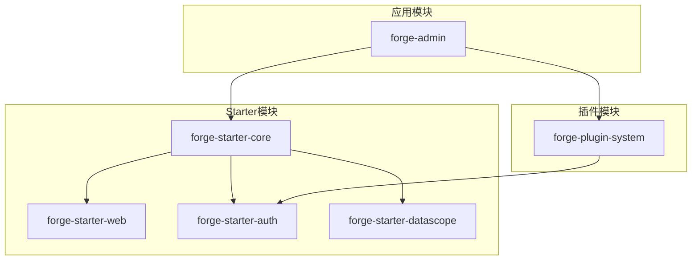
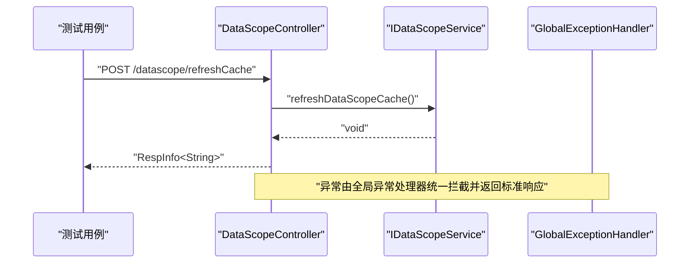
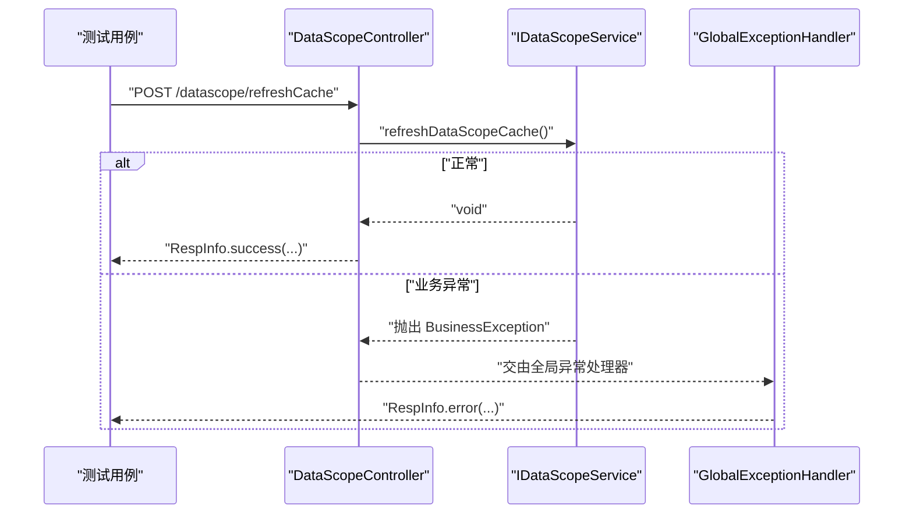
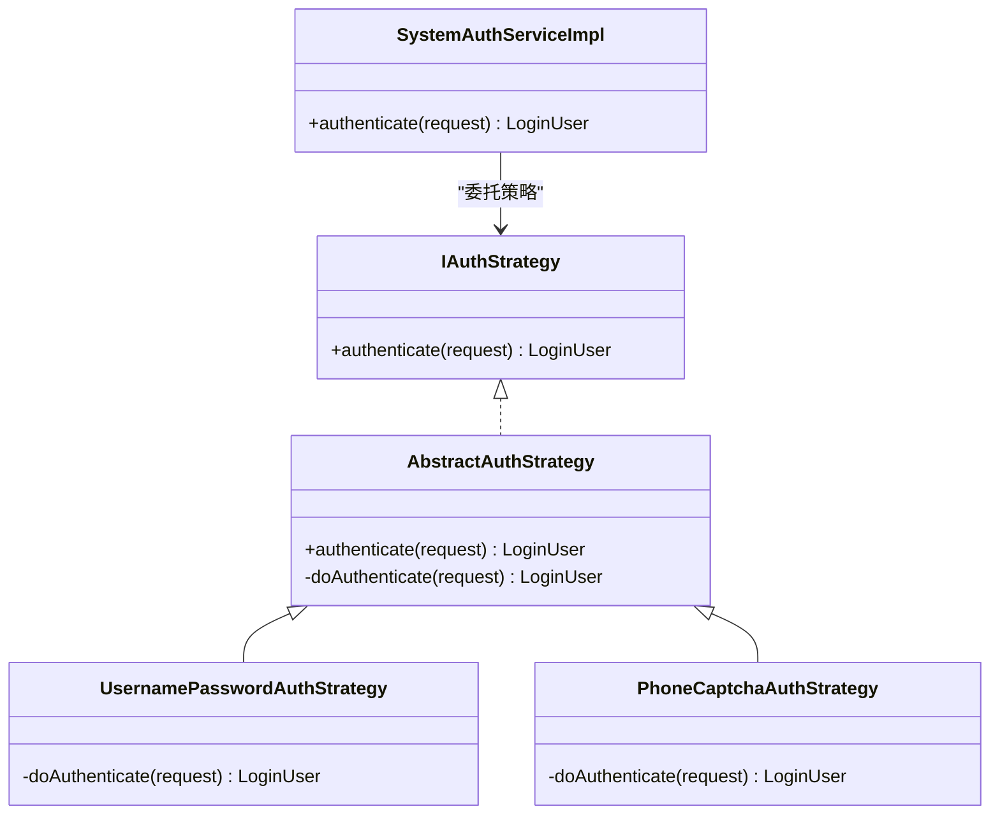
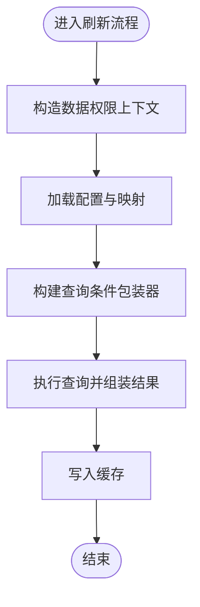
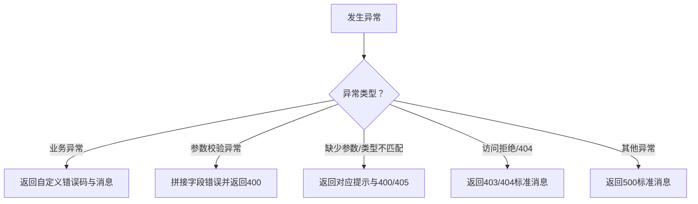
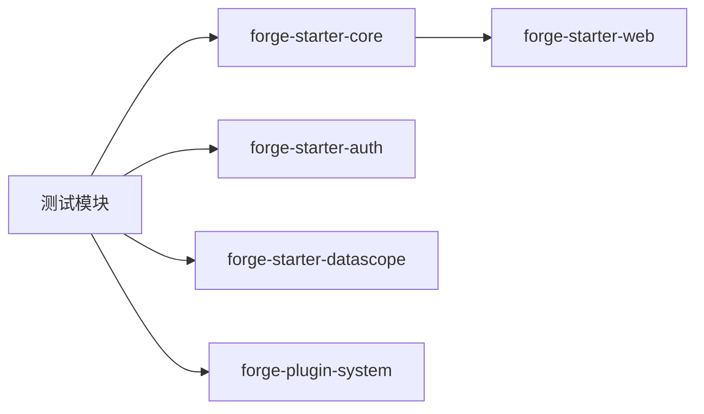

# 单元测试

<cite>
**本文引用的文件**
- [forge-dependencies/pom.xml](file://forge/forge-framework/forge-dependencies/pom.xml)
- [.flattened-pom.xml](file://forge/.flattened-pom.xml)
- [forge-starter-core/pom.xml](file://forge/forge-framework/forge-starter-parent/forge-starter-core/pom.xml)
- [forge-starter-web/pom.xml](file://forge/forge-framework/forge-starter-parent/forge-starter-web/pom.xml)
- [GlobalExceptionHandler.java](file://forge/forge-framework/forge-starter-parent/forge-starter-core/src/main/java/com/mdframe/forge/starter/core/exception/GlobalExceptionHandler.java)
- [BaseEntity.java](file://forge/forge-framework/forge-starter-parent/forge-starter-core/src/main/java/com/mdframe/forge/starter/core/domain/BaseEntity.java)
- [LoginUser.java](file://forge/forge-framework/forge-starter-parent/forge-starter-core/src/main/java/com/mdframe/forge/starter/core/session/LoginUser.java)
- [DataScopeController.java](file://forge/forge-framework/forge-starter-parent/forge-starter-datascope/src/main/java/com/mdframe/forge/starter/datascope/controller/DataScopeController.java)
- [DataScopeServiceImpl.java](file://forge/forge-framework/forge-starter-parent/forge-starter-datascope/src/main/java/com/mdframe/forge/starter/datascope/service/impl/DataScopeServiceImpl.java)
- [IAuthStrategy.java](file://forge/forge-framework/forge-starter-parent/forge-starter-auth/src/main/java/com/mdframe/forge/starter/auth/strategy/IAuthStrategy.java)
- [UsernamePasswordAuthStrategy.java](file://forge/forge-framework/forge-starter-parent/forge-starter-auth/src/main/java/com/mdframe/forge/starter/auth/strategy/UsernamePasswordAuthStrategy.java)
- [PhoneCaptchaAuthStrategy.java](file://forge/forge-framework/forge-starter-parent/forge-starter-auth/src/main/java/com/mdframe/forge/starter/auth/strategy/PhoneCaptchaAuthStrategy.java)
- [AbstractAuthStrategy.java](file://forge/forge-framework/forge-starter-parent/forge-starter-auth/src/main/java/com/mdframe/forge/starter/auth/strategy/AbstractAuthStrategy.java)
- [SystemAuthServiceImpl.java](file://forge/forge-framework/forge-plugin-parent/forge-plugin-system/src/main/java/com/mdframe/forge/plugin/system/service/impl/SystemAuthServiceImpl.java)
- [EXCEPTION_USAGE.md](file://forge/forge-framework/forge-starter-parent/forge-starter-core/EXCEPTION_USAGE.md)
</cite>

## 目录
1. [引言](#引言)
2. [项目结构](#项目结构)
3. [核心组件](#核心组件)
4. [架构总览](#架构总览)
5. [详细组件分析](#详细组件分析)
6. [依赖分析](#依赖分析)
7. [性能考虑](#性能考虑)
8. [故障排查指南](#故障排查指南)
9. [结论](#结论)
10. [附录](#附录)

## 引言
本指南面向Forge框架的单元测试实践，聚焦于使用JUnit 5与Mockito构建高质量的控制器、服务层与数据访问层测试。内容涵盖：
- 测试分层策略：控制器、服务、数据访问层的测试要点与Mockito使用
- 断言与模拟：@Mock/@Spy注解、when/then断言链、异常与边界条件测试
- 测试数据与夹具：测试数据准备、隔离与可重复性
- 覆盖率与规范：覆盖率目标、命名规范与组织结构
- 体系化建设：从单测到整体质量保障的闭环

## 项目结构
Forge采用多模块Maven工程，核心测试相关模块包括：
- starter模块：提供通用能力（如core、web、auth、datascope等），便于在各子系统中复用
- 插件模块：系统登录鉴权等业务插件，便于按需启用
- admin模块：管理端应用，集成上述starter与插件

下图展示与测试相关的关键模块关系：

图表来源
- [forge-starter-core/pom.xml](file://forge/forge-framework/forge-starter-parent/forge-starter-core/pom.xml#L1-L125)
- [forge-starter-web/pom.xml](file://forge/forge-framework/forge-starter-parent/forge-starter-web/pom.xml#L1-L63)
- [forge-dependencies/pom.xml](file://forge/forge-framework/forge-dependencies/pom.xml#L276-L383)

章节来源
- [forge-starter-core/pom.xml](file://forge/forge-framework/forge-starter-parent/forge-starter-core/pom.xml#L1-L125)
- [forge-starter-web/pom.xml](file://forge/forge-framework/forge-starter-parent/forge-starter-web/pom.xml#L1-L63)
- [forge-dependencies/pom.xml](file://forge/forge-framework/forge-dependencies/pom.xml#L276-L383)

## 核心组件
- 控制器层：负责HTTP请求入口与响应封装，典型如数据权限管理控制器
- 服务层：业务编排与策略调用，典型如系统登录鉴权服务
- 异常处理：统一异常转换与响应格式化，典型如全局异常处理器
- 数据模型：基础实体与会话信息，典型如实体基类与登录用户信息
- 数据访问层：通过MyBatis-Plus进行数据库操作，典型如数据权限服务实现

章节来源
- [DataScopeController.java](file://forge/forge-framework/forge-starter-parent/forge-starter-datascope/src/main/java/com/mdframe/forge/starter/datascope/controller/DataScopeController.java#L1-L30)
- [SystemAuthServiceImpl.java](file://forge/forge-framework/forge-plugin-parent/forge-plugin-system/src/main/java/com/mdframe/forge/plugin/system/service/impl/SystemAuthServiceImpl.java#L66-L66)
- [GlobalExceptionHandler.java](file://forge/forge-framework/forge-starter-parent/forge-starter-core/src/main/java/com/mdframe/forge/starter/core/exception/GlobalExceptionHandler.java#L1-L175)
- [BaseEntity.java](file://forge/forge-framework/forge-starter-parent/forge-starter-core/src/main/java/com/mdframe/forge/starter/core/domain/BaseEntity.java#L1-L52)
- [LoginUser.java](file://forge/forge-framework/forge-starter-parent/forge-starter-core/src/main/java/com/mdframe/forge/starter/core/session/LoginUser.java#L1-L119)
- [DataScopeServiceImpl.java](file://forge/forge-framework/forge-starter-parent/forge-starter-datascope/src/main/java/com/mdframe/forge/starter/datascope/service/impl/DataScopeServiceImpl.java#L1-L19)

## 架构总览
下图展示控制器、服务与异常处理在测试中的交互关系：

图表来源
- [DataScopeController.java](file://forge/forge-framework/forge-starter-parent/forge-starter-datascope/src/main/java/com/mdframe/forge/starter/datascope/controller/DataScopeController.java#L25-L29)
- [GlobalExceptionHandler.java](file://forge/forge-framework/forge-starter-parent/forge-starter-core/src/main/java/com/mdframe/forge/starter/core/exception/GlobalExceptionHandler.java#L35-L42)

## 详细组件分析

### 控制器测试：数据权限刷新接口
- 测试目标
  - 正常路径：调用服务刷新缓存并返回成功响应
  - 异常路径：服务抛出业务异常或运行时异常，由全局异常处理器统一转换
- Mock策略
  - 使用@Mock对服务接口进行模拟
  - 使用@BeforeEach准备控制器实例与响应封装对象
- 断言要点
  - 响应码与消息体一致性
  - 异常场景下响应码与错误信息符合预期

图表来源
- [DataScopeController.java](file://forge/forge-framework/forge-starter-parent/forge-starter-datascope/src/main/java/com/mdframe/forge/starter/datascope/controller/DataScopeController.java#L25-L29)
- [GlobalExceptionHandler.java](file://forge/forge-framework/forge-starter-parent/forge-starter-core/src/main/java/com/mdframe/forge/starter/core/exception/GlobalExceptionHandler.java#L35-L42)

章节来源
- [DataScopeController.java](file://forge/forge-framework/forge-starter-parent/forge-starter-datascope/src/main/java/com/mdframe/forge/starter/datascope/controller/DataScopeController.java#L1-L30)
- [GlobalExceptionHandler.java](file://forge/forge-framework/forge-starter-parent/forge-starter-core/src/main/java/com/mdframe/forge/starter/core/exception/GlobalExceptionHandler.java#L1-L175)

### 服务层测试：系统登录鉴权策略
- 测试目标
  - 策略抽象与具体策略行为验证
  - 系统服务组合策略并返回登录用户信息
- Mock策略
  - 使用@Mock模拟策略接口与外部依赖
  - 使用@Spy对真实策略进行部分模拟
- 断言要点
  - 策略选择与执行顺序
  - 登录用户属性完整性与角色判定

图表来源
- [IAuthStrategy.java](file://forge/forge-framework/forge-starter-parent/forge-starter-auth/src/main/java/com/mdframe/forge/starter/auth/strategy/IAuthStrategy.java#L17-L17)
- [AbstractAuthStrategy.java](file://forge/forge-framework/forge-starter-parent/forge-starter-auth/src/main/java/com/mdframe/forge/starter/auth/strategy/AbstractAuthStrategy.java#L38-L67)
- [UsernamePasswordAuthStrategy.java](file://forge/forge-framework/forge-starter-parent/forge-starter-auth/src/main/java/com/mdframe/forge/starter/auth/strategy/UsernamePasswordAuthStrategy.java#L22-L22)
- [PhoneCaptchaAuthStrategy.java](file://forge/forge-framework/forge-starter-parent/forge-starter-auth/src/main/java/com/mdframe/forge/starter/auth/strategy/PhoneCaptchaAuthStrategy.java#L25-L25)
- [SystemAuthServiceImpl.java](file://forge/forge-framework/forge-plugin-parent/forge-plugin-system/src/main/java/com/mdframe/forge/plugin/system/service/impl/SystemAuthServiceImpl.java#L66-L66)

章节来源
- [IAuthStrategy.java](file://forge/forge-framework/forge-starter-parent/forge-starter-auth/src/main/java/com/mdframe/forge/starter/auth/strategy/IAuthStrategy.java#L1-L17)
- [AbstractAuthStrategy.java](file://forge/forge-framework/forge-starter-parent/forge-starter-auth/src/main/java/com/mdframe/forge/starter/auth/strategy/AbstractAuthStrategy.java#L1-L67)
- [UsernamePasswordAuthStrategy.java](file://forge/forge-framework/forge-starter-parent/forge-starter-auth/src/main/java/com/mdframe/forge/starter/auth/strategy/UsernamePasswordAuthStrategy.java#L1-L22)
- [PhoneCaptchaAuthStrategy.java](file://forge/forge-framework/forge-starter-parent/forge-starter-auth/src/main/java/com/mdframe/forge/starter/auth/strategy/PhoneCaptchaAuthStrategy.java#L1-L25)
- [SystemAuthServiceImpl.java](file://forge/forge-framework/forge-plugin-parent/forge-plugin-system/src/main/java/com/mdframe/forge/plugin/system/service/impl/SystemAuthServiceImpl.java#L60-L70)

### 数据访问层测试：数据权限服务实现
- 测试目标
  - 缓存刷新流程与上下文构造
  - 与会话、查询包装器、枚举类型的协作
- Mock策略
  - 使用@Mock模拟Mapper与缓存组件
  - 使用@Spy对服务实现进行部分模拟
- 断言要点
  - 缓存键生成与过期策略
  - 查询条件与上下文参数正确性

图表来源
- [DataScopeServiceImpl.java](file://forge/forge-framework/forge-starter-parent/forge-starter-datascope/src/main/java/com/mdframe/forge/starter/datascope/service/impl/DataScopeServiceImpl.java#L1-L19)

章节来源
- [DataScopeServiceImpl.java](file://forge/forge-framework/forge-starter-parent/forge-starter-datascope/src/main/java/com/mdframe/forge/starter/datascope/service/impl/DataScopeServiceImpl.java#L1-L19)

### 异常处理测试：全局异常处理器
- 测试目标
  - 各类异常的捕获与响应格式化
  - 特定异常（如业务异常、参数校验异常）的定制化处理
- 断言要点
  - 响应码与错误消息一致性
  - 请求URI记录与日志级别

图表来源
- [GlobalExceptionHandler.java](file://forge/forge-framework/forge-starter-parent/forge-starter-core/src/main/java/com/mdframe/forge/starter/core/exception/GlobalExceptionHandler.java#L35-L173)

章节来源
- [GlobalExceptionHandler.java](file://forge/forge-framework/forge-starter-parent/forge-starter-core/src/main/java/com/mdframe/forge/starter/core/exception/GlobalExceptionHandler.java#L1-L175)

### 数据模型测试：实体基类与登录用户
- 测试目标
  - 实体字段填充策略（创建/更新人、时间）
  - 登录用户属性与角色判定逻辑
- 断言要点
  - 字段默认值与时间格式
  - 角色与权限标识的布尔判定

章节来源
- [BaseEntity.java](file://forge/forge-framework/forge-starter-parent/forge-starter-core/src/main/java/com/mdframe/forge/starter/core/domain/BaseEntity.java#L1-L52)
- [LoginUser.java](file://forge/forge-framework/forge-starter-parent/forge-starter-core/src/main/java/com/mdframe/forge/starter/core/session/LoginUser.java#L1-L119)

## 依赖分析
- 测试运行时依赖
  - JUnit 5与Mockito：建议在各模块的测试范围中引入
  - Surefire插件：统一测试执行与编码设置
- 模块间耦合
  - 控制器依赖服务接口；服务依赖策略与数据访问；异常处理器对控制器透明
- 外部依赖
  - MyBatis-Plus、Sa-Token、Hutool等工具库在测试中通常通过Mock隔离

图表来源
- [forge-dependencies/pom.xml](file://forge/forge-framework/forge-dependencies/pom.xml#L276-L383)
- [.flattened-pom.xml](file://forge/.flattened-pom.xml#L163-L171)

章节来源
- [forge-dependencies/pom.xml](file://forge/forge-framework/forge-dependencies/pom.xml#L1-L487)
- [.flattened-pom.xml](file://forge/.flattened-pom.xml#L163-L171)

## 性能考虑
- 测试执行性能
  - 使用Mock减少IO与外部依赖
  - 将耗时逻辑（如缓存、网络）通过Mock或本地化替代
- 覆盖率与回归
  - 关键分支与异常路径必须覆盖
  - 对热点业务（鉴权、异常处理、数据权限）提高覆盖率权重

## 故障排查指南
- 常见问题
  - 响应格式不一致：检查全局异常处理器与控制器返回封装
  - 参数校验失败：确认@Valid/@Validated使用与字段约束
  - 空指针与非法参数：结合业务异常工具类进行前置校验
- 排查步骤
  - 逐步缩小到具体组件（控制器/服务/策略/异常处理）
  - 使用Mock验证输入输出与调用链
  - 结合日志与异常栈定位根因

章节来源
- [EXCEPTION_USAGE.md](file://forge/forge-framework/forge-starter-parent/forge-starter-core/EXCEPTION_USAGE.md#L140-L265)
- [GlobalExceptionHandler.java](file://forge/forge-framework/forge-starter-parent/forge-starter-core/src/main/java/com/mdframe/forge/starter/core/exception/GlobalExceptionHandler.java#L1-L175)

## 结论
通过分层测试与Mockito模拟，Forge框架可在控制器、服务与数据访问层建立稳定可靠的单元测试体系。配合全局异常处理与业务异常工具类，能够有效提升系统的正确性与可维护性。

## 附录

### 测试覆盖率与规范
- 覆盖率目标
  - 关键业务模块行覆盖率≥80%，分支覆盖率≥60%
- 命名规范
  - 测试类：被测类名+Test 或 被测类名+Tests
  - 测试方法：testXxx（正向）、testXxx_WhenCondition_ThenExpect（条件-场景-期望）
- 组织结构
  - 按模块划分测试包，与主代码结构保持一致
  - 使用测试夹具（Fixture）统一准备测试数据与Mock对象

### 测试数据准备与环境隔离
- 测试夹具
  - 使用Builder模式或工厂方法构造测试对象
  - 对外部依赖（数据库、缓存、远程服务）全部Mock
- 环境隔离
  - 使用内存型数据源或嵌入式数据库
  - 通过Profile或测试配置隔离不同环境

### 异常处理与边界条件测试示例路径
- 业务异常与参数校验异常
  - 示例参考：[EXCEPTION_USAGE.md](file://forge/forge-framework/forge-starter-parent/forge-starter-core/EXCEPTION_USAGE.md#L140-L265)
- 全局异常处理器
  - 参考：[GlobalExceptionHandler.java](file://forge/forge-framework/forge-starter-parent/forge-starter-core/src/main/java/com/mdframe/forge/starter/core/exception/GlobalExceptionHandler.java#L35-L173)